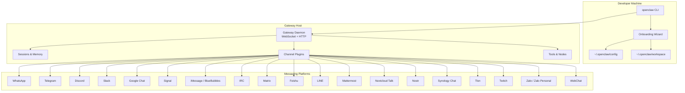
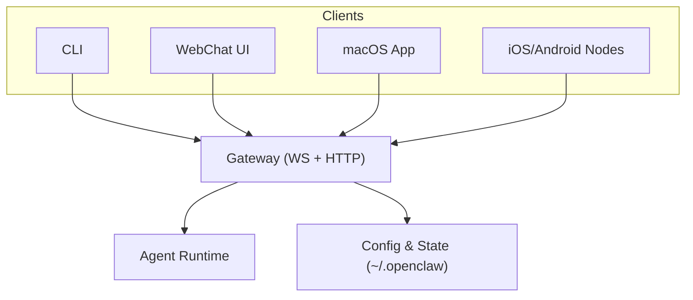
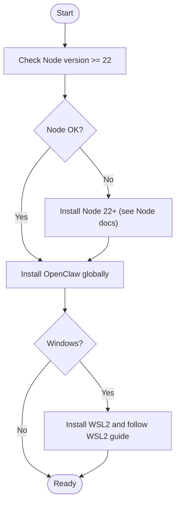
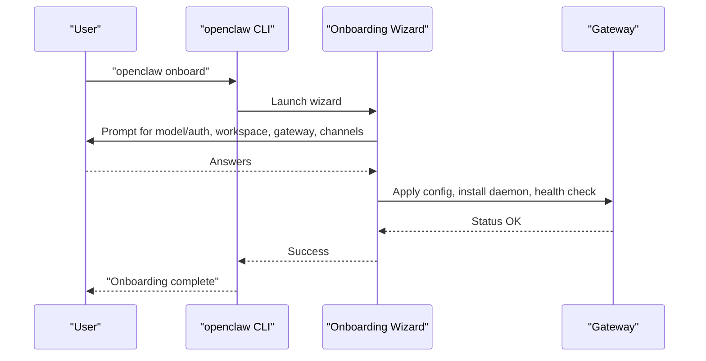
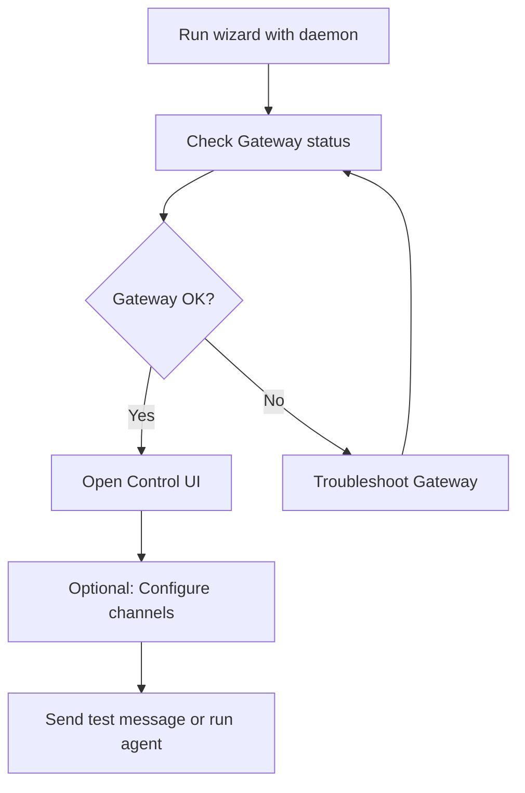
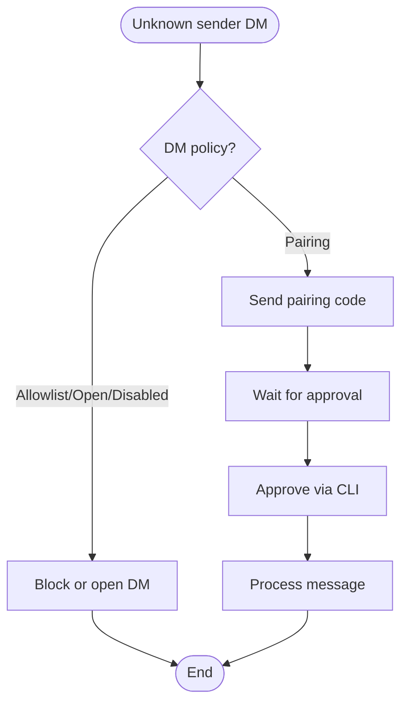
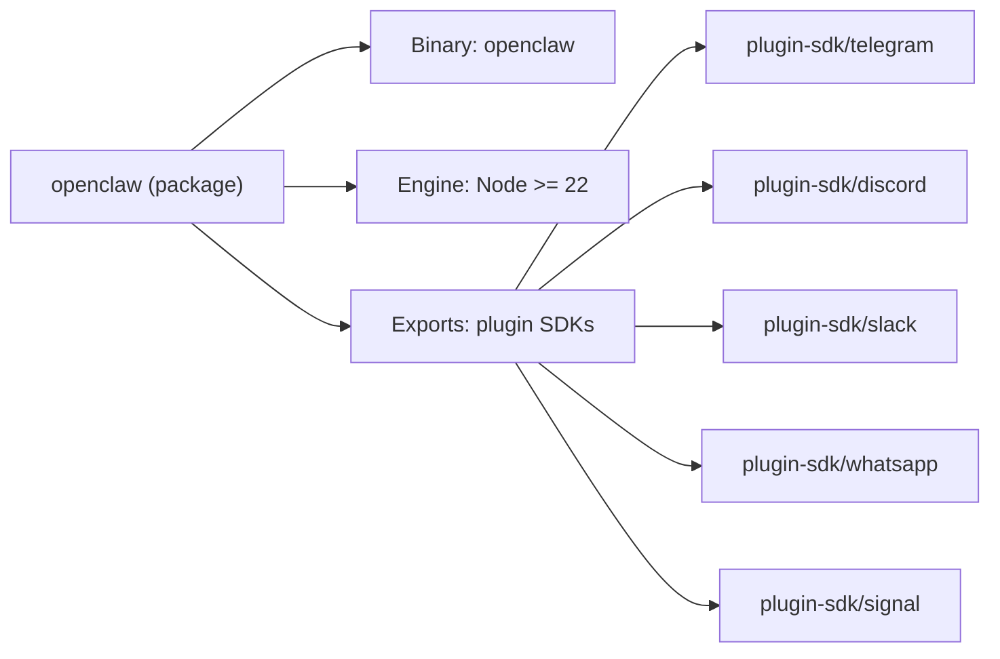

# Getting Started

<cite>
**Referenced Files in This Document**
- [README.md](file://README.md)
- [package.json](file://package.json)
- [docs/start/getting-started.md](file://docs/start/getting-started.md)
- [docs/install/node.md](file://docs/install/node.md)
- [docs/start/onboarding.md](file://docs/start/onboarding.md)
- [docs/start/wizard.md](file://docs/start/wizard.md)
- [docs/cli/onboard.md](file://docs/cli/onboard.md)
- [docs/channels/index.md](file://docs/channels/index.md)
- [docs/platforms/windows.md](file://docs/platforms/windows.md)
- [docs/platforms/macos.md](file://docs/platforms/macos.md)
- [docs/cli/message.md](file://docs/cli/message.md)
- [docs/cli/agent.md](file://docs/cli/agent.md)
- [docs/security/README.md](file://docs/security/README.md)
- [docs/channels/pairing.md](file://docs/channels/pairing.md)
- [docs/gateway/security/index.md](file://docs/gateway/security/index.md)
</cite>

## Table of Contents
1. [Introduction](#introduction)
2. [Project Structure](#project-structure)
3. [Core Components](#core-components)
4. [Architecture Overview](#architecture-overview)
5. [Detailed Component Analysis](#detailed-component-analysis)
6. [Dependency Analysis](#dependency-analysis)
7. [Performance Considerations](#performance-considerations)
8. [Troubleshooting Guide](#troubleshooting-guide)
9. [Conclusion](#conclusion)
10. [Appendices](#appendices)

## Introduction
OpenClaw is a personal AI assistant platform that runs on your own devices. It connects to 20+ messaging platforms (WhatsApp, Telegram, Discord, Slack, Google Chat, Signal, iMessage, BlueBubbles, IRC, Microsoft Teams, Matrix, Feishu, LINE, Mattermost, Nextcloud Talk, Nostr, Synology Chat, Tlon, Twitch, Zalo, Zalo Personal, WebChat) and can speak/listen on macOS/iOS/Android. The Gateway is the central control plane that orchestrates sessions, channels, tools, and events.

Key highlights:
- Local-first assistant with a single control plane (Gateway)
- Multi-channel inbox and multi-agent routing
- Voice Wake and Talk Mode on macOS/iOS/Android
- Live Canvas and companion apps
- Wizard-driven onboarding and skills platform

**Section sources**
- [README.md](file://README.md#L21-L27)
- [README.md](file://README.md#L126-L136)

## Project Structure
At a high level, OpenClaw consists of:
- A CLI and Gateway runtime that manage configuration, sessions, and integrations
- A wizard that guides first-time setup for models, auth, workspace, channels, and skills
- A wide ecosystem of channel plugins and skills
- Companion apps for macOS, iOS, and Android

**Diagram sources**
- [README.md](file://README.md#L185-L202)
- [docs/channels/index.md](file://docs/channels/index.md#L14-L38)

**Section sources**
- [README.md](file://README.md#L185-L202)
- [docs/channels/index.md](file://docs/channels/index.md#L14-L38)

## Core Components
- Gateway: Single control plane for sessions, channels, tools, and events. It exposes a WebSocket and HTTP surface (including the Control UI).
- CLI: Provides commands for onboarding, gateway lifecycle, agent runs, message sending, and more.
- Wizard: Guides you through model/auth, workspace, gateway, channels, daemon, and skills setup.
- Channels: Integrations for 20+ messaging platforms via plugins.
- Agents and Skills: Workspaces and skills define the assistant’s behavior and capabilities.

Practical first steps:
- Install Node.js 22+
- Run the onboarding wizard to configure auth, gateway, and channels
- Start the Gateway and open the Control UI
- Optionally send a test message or run an agent turn

**Section sources**
- [docs/start/getting-started.md](file://docs/start/getting-started.md#L28-L77)
- [docs/start/wizard.md](file://docs/start/wizard.md#L10-L25)
- [docs/cli/onboard.md](file://docs/cli/onboard.md#L8-L28)

## Architecture Overview
OpenClaw’s runtime architecture centers around the Gateway as the control plane. Clients (CLI, WebChat UI, companion apps, nodes) connect over WebSocket and HTTP to the Gateway. Channels and tools are integrated via plugins and the agent runtime.

**Diagram sources**
- [README.md](file://README.md#L185-L202)
- [docs/platforms/macos.md](file://docs/platforms/macos.md#L9-L25)

**Section sources**
- [README.md](file://README.md#L185-L202)
- [docs/platforms/macos.md](file://docs/platforms/macos.md#L9-L25)

## Detailed Component Analysis

### Installation and Environment Setup
- Node.js requirement: Node 22 or newer
- Preferred install method: Use the official installer script or package manager
- On Windows: Recommended via WSL2 for consistent Linux tooling

Step-by-step:
1. Confirm Node version meets the requirement
2. Install OpenClaw globally using your preferred package manager
3. On Windows, ensure WSL2 is installed and follow the WSL2-specific steps

**Diagram sources**
- [docs/install/node.md](file://docs/install/node.md#L14-L21)
- [docs/platforms/windows.md](file://docs/platforms/windows.md#L11-L16)

**Section sources**
- [docs/install/node.md](file://docs/install/node.md#L12-L21)
- [docs/platforms/windows.md](file://docs/platforms/windows.md#L11-L16)

### Onboarding Wizard Workflow
The wizard is the recommended path for first-time setup on macOS, Linux, and Windows (via WSL2). It configures:
- Model and auth (API keys, OAuth, or custom providers)
- Workspace defaults
- Gateway (port, bind, auth, Tailscale exposure)
- Channels (WhatsApp, Telegram, Discord, etc.)
- Daemon installation (LaunchAgent/systemd)
- Health check and skills installation

QuickStart vs Advanced:
- QuickStart: sane defaults (local gateway, token auth, coding tool profile, DM isolation)
- Advanced: full control over every step

**Diagram sources**
- [docs/start/wizard.md](file://docs/start/wizard.md#L10-L25)
- [docs/cli/onboard.md](file://docs/cli/onboard.md#L8-L28)

**Section sources**
- [docs/start/wizard.md](file://docs/start/wizard.md#L10-L62)
- [docs/cli/onboard.md](file://docs/cli/onboard.md#L8-L28)

### Initial Setup Steps
- Run the wizard with daemon installation
- Verify Gateway status
- Open the Control UI (WebChat) to chat locally
- Optional: configure channels and send a test message

**Diagram sources**
- [docs/start/getting-started.md](file://docs/start/getting-started.md#L55-L77)
- [docs/cli/message.md](file://docs/cli/message.md#L9-L18)

**Section sources**
- [docs/start/getting-started.md](file://docs/start/getting-started.md#L28-L82)

### Practical Examples

#### Sending Messages
- Use the message command to send to a specific channel and target
- Target formats vary by channel (E.164 for WhatsApp, @username for Telegram, etc.)
- Optional flags include media, reply-to, thread-id, and more

Example commands:
- Send a message to a Telegram chat
- React in Slack or Signal
- Create polls in Discord or Telegram

**Section sources**
- [docs/cli/message.md](file://docs/cli/message.md#L14-L52)
- [docs/cli/message.md](file://docs/cli/message.md#L185-L261)

#### Basic Agent Usage
- Run a single agent turn via the Gateway
- Deliver the response back to a connected channel if desired
- Use agent-specific flags for thinking level, session targeting, and delivery

**Section sources**
- [docs/cli/agent.md](file://docs/cli/agent.md#L8-L29)

#### Configuring Channels
- Supported channels include WhatsApp, Telegram, Discord, Slack, Google Chat, Signal, iMessage/BlueBubbles, IRC, Matrix, Feishu, LINE, Mattermost, Nextcloud Talk, Nostr, Synology Chat, Tlon, Twitch, Zalo, Zalo Personal, and WebChat
- Fastest setup is often Telegram (bot token), while WhatsApp requires QR pairing and more state

**Section sources**
- [docs/channels/index.md](file://docs/channels/index.md#L14-L48)

### Security Considerations

#### DM Access and Pairing
- Default DM policy is pairing for many channels: unknown senders receive a short pairing code and their message is not processed until approved
- Approve via CLI commands and review where state is stored
- Treat pairing allowlists as sensitive access controls

**Diagram sources**
- [docs/channels/pairing.md](file://docs/channels/pairing.md#L20-L40)
- [docs/gateway/security/index.md](file://docs/gateway/security/index.md#L448-L465)

**Section sources**
- [docs/channels/pairing.md](file://docs/channels/pairing.md#L20-L56)
- [docs/gateway/security/index.md](file://docs/gateway/security/index.md#L448-L465)

#### Security Guidance
- Use the hardened baseline: local-only bind, token auth, minimal tool profile, DM isolation
- Audit regularly and harden exposure (bind/auth, Tailscale, browser control)
- Keep credentials and state private; avoid cloud-synced paths for state

**Section sources**
- [docs/gateway/security/index.md](file://docs/gateway/security/index.md#L145-L173)
- [docs/gateway/security/index.md](file://docs/gateway/security/index.md#L212-L222)
- [docs/security/README.md](file://docs/security/README.md#L1-L18)

### Recommended Development Environment
- macOS and Linux: native support and optimal tooling
- Windows: recommended via WSL2 for consistent Linux runtime and tooling compatibility
- Companion apps: macOS menu bar app, iOS/Android nodes available

**Section sources**
- [docs/platforms/windows.md](file://docs/platforms/windows.md#L11-L16)
- [docs/platforms/macos.md](file://docs/platforms/macos.md#L9-L25)

## Dependency Analysis
OpenClaw’s CLI is distributed as a Node.js package with a global binary entry. The package defines engine requirements and exports plugin SDKs for various channels.

**Diagram sources**
- [package.json](file://package.json#L16-L21)
- [package.json](file://package.json#L37-L216)

**Section sources**
- [package.json](file://package.json#L16-L21)
- [package.json](file://package.json#L37-L216)

## Performance Considerations
- Keep inbound DMs locked down to reduce processing overhead and risk
- Prefer mention gating in groups and avoid “always-on” bots in public rooms
- Use the latest generation, instruction-hardened models for tool-enabled agents
- Limit high-risk tools and sandbox where possible

[No sources needed since this section provides general guidance]

## Troubleshooting Guide
Common issues and remedies:
- Node version too low: upgrade to Node 22+
- Command not found: ensure npm’s global bin is on PATH
- Permission errors on global installs: adjust npm prefix and PATH
- Gateway not starting: verify daemon installation and token auth
- Windows WSL2 headless startup: enable linger and schedule WSL boot

**Section sources**
- [docs/install/node.md](file://docs/install/node.md#L89-L139)
- [docs/platforms/windows.md](file://docs/platforms/windows.md#L58-L101)
- [docs/start/getting-started.md](file://docs/start/getting-started.md#L84-L102)

## Conclusion
You are now ready to install OpenClaw, run the onboarding wizard, and start chatting locally or connecting channels. Follow the security guidance to lock down DMs and tool access, and leverage the wizard and CLI for ongoing configuration and automation.

[No sources needed since this section summarizes without analyzing specific files]

## Appendices

### First-Time User Checklist
- Install Node 22+
- Install OpenClaw
- Run the wizard with daemon installation
- Verify Gateway status
- Open Control UI
- Optional: configure channels and send a test message

**Section sources**
- [docs/start/getting-started.md](file://docs/start/getting-started.md#L28-L82)

### Additional Resources
- Onboarding wizard reference and advanced options
- macOS app onboarding flow
- Platform guides for Windows (WSL2), Linux, macOS, iOS, Android
- Security and threat model documentation

**Section sources**
- [docs/start/wizard.md](file://docs/start/wizard.md#L112-L124)
- [docs/start/onboarding.md](file://docs/start/onboarding.md#L1-L92)
- [README.md](file://README.md#L415-L432)