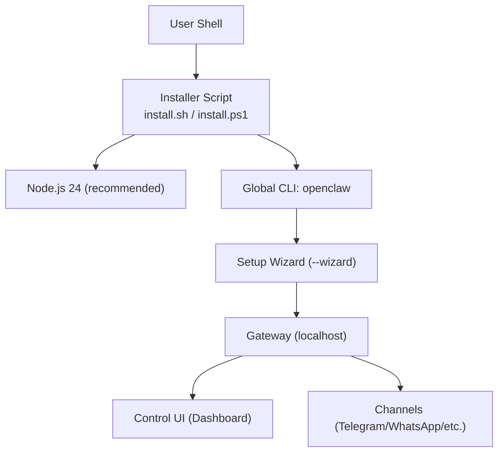
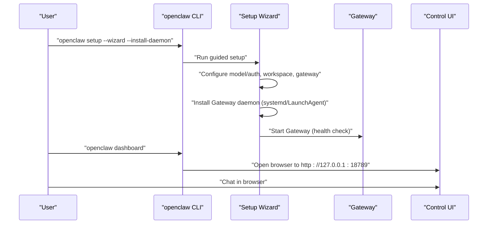
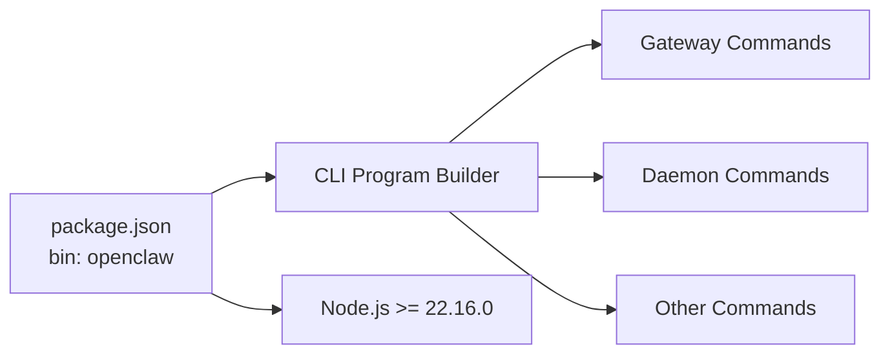

# Getting Started

<cite>
**Referenced Files in This Document**
- [README.md](file://README.md)
- [package.json](file://package.json)
- [docs/start/getting-started.md](file://docs/start/getting-started.md)
- [docs/start/wizard.md](file://docs/start/wizard.md)
- [docs/install/index.md](file://docs/install/index.md)
- [docs/platforms/windows.md](file://docs/platforms/windows.md)
- [docs/platforms/linux.md](file://docs/platforms/linux.md)
- [src/cli/daemon-cli.ts](file://src/cli/daemon-cli.ts)
- [src/cli/gateway-cli.ts](file://src/cli/gateway-cli.ts)
- [src/cli/program.ts](file://src/cli/program.ts)
</cite>

## Table of Contents
1. [Introduction](#introduction)
2. [Project Structure](#project-structure)
3. [Core Components](#core-components)
4. [Architecture Overview](#architecture-overview)
5. [Detailed Component Analysis](#detailed-component-analysis)
6. [Dependency Analysis](#dependency-analysis)
7. [Performance Considerations](#performance-considerations)
8. [Troubleshooting Guide](#troubleshooting-guide)
9. [Conclusion](#conclusion)
10. [Appendices](#appendices)

## Introduction
Welcome to OpenClaw. This guide helps you install OpenClaw on macOS, Linux, and Windows (via WSL2), run the onboarding wizard, and connect your first messaging channel. You will learn the fundamentals of channels, agents, and sessions along the way.

Key highlights:
- Recommended runtime: Node.js 24 (Node 22 LTS is also supported for compatibility).
- Preferred installation path: the installer script, which installs Node, the CLI, and launches the setup wizard.
- Onboarding wizard covers model/auth, workspace, gateway, channels, daemon, health check, and skills.
- The Gateway runs locally by default and exposes a WebSocket control plane and a browser-based Control UI.

**Section sources**
- [README.md:28-31](file://README.md#L28-L31)
- [docs/start/getting-started.md:20-27](file://docs/start/getting-started.md#L20-L27)

## Project Structure
This section focuses on the getting started workflow and relevant CLI components.

- Installation and setup:
  - Installer script for macOS/Linux/WSL2 and Windows PowerShell.
  - npm/pnpm/bun package manager options.
  - From-source build for contributors.
- Onboarding wizard:
  - QuickStart vs Advanced modes.
  - Daemon installation and health verification.
- Platform-specific notes:
  - Windows via WSL2.
  - Linux service installation and SSH tunneling for remote access.

```mermaid
graph TB
A["User Shell"] --> B["Installer Script<br/>install.sh / install.ps1"]
B --> C["Node.js 24 (recommended)"]
B --> D["Global CLI: openclaw"]
D --> E["Setup Wizard (--wizard)"]
E --> F["Gateway (localhost)"]
F --> G["Control UI (Dashboard)"]
F --> H["Channels (Telegram/WhatsApp/etc.)"]
```

**Diagram sources**
- [docs/install/index.md:35-70](file://docs/install/index.md#L35-L70)
- [docs/start/getting-started.md:28-77](file://docs/start/getting-started.md#L28-L77)

**Section sources**
- [docs/install/index.md:24-151](file://docs/install/index.md#L24-L151)
- [docs/start/getting-started.md:28-77](file://docs/start/getting-started.md#L28-L77)

## Core Components
- CLI entrypoint and commands:
  - The CLI binary is registered globally as openclaw.
  - Key commands for getting started: setup (wizard), gateway (run/status), dashboard, message send.
- Daemon management:
  - The wizard can install the Gateway as a user service (systemd on Linux, LaunchAgent on macOS).
  - Status and lifecycle commands are available via the CLI.
- Gateway control plane:
  - Runs a WebSocket server and serves the Control UI.
  - Supports token-based authentication and optional Tailscale exposure.

Practical pointers:
- Use the installer script to install Node and the CLI in one step.
- Run the wizard to configure model/auth, workspace, gateway, channels, and daemon.
- Verify the Gateway is running and open the Dashboard to chat.

**Section sources**
- [package.json:16-18](file://package.json#L16-L18)
- [docs/start/getting-started.md:28-77](file://docs/start/getting-started.md#L28-L77)
- [docs/start/wizard.md:17-31](file://docs/start/wizard.md#L17-L31)
- [src/cli/daemon-cli.ts:1-16](file://src/cli/daemon-cli.ts#L1-L16)

## Architecture Overview
High-level flow for a first-time setup and initial chat:

```mermaid
sequenceDiagram
participant U as "User"
participant CLI as "openclaw CLI"
participant W as "Setup Wizard"
participant GW as "Gateway"
participant UI as "Control UI"
U->>CLI : "openclaw setup --wizard --install-daemon"
CLI->>W : "Run guided setup"
W->>W : "Configure model/auth, workspace, gateway"
W->>W : "Install Gateway daemon (systemd/LaunchAgent)"
W->>GW : "Start Gateway (health check)"
U->>CLI : "openclaw dashboard"
CLI->>UI : "Open browser to http : //127.0.0.1 : 18789"
U->>UI : "Chat in browser"
```

**Diagram sources**
- [docs/start/wizard.md:66-84](file://docs/start/wizard.md#L66-L84)
- [docs/start/getting-started.md:55-76](file://docs/start/getting-started.md#L55-L76)

**Section sources**
- [docs/start/wizard.md:64-90](file://docs/start/wizard.md#L64-L90)
- [docs/start/getting-started.md:64-81](file://docs/start/getting-started.md#L64-L81)

## Detailed Component Analysis

### Installation Across Platforms
- macOS/Linux/WSL2:
  - Use the installer script to install Node 24 and the CLI, then run the wizard.
  - Alternative: npm or pnpm global install; bun for CLI-only usage.
- Windows:
  - Strongly recommended to use WSL2. The wizard and daemon installation prefer Linux services.
  - Native Windows has some limitations for non-interactive wizard and daemon install; fallbacks exist.

Step-by-step quickstart:
- Install via installer script.
- Run the wizard with daemon installation.
- Check Gateway status.
- Open the Dashboard.

**Section sources**
- [docs/install/index.md:35-103](file://docs/install/index.md#L35-L103)
- [docs/platforms/windows.md:11-28](file://docs/platforms/windows.md#L11-L28)
- [docs/platforms/linux.md:16-25](file://docs/platforms/linux.md#L16-L25)
- [docs/start/getting-started.md:28-77](file://docs/start/getting-started.md#L28-L77)

### Onboarding Wizard Workflow
The wizard guides you through:
- Model and authentication (API key, OAuth, or setup-token).
- Workspace location and defaults.
- Gateway configuration (port, bind, auth mode, Tailscale exposure).
- Channel configuration (Telegram, WhatsApp, Discord, Google Chat, etc.).
- Daemon installation (systemd/LaunchAgent) and health verification.
- Skills installation.

QuickStart vs Advanced:
- QuickStart applies sensible defaults for a local setup.
- Advanced exposes every step for full control.

Non-interactive usage:
- Use --non-interactive and appropriate flags for scripting.
- Token SecretRef mode requires environment variables to be set beforehand.

**Section sources**
- [docs/start/wizard.md:44-90](file://docs/start/wizard.md#L44-L90)
- [docs/start/wizard.md:112-118](file://docs/start/wizard.md#L112-L118)

### Daemon Setup and Lifecycle
- The wizard can install the Gateway as a user service:
  - Linux: systemd user unit.
  - macOS: LaunchAgent.
- Status and lifecycle commands:
  - Start, stop, restart, uninstall, and status checks are available.
- Health verification:
  - The wizard performs a post-install health check to ensure the Gateway is running.

**Section sources**
- [docs/start/wizard.md:79-84](file://docs/start/wizard.md#L79-L84)
- [src/cli/daemon-cli.ts:1-16](file://src/cli/daemon-cli.ts#L1-L16)

### Basic Configuration and First Chat
- Gateway status:
  - Use the status command to verify the service is running.
- Dashboard:
  - Open the browser-based Control UI to chat without configuring channels.
- Sending a test message:
  - Configure a channel first, then use the message send command with a target and message.

Environment variables:
- OPENCLAW_HOME, OPENCLAW_STATE_DIR, OPENCLAW_CONFIG_PATH for customizing paths.

**Section sources**
- [docs/start/getting-started.md:64-102](file://docs/start/getting-started.md#L64-L102)
- [docs/start/getting-started.md:104-113](file://docs/start/getting-started.md#L104-L113)

### Connecting Your First Messaging Channel
- The wizard includes a guided step to configure channels (Telegram, WhatsApp, Discord, Google Chat, etc.).
- After setup, verify channel configuration and test sending a message.
- For DM safety, review pairing and allowlists.

**Section sources**
- [docs/start/wizard.md:78-84](file://docs/start/wizard.md#L78-L84)
- [docs/start/getting-started.md:94-102](file://docs/start/getting-started.md#L94-L102)

### Practical Examples
- Install and run wizard:
  - Use the installer script, then run the wizard with daemon installation.
- Check Gateway:
  - Use the status command to verify the service.
- Open Dashboard:
  - Launch the browser UI to chat.
- Send a test message:
  - Configure a channel, then send a message via the CLI.

**Section sources**
- [docs/start/getting-started.md:28-77](file://docs/start/getting-started.md#L28-L77)
- [docs/start/getting-started.md:94-102](file://docs/start/getting-started.md#L94-L102)

### Fundamental Concepts: Channels, Agents, and Sessions
- Channels:
  - Messaging surfaces such as Telegram, WhatsApp, Discord, Google Chat, etc.
- Agents:
  - Workspaces with injected prompts and skills; each agent has its own sessions and configuration.
- Sessions:
  - Conversational contexts; the wizard sets defaults for DM scoping and tool policies.

**Section sources**
- [docs/start/wizard.md:66-84](file://docs/start/wizard.md#L66-L84)
- [docs/start/getting-started.md:125-136](file://docs/start/getting-started.md#L125-L136)

## Dependency Analysis
- CLI entrypoint:
  - The package.json bin field registers the openclaw executable.
- Program construction:
  - The CLI program is built dynamically and exposes commands for gateway, daemon, and others.
- Runtime requirements:
  - Node.js version constraints are defined in package.json engines.

```mermaid
graph LR
P["package.json<br/>bin: openclaw"] --> PRG["CLI Program Builder"]
PRG --> GW["Gateway Commands"]
PRG --> DA["Daemon Commands"]
PRG --> OT["Other Commands"]
P --> ENG["Node.js >= 22.16.0"]
```

**Diagram sources**
- [package.json:16-18](file://package.json#L16-L18)
- [package.json:437-440](file://package.json#L437-L440)
- [src/cli/program.ts:1-3](file://src/cli/program.ts#L1-L3)

**Section sources**
- [package.json:16-18](file://package.json#L16-L18)
- [package.json:437-440](file://package.json#L437-L440)
- [src/cli/program.ts:1-3](file://src/cli/program.ts#L1-L3)

## Performance Considerations
- Use Node 24 for optimal performance and compatibility.
- On Linux, prefer systemd user services for reliable startup and restart behavior.
- For remote access, use SSH tunneling to securely reach the Gateway dashboard.

[No sources needed since this section provides general guidance]

## Troubleshooting Guide
Common issues and resolutions:
- openclaw not found:
  - Ensure the global npm prefix bin directory is in your PATH.
- PATH diagnosis and fix:
  - Use the diagnostic steps to locate the prefix and add it to PATH.
- Windows-specific caveats:
  - Non-interactive wizard may expect a reachable local Gateway; use --skip-health when appropriate.
  - Daemon install prefers Scheduled Tasks; if blocked, a Startup-folder fallback is used.

**Section sources**
- [docs/install/index.md:191-214](file://docs/install/index.md#L191-L214)
- [docs/platforms/windows.md:39-62](file://docs/platforms/windows.md#L39-L62)

## Conclusion
You are now ready to install OpenClaw, run the onboarding wizard, and start chatting via the Control UI or your configured channels. Review the wizard outputs and environment variables for customization, and consult the platform guides for Windows and Linux specifics.

[No sources needed since this section summarizes without analyzing specific files]

## Appendices

### Appendix A: Quick Commands Reference
- Install and run wizard:
  - Use the installer script, then run the wizard with daemon installation.
- Check Gateway:
  - Use the status command to verify the service.
- Open Dashboard:
  - Launch the browser UI to chat.
- Send a test message:
  - Configure a channel, then send a message via the CLI.

**Section sources**
- [docs/start/getting-started.md:28-77](file://docs/start/getting-started.md#L28-L77)
- [docs/start/getting-started.md:94-102](file://docs/start/getting-started.md#L94-L102)