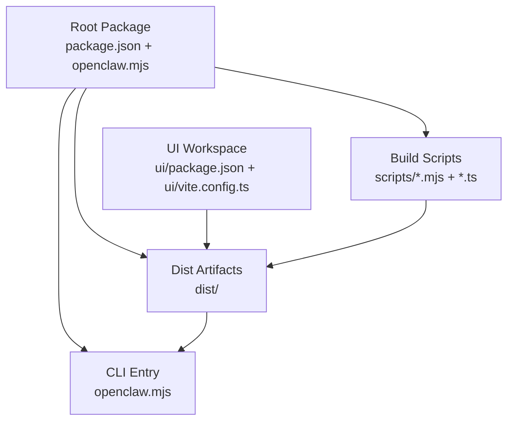
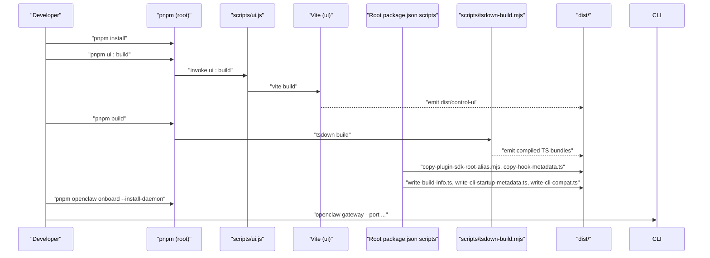
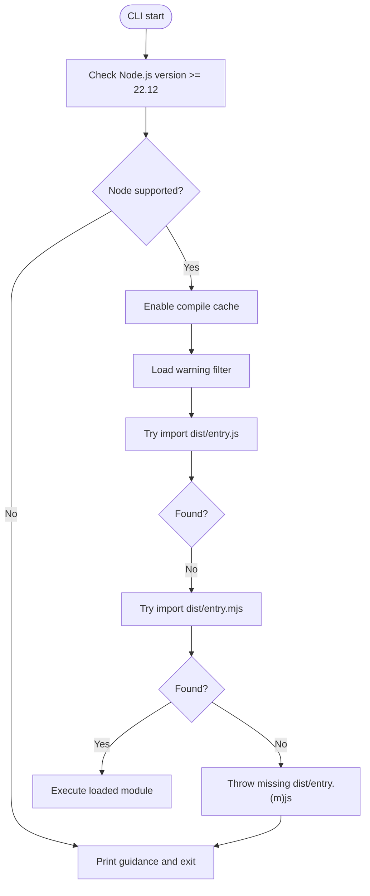
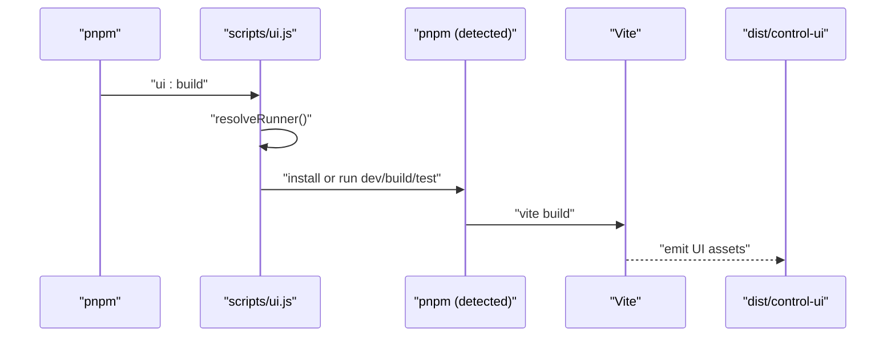
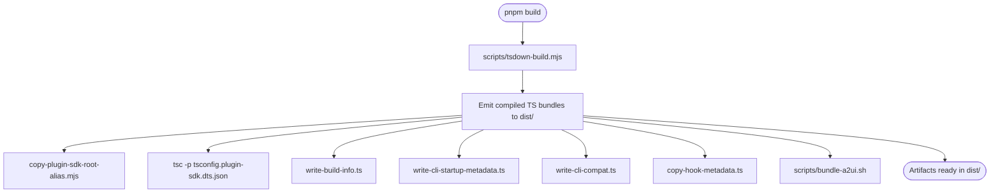
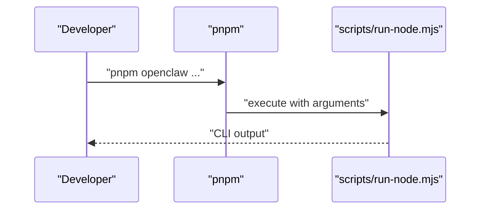
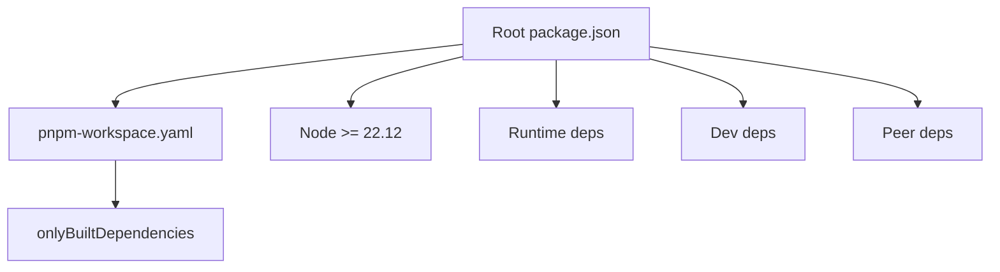

# Build From Source

<cite>
**Referenced Files in This Document**
- [README.md](file://README.md)
- [package.json](file://package.json)
- [pnpm-workspace.yaml](file://pnpm-workspace.yaml)
- [openclaw.mjs](file://openclaw.mjs)
- [ui/package.json](file://ui/package.json)
- [ui/vite.config.ts](file://ui/vite.config.ts)
- [scripts/ui.js](file://scripts/ui.js)
- [scripts/tsdown-build.mjs](file://scripts/tsdown-build.mjs)
- [scripts/write-build-info.ts](file://scripts/write-build-info.ts)
- [scripts/write-cli-startup-metadata.ts](file://scripts/write-cli-startup-metadata.ts)
- [scripts/write-cli-compat.ts](file://scripts/write-cli-compat.ts)
- [scripts/copy-plugin-sdk-root-alias.mjs](file://scripts/copy-plugin-sdk-root-alias.mjs)
- [scripts/copy-hook-metadata.ts](file://scripts/copy-hook-metadata.ts)
</cite>

## Table of Contents
1. [Introduction](#introduction)
2. [Project Structure](#project-structure)
3. [Core Components](#core-components)
4. [Architecture Overview](#architecture-overview)
5. [Detailed Component Analysis](#detailed-component-analysis)
6. [Dependency Analysis](#dependency-analysis)
7. [Performance Considerations](#performance-considerations)
8. [Troubleshooting Guide](#troubleshooting-guide)
9. [Conclusion](#conclusion)

## Introduction
This document explains how to build OpenClaw from source, covering repository setup, dependency installation with pnpm, UI building, main application compilation, and linking for global CLI availability. It also provides troubleshooting guidance for common build issues and development environment setup, along with guidance for contributors and advanced users requiring custom builds.

## Project Structure
OpenClaw is a monorepo organized around a root package and several workspaces:
- Root package: orchestrates build scripts, CLI entry, and distribution artifacts.
- UI workspace: a Vite-based control UI built into the distribution.
- Extensions and packages: plugin SDK and extension packages included in the build.
- Scripts: a suite of Node-based build helpers that assemble the final distribution.

**Diagram sources**
- [package.json](file://package.json#L1-L458)
- [openclaw.mjs](file://openclaw.mjs#L1-L90)
- [ui/package.json](file://ui/package.json#L1-L28)
- [ui/vite.config.ts](file://ui/vite.config.ts#L1-L44)

**Section sources**
- [README.md](file://README.md#L92-L111)
- [package.json](file://package.json#L1-L458)
- [pnpm-workspace.yaml](file://pnpm-workspace.yaml#L1-L18)

## Core Components
- CLI entrypoint: a Node shebang script that validates Node.js version, enables compile caching, installs warning filters, and loads the compiled entry module.
- Build pipeline: a series of scripts orchestrated by the root package that compile TypeScript, bundle the UI, copy metadata, and generate startup metadata and compatibility shims.
- UI workspace: a Vite project that builds the control UI into the distribution directory.
- Distribution: the final output under dist/, consumed by the CLI entrypoint and installed globally.

Key behaviors:
- The CLI entry requires Node.js 22.12 or newer and attempts to load compiled entry modules from dist/.
- The build pipeline writes build info, CLI startup metadata, and compatibility shims to dist/.
- The UI build targets dist/control-ui and respects an optional base path override.

**Section sources**
- [openclaw.mjs](file://openclaw.mjs#L1-L90)
- [scripts/write-build-info.ts](file://scripts/write-build-info.ts#L1-L48)
- [scripts/write-cli-startup-metadata.ts](file://scripts/write-cli-startup-metadata.ts#L1-L94)
- [scripts/write-cli-compat.ts](file://scripts/write-cli-compat.ts#L1-L75)
- [ui/vite.config.ts](file://ui/vite.config.ts#L1-L44)

## Architecture Overview
The build-from-source workflow integrates the root package, UI workspace, and build scripts to produce a runnable CLI and distribution assets.

**Diagram sources**
- [README.md](file://README.md#L92-L111)
- [package.json](file://package.json#L217-L334)
- [scripts/ui.js](file://scripts/ui.js#L1-L204)
- [ui/vite.config.ts](file://ui/vite.config.ts#L1-L44)
- [scripts/tsdown-build.mjs](file://scripts/tsdown-build.mjs#L1-L20)
- [scripts/copy-plugin-sdk-root-alias.mjs](file://scripts/copy-plugin-sdk-root-alias.mjs#L1-L11)
- [scripts/copy-hook-metadata.ts](file://scripts/copy-hook-metadata.ts#L1-L61)
- [scripts/write-build-info.ts](file://scripts/write-build-info.ts#L1-L48)
- [scripts/write-cli-startup-metadata.ts](file://scripts/write-cli-startup-metadata.ts#L1-L94)
- [scripts/write-cli-compat.ts](file://scripts/write-cli-compat.ts#L1-L75)

## Detailed Component Analysis

### CLI Entrypoint and Global Availability
- The CLI entry validates Node.js version and ensures a minimum version before proceeding.
- It attempts to import compiled entry modules from dist/ and falls back between .js and .mjs variants.
- The root package exposes the CLI via bin and exports for plugin SDKs.

**Diagram sources**
- [openclaw.mjs](file://openclaw.mjs#L1-L90)
- [package.json](file://package.json#L16-L18)
- [package.json](file://package.json#L37-L216)

**Section sources**
- [openclaw.mjs](file://openclaw.mjs#L1-L90)
- [package.json](file://package.json#L16-L18)
- [package.json](file://package.json#L37-L216)

### UI Build Pipeline
- The UI build is driven by a Node script that locates a pnpm executable and invokes Vite.
- It ensures UI dependencies are present, optionally installing production dependencies for builds.
- The Vite configuration sets the output directory to dist/control-ui and supports a base path override.

**Diagram sources**
- [scripts/ui.js](file://scripts/ui.js#L1-L204)
- [ui/package.json](file://ui/package.json#L1-L28)
- [ui/vite.config.ts](file://ui/vite.config.ts#L1-L44)

**Section sources**
- [scripts/ui.js](file://scripts/ui.js#L1-L204)
- [ui/package.json](file://ui/package.json#L1-L28)
- [ui/vite.config.ts](file://ui/vite.config.ts#L1-L44)

### Main Application Build Pipeline
- The main build orchestrator compiles TypeScript using tsdown, copies plugin SDK root alias, generates plugin SDK d.ts, writes build info, CLI startup metadata, and compatibility shims, and bundles Canvas A2UI assets.
- The pipeline relies on pnpm exec to invoke tsdown and other Node utilities.

**Diagram sources**
- [package.json](file://package.json#L226-L229)
- [scripts/tsdown-build.mjs](file://scripts/tsdown-build.mjs#L1-L20)
- [scripts/copy-plugin-sdk-root-alias.mjs](file://scripts/copy-plugin-sdk-root-alias.mjs#L1-L11)
- [package.json](file://package.json#L228-L228)
- [scripts/write-build-info.ts](file://scripts/write-build-info.ts#L1-L48)
- [scripts/write-cli-startup-metadata.ts](file://scripts/write-cli-startup-metadata.ts#L1-L94)
- [scripts/write-cli-compat.ts](file://scripts/write-cli-compat.ts#L1-L75)
- [scripts/copy-hook-metadata.ts](file://scripts/copy-hook-metadata.ts#L1-L61)

**Section sources**
- [package.json](file://package.json#L226-L229)
- [scripts/tsdown-build.mjs](file://scripts/tsdown-build.mjs#L1-L20)
- [scripts/copy-plugin-sdk-root-alias.mjs](file://scripts/copy-plugin-sdk-root-alias.mjs#L1-L11)
- [package.json](file://package.json#L228-L228)
- [scripts/write-build-info.ts](file://scripts/write-build-info.ts#L1-L48)
- [scripts/write-cli-startup-metadata.ts](file://scripts/write-cli-startup-metadata.ts#L1-L94)
- [scripts/write-cli-compat.ts](file://scripts/write-cli-compat.ts#L1-L75)
- [scripts/copy-hook-metadata.ts](file://scripts/copy-hook-metadata.ts#L1-L61)

### Alternative Local Execution via pnpm Commands
- The root package exposes scripts to run the CLI directly against TypeScript sources using tsx, enabling rapid iteration during development.
- Development scripts include watchers and specialized tasks for gateway and TUI.

**Diagram sources**
- [package.json](file://package.json#L289-L290)
- [package.json](file://package.json#L260-L262)
- [package.json](file://package.json#L329-L331)

**Section sources**
- [package.json](file://package.json#L289-L290)
- [package.json](file://package.json#L260-L262)
- [package.json](file://package.json#L329-L331)

## Dependency Analysis
- Workspace management: pnpm workspace configuration lists the root, UI, packages, and extensions directories.
- Only-built dependencies: the workspace declares a set of native/binary dependencies that should be built locally.
- Root package dependencies: the root package defines runtime and dev dependencies, peer dependencies for optional native modules, and engine requirements for Node.js.

**Diagram sources**
- [package.json](file://package.json#L416-L419)
- [package.json](file://package.json#L335-L389)
- [package.json](file://package.json#L390-L411)
- [package.json](file://package.json#L412-L415)
- [pnpm-workspace.yaml](file://pnpm-workspace.yaml#L1-L18)

**Section sources**
- [pnpm-workspace.yaml](file://pnpm-workspace.yaml#L1-L18)
- [package.json](file://package.json#L416-L419)
- [package.json](file://package.json#L335-L389)
- [package.json](file://package.json#L390-L411)
- [package.json](file://package.json#L412-L415)

## Performance Considerations
- Build caching: the CLI entry enables Node module compile cache when supported, reducing cold-start overhead.
- Build verbosity: setting an environment variable controls tsdown log level for quieter CI logs.
- UI chunk sizing: Vite configuration increases the chunk size warning threshold to accommodate current UI asset sizes.

Practical tips:
- Prefer pnpm for deterministic installs and efficient linking.
- Keep build verbosity off in CI unless diagnosing issues.
- Monitor dist size growth; large UI chunks may impact startup time.

**Section sources**
- [openclaw.mjs](file://openclaw.mjs#L38-L45)
- [scripts/tsdown-build.mjs](file://scripts/tsdown-build.mjs#L5-L5)
- [ui/vite.config.ts](file://ui/vite.config.ts#L34-L35)

## Troubleshooting Guide
Common build issues and resolutions:

- Node.js version mismatch
  - Symptom: CLI exits early with a version requirement message.
  - Resolution: Install and use Node.js 22.12+; the CLI entry enforces this.

- Missing dist/entry.(m)js
  - Symptom: CLI reports missing compiled entry module after build.
  - Resolution: Ensure the main build completes successfully; the CLI expects either entry.js or entry.mjs in dist/.

- UI dependencies not installed
  - Symptom: UI build fails due to missing Vite or related dependencies.
  - Resolution: Run the UI install script or ensure pnpm is available to install dependencies.

- Native/binary dependencies failing to build
  - Symptom: Certain packages fail to install or build during pnpm install.
  - Resolution: Confirm your platform supports the declared onlyBuiltDependencies; rebuild on a compatible environment.

- TypeScript down build failures
  - Symptom: tsdown build exits with non-zero status.
  - Resolution: Review tsdown logs, ensure TypeScript sources are valid, and rerun with increased verbosity if needed.

- CLI startup metadata generation
  - Symptom: Startup metadata appears incomplete or outdated.
  - Resolution: Re-run the build pipeline to regenerate CLI startup metadata.

- Compatibility shim generation
  - Symptom: Legacy daemon CLI exports are unavailable.
  - Resolution: Ensure a daemon CLI bundle exists in dist/ so the compatibility shim can be generated.

**Section sources**
- [openclaw.mjs](file://openclaw.mjs#L21-L34)
- [openclaw.mjs](file://openclaw.mjs#L83-L89)
- [scripts/ui.js](file://scripts/ui.js#L181-L191)
- [pnpm-workspace.yaml](file://pnpm-workspace.yaml#L7-L17)
- [scripts/tsdown-build.mjs](file://scripts/tsdown-build.mjs#L15-L17)
- [scripts/write-cli-startup-metadata.ts](file://scripts/write-cli-startup-metadata.ts#L78-L79)
- [scripts/write-cli-compat.ts](file://scripts/write-cli-compat.ts#L32-L49)

## Conclusion
Building OpenClaw from source involves preparing a Node.js 22.12+ environment, installing dependencies with pnpm, building the UI workspace, and running the main TypeScript build pipeline. The resulting dist/ folder contains the CLI entrypoint and all necessary assets. For global availability, install the package globally; alternatively, use pnpm scripts to run the CLI directly against TypeScript sources. The troubleshooting section provides targeted remedies for common build pitfalls, ensuring contributors and advanced users can iterate efficiently.