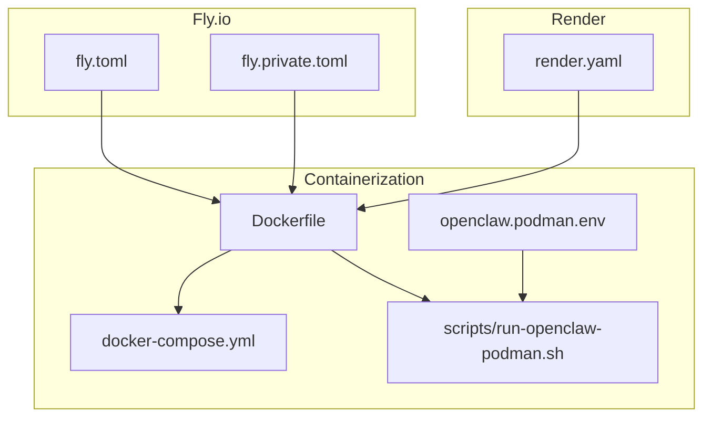
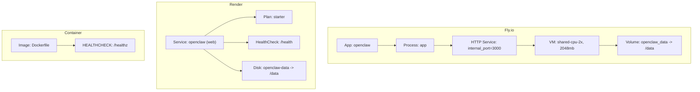
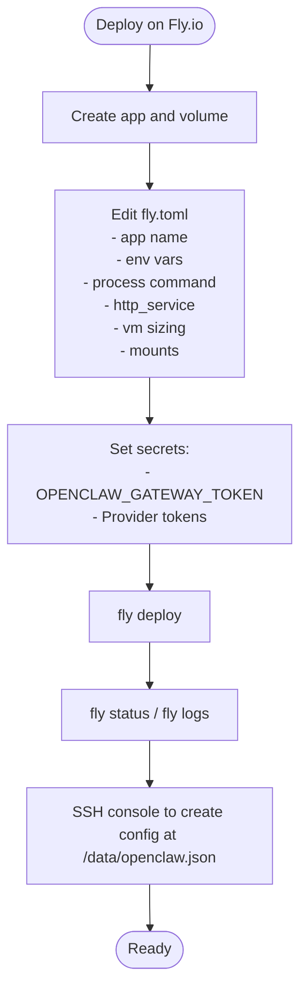
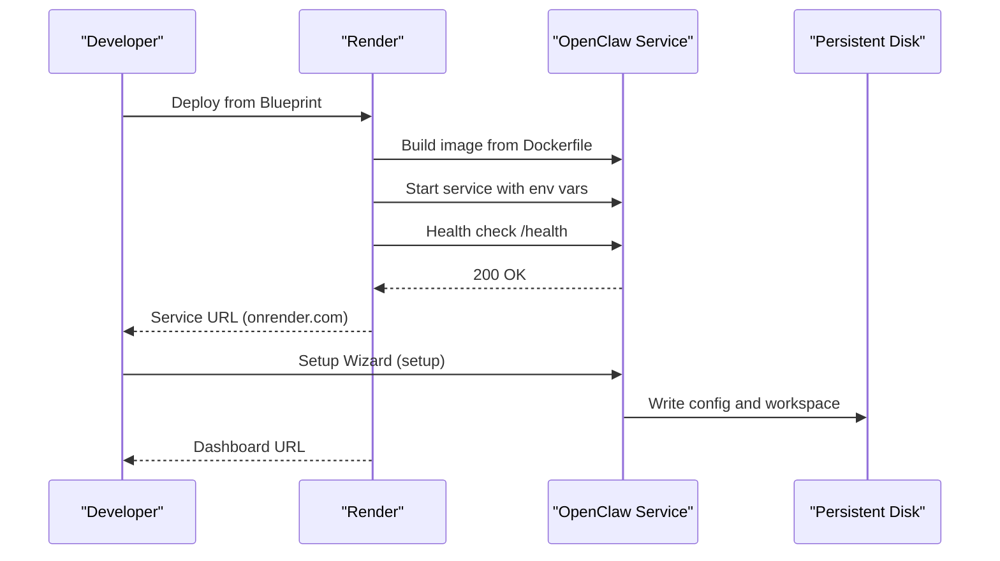
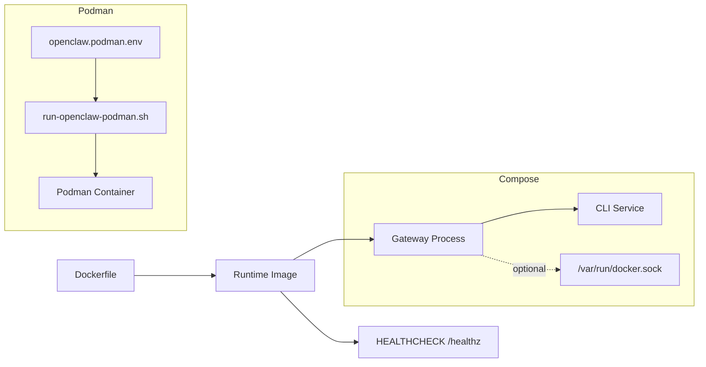
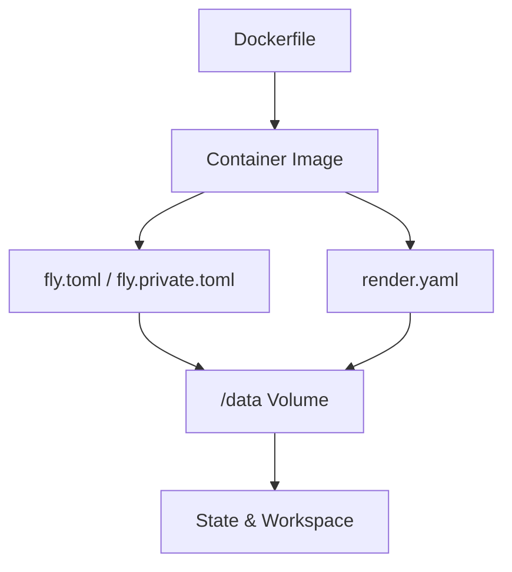

# Cloud Platform Deployment

<cite>
**Referenced Files in This Document**
- [fly.toml](file://fly.toml)
- [fly.private.toml](file://fly.private.toml)
- [render.yaml](file://render.yaml)
- [Dockerfile](file://Dockerfile)
- [docker-compose.yml](file://docker-compose.yml)
- [docs/install/fly.md](file://docs/install/fly.md)
- [docs/install/render.mdx](file://docs/install/render.mdx)
- [docs/install/docker.md](file://docs/install/docker.md)
- [scripts/run-openclaw-podman.sh](file://scripts/run-openclaw-podman.sh)
- [openclaw.podman.env](file://openclaw.podman.env)
</cite>

## Table of Contents
1. [Introduction](#introduction)
2. [Project Structure](#project-structure)
3. [Core Components](#core-components)
4. [Architecture Overview](#architecture-overview)
5. [Detailed Component Analysis](#detailed-component-analysis)
6. [Dependency Analysis](#dependency-analysis)
7. [Performance Considerations](#performance-considerations)
8. [Troubleshooting Guide](#troubleshooting-guide)
9. [Conclusion](#conclusion)
10. [Appendices](#appendices)

## Introduction
This document explains how to deploy OpenClaw on cloud platforms with a focus on Fly.io and Render. It covers platform-specific configuration, environment variables, containerization, persistent storage, scaling, cost optimization, production best practices, and monitoring. It also provides migration guidance between providers and troubleshooting steps for common deployment issues.

## Project Structure
OpenClaw provides a container-first runtime and a set of platform blueprints and configuration files that define how the application runs in cloud environments:
- Fly.io: A TOML configuration file and a hardened variant for private deployments.
- Render: A Blueprint YAML that declares the service, disk, environment variables, and health checks.
- Docker: A multi-stage Dockerfile and a Docker Compose setup for local and containerized deployments.
- Podman: A helper script and environment file for rootless containerized deployments.

**Diagram sources**
- [fly.toml](file://fly.toml#L1-L35)
- [fly.private.toml](file://fly.private.toml#L1-L40)
- [render.yaml](file://render.yaml#L1-L22)
- [Dockerfile](file://Dockerfile#L1-L231)
- [docker-compose.yml](file://docker-compose.yml#L1-L77)
- [scripts/run-openclaw-podman.sh](file://scripts/run-openclaw-podman.sh#L1-L232)
- [openclaw.podman.env](file://openclaw.podman.env#L1-L25)

**Section sources**
- [fly.toml](file://fly.toml#L1-L35)
- [fly.private.toml](file://fly.private.toml#L1-L40)
- [render.yaml](file://render.yaml#L1-L22)
- [Dockerfile](file://Dockerfile#L1-L231)
- [docker-compose.yml](file://docker-compose.yml#L1-L77)
- [docs/install/docker.md](file://docs/install/docker.md#L1-L800)
- [docs/install/fly.md](file://docs/install/fly.md#L1-L491)
- [docs/install/render.mdx](file://docs/install/render.mdx#L1-L160)
- [scripts/run-openclaw-podman.sh](file://scripts/run-openclaw-podman.sh#L1-L232)
- [openclaw.podman.env](file://openclaw.podman.env#L1-L25)

## Core Components
- Fly.io configuration
  - Application name, primary region, build settings, environment variables, process command, HTTP service, VM sizing, and persistent volume mount.
  - Hardened private deployment variant without public ingress.
- Render Blueprint
  - Web service with Docker runtime, health check path, environment variables, and a persistent disk.
- Docker containerization
  - Multi-stage build, non-root user, health checks, and optional browser installation.
- Docker Compose
  - Gateway and CLI services, health checks, volumes, and optional Docker socket sharing for sandboxing.
- Podman deployment
  - Rootless container runtime with environment file and helper script for launching and onboarding.

**Section sources**
- [fly.toml](file://fly.toml#L4-L35)
- [fly.private.toml](file://fly.private.toml#L12-L40)
- [render.yaml](file://render.yaml#L1-L22)
- [Dockerfile](file://Dockerfile#L224-L230)
- [docker-compose.yml](file://docker-compose.yml#L1-L77)
- [scripts/run-openclaw-podman.sh](file://scripts/run-openclaw-podman.sh#L70-L232)
- [openclaw.podman.env](file://openclaw.podman.env#L1-L25)

## Architecture Overview
OpenClaw runs as a gateway service with optional browser automation and sandboxing. Cloud deployments rely on the container image and platform blueprints to provision compute, storage, and ingress.

**Diagram sources**
- [fly.toml](file://fly.toml#L4-L35)
- [fly.private.toml](file://fly.private.toml#L12-L40)
- [render.yaml](file://render.yaml#L1-L22)
- [Dockerfile](file://Dockerfile#L224-L230)

## Detailed Component Analysis

### Fly.io Deployment
Fly.io is configured via a TOML file that defines the app, build, environment, process command, HTTP service, VM sizing, and persistent volume mount. A hardened private variant removes public ingress and uses a private-only IP.

Key configuration highlights:
- App name and primary region
- Build Dockerfile reference
- Environment variables for production, state directory, and memory tuning
- Process command binding to LAN and allowing unconfigured startup
- HTTP service with internal port, HTTPS enforcement, and minimum running machines
- VM sizing and persistent volume mount for state persistence

**Diagram sources**
- [docs/install/fly.md](file://docs/install/fly.md#L28-L129)
- [fly.toml](file://fly.toml#L4-L35)

**Section sources**
- [fly.toml](file://fly.toml#L4-L35)
- [fly.private.toml](file://fly.private.toml#L12-L40)
- [docs/install/fly.md](file://docs/install/fly.md#L1-L491)

### Render Deployment
Render uses a Blueprint YAML to define a web service with Docker runtime, health check path, environment variables, and a persistent disk. The service exposes a public URL and supports custom domains and scaling.

Key configuration highlights:
- Service type: web
- Runtime: docker
- Health check path: /health
- Environment variables: PORT, SETUP_PASSWORD, OPENCLAW_STATE_DIR, OPENCLAW_WORKSPACE_DIR, OPENCLAW_GATEWAY_TOKEN
- Persistent disk: mount path /data with size 1 GB

**Diagram sources**
- [render.yaml](file://render.yaml#L1-L22)
- [docs/install/render.mdx](file://docs/install/render.mdx#L1-L160)

**Section sources**
- [render.yaml](file://render.yaml#L1-L22)
- [docs/install/render.mdx](file://docs/install/render.mdx#L1-L160)

### Container-Based Deployment Patterns
OpenClaw’s containerization supports multiple deployment patterns:
- Single-container gateway with optional browser automation
- Docker Compose with gateway and CLI services, optional Docker socket sharing for sandboxing
- Podman rootless deployment with environment file and helper script

**Diagram sources**
- [Dockerfile](file://Dockerfile#L224-L230)
- [docker-compose.yml](file://docker-compose.yml#L1-L77)
- [scripts/run-openclaw-podman.sh](file://scripts/run-openclaw-podman.sh#L70-L232)
- [openclaw.podman.env](file://openclaw.podman.env#L1-L25)

**Section sources**
- [Dockerfile](file://Dockerfile#L1-L231)
- [docker-compose.yml](file://docker-compose.yml#L1-L77)
- [docs/install/docker.md](file://docs/install/docker.md#L1-L800)
- [scripts/run-openclaw-podman.sh](file://scripts/run-openclaw-podman.sh#L1-L232)
- [openclaw.podman.env](file://openclaw.podman.env#L1-L25)

### Scaling Considerations
- Fly.io
  - Vertical scaling via VM memory increases; minimum machines running ensures availability.
  - Consider increasing memory if encountering OOM symptoms.
- Render
  - Choose plan based on usage: Free (spin-down), Starter (persistent disk), Standard+ (production).
  - Horizontal scaling requires sticky sessions or external state management; vertical scaling is typically sufficient.

**Section sources**
- [docs/install/fly.md](file://docs/install/fly.md#L259-L277)
- [docs/install/render.mdx](file://docs/install/render.mdx#L63-L125)

### Cost Optimization Strategies
- Fly.io
  - Use shared-cpu-2x with 2GB RAM for production stability; monitor monthly costs.
- Render
  - Free tier for testing; upgrade to Starter or Standard+ for persistent disk and always-on behavior.
  - Export configuration regularly to minimize downtime impact on free tier.

**Section sources**
- [docs/install/fly.md](file://docs/install/fly.md#L483-L491)
- [docs/install/render.mdx](file://docs/install/render.mdx#L63-L73)

### Production Deployment Best Practices
- Environment variables
  - Prefer environment variables for secrets (OPENCLAW_GATEWAY_TOKEN, provider tokens).
  - Set OPENCLAW_STATE_DIR and OPENCLAW_WORKSPACE_DIR to persistent paths.
- Binding and security
  - Use --bind lan with OPENCLAW_GATEWAY_TOKEN for non-loopback bindings.
  - For private deployments, use Fly private template or Render with private access patterns.
- Health checks
  - Ensure /health or /healthz responds quickly; adjust timeouts and intervals as needed.
- Persistent storage
  - Mount volumes for /data to persist configuration, sessions, and workspace.

**Section sources**
- [fly.toml](file://fly.toml#L10-L15)
- [fly.private.toml](file://fly.private.toml#L18-L22)
- [render.yaml](file://render.yaml#L35-L50)
- [Dockerfile](file://Dockerfile#L224-L230)
- [docs/install/docker.md](file://docs/install/docker.md#L469-L495)

### Monitoring Setup
- Fly.io
  - Use fly logs for live logs and fly status for health.
  - Monitor gateway logs for channel connectivity and startup messages.
- Render
  - Use Dashboard logs for build, deploy, and runtime logs.
  - Health check path /health indicates readiness.

**Section sources**
- [docs/install/fly.md](file://docs/install/fly.md#L124-L137)
- [docs/install/render.mdx](file://docs/install/render.mdx#L88-L100)

## Dependency Analysis
OpenClaw’s cloud deployments depend on:
- Docker image produced by the Dockerfile
- Platform configuration files (fly.toml, fly.private.toml, render.yaml)
- Persistent storage mounts for state and workspace
- Environment variables for secrets and runtime behavior

**Diagram sources**
- [Dockerfile](file://Dockerfile#L1-L231)
- [fly.toml](file://fly.toml#L32-L35)
- [fly.private.toml](file://fly.private.toml#L37-L40)
- [render.yaml](file://render.yaml#L18-L22)

**Section sources**
- [Dockerfile](file://Dockerfile#L1-L231)
- [fly.toml](file://fly.toml#L32-L35)
- [fly.private.toml](file://fly.private.toml#L37-L40)
- [render.yaml](file://render.yaml#L18-L22)

## Performance Considerations
- Memory sizing
  - Start with 2GB RAM; increase if experiencing OOM or slow performance.
- Browser automation
  - Install Chromium at build time to avoid startup delays.
- Health checks
  - Ensure /healthz responds promptly; tune intervals and timeouts to platform defaults.

**Section sources**
- [docs/install/fly.md](file://docs/install/fly.md#L259-L277)
- [Dockerfile](file://Dockerfile#L157-L171)
- [Dockerfile](file://Dockerfile#L224-L230)

## Troubleshooting Guide
Common issues and resolutions:
- Fly.io
  - App not listening on expected address: ensure process command includes --bind lan.
  - Health checks failing: verify internal_port matches gateway port.
  - OOM/memory issues: increase VM memory.
  - Gateway lock issues: delete /data/gateway.*.lock and restart.
  - Config not being read: confirm OPENCLAW_STATE_DIR and restart.
  - Writing config via SSH: use echo + tee or sftp; handle existing file conflicts.
  - State not persisting: ensure OPENCLAW_STATE_DIR=/data and redeploy.
- Render
  - Service won’t start: verify SETUP_PASSWORD and PORT=8080.
  - Slow cold starts (Free): upgrade to Starter for always-on.
  - Data loss after redeploy: upgrade plan or export via /setup/export.
  - Health check failures: ensure /health responds within 30 seconds.

**Section sources**
- [docs/install/fly.md](file://docs/install/fly.md#L245-L321)
- [docs/install/render.mdx](file://docs/install/render.mdx#L136-L160)

## Conclusion
OpenClaw’s cloud deployments leverage a consistent container image and platform-specific blueprints. Fly.io and Render configurations emphasize persistent storage, secure environment variables, and health monitoring. For production, prefer hardened bindings, adequate memory, and persistent disks. Use the troubleshooting guidance to resolve common issues and adopt the scaling and cost strategies outlined for your workload.

## Appendices

### Fly.io Configuration Reference
- App name and region
- Build Dockerfile
- Environment variables (NODE_ENV, OPENCLAW_PREFER_PNPM, OPENCLAW_STATE_DIR, NODE_OPTIONS)
- Process command (--allow-unconfigured, --bind lan, --port 3000)
- HTTP service (internal_port=3000, force_https=true, min_machines_running=1)
- VM sizing (shared-cpu-2x, memory=2048mb)
- Mounts (/data)

**Section sources**
- [fly.toml](file://fly.toml#L4-L35)
- [fly.private.toml](file://fly.private.toml#L12-L40)

### Render Blueprint Reference
- Service type: web
- Runtime: docker
- Plan: starter
- HealthCheckPath: /health
- Env vars: PORT, SETUP_PASSWORD, OPENCLAW_STATE_DIR, OPENCLAW_WORKSPACE_DIR, OPENCLAW_GATEWAY_TOKEN
- Disk: name, mountPath, sizeGB

**Section sources**
- [render.yaml](file://render.yaml#L1-L22)

### Container and Compose Reference
- Dockerfile
  - Multi-stage build, non-root user, HEALTHCHECK /healthz, optional Chromium install
- docker-compose.yml
  - Gateway and CLI services, health checks, volumes, optional docker.sock mount

**Section sources**
- [Dockerfile](file://Dockerfile#L1-L231)
- [docker-compose.yml](file://docker-compose.yml#L1-L77)

### Podman Deployment Reference
- Environment file: OPENCLAW_GATEWAY_TOKEN, OPENCLAW_GATEWAY_BIND, host port mapping
- Helper script: launches container, generates token, writes minimal config, runs onboard or gateway

**Section sources**
- [openclaw.podman.env](file://openclaw.podman.env#L1-L25)
- [scripts/run-openclaw-podman.sh](file://scripts/run-openclaw-podman.sh#L70-L232)