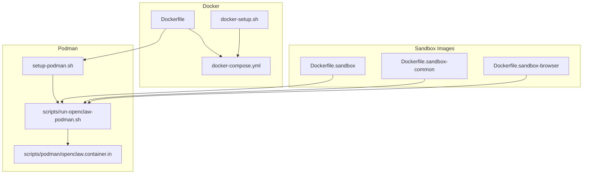
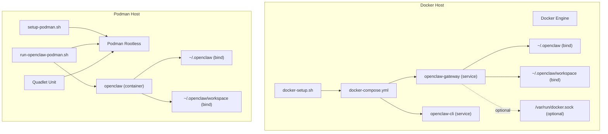
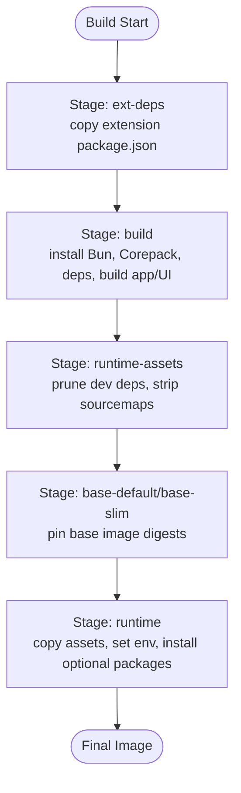
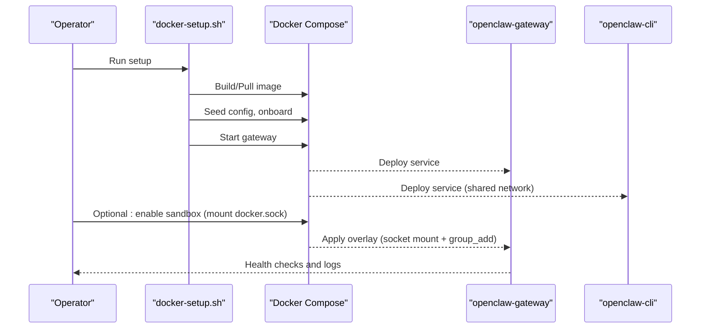
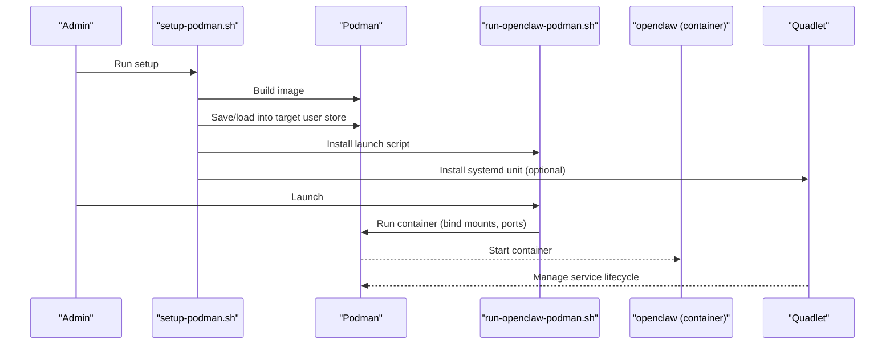
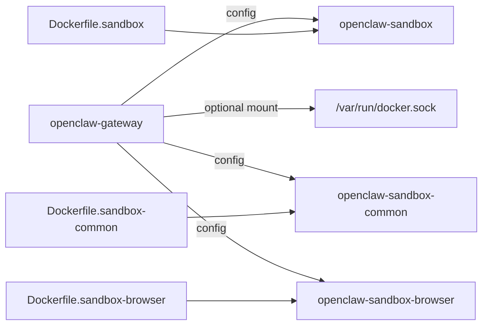
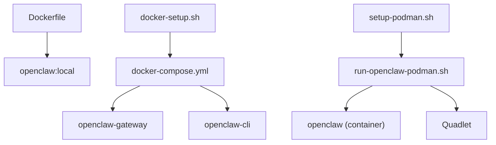

# Containerized Deployment

<cite>
**Referenced Files in This Document**
- [Dockerfile](file://Dockerfile)
- [docker-compose.yml](file://docker-compose.yml)
- [docker-setup.sh](file://docker-setup.sh)
- [docs/install/docker.md](file://docs/install/docker.md)
- [docs/install/podman.md](file://docs/install/podman.md)
- [setup-podman.sh](file://setup-podman.sh)
- [openclaw.podman.env](file://openclaw.podman.env)
- [scripts/run-openclaw-podman.sh](file://scripts/run-openclaw-podman.sh)
- [scripts/podman/openclaw.container.in](file://scripts/podman/openclaw.container.in)
- [Dockerfile.sandbox](file://Dockerfile.sandbox)
- [Dockerfile.sandbox-browser](file://Dockerfile.sandbox-browser)
- [Dockerfile.sandbox-common](file://Dockerfile.sandbox-common)
- [.dockerignore](file://.dockerignore)
</cite>

## Table of Contents
1. [Introduction](#introduction)
2. [Project Structure](#project-structure)
3. [Core Components](#core-components)
4. [Architecture Overview](#architecture-overview)
5. [Detailed Component Analysis](#detailed-component-analysis)
6. [Dependency Analysis](#dependency-analysis)
7. [Performance Considerations](#performance-considerations)
8. [Troubleshooting Guide](#troubleshooting-guide)
9. [Conclusion](#conclusion)
10. [Appendices](#appendices)

## Introduction
This document explains how to deploy OpenClaw in containers using Docker and Podman. It covers:
- Building and running the Docker image
- Persistent storage via bind mounts and named volumes
- Networking and port publishing
- docker-compose orchestration and environment configuration
- Podman rootless deployment, systemd Quadlet, and setup scripts
- Sandbox isolation for agent tools
- Production considerations, health checks, and troubleshooting

## Project Structure
Key container-related assets:
- Docker image build: Dockerfile and related sandbox images
- Orchestration: docker-compose.yml and docker-setup.sh
- Podman deployment: setup-podman.sh, run-openclaw-podman.sh, and Quadlet template
- Documentation: install guides for Docker and Podman

**Diagram sources**
- [Dockerfile](file://Dockerfile#L1-L231)
- [docker-compose.yml](file://docker-compose.yml#L1-L77)
- [docker-setup.sh](file://docker-setup.sh#L1-L598)
- [setup-podman.sh](file://setup-podman.sh#L1-L313)
- [scripts/run-openclaw-podman.sh](file://scripts/run-openclaw-podman.sh#L1-L232)
- [scripts/podman/openclaw.container.in](file://scripts/podman/openclaw.container.in#L1-L29)
- [Dockerfile.sandbox](file://Dockerfile.sandbox#L1-L24)
- [Dockerfile.sandbox-common](file://Dockerfile.sandbox-common#L1-L48)
- [Dockerfile.sandbox-browser](file://Dockerfile.sandbox-browser#L1-L35)

**Section sources**
- [Dockerfile](file://Dockerfile#L1-L231)
- [docker-compose.yml](file://docker-compose.yml#L1-L77)
- [docker-setup.sh](file://docker-setup.sh#L1-L598)
- [docs/install/docker.md](file://docs/install/docker.md#L1-L844)
- [docs/install/podman.md](file://docs/install/podman.md#L1-L123)
- [setup-podman.sh](file://setup-podman.sh#L1-L313)
- [openclaw.podman.env](file://openclaw.podman.env#L1-L25)
- [scripts/run-openclaw-podman.sh](file://scripts/run-openclaw-podman.sh#L1-L232)
- [scripts/podman/openclaw.container.in](file://scripts/podman/openclaw.container.in#L1-L29)
- [Dockerfile.sandbox](file://Dockerfile.sandbox#L1-L24)
- [Dockerfile.sandbox-common](file://Dockerfile.sandbox-common#L1-L48)
- [Dockerfile.sandbox-browser](file://Dockerfile.sandbox-browser#L1-L35)

## Core Components
- Docker image: multi-stage build with Node base, optional system packages, optional Playwright browser, optional Docker CLI for sandbox, non-root execution, health checks, and production defaults.
- docker-compose: two services (gateway and CLI), environment variables, bind mounts for config/workspace, optional Docker socket for sandbox, port publishing, init and restart policies.
- docker-setup.sh: end-to-end orchestration script to build/pull image, seed config, onboard, set gateway mode/bind, optionally enable sandbox, and start services.
- Podman stack: setup-podman.sh (one-time host setup, user creation, image build/load, Quadlet), run-openclaw-podman.sh (per-run container lifecycle), Quadlet template for systemd user services.
- Sandbox images: slim Debian-based images for sandbox environments, common toolchains, and browser-enabled sandbox.

**Section sources**
- [Dockerfile](file://Dockerfile#L1-L231)
- [docker-compose.yml](file://docker-compose.yml#L1-L77)
- [docker-setup.sh](file://docker-setup.sh#L1-L598)
- [setup-podman.sh](file://setup-podman.sh#L1-L313)
- [scripts/run-openclaw-podman.sh](file://scripts/run-openclaw-podman.sh#L1-L232)
- [scripts/podman/openclaw.container.in](file://scripts/podman/openclaw.container.in#L1-L29)
- [Dockerfile.sandbox](file://Dockerfile.sandbox#L1-L24)
- [Dockerfile.sandbox-common](file://Dockerfile.sandbox-common#L1-L48)
- [Dockerfile.sandbox-browser](file://Dockerfile.sandbox-browser#L1-L35)

## Architecture Overview
High-level containerized deployment flows for Docker and Podman.

**Diagram sources**
- [docker-compose.yml](file://docker-compose.yml#L1-L77)
- [docker-setup.sh](file://docker-setup.sh#L1-L598)
- [setup-podman.sh](file://setup-podman.sh#L1-L313)
- [scripts/run-openclaw-podman.sh](file://scripts/run-openclaw-podman.sh#L1-L232)
- [scripts/podman/openclaw.container.in](file://scripts/podman/openclaw.container.in#L1-L29)

## Detailed Component Analysis

### Docker Image Build and Runtime
- Multi-stage build: extracts extension dependencies, builds app, prunes dev dependencies, and copies runtime assets into a minimal base image variant (default or slim).
- Base image pinning: uses SHA256 digests for reproducibility.
- Optional additions:
  - System packages via build arg
  - Pre-installed Playwright Chromium and cache
  - Docker CLI for sandbox container management
- Non-root execution: runs as uid 1000 (node) with hardened defaults.
- Health checks: built-in probes for liveness/readiness.
- Entrypoint: starts gateway with default bind and allows unconfigured startup.

**Diagram sources**
- [Dockerfile](file://Dockerfile#L1-L231)

**Section sources**
- [Dockerfile](file://Dockerfile#L1-L231)

### docker-compose Orchestration
- Services:
  - openclaw-gateway: exposes gateway and bridge ports, mounts config and workspace, optional docker.sock for sandbox, healthcheck, restart policy.
  - openclaw-cli: shares network with gateway, restricted capabilities, interactive session.
- Environment variables: HOME, TERM, provider tokens, gateway token, optional insecure private WS toggle.
- Persistence: bind mounts for config and workspace; optional named volume for home.
- Sandbox: optional docker.sock mount and group_add for agent sandboxing.

**Diagram sources**
- [docker-setup.sh](file://docker-setup.sh#L1-L598)
- [docker-compose.yml](file://docker-compose.yml#L1-L77)

**Section sources**
- [docker-compose.yml](file://docker-compose.yml#L1-L77)
- [docker-setup.sh](file://docker-setup.sh#L1-L598)
- [docs/install/docker.md](file://docs/install/docker.md#L1-L844)

### Podman Rootless Deployment
- One-time setup:
  - Creates non-login user, ensures subuid/subgid, builds image, saves and loads into target user’s store, installs launch script.
  - Optionally installs systemd Quadlet for user service.
- Per-run container:
  - Generates/reads token, seeds minimal config, runs container with bind mounts for config/workspace, publishes ports, optional SELinux relabeling.
  - Supports keep-id user namespace alignment and explicit user mapping.
- Quadlet:
  - Template defines image, container name, user namespace, volumes, environment, published ports, restart policy, and exec command.

**Diagram sources**
- [setup-podman.sh](file://setup-podman.sh#L1-L313)
- [scripts/run-openclaw-podman.sh](file://scripts/run-openclaw-podman.sh#L1-L232)
- [scripts/podman/openclaw.container.in](file://scripts/podman/openclaw.container.in#L1-L29)

**Section sources**
- [setup-podman.sh](file://setup-podman.sh#L1-L313)
- [scripts/run-openclaw-podman.sh](file://scripts/run-openclaw-podman.sh#L1-L232)
- [scripts/podman/openclaw.container.in](file://scripts/podman/openclaw.container.in#L1-L29)
- [openclaw.podman.env](file://openclaw.podman.env#L1-L25)
- [docs/install/podman.md](file://docs/install/podman.md#L1-L123)

### Sandbox Images and Agent Isolation
- Minimal sandbox: Debian slim with common CLI tools.
- Common sandbox: adds Node, Go, Rust, pnpm, bun, and Homebrew for richer toolchains.
- Browser sandbox: Chromium with Xvfb, noVNC, and optional CDP access.
- Gateway can enable agent sandboxing with optional docker.sock mount and group_add.

**Diagram sources**
- [Dockerfile.sandbox](file://Dockerfile.sandbox#L1-L24)
- [Dockerfile.sandbox-common](file://Dockerfile.sandbox-common#L1-L48)
- [Dockerfile.sandbox-browser](file://Dockerfile.sandbox-browser#L1-L35)
- [docker-compose.yml](file://docker-compose.yml#L15-L22)

**Section sources**
- [Dockerfile.sandbox](file://Dockerfile.sandbox#L1-L24)
- [Dockerfile.sandbox-common](file://Dockerfile.sandbox-common#L1-L48)
- [Dockerfile.sandbox-browser](file://Dockerfile.sandbox-browser#L1-L35)
- [docker-compose.yml](file://docker-compose.yml#L15-L22)

## Dependency Analysis
- Dockerfile depends on:
  - Node base image with pinned digest
  - Optional build args for system packages, browser, and Docker CLI
  - Extension dependency extraction for faster builds
- docker-compose depends on:
  - Environment variables for ports, bind mode, and tokens
  - Optional docker.sock mount for sandbox
  - Bind mounts for config and workspace
- Podman scripts depend on:
  - Setup script for user creation and image loading
  - Launch script for runtime container lifecycle
  - Quadlet for systemd user service management

**Diagram sources**
- [Dockerfile](file://Dockerfile#L1-L231)
- [docker-setup.sh](file://docker-setup.sh#L1-L598)
- [docker-compose.yml](file://docker-compose.yml#L1-L77)
- [setup-podman.sh](file://setup-podman.sh#L1-L313)
- [scripts/run-openclaw-podman.sh](file://scripts/run-openclaw-podman.sh#L1-L232)
- [scripts/podman/openclaw.container.in](file://scripts/podman/openclaw.container.in#L1-L29)

**Section sources**
- [Dockerfile](file://Dockerfile#L1-L231)
- [docker-compose.yml](file://docker-compose.yml#L1-L77)
- [docker-setup.sh](file://docker-setup.sh#L1-L598)
- [setup-podman.sh](file://setup-podman.sh#L1-L313)
- [scripts/run-openclaw-podman.sh](file://scripts/run-openclaw-podman.sh#L1-L232)
- [scripts/podman/openclaw.container.in](file://scripts/podman/openclaw.container.in#L1-L29)

## Performance Considerations
- Build caching: order Dockerfile layers to maximize cache hits for dependencies.
- Memory limits: tune container memory and swap for sandbox and browser workloads.
- Disk growth hotspots: monitor media, sessions, transcripts, and logs; persist cache paths if needed.
- Browser hardening flags: adjust flags for WebGL/3D or extension-heavy flows when necessary.

[No sources needed since this section provides general guidance]

## Troubleshooting Guide
Common issues and remedies:
- Permission errors on config/workspace: ensure host directories are owned by uid 1000 (node) or align Podman user namespace.
- Gateway not reachable via host port: verify bind mode and port publishing; for Docker bridge networking, use host network or bind to LAN with auth.
- Sandbox prerequisites: verify Docker CLI availability inside the image and docker.sock accessibility; reset sandbox config on partial failures.
- Podman user namespaces: ensure subuid/subgid ranges for the openclaw user; verify cgroups v2 and Quadlet reload after edits.
- Health checks: use built-in endpoints for liveness/readiness; for authenticated deep health, pass the gateway token.

**Section sources**
- [Dockerfile](file://Dockerfile#L224-L230)
- [docker-setup.sh](file://docker-setup.sh#L497-L586)
- [docs/install/docker.md](file://docs/install/docker.md#L469-L538)
- [docs/install/podman.md](file://docs/install/podman.md#L111-L123)

## Conclusion
OpenClaw provides robust containerized deployment for both Docker and Podman. The Docker image is secure by default, supports optional browser and Docker CLI installations, and integrates with docker-compose for orchestration and sandboxing. Podman offers a rootless, systemd-friendly path with a dedicated setup and launch script, plus Quadlet for production-style services. Use the provided scripts and compose files to quickly provision a persistent, secure, and scalable gateway.

[No sources needed since this section summarizes without analyzing specific files]

## Appendices

### Environment Variables Reference
- Docker (compose and setup):
  - OPENCLAW_IMAGE, OPENCLAW_DOCKER_APT_PACKAGES, OPENCLAW_EXTENSIONS, OPENCLAW_EXTRA_MOUNTS, OPENCLAW_HOME_VOLUME, OPENCLAW_SANDBOX, OPENCLAW_INSTALL_DOCKER_CLI, OPENCLAW_DOCKER_SOCKET, OPENCLAW_ALLOW_INSECURE_PRIVATE_WS, OPENCLAW_BROWSER_DISABLE_GRAPHICS_FLAGS, OPENCLAW_BROWSER_DISABLE_EXTENSIONS, OPENCLAW_BROWSER_RENDERER_PROCESS_LIMIT
- Podman (setup and run):
  - OPENCLAW_PODMAN_USER, OPENCLAW_DOCKER_APT_PACKAGES, OPENCLAW_EXTENSIONS, OPENCLAW_PODMAN_QUADLET, OPENCLAW_PODMAN_ENV, OPENCLAW_PODMAN_IMAGE, OPENCLAW_PODMAN_PULL, OPENCLAW_PODMAN_GATEWAY_HOST_PORT, OPENCLAW_PODMAN_BRIDGE_HOST_PORT, OPENCLAW_PODMAN_CONTAINER, OPENCLAW_PODMAN_USERNS, OPENCLAW_BIND_MOUNT_OPTIONS

**Section sources**
- [docs/install/docker.md](file://docs/install/docker.md#L59-L78)
- [openclaw.podman.env](file://openclaw.podman.env#L1-L25)
- [scripts/run-openclaw-podman.sh](file://scripts/run-openclaw-podman.sh#L70-L181)
- [setup-podman.sh](file://setup-podman.sh#L1-L313)

### Production Deployment Checklist
- Choose runtime: Docker with docker-compose or Podman with Quadlet.
- Persist config and workspace via bind mounts or named volumes.
- Harden network exposure: bind to LAN with auth, configure allowed origins, and restrict CLI capabilities.
- Enable sandbox for agent tools if needed; verify docker.sock access and image availability.
- Monitor logs and health checks; set restart policies and resource limits.
- Back up config/workspace regularly; consider rotating tokens and provider keys.

[No sources needed since this section provides general guidance]