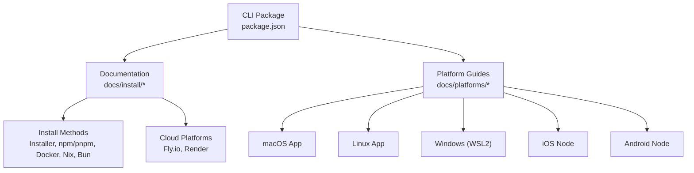
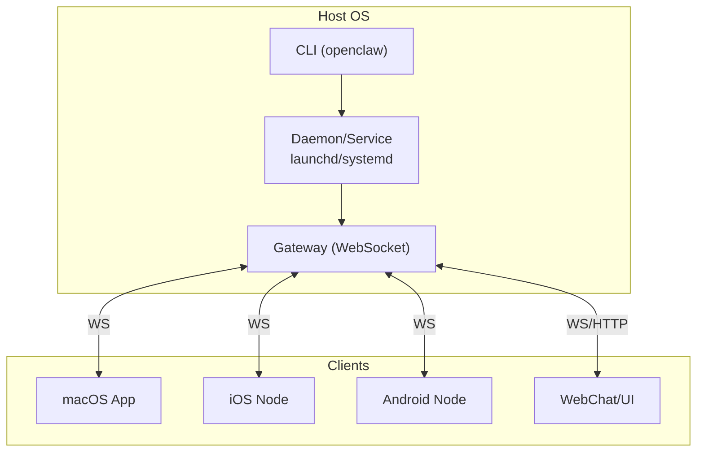
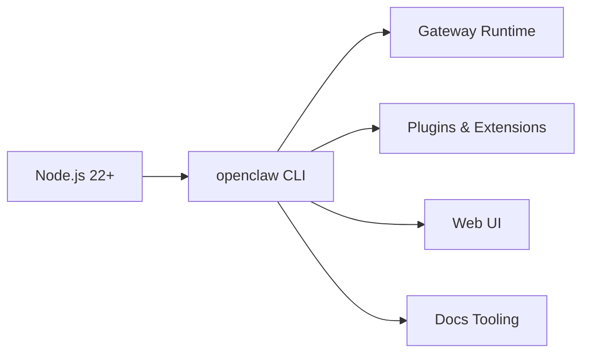

# Installation & Setup

<cite>
**Referenced Files in This Document**
- [README.md](file://README.md)
- [package.json](file://package.json)
- [docs/install/index.md](file://docs/install/index.md)
- [docs/install/node.md](file://docs/install/node.md)
- [docs/install/docker.md](file://docs/install/docker.md)
- [docs/install/bun.md](file://docs/install/bun.md)
- [docs/install/nix.md](file://docs/install/nix.md)
- [docs/install/fly.md](file://docs/install/fly.md)
- [docs/install/render.mdx](file://docs/install/render.mdx)
- [docs/platforms/index.md](file://docs/platforms/index.md)
- [docs/platforms/macos.md](file://docs/platforms/macos.md)
- [docs/platforms/linux.md](file://docs/platforms/linux.md)
- [docs/platforms/windows.md](file://docs/platforms/windows.md)
- [docs/platforms/ios.md](file://docs/platforms/ios.md)
- [docs/platforms/android.md](file://docs/platforms/android.md)
</cite>

## Table of Contents
1. [Introduction](#introduction)
2. [Project Structure](#project-structure)
3. [Core Components](#core-components)
4. [Architecture Overview](#architecture-overview)
5. [Detailed Component Analysis](#detailed-component-analysis)
6. [Dependency Analysis](#dependency-analysis)
7. [Performance Considerations](#performance-considerations)
8. [Troubleshooting Guide](#troubleshooting-guide)
9. [Conclusion](#conclusion)
10. [Appendices](#appendices)

## Introduction
This document provides comprehensive installation and setup guidance for OpenClaw across multiple platforms and deployment scenarios. It consolidates system requirements, runtime dependencies, and installation methods (npm, pnpm, bun, Docker, Nix, cloud platforms), along with platform-specific considerations for macOS, Linux, Windows (WSL2), iOS, Android, and containerized deployments. It also includes environment setup, daemon/service configuration, troubleshooting, upgrade procedures, and migration paths between installation methods.

## Project Structure
OpenClaw is a TypeScript-based project with a CLI entry point, extensive documentation, and platform-specific companion apps. The repository includes:
- A CLI package definition and scripts for building, testing, and development
- Comprehensive installation and platform guides
- Cloud deployment blueprints and platform runbooks

**Diagram sources**
- [package.json](file://package.json#L1-L458)
- [docs/install/index.md](file://docs/install/index.md#L1-L219)
- [docs/platforms/index.md](file://docs/platforms/index.md#L1-L54)

**Section sources**
- [README.md](file://README.md#L1-L560)
- [package.json](file://package.json#L1-L458)
- [docs/install/index.md](file://docs/install/index.md#L1-L219)
- [docs/platforms/index.md](file://docs/platforms/index.md#L1-L54)

## Core Components
- CLI and runtime: Node.js 22+ is required. The CLI binary is installed globally and integrates with platform-specific daemons/services.
- Daemon/service management:
  - macOS: LaunchAgent via launchd
  - Linux/WSL2: systemd user service
- Containerization: Docker Compose workflow for containerized gateway and optional agent sandbox
- Cloud platforms: Fly.io and Render blueprints for automated deployments
- Platform apps: macOS companion app, iOS/Android nodes

**Section sources**
- [README.md](file://README.md#L50-L82)
- [docs/platforms/index.md](file://docs/platforms/index.md#L41-L54)
- [docs/install/docker.md](file://docs/install/docker.md#L1-L800)
- [docs/install/fly.md](file://docs/install/fly.md#L1-L491)
- [docs/install/render.mdx](file://docs/install/render.mdx#L1-L160)

## Architecture Overview
OpenClaw’s runtime architecture centers on a Gateway WebSocket control plane with optional companion apps and nodes. The CLI orchestrates onboarding, service installation, and configuration. Platform-specific daemons/services ensure the Gateway runs reliably.

**Diagram sources**
- [README.md](file://README.md#L185-L239)
- [docs/platforms/macos.md](file://docs/platforms/macos.md#L1-L227)
- [docs/platforms/ios.md](file://docs/platforms/ios.md#L1-L109)
- [docs/platforms/android.md](file://docs/platforms/android.md#L1-L165)

## Detailed Component Analysis

### System Requirements
- Node.js: Version 22 or newer
- Operating systems: macOS, Linux, Windows (via WSL2), iOS, Android
- Optional: Docker Desktop/engine for containerized deployments

**Section sources**
- [docs/install/node.md](file://docs/install/node.md#L10-L21)
- [docs/install/index.md](file://docs/install/index.md#L14-L22)
- [docs/platforms/index.md](file://docs/platforms/index.md#L11-L16)

### Node.js Runtime Dependencies
- Global CLI installation via npm/pnpm
- Optional: pnpm for building from source; bun for local TypeScript execution (not recommended for Gateway runtime)
- Peer dependencies include optional native modules (e.g., @napi-rs/canvas, node-llama-cpp)

**Section sources**
- [README.md](file://README.md#L50-L82)
- [docs/install/bun.md](file://docs/install/bun.md#L1-L60)
- [package.json](file://package.json#L412-L418)

### Installation Methods

#### Installer Script (Recommended)
- One-step install and onboarding on macOS/Linux/WSL2 and Windows (PowerShell)
- Flags and environment variables for automation and CI

**Section sources**
- [docs/install/index.md](file://docs/install/index.md#L34-L70)

#### npm / pnpm
- npm: Install globally, then run onboarding and daemon installation
- pnpm: Requires approving build scripts for packages with native builds

**Section sources**
- [docs/install/index.md](file://docs/install/index.md#L72-L105)

#### From Source
- Clone, install dependencies, build UI and main package, then link or run via pnpm
- Development workflow and build scripts

**Section sources**
- [docs/install/index.md](file://docs/install/index.md#L107-L141)

#### Docker
- Containerized gateway and optional agent sandbox
- Environment variables for customization (image selection, mounts, sandbox, browser flags)
- Health checks and compose workflow

**Section sources**
- [docs/install/docker.md](file://docs/install/docker.md#L1-L800)

#### Podman
- Rootless container option; setup script and helper commands

**Section sources**
- [docs/install/docker.md](file://docs/install/docker.md#L206-L223)

#### Nix
- Declarative install via nix-openclaw module
- Nix mode behavior and environment variables

**Section sources**
- [docs/install/nix.md](file://docs/install/nix.md#L1-L99)

#### Bun (Experimental)
- Local TypeScript execution; lifecycle script caveats and trust steps

**Section sources**
- [docs/install/bun.md](file://docs/install/bun.md#L1-L60)

### Cloud Platforms

#### Fly.io
- VM deployment with persistent volume, secrets, and HTTPS
- fly.toml configuration, health checks, and troubleshooting

**Section sources**
- [docs/install/fly.md](file://docs/install/fly.md#L1-L491)

#### Render
- Infrastructure-as-code blueprint with Docker runtime, health checks, and persistent disk
- Plan options, custom domains, scaling, and backups

**Section sources**
- [docs/install/render.mdx](file://docs/install/render.mdx#L1-L160)

### Platform-Specific Considerations

#### macOS
- Companion app manages launchd service and permissions
- Exec approvals for system.run commands
- State directory placement recommendations

**Section sources**
- [docs/platforms/macos.md](file://docs/platforms/macos.md#L1-L227)

#### Linux
- systemd user service for Gateway
- SSH tunneling for remote access

**Section sources**
- [docs/platforms/linux.md](file://docs/platforms/linux.md#L1-L95)

#### Windows (WSL2)
- Recommended installation via WSL2 (Ubuntu)
- Auto-start chain: linger, user service, and WSL boot task
- LAN exposure via portproxy

**Section sources**
- [docs/platforms/windows.md](file://docs/platforms/windows.md#L1-L204)

#### iOS
- Node app connects to Gateway over WebSocket (Bonjour, tailnet, or manual)
- Canvas, camera, screen, and voice wake/talk mode

**Section sources**
- [docs/platforms/ios.md](file://docs/platforms/ios.md#L1-L109)

#### Android
- Node app connects to Gateway over WebSocket (Bonjour, tailnet, or manual)
- Chat, canvas, camera, and device command families

**Section sources**
- [docs/platforms/android.md](file://docs/platforms/android.md#L1-L165)

### Environment Setup and Daemon Installation
- Install the Gateway daemon via the wizard or CLI
- Platform-specific service targets:
  - macOS: LaunchAgent
  - Linux/WSL2: systemd user service

**Section sources**
- [docs/platforms/index.md](file://docs/platforms/index.md#L41-L54)
- [docs/platforms/macos.md](file://docs/platforms/macos.md#L35-L48)
- [docs/platforms/linux.md](file://docs/platforms/linux.md#L65-L95)
- [docs/platforms/windows.md](file://docs/platforms/windows.md#L30-L57)

### Service Configuration
- Gateway bind modes, token-based auth for non-loopback binds, and sandboxing
- Environment variables for state/workspace/config paths

**Section sources**
- [docs/install/docker.md](file://docs/install/docker.md#L508-L538)
- [docs/install/fly.md](file://docs/install/fly.md#L57-L92)
- [docs/install/nix.md](file://docs/install/nix.md#L64-L72)

### Upgrade Procedures and Migration
- Update channels (stable, beta, dev) and switching between channels
- Migrating between installation methods (e.g., from installer to Docker or Nix)

**Section sources**
- [README.md](file://README.md#L83-L90)
- [docs/install/index.md](file://docs/install/index.md#L206-L219)

## Dependency Analysis
OpenClaw’s CLI and runtime depend on Node 22+, with optional peer dependencies for native modules. The package manager and engine constraints are defined in the package manifest.

**Diagram sources**
- [package.json](file://package.json#L412-L418)

**Section sources**
- [package.json](file://package.json#L412-L418)

## Performance Considerations
- Memory sizing: 2GB recommended for cloud deployments; adjust based on workload and verbosity
- Container rebuild caching: order Dockerfile layers to cache dependencies
- Browser sandbox flags: optional overrides for WebGL/3D and extensions in Docker

**Section sources**
- [docs/install/fly.md](file://docs/install/fly.md#L259-L277)
- [docs/install/docker.md](file://docs/install/docker.md#L405-L437)
- [docs/install/docker.md](file://docs/install/docker.md#L742-L751)

## Troubleshooting Guide
Common issues and resolutions:
- PATH and global binary visibility
- Node version and permissions
- Docker permission and ownership errors
- Fly.io health checks and memory issues
- Render health check failures and spin-down behavior
- Windows WSL portproxy and auto-start configuration

**Section sources**
- [docs/install/node.md](file://docs/install/node.md#L89-L139)
- [docs/install/docker.md](file://docs/install/docker.md#L392-L404)
- [docs/install/fly.md](file://docs/install/fly.md#L245-L327)
- [docs/install/render.mdx](file://docs/install/render.mdx#L136-L160)
- [docs/platforms/windows.md](file://docs/platforms/windows.md#L58-L146)

## Conclusion
OpenClaw offers flexible installation and deployment options tailored to diverse environments. Use the installer script for simplicity, Docker for isolation, Nix for declarative setups, and cloud platforms for managed deployments. Platform-specific guides ensure reliable operation on macOS, Linux, Windows (WSL2), iOS, and Android.

## Appendices

### Quick Reference: Install Commands
- Installer script (macOS/Linux/WSL2): curl -fsSL https://openclaw.ai/install.sh | bash
- Installer script (Windows): iwr -useb https://openclaw.ai/install.ps1 | iex
- npm: npm install -g openclaw@latest; openclaw onboard --install-daemon
- pnpm: pnpm add -g openclaw@latest; pnpm approve-builds -g; openclaw onboard --install-daemon
- From source: git clone; pnpm install; pnpm ui:build; pnpm build; pnpm link --global; openclaw onboard --install-daemon
- Docker: ./docker-setup.sh; docker compose up -d openclaw-gateway
- Nix: nix-openclaw module
- Bun: bun install; bun run build
- Fly.io: fly apps create; fly volumes create; fly deploy
- Render: Deploy from Blueprint; set env vars; configure disk

**Section sources**
- [docs/install/index.md](file://docs/install/index.md#L34-L141)
- [docs/install/docker.md](file://docs/install/docker.md#L35-L84)
- [docs/install/nix.md](file://docs/install/nix.md#L12-L35)
- [docs/install/bun.md](file://docs/install/bun.md#L22-L60)
- [docs/install/fly.md](file://docs/install/fly.md#L21-L123)
- [docs/install/render.mdx](file://docs/install/render.mdx#L12-L52)