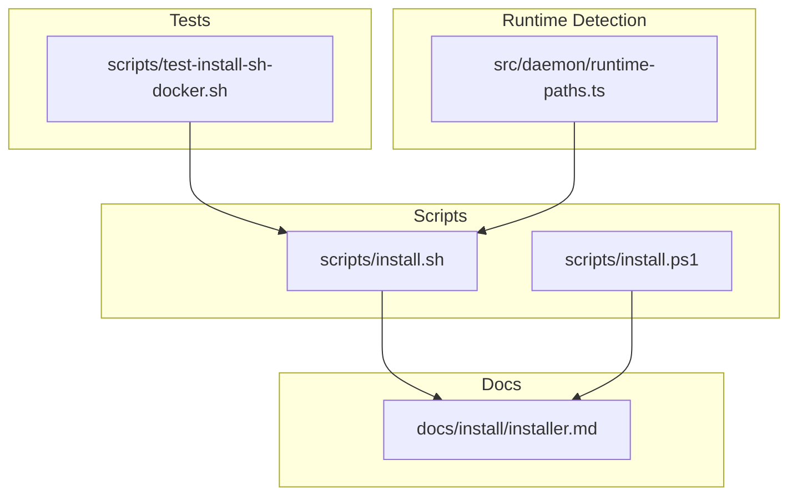
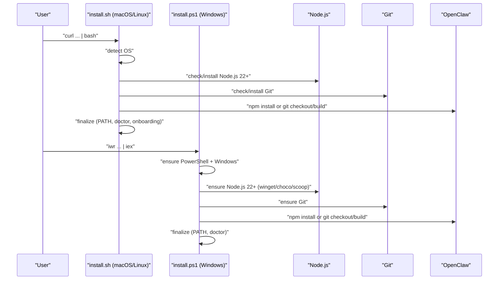
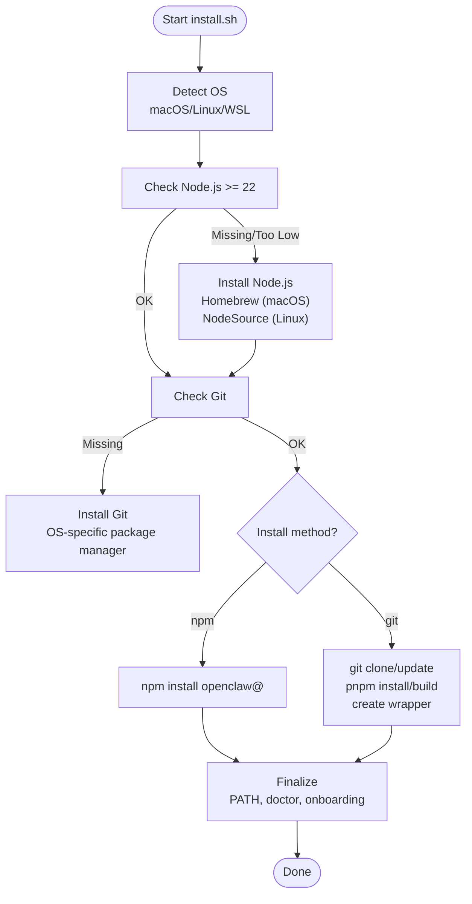
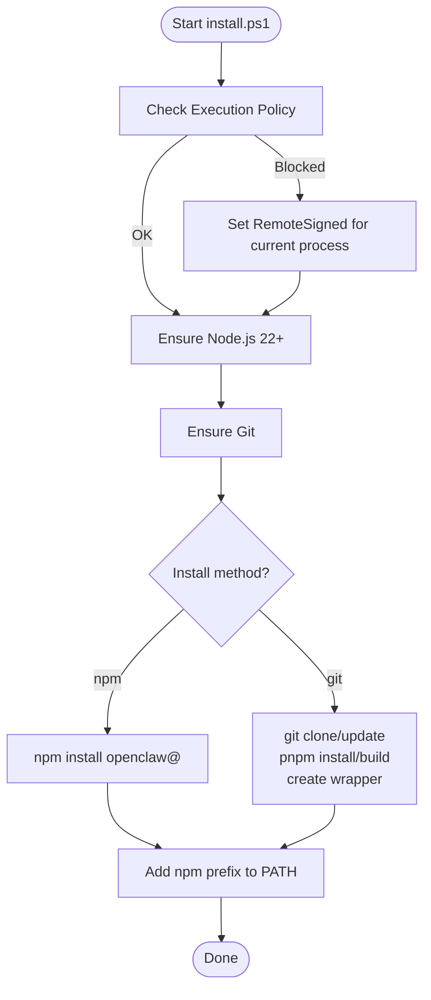
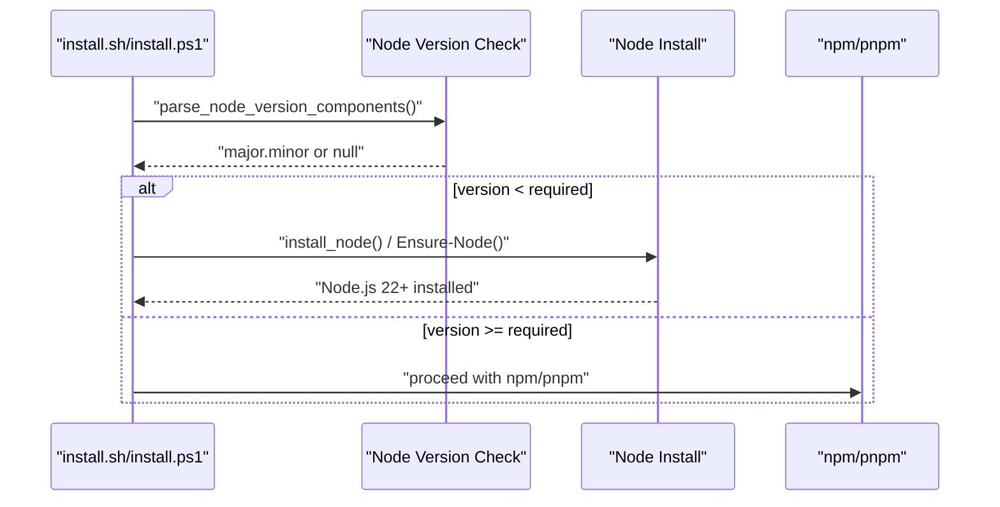
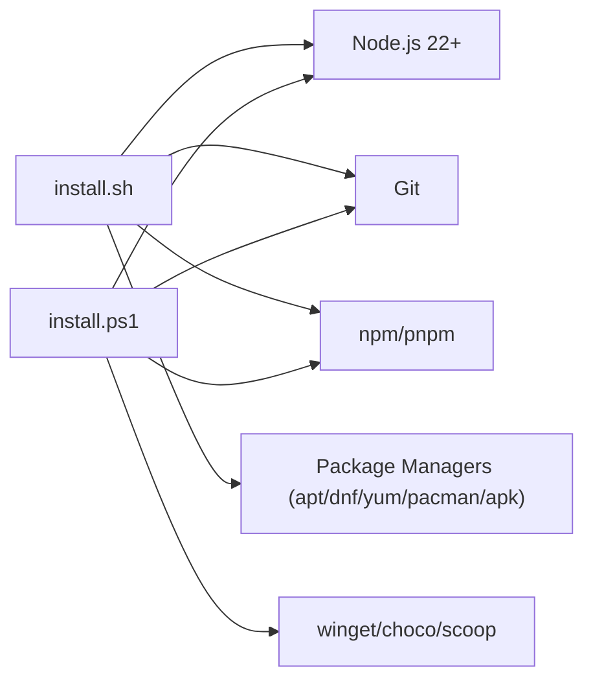

# Installer Script Method

<cite>
**Referenced Files in This Document**
- [install.sh](file://scripts/install.sh)
- [install.ps1](file://scripts/install.ps1)
- [installer.md](file://docs/install/installer.md)
- [test-install-sh-docker.sh](file://scripts/test-install-sh-docker.sh)
- [runtime-paths.ts](file://src/daemon/runtime-paths.ts)
</cite>

## Table of Contents
1. [Introduction](#introduction)
2. [Project Structure](#project-structure)
3. [Core Components](#core-components)
4. [Architecture Overview](#architecture-overview)
5. [Detailed Component Analysis](#detailed-component-analysis)
6. [Dependency Analysis](#dependency-analysis)
7. [Performance Considerations](#performance-considerations)
8. [Troubleshooting Guide](#troubleshooting-guide)
9. [Conclusion](#conclusion)
10. [Appendices](#appendices)

## Introduction
This document explains the automated installer script method for OpenClaw across macOS, Linux, and Windows (PowerShell). It covers the single-command installation process, script flags and options (including the automated installation flag --no-onboard), CI/automation usage, and the installer’s handling of Node.js detection and installation. It also provides troubleshooting guidance for common installation issues, script execution permissions, and platform-specific considerations.

## Project Structure
The installer scripts are located under scripts/ and documented in docs/install/installer.md. The macOS/Linux installer (install.sh) orchestrates Node.js detection/installation, Git availability, OpenClaw installation (via npm or git), and optional onboarding. The Windows installer (install.ps1) performs similar steps adapted for PowerShell and Windows.

**Diagram sources**
- [install.sh](file://scripts/install.sh#L1-L50)
- [install.ps1](file://scripts/install.ps1#L1-L50)
- [installer.md](file://docs/install/installer.md#L1-L60)
- [test-install-sh-docker.sh](file://scripts/test-install-sh-docker.sh#L25-L63)
- [runtime-paths.ts](file://src/daemon/runtime-paths.ts#L38-L87)

**Section sources**
- [install.sh](file://scripts/install.sh#L1-L50)
- [install.ps1](file://scripts/install.ps1#L1-L50)
- [installer.md](file://docs/install/installer.md#L1-L60)

## Core Components
- Single-command installers:
  - macOS/Linux/WSL: curl ... | bash
  - Windows: iwr ... | iex
- Flags and options:
  - --no-onboard for automated, non-interactive installs
  - --install-method/--method npm|git
  - --version, --beta, --git-dir/--dir, --no-git-update, --no-prompt, --dry-run, --verbose, --help
- Environment variables:
  - OPENCLAW_* variants mirror flags
- Node.js detection and installation:
  - macOS: Homebrew node@22
  - Linux: NodeSource setup scripts and package managers
  - Windows: winget/choco/scoop for Node.js LTS
- Git requirement:
  - Required for both install methods; installed when missing
- Post-install:
  - PATH adjustments, doctor migration, optional onboarding, gateway daemon restart

**Section sources**
- [install.sh](file://scripts/install.sh#L1001-L1041)
- [install.ps1](file://scripts/install.ps1#L5-L12)
- [installer.md](file://docs/install/installer.md#L126-L164)

## Architecture Overview
The installer scripts implement a platform-aware flow that validates prerequisites, installs or detects Node.js and Git, selects an installation method, installs OpenClaw, and finalizes setup.

**Diagram sources**
- [install.sh](file://scripts/install.sh#L2202-L2492)
- [install.ps1](file://scripts/install.ps1#L271-L330)

## Detailed Component Analysis

### macOS/Linux Installer (install.sh)
- Purpose: Single-command installer for macOS/Linux/WSL.
- Key behaviors:
  - Detects OS and prints banner
  - Ensures Node.js 22+ (Homebrew on macOS, NodeSource on Linux)
  - Ensures Git availability
  - Installs OpenClaw via npm (default) or git (checkout/build)
  - Finalizes with doctor, optional onboarding, and gateway daemon restart
- Flags and environment variables:
  - Flags: --no-onboard, --install-method/--method, --version, --beta, --git-dir/--dir, --no-git-update, --no-prompt, --dry-run, --verbose, --help
  - Env: OPENCLAW_* mirrors flags
- Automated installs:
  - Use --no-onboard and --no-prompt for CI/automation
- Node.js detection and installation:
  - parse_node_version_components, node_is_at_least_required, check_node, install_node
  - macOS: brew install node@22
  - Linux: NodeSource setup scripts and package managers (apt/dnf/yum) with sudo
- Git handling:
  - check_git, install_git, OS-specific package manager installs
- OpenClaw installation:
  - npm: install_openclaw_npm, run_npm_global_install, npm failure diagnostics
  - git: install_openclaw_from_git, pnpm/corepack, wrapper creation at ~/.local/bin
- Post-install:
  - resolve_openclaw_bin, warn_shell_path_missing_dir, run_doctor, run_bootstrap_onboarding_if_needed, refresh_gateway_service_if_loaded

**Diagram sources**
- [install.sh](file://scripts/install.sh#L2202-L2492)
- [install.sh](file://scripts/install.sh#L1252-L1486)
- [install.sh](file://scripts/install.sh#L1488-L1571)
- [install.sh](file://scripts/install.sh#L1897-L1945)

**Section sources**
- [install.sh](file://scripts/install.sh#L1001-L1041)
- [install.sh](file://scripts/install.sh#L1042-L1102)
- [install.sh](file://scripts/install.sh#L1252-L1486)
- [install.sh](file://scripts/install.sh#L1488-L1571)
- [install.sh](file://scripts/install.sh#L1897-L1945)
- [install.sh](file://scripts/install.sh#L2202-L2492)

### Windows Installer (install.ps1)
- Purpose: Single-command installer for Windows via PowerShell.
- Key behaviors:
  - Ensures PowerShell execution policy allows script execution
  - Ensures Node.js 22+ (winget, then choco, then scoop)
  - Ensures Git availability
  - Installs OpenClaw via npm (default) or git (clone/build)
  - Adds npm global bin to PATH when possible
- Flags and environment variables:
  - -InstallMethod, -Tag, -GitDir, -NoOnboard, -NoGitUpdate, -DryRun
  - Env: OPENCLAW_* variants
- Automated installs:
  - Use -NoOnboard for non-interactive runs
- Node.js detection and installation:
  - Get-NodeVersion, Get-NpmVersion, Ensure-Node, Install-Node (winget/choco/scoop)
- Git handling:
  - Get-GitVersion, Ensure-Git, Install-Git (winget)
- OpenClaw installation:
  - Install-OpenClawNpm, Install-OpenClawGit (pnpm/corepack, wrapper creation)

**Diagram sources**
- [install.ps1](file://scripts/install.ps1#L271-L330)
- [install.ps1](file://scripts/install.ps1#L56-L80)
- [install.ps1](file://scripts/install.ps1#L151-L162)
- [install.ps1](file://scripts/install.ps1#L193-L200)
- [install.ps1](file://scripts/install.ps1#L202-L258)

**Section sources**
- [install.ps1](file://scripts/install.ps1#L5-L12)
- [install.ps1](file://scripts/install.ps1#L56-L80)
- [install.ps1](file://scripts/install.ps1#L151-L162)
- [install.ps1](file://scripts/install.ps1#L193-L200)
- [install.ps1](file://scripts/install.ps1#L202-L258)
- [install.ps1](file://scripts/install.ps1#L271-L330)

### Node.js Detection and Installation
- macOS/Linux:
  - parse_node_version_components, node_is_at_least_required, check_node
  - install_node uses Homebrew (macOS) or NodeSource setup scripts (Linux) with package managers
- Windows:
  - Ensure-Node checks Node/npm versions and installs via winget/choco/scoop

**Diagram sources**
- [install.sh](file://scripts/install.sh#L1252-L1486)
- [install.ps1](file://scripts/install.ps1#L151-L162)

**Section sources**
- [install.sh](file://scripts/install.sh#L1252-L1486)
- [install.ps1](file://scripts/install.ps1#L151-L162)

### CI and Automation Environments
- Non-interactive flags/env:
  - install.sh: --no-prompt --no-onboard
  - install-cli.sh: --json --prefix /opt/openclaw
  - install.ps1: -NoOnboard
- Example usage:
  - install.sh with --no-onboard for automated runs
  - install-cli.sh with --json for structured output
  - install.ps1 with -NoOnboard for Windows automation

**Section sources**
- [installer.md](file://docs/install/installer.md#L332-L358)
- [test-install-sh-docker.sh](file://scripts/test-install-sh-docker.sh#L25-L63)

## Dependency Analysis
- install.sh depends on:
  - Shell utilities (curl/wget, git, npm, pnpm/corepack, sudo, package managers)
  - OS detection and package manager selection
  - Node.js 22+ availability
- install.ps1 depends on:
  - PowerShell execution policy
  - Node.js 22+ availability via winget/choco/scoop
  - Git availability
  - npm/pnpm for installation

**Diagram sources**
- [install.sh](file://scripts/install.sh#L1410-L1486)
- [install.sh](file://scripts/install.sh#L1534-L1571)
- [install.ps1](file://scripts/install.ps1#L102-L162)

**Section sources**
- [install.sh](file://scripts/install.sh#L1410-L1486)
- [install.sh](file://scripts/install.sh#L1534-L1571)
- [install.ps1](file://scripts/install.ps1#L102-L162)

## Performance Considerations
- Minimize repeated downloads:
  - Prefer npm install over git when available to avoid cloning/build overhead
  - Use --version or --beta to pin versions and reduce resolution overhead
- Reduce terminal overhead:
  - Use --no-prompt and --no-onboard for CI to skip interactive prompts
  - Use --dry-run to preview actions before applying changes
- Network reliability:
  - The scripts retry downloads and provide verbose logs for troubleshooting

[No sources needed since this section provides general guidance]

## Troubleshooting Guide
Common issues and resolutions:
- Git required for npm installs:
  - Git is still checked/installed to avoid spawn git ENOENT failures when dependencies use git URLs
- Linux npm EACCES:
  - Some setups point npm global prefix to root-owned paths; install.sh can switch prefix to ~/.npm-global and append PATH exports to shell rc files
- sharp/libvips issues:
  - Scripts default SHARP_IGNORE_GLOBAL_LIBVIPS=1 to avoid sharp building against system libvips; override if needed
- Windows: “npm error spawn git / ENOENT”
  - Install Git for Windows, reopen PowerShell, rerun installer
- Windows: “openclaw is not recognized”
  - Run npm config get prefix and add that directory to your user PATH (no \bin suffix on Windows), then reopen PowerShell
- Windows: verbose installer output
  - install.ps1 does not expose a -Verbose switch; use PowerShell tracing for diagnostics
- openclaw not found after install
  - Usually a PATH issue; see Node.js troubleshooting guidance

**Section sources**
- [installer.md](file://docs/install/installer.md#L362-L405)

## Conclusion
The automated installer scripts provide a streamlined, cross-platform installation experience for OpenClaw. They detect and install prerequisites, select an installation method, finalize PATH and configuration, and optionally run onboarding. For CI/automation, use non-interactive flags and environment variables to ensure reliable, repeatable installs. When encountering issues, leverage the troubleshooting guidance and verbose logging to diagnose and resolve problems quickly.

[No sources needed since this section summarizes without analyzing specific files]

## Appendices

### Flags Reference (install.sh)
- --install-method/--method npm|git
- --npm (shortcut)
- --git/--github (shortcut)
- --version <version|dist-tag>
- --beta
- --git-dir/--dir <path>
- --no-git-update
- --no-prompt
- --no-onboard
- --onboard
- --dry-run
- --verbose
- --help

**Section sources**
- [install.sh](file://scripts/install.sh#L1001-L1041)
- [install.sh](file://scripts/install.sh#L1042-L1102)

### Flags Reference (install.ps1)
- -InstallMethod npm|git
- -Tag <tag>
- -GitDir <path>
- -NoOnboard
- -NoGitUpdate
- -DryRun

**Section sources**
- [install.ps1](file://scripts/install.ps1#L5-L12)
- [installer.md](file://docs/install/installer.md#L299-L324)

### Environment Variables Reference
- install.sh: OPENCLAW_* mirrors flags
- install-cli.sh: OPENCLAW_* mirrors flags
- install.ps1: OPENCLAW_* mirrors flags

**Section sources**
- [install.sh](file://scripts/install.sh#L1022-L1034)
- [installer.md](file://docs/install/installer.md#L147-L164)
- [installer.md](file://docs/install/installer.md#L229-L242)
- [installer.md](file://docs/install/installer.md#L313-L324)

### Runtime Node Path Resolution (Context)
While not part of the installer, runtime path resolution helps diagnose PATH issues after installation.

**Section sources**
- [runtime-paths.ts](file://src/daemon/runtime-paths.ts#L38-L87)