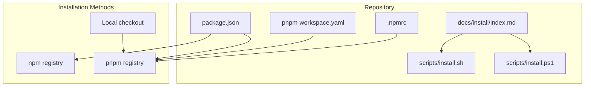
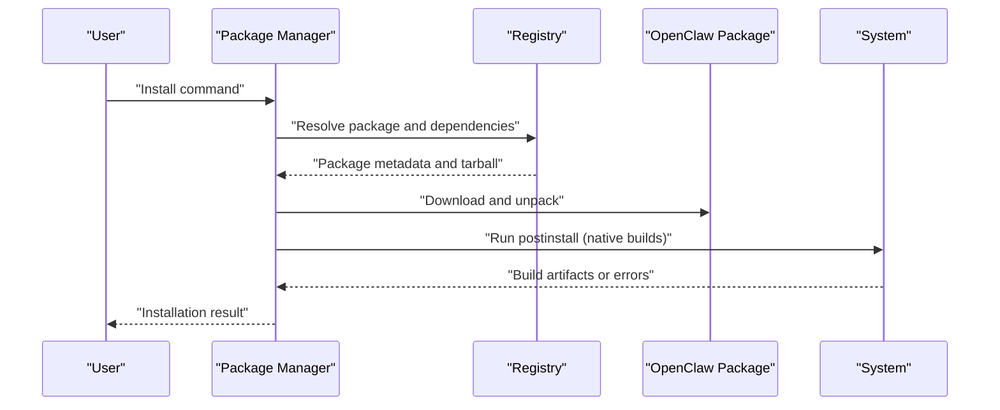
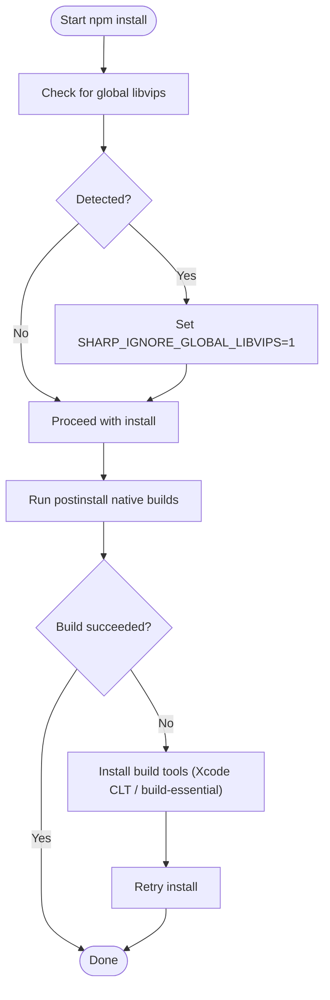
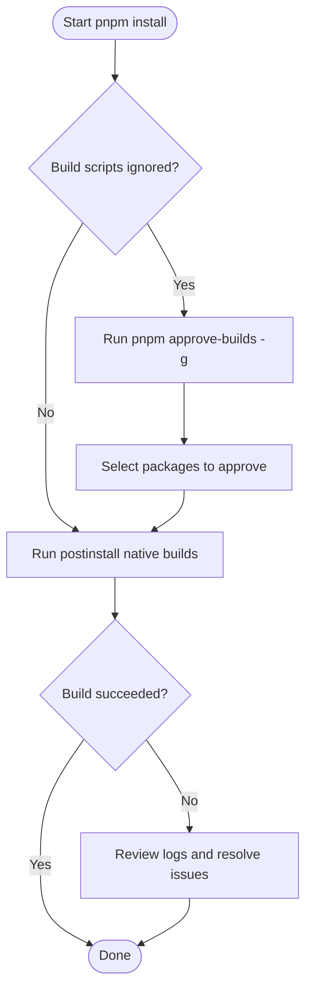
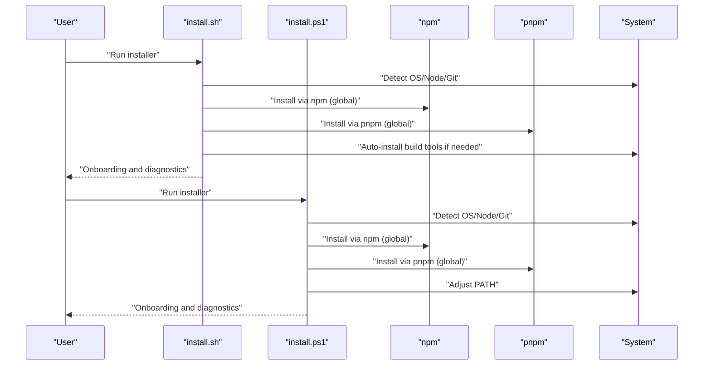
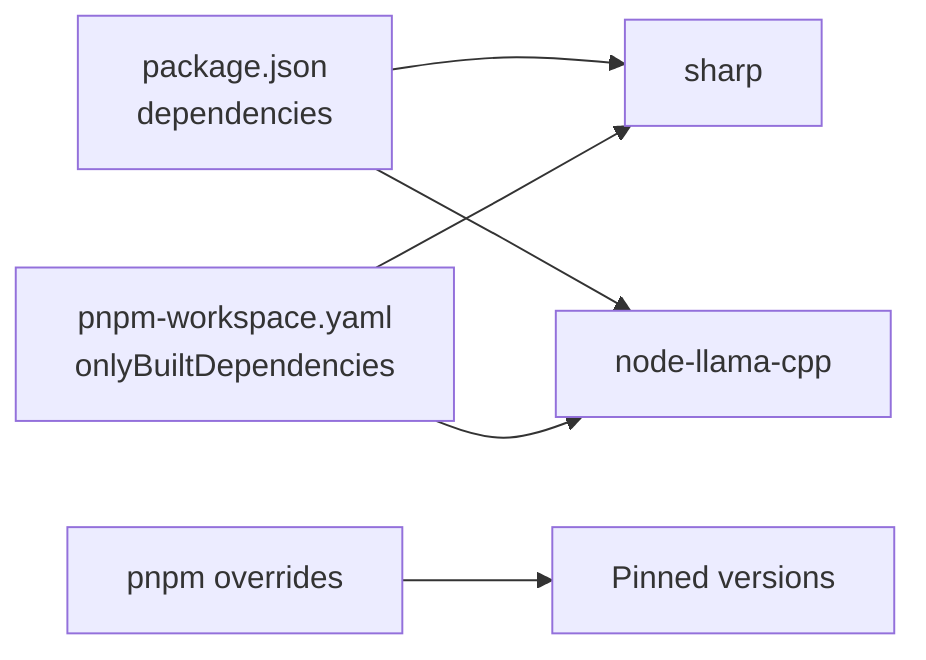

# Package Manager Installation

<cite>
**Referenced Files in This Document**
- [package.json](file://package.json)
- [pnpm-workspace.yaml](file://pnpm-workspace.yaml)
- [.npmrc](file://.npmrc)
- [docs/install/index.md](file://docs/install/index.md)
- [docs/install/installer.md](file://docs/install/installer.md)
- [docs/install/node.md](file://docs/install/node.md)
- [scripts/install.sh](file://scripts/install.sh)
- [scripts/install.ps1](file://scripts/install.ps1)
- [README.md](file://README.md)
</cite>

## Table of Contents
1. [Introduction](#introduction)
2. [Project Structure](#project-structure)
3. [Core Components](#core-components)
4. [Architecture Overview](#architecture-overview)
5. [Detailed Component Analysis](#detailed-component-analysis)
6. [Dependency Analysis](#dependency-analysis)
7. [Performance Considerations](#performance-considerations)
8. [Troubleshooting Guide](#troubleshooting-guide)
9. [Conclusion](#conclusion)

## Introduction
This document provides comprehensive guidance for installing OpenClaw using npm and pnpm. It covers manual installation procedures, platform-specific considerations for macOS, pnpm-specific build script approvals, and troubleshooting for common build issues, dependency conflicts, and platform-specific compilation problems. Both global and local installation scenarios are addressed with practical examples.

## Project Structure
OpenClaw is distributed as a Node.js package and supports installation via npm and pnpm. The repository defines package manager preferences and build-time behaviors in configuration files, and provides official documentation and installer scripts for streamlined setup.

**Diagram sources**
- [package.json](file://package.json#L1-L458)
- [pnpm-workspace.yaml](file://pnpm-workspace.yaml#L1-L18)
- [.npmrc](file://.npmrc#L1-L1)
- [docs/install/index.md](file://docs/install/index.md#L1-L219)
- [scripts/install.sh](file://scripts/install.sh#L1-L800)
- [scripts/install.ps1](file://scripts/install.ps1#L1-L330)

**Section sources**
- [package.json](file://package.json#L1-L458)
- [pnpm-workspace.yaml](file://pnpm-workspace.yaml#L1-L18)
- [.npmrc](file://.npmrc#L1-L1)
- [docs/install/index.md](file://docs/install/index.md#L1-L219)

## Core Components
- Package definition and engines: The package declares Node.js engine requirements and lists dependencies, devDependencies, peerDependencies, and pnpm-specific overrides and only-built dependencies.
- pnpm workspace and build controls: The workspace file enumerates packages and sets onlyBuiltDependencies to restrict which native packages require explicit approval.
- Installation documentation: Official docs describe npm and pnpm installation steps, including macOS libvips considerations and pnpm approve-builds usage.
- Installer scripts: Shell and PowerShell installers automate Node detection, dependency installation, and onboarding, including libvips handling for macOS.

Key configuration highlights:
- Engines: Node >= 22.12.0
- Dependencies include sharp (image processing) and node-llama-cpp (local LLM)
- pnpm overrides and onlyBuiltDependencies define allowed native builds
- Installer defaults to ignoring global libvips for sharp compatibility on macOS

**Section sources**
- [package.json](file://package.json#L412-L456)
- [pnpm-workspace.yaml](file://pnpm-workspace.yaml#L7-L17)
- [docs/install/index.md](file://docs/install/index.md#L72-L104)
- [scripts/install.sh](file://scripts/install.sh#L674-L800)

## Architecture Overview
The installation architecture centers on two primary flows:
- npm-based installation: Direct global install via npm registry, with optional environment variable to bypass system libvips for sharp.
- pnpm-based installation: Global install via pnpm registry, requiring explicit approval of packages with build scripts (approve-builds), particularly for sharp and node-llama-cpp.

**Diagram sources**
- [docs/install/index.md](file://docs/install/index.md#L72-L104)
- [package.json](file://package.json#L335-L388)
- [pnpm-workspace.yaml](file://pnpm-workspace.yaml#L7-L17)

## Detailed Component Analysis

### npm Installation
Manual npm installation steps:
- Global install: Use npm to install the package globally.
- macOS libvips conflict resolution: If libvips is installed globally (common on macOS via Homebrew), use an environment variable to force prebuilt binaries for sharp.
- Build tooling: If native build failures occur, install required build tools (Xcode CLT on macOS; build-essential, make, g++, cmake on Linux).

Examples:
- Global install and onboarding:
  - npm install -g openclaw@latest
  - openclaw onboard --install-daemon
- macOS libvips workaround:
  - SHARP_IGNORE_GLOBAL_LIBVIPS=1 npm install -g openclaw@latest

**Diagram sources**
- [docs/install/index.md](file://docs/install/index.md#L82-L90)
- [scripts/install.sh](file://scripts/install.sh#L656-L672)

**Section sources**
- [docs/install/index.md](file://docs/install/index.md#L72-L104)
- [docs/install/node.md](file://docs/install/node.md#L1-L139)
- [scripts/install.sh](file://scripts/install.sh#L622-L672)

### pnpm Installation
Manual pnpm installation steps:
- Global install: Use pnpm to install the package globally.
- Build script approvals: After the first install shows an "Ignored build scripts" warning, run approve-builds to explicitly approve packages with native build scripts (e.g., sharp, node-llama-cpp).
- Local development: From a local checkout, use pnpm install, then link globally or run via pnpm openclaw.

Examples:
- Global install and approvals:
  - pnpm add -g openclaw@latest
  - pnpm approve-builds -g
  - openclaw onboard --install-daemon
- Local development:
  - pnpm install
  - pnpm ui:build
  - pnpm build
  - pnpm link --global

**Diagram sources**
- [docs/install/index.md](file://docs/install/index.md#L92-L102)
- [pnpm-workspace.yaml](file://pnpm-workspace.yaml#L7-L17)

**Section sources**
- [docs/install/index.md](file://docs/install/index.md#L72-L104)
- [pnpm-workspace.yaml](file://pnpm-workspace.yaml#L1-L18)

### macOS-Specific Considerations
- libvips conflict: On macOS, if libvips is installed globally (e.g., via Homebrew), sharp may attempt to build against the system library and fail. The documentation and installer scripts provide a solution via an environment variable to force prebuilt binaries.
- Build tools: Ensure Xcode Command Line Tools are installed; cmake may be required and can be installed via Homebrew if missing.

**Section sources**
- [docs/install/index.md](file://docs/install/index.md#L82-L90)
- [scripts/install.sh](file://scripts/install.sh#L622-L654)

### Installer Scripts Integration
- install.sh (macOS/Linux/WSL): Automates Node detection, optional Git installation, npm/pnpm-based install, and onboarding. Includes libvips handling and build tool auto-installation on failure.
- install.ps1 (Windows): Handles Node detection, optional Git installation, npm/pnpm-based install, and PATH adjustments.

**Diagram sources**
- [scripts/install.sh](file://scripts/install.sh#L674-L800)
- [scripts/install.ps1](file://scripts/install.ps1#L202-L327)

**Section sources**
- [scripts/install.sh](file://scripts/install.sh#L1-L800)
- [scripts/install.ps1](file://scripts/install.ps1#L1-L330)

## Dependency Analysis
- Dependencies with native builds:
  - sharp: Requires native compilation; resolved via prebuilt binaries or system libraries depending on environment variables and platform.
  - node-llama-cpp: Requires native compilation; often requires explicit approval in pnpm workflows.
- pnpm allowlist:
  - onlyBuiltDependencies enumerates packages that require explicit approval during installation.
- Overrides:
  - pnpm overrides pin compatible versions for certain transitive dependencies to prevent conflicts.

**Diagram sources**
- [package.json](file://package.json#L335-L388)
- [pnpm-workspace.yaml](file://pnpm-workspace.yaml#L7-L17)

**Section sources**
- [package.json](file://package.json#L436-L448)
- [pnpm-workspace.yaml](file://pnpm-workspace.yaml#L7-L17)

## Performance Considerations
- Prefer prebuilt binaries for native dependencies when possible to reduce build times and avoid compilation overhead.
- Use pnpm with approved only-built dependencies to streamline CI/CD and local development workflows.
- Ensure adequate disk space and memory for native builds, especially for packages like node-llama-cpp.

## Troubleshooting Guide
Common issues and resolutions:
- npm install fails with build errors:
  - Install build tools (Xcode CLT on macOS; build-essential, make, g++, cmake on Linux).
  - Use SHARP_IGNORE_GLOBAL_LIBVIPS=1 to force prebuilt binaries for sharp on macOS.
- pnpm "Ignored build scripts" warning:
  - Run pnpm approve-builds -g and select packages to approve (e.g., sharp, node-llama-cpp).
- PATH not finding openclaw:
  - Verify npm prefix -g and ensure the global bin directory is on PATH.
- Windows-specific:
  - Ensure PowerShell execution policy allows script execution and Git is installed.

**Section sources**
- [docs/install/index.md](file://docs/install/index.md#L82-L104)
- [docs/install/node.md](file://docs/install/node.md#L89-L139)
- [scripts/install.sh](file://scripts/install.sh#L568-L672)
- [scripts/install.ps1](file://scripts/install.ps1#L56-L80)

## Conclusion
Both npm and pnpm provide reliable installation paths for OpenClaw. For npm, macOS users should consider the SHARP_IGNORE_GLOBAL_LIBVIPS environment variable to avoid conflicts with system libvips. For pnpm, explicit build script approvals are required for packages with native builds. Installer scripts simplify setup across platforms and offer diagnostics and automated fixes for common issues.