# Platform-Specific Installation

<cite>
**Referenced Files in This Document**
- [docs/install/index.md](file://docs/install/index.md)
- [docs/install/installer.md](file://docs/install/installer.md)
- [docs/install/node.md](file://docs/install/node.md)
- [docs/install/nix.md](file://docs/install/nix.md)
- [docs/install/bun.md](file://docs/install/bun.md)
- [docs/platforms/windows.md](file://docs/platforms/windows.md)
- [docs/platforms/linux.md](file://docs/platforms/linux.md)
- [docs/platforms/macos.md](file://docs/platforms/macos.md)
- [docs/install/macos-vm.md](file://docs/install/macos-vm.md)
- [docs/tools/browser-wsl2-windows-remote-cdp-troubleshooting.md](file://docs/tools/browser-wsl2-windows-remote-cdp-troubleshooting.md)
- [docs/help/troubleshooting.md](file://docs/help/troubleshooting.md)
- [scripts/install.sh](file://scripts/install.sh)
- [scripts/install.ps1](file://scripts/install.ps1)
</cite>

## Table of Contents
1. [Introduction](#introduction)
2. [Project Structure](#project-structure)
3. [Core Components](#core-components)
4. [Architecture Overview](#architecture-overview)
5. [Detailed Component Analysis](#detailed-component-analysis)
6. [Dependency Analysis](#dependency-analysis)
7. [Performance Considerations](#performance-considerations)
8. [Troubleshooting Guide](#troubleshooting-guide)
9. [Conclusion](#conclusion)
10. [Appendices](#appendices)

## Introduction
This document provides platform-specific installation and setup guidance for OpenClaw across macOS, Linux, Windows (including WSL2), Nix, and Bun runtime environments. It consolidates official documentation and installer internals to help you choose the right installation method, configure your environment, and troubleshoot cross-platform compatibility issues.

## Project Structure
OpenClaw’s installation guidance is organized around:
- Official install pages for each platform and runtime
- Installer internals and automation options
- Platform-specific notes (Windows WSL2, Linux systemd, macOS app)
- Troubleshooting flows and layered diagnostics

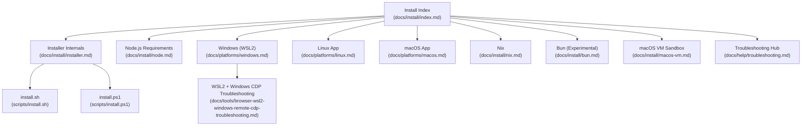

**Diagram sources**
- [docs/install/index.md](file://docs/install/index.md#L1-L219)
- [docs/install/installer.md](file://docs/install/installer.md#L1-L406)
- [docs/install/node.md](file://docs/install/node.md#L1-L139)
- [docs/platforms/windows.md](file://docs/platforms/windows.md#L1-L204)
- [docs/platforms/linux.md](file://docs/platforms/linux.md#L1-L95)
- [docs/platforms/macos.md](file://docs/platforms/macos.md#L1-L227)
- [docs/install/nix.md](file://docs/install/nix.md#L1-L99)
- [docs/install/bun.md](file://docs/install/bun.md#L1-L60)
- [scripts/install.sh](file://scripts/install.sh#L1-L800)
- [scripts/install.ps1](file://scripts/install.ps1#L1-L330)
- [docs/tools/browser-wsl2-windows-remote-cdp-troubleshooting.md](file://docs/tools/browser-wsl2-windows-remote-cdp-troubleshooting.md#L1-L243)
- [docs/install/macos-vm.md](file://docs/install/macos-vm.md#L1-L282)
- [docs/help/troubleshooting.md](file://docs/help/troubleshooting.md#L1-L298)

**Section sources**
- [docs/install/index.md](file://docs/install/index.md#L1-L219)
- [docs/install/installer.md](file://docs/install/installer.md#L1-L406)

## Core Components
- Installer scripts:
  - install.sh for macOS/Linux/WSL
  - install-cli.sh for local prefix installs
  - install.ps1 for Windows
- Runtime requirements:
  - Node 22+ (with guidance for version managers and PATH)
- Optional runtimes:
  - Bun (experimental, CLI-only)
  - Nix (declarative install via nix-openclaw)
- Platform-specific services:
  - Windows WSL2 systemd user services
  - Linux systemd user services
  - macOS app and launchd

**Section sources**
- [docs/install/installer.md](file://docs/install/installer.md#L14-L164)
- [docs/install/node.md](file://docs/install/node.md#L10-L139)
- [docs/install/bun.md](file://docs/install/bun.md#L1-L60)
- [docs/install/nix.md](file://docs/install/nix.md#L1-L99)
- [docs/platforms/windows.md](file://docs/platforms/windows.md#L30-L101)
- [docs/platforms/linux.md](file://docs/platforms/linux.md#L37-L95)
- [docs/platforms/macos.md](file://docs/platforms/macos.md#L35-L49)

## Architecture Overview
The installation architecture centers on platform-aware installer scripts and runtime choices. The scripts detect OS, ensure Node/npm/git, and install OpenClaw via npm or git. Optional flows include onboarding, service installation, and environment configuration.

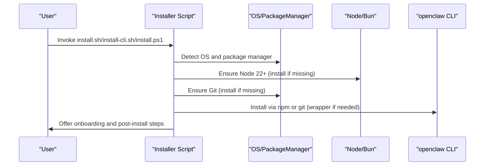

**Diagram sources**
- [scripts/install.sh](file://scripts/install.sh#L253-L269)
- [scripts/install.ps1](file://scripts/install.ps1#L102-L200)
- [docs/install/installer.md](file://docs/install/installer.md#L67-L88)

## Detailed Component Analysis

### macOS Installation
- Recommended runtime: Node (macOS app included)
- Installers:
  - install.sh supports macOS and will install Homebrew if needed and use it to install Node/npm
  - install.ps1 is for Windows; macOS uses install.sh
- macOS app responsibilities:
  - Menu-bar status, TCC prompts, local/remote Gateway control, node capabilities
- Environment considerations:
  - Avoid iCloud-synced state directories
  - Use OPENCLAW_STATE_DIR and OPENCLAW_CONFIG_PATH to control paths

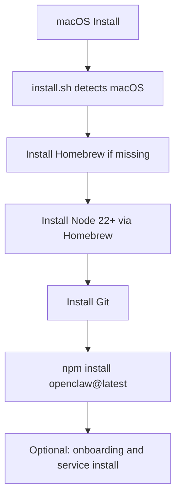

**Diagram sources**
- [scripts/install.sh](file://scripts/install.sh#L108-L126)
- [scripts/install.sh](file://scripts/install.sh#L622-L654)
- [docs/platforms/macos.md](file://docs/platforms/macos.md#L146-L164)

**Section sources**
- [docs/platforms/macos.md](file://docs/platforms/macos.md#L1-L227)
- [docs/install/index.md](file://docs/install/index.md#L14-L22)
- [docs/install/node.md](file://docs/install/node.md#L24-L33)
- [scripts/install.sh](file://scripts/install.sh#L622-L654)

### Linux Installation
- Recommended runtime: Node
- Installers:
  - install.sh detects Linux and installs Node/npm via distribution-specific package managers
- Service installation:
  - systemd user service by default; system service for shared servers
- Optional runtimes:
  - Bun is experimental and not recommended for Gateway runtime (WhatsApp/Telegram bugs)

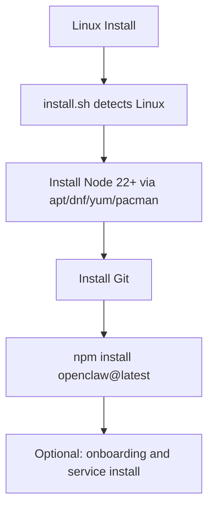

**Diagram sources**
- [scripts/install.sh](file://scripts/install.sh#L544-L620)
- [docs/platforms/linux.md](file://docs/platforms/linux.md#L37-L95)

**Section sources**
- [docs/platforms/linux.md](file://docs/platforms/linux.md#L1-L95)
- [docs/install/bun.md](file://docs/install/bun.md#L14-L21)
- [scripts/install.sh](file://scripts/install.sh#L568-L620)

### Windows Installation (PowerShell)
- install.ps1 installs Node 22+ via winget/choco/scoop, ensures Git, then installs OpenClaw via npm or git
- PATH handling:
  - Adds npm global prefix to user PATH when possible
- WSL2 recommendation:
  - Strongly recommended for consistent runtime and tooling compatibility

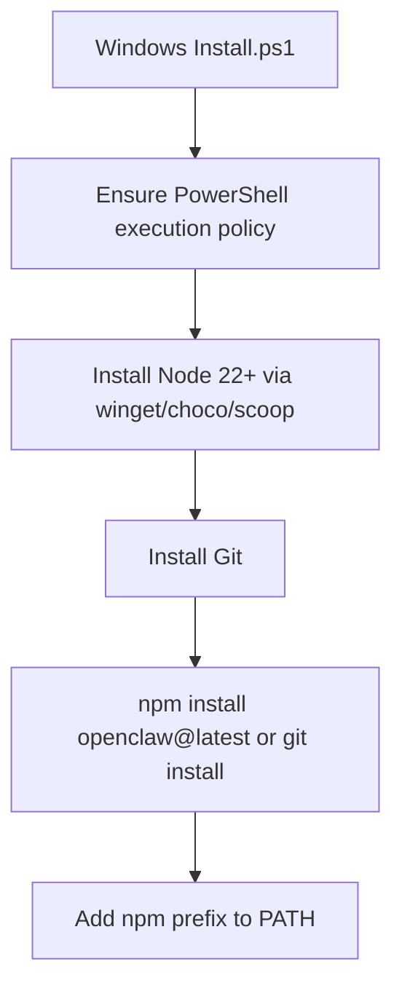

**Diagram sources**
- [scripts/install.ps1](file://scripts/install.ps1#L56-L162)
- [scripts/install.ps1](file://scripts/install.ps1#L202-L216)
- [docs/platforms/windows.md](file://docs/platforms/windows.md#L11-L23)

**Section sources**
- [docs/platforms/windows.md](file://docs/platforms/windows.md#L1-L204)
- [scripts/install.ps1](file://scripts/install.ps1#L1-L330)

### Windows Subsystem for Linux 2 (WSL2)
- WSL2 is recommended for Windows installations
- Steps:
  - Install WSL2 + Ubuntu, enable systemd, then install OpenClaw inside WSL
- Service auto-start:
  - linger, user service install, and Windows startup task to boot WSL
- Advanced networking:
  - Portproxy to expose WSL services to LAN; refresh rules after restart

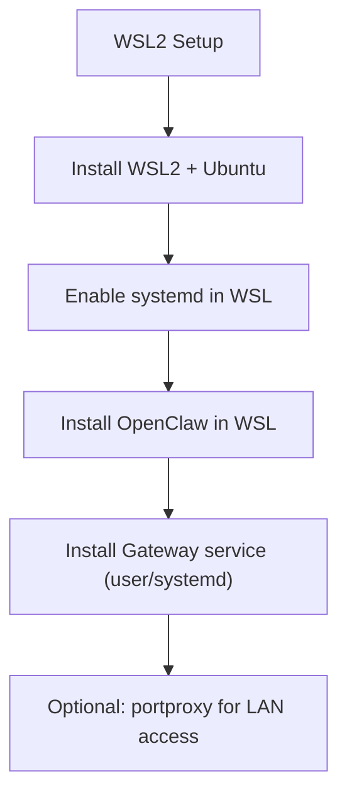

**Diagram sources**
- [docs/platforms/windows.md](file://docs/platforms/windows.md#L147-L198)
- [docs/platforms/windows.md](file://docs/platforms/windows.md#L102-L146)

**Section sources**
- [docs/platforms/windows.md](file://docs/platforms/windows.md#L19-L101)
- [docs/platforms/windows.md](file://docs/platforms/windows.md#L147-L198)

### Nix Declarative Installation
- Use nix-openclaw for a batteries-included Home Manager module
- Nix mode:
  - OPENCLAW_NIX_MODE=1 disables auto-install flows and surfaces Nix-specific remediation
  - Configure OPENCLAW_STATE_DIR and OPENCLAW_CONFIG_PATH to Nix-managed locations
- macOS packaging:
  - Stable Info.plist template embedded for deterministic builds

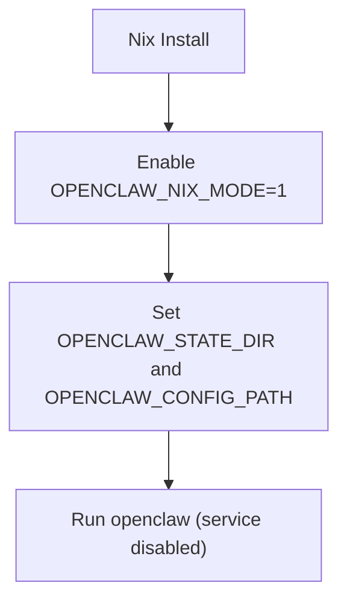

**Diagram sources**
- [docs/install/nix.md](file://docs/install/nix.md#L46-L82)

**Section sources**
- [docs/install/nix.md](file://docs/install/nix.md#L1-L99)

### Bun Runtime (Experimental)
- Use Bun for running TypeScript directly (bun run, bun --watch)
- Limitations:
  - Not recommended for Gateway runtime (WhatsApp/Telegram bugs)
  - Cannot use pnpm-lock.yaml; some scripts require pnpm (e.g., docs:build, ui:*)
- Lifecycle scripts:
  - Trust specific packages if lifecycle scripts are blocked

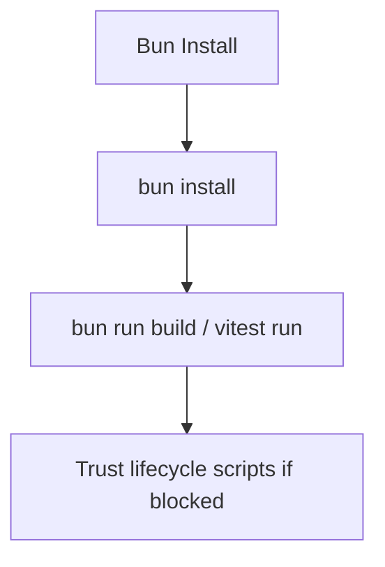

**Diagram sources**
- [docs/install/bun.md](file://docs/install/bun.md#L22-L56)

**Section sources**
- [docs/install/bun.md](file://docs/install/bun.md#L1-L60)

### macOS VM Sandboxing
- Use a macOS VM (Lume) for isolation or iMessage support
- Steps:
  - Install Lume, create VM, enable SSH, install OpenClaw inside VM
- iMessage via BlueBubbles:
  - Configure BlueBubbles in VM and point OpenClaw to the Gateway webhook

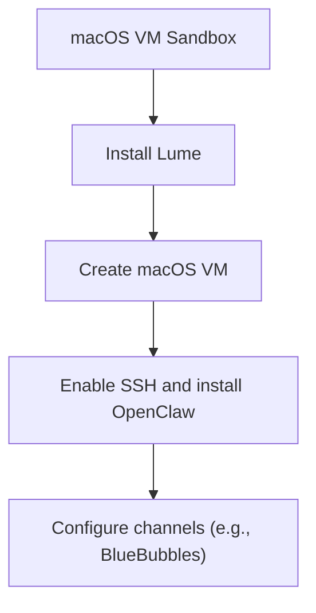

**Diagram sources**
- [docs/install/macos-vm.md](file://docs/install/macos-vm.md#L135-L177)
- [docs/install/macos-vm.md](file://docs/install/macos-vm.md#L199-L224)

**Section sources**
- [docs/install/macos-vm.md](file://docs/install/macos-vm.md#L1-L282)

## Dependency Analysis
- Installer dependencies:
  - install.sh depends on OS detection, package managers, and Node/npm availability
  - install.ps1 depends on PowerShell execution policy and package managers (winget/choco/scoop)
- Runtime dependencies:
  - Node 22+ is mandatory; installer scripts handle detection and installation
  - Git is required for both npm and git install methods
- Cross-platform considerations:
  - Windows PATH must include npm global prefix
  - WSL2 requires systemd and proper port forwarding for cross-namespace browser control

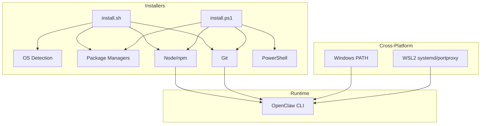

**Diagram sources**
- [scripts/install.sh](file://scripts/install.sh#L253-L269)
- [scripts/install.ps1](file://scripts/install.ps1#L42-L80)
- [docs/platforms/windows.md](file://docs/platforms/windows.md#L71-L101)

**Section sources**
- [scripts/install.sh](file://scripts/install.sh#L1-L800)
- [scripts/install.ps1](file://scripts/install.ps1#L1-L330)
- [docs/platforms/windows.md](file://docs/platforms/windows.md#L63-L101)

## Performance Considerations
- Use the installer scripts to minimize manual steps and reduce misconfiguration risk.
- On Linux, ensure build tools are available to avoid rebuilds during npm install.
- On macOS, avoid libvips conflicts by using the documented environment variable to ignore global libvips.
- For WSL2, prefer systemd user services for reliable startup and avoid unnecessary port forwarding overhead.

[No sources needed since this section provides general guidance]

## Troubleshooting Guide
- Symptom-first triage:
  - Run status, gateway status, doctor, channels status, and logs in sequence
- Common issues:
  - PATH not including npm global bin (Node.js troubleshooting)
  - EACCES on Linux due to npm prefix ownership
  - Windows execution policy blocking install.ps1
  - WSL2 cannot reach Windows Chrome CDP endpoint
- Layered browser troubleshooting (WSL2 + Windows):
  - Verify Chrome CDP on Windows
  - Verify reachability from WSL2
  - Confirm correct cdpUrl and Control UI origin
  - Consider relayBindHost for extension relay across namespaces

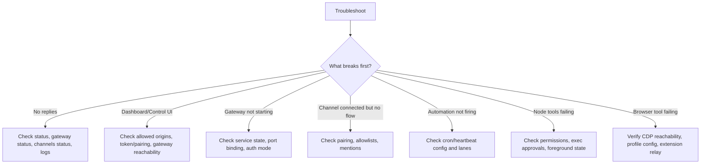

**Diagram sources**
- [docs/help/troubleshooting.md](file://docs/help/troubleshooting.md#L70-L89)

**Section sources**
- [docs/help/troubleshooting.md](file://docs/help/troubleshooting.md#L1-L298)
- [docs/install/node.md](file://docs/install/node.md#L89-L139)
- [docs/tools/browser-wsl2-windows-remote-cdp-troubleshooting.md](file://docs/tools/browser-wsl2-windows-remote-cdp-troubleshooting.md#L79-L243)

## Conclusion
OpenClaw’s installer scripts and platform guides provide robust, automated installation paths for macOS, Linux, and Windows (via WSL2). For declarative environments, Nix offers deterministic installs. For rapid local iteration, Bun is available but not recommended for Gateway runtime. Follow the platform-specific steps and layered troubleshooting guidance to ensure a smooth setup and operation.

[No sources needed since this section summarizes without analyzing specific files]

## Appendices
- Installer flags and environment variables:
  - install.sh: install-method, version/tag, git-dir, no-onboard, dry-run, verbose
  - install-cli.sh: prefix, version, node-version, json, onboard
  - install.ps1: InstallMethod, Tag, GitDir, NoOnboard, NoGitUpdate, DryRun
- Node version managers:
  - fnm, nvm, mise, asdf (ensure initialization in shell startup files)

**Section sources**
- [docs/install/installer.md](file://docs/install/installer.md#L127-L164)
- [docs/install/installer.md](file://docs/install/installer.md#L213-L242)
- [docs/install/installer.md](file://docs/install/installer.md#L299-L324)
- [docs/install/node.md](file://docs/install/node.md#L70-L87)