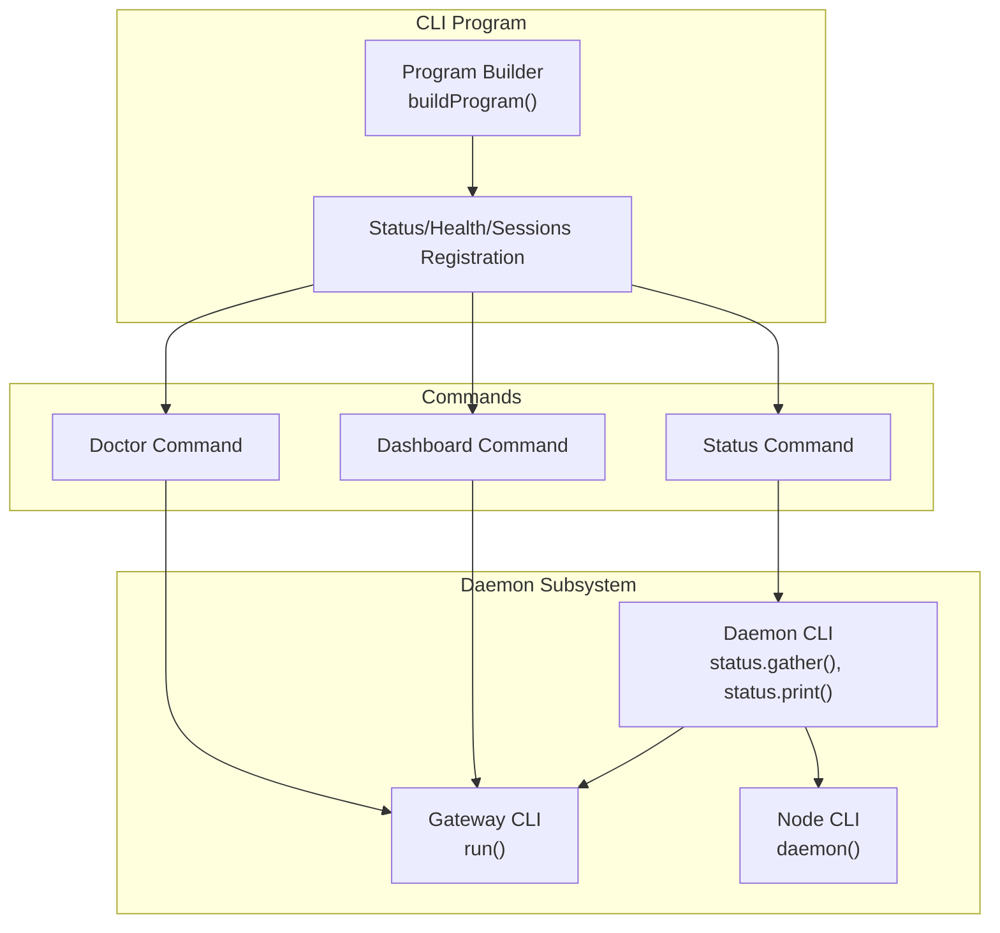
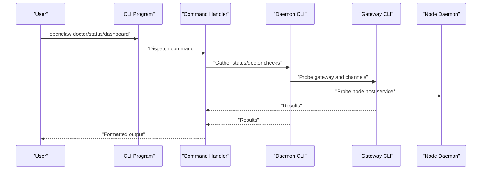
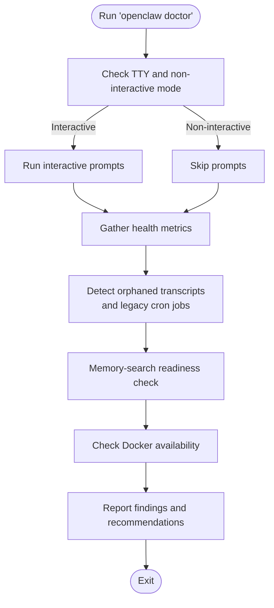
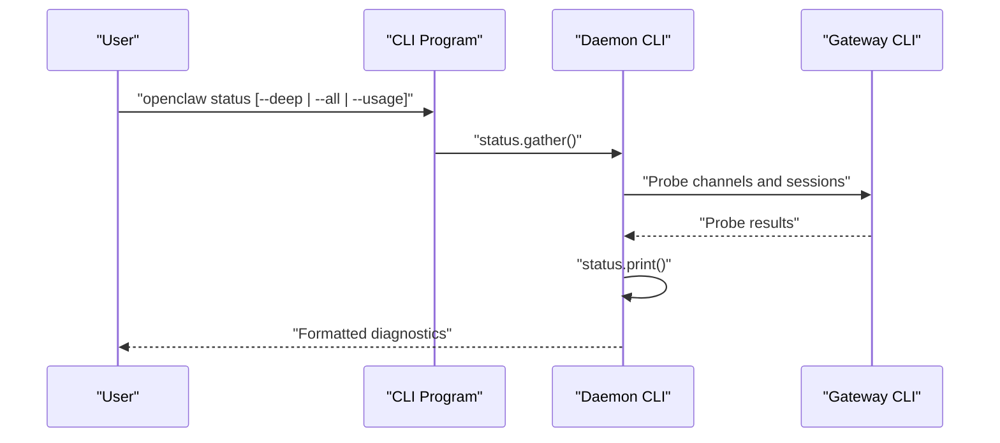
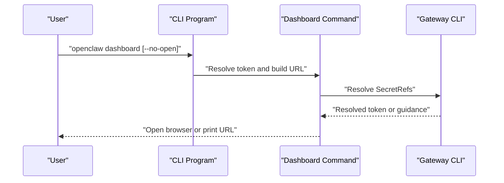
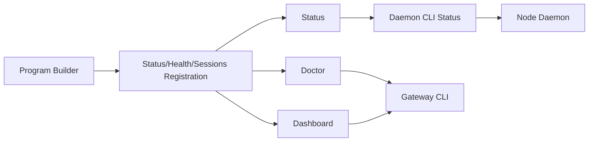

# Post-Installation Verification

<cite>
**Referenced Files in This Document**
- [doctor.md](file://docs/cli/doctor.md)
- [status.md](file://docs/cli/status.md)
- [dashboard.md](file://docs/cli/dashboard.md)
- [register.status-health-sessions.ts](file://src/cli/program/register.status-health-sessions.ts)
- [status.ts](file://src/cli/daemon-cli/status.ts)
- [print.ts](file://src/cli/daemon-cli/status.print.ts)
- [doctor.ts](file://src/commands/doctor.ts)
- [dashboard.ts](file://src/commands/dashboard.ts)
- [gateway-cli.ts](file://src/cli/gateway-cli.ts)
- [gateway-cli.run.ts](file://src/cli/gateway-cli/run.ts)
- [daemon.ts](file://src/cli/node-cli/daemon.ts)
- [system.md](file://docs/help/environment.md)
- [environment.md](file://docs/install/environment.md)
- [troubleshooting.md](file://docs/gateway/troubleshooting.md)
- [troubleshooting.md](file://docs/help/troubleshooting.md)
- [troubleshooting.md](file://docs/nodes/troubleshooting.md)
- [install.md](file://docs/install/installer.md)
- [daemon.md](file://docs/cli/daemon.md)
- [systemd.service](file://scripts/systemd/openclaw-auth-monitor.service)
- [systemd.timer](file://scripts/systemd/openclaw-auth-monitor.timer)
- [auth-monitor.sh](file://scripts/auth-monitor.sh)
</cite>

## Table of Contents
1. [Introduction](#introduction)
2. [Project Structure](#project-structure)
3. [Core Components](#core-components)
4. [Architecture Overview](#architecture-overview)
5. [Detailed Component Analysis](#detailed-component-analysis)
6. [Dependency Analysis](#dependency-analysis)
7. [Performance Considerations](#performance-considerations)
8. [Troubleshooting Guide](#troubleshooting-guide)
9. [Conclusion](#conclusion)
10. [Appendices](#appendices)

## Introduction
This document provides comprehensive post-installation verification and troubleshooting guidance for OpenClaw. It focuses on:
- Verification commands: doctor, status, and dashboard
- Environment variable configuration and their roles
- Troubleshooting common post-installation issues
- Diagnostic commands for system health and configuration validation

The goal is to help users quickly validate their installation, diagnose problems, and resolve typical issues after installing OpenClaw.

## Project Structure
OpenClaw’s CLI documentation and implementation are organized around three primary verification commands:
- Doctor: Health checks and guided repairs
- Status: Diagnostics, probes, and usage snapshots
- Dashboard: Opening the Control UI with current authentication

These commands are registered and executed via the CLI program and daemon subsystems.

**Diagram sources**
- [program.ts](file://src/cli/program.ts#L1-L3)
- [register.status-health-sessions.ts](file://src/cli/program/register.status-health-sessions.ts)
- [status.ts](file://src/cli/daemon-cli/status.ts)
- [print.ts](file://src/cli/daemon-cli/status.print.ts)
- [doctor.ts](file://src/commands/doctor.ts)
- [dashboard.ts](file://src/commands/dashboard.ts)
- [gateway-cli.ts](file://src/cli/gateway-cli.ts)
- [gateway-cli.run.ts](file://src/cli/gateway-cli/run.ts)
- [daemon.ts](file://src/cli/node-cli/daemon.ts)

**Section sources**
- [program.ts](file://src/cli/program.ts#L1-L3)
- [register.status-health-sessions.ts](file://src/cli/program/register.status-health-sessions.ts)

## Core Components
This section documents the three primary verification commands and their expected behaviors.

- Doctor
  - Purpose: Health checks plus guided repairs for the gateway and channels.
  - Typical usage: Run without flags for a quick check; use repair or deep modes for deeper diagnostics.
  - Notes: Interactive prompts run only when stdin is a TTY and not in non-interactive mode; repair mode writes backups and removes unknown config keys; detects orphaned transcript files and legacy cron job shapes; includes memory-search readiness checks and Docker availability checks.

- Status
  - Purpose: Diagnostics for channels and sessions, with optional deep probes and usage snapshots.
  - Typical usage: Run with or without flags to include all details or deep probes; includes overview of gateway and node host service status, update channel, and git SHA.
  - Notes: Deep mode runs live probes against multiple channels; read-only status resolves supported SecretRefs when possible; degraded output if SecretRef-managed tokens are unavailable in the current command path.

- Dashboard
  - Purpose: Open the Control UI using current authentication.
  - Typical usage: Launch the browser with the current token; optionally print the URL without opening the browser.
  - Notes: Resolves configured gateway.auth.token SecretRefs when possible; prints/copies/open non-tokenized URLs to avoid exposing secrets; provides explicit remediation guidance if token is unresolved.

**Section sources**
- [doctor.md](file://docs/cli/doctor.md#L1-L46)
- [status.md](file://docs/cli/status.md#L1-L29)
- [dashboard.md](file://docs/cli/dashboard.md#L1-L23)

## Architecture Overview
The verification commands integrate with the CLI program, daemon subsystem, and gateway components. The diagram below shows how these pieces work together during verification.

**Diagram sources**
- [program.ts](file://src/cli/program.ts#L1-L3)
- [register.status-health-sessions.ts](file://src/cli/program/register.status-health-sessions.ts)
- [status.ts](file://src/cli/daemon-cli/status.ts)
- [print.ts](file://src/cli/daemon-cli/status.print.ts)
- [doctor.ts](file://src/commands/doctor.ts)
- [dashboard.ts](file://src/commands/dashboard.ts)
- [gateway-cli.ts](file://src/cli/gateway-cli.ts)
- [gateway-cli.run.ts](file://src/cli/gateway-cli/run.ts)
- [daemon.ts](file://src/cli/node-cli/daemon.ts)

## Detailed Component Analysis

### Doctor Command
The doctor command performs health checks and guided repairs. It supports interactive and non-interactive modes, and can fix certain configuration issues.

Key behaviors:
- Interactive prompts: Only when stdin is a TTY and not in non-interactive mode.
- Repair mode: Writes a backup and drops unknown config keys; detects orphaned transcript files and legacy cron job shapes; memory-search readiness checks; Docker availability checks.
- macOS launchctl overrides: Can override configuration with environment variables set via launchctl, causing unauthorized errors.

Verification steps:
- Run doctor to check gateway and channel health.
- Use repair mode to apply guided fixes.
- Review warnings about Docker availability and sandbox mode.

Expected outputs:
- Health report with warnings and suggestions.
- List of removed unknown config keys when repairing.
- Guidance for Docker installation or disabling sandbox mode.

**Diagram sources**
- [doctor.md](file://docs/cli/doctor.md#L26-L45)
- [doctor.ts](file://src/commands/doctor.ts)

**Section sources**
- [doctor.md](file://docs/cli/doctor.md#L1-L46)
- [doctor.ts](file://src/commands/doctor.ts)

### Status Command
The status command provides diagnostics for channels and sessions, with optional deep probes and usage snapshots.

Key behaviors:
- Deep mode: Runs live probes against multiple channels.
- Overview: Includes gateway and node host service status, update channel, and git SHA.
- SecretRef resolution: Resolves supported SecretRefs when possible; degraded output if unavailable in current command path.

Verification steps:
- Run status to check channel and session health.
- Use deep mode for live probes.
- Review overview for gateway and node host status, update info, and git SHA.

Expected outputs:
- Channel and session diagnostics.
- Per-agent session stores when multiple agents are configured.
- Overview with update hints and git SHA.

**Diagram sources**
- [status.md](file://docs/cli/status.md#L13-L28)
- [status.ts](file://src/cli/daemon-cli/status.ts)
- [print.ts](file://src/cli/daemon-cli/status.print.ts)

**Section sources**
- [status.md](file://docs/cli/status.md#L1-L29)
- [status.ts](file://src/cli/daemon-cli/status.ts)
- [print.ts](file://src/cli/daemon-cli/status.print.ts)

### Dashboard Command
The dashboard command opens the Control UI using current authentication and handles SecretRef-managed tokens securely.

Key behaviors:
- Resolves configured gateway.auth.token SecretRefs when possible.
- Prints/copies/open non-tokenized URLs to avoid exposing secrets.
- Provides explicit remediation guidance if token is unresolved.

Verification steps:
- Run dashboard to open the Control UI with current token.
- Use no-open option to print the URL without launching the browser.

Expected outputs:
- Browser launched with the Control UI URL.
- Non-tokenized URL printed if token is unresolved.

**Diagram sources**
- [dashboard.md](file://docs/cli/dashboard.md#L13-L22)
- [dashboard.ts](file://src/commands/dashboard.ts)
- [gateway-cli.ts](file://src/cli/gateway-cli.ts)

**Section sources**
- [dashboard.md](file://docs/cli/dashboard.md#L1-L23)
- [dashboard.ts](file://src/commands/dashboard.ts)
- [gateway-cli.ts](file://src/cli/gateway-cli.ts)

## Dependency Analysis
The verification commands rely on the CLI program registration and the daemon subsystem for gathering and printing diagnostics.

**Diagram sources**
- [program.ts](file://src/cli/program.ts#L1-L3)
- [register.status-health-sessions.ts](file://src/cli/program/register.status-health-sessions.ts)
- [status.ts](file://src/cli/daemon-cli/status.ts)
- [print.ts](file://src/cli/daemon-cli/status.print.ts)
- [doctor.ts](file://src/commands/doctor.ts)
- [dashboard.ts](file://src/commands/dashboard.ts)
- [gateway-cli.ts](file://src/cli/gateway-cli.ts)
- [daemon.ts](file://src/cli/node-cli/daemon.ts)

**Section sources**
- [program.ts](file://src/cli/program.ts#L1-L3)
- [register.status-health-sessions.ts](file://src/cli/program/register.status-health-sessions.ts)
- [status.ts](file://src/cli/daemon-cli/status.ts)
- [print.ts](file://src/cli/daemon-cli/status.print.ts)
- [doctor.ts](file://src/commands/doctor.ts)
- [dashboard.ts](file://src/commands/dashboard.ts)
- [gateway-cli.ts](file://src/cli/gateway-cli.ts)
- [daemon.ts](file://src/cli/node-cli/daemon.ts)

## Performance Considerations
- Deep status probes can be resource-intensive; use them selectively when diagnosing issues.
- Doctor repairs may involve filesystem operations (backups, file rewrites); schedule during maintenance windows.
- Dashboard URL resolution avoids exposing secrets, minimizing risk during diagnostics.

[No sources needed since this section provides general guidance]

## Troubleshooting Guide

### Environment Variables
OpenClaw relies on several environment variables for configuration and operation. Configure them appropriately after installation.

- OPENCLAW_HOME
  - Purpose: Root directory for OpenClaw configuration and state.
  - Typical value: User home directory under .openclaw.
  - Impact: Determines where configuration files and state are stored.

- OPENCLAW_STATE_DIR
  - Purpose: Directory for runtime state and transient data.
  - Typical value: Subdirectory within OPENCLAW_HOME.
  - Impact: Controls where temporary and runtime files are placed.

- OPENCLAW_CONFIG_PATH
  - Purpose: Path to the main configuration file.
  - Typical value: JSON configuration file within OPENCLAW_HOME.
  - Impact: Overrides default configuration location.

Configuration tips:
- Set OPENCLAW_HOME to a writable directory owned by the user.
- Ensure OPENCLAW_STATE_DIR exists and is writable.
- Verify OPENCLAW_CONFIG_PATH points to a valid configuration file.

**Section sources**
- [system.md](file://docs/help/environment.md)
- [environment.md](file://docs/install/environment.md)

### PATH Configuration Problems
Symptoms:
- Commands not found after installation.
- Terminal cannot locate openclaw binaries.

Resolution steps:
- Add the installation bin directory to PATH.
- Reload shell configuration or open a new terminal.
- Verify with which openclaw or where openclaw.

Common locations:
- Linux/macOS: /usr/local/bin or ~/.local/bin
- Windows: Add to System PATH via Environment Variables

**Section sources**
- [install.md](file://docs/install/installer.md)

### Daemon Startup Failures
Symptoms:
- Gateway or node host service fails to start.
- Status shows degraded or offline services.

Resolution steps:
- Check daemon logs for errors.
- Verify system service configuration (systemd).
- Restart the daemon and confirm it runs without errors.

Systemd integration:
- Service unit: openclaw-auth-monitor.service
- Timer unit: openclaw-auth-monitor.timer
- Monitor script: auth-monitor.sh

**Section sources**
- [daemon.md](file://docs/cli/daemon.md)
- [systemd.service](file://scripts/systemd/openclaw-auth-monitor.service)
- [systemd.timer](file://scripts/systemd/openclaw-auth-monitor.timer)
- [auth-monitor.sh](file://scripts/auth-monitor.sh)

### Permission Issues
Symptoms:
- Cannot write to configuration or state directories.
- Doctor or status commands fail with permission errors.

Resolution steps:
- Ensure OPENCLAW_HOME and OPENCLAW_STATE_DIR are writable by the user.
- Fix ownership and permissions recursively if needed.
- Re-run verification commands after correcting permissions.

**Section sources**
- [doctor.md](file://docs/cli/doctor.md#L29-L33)
- [troubleshooting.md](file://docs/gateway/troubleshooting.md)
- [troubleshooting.md](file://docs/help/troubleshooting.md)
- [troubleshooting.md](file://docs/nodes/troubleshooting.md)

### macOS launchctl Overrides
Symptoms:
- Persistent unauthorized errors despite correct configuration.
- Unexpected token/password overrides.

Resolution steps:
- Check for launchctl-set environment variables.
- Unset conflicting variables if present.
- Re-run verification commands.

**Section sources**
- [doctor.md](file://docs/cli/doctor.md#L35-L45)

### Diagnostic Commands
Use these commands to assess system health and validate configuration:

- Doctor: Health checks and guided repairs.
- Status: Diagnostics for channels and sessions, with optional deep probes.
- Dashboard: Open the Control UI with current authentication.

Additional checks:
- Verify gateway and node host service status via status.
- Confirm update channel and git SHA for reproducible builds.
- Review SecretRef diagnostics for resolved/unresolved tokens.

**Section sources**
- [doctor.md](file://docs/cli/doctor.md#L1-L46)
- [status.md](file://docs/cli/status.md#L1-L29)
- [dashboard.md](file://docs/cli/dashboard.md#L1-L23)

## Conclusion
By following this guide, you can verify your OpenClaw installation, diagnose common issues, and maintain a healthy system. Use doctor for health checks and guided repairs, status for diagnostics and probes, and dashboard to access the Control UI securely. Ensure environment variables are configured correctly, PATH is set properly, and daemon services are running. When in doubt, consult the troubleshooting sections and run the diagnostic commands again.

[No sources needed since this section summarizes without analyzing specific files]

## Appendices

### Quick Reference: Verification Commands
- Doctor: Health checks and guided repairs
- Status: Diagnostics and probes
- Dashboard: Open Control UI with current token

**Section sources**
- [doctor.md](file://docs/cli/doctor.md#L1-L46)
- [status.md](file://docs/cli/status.md#L1-L29)
- [dashboard.md](file://docs/cli/dashboard.md#L1-L23)