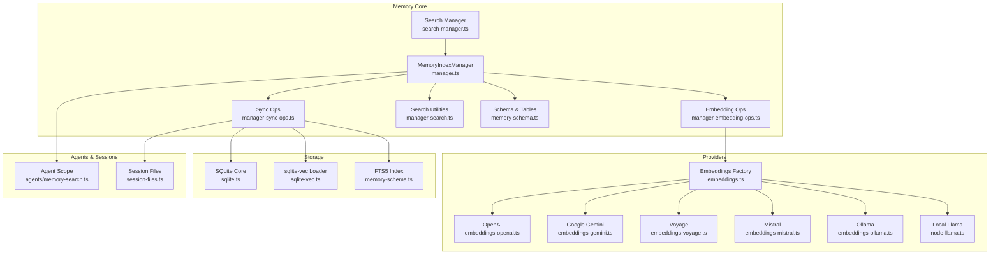
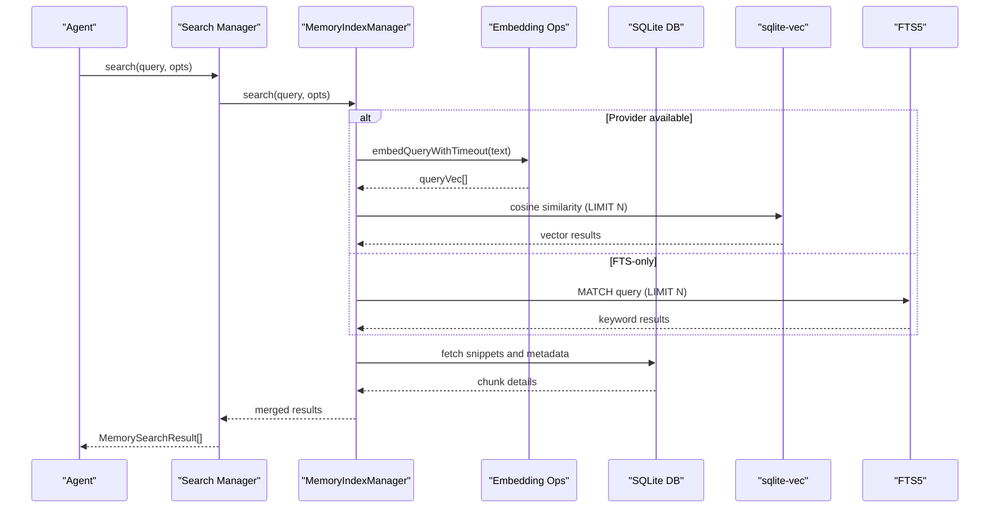
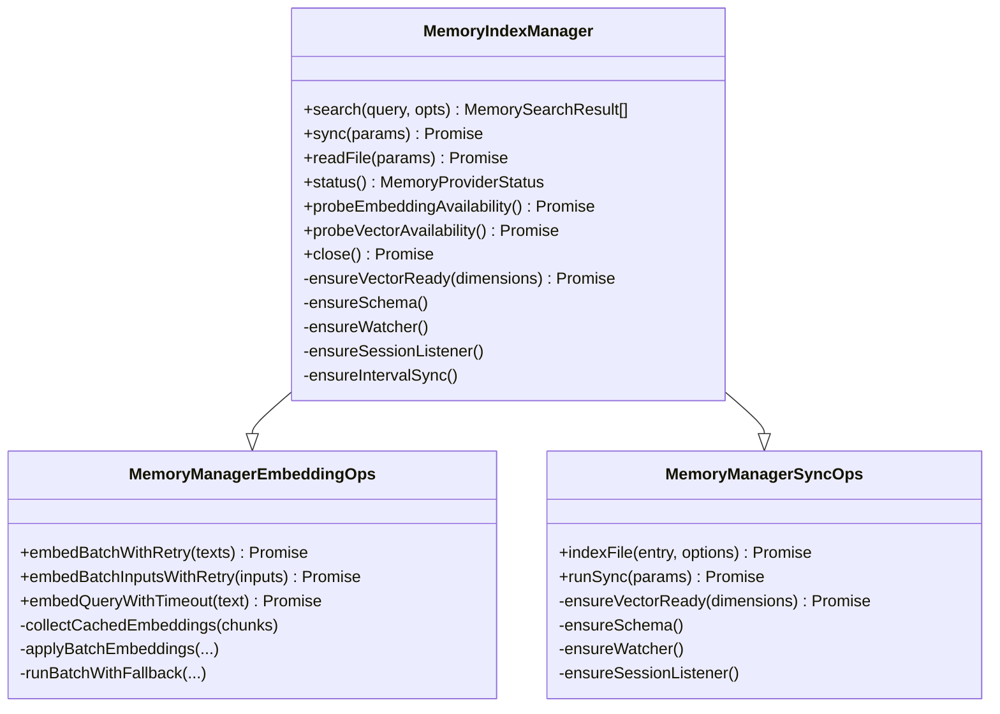
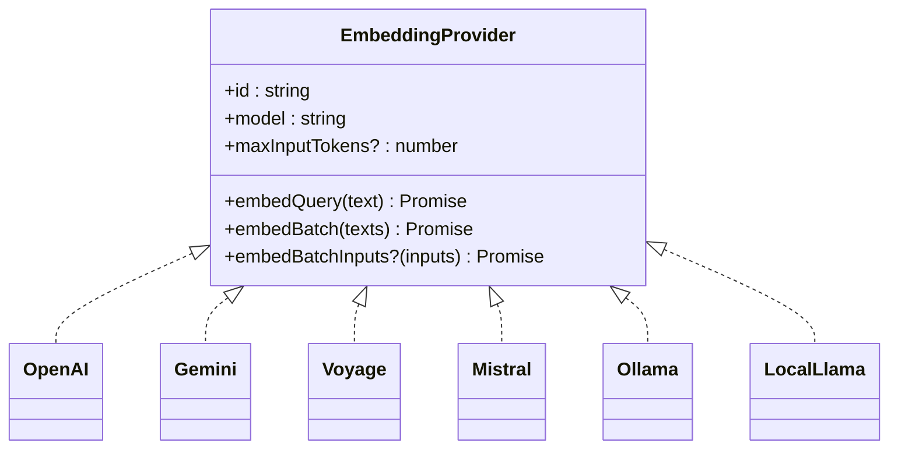
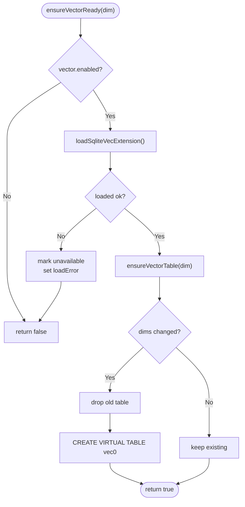
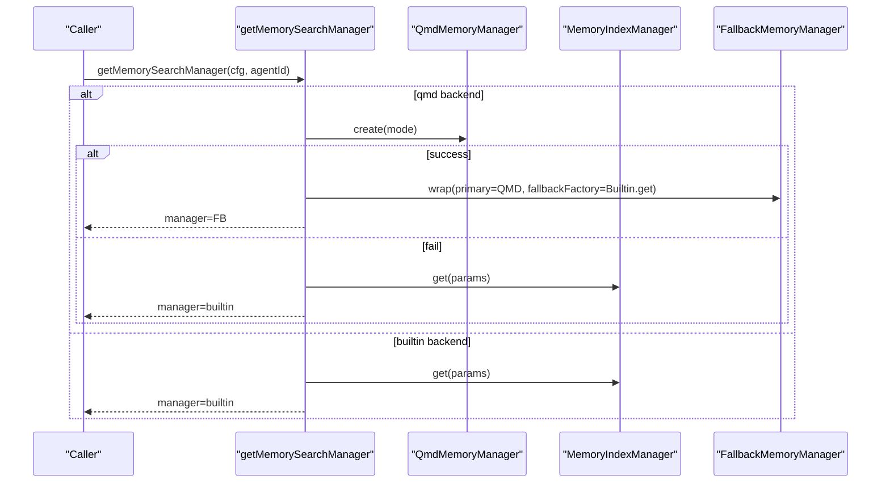
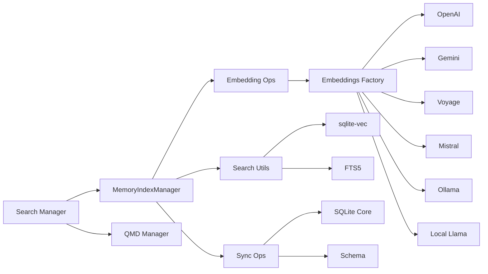

# Memory Architecture

<cite>
**Referenced Files in This Document**
- [src/memory/index.ts](file://src/memory/index.ts)
- [src/memory/manager.ts](file://src/memory/manager.ts)
- [src/memory/manager-embedding-ops.ts](file://src/memory/manager-embedding-ops.ts)
- [src/memory/manager-sync-ops.ts](file://src/memory/manager-sync-ops.ts)
- [src/memory/manager-search.ts](file://src/memory/manager-search.ts)
- [src/memory/search-manager.ts](file://src/memory/search-manager.ts)
- [src/memory/sqlite-vec.ts](file://src/memory/sqlite-vec.ts)
- [src/memory/types.ts](file://src/memory/types.ts)
- [src/memory/backend-config.ts](file://src/memory/backend-config.ts)
- [src/memory/embeddings.ts](file://src/memory/embeddings.ts)
- [src/memory/embedding-model-limits.ts](file://src/memory/embedding-model-limits.ts)
- [src/memory/qmd-manager.ts](file://src/memory/qmd-manager.ts)
- [src/memory/internal.ts](file://src/memory/internal.ts)
- [src/memory/hybrid.ts](file://src/memory/hybrid.ts)
- [src/memory/query-expansion.ts](file://src/memory/query-expansion.ts)
- [src/memory/temporal-decay.ts](file://src/memory/temporal-decay.ts)
- [src/memory/mmr.ts](file://src/memory/mmr.ts)
- [src/memory/memory-schema.ts](file://src/memory/memory-schema.ts)
- [src/memory/session-files.ts](file://src/memory/session-files.ts)
- [src/memory/fs-utils.ts](file://src/memory/fs-utils.ts)
- [src/memory/node-llama.ts](file://src/memory/node-llama.ts)
- [src/memory/embeddings-openai.ts](file://src/memory/embeddings-openai.ts)
- [src/memory/embeddings-gemini.ts](file://src/memory/embeddings-gemini.ts)
- [src/memory/embeddings-voyage.ts](file://src/memory/embeddings-voyage.ts)
- [src/memory/embeddings-mistral.ts](file://src/memory/embeddings-mistral.ts)
- [src/memory/embeddings-ollama.ts](file://src/memory/embeddings-ollama.ts)
- [src/memory/batch-openai.ts](file://src/memory/batch-openai.ts)
- [src/memory/batch-gemini.ts](file://src/memory/batch-gemini.ts)
- [src/memory/batch-voyage.ts](file://src/memory/batch-voyage.ts)
- [src/memory/batch-runner.ts](file://src/memory/batch-runner.ts)
- [src/memory/batch-utils.ts](file://src/memory/batch-utils.ts)
- [src/memory/batch-status.ts](file://src/memory/batch-status.ts)
- [src/memory/batch-error-utils.ts](file://src/memory/batch-error-utils.ts)
- [src/memory/embedding-inputs.ts](file://src/memory/embedding-inputs.ts)
- [src/memory/embedding-chunk-limits.ts](file://src/memory/embedding-chunk-limits.ts)
- [src/memory/embedding-input-limits.ts](file://src/memory/embedding-input-limits.ts)
- [src/memory/embedding-vectors.ts](file://src/memory/embedding-vectors.ts)
- [src/memory/post-json.ts](file://src/memory/post-json.ts)
- [src/memory/remote-http.ts](file://src/memory/remote-http.ts)
- [src/memory/sqlite.ts](file://src/memory/sqlite.ts)
- [src/memory/status-format.ts](file://src/memory/status-format.ts)
- [src/memory/test-manager.ts](file://src/memory/test-manager.ts)
- [src/memory/test-manager-helpers.ts](file://src/memory/test-manager-helpers.ts)
- [src/memory/test-runtime-mocks.ts](file://src/memory/test-runtime-mocks.ts)
- [src/memory/test-embeddings-mock.ts](file://src/memory/test-embeddings-mock.ts)
- [src/memory/test-helpers/ssrf.ts](file://src/memory/test-helpers/ssrf.ts)
- [src/memory/test-manager.ts](file://src/memory/test-manager.ts)
- [src/memory/test-manager-helpers.ts](file://src/memory/test-manager-helpers.ts)
- [src/memory/test-runtime-mocks.ts](file://src/memory/test-runtime-mocks.ts)
- [src/memory/test-embeddings-mock.ts](file://src/memory/test-embeddings-mock.ts)
- [src/memory/test-helpers/ssrf.ts](file://src/memory/test-helpers/ssrf.ts)
</cite>

## Table of Contents
1. [Introduction](#introduction)
2. [Project Structure](#project-structure)
3. [Core Components](#core-components)
4. [Architecture Overview](#architecture-overview)
5. [Detailed Component Analysis](#detailed-component-analysis)
6. [Dependency Analysis](#dependency-analysis)
7. [Performance Considerations](#performance-considerations)
8. [Troubleshooting Guide](#troubleshooting-guide)
9. [Conclusion](#conclusion)

## Introduction
This document describes OpenClaw’s vector-based memory architecture. It explains how documents and session transcripts are ingested, chunked, embedded, and indexed using SQLite with the sqlite-vec extension for vector similarity search, and FTS5 for keyword search. It covers the MemoryIndexManager, search manager patterns, embedding providers, batching, and memory probe mechanisms. It also details the relationship between memory components and agent systems, along with technical specifications for vector dimensions, embedding models, storage optimization, scaling, concurrency, and performance characteristics.

## Project Structure
The memory subsystem is organized around a central MemoryIndexManager that orchestrates ingestion, embedding, indexing, and search. Supporting modules handle embedding providers, batching, hybrid search, schema management, and session synchronization.

**Diagram sources**
- [src/memory/search-manager.ts:25-86](file://src/memory/search-manager.ts#L25-L86)
- [src/memory/manager.ts:61-241](file://src/memory/manager.ts#L61-L241)
- [src/memory/manager-embedding-ops.ts:49-80](file://src/memory/manager-embedding-ops.ts#L49-L80)
- [src/memory/manager-sync-ops.ts:97-169](file://src/memory/manager-sync-ops.ts#L97-L169)
- [src/memory/manager-search.ts:20-94](file://src/memory/manager-search.ts#L20-L94)
- [src/memory/memory-schema.ts](file://src/memory/memory-schema.ts)
- [src/memory/embeddings.ts:168-288](file://src/memory/embeddings.ts#L168-L288)
- [src/memory/sqlite.ts](file://src/memory/sqlite.ts)
- [src/memory/sqlite-vec.ts:3-24](file://src/memory/sqlite-vec.ts#L3-L24)
- [src/memory/session-files.ts](file://src/memory/session-files.ts)

**Section sources**
- [src/memory/index.ts:1-12](file://src/memory/index.ts#L1-L12)
- [src/memory/search-manager.ts:25-86](file://src/memory/search-manager.ts#L25-L86)
- [src/memory/manager.ts:61-241](file://src/memory/manager.ts#L61-L241)

## Core Components
- MemoryIndexManager: Central orchestrator for ingestion, embedding, indexing, and search. Manages provider selection, vector/FTS availability, schema, watchers, and session deltas.
- Embedding Operations: Batch embedding orchestration, caching, retries, timeouts, and provider-specific batching (OpenAI, Gemini, Voyage).
- Sync Operations: File and session ingestion, delta tracking, schema enforcement, and atomic reindexing.
- Search Utilities: Vector similarity search via sqlite-vec and keyword search via FTS5, with hybrid scoring and MMR.
- Embedding Providers: OpenAI, Google Gemini, Voyage AI, Mistral, Ollama, and local node-llama-cpp.
- Storage: SQLite with sqlite-vec virtual tables for vectors and FTS5 for text search.

**Section sources**
- [src/memory/manager.ts:61-241](file://src/memory/manager.ts#L61-L241)
- [src/memory/manager-embedding-ops.ts:49-80](file://src/memory/manager-embedding-ops.ts#L49-L80)
- [src/memory/manager-sync-ops.ts:97-169](file://src/memory/manager-sync-ops.ts#L97-L169)
- [src/memory/manager-search.ts:20-94](file://src/memory/manager-search.ts#L20-L94)
- [src/memory/embeddings.ts:168-288](file://src/memory/embeddings.ts#L168-L288)

## Architecture Overview
The memory architecture integrates three layers:
- Ingestion and Synchronization: Watches filesystem and session transcripts, computes file hashes, and indexes new or changed content into SQLite tables (files, chunks, embedding_cache, FTS virtual table, and vec0 vector table).
- Embedding and Batching: Uses selected embedding provider to generate vectors, caches results, and applies provider-specific batching with retries and timeouts.
- Search and Retrieval: Supports vector-only, keyword-only, and hybrid modes. Vector search uses cosine distance via sqlite-vec; keyword search uses FTS5 BM25 ranking. Results are merged with optional MMR and temporal decay.

**Diagram sources**
- [src/memory/search-manager.ts:25-86](file://src/memory/search-manager.ts#L25-L86)
- [src/memory/manager.ts:259-367](file://src/memory/manager.ts#L259-L367)
- [src/memory/manager-search.ts:20-94](file://src/memory/manager-search.ts#L20-L94)
- [src/memory/manager-embedding-ops.ts:615-626](file://src/memory/manager-embedding-ops.ts#L615-L626)
- [src/memory/sqlite-vec.ts:3-24](file://src/memory/sqlite-vec.ts#L3-L24)

## Detailed Component Analysis

### MemoryIndexManager
Responsibilities:
- Provider lifecycle: create embedding provider, handle fallbacks, and expose availability probes.
- Schema and tables: ensure files, chunks, embedding_cache, FTS virtual table, and vec0 vector table exist.
- Vector readiness: load sqlite-vec extension, ensure vector table dimensions, and handle read-only recovery.
- Sync orchestration: watch memory and session sources, compute deltas, and reindex with concurrency.
- Search pipeline: hybrid search combining vector and keyword results, with optional MMR and temporal decay.

Key behaviors:
- Caching: embedding_cache table keyed by provider, model, and provider_key to avoid recomputation.
- Concurrency: configurable embedding index concurrency and batch concurrency.
- Reliability: read-only DB recovery by reopening connection and reinitializing vector state.

**Diagram sources**
- [src/memory/manager.ts:61-241](file://src/memory/manager.ts#L61-L241)
- [src/memory/manager-embedding-ops.ts:49-80](file://src/memory/manager-embedding-ops.ts#L49-L80)
- [src/memory/manager-sync-ops.ts:97-169](file://src/memory/manager-sync-ops.ts#L97-L169)

**Section sources**
- [src/memory/manager.ts:61-241](file://src/memory/manager.ts#L61-L241)
- [src/memory/manager.ts:259-367](file://src/memory/manager.ts#L259-L367)
- [src/memory/manager.ts:454-590](file://src/memory/manager.ts#L454-L590)
- [src/memory/manager.ts:664-776](file://src/memory/manager.ts#L664-L776)
- [src/memory/manager.ts:778-804](file://src/memory/manager.ts#L778-L804)

### Embedding Provider System
Capabilities:
- Providers: OpenAI, Google Gemini, Voyage AI, Mistral, Ollama, and local node-llama-cpp.
- Auto-selection: “auto” chooses local if available, otherwise remote providers by preference.
- Structured inputs: multimodal embedding inputs supported by some providers.
- Limits: provider-specific max input tokens with conservative fallbacks.
- Batching: provider-specific batch runners with concurrency, polling, and timeouts.

**Diagram sources**
- [src/memory/embeddings.ts:29-36](file://src/memory/embeddings.ts#L29-L36)
- [src/memory/embeddings-openai.ts](file://src/memory/embeddings-openai.ts)
- [src/memory/embeddings-gemini.ts](file://src/memory/embeddings-gemini.ts)
- [src/memory/embeddings-voyage.ts](file://src/memory/embeddings-voyage.ts)
- [src/memory/embeddings-mistral.ts](file://src/memory/embeddings-mistral.ts)
- [src/memory/embeddings-ollama.ts](file://src/memory/embeddings-ollama.ts)
- [src/memory/node-llama.ts](file://src/memory/node-llama.ts)

**Section sources**
- [src/memory/embeddings.ts:168-288](file://src/memory/embeddings.ts#L168-L288)
- [src/memory/embedding-model-limits.ts:18-41](file://src/memory/embedding-model-limits.ts#L18-L41)

### Vector Embedding Storage and sqlite-vec
- Virtual table: chunks_vec(vec0) with FLOAT[dimensions] embedding column.
- Dimensions: determined by provider model; table recreated if dimensions change.
- Extension loading: dynamic load sqlite-vec, with optional explicit path resolution.
- Readiness: ensureVectorReady loads extension and creates table if needed.

**Diagram sources**
- [src/memory/manager-sync-ops.ts:170-196](file://src/memory/manager-sync-ops.ts#L170-L196)
- [src/memory/manager-sync-ops.ts:198-224](file://src/memory/manager-sync-ops.ts#L198-L224)
- [src/memory/manager-sync-ops.ts:226-240](file://src/memory/manager-sync-ops.ts#L226-L240)
- [src/memory/sqlite-vec.ts:3-24](file://src/memory/sqlite-vec.ts#L3-L24)

**Section sources**
- [src/memory/manager-sync-ops.ts:170-240](file://src/memory/manager-sync-ops.ts#L170-L240)
- [src/memory/sqlite-vec.ts:3-24](file://src/memory/sqlite-vec.ts#L3-L24)

### Search Manager Patterns and Fallback
- getMemorySearchManager resolves backend configuration and returns either a QMD manager or the builtin MemoryIndexManager.
- FallbackMemoryManager wraps a primary manager and falls back to builtin when primary fails, with cache eviction and status propagation.

**Diagram sources**
- [src/memory/search-manager.ts:25-86](file://src/memory/search-manager.ts#L25-L86)
- [src/memory/search-manager.ts:104-247](file://src/memory/search-manager.ts#L104-L247)

**Section sources**
- [src/memory/search-manager.ts:25-86](file://src/memory/search-manager.ts#L25-L86)
- [src/memory/search-manager.ts:104-247](file://src/memory/search-manager.ts#L104-L247)

### Memory Probe Mechanisms
- probeEmbeddingAvailability: tests provider readiness for queries.
- probeVectorAvailability: checks vector extension availability and table readiness.

**Section sources**
- [src/memory/manager.ts:778-804](file://src/memory/manager.ts#L778-L804)
- [src/memory/manager.ts:778-787](file://src/memory/manager.ts#L778-L787)

### Relationship Between Memory and Agent Systems
- Agents configure memory search behavior via agents/memory-search.ts and memory backend configuration.
- MemoryIndexManager reads agent workspace and session directories, watches for changes, and synchronizes accordingly.
- Session transcripts are monitored for incremental updates with delta thresholds.

**Section sources**
- [src/memory/backend-config.ts:297-354](file://src/memory/backend-config.ts#L297-L354)
- [src/memory/manager-sync-ops.ts:434-448](file://src/memory/manager-sync-ops.ts#L434-L448)
- [src/memory/manager-sync-ops.ts:501-558](file://src/memory/manager-sync-ops.ts#L501-L558)

## Dependency Analysis
Key dependencies and interactions:
- MemoryIndexManager depends on EmbeddingProvider, sqlite-vec, and FTS5.
- Embedding operations depend on provider-specific modules and batching runners.
- Search utilities depend on vector and FTS tables and use hybrid scoring and MMR.
- Backend configuration determines whether to use QMD or builtin manager.

**Diagram sources**
- [src/memory/manager.ts:61-241](file://src/memory/manager.ts#L61-L241)
- [src/memory/manager-search.ts:20-94](file://src/memory/manager-search.ts#L20-L94)
- [src/memory/manager-sync-ops.ts:97-169](file://src/memory/manager-sync-ops.ts#L97-L169)
- [src/memory/search-manager.ts:25-86](file://src/memory/search-manager.ts#L25-L86)
- [src/memory/embeddings.ts:168-288](file://src/memory/embeddings.ts#L168-L288)

**Section sources**
- [src/memory/manager.ts:61-241](file://src/memory/manager.ts#L61-L241)
- [src/memory/manager-search.ts:20-94](file://src/memory/manager-search.ts#L20-L94)
- [src/memory/manager-sync-ops.ts:97-169](file://src/memory/manager-sync-ops.ts#L97-L169)
- [src/memory/search-manager.ts:25-86](file://src/memory/search-manager.ts#L25-L86)
- [src/memory/embeddings.ts:168-288](file://src/memory/embeddings.ts#L168-L288)

## Performance Considerations
- Vector dimensions: determined by provider model; table recreation occurs when dimensions change.
- Concurrency: embedding index concurrency and batch concurrency configurable; batching reduces cost and latency.
- Caching: embedding_cache prunes by maxEntries to cap memory usage.
- Timeouts: per-query and per-batch timeouts vary by provider locality.
- Hybrid search: candidate multiplier controls breadth; MMR and temporal decay reduce redundancy and bias toward recency.
- Read-only recovery: automatic reopen and reinitialize on SQLITE_READONLY to maintain availability.

[No sources needed since this section provides general guidance]

## Troubleshooting Guide
Common issues and remedies:
- sqlite-vec load failures: check extension path and permissions; ensure SQLite allows extension loading.
- Read-only database errors: handled by reopening DB connection and reinitializing vector state.
- Provider unavailability: fallback to another provider or degrade to FTS-only mode; check API keys and network.
- Batch failures: tracked with failure count and lock; timeouts retried once; excessive failures disable batching.
- Embedding errors: rate limiting and resource exhaustion trigger exponential backoff retries.

**Section sources**
- [src/memory/manager-sync-ops.ts:198-224](file://src/memory/manager-sync-ops.ts#L198-L224)
- [src/memory/manager.ts:505-589](file://src/memory/manager.ts#L505-L589)
- [src/memory/manager-embedding-ops.ts:698-754](file://src/memory/manager-embedding-ops.ts#L698-L754)
- [src/memory/manager-embedding-ops.ts:524-626](file://src/memory/manager-embedding-ops.ts#L524-L626)

## Conclusion
OpenClaw’s memory architecture combines SQLite with sqlite-vec for efficient vector similarity search and FTS5 for keyword search, orchestrated by MemoryIndexManager. The system supports multiple embedding providers, batching, caching, and hybrid retrieval with MMR and temporal decay. Robustness is ensured through provider fallbacks, read-only recovery, and careful concurrency control. This design enables scalable, reliable memory for agent-driven workflows across diverse environments.