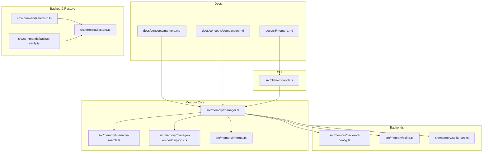
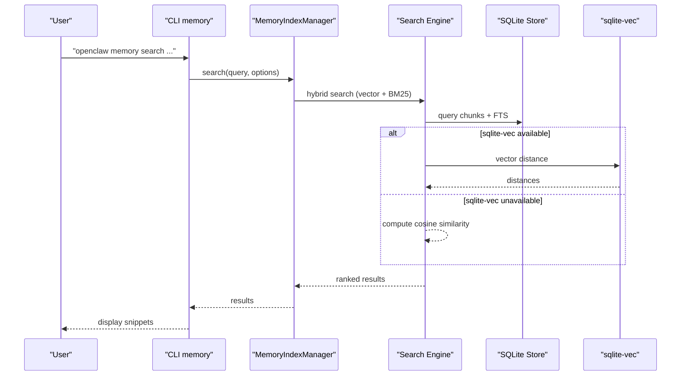
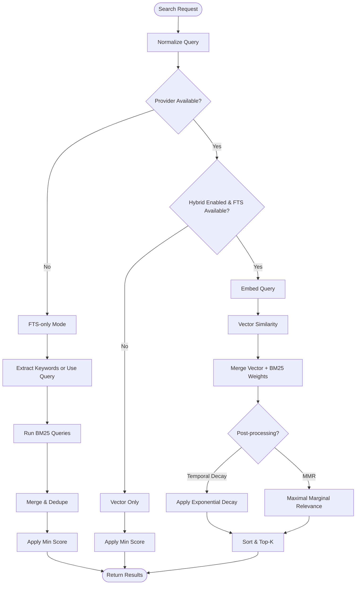
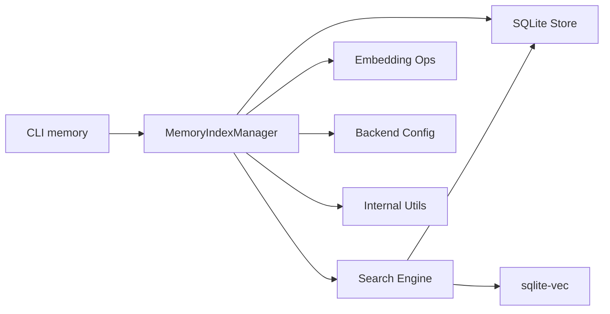

# Memory Operations & Maintenance

<cite>
**Referenced Files in This Document**
- [memory.md](file://docs/concepts/memory.md)
- [compaction.md](file://docs/concepts/compaction.md)
- [memory.md](file://docs/cli/memory.md)
- [manager.ts](file://src/memory/manager.ts)
- [manager-search.ts](file://src/memory/manager-search.ts)
- [manager-embedding-ops.ts](file://src/memory/manager-embedding-ops.ts)
- [internal.ts](file://src/memory/internal.ts)
- [backend-config.ts](file://src/memory/backend-config.ts)
- [sqlite.ts](file://src/memory/sqlite.ts)
- [sqlite-vec.ts](file://src/memory/sqlite-vec.ts)
- [backup.ts](file://src/commands/backup.ts)
- [backup-verify.ts](file://src/commands/backup-verify.ts)
- [restore.ts](file://src/terminal/restore.ts)
- [memory-cli.ts](file://src/cli/memory-cli.ts)
</cite>

## Table of Contents
1. [Introduction](#introduction)
2. [Project Structure](#project-structure)
3. [Core Components](#core-components)
4. [Architecture Overview](#architecture-overview)
5. [Detailed Component Analysis](#detailed-component-analysis)
6. [Dependency Analysis](#dependency-analysis)
7. [Performance Considerations](#performance-considerations)
8. [Troubleshooting Guide](#troubleshooting-guide)
9. [Conclusion](#conclusion)
10. [Appendices](#appendices)

## Introduction
This document explains how OpenClaw manages memory, including indexing, search, compaction, and maintenance. It covers memory compaction, vacuum-like operations, storage optimization, scheduling, automated cleanup, and manual maintenance. It also documents backup and restore procedures, integrity verification, and operational best practices for production environments.

## Project Structure
Memory operations are implemented primarily in the memory subsystem under src/memory, with configuration and CLI integration in docs and src/cli. Key areas:
- Concepts and configuration: docs/concepts/memory.md, docs/concepts/compaction.md
- CLI memory commands: docs/cli/memory.md, src/cli/memory-cli.ts
- Indexing and search engine: src/memory/manager.ts, src/memory/manager-search.ts
- Embedding batching and caching: src/memory/manager-embedding-ops.ts
- Backend selection and QMD configuration: src/memory/backend-config.ts
- SQLite and sqlite-vec integration: src/memory/sqlite.ts, src/memory/sqlite-vec.ts
- Backup and restore: src/commands/backup.ts, src/commands/backup-verify.ts, src/terminal/restore.ts



**Diagram sources**
- [memory.md](file://docs/concepts/memory.md)
- [compaction.md](file://docs/concepts/compaction.md)
- [memory.md](file://docs/cli/memory.md)
- [manager.ts](file://src/memory/manager.ts)
- [manager-search.ts](file://src/memory/manager-search.ts)
- [manager-embedding-ops.ts](file://src/memory/manager-embedding-ops.ts)
- [internal.ts](file://src/memory/internal.ts)
- [backend-config.ts](file://src/memory/backend-config.ts)
- [sqlite.ts](file://src/memory/sqlite.ts)
- [sqlite-vec.ts](file://src/memory/sqlite-vec.ts)
- [memory-cli.ts](file://src/cli/memory-cli.ts)
- [backup.ts](file://src/commands/backup.ts)
- [backup-verify.ts](file://src/commands/backup-verify.ts)
- [restore.ts](file://src/terminal/restore.ts)

**Section sources**
- [memory.md](file://docs/concepts/memory.md)
- [compaction.md](file://docs/concepts/compaction.md)
- [memory.md](file://docs/cli/memory.md)
- [manager.ts](file://src/memory/manager.ts)
- [manager-search.ts](file://src/memory/manager-search.ts)
- [manager-embedding-ops.ts](file://src/memory/manager-embedding-ops.ts)
- [internal.ts](file://src/memory/internal.ts)
- [backend-config.ts](file://src/memory/backend-config.ts)
- [sqlite.ts](file://src/memory/sqlite.ts)
- [sqlite-vec.ts](file://src/memory/sqlite-vec.ts)
- [memory-cli.ts](file://src/cli/memory-cli.ts)
- [backup.ts](file://src/commands/backup.ts)
- [backup-verify.ts](file://src/commands/backup-verify.ts)
- [restore.ts](file://src/terminal/restore.ts)

## Core Components
- Memory index manager: orchestrates indexing, search, and maintenance for a given agent. Handles embedding providers, FTS/BM25, vector acceleration, and read-only recovery.
- Search engine: hybrid vector + BM25 search with optional temporal decay and MMR re-ranking.
- Embedding ops: batching, caching, timeouts, retries, and structured inputs for multimodal memory.
- Backend configuration: resolves memory backend (builtin or QMD), collections, update intervals, and limits.
- SQLite integration: database initialization, schema, and sqlite-vec extension loading.
- CLI memory tools: status, index, and search commands for diagnostics and maintenance.
- Backup and restore: atomic backups, verification, and restoration utilities.

**Section sources**
- [manager.ts](file://src/memory/manager.ts)
- [manager-search.ts](file://src/memory/manager-search.ts)
- [manager-embedding-ops.ts](file://src/memory/manager-embedding-ops.ts)
- [backend-config.ts](file://src/memory/backend-config.ts)
- [sqlite.ts](file://src/memory/sqlite.ts)
- [sqlite-vec.ts](file://src/memory/sqlite-vec.ts)
- [memory.md](file://docs/cli/memory.md)
- [memory-cli.ts](file://src/cli/memory-cli.ts)
- [backup.ts](file://src/commands/backup.ts)
- [backup-verify.ts](file://src/commands/backup-verify.ts)
- [restore.ts](file://src/terminal/restore.ts)

## Architecture Overview
The memory subsystem builds a per-agent SQLite store of chunks and metadata, optionally accelerated by sqlite-vec. It supports hybrid search combining vector similarity and BM25 keyword ranking, with optional temporal decay and MMR re-ranking. Indexing is triggered by file watchers, session deltas, or explicit commands. Compaction reduces context window pressure by summarizing older history; a pre-compaction memory flush ensures durable notes are persisted before summarization.



**Diagram sources**
- [memory.md](file://docs/cli/memory.md)
- [manager.ts](file://src/memory/manager.ts)
- [manager-search.ts](file://src/memory/manager-search.ts)
- [sqlite-vec.ts](file://src/memory/sqlite-vec.ts)

## Detailed Component Analysis

### Memory Index Manager
Responsibilities:
- Initialize and maintain per-agent SQLite store with files, chunks, and embedding cache tables.
- Manage embedding provider selection, fallback, and batch configuration.
- Watch memory files and sessions for changes; schedule incremental syncs.
- Provide search (hybrid vector + BM25), keyword-only, and vector-only modes.
- Handle read-only DB recovery by reopening connections and reinitializing state.
- Expose status with counts, provider info, cache stats, and vector availability.

Key behaviors:
- On-demand sync on search when dirty.
- Debounced file watching and session delta thresholds.
- Provider key hashing to detect configuration changes requiring reindex.
- Vector acceleration via sqlite-vec with graceful fallback.

```mermaid
classDiagram
class MemoryIndexManager {
+search(query, opts) MemorySearchResult[]
+sync(params) Promise<void>
+readFile(params) Promise<{text,path}>
+status() MemoryProviderStatus
+probeVectorAvailability() Promise<bool>
+probeEmbeddingAvailability() Promise<MemoryEmbeddingProbeResult>
-runSyncWithReadonlyRecovery(params) Promise<void>
-ensureVectorReady(dimensions) Promise<bool>
}
class SearchEngine {
+searchVector(db, queryVec, limit)
+searchKeyword(db, query, limit)
+mergeHybridResults(...)
}
class EmbeddingOps {
+embedBatchWithRetry(texts)
+embedBatchInputsWithRetry(inputs)
+withTimeout(promise, timeoutMs, msg)
+pruneEmbeddingCacheIfNeeded()
}
MemoryIndexManager --> SearchEngine : "uses"
MemoryIndexManager --> EmbeddingOps : "uses"
```

**Diagram sources**
- [manager.ts](file://src/memory/manager.ts)
- [manager-search.ts](file://src/memory/manager-search.ts)
- [manager-embedding-ops.ts](file://src/memory/manager-embedding-ops.ts)

**Section sources**
- [manager.ts](file://src/memory/manager.ts)
- [manager-search.ts](file://src/memory/manager-search.ts)
- [manager-embedding-ops.ts](file://src/memory/manager-embedding-ops.ts)

### Search Engine (Hybrid Vector + BM25)
Capabilities:
- Vector search with cosine similarity or sqlite-vec distance.
- BM25 keyword search via FTS5; converts ranks to scores.
- Weighted merge of vector and text results.
- Optional temporal decay and MMR re-ranking for diversity.

Operational notes:
- Candidate pool sizing via multiplier to improve recall.
- Fallback behavior when provider unavailable (FTS-only mode).
- Keyword extraction for conversational queries.



**Diagram sources**
- [manager.ts](file://src/memory/manager.ts)
- [manager-search.ts](file://src/memory/manager-search.ts)

**Section sources**
- [manager.ts](file://src/memory/manager.ts)
- [manager-search.ts](file://src/memory/manager-search.ts)

### Embedding Operations (Batching, Caching, Retries)
Highlights:
- Chunk-level embedding caching keyed by provider, model, and provider key.
- Batch embedding with size-aware batching and concurrency control.
- Structured inputs for multimodal memory (images/audio).
- Retry with exponential backoff for rate-limiting errors.
- Timeouts tailored to local vs remote providers.
- Automatic fallback from batch to non-batch when provider batch APIs fail.

Maintenance implications:
- Cache pruning prevents unbounded growth.
- Batch failures are tracked and may disable batch mode temporarily.
- Structured inputs validated before submission.

**Section sources**
- [manager-embedding-ops.ts](file://src/memory/manager-embedding-ops.ts)
- [internal.ts](file://src/memory/internal.ts)

### Backend Configuration (Builtin vs QMD)
Resolved configuration includes:
- Backend selection (builtin or qmd).
- Collections: default memory roots and custom paths.
- Update intervals, debounce, and timeouts.
- Limits for results, snippet size, injected chars, and query timeout.
- Scope-based access control for QMD sessions.
- Citation mode and fallback behavior.

Operational guidance:
- QMD backend requires external CLI and SQLite with extensions.
- Builtin backend uses node:sqlite and sqlite-vec when available.

**Section sources**
- [backend-config.ts](file://src/memory/backend-config.ts)
- [memory.md](file://docs/concepts/memory.md)

### SQLite and Vector Acceleration
- Database initialization and schema creation for files, chunks, embedding cache, and FTS tables.
- sqlite-vec extension loading with fallback when unavailable.
- Vector-ready checks and lazy initialization.

**Section sources**
- [sqlite.ts](file://src/memory/sqlite.ts)
- [sqlite-vec.ts](file://src/memory/sqlite-vec.ts)
- [manager.ts](file://src/memory/manager.ts)

### Memory Compaction and Pre-Flush
- Compaction summarizes older conversation to fit within model context windows.
- Pre-compaction memory flush writes durable notes to disk before summarization.
- Configuration includes thresholds and prompts for silent flush.

**Section sources**
- [compaction.md](file://docs/concepts/compaction.md)
- [memory.md](file://docs/concepts/memory.md)

### CLI Memory Tools
- Status: inspect indexing state, provider, cache, vector availability, and batch stats.
- Index: force reindex or deep probe.
- Search: query with result and score filters.

Usage examples:
- Status with deep probe and reindex if dirty.
- Search with max results and minimum score thresholds.

**Section sources**
- [memory.md](file://docs/cli/memory.md)
- [memory-cli.ts](file://src/cli/memory-cli.ts)

## Dependency Analysis
Key dependencies and relationships:
- MemoryIndexManager depends on embedding provider clients, SQLite store, and sqlite-vec.
- Search engine depends on vector and FTS capabilities; falls back gracefully.
- Embedding ops depend on provider capabilities (batch support, structured inputs).
- Backend configuration determines collections and update cadence.
- CLI integrates with MemoryIndexManager for diagnostics and maintenance.



**Diagram sources**
- [memory-cli.ts](file://src/cli/memory-cli.ts)
- [manager.ts](file://src/memory/manager.ts)
- [manager-search.ts](file://src/memory/manager-search.ts)
- [manager-embedding-ops.ts](file://src/memory/manager-embedding-ops.ts)
- [backend-config.ts](file://src/memory/backend-config.ts)
- [internal.ts](file://src/memory/internal.ts)
- [sqlite-vec.ts](file://src/memory/sqlite-vec.ts)

**Section sources**
- [manager.ts](file://src/memory/manager.ts)
- [manager-search.ts](file://src/memory/manager-search.ts)
- [manager-embedding-ops.ts](file://src/memory/manager-embedding-ops.ts)
- [backend-config.ts](file://src/memory/backend-config.ts)
- [internal.ts](file://src/memory/internal.ts)
- [sqlite-vec.ts](file://src/memory/sqlite-vec.ts)
- [memory-cli.ts](file://src/cli/memory-cli.ts)

## Performance Considerations
- Hybrid search improves recall and precision by combining semantic and keyword signals.
- sqlite-vec accelerates vector similarity; fallback to in-process cosine similarity when unavailable.
- Embedding cache reduces repeated computation for unchanged chunks.
- Batch embedding reduces cost and latency for large corpora; with retry and fallback logic.
- Concurrency control for embedding and indexing prevents resource contention.
- Temporal decay and MMR reduce redundant results and improve relevance for long histories.

[No sources needed since this section provides general guidance]

## Troubleshooting Guide
Common scenarios and resolutions:
- SQLite unavailable: ensure node:sqlite is available; otherwise, operations requiring SQLite will fail.
- sqlite-vec not loaded: verify extension path and permissions; the manager logs load errors and continues without vector acceleration.
- Read-only database errors: the manager detects and recovers by reopening the connection and reinitializing state.
- Provider unavailability: status reports providerUnavailableReason; fallback configured via memorySearch.fallback.
- Batch failures: tracked with counters and may disable batch mode; monitor batch.failureCount and lastError.
- QMD backend issues: verify qmd binary on PATH, SQLite with extensions, and XDG directories; fallback to builtin provider when QMD fails.

Diagnostic commands:
- Use memory status with --deep to probe vector and embedding availability.
- Use memory index --force to reindex when dirty.
- Use memory search with --max-results and --min-score to constrain results.

**Section sources**
- [manager.ts](file://src/memory/manager.ts)
- [sqlite.ts](file://src/memory/sqlite.ts)
- [sqlite-vec.ts](file://src/memory/sqlite-vec.ts)
- [memory.md](file://docs/cli/memory.md)

## Conclusion
OpenClaw’s memory subsystem provides robust indexing, hybrid search, and maintenance capabilities. It supports both builtin and QMD backends, vector acceleration, embedding caching and batching, and graceful fallbacks. Compaction and pre-compaction memory flush keep sessions within model limits. The CLI enables proactive diagnostics and maintenance, while backup and restore utilities support safe operations in production.

[No sources needed since this section summarizes without analyzing specific files]

## Appendices

### Maintenance Procedures
- Automated scheduling:
  - File watcher triggers incremental sync on memory file changes.
  - Session deltas trigger background sync; debounced and asynchronous.
  - Periodic update timers for QMD backend (when enabled).
- Manual maintenance:
  - Force reindex with memory index --force.
  - Inspect status with memory status --deep and --index to reindex if dirty.
  - Tune hybrid search, temporal decay, and MMR via configuration.

**Section sources**
- [manager.ts](file://src/memory/manager.ts)
- [backend-config.ts](file://src/memory/backend-config.ts)
- [memory.md](file://docs/cli/memory.md)

### Storage Optimization Techniques
- Enable sqlite-vec for vector acceleration.
- Use embedding cache with maxEntries to cap memory usage.
- Prune embedding cache when exceeding maxEntries.
- Prefer batch embedding for large corpora to reduce cost and latency.
- Limit result sizes and injected chars via memorySearch.limits.

**Section sources**
- [manager-embedding-ops.ts](file://src/memory/manager-embedding-ops.ts)
- [backend-config.ts](file://src/memory/backend-config.ts)

### Backup and Restore
- Backups: atomic snapshots of agent state and memory store.
- Verification: integrity checks for backup consistency.
- Restore: atomic restoration of state and memory store.

**Section sources**
- [backup.ts](file://src/commands/backup.ts)
- [backup-verify.ts](file://src/commands/backup-verify.ts)
- [restore.ts](file://src/terminal/restore.ts)

### Integrity Verification
- Status includes counts of files and chunks, provider info, cache entries, and vector availability.
- Readonly recovery path ensures continuity when DB becomes read-only.
- Batch failure tracking and fallback prevent partial indexing.

**Section sources**
- [manager.ts](file://src/memory/manager.ts)
- [manager-embedding-ops.ts](file://src/memory/manager-embedding-ops.ts)