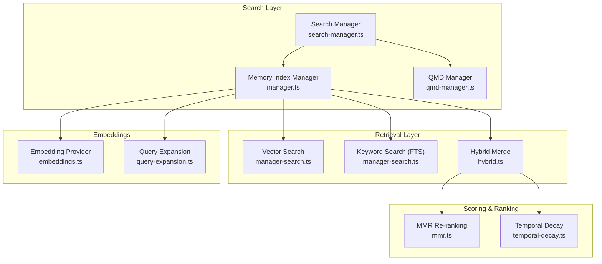
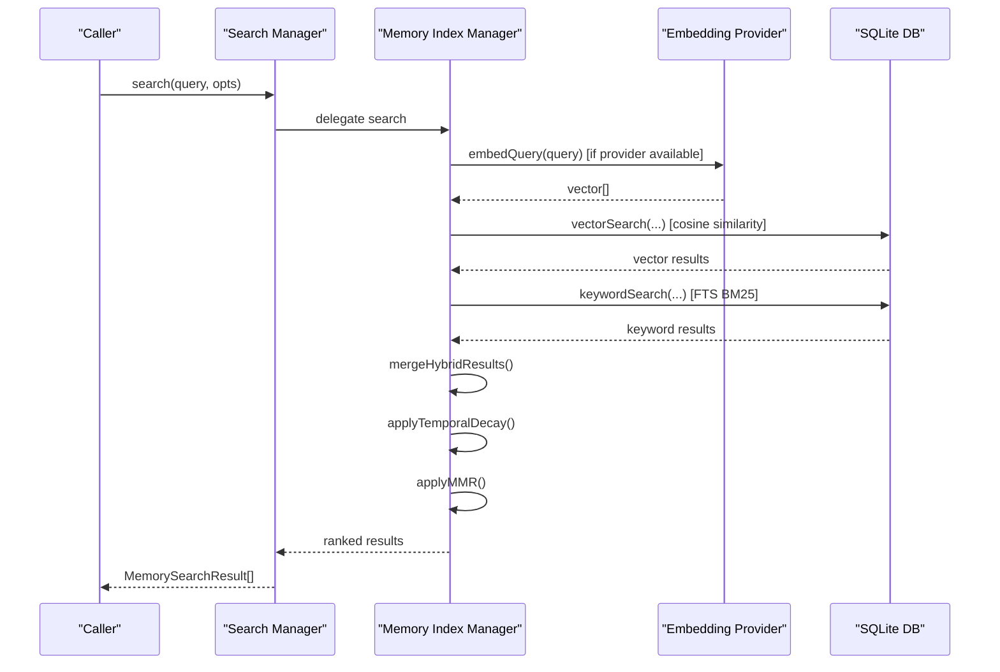
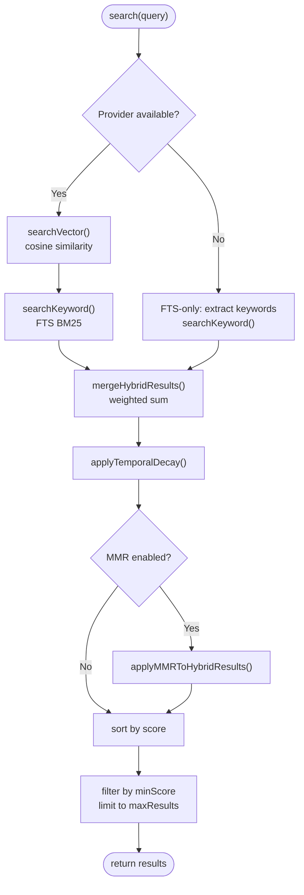
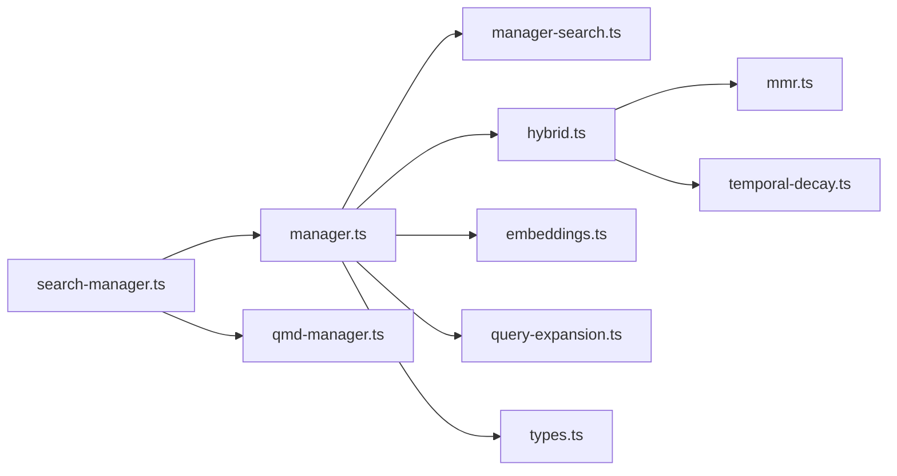

# Memory Search & Retrieval

<cite>
**Referenced Files in This Document**
- [manager.ts](file://src/memory/manager.ts)
- [search-manager.ts](file://src/memory/search-manager.ts)
- [hybrid.ts](file://src/memory/hybrid.ts)
- [mmr.ts](file://src/memory/mmr.ts)
- [temporal-decay.ts](file://src/memory/temporal-decay.ts)
- [manager-search.ts](file://src/memory/manager-search.ts)
- [embeddings.ts](file://src/memory/embeddings.ts)
- [query-expansion.ts](file://src/memory/query-expansion.ts)
- [types.ts](file://src/memory/types.ts)
- [qmd-manager.ts](file://src/memory/qmd-manager.ts)
- [qmd-manager.test.ts](file://src/memory/qmd-manager.test.ts)
- [memory.md](file://docs/concepts/memory.md)
- [index.ts](file://extensions/memory-lancedb/index.ts)
</cite>

## Table of Contents
1. [Introduction](#introduction)
2. [Project Structure](#project-structure)
3. [Core Components](#core-components)
4. [Architecture Overview](#architecture-overview)
5. [Detailed Component Analysis](#detailed-component-analysis)
6. [Dependency Analysis](#dependency-analysis)
7. [Performance Considerations](#performance-considerations)
8. [Troubleshooting Guide](#troubleshooting-guide)
9. [Conclusion](#conclusion)
10. [Appendices](#appendices)

## Introduction
This document explains the memory search and retrieval system used by OpenClaw. It covers search algorithms, similarity scoring, relevance ranking, query processing, vector similarity calculations, and result filtering. It also documents search manager operations, concurrent search handling, result caching, accuracy improvements, false positive reduction, search scope limitations, performance monitoring, and troubleshooting.

## Project Structure
The memory subsystem is implemented primarily under src/memory with pluggable backends and optional extensions:
- Built-in SQLite-based hybrid search with vector and keyword components
- Optional QMD-based backend with automatic fallback
- Embedding providers (local and remote)
- Post-processing: temporal decay and maximal marginal relevance (MMR)
- Extensions such as LanceDB-backed long-term memory



**Diagram sources**
- [search-manager.ts:1-254](file://src/memory/search-manager.ts#L1-L254)
- [manager.ts:1-841](file://src/memory/manager.ts#L1-L841)
- [manager-search.ts:1-192](file://src/memory/manager-search.ts#L1-L192)
- [hybrid.ts:1-156](file://src/memory/hybrid.ts#L1-L156)
- [mmr.ts:1-215](file://src/memory/mmr.ts#L1-L215)
- [temporal-decay.ts:1-168](file://src/memory/temporal-decay.ts#L1-L168)
- [embeddings.ts:1-325](file://src/memory/embeddings.ts#L1-L325)
- [query-expansion.ts:1-811](file://src/memory/query-expansion.ts#L1-L811)

**Section sources**
- [manager.ts:1-841](file://src/memory/manager.ts#L1-L841)
- [search-manager.ts:1-254](file://src/memory/search-manager.ts#L1-L254)

## Core Components
- MemorySearchManager interface defines the contract for search, read, sync, status, and availability probes.
- MemoryIndexManager implements hybrid search using vector similarity and keyword matching, with optional post-processing.
- Search Manager coordinates backend selection (QMD vs built-in) and provides fallback behavior.
- Hybrid pipeline merges vector and keyword scores, applies temporal decay, and optional MMR re-ranking.
- Embedding provider abstraction supports local and remote providers with auto-selection and fallback.
- Query expansion improves FTS-only search quality by extracting meaningful keywords.

**Section sources**
- [types.ts:61-82](file://src/memory/types.ts#L61-L82)
- [manager.ts:61-841](file://src/memory/manager.ts#L61-L841)
- [search-manager.ts:25-86](file://src/memory/search-manager.ts#L25-L86)
- [hybrid.ts:57-156](file://src/memory/hybrid.ts#L57-L156)
- [embeddings.ts:29-58](file://src/memory/embeddings.ts#L29-L58)
- [query-expansion.ts:735-780](file://src/memory/query-expansion.ts#L735-L780)

## Architecture Overview
The system supports two modes:
- Hybrid mode: vector similarity + keyword matching, with optional temporal decay and MMR.
- FTS-only mode: keyword-only search when embeddings are unavailable.



**Diagram sources**
- [manager.ts:259-367](file://src/memory/manager.ts#L259-L367)
- [manager-search.ts:20-94](file://src/memory/manager-search.ts#L20-L94)
- [hybrid.ts:57-156](file://src/memory/hybrid.ts#L57-L156)
- [temporal-decay.ts:121-168](file://src/memory/temporal-decay.ts#L121-L168)
- [mmr.ts:189-215](file://src/memory/mmr.ts#L189-L215)
- [embeddings.ts:168-288](file://src/memory/embeddings.ts#L168-L288)

## Detailed Component Analysis

### Search Manager Operations and Fallback
- Backend selection resolves whether to use QMD or built-in SQLite.
- QMD manager is cached per agent and configuration; on failure, a fallback to built-in is used transparently.
- Status reporting includes backend, provider info, cache stats, and vector availability.

```mermaid
classDiagram
class SearchManager {
+search(query, opts) MemorySearchResult[]
+readFile(params) {text,path}
+status() MemoryProviderStatus
+sync(params) void
+probeEmbeddingAvailability() MemoryEmbeddingProbeResult
+probeVectorAvailability() boolean
+close() void
}
class FallbackMemoryManager {
-fallback : MemorySearchManager
-primaryFailed : boolean
+search()
+readFile()
+status()
+sync()
+probeEmbeddingAvailability()
+probeVectorAvailability()
+close()
}
class MemoryIndexManager {
+search()
+status()
+probeEmbeddingAvailability()
+probeVectorAvailability()
+close()
}
SearchManager <|.. FallbackMemoryManager
SearchManager <|.. MemoryIndexManager
FallbackMemoryManager --> MemoryIndexManager : "fallback"
```

**Diagram sources**
- [search-manager.ts:104-247](file://src/memory/search-manager.ts#L104-L247)
- [manager.ts:61-841](file://src/memory/manager.ts#L61-L841)
- [types.ts:61-82](file://src/memory/types.ts#L61-L82)

**Section sources**
- [search-manager.ts:25-86](file://src/memory/search-manager.ts#L25-L86)
- [search-manager.ts:104-247](file://src/memory/search-manager.ts#L104-L247)
- [qmd-manager.ts:1882-1928](file://src/memory/qmd-manager.ts#L1882-L1928)

### Hybrid Search Pipeline
- Vector search uses cosine distance computed via SQLite vector extension or fallback to in-memory cosine similarity.
- Keyword search uses SQLite FTS5 with BM25 ranking; query is tokenized and normalized.
- Scores are merged using weighted combination; temporal decay adjusts scores by age; optional MMR promotes diversity.



**Diagram sources**
- [manager.ts:259-367](file://src/memory/manager.ts#L259-L367)
- [manager-search.ts:20-94](file://src/memory/manager-search.ts#L20-L94)
- [manager-search.ts:136-192](file://src/memory/manager-search.ts#L136-L192)
- [hybrid.ts:57-156](file://src/memory/hybrid.ts#L57-L156)
- [temporal-decay.ts:121-168](file://src/memory/temporal-decay.ts#L121-L168)
- [mmr.ts:189-215](file://src/memory/mmr.ts#L189-L215)

**Section sources**
- [manager.ts:259-452](file://src/memory/manager.ts#L259-L452)
- [manager-search.ts:20-192](file://src/memory/manager-search.ts#L20-L192)
- [hybrid.ts:57-156](file://src/memory/hybrid.ts#L57-L156)

### Vector Similarity and Keyword Scoring
- Vector similarity: cosine distance via SQLite vector extension; fallback computes cosine similarity in-memory.
- Keyword scoring: BM25 rank converted to score via monotonic transformation; FTS query built from tokenized terms.

**Section sources**
- [manager-search.ts:20-94](file://src/memory/manager-search.ts#L20-L94)
- [manager-search.ts:136-192](file://src/memory/manager-search.ts#L136-L192)
- [hybrid.ts:33-55](file://src/memory/hybrid.ts#L33-L55)

### Relevance Ranking and Post-processing
- Temporal decay: exponential decay by age; root and non-dated memory files are exempt.
- MMR: balances relevance and diversity using Jaccard similarity on tokenized content; configurable lambda.

**Section sources**
- [temporal-decay.ts:17-168](file://src/memory/temporal-decay.ts#L17-L168)
- [mmr.ts:10-215](file://src/memory/mmr.ts#L10-L215)
- [hybrid.ts:139-155](file://src/memory/hybrid.ts#L139-L155)

### Query Processing and Filtering
- Query expansion extracts meaningful keywords from conversational queries to improve FTS-only search.
- Filters include minimum score thresholds, result limits, and source filters.

**Section sources**
- [query-expansion.ts:735-780](file://src/memory/query-expansion.ts#L735-L780)
- [manager.ts:277-367](file://src/memory/manager.ts#L277-L367)

### Concurrent Search Handling and Caching
- Search Manager caches QMD managers keyed by agent and configuration; status-only mode bypasses caching.
- FallbackMemoryManager evicts failed wrappers to allow retry with a fresh manager.
- QMD manager includes debouncing and busy-error handling to avoid contention.

**Section sources**
- [search-manager.ts:12-86](file://src/memory/search-manager.ts#L12-L86)
- [search-manager.ts:104-247](file://src/memory/search-manager.ts#L104-L247)
- [qmd-manager.ts:1882-1928](file://src/memory/qmd-manager.ts#L1882-L1928)
- [qmd-manager.test.ts:2319-2345](file://src/memory/qmd-manager.test.ts#L2319-L2345)

### Result Filtering and Scope Limitations
- Source filters restrict search to configured sources (e.g., memory, sessions).
- Session warming and targeted sync support scoped incremental updates.

**Section sources**
- [manager.ts:419-452](file://src/memory/manager.ts#L419-L452)

### Practical Examples and Configuration
- Example: Hybrid search with vectorWeight and textWeight, MMR enabled, temporal decay half-life.
- Example: FTS-only mode with keyword extraction and relaxed minScore handling.
- Example: LanceDB plugin with OpenAI embeddings, auto-recall and auto-capture.

**Section sources**
- [hybrid.ts:57-156](file://src/memory/hybrid.ts#L57-L156)
- [manager.ts:285-367](file://src/memory/manager.ts#L285-L367)
- [index.ts:314-423](file://extensions/memory-lancedb/index.ts#L314-L423)

## Dependency Analysis


**Diagram sources**
- [search-manager.ts:1-254](file://src/memory/search-manager.ts#L1-L254)
- [manager.ts:1-841](file://src/memory/manager.ts#L1-L841)
- [manager-search.ts:1-192](file://src/memory/manager-search.ts#L1-L192)
- [hybrid.ts:1-156](file://src/memory/hybrid.ts#L1-L156)
- [mmr.ts:1-215](file://src/memory/mmr.ts#L1-L215)
- [temporal-decay.ts:1-168](file://src/memory/temporal-decay.ts#L1-L168)
- [embeddings.ts:1-325](file://src/memory/embeddings.ts#L1-L325)
- [query-expansion.ts:1-811](file://src/memory/query-expansion.ts#L1-L811)
- [types.ts:1-82](file://src/memory/types.ts#L1-L82)
- [qmd-manager.ts:1882-1928](file://src/memory/qmd-manager.ts#L1882-L1928)

**Section sources**
- [manager.ts:1-841](file://src/memory/manager.ts#L1-L841)
- [search-manager.ts:1-254](file://src/memory/search-manager.ts#L1-L254)

## Performance Considerations
- Candidate sampling: scale candidates by a multiplier to reduce downstream cost while preserving recall.
- MinScore relaxation: in hybrid mode, relax minScore when keyword-only exact matches exist.
- Temporal decay: tune half-life to balance freshness and stability.
- MMR lambda: adjust to favor relevance vs. diversity.
- Embedding provider: choose appropriate model and dimensionality; leverage batching and caching.
- Fallback handling: minimize repeated failures by evicting failed QMD wrappers and retrying with built-in.

[No sources needed since this section provides general guidance]

## Troubleshooting Guide
Common issues and remedies:
- SQLite read-only or locked: built-in manager detects readonly conditions and reopens connections; vector readiness is revalidated.
- QMD index busy or locked: manager waits for pending updates or throws a specific busy error; tests simulate SQLITE_BUSY scenarios.
- Provider unavailability: when embeddings are missing, degrade to FTS-only mode; status reports providerUnavailableReason.
- Low recall in conversational queries: enable query expansion to extract keywords; consider enabling MMR and temporal decay.

**Section sources**
- [manager.ts:505-589](file://src/memory/manager.ts#L505-L589)
- [qmd-manager.ts:1896-1928](file://src/memory/qmd-manager.ts#L1896-L1928)
- [qmd-manager.test.ts:2319-2345](file://src/memory/qmd-manager.test.ts#L2319-L2345)
- [embeddings.ts:232-288](file://src/memory/embeddings.ts#L232-L288)
- [query-expansion.ts:735-780](file://src/memory/query-expansion.ts#L735-L780)

## Conclusion
The memory search system combines vector and keyword search with robust post-processing to deliver accurate, timely, and diverse results. It gracefully degrades when embeddings are unavailable, supports concurrent operations with caching and fallback, and offers tunable controls for precision, recall, and performance.

[No sources needed since this section summarizes without analyzing specific files]

## Appendices

### Accuracy Improvements and False Positive Reduction
- Use MMR to reduce redundancy and increase diversity.
- Apply temporal decay to surface recent information.
- Enable query expansion to improve FTS-only matching.
- Tune minScore and candidate multiplier to balance precision and recall.

**Section sources**
- [mmr.ts:10-215](file://src/memory/mmr.ts#L10-L215)
- [temporal-decay.ts:17-168](file://src/memory/temporal-decay.ts#L17-L168)
- [query-expansion.ts:735-780](file://src/memory/query-expansion.ts#L735-L780)
- [manager.ts:277-283](file://src/memory/manager.ts#L277-L283)

### Search Scope Limitations
- Source filters restrict search to configured sources.
- Session-based warming and targeted sync limit scope during incremental updates.

**Section sources**
- [manager.ts:419-452](file://src/memory/manager.ts#L419-L452)

### Monitoring and Diagnostics
- Use status() to inspect backend, provider, cache, FTS/vector availability, and readonly recovery metrics.
- Monitor batch failure counts and last errors for embedding provider reliability.

**Section sources**
- [manager.ts:664-776](file://src/memory/manager.ts#L664-L776)