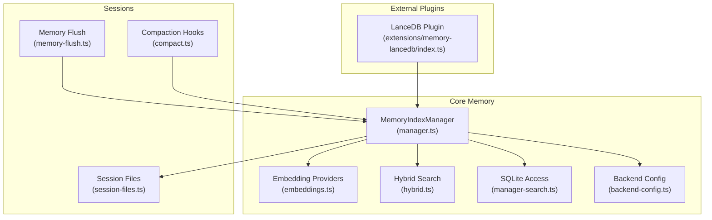
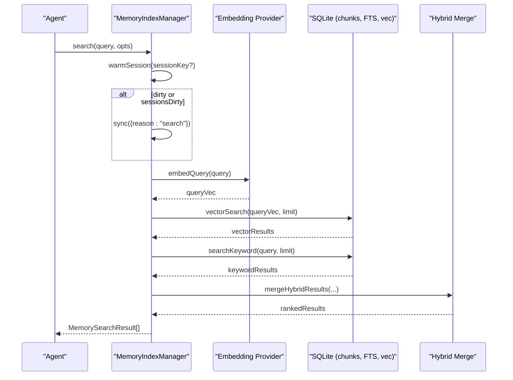
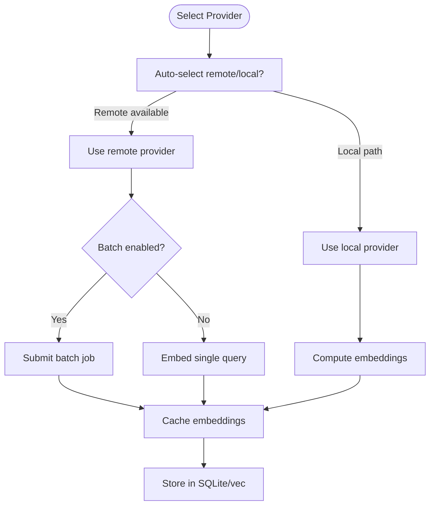
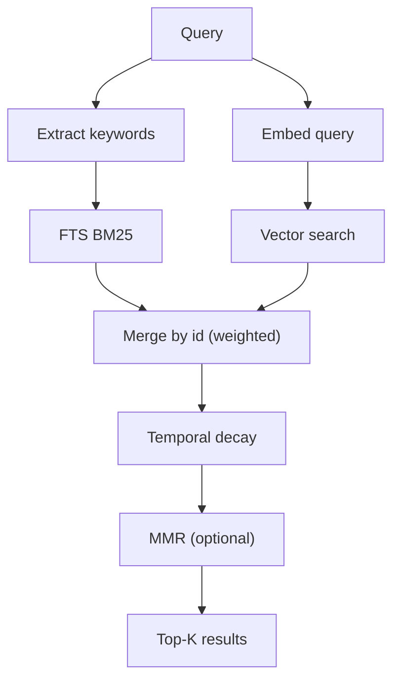
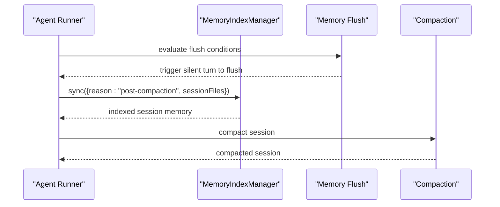
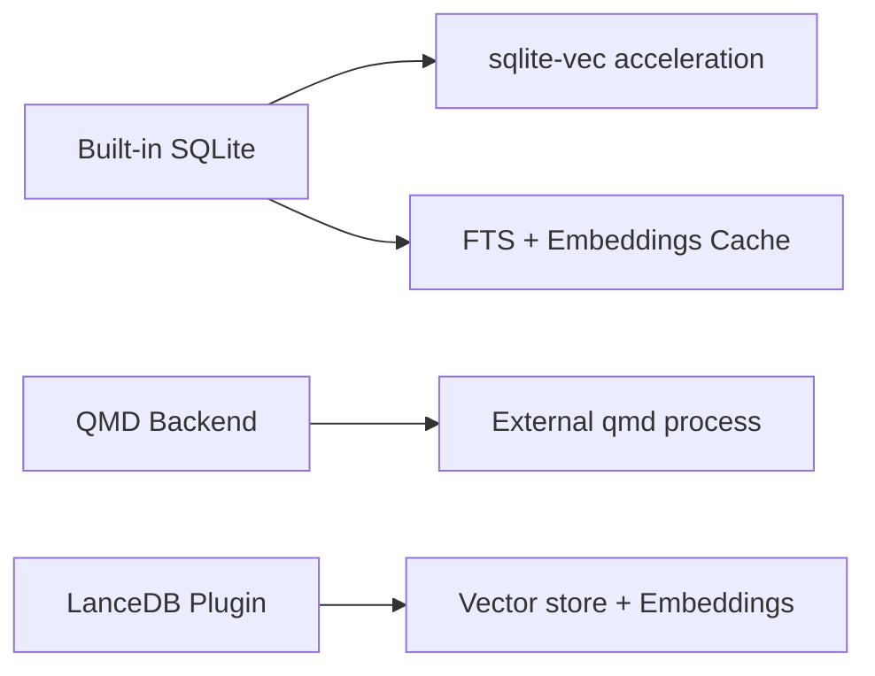
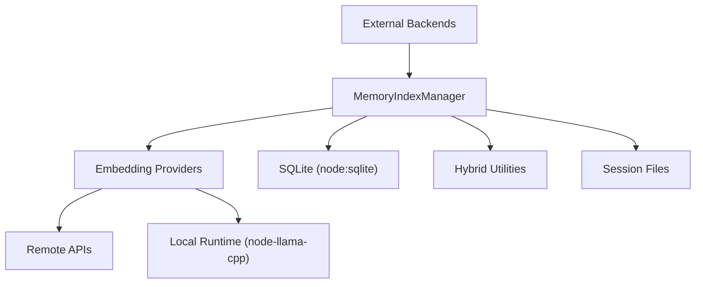

# Memory System

<cite>
**Referenced Files in This Document**
- [src/memory/index.ts](file://src/memory/index.ts)
- [src/memory/manager.ts](file://src/memory/manager.ts)
- [src/memory/manager-search.ts](file://src/memory/manager-search.ts)
- [src/memory/hybrid.ts](file://src/memory/hybrid.ts)
- [src/memory/embeddings.ts](file://src/memory/embeddings.ts)
- [src/memory/backend-config.ts](file://src/memory/backend-config.ts)
- [src/memory/session-files.ts](file://src/memory/session-files.ts)
- [src/memory/types.ts](file://src/memory/types.ts)
- [src/memory/sqlite.ts](file://src/memory/sqlite.ts)
- [extensions/memory-lancedb/index.ts](file://extensions/memory-lancedb/index.ts)
- [docs/concepts/memory.md](file://docs/concepts/memory.md)
- [src/auto-reply/reply/memory-flush.ts](file://src/auto-reply/reply/memory-flush.ts)
- [src/auto-reply/reply/agent-runner-memory.ts](file://src/auto-reply/reply/agent-runner-memory.ts)
- [src/agents/pi-embedded-runner/compact.ts](file://src/agents/pi-embedded-runner/compact.ts)
- [src/agents/pi-embedded-runner/extensions.ts](file://src/agents/pi-embedded-runner/extensions.ts)
</cite>

## Table of Contents
1. [Introduction](#introduction)
2. [Project Structure](#project-structure)
3. [Core Components](#core-components)
4. [Architecture Overview](#architecture-overview)
5. [Detailed Component Analysis](#detailed-component-analysis)
6. [Dependency Analysis](#dependency-analysis)
7. [Performance Considerations](#performance-considerations)
8. [Troubleshooting Guide](#troubleshooting-guide)
9. [Conclusion](#conclusion)
10. [Appendices](#appendices)

## Introduction
This document explains OpenClaw’s vector-based memory system: how memory is represented as Markdown, how vector embeddings are generated and stored, how hybrid search (BM25 + vectors) retrieves relevant context, and how memory is managed across indexing, querying, compaction, and session memory. It also covers configuration, optimization, monitoring, and production guidance for reliable, scalable memory behavior.

## Project Structure
OpenClaw’s memory system spans:
- Built-in SQLite-based memory manager with vector acceleration and hybrid search
- Embedding providers (remote and local) for vector generation
- Optional QMD backend for advanced hybrid search and session indexing
- Plugins for external vector stores (e.g., LanceDB)
- Session memory ingestion and compaction hooks
- Documentation that defines memory semantics and workflows



**Diagram sources**
- [src/memory/manager.ts:61-241](file://src/memory/manager.ts#L61-L241)
- [src/memory/embeddings.ts:168-288](file://src/memory/embeddings.ts#L168-L288)
- [src/memory/hybrid.ts:57-155](file://src/memory/hybrid.ts#L57-L155)
- [src/memory/manager-search.ts:20-94](file://src/memory/manager-search.ts#L20-L94)
- [src/memory/backend-config.ts:297-354](file://src/memory/backend-config.ts#L297-L354)
- [src/memory/session-files.ts:21-132](file://src/memory/session-files.ts#L21-L132)
- [src/auto-reply/reply/memory-flush.ts:195-228](file://src/auto-reply/reply/memory-flush.ts#L195-L228)
- [src/agents/pi-embedded-runner/compact.ts:287-348](file://src/agents/pi-embedded-runner/compact.ts#L287-L348)
- [extensions/memory-lancedb/index.ts:292-679](file://extensions/memory-lancedb/index.ts#L292-L679)

**Section sources**
- [src/memory/index.ts:1-12](file://src/memory/index.ts#L1-L12)
- [docs/concepts/memory.md:1-803](file://docs/concepts/memory.md#L1-L803)

## Core Components
- MemoryIndexManager: central orchestrator for indexing, embedding, hybrid search, and synchronization
- Embedding providers: OpenAI, Gemini, Voyage, Mistral, Ollama, and local node-llama-cpp
- Hybrid search: BM25 + vector merging with optional MMR and temporal decay
- SQLite-backed storage with optional sqlite-vec acceleration
- Session memory ingestion and compaction hooks
- Backend configuration for built-in and QMD backends
- LanceDB plugin for external vector memory

**Section sources**
- [src/memory/manager.ts:61-241](file://src/memory/manager.ts#L61-L241)
- [src/memory/embeddings.ts:168-288](file://src/memory/embeddings.ts#L168-L288)
- [src/memory/hybrid.ts:57-155](file://src/memory/hybrid.ts#L57-L155)
- [src/memory/manager-search.ts:20-94](file://src/memory/manager-search.ts#L20-L94)
- [src/memory/backend-config.ts:297-354](file://src/memory/backend-config.ts#L297-L354)
- [src/memory/session-files.ts:21-132](file://src/memory/session-files.ts#L21-L132)
- [extensions/memory-lancedb/index.ts:292-679](file://extensions/memory-lancedb/index.ts#L292-L679)

## Architecture Overview
OpenClaw’s memory architecture integrates:
- Workspace Markdown as the source of truth
- Vector embeddings for semantic search
- Hybrid retrieval combining BM25 and vectors
- Optional sqlite-vec acceleration
- Session memory ingestion and compaction-triggered sync
- Optional QMD backend and external vector stores



**Diagram sources**
- [src/memory/manager.ts:259-367](file://src/memory/manager.ts#L259-L367)
- [src/memory/manager-search.ts:20-94](file://src/memory/manager-search.ts#L20-L94)
- [src/memory/hybrid.ts:57-155](file://src/memory/hybrid.ts#L57-L155)
- [src/memory/embeddings.ts:168-288](file://src/memory/embeddings.ts#L168-L288)

## Detailed Component Analysis

### MemoryIndexManager: vector-based indexing, search, and sync
- Responsibilities:
  - Manage embedding provider selection and fallback
  - Maintain SQLite schema and tables for chunks, FTS, and embeddings cache
  - Provide search (vector-only, FTS-only, or hybrid)
  - Sync memory and session deltas
  - Probe provider/vector availability
  - Status reporting and readonly recovery
- Key behaviors:
  - Hybrid search merges vector similarity and BM25 text scores
  - Optional sqlite-vec acceleration; falls back to in-process cosine similarity
  - Debounced file watching and session delta tracking
  - Readonly DB recovery by reopening connections

```mermaid
classDiagram
class MemoryIndexManager {
+search(query, opts) MemorySearchResult[]
+readFile(params) {text,path}
+sync(params) void
+probeEmbeddingAvailability() MemoryEmbeddingProbeResult
+probeVectorAvailability() boolean
+status() MemoryProviderStatus
-ensureVectorReady(dim) Promise<boolean>
-mergeHybridResults(...)
}
class EmbeddingProvider {
+id : string
+model : string
+embedQuery(text) number[]
+embedBatch(texts) number[][]
}
class Hybrid {
+mergeHybridResults(...)
}
MemoryIndexManager --> EmbeddingProvider : "uses"
MemoryIndexManager --> Hybrid : "merges"
```

**Diagram sources**
- [src/memory/manager.ts:61-241](file://src/memory/manager.ts#L61-L241)
- [src/memory/embeddings.ts:29-36](file://src/memory/embeddings.ts#L29-L36)
- [src/memory/hybrid.ts:57-155](file://src/memory/hybrid.ts#L57-L155)

**Section sources**
- [src/memory/manager.ts:61-241](file://src/memory/manager.ts#L61-L241)
- [src/memory/manager.ts:259-367](file://src/memory/manager.ts#L259-L367)
- [src/memory/manager.ts:454-590](file://src/memory/manager.ts#L454-L590)
- [src/memory/manager.ts:664-776](file://src/memory/manager.ts#L664-L776)

### Embedding providers and vector generation
- Provider selection:
  - Auto-select remote providers when available; local provider via node-llama-cpp
  - Fallback chain and graceful degradation to FTS-only mode
- Batch embedding:
  - Remote providers support batch APIs (OpenAI, Gemini, Voyage)
  - Local provider computes embeddings on-demand
- Vector storage:
  - sqlite-vec virtual table for efficient distance computations
  - Fallback to stored embeddings and in-process cosine similarity



**Diagram sources**
- [src/memory/embeddings.ts:168-288](file://src/memory/embeddings.ts#L168-L288)
- [src/memory/manager.ts:76-105](file://src/memory/manager.ts#L76-L105)

**Section sources**
- [src/memory/embeddings.ts:168-288](file://src/memory/embeddings.ts#L168-L288)
- [src/memory/manager.ts:76-105](file://src/memory/manager.ts#L76-L105)

### Hybrid search: BM25 + vectors + post-processing
- BM25 keyword search and vector similarity are merged with weighted scores
- Optional post-processing:
  - Temporal decay to favor recent memories
  - MMR to diversify results
- Fallback behavior when FTS or embeddings are unavailable



**Diagram sources**
- [src/memory/hybrid.ts:57-155](file://src/memory/hybrid.ts#L57-L155)
- [src/memory/manager-search.ts:136-191](file://src/memory/manager-search.ts#L136-L191)

**Section sources**
- [src/memory/hybrid.ts:57-155](file://src/memory/hybrid.ts#L57-L155)
- [src/memory/manager-search.ts:136-191](file://src/memory/manager-search.ts#L136-L191)

### Session memory handling and compaction
- Session transcripts are ingested as memory candidates
- Pre-compaction memory flush prompts the agent to write durable memories before context is compacted
- Post-compaction sync ensures session memory is indexed and available



**Diagram sources**
- [src/auto-reply/reply/memory-flush.ts:195-228](file://src/auto-reply/reply/memory-flush.ts#L195-L228)
- [src/auto-reply/reply/agent-runner-memory.ts:519-560](file://src/auto-reply/reply/agent-runner-memory.ts#L519-L560)
- [src/agents/pi-embedded-runner/compact.ts:287-348](file://src/agents/pi-embedded-runner/compact.ts#L287-L348)

**Section sources**
- [src/memory/session-files.ts:21-132](file://src/memory/session-files.ts#L21-L132)
- [src/auto-reply/reply/memory-flush.ts:195-228](file://src/auto-reply/reply/memory-flush.ts#L195-L228)
- [src/auto-reply/reply/agent-runner-memory.ts:519-560](file://src/auto-reply/reply/agent-runner-memory.ts#L519-L560)
- [src/agents/pi-embedded-runner/compact.ts:287-348](file://src/agents/pi-embedded-runner/compact.ts#L287-L348)

### Backend configuration and backends
- Built-in backend: SQLite with optional sqlite-vec acceleration
- QMD backend: external sidecar for BM25 + vectors + reranking
- Additional backends: external vector stores (e.g., LanceDB plugin)



**Diagram sources**
- [src/memory/backend-config.ts:297-354](file://src/memory/backend-config.ts#L297-L354)
- [extensions/memory-lancedb/index.ts:292-679](file://extensions/memory-lancedb/index.ts#L292-L679)

**Section sources**
- [src/memory/backend-config.ts:297-354](file://src/memory/backend-config.ts#L297-L354)
- [extensions/memory-lancedb/index.ts:292-679](file://extensions/memory-lancedb/index.ts#L292-L679)

### Memory types and status
- MemorySearchResult: path, line range, snippet, score, source
- MemoryProviderStatus: backend, counts, cache, FTS, vector, batch, and custom fields
- MemorySearchManager interface: search, readFile, status, sync, probes, close

**Section sources**
- [src/memory/types.ts:3-81](file://src/memory/types.ts#L3-L81)

## Dependency Analysis
- MemoryIndexManager depends on:
  - Embedding providers for vector generation
  - SQLite for persistence and vector acceleration
  - Hybrid utilities for merging and post-processing
  - Session file utilities for ingestion
- Embedding providers depend on:
  - Remote APIs or local model runtime
- QMD and external plugins integrate via the same MemorySearchManager interface



**Diagram sources**
- [src/memory/manager.ts:61-241](file://src/memory/manager.ts#L61-L241)
- [src/memory/embeddings.ts:168-288](file://src/memory/embeddings.ts#L168-L288)
- [src/memory/sqlite.ts:6-19](file://src/memory/sqlite.ts#L6-L19)
- [src/memory/hybrid.ts:57-155](file://src/memory/hybrid.ts#L57-L155)
- [src/memory/session-files.ts:21-132](file://src/memory/session-files.ts#L21-L132)
- [extensions/memory-lancedb/index.ts:292-679](file://extensions/memory-lancedb/index.ts#L292-L679)

**Section sources**
- [src/memory/sqlite.ts:6-19](file://src/memory/sqlite.ts#L6-L19)
- [src/memory/manager.ts:61-241](file://src/memory/manager.ts#L61-L241)

## Performance Considerations
- Vector acceleration:
  - sqlite-vec enables efficient vector distance computations in SQLite
  - Disable or override extension path if needed
- Batch embedding:
  - Enable batch mode for large corpora to reduce latency and cost
- Hybrid search:
  - Tune candidateMultiplier and weights to balance recall and speed
  - Enable MMR and temporal decay for better quality and recency
- Cache:
  - Enable embedding cache to avoid re-embedding unchanged chunks
- Session memory:
  - Use delta thresholds to minimize background indexing overhead
- Readonly recovery:
  - Manager handles read-only DB errors by reopening connections

[No sources needed since this section provides general guidance]

## Troubleshooting Guide
Common issues and remedies:
- SQLite unavailable:
  - The runtime requires node:sqlite; ensure your Node distribution includes it
- sqlite-vec not available:
  - Extension may fail to load; manager logs the error and continues with JS fallback
- Embedding provider errors:
  - Missing API keys or network issues; manager falls back according to configuration
- FTS-only mode:
  - Occurs when no embedding provider is available; search degrades to BM25
- Readonly database:
  - Manager automatically reopens DB and resets vector readiness

**Section sources**
- [src/memory/sqlite.ts:6-19](file://src/memory/sqlite.ts#L6-L19)
- [src/memory/manager.ts:505-589](file://src/memory/manager.ts#L505-L589)
- [src/memory/manager.ts:778-800](file://src/memory/manager.ts#L778-L800)

## Conclusion
OpenClaw’s memory system centers on plain Markdown as the source of truth, with vector embeddings enabling semantic search and hybrid retrieval for robust recall. The built-in manager coordinates embedding providers, SQLite-backed storage, and optional acceleration, while session memory and compaction hooks ensure context freshness. Optional backends (QMD, LanceDB) extend capabilities for advanced hybrid search and external vector stores. Proper configuration, caching, and post-processing enable scalable, production-ready memory behavior.

[No sources needed since this section summarizes without analyzing specific files]

## Appendices

### Practical configuration examples
- Enable batch embedding for remote providers
- Configure sqlite-vec acceleration
- Enable embedding cache
- Enable session memory and adjust delta thresholds
- Choose providers and fallbacks

See the concepts documentation for detailed configuration surfaces and examples.

**Section sources**
- [docs/concepts/memory.md:421-435](file://docs/concepts/memory.md#L421-L435)
- [docs/concepts/memory.md:740-770](file://docs/concepts/memory.md#L740-L770)
- [docs/concepts/memory.md:678-695](file://docs/concepts/memory.md#L678-L695)
- [docs/concepts/memory.md:697-737](file://docs/concepts/memory.md#L697-L737)