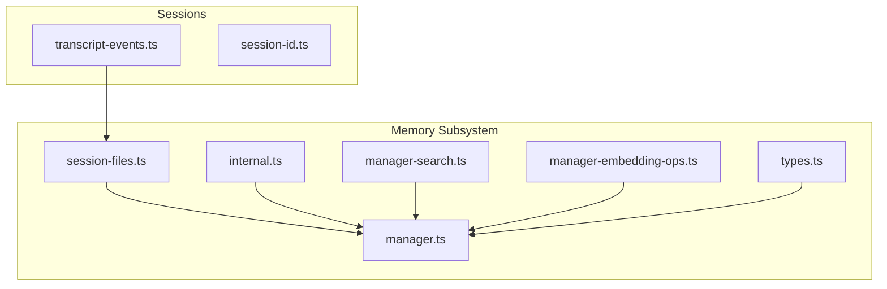
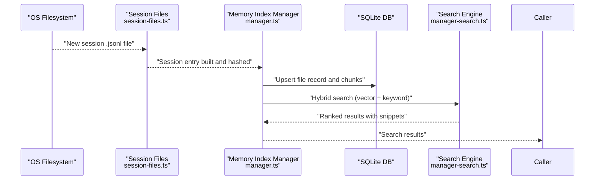
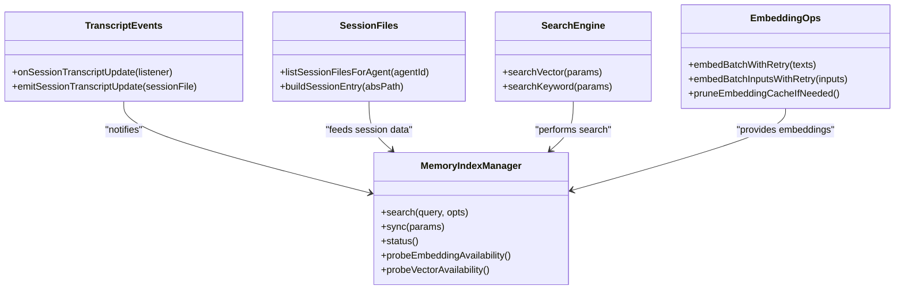

# Session Memory Management

<cite>
**Referenced Files in This Document**
- [transcript-events.ts](file://src/sessions/transcript-events.ts)
- [session-id.ts](file://src/sessions/session-id.ts)
- [manager.ts](file://src/memory/manager.ts)
- [session-files.ts](file://src/memory/session-files.ts)
- [internal.ts](file://src/memory/internal.ts)
- [types.ts](file://src/memory/types.ts)
- [manager-search.ts](file://src/memory/manager-search.ts)
- [manager-embedding-ops.ts](file://src/memory/manager-embedding-ops.ts)
</cite>

## Table of Contents
1. [Introduction](#introduction)
2. [Project Structure](#project-structure)
3. [Core Components](#core-components)
4. [Architecture Overview](#architecture-overview)
5. [Detailed Component Analysis](#detailed-component-analysis)
6. [Dependency Analysis](#dependency-analysis)
7. [Performance Considerations](#performance-considerations)
8. [Troubleshooting Guide](#troubleshooting-guide)
9. [Conclusion](#conclusion)

## Introduction
This document explains session memory management with a focus on preserving conversation context and enabling session-based memory operations. It covers the session memory lifecycle, context window management, compaction strategies, transcript handling, message history storage, and context preservation techniques. Practical configuration guidance is included for pruning policies, retention settings, session isolation, memory sharing between agents, and cleanup operations. Finally, it addresses optimization, storage efficiency, and performance impacts of long conversations.

## Project Structure
The session memory system spans two primary areas:
- Sessions: session identification, transcript update notifications, and session file discovery.
- Memory subsystem: indexing, search, embedding, and synchronization of memory sources including sessions.

**Diagram sources**
- [transcript-events.ts:1-30](file://src/sessions/transcript-events.ts#L1-L30)
- [session-id.ts:1-6](file://src/sessions/session-id.ts#L1-L6)
- [manager.ts:1-841](file://src/memory/manager.ts#L1-L841)
- [session-files.ts:1-132](file://src/memory/session-files.ts#L1-L132)
- [internal.ts:1-483](file://src/memory/internal.ts#L1-L483)
- [types.ts:1-82](file://src/memory/types.ts#L1-L82)
- [manager-search.ts:1-192](file://src/memory/manager-search.ts#L1-L192)
- [manager-embedding-ops.ts:1-926](file://src/memory/manager-embedding-ops.ts#L1-L926)

**Section sources**
- [transcript-events.ts:1-30](file://src/sessions/transcript-events.ts#L1-L30)
- [session-id.ts:1-6](file://src/sessions/session-id.ts#L1-L6)
- [manager.ts:1-841](file://src/memory/manager.ts#L1-L841)
- [session-files.ts:1-132](file://src/memory/session-files.ts#L1-L132)
- [internal.ts:1-483](file://src/memory/internal.ts#L1-L483)
- [types.ts:1-82](file://src/memory/types.ts#L1-L82)
- [manager-search.ts:1-192](file://src/memory/manager-search.ts#L1-L192)
- [manager-embedding-ops.ts:1-926](file://src/memory/manager-embedding-ops.ts#L1-L926)

## Core Components
- Session transcript event bus: emits updates when a session file changes, enabling downstream memory synchronization.
- Session file reader: extracts and normalizes message content from session JSONL files, builds a compact representation, and maps line indices for accurate provenance.
- Memory index manager: orchestrates indexing, search, and synchronization across memory sources including sessions. It supports hybrid search (vector + keyword), batching, caching, and robustness against read-only databases.
- Internal utilities: chunking, hashing, line remapping, and multimodal support for memory indexing.
- Types: standardized shapes for search results, statuses, and provider capabilities.

Key responsibilities:
- Preserve conversation context by capturing user/assistant messages and redacting sensitive content.
- Maintain efficient retrieval via vector and keyword search.
- Manage session lifecycle events to keep memory synchronized.
- Optimize storage and performance via batching, caching, and pruning.

**Section sources**
- [transcript-events.ts:1-30](file://src/sessions/transcript-events.ts#L1-L30)
- [session-files.ts:1-132](file://src/memory/session-files.ts#L1-L132)
- [manager.ts:1-841](file://src/memory/manager.ts#L1-L841)
- [internal.ts:1-483](file://src/memory/internal.ts#L1-L483)
- [types.ts:1-82](file://src/memory/types.ts#L1-L82)

## Architecture Overview
The session memory pipeline integrates session transcript updates with memory indexing and search.

**Diagram sources**
- [session-files.ts:74-132](file://src/memory/session-files.ts#L74-L132)
- [manager.ts:454-503](file://src/memory/manager.ts#L454-L503)
- [manager-search.ts:20-94](file://src/memory/manager-search.ts#L20-L94)

## Detailed Component Analysis

### Session Transcript Event Bus
- Provides a global listener registry for session transcript updates.
- Emits updates when a session file path is provided, trimming whitespace and ignoring empty inputs.
- Listeners receive a normalized session file path; exceptions inside listeners are suppressed to avoid breaking the event chain.

Practical use:
- Subscribe to session transcript updates to trigger targeted memory synchronization for specific session files.

**Section sources**
- [transcript-events.ts:1-30](file://src/sessions/transcript-events.ts#L1-L30)

### Session File Reader and Message History Storage
- Lists session files for an agent and filters by .jsonl extension.
- Builds a compact session entry containing:
  - Path normalization and absolute path.
  - Last modified time and size.
  - Hash derived from content and line map.
  - Redacted concatenated user/assistant messages.
  - Line map from flattened content back to original JSONL line numbers.
- Extracts message text from either a string or a structured array of text blocks, normalizing whitespace and trimming.

Context preservation:
- Line map enables precise citation and provenance for retrieved chunks.
- Redaction prevents sensitive data from entering the index.

**Section sources**
- [session-files.ts:21-132](file://src/memory/session-files.ts#L21-L132)

### Memory Index Manager: Lifecycle, Sync, and Search
- Lifecycle:
  - Initializes with agent-specific configuration and memory search settings.
  - Ensures schema, sets up watchers, and subscribes to session transcript updates.
  - Tracks dirtiness for memory sources and session deltas to defer expensive operations.
- Synchronization:
  - Supports targeted session sync by queuing session files and processing them in order.
  - Handles read-only database errors by reopening connections and retrying.
  - Integrates with embedding provider batching and fallbacks.
- Search:
  - Hybrid search: vector similarity and keyword matching with optional MMR and temporal decay.
  - Fallback to keyword-only search when embeddings are unavailable.
  - Session-aware warming to preload session context before queries.

Session isolation:
- Sources include both "memory" and "sessions"; filtering ensures isolated retrieval per source.

**Section sources**
- [manager.ts:135-241](file://src/memory/manager.ts#L135-L241)
- [manager.ts:454-503](file://src/memory/manager.ts#L454-L503)
- [manager.ts:554-589](file://src/memory/manager.ts#L554-L589)
- [manager.ts:259-367](file://src/memory/manager.ts#L259-L367)

### Internal Utilities: Chunking, Hashing, and Line Remapping
- Markdown chunking with configurable token size and overlap; produces hashed chunks suitable for embedding.
- Line remapping for session entries to translate chunk line numbers back to original JSONL positions.
- Hashing utilities for content and embedding cache keys.
- Multimodal support for memory indexing with MIME detection and structured inputs.

Context window management:
- Chunking controls the effective context window by splitting long conversations into overlapping segments.
- Overlap preserves continuity across chunk boundaries.

**Section sources**
- [internal.ts:334-416](file://src/memory/internal.ts#L334-L416)
- [internal.ts:428-437](file://src/memory/internal.ts#L428-L437)
- [internal.ts:184-186](file://src/memory/internal.ts#L184-L186)

### Search Engine: Vector and Keyword Retrieval
- Vector search:
  - Computes cosine distance and returns snippets with bounded character limits.
  - Falls back to in-memory similarity scoring when vector extension is unavailable.
- Keyword search:
  - Uses BM25 ranking and query expansion to improve recall.
  - Filters by provider model when available; degrades gracefully in FTS-only mode.

Hybrid merging:
- Combines vector and keyword scores with configurable weights and optional MMR and temporal decay.

**Section sources**
- [manager-search.ts:20-94](file://src/memory/manager-search.ts#L20-L94)
- [manager-search.ts:136-192](file://src/memory/manager-search.ts#L136-L192)

### Embedding Operations: Batching, Caching, and Failures
- Batching:
  - Builds batches respecting estimated token budgets; supports provider-specific batch runners (OpenAI, Gemini, Voyage).
  - Retries with exponential backoff for rate-limiting and transient errors.
  - Timeout handling for both batch and query operations.
- Caching:
  - Embedding cache keyed by provider, model, and provider key; prunes by least-recently-updated when exceeding configured capacity.
- Failure handling:
  - Tracks consecutive batch failures; disables batching temporarily and falls back to non-batch embedding when necessary.

Compaction strategies:
- Pruning cache entries reduces storage overhead.
- Targeted session sync reduces redundant indexing work.

**Section sources**
- [manager-embedding-ops.ts:55-83](file://src/memory/manager-embedding-ops.ts#L55-L83)
- [manager-embedding-ops.ts:157-183](file://src/memory/manager-embedding-ops.ts#L157-L183)
- [manager-embedding-ops.ts:430-440](file://src/memory/manager-embedding-ops.ts#L430-L440)
- [manager-embedding-ops.ts:674-696](file://src/memory/manager-embedding-ops.ts#L674-L696)
- [manager-embedding-ops.ts:607-626](file://src/memory/manager-embedding-ops.ts#L607-L626)

### Session ID Validation
- Validates session identifiers using a UUID regex to ensure consistent session key handling across systems.

**Section sources**
- [session-id.ts:1-6](file://src/sessions/session-id.ts#L1-L6)

## Dependency Analysis

**Diagram sources**
- [manager.ts:61-241](file://src/memory/manager.ts#L61-L241)
- [session-files.ts:21-132](file://src/memory/session-files.ts#L21-L132)
- [transcript-events.ts:9-29](file://src/sessions/transcript-events.ts#L9-L29)
- [manager-search.ts:20-94](file://src/memory/manager-search.ts#L20-L94)
- [manager-embedding-ops.ts:524-590](file://src/memory/manager-embedding-ops.ts#L524-L590)

**Section sources**
- [manager.ts:61-241](file://src/memory/manager.ts#L61-L241)
- [session-files.ts:21-132](file://src/memory/session-files.ts#L21-L132)
- [transcript-events.ts:9-29](file://src/sessions/transcript-events.ts#L9-L29)
- [manager-search.ts:20-94](file://src/memory/manager-search.ts#L20-L94)
- [manager-embedding-ops.ts:524-590](file://src/memory/manager-embedding-ops.ts#L524-L590)

## Performance Considerations
- Batch embedding:
  - Use provider-specific batch runners to reduce latency and cost.
  - Tune concurrency and polling intervals to balance throughput and resource usage.
- Caching:
  - Enable embedding cache and set a reasonable max entry count to minimize recomputation.
- Chunking:
  - Adjust chunk size and overlap to fit model context windows while preserving continuity.
- Search:
  - Prefer hybrid search for richer results; disable when embeddings are unavailable.
  - Use minScore and maxResults to constrain result sets and reduce downstream processing.
- Read-only recovery:
  - The manager automatically reopens connections on read-only errors to maintain availability.

[No sources needed since this section provides general guidance]

## Troubleshooting Guide
Common issues and remedies:
- Read-only database errors during sync:
  - The manager detects read-only conditions, reopens the database, and retries. Monitor readonly recovery counters in status output.
- Batch embedding failures:
  - Consecutive failures disable batching temporarily and fall back to non-batch embedding. Inspect last error and provider details in status output.
- Provider unavailability:
  - In FTS-only mode, embedding operations are unavailable; search degrades to keyword-only mode.
- Slow search:
  - Reduce maxResults, increase minScore, or disable hybrid search to narrow candidate sets.
- Session sync not triggered:
  - Ensure transcript update listeners are registered and session files are queued for sync.

**Section sources**
- [manager.ts:554-589](file://src/memory/manager.ts#L554-L589)
- [manager.ts:664-776](file://src/memory/manager.ts#L664-L776)
- [manager-embedding-ops.ts:674-696](file://src/memory/manager-embedding-ops.ts#L674-L696)
- [manager-embedding-ops.ts:723-754](file://src/memory/manager-embedding-ops.ts#L723-L754)

## Conclusion
Session memory management in this system centers on reliable transcript handling, efficient indexing, and robust search. By leveraging session transcript events, targeted synchronization, hybrid search, and embedding batching with caching, the system preserves conversation context while maintaining performance and storage efficiency. Proper configuration of pruning, retention, and session isolation ensures scalable operation across long-running conversations and multiple agents.