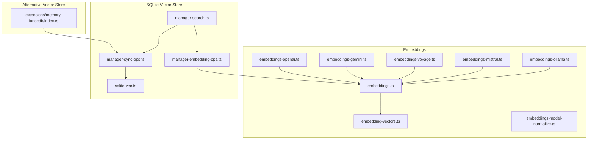
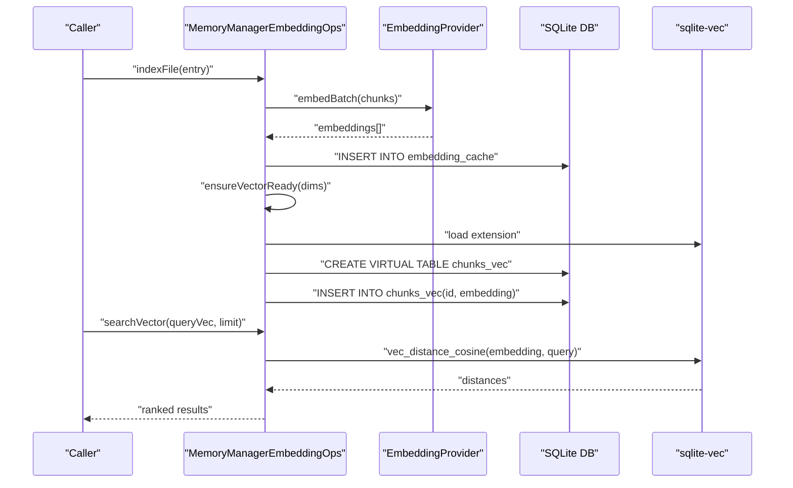
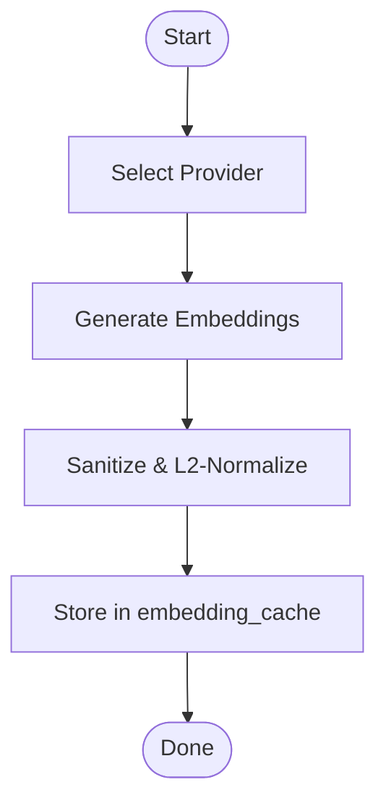
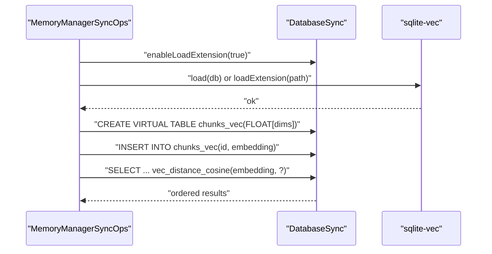
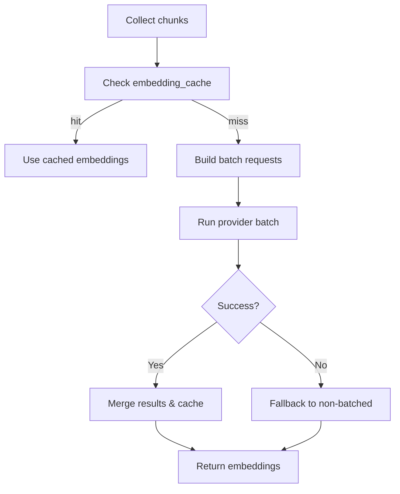
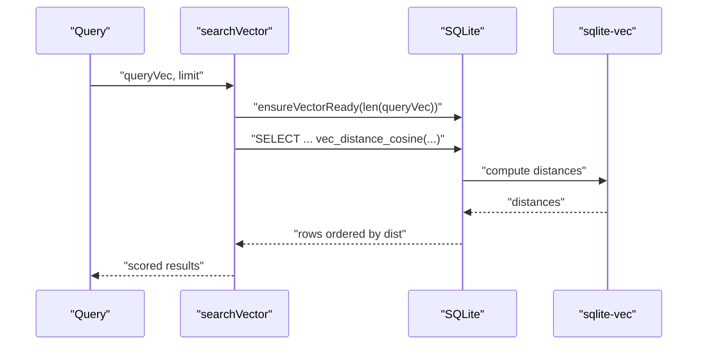
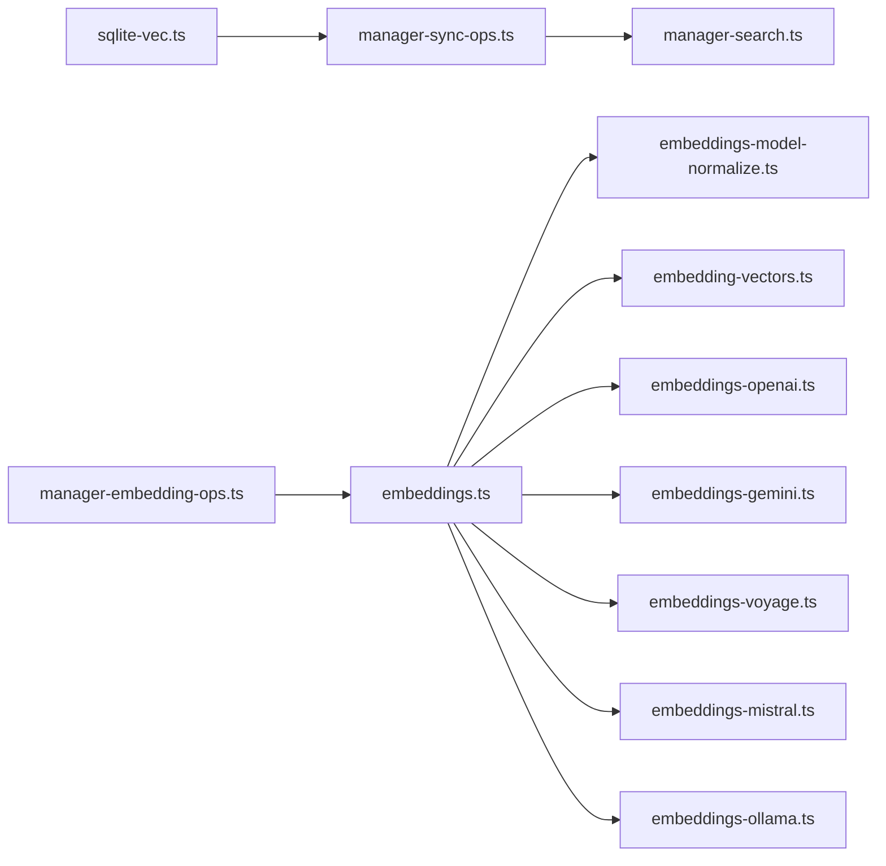

# Vector Storage & Embeddings

<cite>
**Referenced Files in This Document**
- [sqlite-vec-smoke.mjs](file://scripts/sqlite-vec-smoke.mjs)
- [sqlite-vec.ts](file://src/memory/sqlite-vec.ts)
- [manager-sync-ops.ts](file://src/memory/manager-sync-ops.ts)
- [manager-search.ts](file://src/memory/manager-search.ts)
- [manager-embedding-ops.ts](file://src/memory/manager-embedding-ops.ts)
- [embedding-vectors.ts](file://src/memory/embedding-vectors.ts)
- [embeddings-model-normalize.ts](file://src/memory/embeddings-model-normalize.ts)
- [embeddings.ts](file://src/memory/embeddings.ts)
- [embeddings-openai.ts](file://src/memory/embeddings-openai.ts)
- [embeddings-gemini.ts](file://src/memory/embeddings-gemini.ts)
- [embeddings-voyage.ts](file://src/memory/embeddings-voyage.ts)
- [embeddings-mistral.ts](file://src/memory/embeddings-mistral.ts)
- [embeddings-ollama.ts](file://src/memory/embeddings-ollama.ts)
- [memory-lancedb/index.ts](file://extensions/memory-lancedb/index.ts)
</cite>

## Table of Contents
1. [Introduction](#introduction)
2. [Project Structure](#project-structure)
3. [Core Components](#core-components)
4. [Architecture Overview](#architecture-overview)
5. [Detailed Component Analysis](#detailed-component-analysis)
6. [Dependency Analysis](#dependency-analysis)
7. [Performance Considerations](#performance-considerations)
8. [Troubleshooting Guide](#troubleshooting-guide)
9. [Conclusion](#conclusion)
10. [Appendices](#appendices)

## Introduction
This document explains vector storage and embeddings in the system, focusing on how embeddings are generated, normalized, stored, and queried using SQLite with the sqlite-vec extension. It covers embedding providers (remote and local), dimension management, similarity calculations, indexing and query operations, storage formats and memory layout, performance optimization, and maintenance operations such as pruning and capacity planning.

## Project Structure
Vector-related functionality spans several modules:
- Embedding generation and normalization
- Provider selection and remote/local clients
- SQLite vector extension loading and schema management
- Vector indexing and search operations
- Optional alternative vector stores (e.g., LanceDB)

**Diagram sources**
- [embeddings.ts:1-325](file://src/memory/embeddings.ts#L1-L325)
- [embeddings-openai.ts:1-58](file://src/memory/embeddings-openai.ts#L1-L58)
- [embeddings-gemini.ts:1-333](file://src/memory/embeddings-gemini.ts#L1-L333)
- [embeddings-voyage.ts:1-83](file://src/memory/embeddings-voyage.ts#L1-L83)
- [embeddings-mistral.ts:1-52](file://src/memory/embeddings-mistral.ts#L1-L52)
- [embeddings-ollama.ts:1-124](file://src/memory/embeddings-ollama.ts#L1-L124)
- [embedding-vectors.ts:1-9](file://src/memory/embedding-vectors.ts#L1-L9)
- [embeddings-model-normalize.ts:1-17](file://src/memory/embeddings-model-normalize.ts#L1-L17)
- [sqlite-vec.ts:1-25](file://src/memory/sqlite-vec.ts#L1-L25)
- [manager-sync-ops.ts:1-800](file://src/memory/manager-sync-ops.ts#L1-L800)
- [manager-embedding-ops.ts:30-463](file://src/memory/manager-embedding-ops.ts#L30-L463)
- [manager-search.ts:20-69](file://src/memory/manager-search.ts#L20-L69)
- [memory-lancedb/index.ts:86-119](file://extensions/memory-lancedb/index.ts#L86-L119)

**Section sources**
- [embeddings.ts:1-325](file://src/memory/embeddings.ts#L1-L325)
- [sqlite-vec.ts:1-25](file://src/memory/sqlite-vec.ts#L1-L25)
- [manager-sync-ops.ts:1-800](file://src/memory/manager-sync-ops.ts#L1-L800)
- [manager-embedding-ops.ts:30-463](file://src/memory/manager-embedding-ops.ts#L30-L463)
- [manager-search.ts:20-69](file://src/memory/manager-search.ts#L20-L69)
- [memory-lancedb/index.ts:86-119](file://extensions/memory-lancedb/index.ts#L86-L119)

## Core Components
- Embedding providers and normalization:
  - Providers: OpenAI, Google (Gemini), Voyage, Mistral, Ollama, and local via node-llama-cpp.
  - Normalization: L2-normalization of vectors with sanitization of non-finite values.
  - Model normalization: Strip provider prefixes from model names.
- SQLite vector store:
  - Extension loading and availability checks.
  - Virtual table creation for vectors with dynamic dimensions.
  - Indexing pipeline with embedding caching and batch operations.
  - Cosine distance similarity queries.
- Alternative vector store:
  - LanceDB-backed memory store with vector search.

**Section sources**
- [embeddings.ts:1-325](file://src/memory/embeddings.ts#L1-L325)
- [embedding-vectors.ts:1-9](file://src/memory/embedding-vectors.ts#L1-L9)
- [embeddings-model-normalize.ts:1-17](file://src/memory/embeddings-model-normalize.ts#L1-L17)
- [sqlite-vec.ts:1-25](file://src/memory/sqlite-vec.ts#L1-L25)
- [manager-sync-ops.ts:170-240](file://src/memory/manager-sync-ops.ts#L170-L240)
- [manager-embedding-ops.ts:30-463](file://src/memory/manager-embedding-ops.ts#L30-L463)
- [manager-search.ts:20-69](file://src/memory/manager-search.ts#L20-L69)
- [memory-lancedb/index.ts:86-119](file://extensions/memory-lancedb/index.ts#L86-L119)

## Architecture Overview
The vector pipeline integrates embedding generation, storage, and retrieval:

**Diagram sources**
- [manager-embedding-ops.ts:30-463](file://src/memory/manager-embedding-ops.ts#L30-L463)
- [embeddings.ts:1-325](file://src/memory/embeddings.ts#L1-L325)
- [manager-sync-ops.ts:170-240](file://src/memory/manager-sync-ops.ts#L170-L240)
- [manager-search.ts:20-69](file://src/memory/manager-search.ts#L20-L69)
- [sqlite-vec.ts:1-25](file://src/memory/sqlite-vec.ts#L1-L25)

## Detailed Component Analysis

### Embedding Generation and Normalization
- Provider selection:
  - Supports automatic selection among remote providers and local node-llama-cpp when configured.
  - Fallback behavior on failures, including degradation to FTS-only mode when API keys are missing.
- Normalization:
  - Sanitizes non-finite values and applies L2 normalization to unit vectors.
- Model normalization:
  - Strips provider-specific prefixes from model names to normalize identifiers.

**Diagram sources**
- [embeddings.ts:168-288](file://src/memory/embeddings.ts#L168-L288)
- [embedding-vectors.ts:1-9](file://src/memory/embedding-vectors.ts#L1-L9)
- [embeddings-model-normalize.ts:1-17](file://src/memory/embeddings-model-normalize.ts#L1-L17)

**Section sources**
- [embeddings.ts:1-325](file://src/memory/embeddings.ts#L1-L325)
- [embedding-vectors.ts:1-9](file://src/memory/embedding-vectors.ts#L1-L9)
- [embeddings-model-normalize.ts:1-17](file://src/memory/embeddings-model-normalize.ts#L1-L17)

### SQLite Vector Extension Usage
- Extension loading:
  - Dynamically loads sqlite-vec with optional user-specified path.
  - Enables extension loading on the database connection.
- Virtual table management:
  - Creates a virtual table for vectors with a FLOAT[dims] column.
  - Drops and recreates the table when dimensions change.
- Querying:
  - Uses cosine distance via vec_distance_cosine for similarity ranking.

**Diagram sources**
- [sqlite-vec.ts:1-25](file://src/memory/sqlite-vec.ts#L1-L25)
- [manager-sync-ops.ts:170-240](file://src/memory/manager-sync-ops.ts#L170-L240)
- [manager-search.ts:20-69](file://src/memory/manager-search.ts#L20-L69)
- [sqlite-vec-smoke.mjs:1-38](file://scripts/sqlite-vec-smoke.mjs#L1-L38)

**Section sources**
- [sqlite-vec.ts:1-25](file://src/memory/sqlite-vec.ts#L1-L25)
- [manager-sync-ops.ts:170-240](file://src/memory/manager-sync-ops.ts#L170-L240)
- [manager-search.ts:20-69](file://src/memory/manager-search.ts#L20-L69)
- [sqlite-vec-smoke.mjs:1-38](file://scripts/sqlite-vec-smoke.mjs#L1-L38)

### Embedding Caching and Batch Operations
- Embedding cache:
  - Stores provider, model, provider_key, hash, embedding, dims, and updated_at.
  - Prunes cache when exceeding configured max entries.
- Batch embedding:
  - Builds batches respecting token budgets and provider-specific constraints.
  - Retries with exponential backoff and fallback to non-batched embedding on failure.

**Diagram sources**
- [manager-embedding-ops.ts:30-463](file://src/memory/manager-embedding-ops.ts#L30-L463)

**Section sources**
- [manager-embedding-ops.ts:30-463](file://src/memory/manager-embedding-ops.ts#L30-L463)

### Search and Similarity Calculations
- Vector search:
  - Ensures vector table exists with matching dimensions.
  - Executes cosine distance query joining vector table with chunk metadata.
  - Converts distance to score and truncates snippets.

**Diagram sources**
- [manager-search.ts:20-69](file://src/memory/manager-search.ts#L20-L69)
- [manager-sync-ops.ts:170-240](file://src/memory/manager-sync-ops.ts#L170-L240)

**Section sources**
- [manager-search.ts:20-69](file://src/memory/manager-search.ts#L20-L69)
- [manager-sync-ops.ts:170-240](file://src/memory/manager-sync-ops.ts#L170-L240)

### Alternative Vector Store (LanceDB)
- Initialization:
  - Ensures table existence and deletes a placeholder schema row.
- Storage and retrieval:
  - Stores memory entries with vector fields.
  - Performs vector search with configurable limit.

**Section sources**
- [memory-lancedb/index.ts:86-119](file://extensions/memory-lancedb/index.ts#L86-L119)

## Dependency Analysis
- Embedding providers depend on:
  - Remote HTTP utilities and SSRF policies.
  - Model normalization helpers.
  - Local provider via node-llama-cpp with lazy initialization.
- Vector store depends on:
  - sqlite-vec extension loading.
  - Database schema management and virtual table creation.
- Search depends on:
  - Vector table readiness and distance computation.

**Diagram sources**
- [embeddings.ts:1-325](file://src/memory/embeddings.ts#L1-L325)
- [embeddings-model-normalize.ts:1-17](file://src/memory/embeddings-model-normalize.ts#L1-L17)
- [embedding-vectors.ts:1-9](file://src/memory/embedding-vectors.ts#L1-L9)
- [embeddings-openai.ts:1-58](file://src/memory/embeddings-openai.ts#L1-L58)
- [embeddings-gemini.ts:1-333](file://src/memory/embeddings-gemini.ts#L1-L333)
- [embeddings-voyage.ts:1-83](file://src/memory/embeddings-voyage.ts#L1-L83)
- [embeddings-mistral.ts:1-52](file://src/memory/embeddings-mistral.ts#L1-L52)
- [embeddings-ollama.ts:1-124](file://src/memory/embeddings-ollama.ts#L1-L124)
- [sqlite-vec.ts:1-25](file://src/memory/sqlite-vec.ts#L1-L25)
- [manager-sync-ops.ts:170-240](file://src/memory/manager-sync-ops.ts#L170-L240)
- [manager-embedding-ops.ts:30-463](file://src/memory/manager-embedding-ops.ts#L30-L463)
- [manager-search.ts:20-69](file://src/memory/manager-search.ts#L20-L69)

**Section sources**
- [embeddings.ts:1-325](file://src/memory/embeddings.ts#L1-L325)
- [embeddings-model-normalize.ts:1-17](file://src/memory/embeddings-model-normalize.ts#L1-L17)
- [embedding-vectors.ts:1-9](file://src/memory/embedding-vectors.ts#L1-L9)
- [sqlite-vec.ts:1-25](file://src/memory/sqlite-vec.ts#L1-L25)
- [manager-sync-ops.ts:170-240](file://src/memory/manager-sync-ops.ts#L170-L240)
- [manager-embedding-ops.ts:30-463](file://src/memory/manager-embedding-ops.ts#L30-L463)
- [manager-search.ts:20-69](file://src/memory/manager-search.ts#L20-L69)

## Performance Considerations
- Dimension management:
  - Virtual table is recreated when dimensions change to match the embedding provider’s output.
- Embedding cache:
  - Reduces redundant calls to providers and speeds up reindexing.
  - Prunes oldest entries when exceeding configured limits.
- Batching and retries:
  - Batches leverage provider batch endpoints when available.
  - Exponential backoff and fallback to single-item embedding on repeated failures.
- Concurrency:
  - Indexing runs with controlled concurrency to balance throughput and resource usage.
- SQLite pragmas:
  - Sets busy_timeout to reduce immediate SQLITE_BUSY failures under contention.

**Section sources**
- [manager-sync-ops.ts:226-240](file://src/memory/manager-sync-ops.ts#L226-L240)
- [manager-embedding-ops.ts:30-463](file://src/memory/manager-embedding-ops.ts#L30-L463)

## Troubleshooting Guide
- sqlite-vec load failures:
  - Ensure extension loading is enabled and the extension path is correct.
  - Check for platform-specific binaries and permissions.
- Provider unavailability:
  - Missing API keys lead to FTS-only mode; verify credentials and provider configuration.
  - Network errors during provider initialization are surfaced with actionable messages.
- Vector table issues:
  - Dimensions mismatch triggers recreation of the virtual table.
  - Drop and recreate logic handles stale schemas gracefully.

**Section sources**
- [sqlite-vec.ts:1-25](file://src/memory/sqlite-vec.ts#L1-L25)
- [manager-sync-ops.ts:170-240](file://src/memory/manager-sync-ops.ts#L170-L240)
- [embeddings.ts:200-288](file://src/memory/embeddings.ts#L200-L288)

## Conclusion
The system integrates robust embedding generation across multiple providers, normalization for reliable similarity, and efficient SQLite vector storage with dynamic dimension management. Batching, caching, and pruning optimize performance and resource usage. Optional alternative stores like LanceDB provide flexibility for specialized workloads.

## Appendices

### Storage Formats and Memory Layout
- Vector storage:
  - Virtual table with FLOAT[dims] column for embeddings.
  - Embeddings are stored as binary buffers (Float32).
- Metadata:
  - Chunks table holds path, line range, source, and model.
  - Embedding cache table stores provider, model, provider_key, hash, embedding, dims, and timestamps.
- Search output:
  - Results include scored snippets derived from chunk text.

**Section sources**
- [manager-sync-ops.ts:226-240](file://src/memory/manager-sync-ops.ts#L226-L240)
- [manager-embedding-ops.ts:30-463](file://src/memory/manager-embedding-ops.ts#L30-L463)
- [manager-search.ts:20-69](file://src/memory/manager-search.ts#L20-L69)

### Similarity and Distance Metrics
- Cosine distance is used for similarity ranking.
- Score conversion: score = 1 - distance.

**Section sources**
- [manager-search.ts:20-69](file://src/memory/manager-search.ts#L20-L69)

### Maintenance Operations and Capacity Planning
- Pruning:
  - Embedding cache pruning by oldest entries when exceeding max size.
- Capacity planning:
  - Monitor vector table size and embedding cache growth.
  - Adjust batch sizes and concurrency based on provider quotas and latency.

**Section sources**
- [manager-embedding-ops.ts:157-183](file://src/memory/manager-embedding-ops.ts#L157-L183)