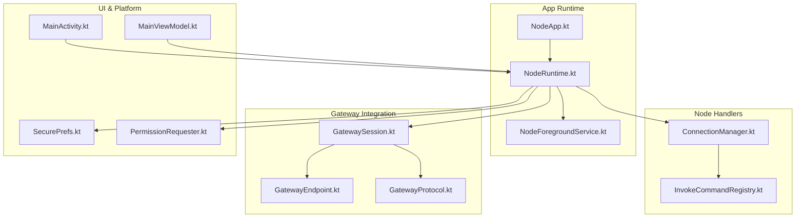
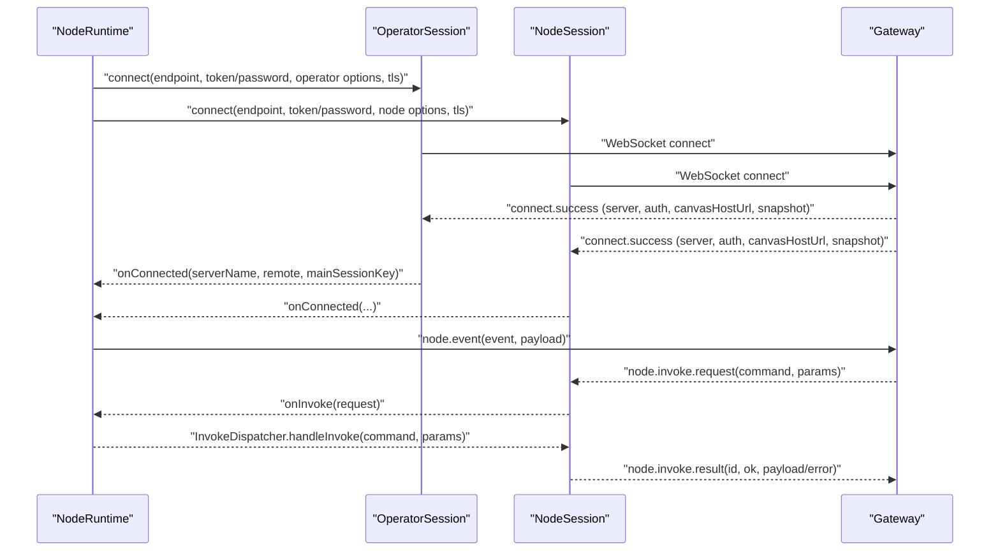
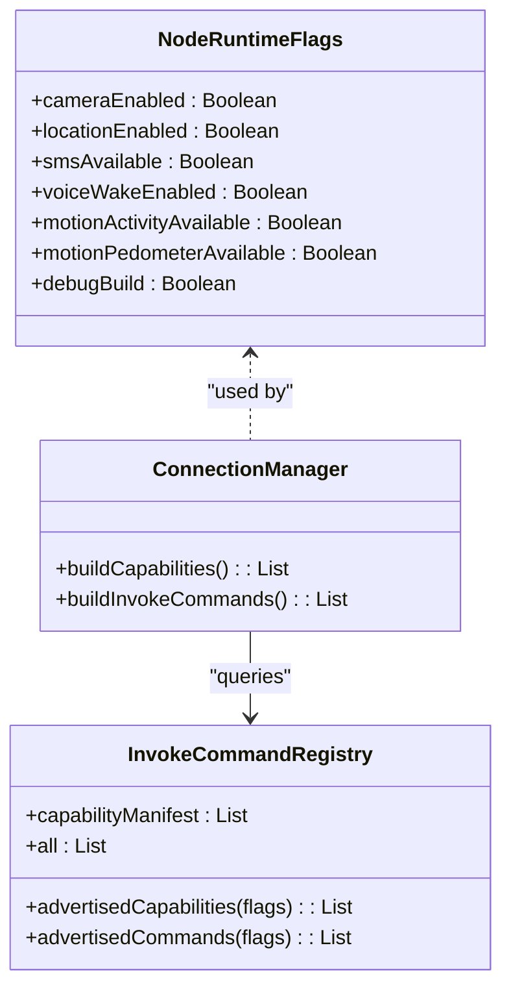
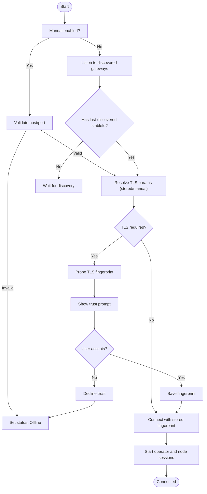
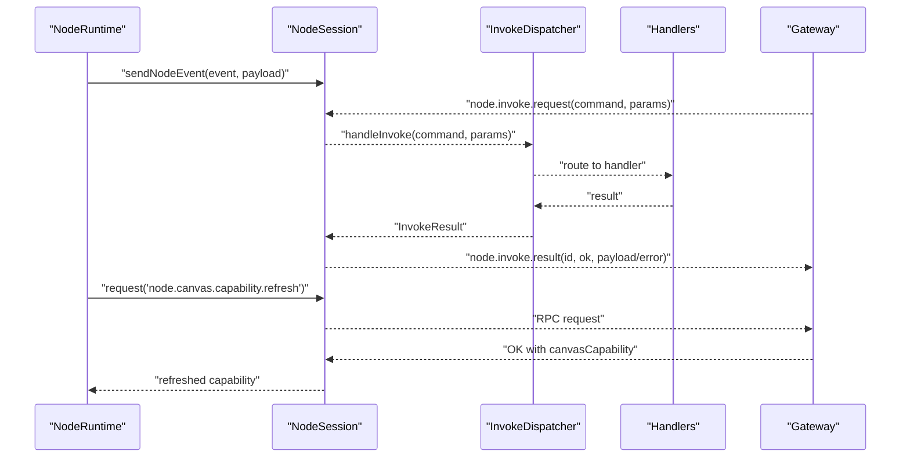
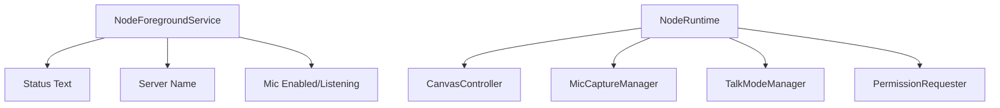
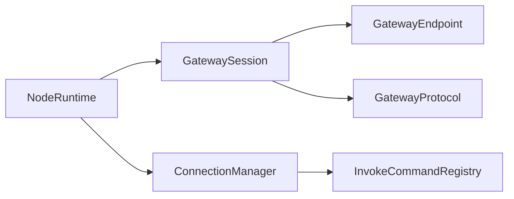

# Android Application

<cite>
**Referenced Files in This Document**
- [README.md](file://apps/android/README.md)
- [NodeApp.kt](file://apps/android/app/src/main/java/ai/openclaw/app/NodeApp.kt)
- [NodeRuntime.kt](file://apps/android/app/src/main/java/ai/openclaw/app/NodeRuntime.kt)
- [NodeForegroundService.kt](file://apps/android/app/src/main/java/ai/openclaw/app/NodeForegroundService.kt)
- [ConnectionManager.kt](file://apps/android/app/src/main/java/ai/openclaw/app/node/ConnectionManager.kt)
- [InvokeCommandRegistry.kt](file://apps/android/app/src/main/java/ai/openclaw/app/node/InvokeCommandRegistry.kt)
- [GatewaySession.kt](file://apps/android/app/src/main/java/ai/openclaw/app/gateway/GatewaySession.kt)
- [GatewayEndpoint.kt](file://apps/android/app/src/main/java/ai/openclaw/app/gateway/GatewayEndpoint.kt)
- [GatewayProtocol.kt](file://apps/android/app/src/main/java/ai/openclaw/app/gateway/GatewayProtocol.kt)
- [MainActivity.kt](file://apps/android/app/src/main/java/ai/openclaw/app/MainActivity.kt)
- [MainViewModel.kt](file://apps/android/app/src/main/java/ai/openclaw/app/MainViewModel.kt)
- [SecurePrefs.kt](file://apps/android/app/src/main/java/ai/openclaw/app/SecurePrefs.kt)
- [PermissionRequester.kt](file://apps/android/app/src/main/java/ai/openclaw/app/PermissionRequester.kt)
- [DeviceNames.kt](file://apps/android/app/src/main/java/ai/openclaw/app/DeviceNames.kt)
- [LocationMode.kt](file://apps/android/app/src/main/java/ai/openclaw/app/LocationMode.kt)
- [VoiceWakeMode.kt](file://apps/android/app/src/main/java/ai/openclaw/app/VoiceWakeMode.kt)
- [WakeWords.kt](file://apps/android/app/src/main/java/ai/openclaw/app/WakeWords.kt)
- [CameraHudState.kt](file://apps/android/app/src/main/java/ai/openclaw/app/CameraHudState.kt)
- [SessionKey.kt](file://apps/android/app/src/main/java/ai/openclaw/app/SessionKey.kt)
- [AndroidManifest.xml](file://apps/android/app/src/main/AndroidManifest.xml)
</cite>

## Table of Contents
1. [Introduction](#introduction)
2. [Project Structure](#project-structure)
3. [Core Components](#core-components)
4. [Architecture Overview](#architecture-overview)
5. [Detailed Component Analysis](#detailed-component-analysis)
6. [Dependency Analysis](#dependency-analysis)
7. [Performance Considerations](#performance-considerations)
8. [Troubleshooting Guide](#troubleshooting-guide)
9. [Conclusion](#conclusion)
10. [Appendices](#appendices)

## Introduction
This document explains the Android application that powers the OpenClaw node. It covers the Android device command families, node capabilities, and integration patterns with the OpenClaw gateway system. It also documents the app’s architecture, service components, and permission requirements, and describes the device pairing process, connection establishment, and capability negotiation with the gateway. Practical examples illustrate device command invocation, status reporting, and error handling, and the relationship between Android node capabilities and gateway functionality is clarified.

## Project Structure
The Android app is organized around a runtime that manages gateway sessions, capability and command advertisement, and platform integrations such as camera, location, SMS, notifications, and voice. UI and services orchestrate lifecycle and user interactions.

**Diagram sources**
- [NodeApp.kt](file://apps/android/app/src/main/java/ai/openclaw/app/NodeApp.kt#L6-L26)
- [NodeRuntime.kt](file://apps/android/app/src/main/java/ai/openclaw/app/NodeRuntime.kt#L44-L166)
- [NodeForegroundService.kt](file://apps/android/app/src/main/java/ai/openclaw/app/NodeForegroundService.kt#L20-L75)
- [ConnectionManager.kt](file://apps/android/app/src/main/java/ai/openclaw/app/node/ConnectionManager.kt#L13-L90)
- [InvokeCommandRegistry.kt](file://apps/android/app/src/main/java/ai/openclaw/app/node/InvokeCommandRegistry.kt#L57-L90)
- [GatewaySession.kt](file://apps/android/app/src/main/java/ai/openclaw/app/gateway/GatewaySession.kt#L55-L138)
- [GatewayEndpoint.kt](file://apps/android/app/src/main/java/ai/openclaw/app/gateway/GatewayEndpoint.kt#L3-L26)
- [GatewayProtocol.kt](file://apps/android/app/src/main/java/ai/openclaw/app/gateway/GatewayProtocol.kt#L3-L3)
- [MainActivity.kt](file://apps/android/app/src/main/java/ai/openclaw/app/MainActivity.kt)
- [MainViewModel.kt](file://apps/android/app/src/main/java/ai/openclaw/app/MainViewModel.kt)
- [SecurePrefs.kt](file://apps/android/app/src/main/java/ai/openclaw/app/SecurePrefs.kt)
- [PermissionRequester.kt](file://apps/android/app/src/main/java/ai/openclaw/app/PermissionRequester.kt)

**Section sources**
- [README.md](file://apps/android/README.md#L1-L229)
- [NodeApp.kt](file://apps/android/app/src/main/java/ai/openclaw/app/NodeApp.kt#L6-L26)
- [NodeRuntime.kt](file://apps/android/app/src/main/java/ai/openclaw/app/NodeRuntime.kt#L44-L166)
- [ConnectionManager.kt](file://apps/android/app/src/main/java/ai/openclaw/app/node/ConnectionManager.kt#L13-L90)
- [GatewaySession.kt](file://apps/android/app/src/main/java/ai/openclaw/app/gateway/GatewaySession.kt#L55-L138)

## Core Components
- NodeApp: Application entry point that initializes NodeRuntime and enables strict mode in debug builds.
- NodeRuntime: Central runtime orchestrating gateway sessions, capability/command advertisement, UI state, and platform integrations (camera, location, SMS, notifications, voice).
- NodeForegroundService: Foreground service that displays connection status and mic state, and allows manual disconnection.
- ConnectionManager: Builds client info, user agent, and connect options; resolves TLS parameters and advertises capabilities/commands.
- InvokeCommandRegistry: Declares node capabilities and available commands, gated by runtime flags (camera enabled, location enabled, SMS available, motion sensors, debug build).
- GatewaySession: Manages WebSocket connections, RPC requests/events, node.invoke handling, and canvas capability refresh.
- GatewayEndpoint and GatewayProtocol: Endpoint representation and protocol version constants used by sessions.

**Section sources**
- [NodeApp.kt](file://apps/android/app/src/main/java/ai/openclaw/app/NodeApp.kt#L6-L26)
- [NodeRuntime.kt](file://apps/android/app/src/main/java/ai/openclaw/app/NodeRuntime.kt#L44-L166)
- [NodeForegroundService.kt](file://apps/android/app/src/main/java/ai/openclaw/app/NodeForegroundService.kt#L20-L75)
- [ConnectionManager.kt](file://apps/android/app/src/main/java/ai/openclaw/app/node/ConnectionManager.kt#L13-L90)
- [InvokeCommandRegistry.kt](file://apps/android/app/src/main/java/ai/openclaw/app/node/InvokeCommandRegistry.kt#L57-L90)
- [GatewaySession.kt](file://apps/android/app/src/main/java/ai/openclaw/app/gateway/GatewaySession.kt#L55-L138)
- [GatewayEndpoint.kt](file://apps/android/app/src/main/java/ai/openclaw/app/gateway/GatewayEndpoint.kt#L3-L26)
- [GatewayProtocol.kt](file://apps/android/app/src/main/java/ai/openclaw/app/gateway/GatewayProtocol.kt#L3-L3)

## Architecture Overview
The Android node integrates with the gateway via two roles:
- Operator session (UI): Provides chat and voice capabilities with operator scopes.
- Node session (device): Advertises capabilities and commands, receives node.invoke requests, and emits node events.

**Diagram sources**
- [NodeRuntime.kt](file://apps/android/app/src/main/java/ai/openclaw/app/NodeRuntime.kt#L220-L292)
- [GatewaySession.kt](file://apps/android/app/src/main/java/ai/openclaw/app/gateway/GatewaySession.kt#L107-L138)
- [GatewaySession.kt](file://apps/android/app/src/main/java/ai/openclaw/app/gateway/GatewaySession.kt#L345-L378)
- [GatewaySession.kt](file://apps/android/app/src/main/java/ai/openclaw/app/gateway/GatewaySession.kt#L523-L547)

## Detailed Component Analysis

### Android Node Command Families and Capabilities
The Android node advertises capabilities and commands dynamically based on runtime flags. Capabilities include device, system, notifications, camera, SMS, voice wake, location, photos, contacts, calendar, and motion. Commands include canvas presentation, navigation, evaluation, snapshots, A2UI push/reset, device status/info/permissions/health, notifications listing/actions, photos latest, contacts search/add, calendar events/add, motion activity/step count, and SMS send. Debug commands are available only in debug builds.

**Diagram sources**
- [InvokeCommandRegistry.kt](file://apps/android/app/src/main/java/ai/openclaw/app/node/InvokeCommandRegistry.kt#L57-L90)
- [InvokeCommandRegistry.kt](file://apps/android/app/src/main/java/ai/openclaw/app/node/InvokeCommandRegistry.kt#L204-L233)
- [ConnectionManager.kt](file://apps/android/app/src/main/java/ai/openclaw/app/node/ConnectionManager.kt#L88-L90)

**Section sources**
- [InvokeCommandRegistry.kt](file://apps/android/app/src/main/java/ai/openclaw/app/node/InvokeCommandRegistry.kt#L57-L90)
- [InvokeCommandRegistry.kt](file://apps/android/app/src/main/java/ai/openclaw/app/node/InvokeCommandRegistry.kt#L204-L233)
- [ConnectionManager.kt](file://apps/android/app/src/main/java/ai/openclaw/app/node/ConnectionManager.kt#L88-L90)

### Device Pairing and Connection Establishment
- Discovery and autoconnect: The runtime listens for discovered gateways and autoconnects to a previously trusted endpoint using stored TLS fingerprints. Manual mode requires TLS to be enabled and a stored fingerprint.
- TLS trust: On first TLS handshake, the app probes the gateway’s certificate fingerprint and asks the user to verify; upon acceptance, it stores the fingerprint and proceeds to connect.
- Connect options: The runtime builds operator and node connect options with client info, capabilities, commands, scopes, and permissions. The node session includes the advertised capabilities and commands.

**Diagram sources**
- [NodeRuntime.kt](file://apps/android/app/src/main/java/ai/openclaw/app/NodeRuntime.kt#L524-L587)
- [NodeRuntime.kt](file://apps/android/app/src/main/java/ai/openclaw/app/NodeRuntime.kt#L709-L732)
- [NodeRuntime.kt](file://apps/android/app/src/main/java/ai/openclaw/app/NodeRuntime.kt#L734-L744)
- [ConnectionManager.kt](file://apps/android/app/src/main/java/ai/openclaw/app/node/ConnectionManager.kt#L152-L155)

**Section sources**
- [NodeRuntime.kt](file://apps/android/app/src/main/java/ai/openclaw/app/NodeRuntime.kt#L524-L587)
- [NodeRuntime.kt](file://apps/android/app/src/main/java/ai/openclaw/app/NodeRuntime.kt#L709-L732)
- [NodeRuntime.kt](file://apps/android/app/src/main/java/ai/openclaw/app/NodeRuntime.kt#L734-L744)
- [ConnectionManager.kt](file://apps/android/app/src/main/java/ai/openclaw/app/node/ConnectionManager.kt#L152-L155)

### Gateway Integration Patterns
- Node events: The runtime sends node events to the gateway for agent-driven actions (e.g., canvas rehydrate).
- Node invoke handling: The node session receives node.invoke.request and delegates to the dispatcher, which routes to appropriate handlers based on command name.
- Canvas capability refresh: The runtime can request a refresh of the node’s canvas capability and rewrite the scoped canvas URL accordingly.

**Diagram sources**
- [NodeRuntime.kt](file://apps/android/app/src/main/java/ai/openclaw/app/NodeRuntime.kt#L461-L491)
- [GatewaySession.kt](file://apps/android/app/src/main/java/ai/openclaw/app/gateway/GatewaySession.kt#L139-L160)
- [GatewaySession.kt](file://apps/android/app/src/main/java/ai/openclaw/app/gateway/GatewaySession.kt#L176-L215)
- [GatewaySession.kt](file://apps/android/app/src/main/java/ai/openclaw/app/gateway/GatewaySession.kt#L523-L547)

**Section sources**
- [NodeRuntime.kt](file://apps/android/app/src/main/java/ai/openclaw/app/NodeRuntime.kt#L461-L491)
- [GatewaySession.kt](file://apps/android/app/src/main/java/ai/openclaw/app/gateway/GatewaySession.kt#L176-L215)
- [GatewaySession.kt](file://apps/android/app/src/main/java/ai/openclaw/app/gateway/GatewaySession.kt#L523-L547)

### Android-Specific Features, System Integration, and Platform Optimizations
- Foreground service: Displays connection status, server name, and microphone state; allows manual disconnect.
- Permissions: Requests camera, location, and notification permissions depending on Android version and feature usage.
- Voice and talk: Integrates with voice capture and talk mode managers for speech-to-text and text-to-speech.
- Canvas and A2UI: Supports canvas navigation, snapshotting, and A2UI push/reset; maintains hydration state and rehydration retries.
- Background execution: Uses a foreground service to maintain connectivity and visibility; respects app foreground/background transitions.

**Diagram sources**
- [NodeForegroundService.kt](file://apps/android/app/src/main/java/ai/openclaw/app/NodeForegroundService.kt#L40-L56)
- [NodeRuntime.kt](file://apps/android/app/src/main/java/ai/openclaw/app/NodeRuntime.kt#L325-L353)
- [NodeRuntime.kt](file://apps/android/app/src/main/java/ai/openclaw/app/NodeRuntime.kt#L382-L390)
- [PermissionRequester.kt](file://apps/android/app/src/main/java/ai/openclaw/app/PermissionRequester.kt)

**Section sources**
- [NodeForegroundService.kt](file://apps/android/app/src/main/java/ai/openclaw/app/NodeForegroundService.kt#L20-L75)
- [NodeRuntime.kt](file://apps/android/app/src/main/java/ai/openclaw/app/NodeRuntime.kt#L325-L353)
- [NodeRuntime.kt](file://apps/android/app/src/main/java/ai/openclaw/app/NodeRuntime.kt#L382-L390)
- [PermissionRequester.kt](file://apps/android/app/src/main/java/ai/openclaw/app/PermissionRequester.kt)

### Setup Instructions and Deployment Scenarios
- Local USB-only testing: Use adb reverse to tunnel localhost to the gateway running on the host; then connect in Manual mode with TLS disabled.
- Standard pairing: Start the gateway, open the Connect tab, use Setup Code or Manual mode, approve pairing on the gateway, and ensure the app stays unlocked and in the foreground for capability tests.

**Section sources**
- [README.md](file://apps/android/README.md#L112-L133)
- [README.md](file://apps/android/README.md#L143-L163)

### Practical Examples
- Device command invocation: The runtime sends node events to request actions (e.g., canvas rehydrate) and parses run IDs from chat send responses.
- Status reporting: The foreground service updates notification text based on connection state, server name, and microphone status.
- Error handling: GatewaySession throws structured errors for timeouts and failures; NodeRuntime surfaces user-facing status text and pending trust prompts.

**Section sources**
- [NodeRuntime.kt](file://apps/android/app/src/main/java/ai/openclaw/app/NodeRuntime.kt#L808-L826)
- [NodeRuntime.kt](file://apps/android/app/src/main/java/ai/openclaw/app/NodeRuntime.kt#L871-L875)
- [NodeForegroundService.kt](file://apps/android/app/src/main/java/ai/openclaw/app/NodeForegroundService.kt#L40-L56)
- [GatewaySession.kt](file://apps/android/app/src/main/java/ai/openclaw/app/gateway/GatewaySession.kt#L162-L174)

## Dependency Analysis
- NodeRuntime depends on GatewaySession for operator and node roles, ConnectionManager for capability/command lists and TLS resolution, and platform handlers for device features.
- GatewaySession encapsulates WebSocket communication, RPC request/response, and node.invoke handling.
- InvokeCommandRegistry centralizes capability/command declarations and availability gating.

**Diagram sources**
- [NodeRuntime.kt](file://apps/android/app/src/main/java/ai/openclaw/app/NodeRuntime.kt#L126-L166)
- [ConnectionManager.kt](file://apps/android/app/src/main/java/ai/openclaw/app/node/ConnectionManager.kt#L13-L90)
- [GatewaySession.kt](file://apps/android/app/src/main/java/ai/openclaw/app/gateway/GatewaySession.kt#L55-L138)
- [GatewayEndpoint.kt](file://apps/android/app/src/main/java/ai/openclaw/app/gateway/GatewayEndpoint.kt#L3-L26)
- [GatewayProtocol.kt](file://apps/android/app/src/main/java/ai/openclaw/app/gateway/GatewayProtocol.kt#L3-L3)

**Section sources**
- [NodeRuntime.kt](file://apps/android/app/src/main/java/ai/openclaw/app/NodeRuntime.kt#L126-L166)
- [ConnectionManager.kt](file://apps/android/app/src/main/java/ai/openclaw/app/node/ConnectionManager.kt#L13-L90)
- [GatewaySession.kt](file://apps/android/app/src/main/java/ai/openclaw/app/gateway/GatewaySession.kt#L55-L138)

## Performance Considerations
- Startup and UI responsiveness: The app targets a modern Android minSdk and supports live editing and hot reload for rapid iteration.
- Background execution: Foreground service ensures continuity; keep the app in the foreground for canvas operations requiring WebView attachment.
- Network reliability: GatewaySession implements exponential backoff and robust request/ack handling.

**Section sources**
- [README.md](file://apps/android/README.md#L134-L141)
- [NodeForegroundService.kt](file://apps/android/app/src/main/java/ai/openclaw/app/NodeForegroundService.kt#L20-L75)
- [GatewaySession.kt](file://apps/android/app/src/main/java/ai/openclaw/app/gateway/GatewaySession.kt#L600-L622)

## Troubleshooting Guide
- Pairing required: Approve the latest pending device pairing request on the gateway and rerun integration tests.
- A2UI host not reachable: Ensure the gateway canvas host is running and reachable; keep the app on the Screen tab; the app will auto-refresh canvas capability once.
- Node background unavailable: Keep the app foregrounded and on the Screen tab; the node must be effectively ready for canvas commands.
- TLS trust prompt: If prompted, verify the fingerprint out-of-band and accept to store the fingerprint for future connections.
- Connection errors: Review status text and logs; the app retries with exponential backoff.

**Section sources**
- [README.md](file://apps/android/README.md#L175-L224)
- [NodeRuntime.kt](file://apps/android/app/src/main/java/ai/openclaw/app/NodeRuntime.kt#L711-L722)
- [NodeRuntime.kt](file://apps/android/app/src/main/java/ai/openclaw/app/NodeRuntime.kt#L734-L744)

## Conclusion
The Android application implements a robust node that integrates with the OpenClaw gateway through dual sessions, dynamic capability/command advertisement, and platform-aware features. Its architecture emphasizes secure TLS trust, resilient networking, and a responsive UI with foreground service support. The documented pairing, connection, and capability negotiation patterns provide a clear path to reliable operation across diverse deployment scenarios.

## Appendices

### Permissions and Platform Notes
- Discovery permissions: Nearby Wi-Fi devices on Android 13+, location on Android 12 and below.
- Foreground service notification: Required on Android 13+.
- Camera/Microphone: Required for camera snap/clip and recording with audio.

**Section sources**
- [README.md](file://apps/android/README.md#L165-L174)

### Android Version Compatibility and Security
- Protocol version: The app uses a fixed gateway protocol version constant.
- TLS pinning: Stored fingerprints are preferred; discovery-provided hints are not treated as authoritative.
- User agent and client info: Built with version, OS release, and device model identifiers.

**Section sources**
- [GatewayProtocol.kt](file://apps/android/app/src/main/java/ai/openclaw/app/gateway/GatewayProtocol.kt#L3-L3)
- [ConnectionManager.kt](file://apps/android/app/src/main/java/ai/openclaw/app/node/ConnectionManager.kt#L24-L74)
- [ConnectionManager.kt](file://apps/android/app/src/main/java/ai/openclaw/app/node/ConnectionManager.kt#L108-L113)