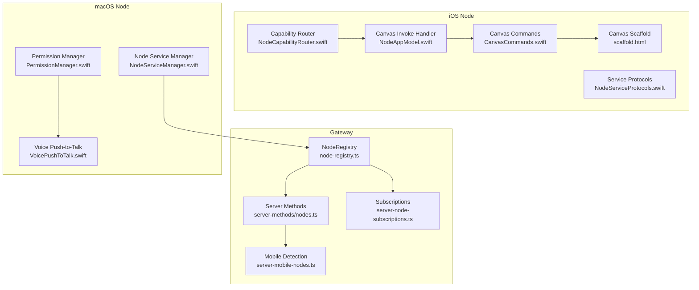
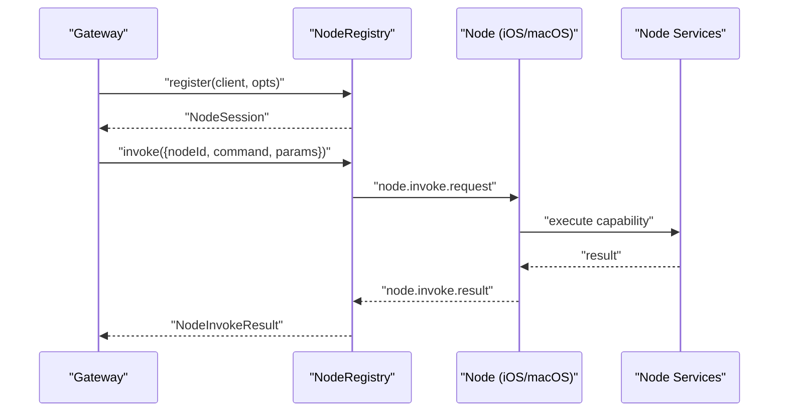
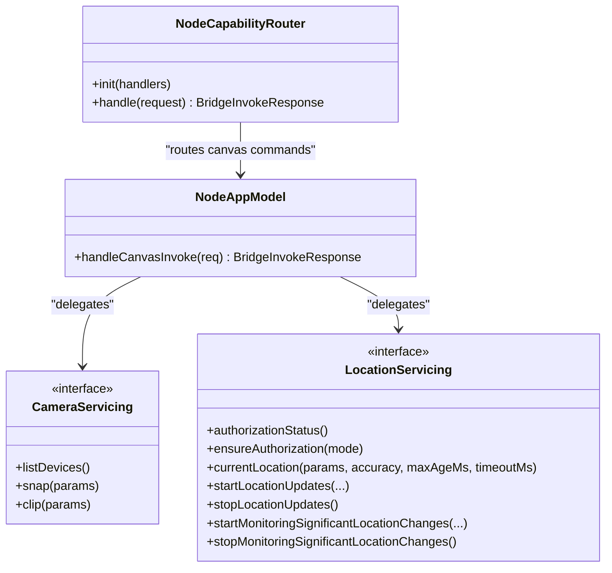
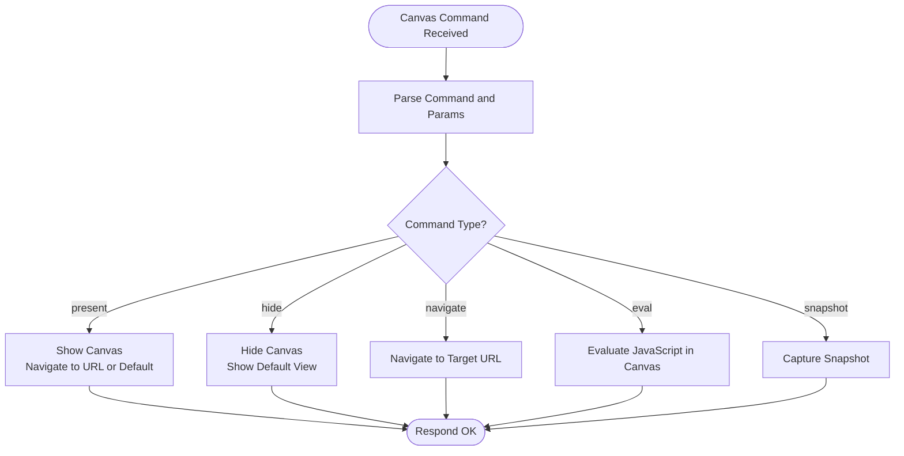
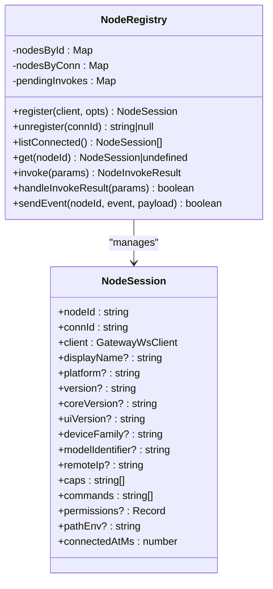
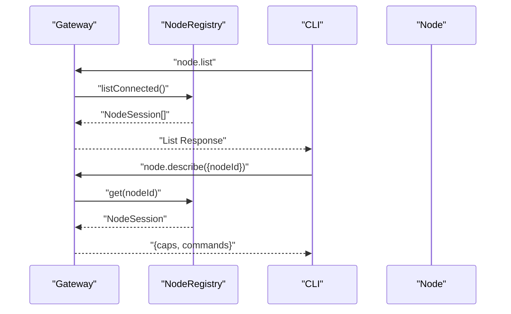
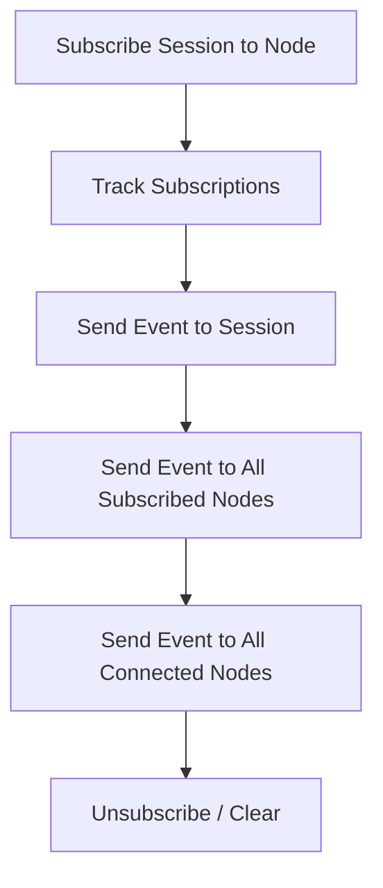
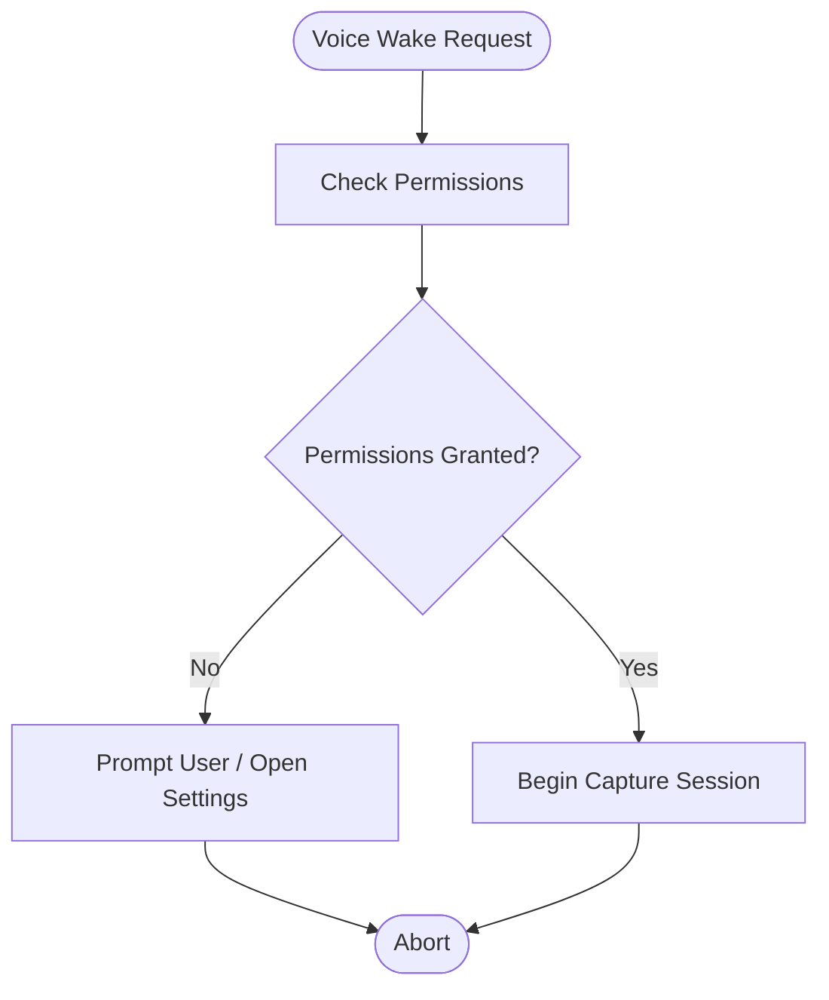
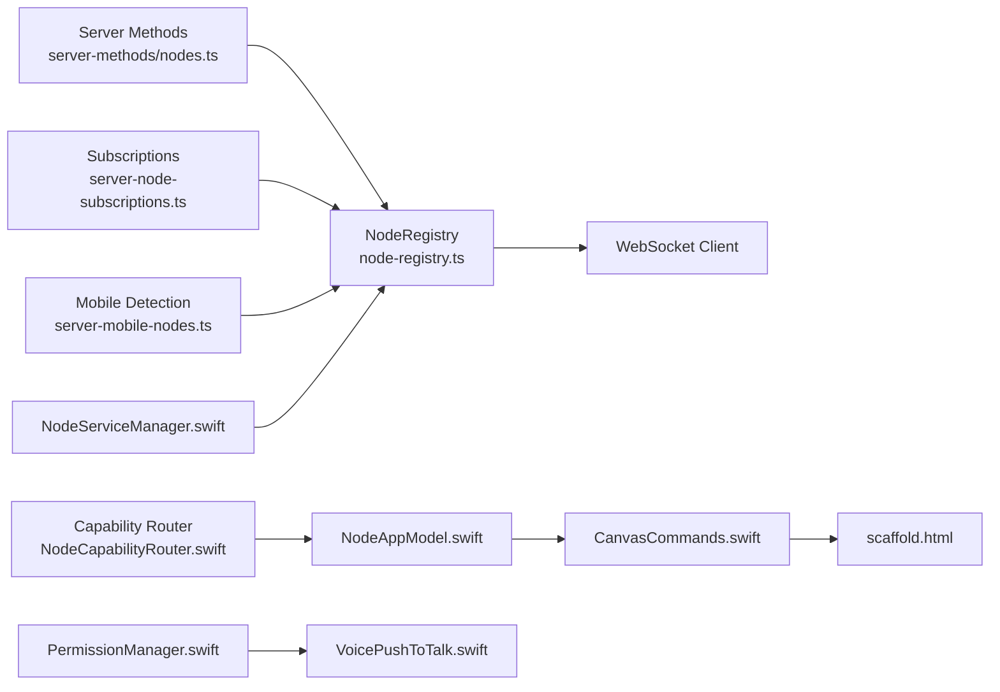
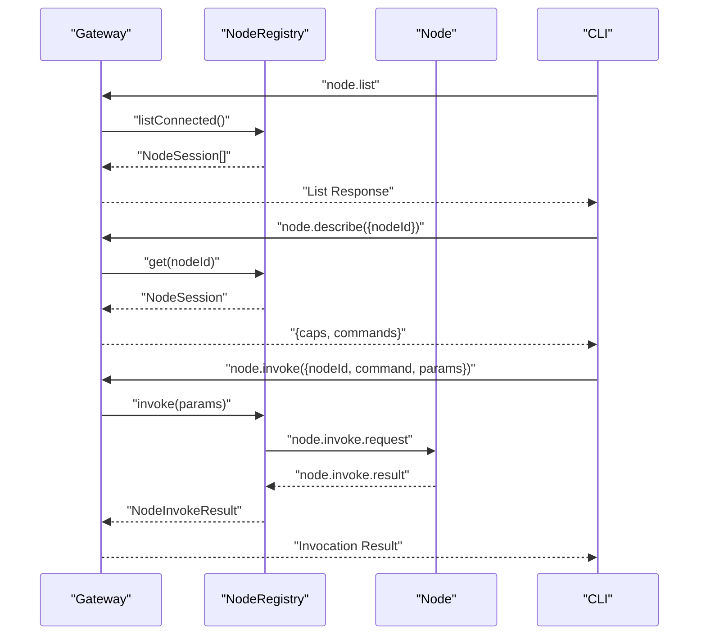

# Device Capabilities & Node Architecture

<cite>
**Referenced Files in This Document**
- [NodeCapabilityRouter.swift](file://apps/ios/Sources/Capabilities/NodeCapabilityRouter.swift)
- [NodeServiceProtocols.swift](file://apps/ios/Sources/Services/NodeServiceProtocols.swift)
- [CanvasCommands.swift](file://apps/shared/OpenClawKit/Sources/OpenClawKit/CanvasCommands.swift)
- [scaffold.html](file://apps/shared/OpenClawKit/Sources/OpenClawKit/Resources/CanvasScaffold/scaffold.html)
- [NodeAppModel.swift](file://apps/ios/Sources/Model/NodeAppModel.swift)
- [PermissionManager.swift](file://apps/macos/Sources/OpenClaw/PermissionManager.swift)
- [VoicePushToTalk.swift](file://apps/macos/Sources/OpenClaw/VoicePushToTalk.swift)
- [NodeServiceManager.swift](file://apps/macos/Sources/OpenClaw/NodeServiceManager.swift)
- [node-registry.ts](file://src/gateway/node-registry.ts)
- [server-methods/nodes.ts](file://src/gateway/server-methods/nodes.ts)
- [server-node-subscriptions.ts](file://src/gateway/server-node-subscriptions.ts)
- [server-mobile-nodes.ts](file://src/gateway/server-mobile-nodes.ts)
- [rpc.ts](file://src/cli/nodes-cli/rpc.ts)
- [napi-rs-canvas.d.ts](file://src/types/napi-rs-canvas.d.ts)
</cite>

## Table of Contents
1. [Introduction](#introduction)
2. [Project Structure](#project-structure)
3. [Core Components](#core-components)
4. [Architecture Overview](#architecture-overview)
5. [Detailed Component Analysis](#detailed-component-analysis)
6. [Dependency Analysis](#dependency-analysis)
7. [Performance Considerations](#performance-considerations)
8. [Troubleshooting Guide](#troubleshooting-guide)
9. [Conclusion](#conclusion)
10. [Appendices](#appendices)

## Introduction
This document explains the device capabilities and node architecture across mobile platforms, focusing on how the unified node interface abstracts platform-specific implementations while exposing consistent capabilities. It covers the node capability advertisement system, capability negotiation between the gateway and nodes, dynamic capability discovery, and common node operations such as canvas rendering, media capture, location services, and voice processing. It also documents node lifecycle management, connection handling, status reporting, the node registry system, capability validation, error handling strategies, cross-platform compatibility considerations, capability mapping, performance optimization techniques, invocation protocols, parameter handling, result reporting, and capability-based routing and load balancing.

## Project Structure
The repository organizes capabilities and node logic across three primary layers:
- Gateway server-side logic for capability advertisement, discovery, lifecycle, and subscriptions
- Platform-specific node implementations (iOS/macOS) that expose services via a unified interface
- Shared OpenClawKit components that define cross-platform commands and resources

**Diagram sources**
- [node-registry.ts](file://src/gateway/node-registry.ts#L38-L209)
- [server-methods/nodes.ts](file://src/gateway/server-methods/nodes.ts#L599-L644)
- [server-node-subscriptions.ts](file://src/gateway/server-node-subscriptions.ts#L33-L164)
- [server-mobile-nodes.ts](file://src/gateway/server-mobile-nodes.ts#L1-L14)
- [NodeCapabilityRouter.swift](file://apps/ios/Sources/Capabilities/NodeCapabilityRouter.swift#L5-L25)
- [NodeServiceProtocols.swift](file://apps/ios/Sources/Services/NodeServiceProtocols.swift#L9-L108)
- [NodeAppModel.swift](file://apps/ios/Sources/Model/NodeAppModel.swift#L834-L856)
- [CanvasCommands.swift](file://apps/shared/OpenClawKit/Sources/OpenClawKit/CanvasCommands.swift#L3-L9)
- [scaffold.html](file://apps/shared/OpenClawKit/Sources/OpenClawKit/Resources/CanvasScaffold/scaffold.html#L1-L38)
- [PermissionManager.swift](file://apps/macos/Sources/OpenClaw/PermissionManager.swift#L122-L186)
- [VoicePushToTalk.swift](file://apps/macos/Sources/OpenClaw/VoicePushToTalk.swift#L145-L155)
- [NodeServiceManager.swift](file://apps/macos/Sources/OpenClaw/NodeServiceManager.swift#L7-L29)

**Section sources**
- [node-registry.ts](file://src/gateway/node-registry.ts#L1-L210)
- [server-methods/nodes.ts](file://src/gateway/server-methods/nodes.ts#L599-L644)
- [server-node-subscriptions.ts](file://src/gateway/server-node-subscriptions.ts#L1-L164)
- [server-mobile-nodes.ts](file://src/gateway/server-mobile-nodes.ts#L1-L14)
- [NodeCapabilityRouter.swift](file://apps/ios/Sources/Capabilities/NodeCapabilityRouter.swift#L1-L25)
- [NodeServiceProtocols.swift](file://apps/ios/Sources/Services/NodeServiceProtocols.swift#L1-L108)
- [NodeAppModel.swift](file://apps/ios/Sources/Model/NodeAppModel.swift#L834-L856)
- [CanvasCommands.swift](file://apps/shared/OpenClawKit/Sources/OpenClawKit/CanvasCommands.swift#L1-L10)
- [scaffold.html](file://apps/shared/OpenClawKit/Sources/OpenClawKit/Resources/CanvasScaffold/scaffold.html#L1-L38)
- [PermissionManager.swift](file://apps/macos/Sources/OpenClaw/PermissionManager.swift#L122-L186)
- [VoicePushToTalk.swift](file://apps/macos/Sources/OpenClaw/VoicePushToTalk.swift#L145-L155)
- [NodeServiceManager.swift](file://apps/macos/Sources/OpenClaw/NodeServiceManager.swift#L1-L139)

## Core Components
- Unified node interface: A router and protocol layer on iOS that exposes platform services behind a consistent command surface. The router dispatches bridge-invoked commands to specialized handlers, while protocols define capability contracts for camera, screen recording, location, photos, contacts, calendar, reminders, motion, and watch messaging.
- Capability advertisement and discovery: Nodes advertise capabilities and commands during registration. The gateway lists nodes, describes node capabilities, and supports capability-based routing and load balancing.
- Node lifecycle and registry: The NodeRegistry manages connections, pending invocations, timeouts, and event delivery to nodes. It ensures robust invocation semantics and cleanup on disconnect.
- Cross-platform canvas rendering: Shared canvas commands and a scaffold HTML template enable consistent presentation and navigation across platforms.
- Permissions and voice processing: macOS permission managers and voice push-to-talk flows ensure secure and authorized access to microphone and speech recognition.

**Section sources**
- [NodeCapabilityRouter.swift](file://apps/ios/Sources/Capabilities/NodeCapabilityRouter.swift#L5-L25)
- [NodeServiceProtocols.swift](file://apps/ios/Sources/Services/NodeServiceProtocols.swift#L9-L108)
- [CanvasCommands.swift](file://apps/shared/OpenClawKit/Sources/OpenClawKit/CanvasCommands.swift#L3-L9)
- [scaffold.html](file://apps/shared/OpenClawKit/Sources/OpenClawKit/Resources/CanvasScaffold/scaffold.html#L1-L38)
- [node-registry.ts](file://src/gateway/node-registry.ts#L38-L209)
- [server-methods/nodes.ts](file://src/gateway/server-methods/nodes.ts#L599-L644)
- [PermissionManager.swift](file://apps/macos/Sources/OpenClaw/PermissionManager.swift#L122-L186)
- [VoicePushToTalk.swift](file://apps/macos/Sources/OpenClaw/VoicePushToTalk.swift#L145-L155)

## Architecture Overview
The system separates concerns across gateway, node, and shared components:
- Gateway: Registers nodes, tracks capabilities, handles RPC invocations, and manages subscriptions.
- Node (iOS): Implements capability handlers and routes bridge commands to platform services.
- Node (macOS): Manages service lifecycle and enforces permissions for voice wake and other sensitive capabilities.
- Shared: Defines canvas commands and resources for consistent UI behavior.

**Diagram sources**
- [node-registry.ts](file://src/gateway/node-registry.ts#L107-L181)
- [server-methods/nodes.ts](file://src/gateway/server-methods/nodes.ts#L599-L644)

## Detailed Component Analysis

### Unified Node Interface and Capability Routing (iOS)
The iOS node implements a capability router that maps incoming bridge commands to specialized handlers. Handlers receive a typed request and return a typed response, enabling consistent capability negotiation and invocation semantics.

**Diagram sources**
- [NodeCapabilityRouter.swift](file://apps/ios/Sources/Capabilities/NodeCapabilityRouter.swift#L5-L25)
- [NodeAppModel.swift](file://apps/ios/Sources/Model/NodeAppModel.swift#L834-L856)
- [NodeServiceProtocols.swift](file://apps/ios/Sources/Services/NodeServiceProtocols.swift#L9-L40)

**Section sources**
- [NodeCapabilityRouter.swift](file://apps/ios/Sources/Capabilities/NodeCapabilityRouter.swift#L1-L25)
- [NodeServiceProtocols.swift](file://apps/ios/Sources/Services/NodeServiceProtocols.swift#L1-L108)
- [NodeAppModel.swift](file://apps/ios/Sources/Model/NodeAppModel.swift#L834-L856)

### Canvas Rendering and Navigation (Shared)
Canvas commands define a consistent set of operations across platforms, while the scaffold HTML provides a responsive UI baseline and platform-specific styling.

**Diagram sources**
- [CanvasCommands.swift](file://apps/shared/OpenClawKit/Sources/OpenClawKit/CanvasCommands.swift#L3-L9)
- [NodeAppModel.swift](file://apps/ios/Sources/Model/NodeAppModel.swift#L834-L856)
- [scaffold.html](file://apps/shared/OpenClawKit/Sources/OpenClawKit/Resources/CanvasScaffold/scaffold.html#L1-L38)

**Section sources**
- [CanvasCommands.swift](file://apps/shared/OpenClawKit/Sources/OpenClawKit/CanvasCommands.swift#L1-L10)
- [NodeAppModel.swift](file://apps/ios/Sources/Model/NodeAppModel.swift#L834-L856)
- [scaffold.html](file://apps/shared/OpenClawKit/Sources/OpenClawKit/Resources/CanvasScaffold/scaffold.html#L1-L38)

### Node Lifecycle Management and Registry
The NodeRegistry encapsulates node sessions, pending invocations, and event delivery. It ensures robust invocation semantics with timeouts and cleanup on disconnect.

**Diagram sources**
- [node-registry.ts](file://src/gateway/node-registry.ts#L4-L36)
- [node-registry.ts](file://src/gateway/node-registry.ts#L38-L209)

**Section sources**
- [node-registry.ts](file://src/gateway/node-registry.ts#L1-L210)

### Capability Advertisement, Discovery, and Negotiation
Nodes advertise capabilities and commands during registration. The gateway exposes methods to list nodes and describe node capabilities, enabling dynamic discovery and capability-based routing.

**Diagram sources**
- [server-methods/nodes.ts](file://src/gateway/server-methods/nodes.ts#L599-L644)
- [node-registry.ts](file://src/gateway/node-registry.ts#L99-L105)
- [rpc.ts](file://src/cli/nodes-cli/rpc.ts#L75-L96)

**Section sources**
- [server-methods/nodes.ts](file://src/gateway/server-methods/nodes.ts#L599-L644)
- [node-registry.ts](file://src/gateway/node-registry.ts#L43-L79)
- [rpc.ts](file://src/cli/nodes-cli/rpc.ts#L75-L96)

### Subscriptions and Status Reporting
The subscription manager enables targeted event delivery to sessions and nodes, supporting status updates and capability-based routing.

**Diagram sources**
- [server-node-subscriptions.ts](file://src/gateway/server-node-subscriptions.ts#L33-L164)

**Section sources**
- [server-node-subscriptions.ts](file://src/gateway/server-node-subscriptions.ts#L1-L164)

### Mobile Node Detection and Capability-Based Routing
The gateway detects mobile nodes and can leverage capability metadata for routing and load balancing decisions.

**Section sources**
- [server-mobile-nodes.ts](file://src/gateway/server-mobile-nodes.ts#L1-L14)

### Permissions and Voice Processing (macOS)
macOS enforces permissions for speech recognition and camera, and integrates voice push-to-talk flows with permission checks.

**Diagram sources**
- [PermissionManager.swift](file://apps/macos/Sources/OpenClaw/PermissionManager.swift#L122-L186)
- [VoicePushToTalk.swift](file://apps/macos/Sources/OpenClaw/VoicePushToTalk.swift#L145-L155)

**Section sources**
- [PermissionManager.swift](file://apps/macos/Sources/OpenClaw/PermissionManager.swift#L122-L186)
- [VoicePushToTalk.swift](file://apps/macos/Sources/OpenClaw/VoicePushToTalk.swift#L145-L155)

### Node Service Lifecycle (macOS)
The NodeServiceManager starts and stops the node service, parsing structured JSON responses and surfacing errors and hints.

**Section sources**
- [NodeServiceManager.swift](file://apps/macos/Sources/OpenClaw/NodeServiceManager.swift#L1-L139)

## Dependency Analysis
The following diagram highlights key dependencies among components:

**Diagram sources**
- [node-registry.ts](file://src/gateway/node-registry.ts#L38-L209)
- [server-methods/nodes.ts](file://src/gateway/server-methods/nodes.ts#L599-L644)
- [server-node-subscriptions.ts](file://src/gateway/server-node-subscriptions.ts#L33-L164)
- [server-mobile-nodes.ts](file://src/gateway/server-mobile-nodes.ts#L1-L14)
- [NodeCapabilityRouter.swift](file://apps/ios/Sources/Capabilities/NodeCapabilityRouter.swift#L5-L25)
- [NodeAppModel.swift](file://apps/ios/Sources/Model/NodeAppModel.swift#L834-L856)
- [CanvasCommands.swift](file://apps/shared/OpenClawKit/Sources/OpenClawKit/CanvasCommands.swift#L3-L9)
- [scaffold.html](file://apps/shared/OpenClawKit/Sources/OpenClawKit/Resources/CanvasScaffold/scaffold.html#L1-L38)
- [NodeServiceManager.swift](file://apps/macos/Sources/OpenClaw/NodeServiceManager.swift#L7-L29)
- [PermissionManager.swift](file://apps/macos/Sources/OpenClaw/PermissionManager.swift#L122-L186)
- [VoicePushToTalk.swift](file://apps/macos/Sources/OpenClaw/VoicePushToTalk.swift#L145-L155)

**Section sources**
- [node-registry.ts](file://src/gateway/node-registry.ts#L1-L210)
- [server-methods/nodes.ts](file://src/gateway/server-methods/nodes.ts#L599-L644)
- [server-node-subscriptions.ts](file://src/gateway/server-node-subscriptions.ts#L1-L164)
- [server-mobile-nodes.ts](file://src/gateway/server-mobile-nodes.ts#L1-L14)
- [NodeCapabilityRouter.swift](file://apps/ios/Sources/Capabilities/NodeCapabilityRouter.swift#L1-L25)
- [NodeAppModel.swift](file://apps/ios/Sources/Model/NodeAppModel.swift#L834-L856)
- [CanvasCommands.swift](file://apps/shared/OpenClawKit/Sources/OpenClawKit/CanvasCommands.swift#L1-L10)
- [scaffold.html](file://apps/shared/OpenClawKit/Sources/OpenClawKit/Resources/CanvasScaffold/scaffold.html#L1-L38)
- [NodeServiceManager.swift](file://apps/macos/Sources/OpenClaw/NodeServiceManager.swift#L1-L139)
- [PermissionManager.swift](file://apps/macos/Sources/OpenClaw/PermissionManager.swift#L122-L186)
- [VoicePushToTalk.swift](file://apps/macos/Sources/OpenClaw/VoicePushToTalk.swift#L145-L155)

## Performance Considerations
- Invocation timeouts: The NodeRegistry enforces configurable timeouts for node invocations to prevent indefinite waits.
- Event batching and filtering: Use subscriptions to target events to reduce unnecessary traffic.
- Canvas rendering: Prefer lightweight JS evaluation and snapshots; avoid heavy DOM operations.
- Permissions gating: Defer permission requests until necessary to minimize UI interruptions.
- Mobile detection: Route capability-intensive tasks to nodes with appropriate hardware support.

[No sources needed since this section provides general guidance]

## Troubleshooting Guide
- Node not connected: The NodeRegistry returns explicit errors when invoking commands on disconnected nodes.
- Invocation timeouts: Pending invocations resolve with a timeout error after the configured period.
- Capability mismatch: Use node.describe to validate advertised capabilities and commands before invoking.
- Permission denials: macOS permission manager surfaces denied states and can open settings for user resolution.
- Service lifecycle: NodeServiceManager parses structured JSON responses and merges hints for actionable diagnostics.

**Section sources**
- [node-registry.ts](file://src/gateway/node-registry.ts#L113-L155)
- [server-methods/nodes.ts](file://src/gateway/server-methods/nodes.ts#L617-L644)
- [PermissionManager.swift](file://apps/macos/Sources/OpenClaw/PermissionManager.swift#L122-L186)
- [NodeServiceManager.swift](file://apps/macos/Sources/OpenClaw/NodeServiceManager.swift#L85-L98)

## Conclusion
The system’s unified node interface abstracts platform-specific implementations while exposing consistent capabilities through a robust capability advertisement and discovery mechanism. The NodeRegistry and gateway components provide reliable lifecycle management, invocation semantics, and subscriptions. Cross-platform canvas rendering, capability mapping, and permission enforcement ensure consistent behavior across iOS and macOS. Capability-based routing and load balancing can be achieved using node metadata and mobile detection.

[No sources needed since this section summarizes without analyzing specific files]

## Appendices

### Capability Negotiation and Dynamic Discovery Workflow

**Diagram sources**
- [server-methods/nodes.ts](file://src/gateway/server-methods/nodes.ts#L599-L644)
- [node-registry.ts](file://src/gateway/node-registry.ts#L107-L181)
- [rpc.ts](file://src/cli/nodes-cli/rpc.ts#L75-L96)