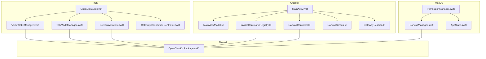
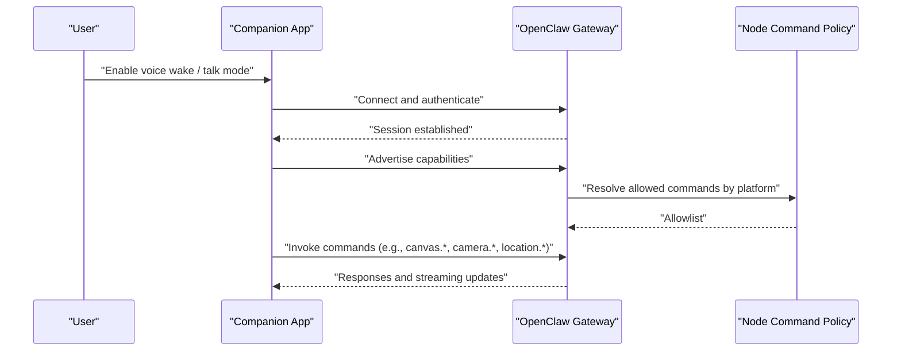
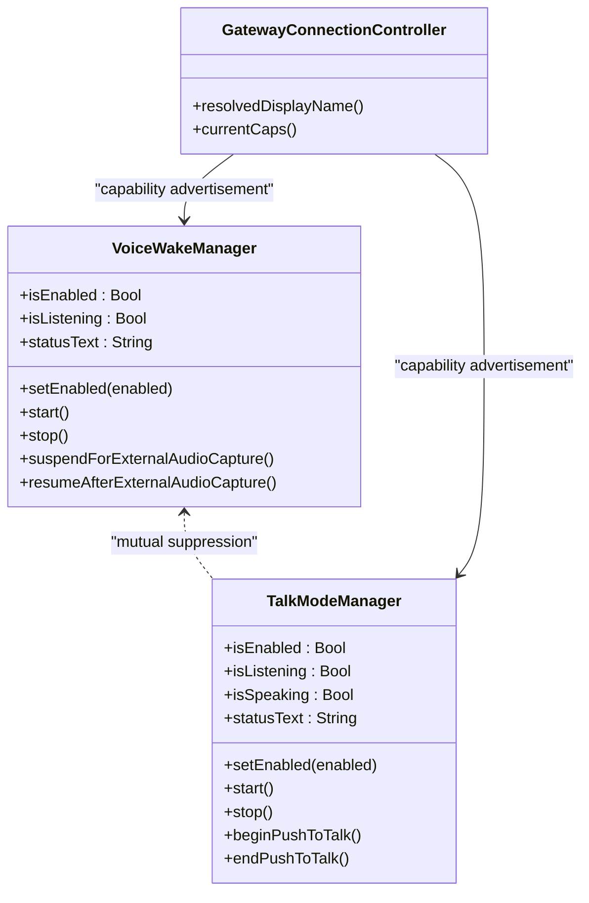
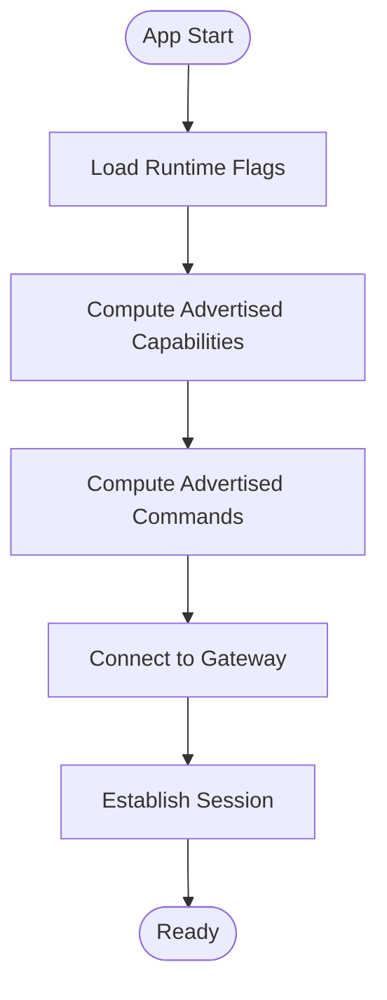
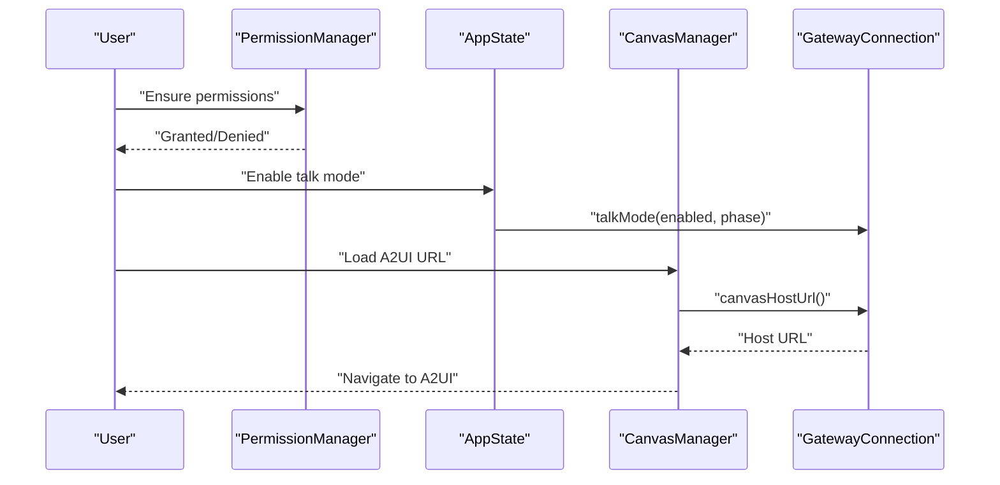
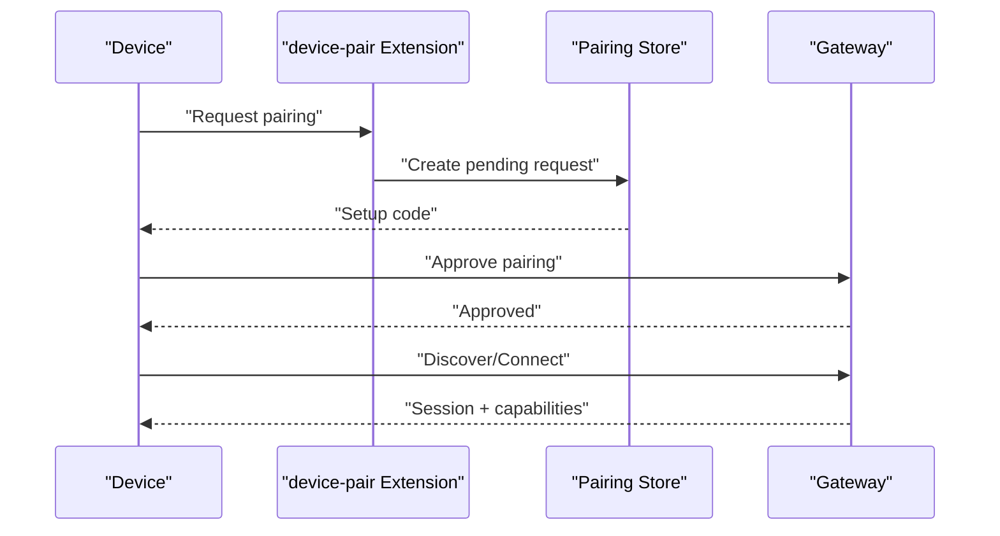
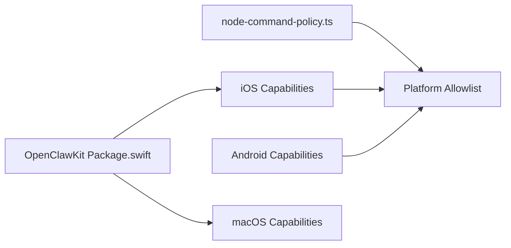

# Mobile Applications

<cite>
**Referenced Files in This Document**
- [apps/ios/README.md](file://apps/ios/README.md)
- [apps/ios/Sources/OpenClawApp.swift](file://apps/ios/Sources/OpenClawApp.swift)
- [apps/ios/Sources/Gateway/GatewayConnectionController.swift](file://apps/ios/Sources/Gateway/GatewayConnectionController.swift)
- [apps/ios/Sources/Voice/VoiceWakeManager.swift](file://apps/ios/Sources/Voice/VoiceWakeManager.swift)
- [apps/ios/Sources/Voice/TalkModeManager.swift](file://apps/ios/Sources/Voice/TalkModeManager.swift)
- [apps/ios/Sources/Screen/ScreenWebView.swift](file://apps/ios/Sources/Screen/ScreenWebView.swift)
- [apps/ios/Sources/Settings/VoiceWakeWordsSettingsView.swift](file://apps/ios/Sources/Settings/VoiceWakeWordsSettingsView.swift)
- [apps/ios/Sources/Status/VoiceWakeToast.swift](file://apps/ios/Sources/Status/VoiceWakeToast.swift)
- [apps/android/README.md](file://apps/android/README.md)
- [apps/android/app/src/main/java/ai/openclaw/app/MainActivity.kt](file://apps/android/app/src/main/java/ai/openclaw/app/MainActivity.kt)
- [apps/android/app/src/main/java/ai/openclaw/app/MainViewModel.kt](file://apps/android/app/src/main/java/ai/openclaw/app/MainViewModel.kt)
- [apps/android/app/src/main/java/ai/openclaw/app/node/InvokeCommandRegistry.kt](file://apps/android/app/src/main/java/ai/openclaw/app/node/InvokeCommandRegistry.kt)
- [apps/android/app/src/main/java/ai/openclaw/app/node/CanvasController.kt](file://apps/android/app/src/main/java/ai/openclaw/app/node/CanvasController.kt)
- [apps/android/app/src/main/java/ai/openclaw/app/ui/CanvasScreen.kt](file://apps/android/app/src/main/java/ai/openclaw/app/ui/CanvasScreen.kt)
- [apps/android/app/src/main/java/ai/openclaw/app/gateway/GatewayDiscovery.kt](file://apps/android/app/src/main/java/ai/openclaw/app/gateway/GatewayDiscovery.kt)
- [apps/android/app/src/main/java/ai/openclaw/app/gateway/GatewaySession.kt](file://apps/android/app/src/main/java/ai/openclaw/app/gateway/GatewaySession.kt)
- [apps/macos/README.md](file://apps/macos/README.md)
- [apps/macos/Sources/OpenClaw/PermissionManager.swift](file://apps/macos/Sources/OpenClaw/PermissionManager.swift)
- [apps/macos/Sources/OpenClaw/CanvasManager.swift](file://apps/macos/Sources/OpenClaw/CanvasManager.swift)
- [apps/macos/Sources/OpenClaw/AppState.swift](file://apps/macos/Sources/OpenClaw/AppState.swift)
- [apps/shared/OpenClawKit/Package.swift](file://apps/shared/OpenClawKit/Package.swift)
- [src/gateway/node-command-policy.ts](file://src/gateway/node-command-policy.ts)
- [src/gateway/gateway-misc.test.ts](file://src/gateway/gateway-misc.test.ts)
- [src/canvas-host/a2ui.ts](file://src/canvas-host/a2ui.ts)
- [src/pairing/pairing-store.ts](file://src/pairing/pairing-store.ts)
- [extensions/device-pair/index.ts](file://extensions/device-pair/index.ts)
</cite>

## Table of Contents
1. [Introduction](#introduction)
2. [Project Structure](#project-structure)
3. [Core Components](#core-components)
4. [Architecture Overview](#architecture-overview)
5. [Detailed Component Analysis](#detailed-component-analysis)
6. [Dependency Analysis](#dependency-analysis)
7. [Performance Considerations](#performance-considerations)
8. [Troubleshooting Guide](#troubleshooting-guide)
9. [Conclusion](#conclusion)
10. [Appendices](#appendices)

## Introduction
This document describes the OpenClaw companion mobile applications across iOS, Android, and macOS. It explains how the companion apps pair with the OpenClaw Gateway, advertise device capabilities, and manage permissions. It also covers voice wake and talk mode, Canvas integration, and platform-specific setup, configuration, and limitations. Finally, it outlines the relationship between the companion apps and the main gateway system, along with usage patterns and troubleshooting guidance.

## Project Structure
The mobile applications are organized by platform with shared libraries and gateway integration logic:

- iOS app: Swift-based UIKit/SwiftUI app with voice wake, talk mode, gateway connectivity, and Canvas integration.
- Android app: Kotlin/Jetpack Compose app with gateway discovery, pairing, command invocation, and Canvas integration.
- macOS app: Swift app with permission orchestration, Canvas management, and gateway talk mode integration.
- Shared library: OpenClawKit defines platform boundaries and protocol artifacts used by iOS/macOS.

**Diagram sources**
- [apps/ios/Sources/OpenClawApp.swift](file://apps/ios/Sources/OpenClawApp.swift#L1-L200)
- [apps/ios/Sources/Voice/VoiceWakeManager.swift](file://apps/ios/Sources/Voice/VoiceWakeManager.swift#L1-L200)
- [apps/ios/Sources/Voice/TalkModeManager.swift](file://apps/ios/Sources/Voice/TalkModeManager.swift#L1-L200)
- [apps/ios/Sources/Screen/ScreenWebView.swift](file://apps/ios/Sources/Screen/ScreenWebView.swift#L80-L120)
- [apps/ios/Sources/Gateway/GatewayConnectionController.swift](file://apps/ios/Sources/Gateway/GatewayConnectionController.swift#L770-L800)
- [apps/android/app/src/main/java/ai/openclaw/app/MainActivity.kt](file://apps/android/app/src/main/java/ai/openclaw/app/MainActivity.kt#L1-L200)
- [apps/android/app/src/main/java/ai/openclaw/app/MainViewModel.kt](file://apps/android/app/src/main/java/ai/openclaw/app/MainViewModel.kt#L1-L200)
- [apps/android/app/src/main/java/ai/openclaw/app/node/InvokeCommandRegistry.kt](file://apps/android/app/src/main/java/ai/openclaw/app/node/InvokeCommandRegistry.kt#L1-L235)
- [apps/android/app/src/main/java/ai/openclaw/app/node/CanvasController.kt](file://apps/android/app/src/main/java/ai/openclaw/app/node/CanvasController.kt#L1-L200)
- [apps/android/app/src/main/java/ai/openclaw/app/ui/CanvasScreen.kt](file://apps/android/app/src/main/java/ai/openclaw/app/ui/CanvasScreen.kt#L1-L42)
- [apps/android/app/src/main/java/ai/openclaw/app/gateway/GatewaySession.kt](file://apps/android/app/src/main/java/ai/openclaw/app/gateway/GatewaySession.kt#L1-L200)
- [apps/macos/Sources/OpenClaw/PermissionManager.swift](file://apps/macos/Sources/OpenClaw/PermissionManager.swift#L1-L200)
- [apps/macos/Sources/OpenClaw/CanvasManager.swift](file://apps/macos/Sources/OpenClaw/CanvasManager.swift#L180-L200)
- [apps/macos/Sources/OpenClaw/AppState.swift](file://apps/macos/Sources/OpenClaw/AppState.swift#L670-L710)
- [apps/shared/OpenClawKit/Package.swift](file://apps/shared/OpenClawKit/Package.swift#L1-L62)

**Section sources**
- [apps/ios/README.md](file://apps/ios/README.md#L1-L142)
- [apps/android/README.md](file://apps/android/README.md#L1-L229)
- [apps/macos/README.md](file://apps/macos/README.md#L1-L65)
- [apps/shared/OpenClawKit/Package.swift](file://apps/shared/OpenClawKit/Package.swift#L1-L62)

## Core Components
- Companion apps role: Each app connects to the OpenClaw Gateway as a node, advertising capabilities and invoking commands based on platform permissions and runtime flags.
- Voice wake and talk mode: iOS and macOS expose voice wake and talk mode with permission orchestration and mutual suppression. Android exposes similar voice wake and talk capabilities via its node runtime.
- Canvas integration: All platforms integrate with the Canvas host and A2UI pipeline to present and interact with web-based UIs.
- Pairing and discovery: Gateways and companion apps use a pairing flow and discovery mechanisms to establish secure connections.

**Section sources**
- [apps/ios/Sources/Voice/VoiceWakeManager.swift](file://apps/ios/Sources/Voice/VoiceWakeManager.swift#L1-L200)
- [apps/ios/Sources/Voice/TalkModeManager.swift](file://apps/ios/Sources/Voice/TalkModeManager.swift#L1-L200)
- [apps/macos/Sources/OpenClaw/PermissionManager.swift](file://apps/macos/Sources/OpenClaw/PermissionManager.swift#L170-L220)
- [apps/android/app/src/main/java/ai/openclaw/app/node/InvokeCommandRegistry.kt](file://apps/android/app/src/main/java/ai/openclaw/app/node/InvokeCommandRegistry.kt#L1-L235)
- [src/canvas-host/a2ui.ts](file://src/canvas-host/a2ui.ts#L122-L171)

## Architecture Overview
The companion apps communicate with the Gateway over a persistent session, negotiate capabilities, and exchange voice/talk commands and Canvas payloads. iOS and macOS rely on shared libraries for protocol and UI components.

**Diagram sources**
- [apps/ios/Sources/Voice/VoiceWakeManager.swift](file://apps/ios/Sources/Voice/VoiceWakeManager.swift#L130-L210)
- [apps/ios/Sources/Voice/TalkModeManager.swift](file://apps/ios/Sources/Voice/TalkModeManager.swift#L150-L210)
- [apps/android/app/src/main/java/ai/openclaw/app/node/InvokeCommandRegistry.kt](file://apps/android/app/src/main/java/ai/openclaw/app/node/InvokeCommandRegistry.kt#L200-L235)
- [src/gateway/node-command-policy.ts](file://src/gateway/node-command-policy.ts#L1-L44)

## Detailed Component Analysis

### iOS Companion App
- Voice wake:
  - Manages microphone and speech recognition permissions.
  - Suspends itself when talk mode is active and resumes when appropriate.
  - Provides status text and trigger word handling.
- Talk mode:
  - Handles continuous and push-to-talk capture with silence monitoring.
  - Integrates with gateway chat sessions and streams assistant responses.
  - Manages audio engine lifecycle and permission gating.
- Gateway connection:
  - Resolves display name and capability list dynamically.
  - Supports discovery and manual TLS trust flows.
- Canvas:
  - Embeds a web view for Canvas and A2UI actions.
  - Installs A2UI handlers and manages navigation.

**Diagram sources**
- [apps/ios/Sources/Voice/VoiceWakeManager.swift](file://apps/ios/Sources/Voice/VoiceWakeManager.swift#L80-L220)
- [apps/ios/Sources/Voice/TalkModeManager.swift](file://apps/ios/Sources/Voice/TalkModeManager.swift#L30-L120)
- [apps/ios/Sources/Gateway/GatewayConnectionController.swift](file://apps/ios/Sources/Gateway/GatewayConnectionController.swift#L770-L800)

**Section sources**
- [apps/ios/Sources/Voice/VoiceWakeManager.swift](file://apps/ios/Sources/Voice/VoiceWakeManager.swift#L1-L200)
- [apps/ios/Sources/Voice/TalkModeManager.swift](file://apps/ios/Sources/Voice/TalkModeManager.swift#L1-L200)
- [apps/ios/Sources/Gateway/GatewayConnectionController.swift](file://apps/ios/Sources/Gateway/GatewayConnectionController.swift#L770-L800)
- [apps/ios/Sources/Screen/ScreenWebView.swift](file://apps/ios/Sources/Screen/ScreenWebView.swift#L80-L120)

### Android Companion App
- Capability advertisement:
  - Uses a registry to advertise capabilities and commands based on runtime flags (camera, location, SMS, voice wake, motion).
- Canvas integration:
  - Exposes a WebView-backed Canvas screen and detaches resources on dispose.
- Gateway session:
  - Manages discovery and manual connection flows, TLS configuration, and authentication storage.
- Permissions:
  - Requests camera, location, notifications, and other runtime permissions during onboarding and usage.

**Diagram sources**
- [apps/android/app/src/main/java/ai/openclaw/app/node/InvokeCommandRegistry.kt](file://apps/android/app/src/main/java/ai/openclaw/app/node/InvokeCommandRegistry.kt#L17-L235)
- [apps/android/app/src/main/java/ai/openclaw/app/ui/CanvasScreen.kt](file://apps/android/app/src/main/java/ai/openclaw/app/ui/CanvasScreen.kt#L26-L42)
- [apps/android/app/src/main/java/ai/openclaw/app/gateway/GatewaySession.kt](file://apps/android/app/src/main/java/ai/openclaw/app/gateway/GatewaySession.kt#L1-L200)

**Section sources**
- [apps/android/app/src/main/java/ai/openclaw/app/node/InvokeCommandRegistry.kt](file://apps/android/app/src/main/java/ai/openclaw/app/node/InvokeCommandRegistry.kt#L1-L235)
- [apps/android/app/src/main/java/ai/openclaw/app/ui/CanvasScreen.kt](file://apps/android/app/src/main/java/ai/openclaw/app/ui/CanvasScreen.kt#L1-L42)
- [apps/android/app/src/main/java/ai/openclaw/app/gateway/GatewaySession.kt](file://apps/android/app/src/main/java/ai/openclaw/app/gateway/GatewaySession.kt#L1-L200)

### macOS Companion App
- Permission management:
  - Centralized orchestration for notifications, accessibility, screen recording, microphone, speech recognition, camera, and location.
- Canvas management:
  - Auto-navigation to A2UI URLs and resolving Canvas host URLs from the gateway.
- Talk mode:
  - Conditional enabling of talk mode based on voice wake support and permissions.

**Diagram sources**
- [apps/macos/Sources/OpenClaw/PermissionManager.swift](file://apps/macos/Sources/OpenClaw/PermissionManager.swift#L25-L75)
- [apps/macos/Sources/OpenClaw/AppState.swift](file://apps/macos/Sources/OpenClaw/AppState.swift#L677-L700)
- [apps/macos/Sources/OpenClaw/CanvasManager.swift](file://apps/macos/Sources/OpenClaw/CanvasManager.swift#L185-L200)

**Section sources**
- [apps/macos/Sources/OpenClaw/PermissionManager.swift](file://apps/macos/Sources/OpenClaw/PermissionManager.swift#L1-L200)
- [apps/macos/Sources/OpenClaw/CanvasManager.swift](file://apps/macos/Sources/OpenClaw/CanvasManager.swift#L180-L200)
- [apps/macos/Sources/OpenClaw/AppState.swift](file://apps/macos/Sources/OpenClaw/AppState.swift#L670-L710)

### Companion Apps and Gateway Relationship
- Pairing:
  - Devices request pairing with the gateway and wait for approval via a channel (e.g., Telegram).
- Discovery:
  - iOS and Android support gateway discovery; Android also supports manual host/port with TLS options.
- Capability advertisement:
  - Gateways resolve a platform-specific allowlist of commands and capabilities.
- Canvas host and A2UI:
  - The gateway hosts Canvas assets and injects A2UI WebSocket listeners into pages.

**Diagram sources**
- [extensions/device-pair/index.ts](file://extensions/device-pair/index.ts#L396-L431)
- [src/pairing/pairing-store.ts](file://src/pairing/pairing-store.ts#L768-L809)
- [apps/ios/Sources/Gateway/GatewayConnectionController.swift](file://apps/ios/Sources/Gateway/GatewayConnectionController.swift#L770-L800)
- [apps/android/app/src/main/java/ai/openclaw/app/gateway/GatewayDiscovery.kt](file://apps/android/app/src/main/java/ai/openclaw/app/gateway/GatewayDiscovery.kt#L1-L200)
- [src/canvas-host/a2ui.ts](file://src/canvas-host/a2ui.ts#L122-L171)

**Section sources**
- [extensions/device-pair/index.ts](file://extensions/device-pair/index.ts#L396-L431)
- [src/pairing/pairing-store.ts](file://src/pairing/pairing-store.ts#L768-L809)
- [apps/ios/README.md](file://apps/ios/README.md#L62-L100)
- [apps/android/README.md](file://apps/android/README.md#L143-L164)
- [src/canvas-host/a2ui.ts](file://src/canvas-host/a2ui.ts#L122-L171)

## Dependency Analysis
- Platform capability policy:
  - iOS and Android default allowlists differ by platform and device family.
- Shared library:
  - OpenClawKit provides protocol and UI components for iOS/macOS.

**Diagram sources**
- [src/gateway/node-command-policy.ts](file://src/gateway/node-command-policy.ts#L1-L44)
- [src/gateway/gateway-misc.test.ts](file://src/gateway/gateway-misc.test.ts#L313-L351)
- [apps/shared/OpenClawKit/Package.swift](file://apps/shared/OpenClawKit/Package.swift#L1-L62)

**Section sources**
- [src/gateway/gateway-misc.test.ts](file://src/gateway/gateway-misc.test.ts#L313-L351)
- [src/gateway/node-command-policy.ts](file://src/gateway/node-command-policy.ts#L1-L44)
- [apps/shared/OpenClawKit/Package.swift](file://apps/shared/OpenClawKit/Package.swift#L1-L62)

## Performance Considerations
- iOS:
  - Voice wake and talk share the microphone; talk mode suppresses wake capture to avoid contention.
  - Background command restrictions apply to canvas, camera, screen, and talk commands.
  - Location automation should not be used as a keep-alive mechanism; focus on movement/arrival events.
- Android:
  - Canvas commands require the WebView to be attached; background execution is limited.
  - Permissions should be granted proactively to avoid UI stalls.
- macOS:
  - Talk mode is disabled if voice wake is unsupported or permissions are missing.
  - Permission checks are polled; ensure permissions are granted for optimal performance.

[No sources needed since this section provides general guidance]

## Troubleshooting Guide
- iOS:
  - Confirm build/signing, verify gateway status, approve pairing, enable discovery debug logs, and validate background expectations.
  - APNs registration depends on correct signing and provisioning.
- Android:
  - Use USB tunneling for gateway testing without LAN; ensure Canvas host is reachable and the Screen tab is active.
  - Approve pairing via CLI and ensure the app stays unlocked and in the foreground for integration tests.
- macOS:
  - Use the provided scripts for signing and packaging; review permission status and ensure required permissions are granted.

**Section sources**
- [apps/ios/README.md](file://apps/ios/README.md#L120-L142)
- [apps/android/README.md](file://apps/android/README.md#L175-L224)
- [apps/macos/README.md](file://apps/macos/README.md#L1-L65)

## Conclusion
The OpenClaw companion apps provide a unified way to interact with the Gateway across iOS, Android, and macOS. They implement robust voice wake and talk mode, dynamic capability advertisement, and seamless Canvas integration. Platform-specific setup, permissions, and limitations shape the user experience, and the pairing and discovery flows ensure secure and reliable connections.

## Appendices

### Platform-Specific Setup and Configuration
- iOS:
  - Manual deployment via Xcode with signing configuration; APNs registration and entitlements.
- Android:
  - Build/run/testing via Gradle; permissions requested during onboarding; Canvas live reload supported.
- macOS:
  - Dev run scripts, packaging, and signing behavior with Team ID checks and library validation workarounds.

**Section sources**
- [apps/ios/README.md](file://apps/ios/README.md#L21-L61)
- [apps/android/README.md](file://apps/android/README.md#L22-L92)
- [apps/macos/README.md](file://apps/macos/README.md#L3-L65)

### Usage Examples and Integration Patterns
- Pairing:
  - Use setup code flow and approve pairing on the gateway; iOS supports discovery and manual host/port.
- Voice:
  - Enable voice wake and talk mode; iOS/macOS gate permissions; Android exposes similar capabilities.
- Canvas:
  - Present, navigate, evaluate, snapshot, and A2UI push/reset; ensure the WebView is attached and reachable.

**Section sources**
- [apps/ios/README.md](file://apps/ios/README.md#L62-L100)
- [apps/android/README.md](file://apps/android/README.md#L143-L164)
- [apps/macos/Sources/OpenClaw/CanvasManager.swift](file://apps/macos/Sources/OpenClaw/CanvasManager.swift#L185-L200)