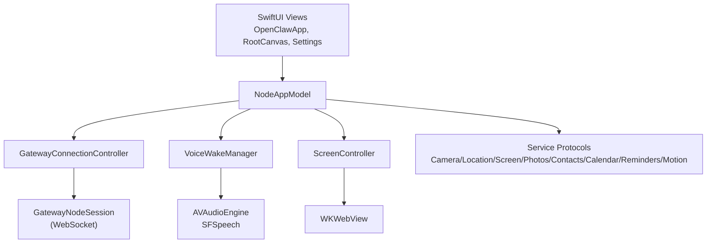
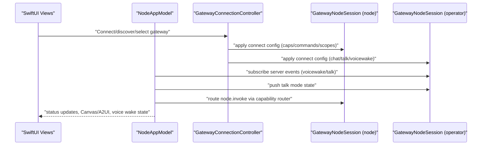
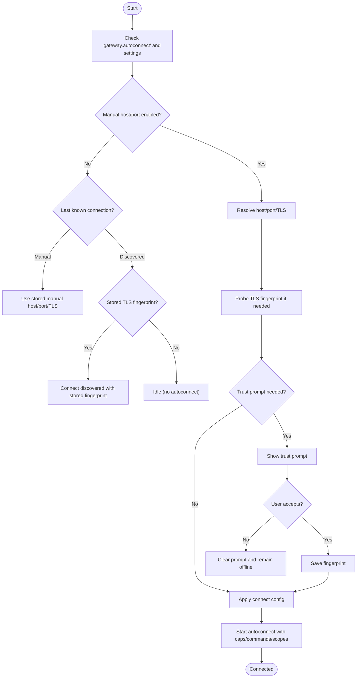
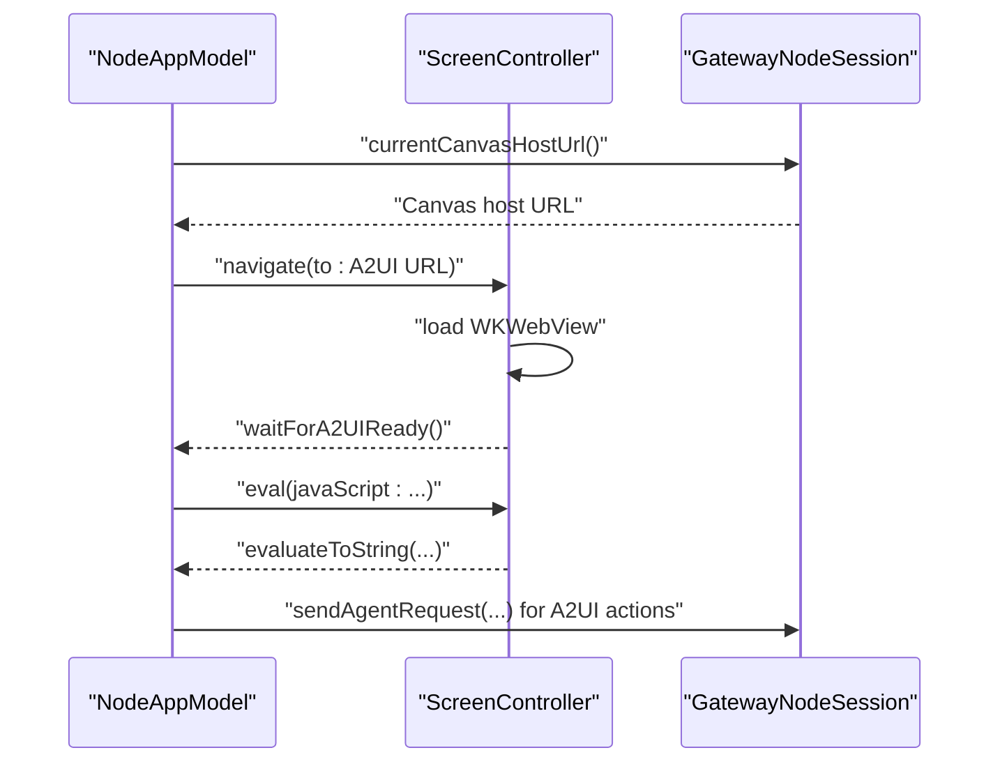
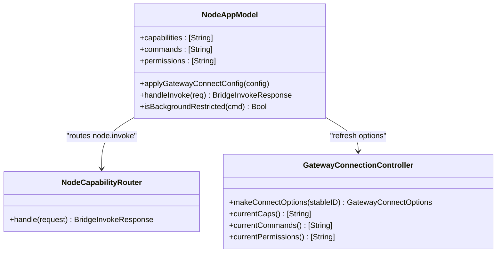
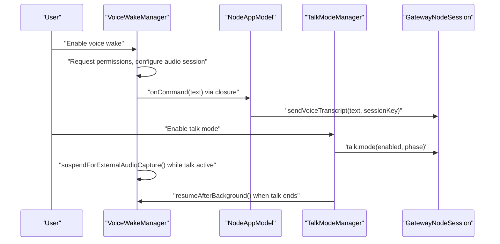
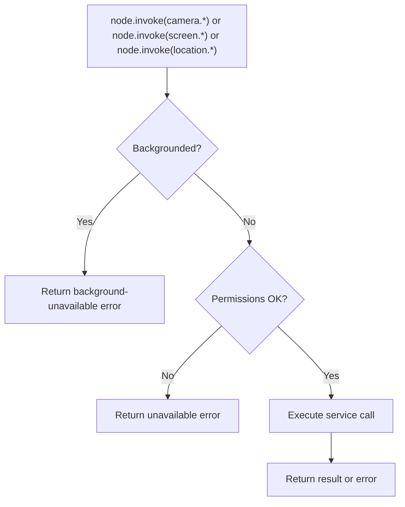
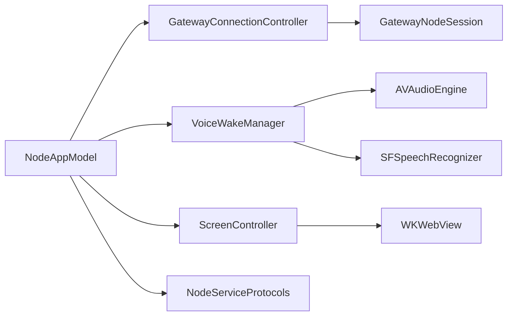

# iOS Application

<cite>
**Referenced Files in This Document**
- [README.md](file://apps/ios/README.md)
- [OpenClawApp.swift](file://apps/ios/Sources/OpenClawApp.swift)
- [NodeAppModel.swift](file://apps/ios/Sources/Model/NodeAppModel.swift)
- [NodeAppModel+Canvas.swift](file://apps/ios/Sources/Model/NodeAppModel+Canvas.swift)
- [NodeCapabilityRouter.swift](file://apps/ios/Sources/Capabilities/NodeCapabilityRouter.swift)
- [GatewayConnectionController.swift](file://apps/ios/Sources/Gateway/GatewayConnectionController.swift)
- [ScreenController.swift](file://apps/ios/Sources/Screen/ScreenController.swift)
- [VoiceWakeManager.swift](file://apps/ios/Sources/Voice/VoiceWakeManager.swift)
- [NodeServiceProtocols.swift](file://apps/ios/Sources/Services/NodeServiceProtocols.swift)
- [VoiceWakeWordsSettingsView.swift](file://apps/ios/Sources/Settings/VoiceWakeWordsSettingsView.swift)
</cite>

## Table of Contents
1. [Introduction](#introduction)
2. [Project Structure](#project-structure)
3. [Core Components](#core-components)
4. [Architecture Overview](#architecture-overview)
5. [Detailed Component Analysis](#detailed-component-analysis)
6. [Dependency Analysis](#dependency-analysis)
7. [Performance Considerations](#performance-considerations)
8. [Troubleshooting Guide](#troubleshooting-guide)
9. [Conclusion](#conclusion)
10. [Appendices](#appendices)

## Introduction
This document describes the iOS application that operates as a node within the OpenClaw system. The app establishes a secure WebSocket connection to a Gateway, renders interactive Canvas UIs via WKWebView, captures camera images/clips, records screen content, accesses location services, supports talk mode voice interactions, and integrates voice wake functionality. It also documents the pairing and approval workflow, capability advertisement, permission management, and setup across different network environments (Bonjour LAN, Tailnet via DNS-SD, manual host/port). Practical examples are included for Canvas navigation, JavaScript evaluation, and snapshot capture, along with platform-specific considerations, security implications, and performance optimization strategies.

## Project Structure
The iOS app is organized around a SwiftUI-based UI, a central NodeAppModel orchestrating connections and capabilities, and modular services for camera, screen recording, location, and voice. Gateway discovery and connection logic is encapsulated in GatewayConnectionController, while VoiceWakeManager handles wake word detection. Canvas integration leverages ScreenController and NodeAppModel extensions for A2UI and host resolution.

**Diagram sources**
- [OpenClawApp.swift](file://apps/ios/Sources/OpenClawApp.swift#L492-L526)
- [NodeAppModel.swift](file://apps/ios/Sources/Model/NodeAppModel.swift#L98-L176)
- [GatewayConnectionController.swift](file://apps/ios/Sources/Gateway/GatewayConnectionController.swift#L22-L58)
- [ScreenController.swift](file://apps/ios/Sources/Screen/ScreenController.swift#L8-L26)
- [VoiceWakeManager.swift](file://apps/ios/Sources/Voice/VoiceWakeManager.swift#L83-L120)
- [NodeServiceProtocols.swift](file://apps/ios/Sources/Services/NodeServiceProtocols.swift#L9-L108)

**Section sources**
- [README.md](file://apps/ios/README.md#L1-L142)
- [OpenClawApp.swift](file://apps/ios/Sources/OpenClawApp.swift#L492-L526)

## Core Components
- NodeAppModel: Central orchestration of gateway connections, capability routing, background behavior, voice wake and talk mode synchronization, Canvas/A2UI integration, and permission gating.
- GatewayConnectionController: Discovers Gateways (Bonjour/DNS-SD), resolves endpoints, manages TLS trust prompts, and applies connect options including capabilities and permissions.
- ScreenController: Manages WKWebView-based Canvas presentation, JavaScript evaluation, and screenshot capture.
- VoiceWakeManager: Microphone capture pipeline, speech recognition, wake word detection, and integration with talk mode.
- NodeServiceProtocols: Defines service interfaces for camera, screen recording, location, device status, photos, contacts, calendar, reminders, motion, and watch messaging.
- NodeCapabilityRouter: Routes node.invoke commands to appropriate handlers based on advertised capabilities.

**Section sources**
- [NodeAppModel.swift](file://apps/ios/Sources/Model/NodeAppModel.swift#L98-L176)
- [GatewayConnectionController.swift](file://apps/ios/Sources/Gateway/GatewayConnectionController.swift#L22-L58)
- [ScreenController.swift](file://apps/ios/Sources/Screen/ScreenController.swift#L8-L26)
- [VoiceWakeManager.swift](file://apps/ios/Sources/Voice/VoiceWakeManager.swift#L83-L120)
- [NodeServiceProtocols.swift](file://apps/ios/Sources/Services/NodeServiceProtocols.swift#L9-L108)
- [NodeCapabilityRouter.swift](file://apps/ios/Sources/Capabilities/NodeCapabilityRouter.swift#L4-L25)

## Architecture Overview
The iOS node maintains two primary Gateway sessions:
- Node session: role=node with capabilities and commands for device operations.
- Operator session: role=operator for chat, talk, voicewake configuration, and server event subscription.

**Diagram sources**
- [NodeAppModel.swift](file://apps/ios/Sources/Model/NodeAppModel.swift#L98-L176)
- [GatewayConnectionController.swift](file://apps/ios/Sources/Gateway/GatewayConnectionController.swift#L446-L470)
- [NodeCapabilityRouter.swift](file://apps/ios/Sources/Capabilities/NodeCapabilityRouter.swift#L19-L24)

## Detailed Component Analysis

### Gateway Connectivity and Pairing Workflow
- Discovery: Uses Bonjour/DNS-SD to discover Gateways; discovery is paused in background and resumed on foreground.
- Trust: For LAN discovery, TLS is enforced; fingerprints are probed and presented for user approval. Stored fingerprints are reused for subsequent connections.
- Autoconnect: Based on user preferences and last-known connections; only trusted Gateways are autoconnected.
- Pairing: If pairing/auth is required, reconnect loops are paused to avoid churn; users approve pairing externally and reconnect.

**Diagram sources**
- [GatewayConnectionController.swift](file://apps/ios/Sources/Gateway/GatewayConnectionController.swift#L308-L429)
- [GatewayConnectionController.swift](file://apps/ios/Sources/Gateway/GatewayConnectionController.swift#L446-L470)
- [GatewayConnectionController.swift](file://apps/ios/Sources/Gateway/GatewayConnectionController.swift#L242-L278)

**Section sources**
- [GatewayConnectionController.swift](file://apps/ios/Sources/Gateway/GatewayConnectionController.swift#L308-L429)
- [GatewayConnectionController.swift](file://apps/ios/Sources/Gateway/GatewayConnectionController.swift#L446-L470)
- [GatewayConnectionController.swift](file://apps/ios/Sources/Gateway/GatewayConnectionController.swift#L242-L278)

### Canvas Rendering with WKWebView and A2UI
- ScreenController hosts a WKWebView, loads either a bundled scaffold or remote URLs, and exposes JavaScript evaluation and snapshot APIs.
- NodeAppModel resolves Canvas/A2UI host URLs from the Gateway and ensures readiness before interacting.
- A2UI action dispatch: user clicks in Canvas trigger actions that are formatted and sent to the Gateway as agent deep links.

**Diagram sources**
- [NodeAppModel+Canvas.swift](file://apps/ios/Sources/Model/NodeAppModel+Canvas.swift#L12-L34)
- [ScreenController.swift](file://apps/ios/Sources/Screen/ScreenController.swift#L97-L127)
- [NodeAppModel.swift](file://apps/ios/Sources/Model/NodeAppModel.swift#L222-L297)

**Section sources**
- [NodeAppModel+Canvas.swift](file://apps/ios/Sources/Model/NodeAppModel+Canvas.swift#L12-L34)
- [ScreenController.swift](file://apps/ios/Sources/Screen/ScreenController.swift#L97-L127)
- [NodeAppModel.swift](file://apps/ios/Sources/Model/NodeAppModel.swift#L222-L297)

### Capability Advertisement and Permission Management
- Capabilities are built from user settings and preferences (Canvas, Screen, Camera, Voice Wake).
- Commands are registered per capability; background restrictions apply to certain commands.
- Permissions are checked before invoking sensitive operations (camera, location).

**Diagram sources**
- [NodeAppModel.swift](file://apps/ios/Sources/Model/NodeAppModel.swift#L722-L773)
- [NodeCapabilityRouter.swift](file://apps/ios/Sources/Capabilities/NodeCapabilityRouter.swift#L19-L24)
- [GatewayConnectionController.swift](file://apps/ios/Sources/Gateway/GatewayConnectionController.swift#L732-L746)

**Section sources**
- [GatewayConnectionController.swift](file://apps/ios/Sources/Gateway/GatewayConnectionController.swift#L732-L746)
- [NodeAppModel.swift](file://apps/ios/Sources/Model/NodeAppModel.swift#L722-L773)

### Voice Wake and Talk Mode
- VoiceWakeManager: Sets up AVAudioEngine, installs audio taps, streams PCM to SFSpeech for wake word detection, and coordinates with talk mode to avoid microphone contention.
- TalkModeManager: Integrates with operator session to synchronize talk mode state and push updates.
- Settings: Users can configure wake words and reset to defaults; changes are persisted and synced to the Gateway.

**Diagram sources**
- [VoiceWakeManager.swift](file://apps/ios/Sources/Voice/VoiceWakeManager.swift#L137-L236)
- [NodeAppModel.swift](file://apps/ios/Sources/Model/NodeAppModel.swift#L187-L204)
- [VoiceWakeWordsSettingsView.swift](file://apps/ios/Sources/Settings/VoiceWakeWordsSettingsView.swift#L88-L97)

**Section sources**
- [VoiceWakeManager.swift](file://apps/ios/Sources/Voice/VoiceWakeManager.swift#L137-L236)
- [NodeAppModel.swift](file://apps/ios/Sources/Model/NodeAppModel.swift#L187-L204)
- [VoiceWakeWordsSettingsView.swift](file://apps/ios/Sources/Settings/VoiceWakeWordsSettingsView.swift#L88-L97)

### Camera Capture, Screen Recording, and Location Services
- Camera: Captures images and short clips; errors surface via HUD; requires Camera permission.
- Screen Recording: Records screen with optional audio and duration/fps controls.
- Location: Requests appropriate authorization (WhenInUse/Always), supports significant change monitoring and precise/current location retrieval.

**Diagram sources**
- [NodeAppModel.swift](file://apps/ios/Sources/Model/NodeAppModel.swift#L725-L741)
- [NodeAppModel.swift](file://apps/ios/Sources/Model/NodeAppModel.swift#L775-L800)
- [NodeServiceProtocols.swift](file://apps/ios/Sources/Services/NodeServiceProtocols.swift#L9-L70)

**Section sources**
- [NodeAppModel.swift](file://apps/ios/Sources/Model/NodeAppModel.swift#L725-L741)
- [NodeAppModel.swift](file://apps/ios/Sources/Model/NodeAppModel.swift#L775-L800)
- [NodeServiceProtocols.swift](file://apps/ios/Sources/Services/NodeServiceProtocols.swift#L9-L70)

### Setup Instructions Across Network Environments
- Bonjour LAN:
  - Enable discovery; trust prompts appear for first-time TLS fingerprints; subsequent connections reuse stored fingerprints.
- Tailnet via DNS-SD:
  - Gateways published via DNS-SD are resolved; TLS is enforced; Tailnet hostnames may force TLS automatically.
- Manual host/port:
  - Configure host, port, and TLS; if TLS is required or enforced, a fingerprint probe occurs and trust is stored.

**Section sources**
- [GatewayConnectionController.swift](file://apps/ios/Sources/Gateway/GatewayConnectionController.swift#L516-L523)
- [GatewayConnectionController.swift](file://apps/ios/Sources/Gateway/GatewayConnectionController.swift#L669-L703)
- [GatewayConnectionController.swift](file://apps/ios/Sources/Gateway/GatewayConnectionController.swift#L761-L771)

### Practical Examples
- Canvas navigation:
  - Resolve A2UI host URL and navigate to it; wait for readiness before interacting.
  - Example path: [NodeAppModel+Canvas.swift](file://apps/ios/Sources/Model/NodeAppModel+Canvas.swift#L52-L69)
- JavaScript evaluation:
  - Evaluate arbitrary JS in the Canvas context; useful for A2UI status updates or triggering actions.
  - Example path: [ScreenController.swift](file://apps/ios/Sources/Screen/ScreenController.swift#L120-L127)
- Snapshot capture:
  - Take PNG/JPEG snapshots with optional width scaling; returns base64-encoded data.
  - Example path: [ScreenController.swift](file://apps/ios/Sources/Screen/ScreenController.swift#L129-L160)

## Dependency Analysis
- Coupling:
  - NodeAppModel depends on Gateway sessions, VoiceWakeManager, TalkModeManager, ScreenController, and service protocols.
  - GatewayConnectionController depends on discovery, resolver, and TLS store; feeds connect options to NodeAppModel.
- Cohesion:
  - Each module encapsulates a distinct concern: UI orchestration (NodeAppModel), connection management (GatewayConnectionController), Canvas rendering (ScreenController), voice wake (VoiceWakeManager), and services (NodeServiceProtocols).
- External dependencies:
  - WebKit for Canvas rendering, AVFoundation for audio and camera, CoreLocation for location, Speech for wake word detection.

**Diagram sources**
- [NodeAppModel.swift](file://apps/ios/Sources/Model/NodeAppModel.swift#L98-L176)
- [GatewayConnectionController.swift](file://apps/ios/Sources/Gateway/GatewayConnectionController.swift#L22-L58)
- [ScreenController.swift](file://apps/ios/Sources/Screen/ScreenController.swift#L8-L26)
- [VoiceWakeManager.swift](file://apps/ios/Sources/Voice/VoiceWakeManager.swift#L83-L120)

**Section sources**
- [NodeAppModel.swift](file://apps/ios/Sources/Model/NodeAppModel.swift#L98-L176)
- [GatewayConnectionController.swift](file://apps/ios/Sources/Gateway/GatewayConnectionController.swift#L22-L58)
- [ScreenController.swift](file://apps/ios/Sources/Screen/ScreenController.swift#L8-L26)
- [VoiceWakeManager.swift](file://apps/ios/Sources/Voice/VoiceWakeManager.swift#L83-L120)

## Performance Considerations
- Background behavior:
  - Connections are gracefully managed on scene transitions; a background grace period prevents immediate reconnect churn.
  - Background restrictions limit certain commands to preserve responsiveness and battery life.
- Audio pipeline:
  - Voice wake uses minimal audio taps and defers recognition work to background tasks; talk mode suspends wake capture to avoid contention.
- Canvas rendering:
  - Snapshot operations are asynchronous and delegate to WKWebView; consider compression quality and width to balance fidelity and bandwidth.
- Health monitoring:
  - Periodic health checks detect stale connections and trigger reconnects; unauthorized role conditions disable monitoring to avoid unnecessary retries.

[No sources needed since this section provides general guidance]

## Troubleshooting Guide
- APNs registration:
  - Local builds register to sandbox; ensure push capability and provisioning match the selected team; failures log “APNs registration failed”.
- Discovery and trust:
  - If discovery is flaky, enable discovery debug logs in settings; review logs under Gateway settings.
  - For manual connections, ensure TLS is enabled or required for the host; Tailnet hostnames may force TLS.
- Permissions:
  - Camera and location require explicit permissions; voice wake requires microphone and speech recognition permissions.
- Background limitations:
  - Foreground-first behavior is recommended; background command availability is restricted by OS policies.
- Reconnect loops:
  - If pairing/auth errors occur, reconnect loops pause until corrected; approve pairing externally and reconnect.

**Section sources**
- [README.md](file://apps/ios/README.md#L53-L60)
- [README.md](file://apps/ios/README.md#L120-L142)
- [OpenClawApp.swift](file://apps/ios/Sources/OpenClawApp.swift#L72-L74)
- [GatewayConnectionController.swift](file://apps/ios/Sources/Gateway/GatewayConnectionController.swift#L60-L62)

## Conclusion
The iOS node integrates tightly with the OpenClaw Gateway to provide a secure, capability-rich interface for Canvas/A2UI, camera, screen recording, location, voice wake, and talk mode. Its architecture emphasizes clear separation of concerns, robust permission handling, and resilient connection management across diverse network environments. Following the setup and troubleshooting guidance herein will help operators deploy and maintain reliable node connectivity while respecting platform constraints and user privacy.

## Appendices

### Platform-Specific Considerations
- iOS Simulator:
  - Voice wake is not supported on simulator due to audio stack unreliability.
- Background audio:
  - Talk mode suppresses voice wake to avoid microphone contention; background audio capture temporarily suspends wake detection.
- Push notifications:
  - APNs registration is gated by provisioning and push capability; misconfiguration leads to registration failures.

**Section sources**
- [VoiceWakeManager.swift](file://apps/ios/Sources/Voice/VoiceWakeManager.swift#L169-L177)
- [OpenClawApp.swift](file://apps/ios/Sources/OpenClawApp.swift#L72-L74)