# macOS Application

<cite>
**Referenced Files in This Document**
- [apps/macos/README.md](file://apps/macos/README.md)
- [apps/macos/Package.swift](file://apps/macos/Package.swift)
- [apps/macos/Sources/OpenClaw/AppState.swift](file://apps/macos/Sources/OpenClaw/AppState.swift)
- [apps/macos/Sources/OpenClaw/CanvasManager.swift](file://apps/macos/Sources/OpenClaw/CanvasManager.swift)
- [apps/macos/Sources/OpenClaw/CanvasWindow.swift](file://apps/macos/Sources/OpenClaw/CanvasWindow.swift)
- [apps/macos/Sources/OpenClaw/WebChatManager.swift](file://apps/macos/Sources/OpenClaw/WebChatManager.swift)
- [apps/macos/Sources/OpenClaw/PermissionManager.swift](file://apps/macos/Sources/OpenClaw/PermissionManager.swift)
- [apps/macos/Sources/OpenClaw/VoiceWakeRuntime.swift](file://apps/macos/Sources/OpenClaw/VoiceWakeRuntime.swift)
- [apps/macos/Sources/OpenClaw/TalkModeController.swift](file://apps/macos/Sources/OpenClaw/TalkModeController.swift)
- [apps/macos/Sources/OpenClaw/GatewayConnection.swift](file://apps/macos/Sources/OpenClaw/GatewayConnection.swift)
- [apps/macos/Sources/OpenClawDiscovery/GatewayDiscoveryModel.swift](file://apps/macos/Sources/OpenClawDiscovery/GatewayDiscoveryModel.swift)
</cite>

## Table of Contents
1. [Introduction](#introduction)
2. [Project Structure](#project-structure)
3. [Core Components](#core-components)
4. [Architecture Overview](#architecture-overview)
5. [Detailed Component Analysis](#detailed-component-analysis)
6. [Dependency Analysis](#dependency-analysis)
7. [Performance Considerations](#performance-considerations)
8. [Troubleshooting Guide](#troubleshooting-guide)
9. [Conclusion](#conclusion)
10. [Appendices](#appendices)

## Introduction
This document describes the macOS companion application within the OpenClaw ecosystem. It explains how the macOS app integrates with the gateway server, manages devices and pairing requests, and exposes macOS-specific capabilities such as system notifications, menu bar integration, voice wake, talk mode, Canvas UI, and system permissions. It also covers setup, configuration, security, sandboxing, and practical usage patterns.

## Project Structure
The macOS app is a Swift Package that produces:
- An executable macOS app (menu bar + background services)
- A library for inter-process communication (IPC)
- A discovery module for locating gateways on the network
- A CLI tool for macOS-specific tasks

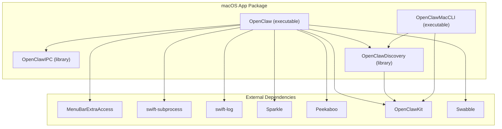

**Diagram sources**
- [apps/macos/Package.swift](file://apps/macos/Package.swift#L6-L92)

**Section sources**
- [apps/macos/Package.swift](file://apps/macos/Package.swift#L1-L93)

## Core Components
- Application state and configuration: central state machine for UI, voice wake, talk mode, gateway connection mode, and preferences.
- Gateway connection: typed RPC over WebSocket to the OpenClaw gateway with automatic recovery and retries.
- Discovery: Bonjour and fallback mechanisms to discover nearby or remote gateways.
- Voice wake: background speech recognition pipeline with overlay UI and optional chimes.
- Talk mode: live microphone overlay with gateway-driven state.
- Canvas: native macOS panel hosting a local web UI (A2UI) with auto-navigation from gateway snapshots.
- Permissions: unified manager for notifications, accessibility, screen recording, microphone, camera, location, AppleScript, and speech recognition.
- Packaging and signing: scripts and environment flags for development and distribution.

**Section sources**
- [apps/macos/Sources/OpenClaw/AppState.swift](file://apps/macos/Sources/OpenClaw/AppState.swift#L1-L846)
- [apps/macos/Sources/OpenClaw/GatewayConnection.swift](file://apps/macos/Sources/OpenClaw/GatewayConnection.swift#L1-L801)
- [apps/macos/Sources/OpenClawDiscovery/GatewayDiscoveryModel.swift](file://apps/macos/Sources/OpenClawDiscovery/GatewayDiscoveryModel.swift#L1-L772)
- [apps/macos/Sources/OpenClaw/VoiceWakeRuntime.swift](file://apps/macos/Sources/OpenClaw/VoiceWakeRuntime.swift#L1-L777)
- [apps/macos/Sources/OpenClaw/TalkModeController.swift](file://apps/macos/Sources/OpenClaw/TalkModeController.swift#L1-L70)
- [apps/macos/Sources/OpenClaw/CanvasManager.swift](file://apps/macos/Sources/OpenClaw/CanvasManager.swift#L1-L343)
- [apps/macos/Sources/OpenClaw/PermissionManager.swift](file://apps/macos/Sources/OpenClaw/PermissionManager.swift#L1-L483)

## Architecture Overview
The macOS app orchestrates user-facing features and system integrations around a single, shared gateway connection. It discovers gateways, manages voice wake and talk mode, hosts a Canvas panel, and coordinates permissions and updates.

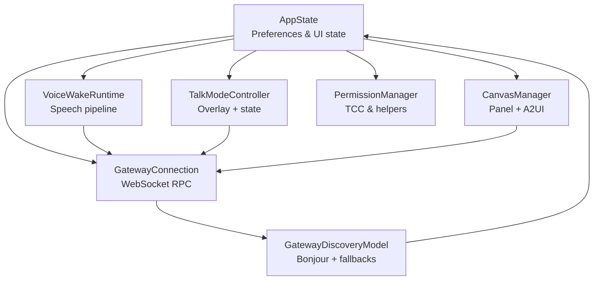

**Diagram sources**
- [apps/macos/Sources/OpenClaw/AppState.swift](file://apps/macos/Sources/OpenClaw/AppState.swift#L1-L846)
- [apps/macos/Sources/OpenClaw/GatewayConnection.swift](file://apps/macos/Sources/OpenClaw/GatewayConnection.swift#L1-L801)
- [apps/macos/Sources/OpenClawDiscovery/GatewayDiscoveryModel.swift](file://apps/macos/Sources/OpenClawDiscovery/GatewayDiscoveryModel.swift#L1-L772)
- [apps/macos/Sources/OpenClaw/VoiceWakeRuntime.swift](file://apps/macos/Sources/OpenClaw/VoiceWakeRuntime.swift#L1-L777)
- [apps/macos/Sources/OpenClaw/TalkModeController.swift](file://apps/macos/Sources/OpenClaw/TalkModeController.swift#L1-L70)
- [apps/macos/Sources/OpenClaw/CanvasManager.swift](file://apps/macos/Sources/OpenClaw/CanvasManager.swift#L1-L343)
- [apps/macos/Sources/OpenClaw/PermissionManager.swift](file://apps/macos/Sources/OpenClaw/PermissionManager.swift#L1-L483)

## Detailed Component Analysis

### Application State and Preferences
AppState encapsulates user preferences, connection mode, voice wake settings, talk mode, Canvas visibility, and gateway configuration synchronization. It persists settings to UserDefaults, applies remote configuration from disk, and coordinates with background services.

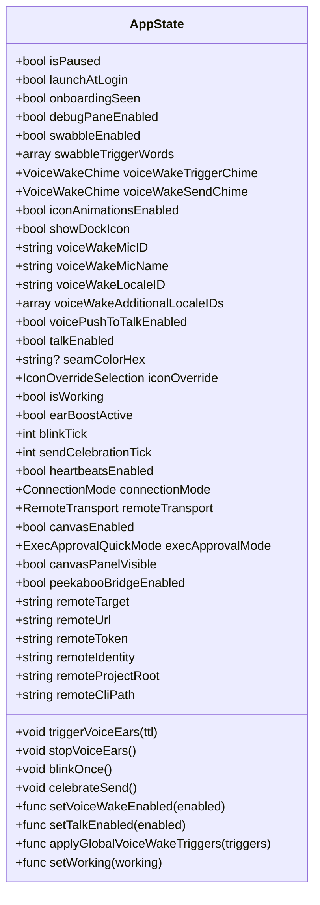

**Diagram sources**
- [apps/macos/Sources/OpenClaw/AppState.swift](file://apps/macos/Sources/OpenClaw/AppState.swift#L1-L846)

**Section sources**
- [apps/macos/Sources/OpenClaw/AppState.swift](file://apps/macos/Sources/OpenClaw/AppState.swift#L1-L846)

### Gateway Connection and RPC
GatewayConnection provides a typed interface over a single WebSocket channel to the gateway. It supports:
- Heartbeats enablement
- Agent invocation and chat operations
- Skills management
- Sessions preview and chat history
- Voice wake triggers
- Node/device pairing approvals
- Cron job management
- Automatic recovery for local and remote modes

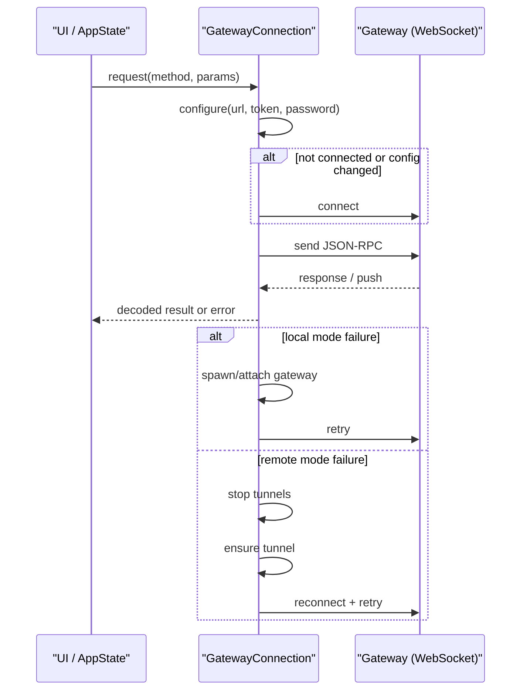

**Diagram sources**
- [apps/macos/Sources/OpenClaw/GatewayConnection.swift](file://apps/macos/Sources/OpenClaw/GatewayConnection.swift#L1-L801)

**Section sources**
- [apps/macos/Sources/OpenClaw/GatewayConnection.swift](file://apps/macos/Sources/OpenClaw/GatewayConnection.swift#L1-L801)

### Gateway Discovery
GatewayDiscoveryModel scans for gateways using Bonjour domains, resolves service endpoints, merges TXT records, and provides fallbacks for wide-area and Tailscale Serve setups. It deduplicates results and marks local vs remote instances.

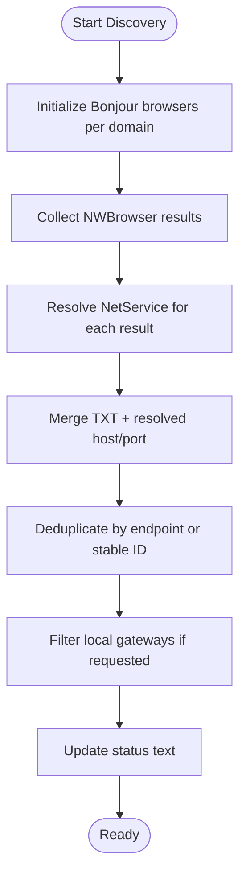

**Diagram sources**
- [apps/macos/Sources/OpenClawDiscovery/GatewayDiscoveryModel.swift](file://apps/macos/Sources/OpenClawDiscovery/GatewayDiscoveryModel.swift#L1-L772)

**Section sources**
- [apps/macos/Sources/OpenClawDiscovery/GatewayDiscoveryModel.swift](file://apps/macos/Sources/OpenClawDiscovery/GatewayDiscoveryModel.swift#L1-L772)

### Voice Wake Runtime
VoiceWakeRuntime sets up speech recognition, monitors audio RMS, detects wake words, and drives overlays and forwarding. It handles pre-detection silence fallbacks, trigger-only pauses, and cooldowns.

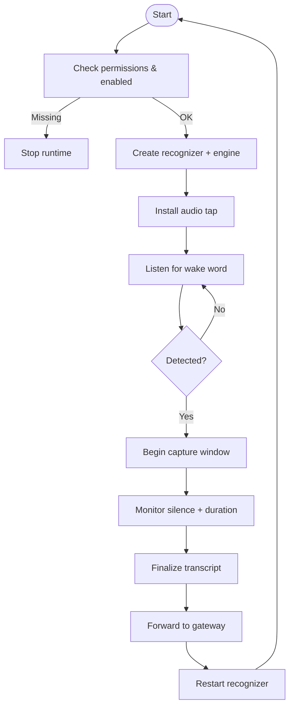

**Diagram sources**
- [apps/macos/Sources/OpenClaw/VoiceWakeRuntime.swift](file://apps/macos/Sources/OpenClaw/VoiceWakeRuntime.swift#L1-L777)

**Section sources**
- [apps/macos/Sources/OpenClaw/VoiceWakeRuntime.swift](file://apps/macos/Sources/OpenClaw/VoiceWakeRuntime.swift#L1-L777)

### Talk Mode Controller
TalkModeController manages the microphone overlay and communicates talk mode state to the gateway, including phase and pause toggles.

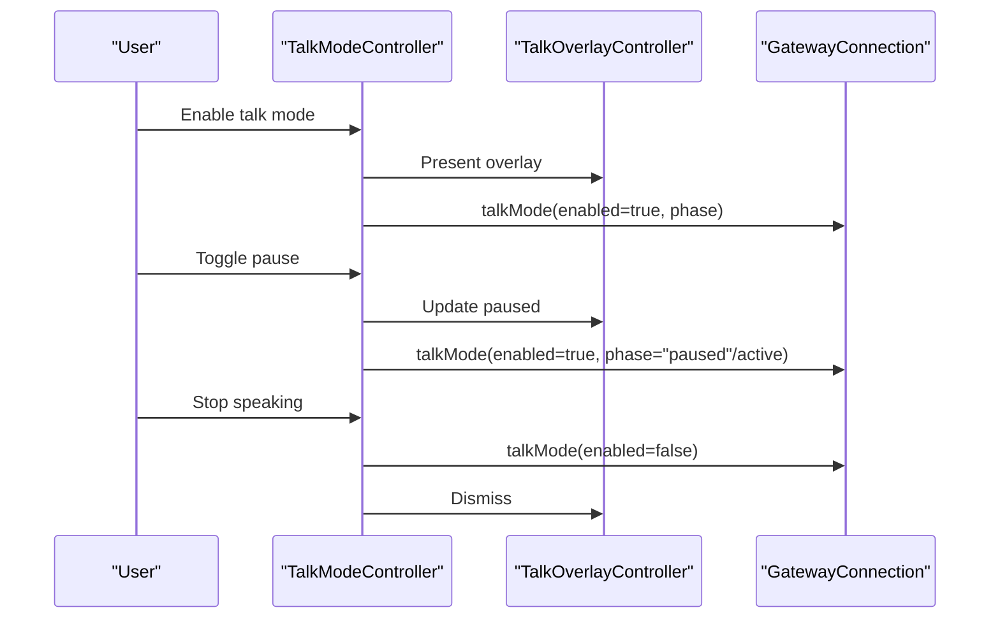

**Diagram sources**
- [apps/macos/Sources/OpenClaw/TalkModeController.swift](file://apps/macos/Sources/OpenClaw/TalkModeController.swift#L1-L70)
- [apps/macos/Sources/OpenClaw/GatewayConnection.swift](file://apps/macos/Sources/OpenClaw/GatewayConnection.swift#L673-L677)

**Section sources**
- [apps/macos/Sources/OpenClaw/TalkModeController.swift](file://apps/macos/Sources/OpenClaw/TalkModeController.swift#L1-L70)

### Canvas Manager and Panel
CanvasManager controls a native macOS panel that hosts a local web UI (A2UI) and auto-navigates to the gateway’s Canvas host URL. It supports anchoring to mouse or a custom anchor provider, placement preferences, and snapshotting.

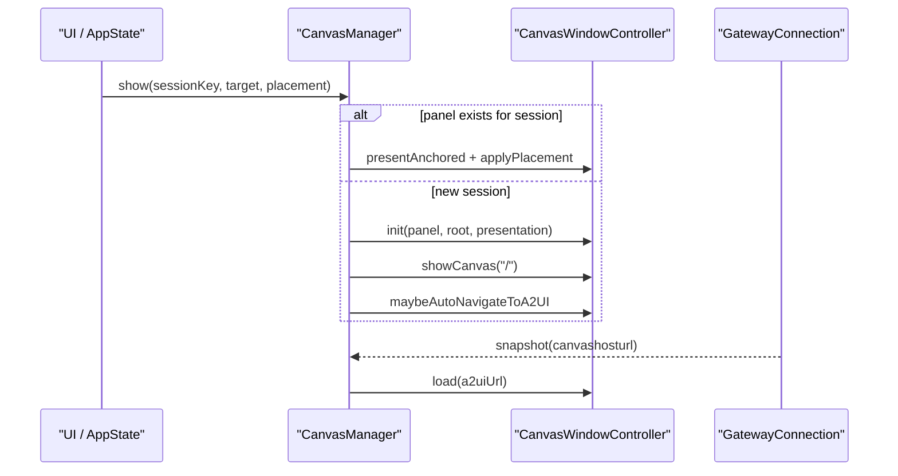

**Diagram sources**
- [apps/macos/Sources/OpenClaw/CanvasManager.swift](file://apps/macos/Sources/OpenClaw/CanvasManager.swift#L1-L343)
- [apps/macos/Sources/OpenClaw/GatewayConnection.swift](file://apps/macos/Sources/OpenClaw/GatewayConnection.swift#L312-L316)

**Section sources**
- [apps/macos/Sources/OpenClaw/CanvasManager.swift](file://apps/macos/Sources/OpenClaw/CanvasManager.swift#L1-L343)
- [apps/macos/Sources/OpenClaw/CanvasWindow.swift](file://apps/macos/Sources/OpenClaw/CanvasWindow.swift#L1-L32)

### Permissions and System Integrations
PermissionManager centralizes checks and requests for:
- Notifications
- Accessibility
- Screen Recording
- Microphone
- Camera
- Location
- AppleScript
- Speech Recognition

It also provides helpers to open system settings panes and a monitor to periodically refresh statuses.

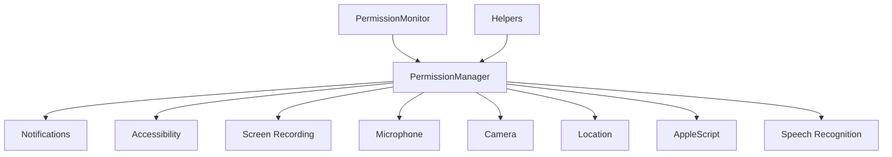

**Diagram sources**
- [apps/macos/Sources/OpenClaw/PermissionManager.swift](file://apps/macos/Sources/OpenClaw/PermissionManager.swift#L1-L483)

**Section sources**
- [apps/macos/Sources/OpenClaw/PermissionManager.swift](file://apps/macos/Sources/OpenClaw/PermissionManager.swift#L1-L483)

### Web Chat Manager
WebChatManager provides a window or anchored panel for the gateway’s web chat UI, caching the preferred session key and managing visibility.

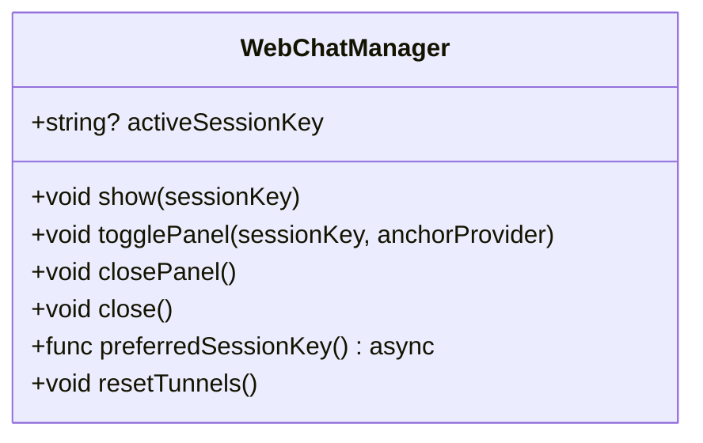

**Diagram sources**
- [apps/macos/Sources/OpenClaw/WebChatManager.swift](file://apps/macos/Sources/OpenClaw/WebChatManager.swift#L1-L122)

**Section sources**
- [apps/macos/Sources/OpenClaw/WebChatManager.swift](file://apps/macos/Sources/OpenClaw/WebChatManager.swift#L1-L122)

## Dependency Analysis
The macOS app depends on external frameworks for UI, networking, logging, updates, and bridging to system services. Discovery relies on OpenClawKit for Bonjour and TXT parsing, and the app integrates with Sparkle for updates.

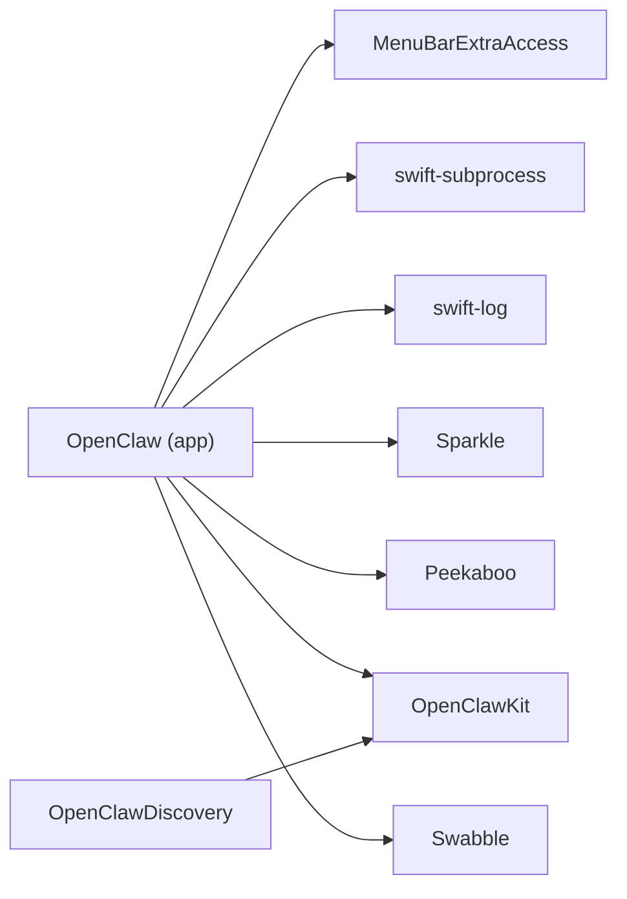

**Diagram sources**
- [apps/macos/Package.swift](file://apps/macos/Package.swift#L17-L56)

**Section sources**
- [apps/macos/Package.swift](file://apps/macos/Package.swift#L1-L93)

## Performance Considerations
- Voice wake runtime defers engine initialization until needed to avoid grabbing audio resources at startup.
- Canvas auto-navigation avoids unnecessary loads by comparing previous targets.
- GatewayConnection retries with backoff and falls back to tunnels or local gateway spawning to minimize downtime.
- Permission monitoring batches checks to reduce overhead.

[No sources needed since this section provides general guidance]

## Troubleshooting Guide
Common issues and remedies:
- Gateway not reachable (local/remote): The app attempts to spawn/attach a local gateway or establish tunnels for remote connections automatically.
- Voice wake not triggering: Verify microphone and speech recognition permissions; ensure wake words are set and recognized.
- Canvas panel not appearing: Confirm Canvas is enabled in preferences and that the gateway snapshot includes a Canvas host URL.
- Talk mode overlay not visible: Ensure talk mode is enabled and overlay is presented; check gateway talk mode state.
- System permission prompts: Use helper URLs to open system settings panes for Notifications, Microphone, Camera, Location, and Accessibility.

**Section sources**
- [apps/macos/Sources/OpenClaw/GatewayConnection.swift](file://apps/macos/Sources/OpenClaw/GatewayConnection.swift#L179-L250)
- [apps/macos/Sources/OpenClaw/VoiceWakeRuntime.swift](file://apps/macos/Sources/OpenClaw/VoiceWakeRuntime.swift#L141-L233)
- [apps/macos/Sources/OpenClaw/CanvasManager.swift](file://apps/macos/Sources/OpenClaw/CanvasManager.swift#L142-L200)
- [apps/macos/Sources/OpenClaw/PermissionManager.swift](file://apps/macos/Sources/OpenClaw/PermissionManager.swift#L230-L264)

## Conclusion
The macOS companion app provides a cohesive interface to the OpenClaw gateway with robust discovery, secure voice wake and talk mode, a native Canvas panel, and comprehensive system permission handling. Its architecture emphasizes reliability through automatic recovery, modular components, and careful resource management.

[No sources needed since this section summarizes without analyzing specific files]

## Appendices

### Setup and Packaging
- Development run and packaging scripts are provided for quick iteration and distribution.
- Signing behavior supports multiple identities and offers options for ad-hoc signing and library validation bypass for development.

**Section sources**
- [apps/macos/README.md](file://apps/macos/README.md#L1-L65)

### Practical Usage Examples
- Pairing and approvals: Use gateway RPC methods for node and device pairing approvals.
- Gateway management: Switch between local and remote modes; adjust SSH target and token; enable/disable heartbeats.
- Voice wake and talk mode: Toggle features in preferences; verify permissions; observe overlay feedback.
- Canvas and web chat: Show panels, auto-navigation to A2UI, and manage visibility.

**Section sources**
- [apps/macos/Sources/OpenClaw/GatewayConnection.swift](file://apps/macos/Sources/OpenClaw/GatewayConnection.swift#L698-L728)
- [apps/macos/Sources/OpenClaw/AppState.swift](file://apps/macos/Sources/OpenClaw/AppState.swift#L168-L240)
- [apps/macos/Sources/OpenClaw/VoiceWakeRuntime.swift](file://apps/macos/Sources/OpenClaw/VoiceWakeRuntime.swift#L95-L139)
- [apps/macos/Sources/OpenClaw/TalkModeController.swift](file://apps/macos/Sources/OpenClaw/TalkModeController.swift#L13-L32)
- [apps/macos/Sources/OpenClaw/CanvasManager.swift](file://apps/macos/Sources/OpenClaw/CanvasManager.swift#L32-L114)
- [apps/macos/Sources/OpenClaw/WebChatManager.swift](file://apps/macos/Sources/OpenClaw/WebChatManager.swift#L41-L90)

### Security and Sandboxing
- Permissions: Comprehensive TCC checks and interactive prompts for sensitive capabilities.
- Updates: Sparkle integration for secure updates.
- Signing and validation: Scripts enforce Team ID consistency and offer controlled library validation bypass for development.

**Section sources**
- [apps/macos/Sources/OpenClaw/PermissionManager.swift](file://apps/macos/Sources/OpenClaw/PermissionManager.swift#L1-L483)
- [apps/macos/README.md](file://apps/macos/README.md#L25-L65)