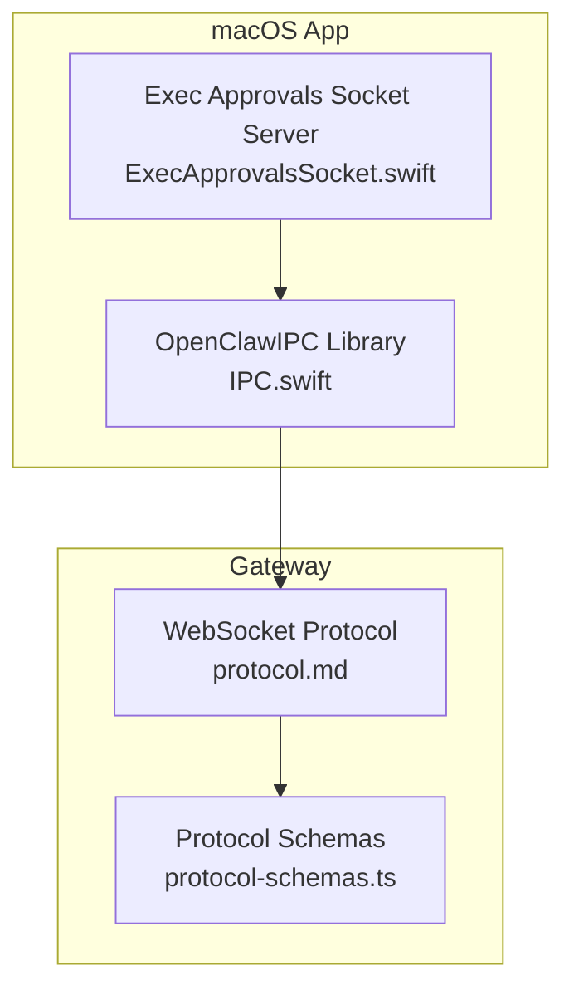
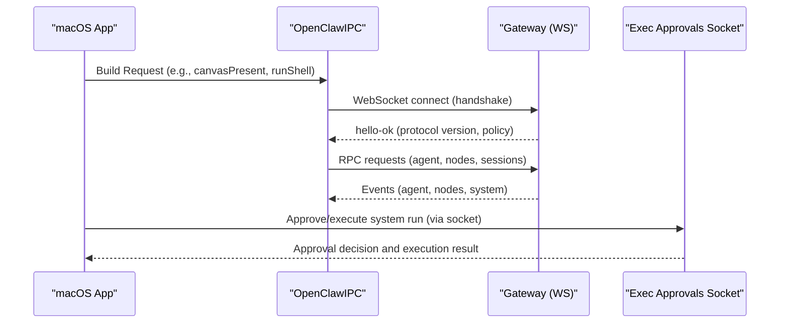
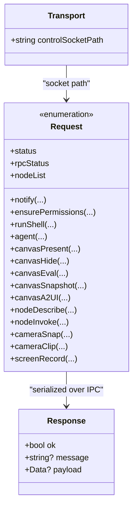
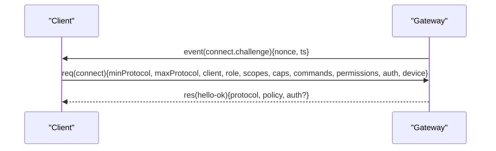
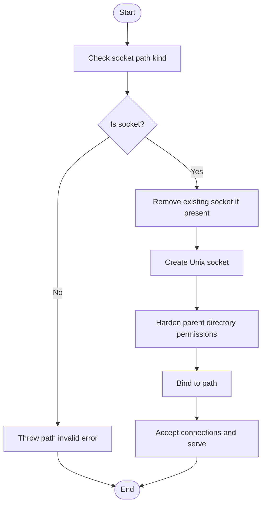
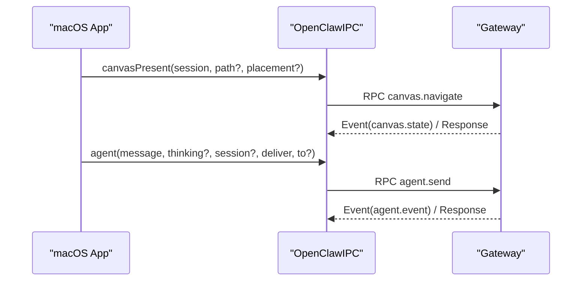
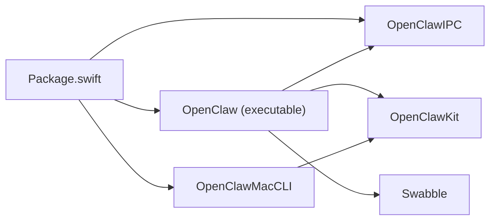

# Desktop Application IPC

<cite>
**Referenced Files in This Document**
- [IPC.swift](file://apps/macos/Sources/OpenClawIPC/IPC.swift)
- [Package.swift](file://apps/macos/Package.swift)
- [protocol.md](file://docs/gateway/protocol.md)
- [protocol-schemas.ts](file://src/gateway/protocol/schema/protocol-schemas.ts)
- [ExecApprovalsSocket.swift](file://apps/macos/Sources/OpenClaw/ExecApprovalsSocket.swift)
- [ExecApprovalsSocketPathGuardTests.swift](file://apps/macos/Tests/OpenClawIPCTests/ExecApprovalsSocketPathGuardTests.swift)
</cite>

## Table of Contents
1. [Introduction](#introduction)
2. [Project Structure](#project-structure)
3. [Core Components](#core-components)
4. [Architecture Overview](#architecture-overview)
5. [Detailed Component Analysis](#detailed-component-analysis)
6. [Dependency Analysis](#dependency-analysis)
7. [Performance Considerations](#performance-considerations)
8. [Troubleshooting Guide](#troubleshooting-guide)
9. [Conclusion](#conclusion)
10. [Appendices](#appendices)

## Introduction
This document explains the inter-process communication (IPC) architecture between the macOS desktop application and backend services in OpenClaw. It focuses on the protocol implementation, message serialization, and negotiation mechanisms used for control and data exchange. It covers:
- Socket-based IPC for agent workspace and system capabilities
- WebSocket-based gateway protocol for control plane and node transport
- Message types, data structures, and framing
- Session management and real-time events
- Practical configuration, debugging, and monitoring guidance
- Security, authentication, and encryption considerations
- Relationship to system-level permissions and permission changes

## Project Structure
The macOS companion app exposes an IPC library and integrates with the gateway protocol. The IPC library defines the request/response contract and socket transport path. The gateway protocol defines the WebSocket-based control plane and node transport.

**Diagram sources**
- [IPC.swift:108-417](file://apps/macos/Sources/OpenClawIPC/IPC.swift#L108-L417)
- [protocol.md:10-268](file://docs/gateway/protocol.md#L10-L268)
- [protocol-schemas.ts:162-302](file://src/gateway/protocol/schema/protocol-schemas.ts#L162-L302)
- [ExecApprovalsSocket.swift:647-751](file://apps/macos/Sources/OpenClaw/ExecApprovalsSocket.swift#L647-L751)

**Section sources**
- [Package.swift:26-92](file://apps/macos/Package.swift#L26-L92)
- [IPC.swift:108-417](file://apps/macos/Sources/OpenClawIPC/IPC.swift#L108-L417)
- [protocol.md:10-268](file://docs/gateway/protocol.md#L10-L268)

## Core Components
- IPC Library (OpenClawIPC)
  - Defines capabilities, requests, and responses for the desktop app
  - Provides a Unix domain socket path for control communication
  - Supports canvas presentation, camera/screen capture, shell execution, and agent messaging
- Gateway WebSocket Protocol
  - Text frames with JSON payloads
  - Connect handshake with role/scope negotiation
  - Request/Response/Event framing
  - Authentication via token/device identity
- Exec Approvals Socket
  - Local Unix domain socket for secure exec approval prompts and host execution requests
  - Path hardening and guard logic to prevent unsafe socket paths

**Section sources**
- [IPC.swift:6-417](file://apps/macos/Sources/OpenClawIPC/IPC.swift#L6-L417)
- [protocol.md:17-268](file://docs/gateway/protocol.md#L17-L268)
- [ExecApprovalsSocket.swift:581-751](file://apps/macos/Sources/OpenClaw/ExecApprovalsSocket.swift#L581-L751)

## Architecture Overview
The macOS app communicates with backend services through two primary channels:
- Local Unix domain sockets for agent workspace and system capability operations
- WebSocket for the gateway control plane and node transport

**Diagram sources**
- [IPC.swift:108-417](file://apps/macos/Sources/OpenClawIPC/IPC.swift#L108-L417)
- [protocol.md:22-90](file://docs/gateway/protocol.md#L22-L90)
- [ExecApprovalsSocket.swift:647-751](file://apps/macos/Sources/OpenClaw/ExecApprovalsSocket.swift#L647-L751)

## Detailed Component Analysis

### IPC Library: Requests, Responses, and Transport
- Requests
  - Notifications, permission checks, shell execution, agent messaging, canvas operations, node introspection/invoke, camera/screen capture
  - Strongly typed via an enum with associated values and explicit Codable encoding/decoding
- Responses
  - Standardized shape with success flag, optional message, and optional binary payload
- Transport
  - Unix domain socket path under the user’s Application Support directory
  - Used for agent workspace and capability operations

**Diagram sources**
- [IPC.swift:108-417](file://apps/macos/Sources/OpenClawIPC/IPC.swift#L108-L417)

**Section sources**
- [IPC.swift:108-417](file://apps/macos/Sources/OpenClawIPC/IPC.swift#L108-L417)

### Gateway WebSocket Protocol: Frames, Negotiation, and Auth
- Transport and framing
  - WebSocket with text frames containing JSON
  - First frame must be a connect request
- Handshake
  - Pre-connect challenge with nonce and timestamp
  - Client sends role, scope, capabilities, commands, permissions, auth, locale, userAgent, and device identity
  - Gateway responds with hello-ok including negotiated protocol version and policy
- Methods and roles
  - Roles: operator (control plane) and node (capability host)
  - Scopes define operator capabilities
  - Nodes declare caps, commands, and permissions
- Versioning
  - PROTOCOL_VERSION is defined and enforced
  - Clients negotiate min/max protocol versions
- Authentication
  - Token-based or device token after pairing
  - Device identity and signed nonce required
  - Auth errors include guidance for recovery

**Diagram sources**
- [protocol.md:22-90](file://docs/gateway/protocol.md#L22-L90)

**Section sources**
- [protocol.md:17-268](file://docs/gateway/protocol.md#L17-L268)
- [protocol-schemas.ts:162-302](file://src/gateway/protocol/schema/protocol-schemas.ts#L162-L302)

### Exec Approvals Socket: Secure Local Channel
- Purpose
  - Handles exec approval prompts and executes system runs securely
- Security
  - Unix domain socket with hardened parent directory permissions
  - Guard logic validates socket path kinds and removes conflicting paths
  - Rejects non-socket paths to prevent hijacking
- Operation
  - Accepts incoming connections, authenticates token, and serves approval/exec requests

**Diagram sources**
- [ExecApprovalsSocket.swift:581-751](file://apps/macos/Sources/OpenClaw/ExecApprovalsSocket.swift#L581-L751)

**Section sources**
- [ExecApprovalsSocket.swift:581-751](file://apps/macos/Sources/OpenClaw/ExecApprovalsSocket.swift#L581-L751)
- [ExecApprovalsSocketPathGuardTests.swift:62-75](file://apps/macos/Tests/OpenClawIPCTests/ExecApprovalsSocketPathGuardTests.swift#L62-L75)

### Agent Workspace Communication and Session Management
- Canvas operations
  - Present, hide, evaluate JavaScript, take snapshots, and A2UI JSONL streaming
- Agent messaging
  - Send messages with optional thinking content, session targeting, and delivery preferences
- Node integration
  - List, describe, and invoke nodes with structured parameters
- Session lifecycle
  - Sessions are managed by the gateway; the desktop app interacts via RPC methods and events

**Diagram sources**
- [IPC.swift:108-136](file://apps/macos/Sources/OpenClawIPC/IPC.swift#L108-L136)
- [protocol.md:127-134](file://docs/gateway/protocol.md#L127-L134)

**Section sources**
- [IPC.swift:108-136](file://apps/macos/Sources/OpenClawIPC/IPC.swift#L108-L136)
- [protocol.md:127-134](file://docs/gateway/protocol.md#L127-L134)

## Dependency Analysis
- OpenClaw macOS package exposes:
  - OpenClawIPC library for IPC
  - OpenClaw executable integrating IPC, discovery, and UI
  - OpenClawMacCLI for command-line operations
- IPC depends on Swift concurrency features and integrates with:
  - OpenClawKit for protocol and UI
  - Swabble for speech/audio pipeline
  - Logging and Sparkle for updates

**Diagram sources**
- [Package.swift:26-92](file://apps/macos/Package.swift#L26-L92)

**Section sources**
- [Package.swift:26-92](file://apps/macos/Package.swift#L26-L92)

## Performance Considerations
- Prefer batched or coalesced canvas operations to reduce round trips
- Use appropriate timeouts for shell execution and avoid blocking the UI thread
- Minimize payload sizes for IPC responses (e.g., avoid large base64-encoded images when unnecessary)
- Leverage gateway events for real-time updates instead of polling

## Troubleshooting Guide
- IPC socket path issues
  - Verify the control socket path exists and is accessible under the user’s Application Support directory
  - Confirm the socket path kind is a Unix socket and not a symlink or directory
- Exec approvals socket problems
  - Ensure the parent directory has restrictive permissions and the socket path is valid
  - Remove stale sockets before binding
- Gateway connection failures
  - Validate protocol version negotiation matches the server’s PROTOCOL_VERSION
  - Confirm device identity and signed nonce are included in the connect request
  - Check authentication token/device token validity and rotation policies
- Monitoring
  - Subscribe to gateway events for agent/node state changes
  - Use gateway RPC methods to query system status and session snapshots

**Section sources**
- [ExecApprovalsSocket.swift:581-751](file://apps/macos/Sources/OpenClaw/ExecApprovalsSocket.swift#L581-L751)
- [ExecApprovalsSocketPathGuardTests.swift:62-75](file://apps/macos/Tests/OpenClawIPCTests/ExecApprovalsSocketPathGuardTests.swift#L62-L75)
- [protocol.md:191-268](file://docs/gateway/protocol.md#L191-L268)

## Conclusion
The macOS desktop application leverages a dual-channel IPC strategy: a local Unix domain socket for agent workspace and capability operations, and a WebSocket-based gateway protocol for control plane and node transport. The IPC library defines a robust request/response contract with strong typing and serialization. The gateway protocol ensures secure, versioned, and role-scoped communication with clear authentication and device identity requirements. Together, these components enable reliable, real-time collaboration between the desktop app and backend services while maintaining strong security boundaries.

## Appendices

### Protocol Negotiation Checklist
- Confirm PROTOCOL_VERSION alignment
- Verify min/max protocol range
- Ensure device identity and signed nonce are present
- Validate auth token/device token and rotation policies

**Section sources**
- [protocol.md:191-215](file://docs/gateway/protocol.md#L191-L215)
- [protocol-schemas.ts:301-302](file://src/gateway/protocol/schema/protocol-schemas.ts#L301-L302)