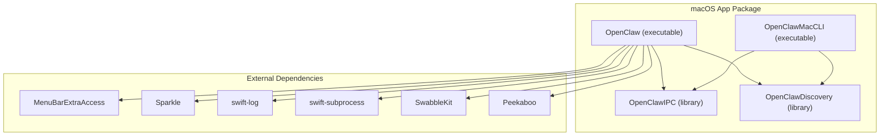
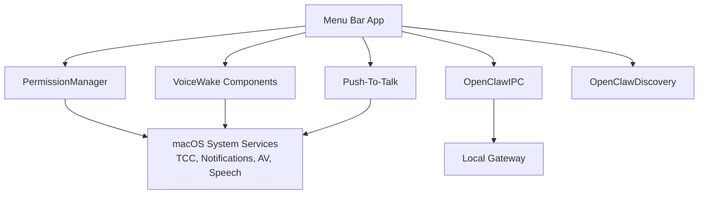
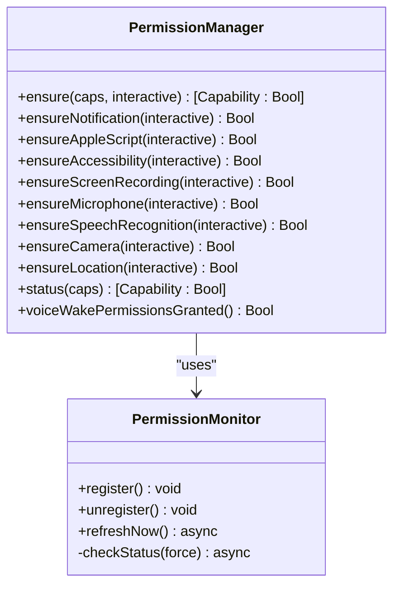
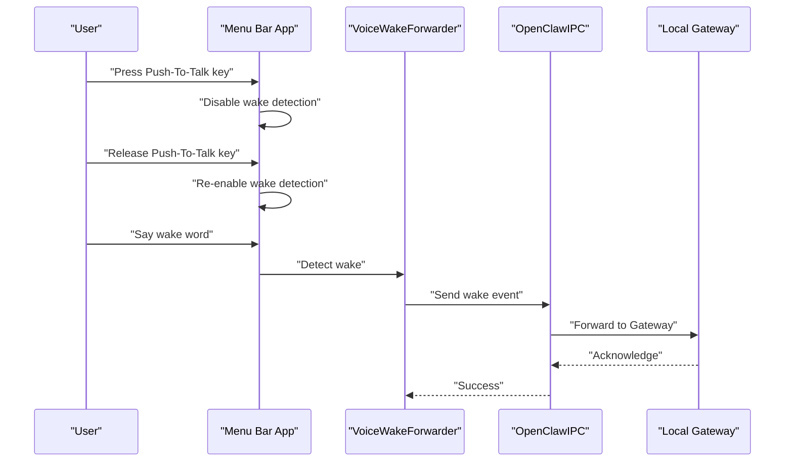
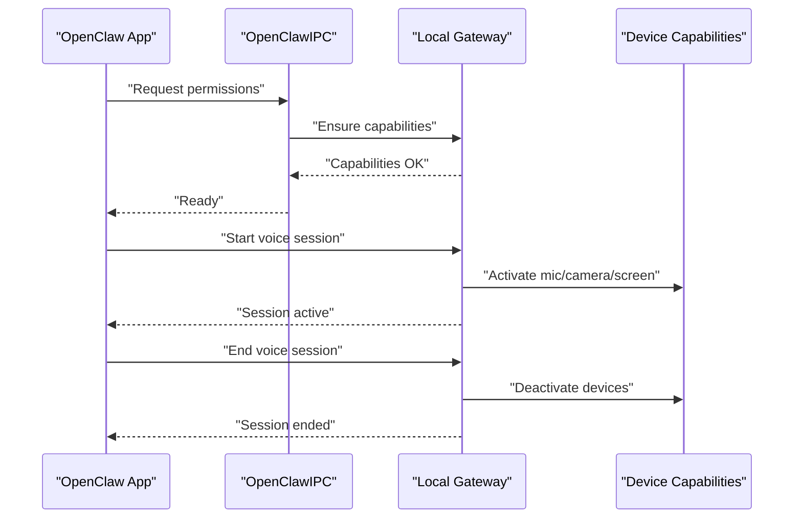
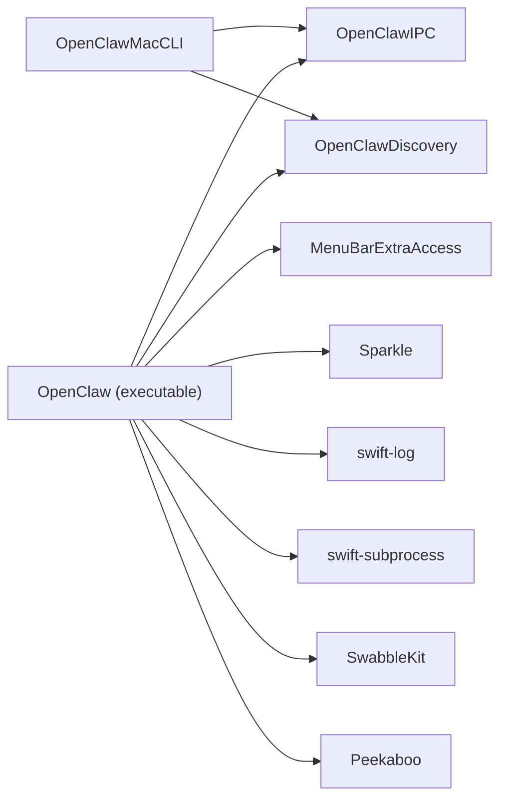

# Desktop Applications

<cite>
**Referenced Files in This Document**
- [apps/macos/README.md](file://apps/macos/README.md)
- [apps/macos/Package.swift](file://apps/macos/Package.swift)
- [apps/macos/Sources/OpenClaw/PermissionManager.swift](file://apps/macos/Sources/OpenClaw/PermissionManager.swift)
- [apps/macos/Sources/OpenClaw/PermissionMonitoringSupport.swift](file://apps/macos/Sources/OpenClaw/PermissionMonitoringSupport.swift)
- [apps/macos/Sources/OpenClaw/VoicePushToTalk.swift](file://apps/macos/Sources/OpenClaw/VoicePushToTalk.swift)
- [apps/macos/Sources/OpenClaw/VoiceWakeOverlay.swift](file://apps/macos/Sources/OpenClaw/VoiceWakeOverlay.swift)
- [apps/macos/Sources/OpenClaw/VoiceWakeForwarder.swift](file://apps/macos/Sources/OpenClaw/VoiceWakeForwarder.swift)
- [apps/macos/Sources/OpenClaw/VoiceWakeGlobalSettingsSync.swift](file://apps/macos/Sources/OpenClaw/VoiceWakeGlobalSettingsSync.swift)
- [apps/macos/Sources/OpenClaw/VoiceSessionCoordinator.swift](file://apps/macos/Sources/OpenClaw/VoiceSessionCoordinator.swift)
- [apps/macos/Tests/OpenClawIPCTests/PermissionManagerTests.swift](file://apps/macos/Tests/OpenClawIPCTests/PermissionManagerTests.swift)
- [apps/macos/Tests/OpenClawIPCTests/VoicePushToTalkTests.swift](file://apps/macos/Tests/OpenClawIPCTests/VoicePushToTalkTests.swift)
- [apps/macos/Tests/OpenClawIPCTests/VoiceWakeOverlayTests.swift](file://apps/macos/Tests/OpenClawIPCTests/VoiceWakeOverlayTests.swift)
- [apps/macos/Tests/OpenClawIPCTests/VoiceWakeForwarderTests.swift](file://apps/macos/Tests/OpenClawIPCTests/VoiceWakeForwarderTests.swift)
- [scripts/restart-mac.sh](file://scripts/restart-mac.sh)
- [scripts/package-mac-app.sh](file://scripts/package-mac-app.sh)
- [scripts/codesign-mac-app.sh](file://scripts/codesign-mac-app.sh)
- [scripts/notarize-mac-artifact.sh](file://scripts/notarize-mac-artifact.sh)
- [scripts/create-dmg.sh](file://scripts/create-dmg.sh)
- [scripts/generate-host-env-security-policy-swift.mjs](file://scripts/generate-host-env-security-policy-swift.mjs)
- [docs/platforms/macos.md](file://docs/platforms/macos.md)
- [docs/gateway/configuration.md](file://docs/gateway/configuration.md)
- [docs/gateway/protocol.md](file://docs/gateway/protocol.md)
- [docs/nodes/voicewake.md](file://docs/nodes/voicewake.md)
</cite>

## Table of Contents
1. [Introduction](#introduction)
2. [Project Structure](#project-structure)
3. [Core Components](#core-components)
4. [Architecture Overview](#architecture-overview)
5. [Detailed Component Analysis](#detailed-component-analysis)
6. [Dependency Analysis](#dependency-analysis)
7. [Performance Considerations](#performance-considerations)
8. [Troubleshooting Guide](#troubleshooting-guide)
9. [Conclusion](#conclusion)
10. [Appendices](#appendices)

## Introduction
This document explains the OpenClaw macOS desktop application and its related components. It focuses on the menu bar application architecture, system integration features, and native capabilities on macOS. It documents macOS-specific features such as Voice Wake functionality, push-to-talk overlay, system notifications, and permission management. It also covers integration with macOS TCC (Transparency, Consent, and Control) frameworks and system-level permissions, along with practical setup, configuration, and usage patterns. Finally, it outlines code signing, sandboxing, and entitlements considerations, the relationship between the desktop app and the Gateway protocol, and guidance for troubleshooting, performance optimization, and deployment.

## Project Structure
The macOS application is organized as a Swift Package with multiple targets:
- An executable menu bar app that integrates UI, IPC, discovery, and platform services.
- An IPC library for inter-process communication.
- A discovery module for local gateway detection.
- A CLI tool for macOS-specific tasks.
- Tests covering IPC, permissions, voice wake, and overlay functionality.

**Diagram sources**
- [apps/macos/Package.swift:26-92](file://apps/macos/Package.swift#L26-L92)

**Section sources**
- [apps/macos/Package.swift:1-93](file://apps/macos/Package.swift#L1-L93)

## Core Components
- PermissionManager: Centralized orchestration for macOS TCC permissions (notifications, accessibility, screen recording, microphone, camera, speech recognition, location, AppleScript).
- Voice Wake subsystem: Includes overlay rendering, global settings synchronization, forwarding to the Gateway, and push-to-talk behavior.
- IPC and Discovery: Inter-process communication and local gateway discovery for system integration.
- Packaging and signing scripts: Automated build, code signing, notarization, and DMG creation for distribution.

Key capabilities:
- Native macOS integrations via AppKit, AVFoundation, Speech, UserNotifications, CoreGraphics, CoreLocation.
- Menu bar app with SwiftUI UI and system-level permissions management.
- Voice Wake with optional overlay and push-to-talk.
- Local system integration with the Gateway protocol for device capabilities and remote orchestration.

**Section sources**
- [apps/macos/Sources/OpenClaw/PermissionManager.swift:12-228](file://apps/macos/Sources/OpenClaw/PermissionManager.swift#L12-L228)
- [apps/macos/Sources/OpenClaw/VoiceWakeOverlay.swift](file://apps/macos/Sources/OpenClaw/VoiceWakeOverlay.swift)
- [apps/macos/Sources/OpenClaw/VoicePushToTalk.swift](file://apps/macos/Sources/OpenClaw/VoicePushToTalk.swift)
- [apps/macos/Sources/OpenClaw/VoiceWakeForwarder.swift](file://apps/macos/Sources/OpenClaw/VoiceWakeForwarder.swift)
- [apps/macos/Sources/OpenClaw/VoiceWakeGlobalSettingsSync.swift](file://apps/macos/Sources/OpenClaw/VoiceWakeGlobalSettingsSync.swift)
- [apps/macos/Package.swift:11-16](file://apps/macos/Package.swift#L11-L16)

## Architecture Overview
The macOS desktop app is a menu bar application that:
- Manages system permissions via TCC.
- Provides voice wake and push-to-talk overlays.
- Communicates with the local Gateway process using IPC and discovery.
- Uses Sparkle for updates and integrates with macOS system services.

**Diagram sources**
- [apps/macos/Package.swift:42-67](file://apps/macos/Package.swift#L42-L67)
- [apps/macos/Sources/OpenClaw/PermissionManager.swift:12-228](file://apps/macos/Sources/OpenClaw/PermissionManager.swift#L12-L228)
- [apps/macos/Sources/OpenClaw/VoiceWakeOverlay.swift](file://apps/macos/Sources/OpenClaw/VoiceWakeOverlay.swift)
- [apps/macos/Sources/OpenClaw/VoicePushToTalk.swift](file://apps/macos/Sources/OpenClaw/VoicePushToTalk.swift)

## Detailed Component Analysis

### Permission Management (TCC)
The PermissionManager centralizes permission checks and requests across:
- Notifications
- AppleScript/Automation
- Accessibility
- Screen Recording
- Microphone
- Speech Recognition
- Camera
- Location

It supports:
- Non-interactive batch checks for capability sets.
- Interactive single-capability requests with user consent prompts.
- Continuous monitoring via PermissionMonitor with throttled polling.
- Helpers to open System Settings to the appropriate privacy panes.

**Diagram sources**
- [apps/macos/Sources/OpenClaw/PermissionManager.swift:12-228](file://apps/macos/Sources/OpenClaw/PermissionManager.swift#L12-L228)
- [apps/macos/Sources/OpenClaw/PermissionMonitoringSupport.swift:3-20](file://apps/macos/Sources/OpenClaw/PermissionMonitoringSupport.swift#L3-L20)

Practical usage patterns:
- Batch ensure capabilities before starting voice wake or screen capture.
- Use interactive mode when launching flows that require user consent.
- Monitor permissions continuously during long-running sessions.

**Section sources**
- [apps/macos/Sources/OpenClaw/PermissionManager.swift:25-31](file://apps/macos/Sources/OpenClaw/PermissionManager.swift#L25-L31)
- [apps/macos/Sources/OpenClaw/PermissionManager.swift:54-75](file://apps/macos/Sources/OpenClaw/PermissionManager.swift#L54-L75)
- [apps/macos/Sources/OpenClaw/PermissionManager.swift:397-466](file://apps/macos/Sources/OpenClaw/PermissionManager.swift#L397-L466)
- [apps/macos/Sources/OpenClaw/PermissionMonitoringSupport.swift:5-13](file://apps/macos/Sources/OpenClaw/PermissionMonitoringSupport.swift#L5-L13)
- [apps/macos/Tests/OpenClawIPCTests/PermissionManagerTests.swift](file://apps/macos/Tests/OpenClawIPCTests/PermissionManagerTests.swift)

### Voice Wake and Overlay
The Voice Wake system provides:
- Global hotword detection and forwarding to the Gateway.
- Optional overlay UI to indicate wake activity.
- Global settings synchronization for consistent behavior across sessions.
- Push-to-talk behavior to temporarily disable wake detection while holding a key.

**Diagram sources**
- [apps/macos/Sources/OpenClaw/VoiceWakeForwarder.swift](file://apps/macos/Sources/OpenClaw/VoiceWakeForwarder.swift)
- [apps/macos/Sources/OpenClaw/VoicePushToTalk.swift](file://apps/macos/Sources/OpenClaw/VoicePushToTalk.swift)
- [apps/macos/Sources/OpenClaw/VoiceSessionCoordinator.swift](file://apps/macos/Sources/OpenClaw/VoiceSessionCoordinator.swift)

Additional components:
- VoiceWakeOverlay renders a transient overlay during wake events.
- VoiceWakeGlobalSettingsSync keeps user preferences synchronized across sessions.

**Section sources**
- [apps/macos/Sources/OpenClaw/VoiceWakeOverlay.swift](file://apps/macos/Sources/OpenClaw/VoiceWakeOverlay.swift)
- [apps/macos/Sources/OpenClaw/VoiceWakeForwarder.swift](file://apps/macos/Sources/OpenClaw/VoiceWakeForwarder.swift)
- [apps/macos/Sources/OpenClaw/VoiceWakeGlobalSettingsSync.swift](file://apps/macos/Sources/OpenClaw/VoiceWakeGlobalSettingsSync.swift)
- [apps/macos/Sources/OpenClaw/VoicePushToTalk.swift](file://apps/macos/Sources/OpenClaw/VoicePushToTalk.swift)
- [apps/macos/Sources/OpenClaw/VoiceSessionCoordinator.swift](file://apps/macos/Sources/OpenClaw/VoiceSessionCoordinator.swift)

### IPC and Discovery
The app communicates with the local Gateway using OpenClawIPC and discovers gateways using OpenClawDiscovery. These modules enable:
- Reliable local communication.
- Automatic discovery of available Gateways on the host.

**Section sources**
- [apps/macos/Package.swift:26-92](file://apps/macos/Package.swift#L26-L92)

### System Integration Features
- Notifications: Request and check notification authorization; open system settings when denied.
- Accessibility: Prompt for assistive access; used for UI automation and interactions.
- Screen Recording: Capture authorization for screen sharing and capture workflows.
- Microphone and Camera: Authorization for audio/video capture.
- Speech Recognition: Authorization for on-device speech-to-text.
- Location: Toggle and request location services; support for always/when-in-use authorization.
- AppleScript: Verify and request Automation permission for controlled system interactions.

**Section sources**
- [apps/macos/Sources/OpenClaw/PermissionManager.swift:54-75](file://apps/macos/Sources/OpenClaw/PermissionManager.swift#L54-L75)
- [apps/macos/Sources/OpenClaw/PermissionManager.swift:85-94](file://apps/macos/Sources/OpenClaw/PermissionManager.swift#L85-L94)
- [apps/macos/Sources/OpenClaw/PermissionManager.swift:96-102](file://apps/macos/Sources/OpenClaw/PermissionManager.swift#L96-L102)
- [apps/macos/Sources/OpenClaw/PermissionManager.swift:104-120](file://apps/macos/Sources/OpenClaw/PermissionManager.swift#L104-L120)
- [apps/macos/Sources/OpenClaw/PermissionManager.swift:122-132](file://apps/macos/Sources/OpenClaw/PermissionManager.swift#L122-L132)
- [apps/macos/Sources/OpenClaw/PermissionManager.swift:134-150](file://apps/macos/Sources/OpenClaw/PermissionManager.swift#L134-L150)
- [apps/macos/Sources/OpenClaw/PermissionManager.swift:152-175](file://apps/macos/Sources/OpenClaw/PermissionManager.swift#L152-L175)
- [apps/macos/Sources/OpenClaw/PermissionManager.swift:351-395](file://apps/macos/Sources/OpenClaw/PermissionManager.swift#L351-L395)

### macOS-Specific Setup and Usage
- Development run: Use the restart script to launch the app locally.
- Packaging: Build and sign the app bundle with the packaging script.
- Signing behavior: Auto-selects identities and supports ad-hoc signing for development.
- Team ID audit: Ensures all embedded binaries share the same Team ID after signing.
- Library validation workaround: Adds entitlement to bypass Sparkle validation during development.

Practical examples:
- Launch the app in development mode with automatic signing.
- Package and sign for distribution, optionally disabling team ID checks or library validation for local development scenarios.
- Use environment variables to control signing identity, ad-hoc signing, and validation behavior.

**Section sources**
- [apps/macos/README.md:1-65](file://apps/macos/README.md#L1-L65)
- [scripts/restart-mac.sh](file://scripts/restart-mac.sh)
- [scripts/package-mac-app.sh](file://scripts/package-mac-app.sh)
- [scripts/codesign-mac-app.sh](file://scripts/codesign-mac-app.sh)

### Relationship to the Gateway Protocol
The desktop app integrates with the local Gateway to:
- Forward voice wake events.
- Coordinate device capabilities (camera, microphone, screen capture).
- Manage session state and UI overlays.
- Persist and synchronize user preferences globally.

**Diagram sources**
- [apps/macos/Sources/OpenClaw/PermissionManager.swift:25-31](file://apps/macos/Sources/OpenClaw/PermissionManager.swift#L25-L31)
- [apps/macos/Sources/OpenClaw/VoiceSessionCoordinator.swift](file://apps/macos/Sources/OpenClaw/VoiceSessionCoordinator.swift)
- [docs/gateway/protocol.md](file://docs/gateway/protocol.md)

**Section sources**
- [docs/gateway/configuration.md](file://docs/gateway/configuration.md)
- [docs/gateway/protocol.md](file://docs/gateway/protocol.md)
- [docs/nodes/voicewake.md](file://docs/nodes/voicewake.md)

## Dependency Analysis
The macOS app depends on external frameworks for UI, logging, subprocess execution, Sparkle updates, and speech processing. Internal dependencies include IPC and discovery modules.

**Diagram sources**
- [apps/macos/Package.swift:42-78](file://apps/macos/Package.swift#L42-L78)

**Section sources**
- [apps/macos/Package.swift:17-25](file://apps/macos/Package.swift#L17-L25)
- [apps/macos/Package.swift:42-78](file://apps/macos/Package.swift#L42-L78)

## Performance Considerations
- Permission monitoring: Throttled polling prevents excessive CPU usage; avoid unnecessary registration/unregistration.
- Voice wake: Minimize overlay rendering frequency and reduce UI updates during wake bursts.
- IPC: Batch capability checks and avoid redundant permission prompts.
- Updates: Use Sparkle efficiently; avoid frequent update checks in production builds.
- Memory: Dispose of audio/video resources promptly after sessions end.

[No sources needed since this section provides general guidance]

## Troubleshooting Guide
Common issues and resolutions:
- Permissions not sticking in development: Use ad-hoc signing for development builds; note that TCC permissions may not persist with ad-hoc identities.
- Sparkle Team ID mismatch: Run the team ID audit post-signing; disable checks only for local development.
- Library validation errors: Enable the development-only workaround to disable library validation.
- Permission dialogs not appearing: Trigger interactive requests and open system settings panes programmatically.
- Voice wake not detected: Ensure microphone and speech recognition permissions are granted; verify wake word configuration.

Operational scripts:
- Restart and relaunch the app with signing options.
- Package and sign the app for distribution.
- Notarize artifacts for Gatekeeper compatibility.
- Create a DMG for user-friendly installation.

**Section sources**
- [apps/macos/README.md:25-65](file://apps/macos/README.md#L25-L65)
- [scripts/restart-mac.sh](file://scripts/restart-mac.sh)
- [scripts/package-mac-app.sh](file://scripts/package-mac-app.sh)
- [scripts/notarize-mac-artifact.sh](file://scripts/notarize-mac-artifact.sh)
- [scripts/create-dmg.sh](file://scripts/create-dmg.sh)

## Conclusion
The OpenClaw macOS desktop application provides a robust, permission-aware menu bar experience integrated with macOS system services and the local Gateway. Its Voice Wake and push-to-talk features, combined with comprehensive permission management and system integration, deliver a seamless native experience. Proper configuration of code signing, notarization, and entitlements ensures secure and reliable distribution, while the IPC and discovery modules enable tight coordination with the Gateway for device capabilities and orchestration.

[No sources needed since this section summarizes without analyzing specific files]

## Appendices

### macOS Platform Notes
- Platform-specific documentation and onboarding guidance are maintained alongside the app’s Swift package.

**Section sources**
- [docs/platforms/macos.md](file://docs/platforms/macos.md)

### Host Environment Security Policy Generation
- A script generates host environment security policies for Swift targets to align with security posture.

**Section sources**
- [scripts/generate-host-env-security-policy-swift.mjs](file://scripts/generate-host-env-security-policy-swift.mjs)