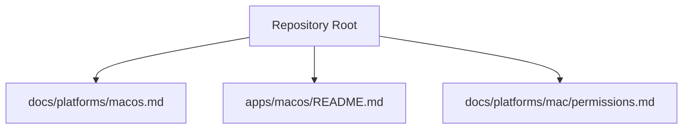
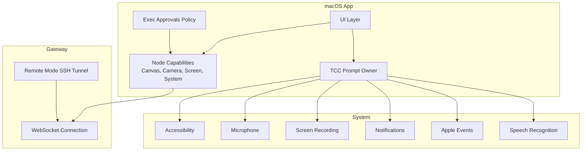
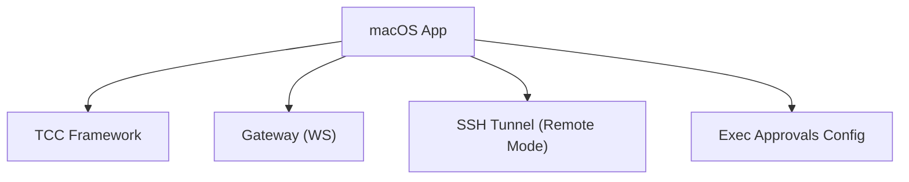

# System Integration & Permissions

<cite>
**Referenced Files in This Document**
- [apps/macos/README.md](file://apps/macos/README.md)
- [docs/platforms/macos.md](file://docs/platforms/macos.md)
- [docs/platforms/mac/permissions.md](file://docs/platforms/mac/permissions.md)
</cite>

## Table of Contents
1. [Introduction](#introduction)
2. [Project Structure](#project-structure)
3. [Core Components](#core-components)
4. [Architecture Overview](#architecture-overview)
5. [Detailed Component Analysis](#detailed-component-analysis)
6. [Dependency Analysis](#dependency-analysis)
7. [Performance Considerations](#performance-considerations)
8. [Troubleshooting Guide](#troubleshooting-guide)
9. [Conclusion](#conclusion)

## Introduction
This document explains how the macOS companion application integrates with macOS system permissions governed by the Transparency, Consent, and Control (TCC) framework. It focuses on how the desktop app requests and manages permissions such as microphone access, screen recording, camera access, and location services, and how it interacts with macOS accessibility features, input monitoring, and system-wide audio capture. It also covers permission request flows, user consent handling, permission state management, and the relationship between system permissions and application functionality (including Voice Wake, screen capture, and related features). Practical examples, troubleshooting steps, and security/privacy best practices are included.

## Project Structure
The macOS companion app is part of the broader OpenClaw project and is packaged as a native macOS application. The repository documents describe how the app:
- Owns TCC prompts for Notifications, Accessibility, Screen Recording, Microphone, Speech Recognition, and Automation/AppleScript.
- Manages the local Gateway lifecycle and exposes macOS-only capabilities as nodes.
- Uses a dedicated build and packaging pipeline with signing and entitlements.

**Diagram sources**
- [docs/platforms/macos.md:1-227](file://docs/platforms/macos.md#L1-L227)
- [apps/macos/README.md:1-65](file://apps/macos/README.md#L1-L65)
- [docs/platforms/mac/permissions.md:1-51](file://docs/platforms/mac/permissions.md#L1-L51)

**Section sources**
- [docs/platforms/macos.md:1-227](file://docs/platforms/macos.md#L1-L227)
- [apps/macos/README.md:1-65](file://apps/macos/README.md#L1-L65)
- [docs/platforms/mac/permissions.md:1-51](file://docs/platforms/mac/permissions.md#L1-L51)

## Core Components
- macOS Companion App: A native macOS app that owns TCC prompts, runs or connects to the Gateway, and exposes macOS capabilities as nodes. It orchestrates permission flows and ensures the app remains in a state where required system permissions are granted.
- Gateway Integration: The app communicates with the Gateway over a WebSocket connection and, in remote mode, uses SSH tunnels to expose local UI components to the remote Gateway.
- Permission Ownership: The app is responsible for requesting and managing permissions such as Accessibility, Screen Capture, Microphone, Notifications, Speech Recognition, and Apple Events. It surfaces a permissions map to agents so they can adapt functionality accordingly.
- Exec Approvals: The app controls system.exec approvals via a local configuration file, enforcing security policies and allowinglist rules for system.run invocations.

Key responsibilities:
- Request and manage TCC permissions during onboarding and runtime.
- Surface permission state to agents via the node permissions map.
- Enforce exec approvals for system.run to protect the system from unintended command execution.
- Provide a robust build and packaging pipeline with signing and entitlements to maintain stable permission grants.

**Section sources**
- [docs/platforms/macos.md:15-65](file://docs/platforms/macos.md#L15-L65)
- [docs/platforms/macos.md:75-111](file://docs/platforms/macos.md#L75-L111)
- [docs/platforms/mac/permissions.md:10-51](file://docs/platforms/mac/permissions.md#L10-L51)

## Architecture Overview
The macOS app acts as a broker between the Gateway and the macOS system. It runs in the UI/TCC context to trigger permission prompts and maintain persistent permission grants. It also exposes macOS-only capabilities (Canvas, Camera, Screen Recording, system.run) to the agent as nodes.

**Diagram sources**
- [docs/platforms/macos.md:15-73](file://docs/platforms/macos.md#L15-L73)
- [docs/platforms/macos.md:200-220](file://docs/platforms/macos.md#L200-L220)

## Detailed Component Analysis

### Permission Request Flow and User Consent Handling
- The macOS app owns TCC prompts for key permissions (Accessibility, Screen Recording, Microphone, Notifications, Speech Recognition, Apple Events). These prompts appear in System Settings and require explicit user consent.
- During onboarding, the typical flow is to install and launch the app, complete the permissions checklist, ensure Local mode is active, and confirm the Gateway is running.
- If prompts disappear or become inconsistent, the app’s documentation provides a recovery checklist, including resetting TCC entries and restarting the system when necessary.

Practical steps:
- Ensure the app is launched from a fixed path and is properly signed to maintain stable permission grants.
- If prompts do not appear, remove the app entry in System Settings -> Privacy & Security and relaunch the app from the same path to re-grant permissions.
- Reset TCC entries using tccutil for specific services if needed.

**Section sources**
- [docs/platforms/macos.md:139-145](file://docs/platforms/macos.md#L139-L145)
- [docs/platforms/mac/permissions.md:27-41](file://docs/platforms/mac/permissions.md#L27-L41)

### Permission State Management
- The macOS app surfaces a permissions map to agents so they can detect which capabilities are available and adjust behavior accordingly.
- In remote mode, the app maintains a local node host service to enable the remote Gateway to reach the Mac while preserving permission contexts.

Operational notes:
- The app reports permissions via the node interface, enabling agents to branch logic based on availability.
- For remote connections, the app opens an SSH tunnel to expose local UI components to the remote Gateway without altering permission ownership.

**Section sources**
- [docs/platforms/macos.md:59-65](file://docs/platforms/macos.md#L59-L65)
- [docs/platforms/macos.md:200-220](file://docs/platforms/macos.md#L200-L220)

### Integration with macOS Accessibility Features and Input Monitoring
- Accessibility permissions are required for UI automation and input monitoring. The app owns the Accessibility prompt and integrates with macOS accessibility features.
- Speech recognition permissions support voice wake functionality and speech-driven interactions.
- Apple Events permissions enable AppleScript-based automation and inter-application communication.

Best practices:
- Keep the app signed consistently and avoid ad-hoc signatures to prevent TCC prompts from disappearing.
- Reset TCC entries using tccutil when troubleshooting persistent permission issues.

**Section sources**
- [docs/platforms/macos.md:18-24](file://docs/platforms/macos.md#L18-L24)
- [docs/platforms/mac/permissions.md:35-41](file://docs/platforms/mac/permissions.md#L35-L41)

### System-Wide Audio Capture and Microphone Access
- Microphone access is essential for voice wake and speech recognition features. The app requests and manages this permission to enable audio capture.
- For reliable operation, ensure the app is signed and launched from a fixed path to maintain persistent grants.

**Section sources**
- [docs/platforms/macos.md:18-24](file://docs/platforms/macos.md#L18-L24)
- [docs/platforms/mac/permissions.md:16-26](file://docs/platforms/mac/permissions.md#L16-L26)

### Screen Recording and Camera Access
- Screen Recording permission is required for screen capture and related features. The app owns this prompt and integrates with macOS screen capture APIs.
- Camera access is necessary for image capture and related functionalities. The app requests and manages this permission to enable camera operations.

**Section sources**
- [docs/platforms/macos.md:18-24](file://docs/platforms/macos.md#L18-L24)
- [docs/platforms/macos.md:55-57](file://docs/platforms/macos.md#L55-L57)

### Relationship Between Permissions and Application Functionality
- Voice Wake: Requires Speech Recognition and Microphone permissions to capture and process audio.
- Screen Capture: Requires Screen Recording permission to record the screen for tasks such as demos or automated UI testing.
- Accessibility: Required for UI automation and input monitoring to interact with applications and system UI.
- Notifications: Required for delivering system notifications from the app and agents.
- Apple Events: Required for AppleScript-based automation and inter-application communication.

**Section sources**
- [docs/platforms/macos.md:18-24](file://docs/platforms/macos.md#L18-L24)
- [docs/platforms/macos.md:55-57](file://docs/platforms/macos.md#L55-L57)

### Exec Approvals and Security Controls
- The macOS app enforces exec approvals for system.run via a local configuration file. It supports security modes (deny, allowlist), prompting behavior (ask on miss), and allowlists with glob patterns.
- Environment variable filtering prevents unsafe overrides during system.run execution.
- For shell wrappers, the app applies a minimal allowlist for request-scoped environment overrides.

**Section sources**
- [docs/platforms/macos.md:75-111](file://docs/platforms/macos.md#L75-L111)

## Dependency Analysis
The macOS app depends on:
- macOS TCC subsystem for permission grants.
- Gateway over WebSocket for control plane operations and node capability exposure.
- SSH tunneling for remote mode connectivity.
- Local configuration for exec approvals.

**Diagram sources**
- [docs/platforms/macos.md:15-73](file://docs/platforms/macos.md#L15-L73)
- [docs/platforms/macos.md:200-220](file://docs/platforms/macos.md#L200-L220)

**Section sources**
- [docs/platforms/macos.md:15-73](file://docs/platforms/macos.md#L15-L73)
- [docs/platforms/macos.md:200-220](file://docs/platforms/macos.md#L200-L220)

## Performance Considerations
- Stable permission grants reduce UI churn and repeated prompts, improving user experience.
- Keeping the app signed consistently avoids frequent TCC resets and prompt disappearance.
- Using a fixed installation path helps maintain persistent grants across updates.

[No sources needed since this section provides general guidance]

## Troubleshooting Guide
Common issues and resolutions:
- Prompts disappear after rebuilding: Ensure the app is signed with a consistent certificate and launched from the same path. If prompts still do not appear, reset TCC entries using tccutil and restart the system.
- Screen capture or microphone access not working: Verify the respective permissions are granted in System Settings and that the app is signed and launched from a fixed path.
- Accessibility or Apple Events issues: Confirm Accessibility and Apple Events permissions are granted; reset entries if necessary.
- Exec approvals blocking commands: Review the exec approvals configuration and adjust security mode, prompting behavior, or allowlists as needed.

Recovery checklist:
1. Quit the app.
2. Remove the app entry in System Settings -> Privacy & Security.
3. Relaunch the app from the same path and re-grant permissions.
4. If the prompt still does not appear, reset TCC entries with tccutil and try again.
5. Some permissions only reappear after a full macOS restart.

**Section sources**
- [docs/platforms/mac/permissions.md:27-41](file://docs/platforms/mac/permissions.md#L27-L41)

## Conclusion
The macOS companion app plays a central role in managing TCC permissions and integrating with macOS system capabilities. By owning permission prompts, maintaining stable signing and installation paths, and exposing a permissions map to agents, it ensures secure and predictable access to sensitive system features. Proper configuration of exec approvals further hardens the system against unintended command execution. Following the documented troubleshooting steps and best practices helps maintain reliable permission behavior across updates and environments.