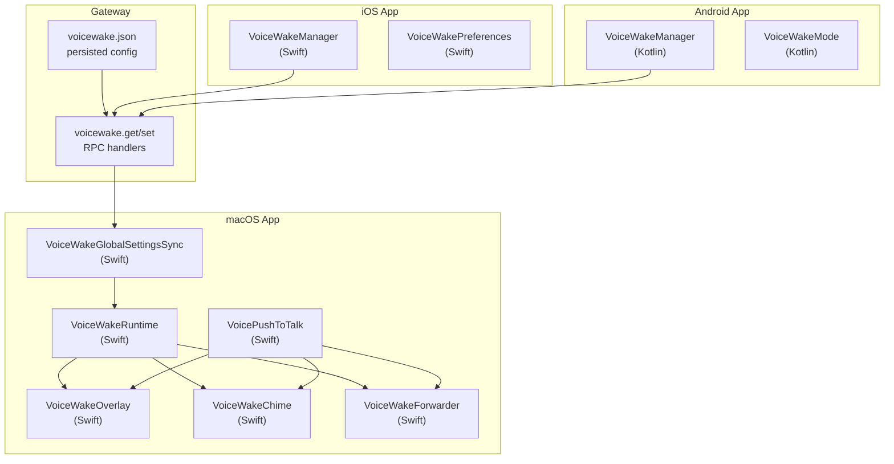
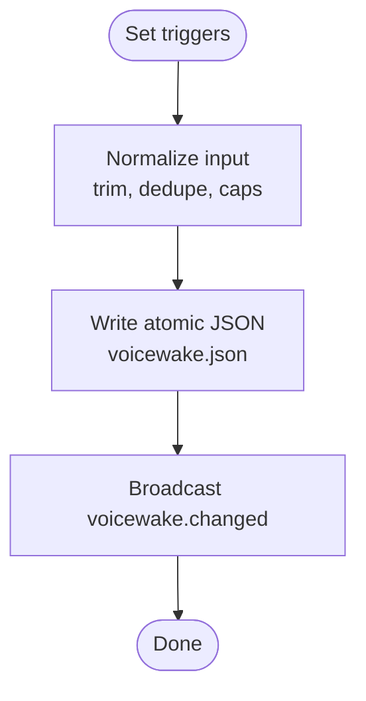
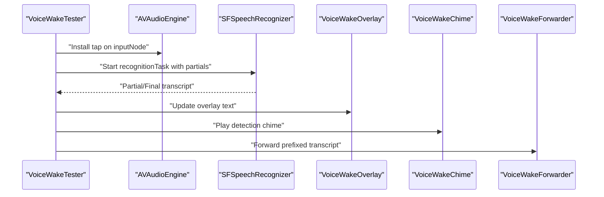
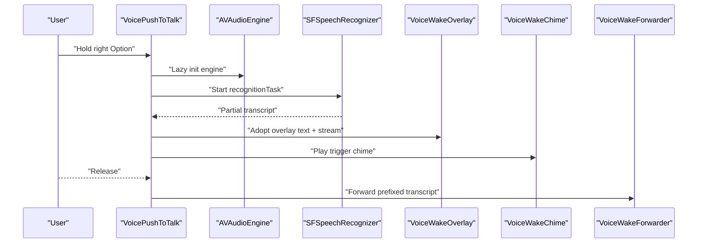
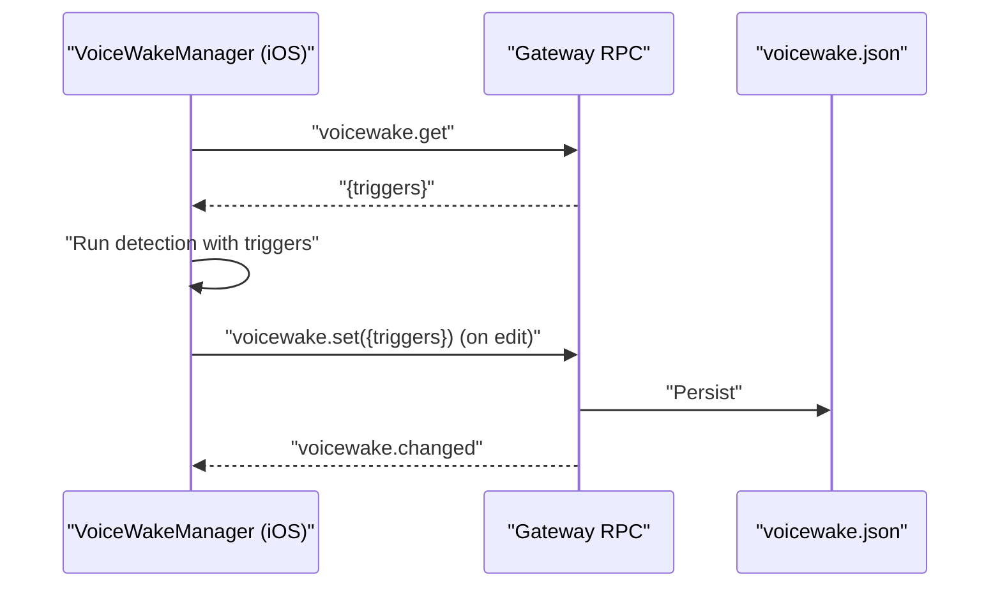
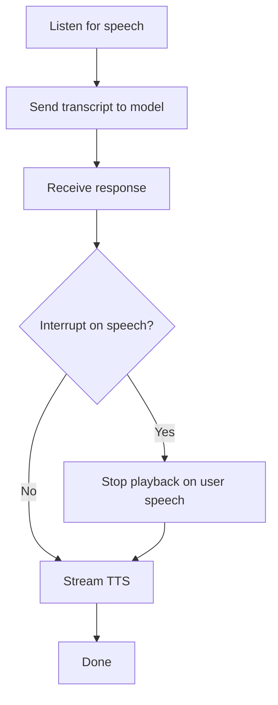
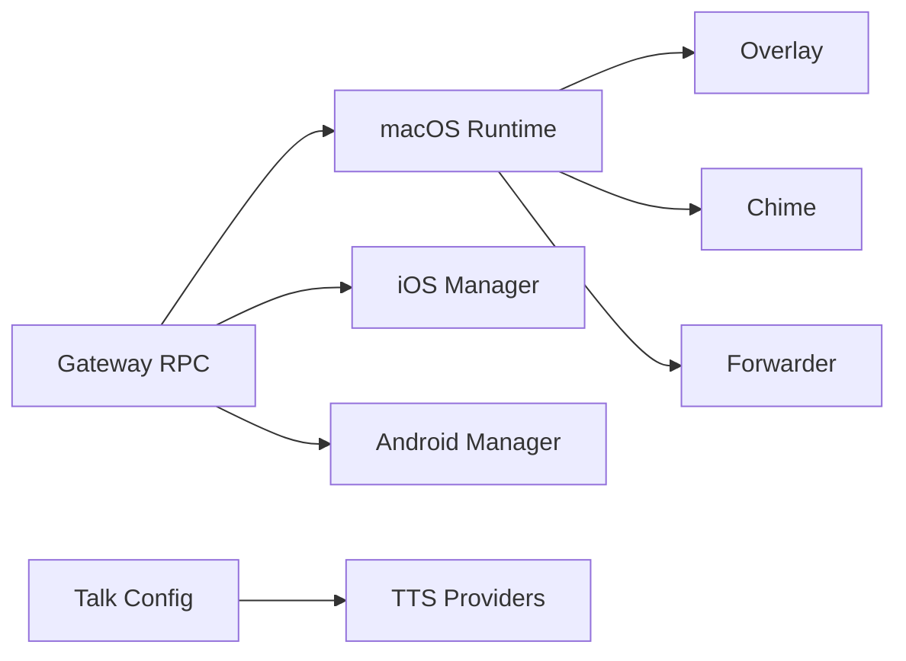

# Voice Wake & Audio Features

<cite>
**Referenced Files in This Document**
- [voicewake.md](file://docs/nodes/voicewake.md)
- [voicewake.md](file://docs/platforms/mac/voicewake.md)
- [voicewake.md](file://docs/platforms/mac/voice-overlay.md)
- [talk.md](file://docs/nodes/talk.md)
- [voicewake.ts](file://src/infra/voicewake.ts)
- [server-methods/voicewake.ts](file://src/gateway/server-methods/voicewake.ts)
- [server-utils.ts](file://src/gateway/server-utils.ts)
- [talk.ts](file://src/config/talk.ts)
- [VoiceWakeTester.swift](file://apps/macos/Sources/OpenClaw/VoiceWakeTester.swift)
- [VoicePushToTalk.swift](file://apps/macos/Sources/OpenClaw/VoicePushToTalk.swift)
- [VoiceWakeForwarder.swift](file://apps/macos/Sources/OpenClaw/VoiceWakeForwarder.swift)
- [VoiceWakeOverlay.swift](file://apps/macos/Sources/OpenClaw/VoiceWakeOverlay.swift)
- [VoiceWakeChime.swift](file://apps/macos/Sources/OpenClaw/VoiceWakeChime.swift)
- [VoiceWakeGlobalSettingsSync.swift](file://apps/macos/Sources/OpenClaw/VoiceWakeGlobalSettingsSync.swift)
- [VoiceWakeMode.kt](file://apps/android/app/src/main/java/ai/openclaw/app/VoiceWakeMode.kt)
- [VoiceWakeManager.kt](file://apps/android/app/src/main/java/ai/openclaw/app/voice/VoiceWakeManager.kt)
- [VoiceWakeManager.swift](file://apps/ios/Sources/Voice/VoiceWakeManager.swift)
- [VoiceWakePreferences.swift](file://apps/ios/Sources/Voice/VoiceWakePreferences.swift)
- [VoiceWakeWordsSettingsView.swift](file://apps/ios/Sources/Settings/VoiceWakeWordsSettingsView.swift)
</cite>

## Table of Contents
1. [Introduction](#introduction)
2. [Project Structure](#project-structure)
3. [Core Components](#core-components)
4. [Architecture Overview](#architecture-overview)
5. [Detailed Component Analysis](#detailed-component-analysis)
6. [Dependency Analysis](#dependency-analysis)
7. [Performance Considerations](#performance-considerations)
8. [Troubleshooting Guide](#troubleshooting-guide)
9. [Conclusion](#conclusion)
10. [Appendices](#appendices)

## Introduction
This document explains the Voice Wake and audio processing features across the gateway and desktop/mobile applications. It covers wake word detection, push-to-talk, audio capture, speech-to-text forwarding, audio device management, and audio feedback. It also documents configuration, sensitivity tuning, and troubleshooting, along with performance and battery considerations and how audio processing integrates with the broader gateway system and channel communication protocols.

## Project Structure
Voice Wake spans three layers:
- Gateway: central configuration storage and broadcast of wake words, and RPC handlers for retrieval and updates.
- Platform apps: macOS, iOS, and Android implement wake word detection, push-to-talk, overlays, audio feedback, and device selection.
- Talk mode: continuous speech loop integrating with TTS providers and optional interruption behavior.



**Diagram sources**
- [voicewake.ts:1-60](file://src/infra/voicewake.ts#L1-L60)
- [server-methods/voicewake.ts:1-35](file://src/gateway/server-methods/voicewake.ts#L1-L35)
- [VoiceWakeTester.swift:1-468](file://apps/macos/Sources/OpenClaw/VoiceWakeTester.swift#L1-L468)
- [VoicePushToTalk.swift:1-147](file://apps/macos/Sources/OpenClaw/VoicePushToTalk.swift#L1-L147)
- [VoiceWakeOverlay.swift:1-200](file://apps/macos/Sources/OpenClaw/VoiceWakeOverlay.swift#L1-L200)
- [VoiceWakeChime.swift:1-200](file://apps/macos/Sources/OpenClaw/VoiceWakeChime.swift#L1-L200)
- [VoiceWakeForwarder.swift:1-200](file://apps/macos/Sources/OpenClaw/VoiceWakeForwarder.swift#L1-L200)
- [VoiceWakeGlobalSettingsSync.swift:1-200](file://apps/macos/Sources/OpenClaw/VoiceWakeGlobalSettingsSync.swift#L1-L200)
- [VoiceWakeManager.swift:1-200](file://apps/ios/Sources/Voice/VoiceWakeManager.swift#L1-L200)
- [VoiceWakePreferences.swift:1-200](file://apps/ios/Sources/Voice/VoiceWakePreferences.swift#L1-L200)
- [VoiceWakeMode.kt:1-200](file://apps/android/app/src/main/java/ai/openclaw/app/VoiceWakeMode.kt#L1-L200)
- [VoiceWakeManager.kt:1-200](file://apps/android/app/src/main/java/ai/openclaw/app/voice/VoiceWakeManager.kt#L1-L200)

**Section sources**
- [voicewake.md:1-67](file://docs/nodes/voicewake.md#L1-L67)
- [voicewake.md:1-68](file://docs/platforms/mac/voicewake.md#L1-L68)
- [voicewake.ts:1-60](file://src/infra/voicewake.ts#L1-L60)
- [server-methods/voicewake.ts:1-35](file://src/gateway/server-methods/voicewake.ts#L1-L35)

## Core Components
- Global wake word list: owned and synchronized by the Gateway; stored locally on the gateway host and broadcast to all clients.
- macOS wake-word runtime: continuous speech recognition with partial results, silence gating, and overlay-driven capture.
- Push-to-talk: right Option hotkey capture with immediate start/stop, overlay adoption, and audio feedback.
- Talk mode: continuous conversation loop with optional interruption and ElevenLabs TTS integration.
- Audio feedback: system sounds for detection and send events.
- Device management: mic selection, fallbacks, and permission checks across platforms.

**Section sources**
- [voicewake.md:1-67](file://docs/nodes/voicewake.md#L1-L67)
- [voicewake.md:1-68](file://docs/platforms/mac/voicewake.md#L1-L68)
- [talk.md:1-93](file://docs/nodes/talk.md#L1-L93)
- [voicewake.ts:1-60](file://src/infra/voicewake.ts#L1-L60)
- [server-methods/voicewake.ts:1-35](file://src/gateway/server-methods/voicewake.ts#L1-L35)
- [VoiceWakeTester.swift:1-468](file://apps/macos/Sources/OpenClaw/VoiceWakeTester.swift#L1-L468)
- [VoicePushToTalk.swift:1-147](file://apps/macos/Sources/OpenClaw/VoicePushToTalk.swift#L1-L147)
- [VoiceWakeChime.swift:1-200](file://apps/macos/Sources/OpenClaw/VoiceWakeChime.swift#L1-L200)

## Architecture Overview
The Voice Wake architecture centers on a global configuration managed by the Gateway and consumed by platform clients. Wake word detection runs continuously on supported platforms, with optional push-to-talk as an alternative capture method. Transcripts are forwarded to the active gateway/agent and integrated into channel communications.

```mermaid
sequenceDiagram
participant User as "User"
participant MacRT as "VoiceWakeRuntime (macOS)"
participant IOS as "VoiceWakeManager (iOS)"
participant AND as "VoiceWakeManager (Android)"
participant GW as "Gateway RPC"
participant CFG as "voicewake.json"
User->>GW : "voicewake.set({triggers})"
GW->>CFG : "Persist triggers"
GW-->>MacRT : "voicewake.changed {triggers}"
GW-->>IOS : "voicewake.changed {triggers}"
GW-->>AND : "voicewake.changed {triggers}"
MacRT->>MacRT : "Continuous recognition with partials"
MacRT-->>User : "Overlay + chime on detection"
MacRT->>GW : "Forward prefixed transcript"
```

**Diagram sources**
- [server-methods/voicewake.ts:1-35](file://src/gateway/server-methods/voicewake.ts#L1-L35)
- [voicewake.ts:1-60](file://src/infra/voicewake.ts#L1-L60)
- [VoiceWakeTester.swift:1-468](file://apps/macos/Sources/OpenClaw/VoiceWakeTester.swift#L1-L468)
- [VoiceWakeManager.swift:1-200](file://apps/ios/Sources/Voice/VoiceWakeManager.swift#L1-L200)
- [VoiceWakeManager.kt:1-200](file://apps/android/app/src/main/java/ai/openclaw/app/voice/VoiceWakeManager.kt#L1-L200)

## Detailed Component Analysis

### Global Wake Word Management (Gateway)
- Storage: persisted JSON file on the gateway host containing triggers and updated timestamp.
- RPC: methods to fetch and set triggers; normalization ensures safe limits and trimming.
- Broadcast: changes propagate to all WebSocket clients and nodes upon set.



**Diagram sources**
- [voicewake.ts:1-60](file://src/infra/voicewake.ts#L1-L60)
- [server-methods/voicewake.ts:1-35](file://src/gateway/server-methods/voicewake.ts#L1-L35)
- [server-utils.ts:1-41](file://src/gateway/server-utils.ts#L1-L41)

**Section sources**
- [voicewake.md:18-50](file://docs/nodes/voicewake.md#L18-L50)
- [voicewake.ts:1-60](file://src/infra/voicewake.ts#L1-L60)
- [server-methods/voicewake.ts:1-35](file://src/gateway/server-methods/voicewake.ts#L1-L35)
- [server-utils.ts:1-41](file://src/gateway/server-utils.ts#L1-L41)

### macOS Wake-Word Runtime
- Continuous recognition with partial results and silence gating.
- Overlay displays partial text; chime indicates detection and send.
- Permissions: Speech recognition and microphone access required.
- Device selection: persists last mic; falls back to system default on disconnect.
- Forwarding: transcripts are prefixed and sent to the active gateway/agent.



**Diagram sources**
- [VoiceWakeTester.swift:1-468](file://apps/macos/Sources/OpenClaw/VoiceWakeTester.swift#L1-L468)
- [VoiceWakeOverlay.swift:1-200](file://apps/macos/Sources/OpenClaw/VoiceWakeOverlay.swift#L1-L200)
- [VoiceWakeChime.swift:1-200](file://apps/macos/Sources/OpenClaw/VoiceWakeChime.swift#L1-L200)
- [VoiceWakeForwarder.swift:1-200](file://apps/macos/Sources/OpenClaw/VoiceWakeForwarder.swift#L1-L200)

**Section sources**
- [voicewake.md:15-38](file://docs/platforms/mac/voicewake.md#L15-L38)
- [VoiceWakeTester.swift:1-468](file://apps/macos/Sources/OpenClaw/VoiceWakeTester.swift#L1-L468)

### Push-to-Talk (macOS)
- Right Option hotkey detection via global monitor; capture starts immediately.
- Overlay adopts existing text when initiated while wake-word overlay is visible.
- Audio feedback and forwarding on release; temporary suspension of wake-word runtime avoids conflicts.



**Diagram sources**
- [VoicePushToTalk.swift:1-147](file://apps/macos/Sources/OpenClaw/VoicePushToTalk.swift#L1-L147)
- [VoiceWakeOverlay.swift:1-200](file://apps/macos/Sources/OpenClaw/VoiceWakeOverlay.swift#L1-L200)
- [VoiceWakeChime.swift:1-200](file://apps/macos/Sources/OpenClaw/VoiceWakeChime.swift#L1-L200)
- [VoiceWakeForwarder.swift:1-200](file://apps/macos/Sources/OpenClaw/VoiceWakeForwarder.swift#L1-L200)

**Section sources**
- [voicewake.md:39-68](file://docs/platforms/mac/voicewake.md#L39-L68)
- [VoicePushToTalk.swift:1-147](file://apps/macos/Sources/OpenClaw/VoicePushToTalk.swift#L1-L147)
- [voicewake.md:1-21](file://docs/platforms/mac/voice-overlay.md#L1-L21)

### iOS Voice Wake
- Uses the global trigger list for detection.
- Settings UI allows editing wake words; changes are persisted and broadcast.
- Manual mic flow is used on Android; iOS integrates with native speech APIs.



**Diagram sources**
- [VoiceWakeManager.swift:1-200](file://apps/ios/Sources/Voice/VoiceWakeManager.swift#L1-L200)
- [VoiceWakeWordsSettingsView.swift:1-200](file://apps/ios/Sources/Settings/VoiceWakeWordsSettingsView.swift#L1-L200)
- [server-methods/voicewake.ts:1-35](file://src/gateway/server-methods/voicewake.ts#L1-L35)

**Section sources**
- [voicewake.md:58-61](file://docs/nodes/voicewake.md#L58-L61)
- [VoiceWakeManager.swift:1-200](file://apps/ios/Sources/Voice/VoiceWakeManager.swift#L1-L200)
- [VoiceWakeWordsSettingsView.swift:1-200](file://apps/ios/Sources/Settings/VoiceWakeWordsSettingsView.swift#L1-L200)

### Android Voice Wake
- Voice Wake is currently disabled in runtime/Settings.
- Manual mic capture is used in the Voice tab instead of wake-word triggers.

**Section sources**
- [voicewake.md:63-66](file://docs/nodes/voicewake.md#L63-L66)
- [VoiceWakeMode.kt:1-200](file://apps/android/app/src/main/java/ai/openclaw/app/VoiceWakeMode.kt#L1-L200)
- [VoiceWakeManager.kt:1-200](file://apps/android/app/src/main/java/ai/openclaw/app/voice/VoiceWakeManager.kt#L1-L200)

### Talk Mode and TTS Integration
- Continuous loop: listen → send transcript → wait for response → speak via TTS.
- Interrupt on speech: optional; stops playback when user speaks mid-response.
- Provider configuration: supports multiple providers with voice/model/output format settings.
- Defaults and compatibility: platform-specific defaults and environment/profile fallbacks.



**Diagram sources**
- [talk.md:1-93](file://docs/nodes/talk.md#L1-L93)
- [talk.ts:1-354](file://src/config/talk.ts#L1-L354)

**Section sources**
- [talk.md:1-93](file://docs/nodes/talk.md#L1-L93)
- [talk.ts:1-354](file://src/config/talk.ts#L1-L354)

## Dependency Analysis
- Gateway depends on local JSON persistence and RPC handlers to manage wake words.
- macOS runtime depends on AVFoundation and Speech frameworks; integrates with overlay, chime, and forwarding.
- iOS and Android consume the global trigger list via Gateway RPC.
- Talk mode depends on provider configuration resolution and environment/profile lookups.



**Diagram sources**
- [server-methods/voicewake.ts:1-35](file://src/gateway/server-methods/voicewake.ts#L1-L35)
- [voicewake.ts:1-60](file://src/infra/voicewake.ts#L1-L60)
- [VoiceWakeTester.swift:1-468](file://apps/macos/Sources/OpenClaw/VoiceWakeTester.swift#L1-L468)
- [VoiceWakeOverlay.swift:1-200](file://apps/macos/Sources/OpenClaw/VoiceWakeOverlay.swift#L1-L200)
- [VoiceWakeChime.swift:1-200](file://apps/macos/Sources/OpenClaw/VoiceWakeChime.swift#L1-L200)
- [VoiceWakeForwarder.swift:1-200](file://apps/macos/Sources/OpenClaw/VoiceWakeForwarder.swift#L1-L200)
- [VoiceWakeManager.swift:1-200](file://apps/ios/Sources/Voice/VoiceWakeManager.swift#L1-L200)
- [VoiceWakeManager.kt:1-200](file://apps/android/app/src/main/java/ai/openclaw/app/voice/VoiceWakeManager.kt#L1-L200)
- [talk.ts:1-354](file://src/config/talk.ts#L1-L354)

**Section sources**
- [server-methods/voicewake.ts:1-35](file://src/gateway/server-methods/voicewake.ts#L1-L35)
- [voicewake.ts:1-60](file://src/infra/voicewake.ts#L1-L60)
- [VoiceWakeTester.swift:1-468](file://apps/macos/Sources/OpenClaw/VoiceWakeTester.swift#L1-L468)
- [VoiceWakeManager.swift:1-200](file://apps/ios/Sources/Voice/VoiceWakeManager.swift#L1-L200)
- [VoiceWakeManager.kt:1-200](file://apps/android/app/src/main/java/ai/openclaw/app/voice/VoiceWakeManager.kt#L1-L200)
- [talk.ts:1-354](file://src/config/talk.ts#L1-L354)

## Performance Considerations
- Wake-word runtime: continuous recognition with partial results; debounce and hard-stop timers prevent excessive CPU usage and runaway sessions.
- Push-to-talk: lazy initialization of audio engine avoids unnecessary Bluetooth codec switching and power drain when unused.
- Silence gating: configurable windows reduce false positives and unnecessary forwarding.
- Battery impact: continuous speech recognition and audio taps can increase CPU and power usage; push-to-talk mitigates this by activating only on demand.
- Platform defaults: output formats and latency tiers are tuned per platform to balance quality and responsiveness.

[No sources needed since this section provides general guidance]

## Troubleshooting Guide
Common issues and remedies:
- No audio input available: verify mic permissions and device selection; the runtime validates input format and availability.
- Missing privacy strings: rebuild the macOS app to include usage descriptions for microphone and speech recognition.
- Permission denials: ensure Speech recognition and microphone permissions are granted; accessibility/input monitoring may be required for hotkeys.
- Overlay stuck visible: recent hardening ensures overlay dismissal does not block runtime restart; manual dismiss triggers a refresh.
- Push-to-talk misses: some external keyboards may not expose right Option as expected; offer a fallback shortcut if users report misses.
- Android Voice Wake disabled: manual mic capture is used in the Voice tab instead of wake-word triggers.

**Section sources**
- [VoiceWakeTester.swift:69-98](file://apps/macos/Sources/OpenClaw/VoiceWakeTester.swift#L69-L98)
- [VoiceWakeTester.swift:431-458](file://apps/macos/Sources/OpenClaw/VoiceWakeTester.swift#L431-L458)
- [voicewake.md:30-37](file://docs/platforms/mac/voicewake.md#L30-L37)
- [voicewake.md:44-45](file://docs/platforms/mac/voicewake.md#L44-L45)
- [voicewake.md:63-66](file://docs/nodes/voicewake.md#L63-L66)

## Conclusion
Voice Wake integrates a global configuration managed by the Gateway with platform-specific detection and capture mechanisms. macOS offers always-on wake-word detection and push-to-talk with overlay and audio feedback, while iOS consumes the global trigger list and Android uses a manual mic flow. Talk mode complements Voice Wake with continuous conversation and TTS. Proper configuration, permissions, and platform-specific tuning ensure reliable operation with minimal performance impact.

[No sources needed since this section summarizes without analyzing specific files]

## Appendices

### Practical Configuration Examples
- Global wake words:
  - Set triggers via Gateway RPC; changes persist and broadcast.
  - Default triggers are applied when input is empty or invalid.
- macOS Voice Wake:
  - Enable toggle, select language and mic, adjust sounds, and use tester to validate.
- Talk mode:
  - Configure provider, voice, model, output format, silence timeout, and interrupt behavior in configuration.

**Section sources**
- [voicewake.md:18-50](file://docs/nodes/voicewake.md#L18-L50)
- [voicewake.md:47-53](file://docs/platforms/mac/voicewake.md#L47-L53)
- [talk.md:50-73](file://docs/nodes/talk.md#L50-L73)

### Sensitivity Tuning Tips
- Wake-word sensitivity: adjust trigger words and rely on silence gaps; meaningful pauses (~0.55s) are required before triggering.
- Push-to-talk: fine-tune overlay adoption and finalization timing; chime feedback helps confirm activation.
- Noise suppression: leverage platform defaults and device selection; ensure proper permissions for optimal microphone performance.

**Section sources**
- [voicewake.md:15-23](file://docs/platforms/mac/voicewake.md#L15-L23)
- [VoiceWakeTester.swift:1-468](file://apps/macos/Sources/OpenClaw/VoiceWakeTester.swift#L1-L468)