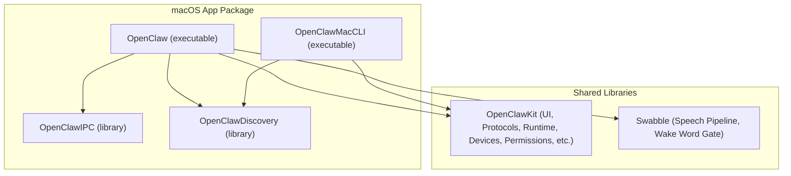
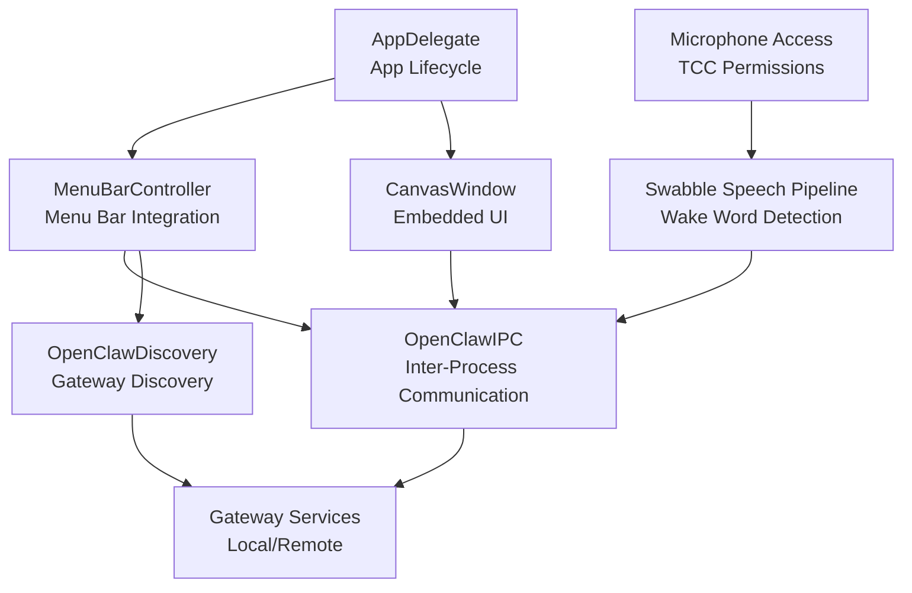
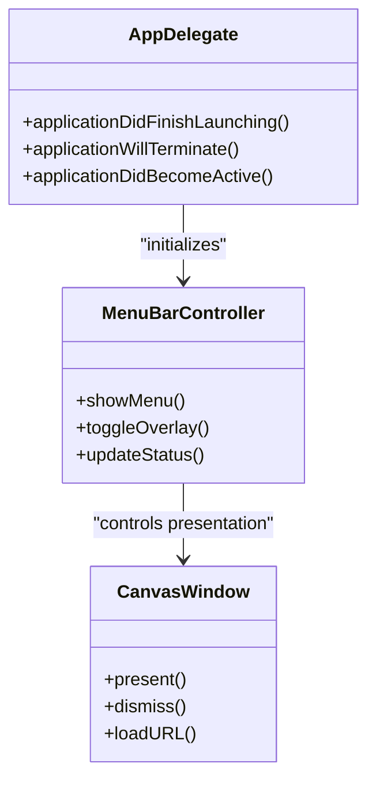
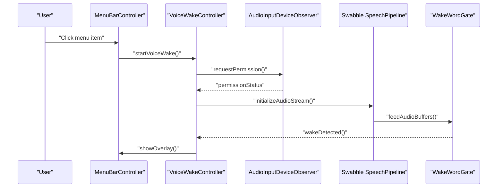
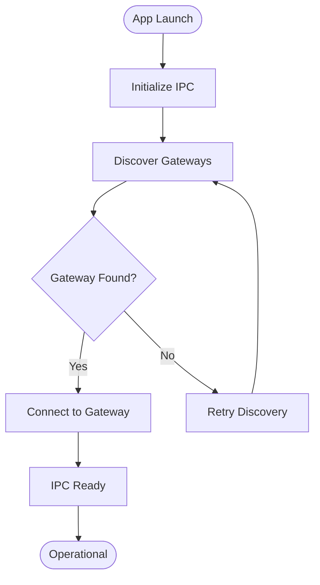
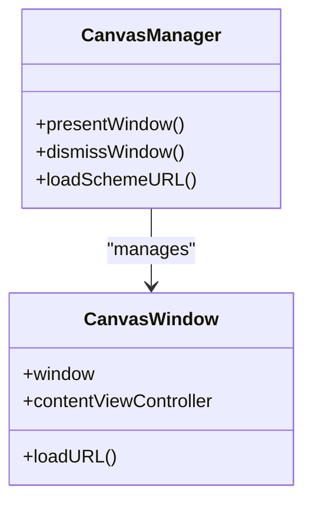
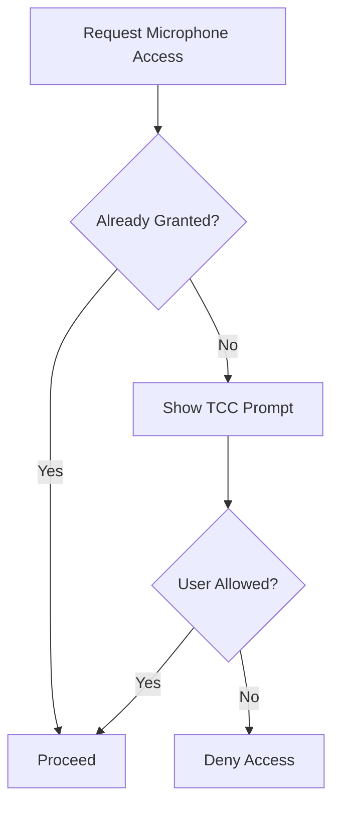
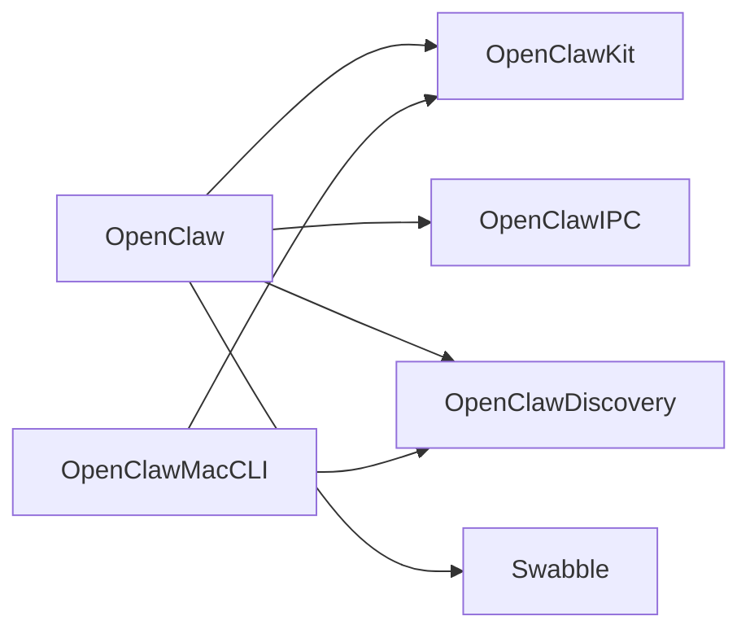
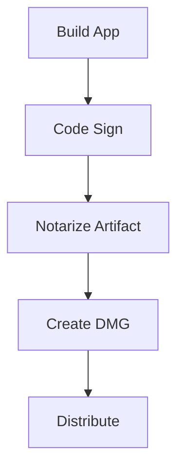
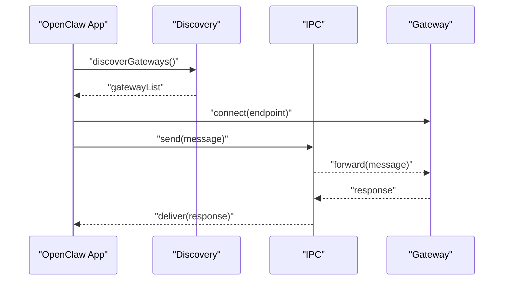

# macOS Desktop Application

<cite>
**Referenced Files in This Document**
- [Package.swift](file://apps/macos/Package.swift)
- [README.md](file://apps/macos/README.md)
- [restart-mac.sh](file://scripts/build-and-run-mac.sh)
- [codesign-mac-app.sh](file://scripts/codesign-mac-app.sh)
- [notarize-mac-artifact.sh](file://scripts/notarize-mac-artifact.sh)
- [package-mac-app.sh](file://scripts/package-mac-app.sh)
- [create-dmg.sh](file://scripts/create-dmg.sh)
- [Sparkle build pipeline](file://scripts/sparkle-build.ts)
- [appcast.xml](file://appcast.xml)
- [OpenClaw.swift](file://apps/macos/Sources/OpenClaw/OpenClaw.swift)
- [AppDelegate.swift](file://apps/macos/Sources/OpenClaw/AppDelegate.swift)
- [MenuBarController.swift](file://apps/macos/Sources/OpenClaw/MenuBarController.swift)
- [VoiceWakeController.swift](file://apps/macos/Sources/OpenClaw/VoiceWakeController.swift)
- [VoiceWakeOverlayController.swift](file://apps/macos/Sources/OpenClaw/VoiceWakeOverlayController.swift)
- [AudioInputDeviceObserver.swift](file://apps/macos/Sources/OpenClaw/AudioInputDeviceObserver.swift)
- [CameraCaptureService.swift](file://apps/macos/Sources/OpenClaw/CameraCaptureService.swift)
- [CanvasManager.swift](file://apps/macos/Sources/OpenClaw/CanvasManager.swift)
- [CanvasWindow.swift](file://apps/macos/Sources/OpenClaw/CanvasWindow.swift)
- [OpenClawIPC.swift](file://apps/macos/Sources/OpenClawIPC/OpenClawIPC.swift)
- [OpenClawDiscovery.swift](file://apps/macos/Sources/OpenClawDiscovery/OpenClawDiscovery.swift)
- [OpenClawMacCLI.swift](file://apps/macos/Sources/OpenClawMacCLI/OpenClawMacCLI.swift)
- [SwabbleKit WakeWordGate.swift](file://Swabble/Sources/SwabbleKit/WakeWordGate.swift)
- [Swabble SpeechPipeline.swift](file://Swabble/Sources/SwabbleCore/Speech/SpeechPipeline.swift)
- [Swabble BufferConverter.swift](file://Swabble/Sources/SwabbleCore/Speech/BufferConverter.swift)
- [Swabble TranscriptsStore.swift](file://Swabble/Sources/SwabbleCore/Support/TranscriptsStore.swift)
- [Swabble Logging.swift](file://Swabble/Sources/SwabbleCore/Support/Logging.swift)
- [OpenClawKit Chat UI](file://apps/shared/OpenClawKit/Sources/OpenClawChatUI/)
- [OpenClawKit Protocol](file://apps/shared/OpenClawKit/Sources/OpenClawProtocol/)
- [OpenClawKit Runtime](file://apps/shared/OpenClawKit/Sources/OpenClawKit/Runtime/)
- [OpenClawKit Node Browser](file://apps/shared/OpenClawKit/Sources/OpenClawKit/NodeBrowser/)
- [OpenClawKit Device Models](file://apps/shared/OpenClawKit/Sources/OpenClawKit/DeviceModels/)
- [OpenClawKit Permissions](file://apps/shared/OpenClawKit/Sources/OpenClawKit/Permissions/)
- [OpenClawKit Utilities](file://apps/shared/OpenClawKit/Sources/OpenClawKit/Utilities/)
- [OpenClawKit Canvas](file://apps/shared/OpenClawKit/Sources/OpenClawKit/Canvas/)
- [OpenClawKit Agents](file://apps/shared/OpenClawKit/Sources/OpenClawKit/Agents/)
- [OpenClawKit Channels](file://apps/shared/OpenClawKit/Sources/OpenClawKit/Channels/)
- [OpenClawKit Sessions](file://apps/shared/OpenClawKit/Sources/OpenClawKit/Sessions/)
- [OpenClawKit Settings](file://apps/shared/OpenClawKit/Sources/OpenClawKit/Settings/)
- [OpenClawKit Gateway](file://apps/shared/OpenClawKit/Sources/OpenClawKit/Gateway/)
- [OpenClawKit Health](file://apps/shared/OpenClawKit/Sources/OpenClawKit/Health/)
- [OpenClawKit Diagnostics](file://apps/shared/OpenClawKit/Sources/OpenClawKit/Diagnostics/)
- [OpenClawKit TTS](file://apps/shared/OpenClawKit/Sources/OpenClawKit/TTS/)
- [OpenClawKit Voice Call](file://apps/shared/OpenClawKit/Sources/OpenClawKit/VoiceCall/)
- [OpenClawKit Voice Wake](file://apps/shared/OpenClawKit/Sources/OpenClawKit/VoiceWake/)
- [OpenClawKit Canvas A2UI](file://apps/shared/OpenClawKit/Sources/OpenClawKit/CanvasA2UI/)
- [OpenClawKit Canvas Chrome Container](file://apps/shared/OpenClawKit/Sources/OpenClawKit/CanvasChromeContainer/)
- [OpenClawKit Canvas Scheme Handler](file://apps/shared/OpenClawKit/Sources/OpenClawKit/CanvasSchemeHandler/)
- [OpenClawKit Canvas Window Controller](file://apps/shared/OpenClawKit/Sources/OpenClawKit/CanvasWindowController/)
- [OpenClawKit Canvas Window Placement](file://apps/shared/OpenClawKit/Sources/OpenClawKit/CanvasWindowPlacement/)
- [OpenClawKit Canvas Window Smoke Tests](file://apps/macos/Tests/OpenClawIPCTests/CanvasWindowSmokeTests.swift)
- [OpenClawKit Voice Wake Runtime Tests](file://apps/macos/Tests/OpenClawIPCTests/VoiceWakeRuntimeTests.swift)
- [OpenClawKit Voice Wake Overlay Controller Tests](file://apps/macos/Tests/OpenClawIPCTests/VoiceWakeOverlayControllerTests.swift)
- [OpenClawKit Voice Wake Global Settings Sync Tests](file://apps/macos/Tests/OpenClawIPCTests/VoiceWakeGlobalSettingsSyncTests.swift)
- [OpenClawKit Voice Wake Forwarder Tests](file://apps/macos/Tests/OpenClawIPCTests/VoiceWakeForwarderTests.swift)
- [OpenClawKit Voice Push To Talk Tests](file://apps/macos/Tests/OpenClawIPCTests/VoicePushToTalkTests.swift)
- [OpenClawKit Voice Push To Talk Hotkey Tests](file://apps/macos/Tests/OpenClawIPCTests/VoicePushToTalkHotkeyTests.swift)
- [OpenClawKit Permission Manager Tests](file://apps/macos/Tests/OpenClawIPCTests/PermissionManagerTests.swift)
- [OpenClawKit Permission Manager Location Tests](file://apps/macos/Tests/OpenClawIPCTests/PermissionManagerLocationTests.swift)
- [OpenClawKit Gateway Discovery Helpers Tests](file://apps/macos/Tests/OpenClawIPCTests/GatewayDiscoveryHelpersTests.swift)
- [OpenClawKit Gateway Discovery Model Tests](file://apps/macos/Tests/OpenClawIPCTests/GatewayDiscoveryModelTests.swift)
- [OpenClawKit Gateway Launch Agent Manager Tests](file://apps/macos/Tests/OpenClawIPCTests/GatewayLaunchAgentManagerTests.swift)
- [OpenClawKit Gateway Process Manager Tests](file://apps/macos/Tests/OpenClawIPCTests/GatewayProcessManagerTests.swift)
- [OpenClawKit Gateway Channel Connect Tests](file://apps/macos/Tests/OpenClawIPCTests/GatewayChannelConnectTests.swift)
- [OpenClawKit Gateway Channel Configure Tests](file://apps/macos/Tests/OpenClawIPCTests/GatewayChannelConfigureTests.swift)
- [OpenClawKit Gateway Channel Request Tests](file://apps/macos/Tests/OpenClawIPCTests/GatewayChannelRequestTests.swift)
- [OpenClawKit Gateway Channel Shutdown Tests](file://apps/macos/Tests/OpenClawIPCTests/GatewayChannelShutdownTests.swift)
- [OpenClawKit Gateway Connection Control Tests](file://apps/macos/Tests/OpenClawIPCTests/GatewayConnectionControlTests.swift)
- [OpenClawKit Gateway Endpoint Store Tests](file://apps/macos/Tests/OpenClawIPCTests/GatewayEndpointStoreTests.swift)
- [OpenClawKit Gateway Environment Tests](file://apps/macos/Tests/OpenClawIPCTests/GatewayEnvironmentTests.swift)
- [OpenClawKit Gateway Frame Decode Tests](file://apps/macos/Tests/OpenClawIPCTests/GatewayFrameDecodeTests.swift)
- [OpenClawKit Gateway WebSocket Test Support](file://apps/macos/Tests/OpenClawIPCTests/GatewayWebSocketTestSupport.swift)
- [OpenClawKit Health Decode Tests](file://apps/macos/Tests/OpenClawIPCTests/HealthDecodeTests.swift)
- [OpenClawKit Health Store State Tests](file://apps/macos/Tests/OpenClawIPCTests/HealthStoreStateTests.swift)
- [OpenClawKit Mac Gateway Chat Transport Mapping Tests](file://apps/macos/Tests/OpenClawIPCTests/MacGatewayChatTransportMappingTests.swift)
- [OpenClawKit Mac Node Browser Proxy Tests](file://apps/macos/Tests/OpenClawIPCTests/MacNodeBrowserProxyTests.swift)
- [OpenClawKit Mac Node Runtime Tests](file://apps/macos/Tests/OpenClawIPCTests/MacNodeRuntimeTests.swift)
- [OpenClawKit Master Discovery Menu Smoke Tests](file://apps/macos/Tests/OpenClawIPCTests/MasterDiscoveryMenuSmokeTests.swift)
- [OpenClawKit Menu Content Smoke Tests](file://apps/macos/Tests/OpenClawIPCTests/MenuContentSmokeTests.swift)
- [OpenClawKit Menu Sessions Injector Tests](file://apps/macos/Tests/OpenClawIPCTests/MenuSessionsInjectorTests.swift)
- [OpenClawKit Model Catalog Loader Tests](file://apps/macos/Tests/OpenClawIPCTests/ModelCatalogLoaderTests.swift)
- [OpenClawKit Node Manager Paths Tests](file://apps/macos/Tests/OpenClawIPCTests/NodeManagerPathsTests.swift)
- [OpenClawKit Node Pairing Approval Prompter Tests](file://apps/macos/Tests/OpenClawIPCTests/NodePairingApprovalPrompterTests.swift)
- [OpenClawKit Node Pairing Reconcile Policy Tests](file://apps/macos/Tests/OpenClawIPCTests/NodePairingReconcilePolicyTests.swift)
- [OpenClawKit Onboarding Coverage Tests](file://apps/macos/Tests/OpenClawIPCTests/OnboardingCoverageTests.swift)
- [OpenClawKit Onboarding Remote Auth Prompt Tests](file://apps/macos/Tests/OpenClawIPCTests/OnboardingRemoteAuthPromptTests.swift)
- [OpenClawKit Onboarding View Smoke Tests](file://apps/macos/Tests/OpenClawIPCTests/OnboardingViewSmokeTests.swift)
- [OpenClawKit Onboarding Wizard Step View Tests](file://apps/macos/Tests/OpenClawIPCTests/OnboardingWizardStepViewTests.swift)
- [OpenClawKit OpenClaw Config File Tests](file://apps/macos/Tests/OpenClawIPCTests/OpenClawConfigFileTests.swift)
- [OpenClawKit Remote Port Tunnel Tests](file://apps/macos/Tests/OpenClawIPCTests/RemotePortTunnelTests.swift)
- [OpenClawKit Runtime Locator Tests](file://apps/macos/Tests/OpenClawIPCTests/RuntimeLocatorTests.swift)
- [OpenClawKit Screenshot Size Tests](file://apps/macos/Tests/OpenClawIPCTests/ScreenshotSizeTests.swift)
- [OpenClawKit Semver Tests](file://apps/macos/Tests/OpenClawIPCTests/SemverTests.swift)
- [OpenClawKit Session Data Tests](file://apps/macos/Tests/OpenClawIPCTests/SessionDataTests.swift)
- [OpenClawKit Session Menu Preview Tests](file://apps/macos/Tests/OpenClawIPCTests/SessionMenuPreviewTests.swift)
- [OpenClawKit Settings View Smoke Tests](file://apps/macos/Tests/OpenClawIPCTests/SettingsViewSmokeTests.swift)
- [OpenClawKit Skills Settings Smoke Tests](file://apps/macos/Tests/OpenClawIPCTests/SkillsSettingsSmokeTests.swift)
- [OpenClawKit Tailscale Integration Section Tests](file://apps/macos/Tests/OpenClawIPCTests/TailscaleIntegrationSectionTests.swift)
- [OpenClawKit Tailscale Serve Gateway Discovery Tests](file://apps/macos/Tests/OpenClawIPCTests/TailscaleServeGatewayDiscoveryTests.swift)
- [OpenClawKit Talk Audio Player Tests](file://apps/macos/Tests/OpenClawIPCTests/TalkAudioPlayerTests.swift)
- [OpenClawKit Talk Mode Config Parsing Tests](file://apps/macos/Tests/OpenClawIPCTests/TalkModeConfigParsingTests.swift)
- [OpenClawKit Talk Mode Runtime Speech Tests](file://apps/macos/Tests/OpenClawIPCTests/TalkModeRuntimeSpeechTests.swift)
- [OpenClawKit Utilities Tests](file://apps/macos/Tests/OpenClawIPCTests/UtilitiesTests.swift)
- [OpenClawKit WebChat Main Session Key Tests](file://apps/macos/Tests/OpenClawIPCTests/WebChatMainSessionKeyTests.swift)
- [OpenClawKit WebChat Manager Tests](file://apps/macos/Tests/OpenClawIPCTests/WebChatManagerTests.swift)
- [OpenClawKit WebChat SwiftUI Smoke Tests](file://apps/macos/Tests/OpenClawIPCTests/WebChatSwiftUISmokeTests.swift)
- [OpenClawKit Wide Area Gateway Discovery Tests](file://apps/macos/Tests/OpenClawIPCTests/WideAreaGatewayDiscoveryTests.swift)
- [OpenClawKit Window Placement Tests](file://apps/macos/Tests/OpenClawIPCTests/WindowPlacementTests.swift)
- [OpenClawKit Work Activity Store Tests](file://apps/macos/Tests/OpenClawIPCTests/WorkActivityStoreTests.swift)
</cite>

## Table of Contents
1. [Introduction](#introduction)
2. [Project Structure](#project-structure)
3. [Core Components](#core-components)
4. [Architecture Overview](#architecture-overview)
5. [Detailed Component Analysis](#detailed-component-analysis)
6. [Dependency Analysis](#dependency-analysis)
7. [Performance Considerations](#performance-considerations)
8. [Troubleshooting Guide](#troubleshooting-guide)
9. [Conclusion](#conclusion)
10. [Appendices](#appendices)

## Introduction
This document describes the macOS desktop application built with Swift, focusing on the menu bar application architecture, native macOS integration, system tray functionality, and menu bar integration patterns. It documents the application lifecycle, background processes, system-level permissions handling, Voice Wake functionality (microphone access, hotkey detection, and audio processing), and the relationship between the desktop app and underlying gateway services. It also provides practical guidance for installation, configuration, daily usage, code signing, sandboxing, entitlements, troubleshooting, performance optimization, and deployment considerations specific to macOS.

## Project Structure
The macOS application is organized as a Swift Package with multiple targets:
- OpenClaw: the main menu bar application executable
- OpenClawIPC: inter-process communication library
- OpenClawDiscovery: discovery and connectivity helpers
- OpenClawMacCLI: command-line interface for macOS tasks
- Shared libraries: OpenClawKit (UI, protocols, runtime, device models, permissions, etc.), Swabble (speech pipeline and wake word detection)

**Diagram sources**
- [Package.swift:26-92](file://apps/macos/Package.swift#L26-L92)

**Section sources**
- [Package.swift:1-93](file://apps/macos/Package.swift#L1-L93)

## Core Components
- Menu Bar Application: integrates with macOS menu bar, hosts the system tray, and manages the primary UI and background services.
- IPC Layer: enables communication between the desktop app and gateway processes.
- Discovery: locates and connects to local gateway services.
- Voice Wake: detects wake words, manages microphone access, and coordinates audio processing.
- Canvas UI: embeds a browser-based UI for chat and configuration within the app.
- Permissions and Security: handles TCC permissions, entitlements, and sandbox constraints.
- CLI Tools: supports packaging, signing, notarization, and DMG creation.

**Section sources**
- [OpenClaw.swift](file://apps/macos/Sources/OpenClaw/OpenClaw.swift)
- [AppDelegate.swift](file://apps/macos/Sources/OpenClaw/AppDelegate.swift)
- [MenuBarController.swift](file://apps/macos/Sources/OpenClaw/MenuBarController.swift)
- [OpenClawIPC.swift](file://apps/macos/Sources/OpenClawIPC/OpenClawIPC.swift)
- [OpenClawDiscovery.swift](file://apps/macos/Sources/OpenClawDiscovery/OpenClawDiscovery.swift)
- [OpenClawMacCLI.swift](file://apps/macos/Sources/OpenClawMacCLI/OpenClawMacCLI.swift)

## Architecture Overview
The macOS app runs as a menu bar application with a primary window for chat and configuration. Background services handle discovery, gateway connectivity, audio processing, and device capture. The app communicates with the gateway via IPC and exposes device capabilities through shared libraries.

**Diagram sources**
- [MenuBarController.swift](file://apps/macos/Sources/OpenClaw/MenuBarController.swift)
- [AppDelegate.swift](file://apps/macos/Sources/OpenClaw/AppDelegate.swift)
- [CanvasWindow.swift](file://apps/macos/Sources/OpenClaw/CanvasWindow.swift)
- [OpenClawIPC.swift](file://apps/macos/Sources/OpenClawIPC/OpenClawIPC.swift)
- [OpenClawDiscovery.swift](file://apps/macos/Sources/OpenClawDiscovery/OpenClawDiscovery.swift)
- [SwabbleKit WakeWordGate.swift](file://Swabble/Sources/SwabbleKit/WakeWordGate.swift)
- [Swabble SpeechPipeline.swift](file://Swabble/Sources/SwabbleCore/Speech/SpeechPipeline.swift)

## Detailed Component Analysis

### Menu Bar Application and System Tray
- MenuBarController orchestrates the menu bar item, context menus, and quick actions.
- AppDelegate manages app lifecycle events (launch, terminate, activation).
- CanvasWindow hosts the embedded UI for chat and settings.

**Diagram sources**
- [MenuBarController.swift](file://apps/macos/Sources/OpenClaw/MenuBarController.swift)
- [AppDelegate.swift](file://apps/macos/Sources/OpenClaw/AppDelegate.swift)
- [CanvasWindow.swift](file://apps/macos/Sources/OpenClaw/CanvasWindow.swift)

**Section sources**
- [MenuBarController.swift](file://apps/macos/Sources/OpenClaw/MenuBarController.swift)
- [AppDelegate.swift](file://apps/macos/Sources/OpenClaw/AppDelegate.swift)
- [CanvasWindow.swift](file://apps/macos/Sources/OpenClaw/CanvasWindow.swift)

### Voice Wake Functionality
- VoiceWakeController coordinates wake word detection and overlay UI.
- AudioInputDeviceObserver monitors microphone availability and permissions.
- Swabble provides the speech pipeline and wake word gate.

**Diagram sources**
- [VoiceWakeController.swift](file://apps/macos/Sources/OpenClaw/VoiceWakeController.swift)
- [VoiceWakeOverlayController.swift](file://apps/macos/Sources/OpenClaw/VoiceWakeOverlayController.swift)
- [AudioInputDeviceObserver.swift](file://apps/macos/Sources/OpenClaw/AudioInputDeviceObserver.swift)
- [SwabbleKit WakeWordGate.swift](file://Swabble/Sources/SwabbleKit/WakeWordGate.swift)
- [Swabble SpeechPipeline.swift](file://Swabble/Sources/SwabbleCore/Speech/SpeechPipeline.swift)

**Section sources**
- [VoiceWakeController.swift](file://apps/macos/Sources/OpenClaw/VoiceWakeController.swift)
- [VoiceWakeOverlayController.swift](file://apps/macos/Sources/OpenClaw/VoiceWakeOverlayController.swift)
- [AudioInputDeviceObserver.swift](file://apps/macos/Sources/OpenClaw/AudioInputDeviceObserver.swift)
- [SwabbleKit WakeWordGate.swift](file://Swabble/Sources/SwabbleKit/WakeWordGate.swift)
- [Swabble SpeechPipeline.swift](file://Swabble/Sources/SwabbleCore/Speech/SpeechPipeline.swift)

### IPC and Gateway Integration
- OpenClawIPC defines the communication contract between the desktop app and gateway processes.
- OpenClawDiscovery resolves and connects to gateway endpoints.
- Gateway services are launched and managed via launch agents and subprocess utilities.

**Diagram sources**
- [OpenClawIPC.swift](file://apps/macos/Sources/OpenClawIPC/OpenClawIPC.swift)
- [OpenClawDiscovery.swift](file://apps/macos/Sources/OpenClawDiscovery/OpenClawDiscovery.swift)
- [OpenClaw.swift](file://apps/macos/Sources/OpenClaw/OpenClaw.swift)

**Section sources**
- [OpenClawIPC.swift](file://apps/macos/Sources/OpenClawIPC/OpenClawIPC.swift)
- [OpenClawDiscovery.swift](file://apps/macos/Sources/OpenClawDiscovery/OpenClawDiscovery.swift)
- [OpenClaw.swift](file://apps/macos/Sources/OpenClaw/OpenClaw.swift)

### Canvas UI Integration
- CanvasManager controls window lifecycle and content loading.
- CanvasWindow presents the embedded browser UI for chat and configuration.
- Canvas scheme handler routes internal URLs to the UI.

**Diagram sources**
- [CanvasManager.swift](file://apps/macos/Sources/OpenClaw/CanvasManager.swift)
- [CanvasWindow.swift](file://apps/macos/Sources/OpenClaw/CanvasWindow.swift)

**Section sources**
- [CanvasManager.swift](file://apps/macos/Sources/OpenClaw/CanvasManager.swift)
- [CanvasWindow.swift](file://apps/macos/Sources/OpenClaw/CanvasWindow.swift)

### Permissions and Security
- Microphone access requires TCC permission; AudioInputDeviceObserver tracks availability and status.
- PermissionManager tests validate permission flows and location permission handling.
- Entitlements and sandboxing are configured during packaging and signing.

**Diagram sources**
- [AudioInputDeviceObserver.swift](file://apps/macos/Sources/OpenClaw/AudioInputDeviceObserver.swift)
- [OpenClawKit Permission Manager Tests](file://apps/macos/Tests/OpenClawIPCTests/PermissionManagerTests.swift)
- [OpenClawKit Permission Manager Location Tests](file://apps/macos/Tests/OpenClawIPCTests/PermissionManagerLocationTests.swift)

**Section sources**
- [AudioInputDeviceObserver.swift](file://apps/macos/Sources/OpenClaw/AudioInputDeviceObserver.swift)
- [OpenClawKit Permission Manager Tests](file://apps/macos/Tests/OpenClawIPCTests/PermissionManagerTests.swift)
- [OpenClawKit Permission Manager Location Tests](file://apps/macos/Tests/OpenClawIPCTests/PermissionManagerLocationTests.swift)

### Daily Usage Patterns
- Launch the app from Applications or Dock; the menu bar icon appears.
- Open the embedded chat window from the menu bar.
- Configure Voice Wake and permissions via settings.
- Use the CLI to manage installations and updates.

[No sources needed since this section provides general guidance]

## Dependency Analysis
The macOS app depends on shared libraries for UI, protocols, runtime, device models, permissions, and speech processing. The package manifest declares these dependencies and platform requirements.

**Diagram sources**
- [Package.swift:42-78](file://apps/macos/Package.swift#L42-L78)

**Section sources**
- [Package.swift:17-25](file://apps/macos/Package.swift#L17-L25)

## Performance Considerations
- Minimize UI redraws and avoid blocking the main thread during heavy audio processing.
- Use background queues for IPC and gateway operations.
- Cache frequently accessed device models and UI resources.
- Profile microphone and camera usage to reduce power consumption.

[No sources needed since this section provides general guidance]

## Troubleshooting Guide
Common issues and resolutions:
- Microphone permission denied: Re-enable in System Settings Privacy & Security > Microphone.
- Sparkle update failures: Verify signing identity and team ID; review notarization logs.
- Gateway connection timeouts: Check firewall and network connectivity; re-run discovery.
- Voice Wake not triggering: Confirm microphone access and wake word model availability.

**Section sources**
- [README.md:25-65](file://apps/macos/README.md#L25-L65)
- [OpenClawKit Permission Manager Tests](file://apps/macos/Tests/OpenClawIPCTests/PermissionManagerTests.swift)
- [OpenClawKit Gateway Discovery Helpers Tests](file://apps/macos/Tests/OpenClawIPCTests/GatewayDiscoveryHelpersTests.swift)

## Conclusion
The macOS desktop application integrates tightly with macOS menu bar and system services, leveraging Swift concurrency, IPC, and shared libraries for a seamless user experience. Voice Wake functionality is powered by robust audio processing and permission handling, while the embedded UI provides a modern chat and configuration interface. Proper code signing, notarization, and entitlements are essential for distribution and compliance with macOS security policies.

[No sources needed since this section summarizes without analyzing specific files]

## Appendices

### Installation and Configuration
- Install the signed .app bundle from the official release page or DMG.
- Launch the app; grant microphone and accessibility permissions when prompted.
- Use the embedded chat to configure agents, channels, and sessions.
- Manage Voice Wake settings and hotkeys from the menu bar.

**Section sources**
- [README.md:1-25](file://apps/macos/README.md#L1-L25)

### Deployment and Packaging
- Build and sign the app using the provided scripts.
- Notarize the artifact with Apple’s service.
- Create a DMG for distribution.

**Diagram sources**
- [package-mac-app.sh](file://scripts/package-mac-app.sh)
- [codesign-mac-app.sh](file://scripts/codesign-mac-app.sh)
- [notarize-mac-artifact.sh](file://scripts/notarize-mac-artifact.sh)
- [create-dmg.sh](file://scripts/create-dmg.sh)

**Section sources**
- [README.md:17-65](file://apps/macos/README.md#L17-L65)
- [package-mac-app.sh](file://scripts/package-mac-app.sh)
- [codesign-mac-app.sh](file://scripts/codesign-mac-app.sh)
- [notarize-mac-artifact.sh](file://scripts/notarize-mac-artifact.sh)
- [create-dmg.sh](file://scripts/create-dmg.sh)

### macOS-Specific Considerations
- Platform requirement: macOS 15 or later.
- Entitlements: microphone access, accessibility, and optional library validation for development.
- Sandbox: the app is distributed outside the Mac App Store; entitlements must be configured accordingly.
- Sparkle: update framework requires proper signing and team ID alignment.

**Section sources**
- [Package.swift:8-10](file://apps/macos/Package.swift#L8-L10)
- [README.md:25-65](file://apps/macos/README.md#L25-L65)

### Relationship Between Desktop App and Gateway Services
- The desktop app discovers and connects to gateway services locally or remotely.
- IPC transports messages between the app and gateway for commands, events, and data.
- Gateway services expose device capabilities and run background tasks.

**Diagram sources**
- [OpenClawDiscovery.swift](file://apps/macos/Sources/OpenClawDiscovery/OpenClawDiscovery.swift)
- [OpenClawIPC.swift](file://apps/macos/Sources/OpenClawIPC/OpenClawIPC.swift)
- [OpenClaw.swift](file://apps/macos/Sources/OpenClaw/OpenClaw.swift)

**Section sources**
- [OpenClawDiscovery.swift](file://apps/macos/Sources/OpenClawDiscovery/OpenClawDiscovery.swift)
- [OpenClawIPC.swift](file://apps/macos/Sources/OpenClawIPC/OpenClawIPC.swift)
- [OpenClaw.swift](file://apps/macos/Sources/OpenClaw/OpenClaw.swift)

### Practical Examples
- Start the app and open the embedded chat window from the menu bar.
- Enable Voice Wake and confirm microphone access.
- Use the CLI to reinstall or update the app if needed.

**Section sources**
- [OpenClaw.swift](file://apps/macos/Sources/OpenClaw/OpenClaw.swift)
- [CanvasWindow.swift](file://apps/macos/Sources/OpenClaw/CanvasWindow.swift)
- [restart-mac.sh](file://scripts/build-and-run-mac.sh)