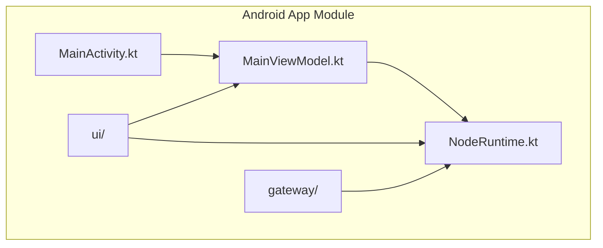
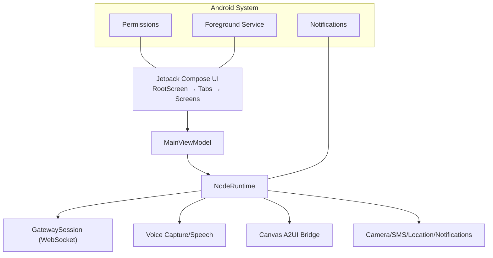
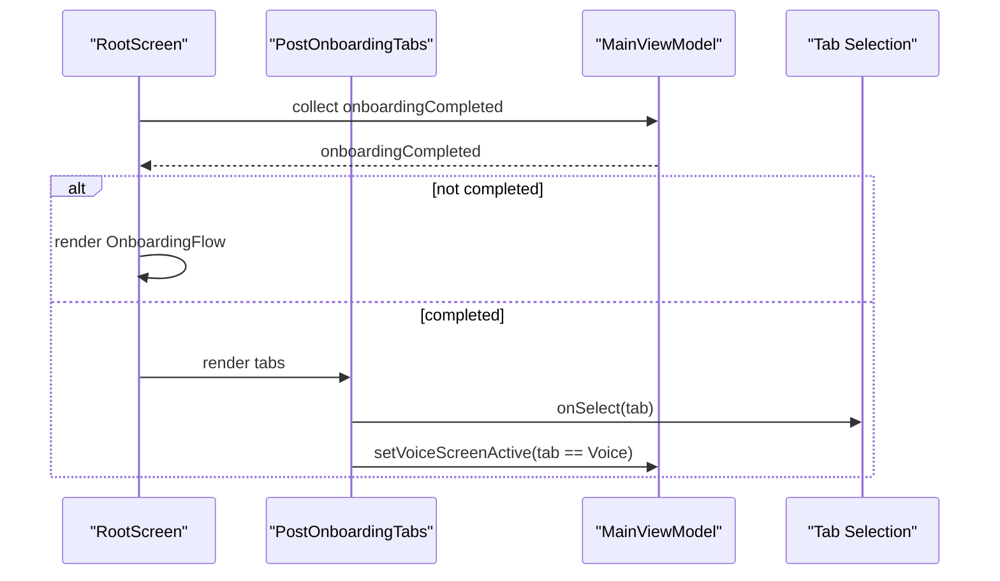
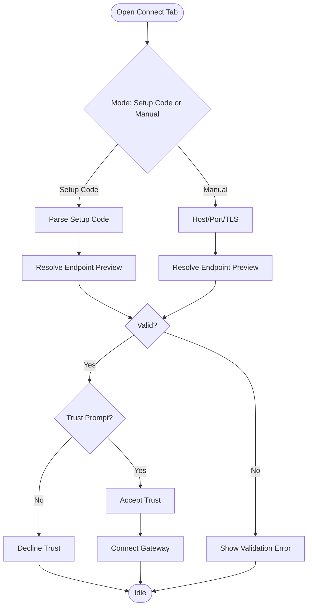
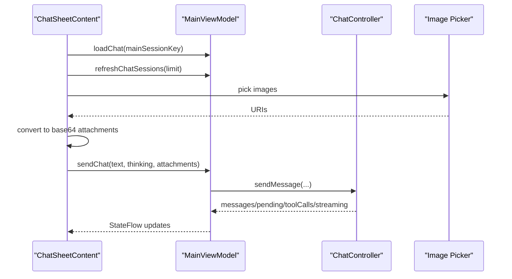
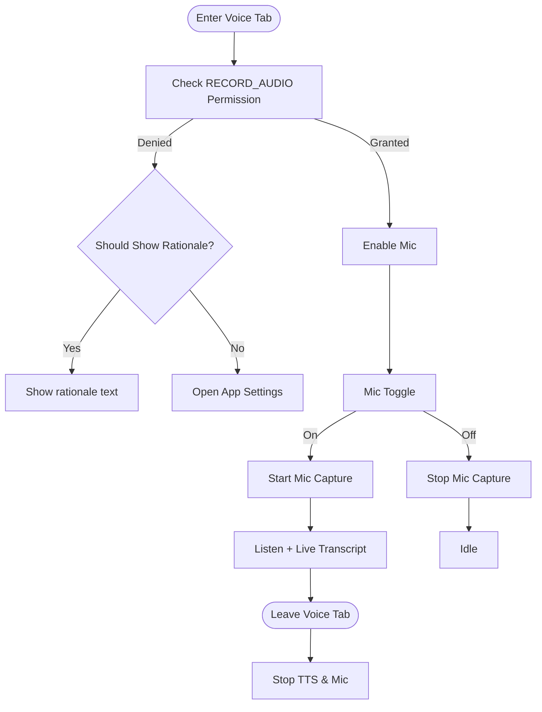
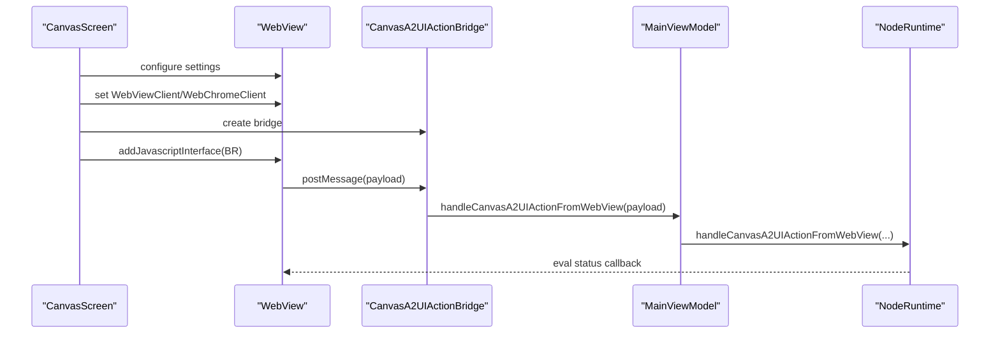
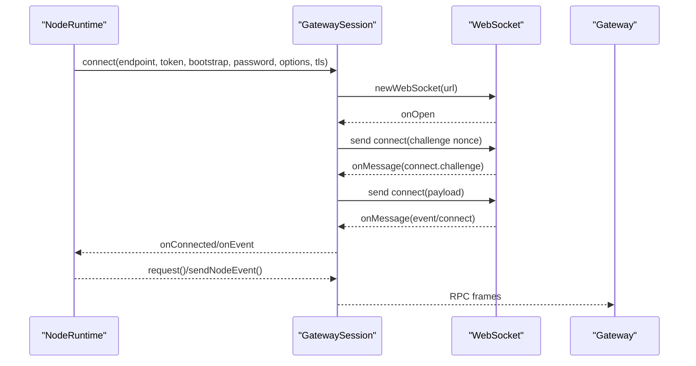
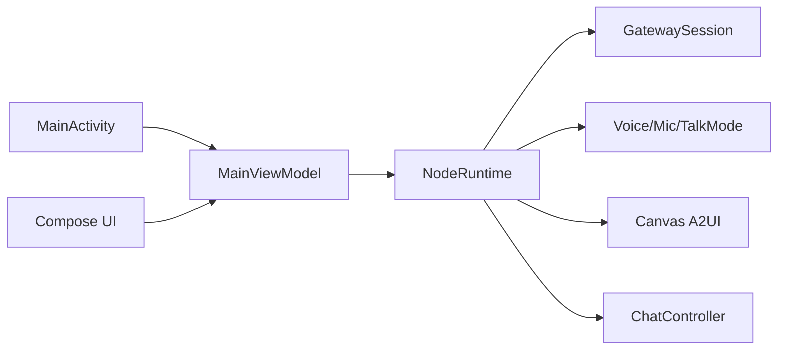

# Android App Architecture

<cite>
**Referenced Files in This Document**
- [MainActivity.kt](file://apps/android/app/src/main/java/ai/openclaw/app/MainActivity.kt)
- [MainViewModel.kt](file://apps/android/app/src/main/java/ai/openclaw/app/MainViewModel.kt)
- [NodeRuntime.kt](file://apps/android/app/src/main/java/ai/openclaw/app/NodeRuntime.kt)
- [RootScreen.kt](file://apps/android/app/src/main/java/ai/openclaw/app/ui/RootScreen.kt)
- [PostOnboardingTabs.kt](file://apps/android/app/src/main/java/ai/openclaw/app/ui/PostOnboardingTabs.kt)
- [ConnectTabScreen.kt](file://apps/android/app/src/main/java/ai/openclaw/app/ui/ConnectTabScreen.kt)
- [ChatSheet.kt](file://apps/android/app/src/main/java/ai/openclaw/app/ui/ChatSheet.kt)
- [ChatSheetContent.kt](file://apps/android/app/src/main/java/ai/openclaw/app/ui/chat/ChatSheetContent.kt)
- [VoiceTabScreen.kt](file://apps/android/app/src/main/java/ai/openclaw/app/ui/VoiceTabScreen.kt)
- [CanvasScreen.kt](file://apps/android/app/src/main/java/ai/openclaw/app/ui/CanvasScreen.kt)
- [GatewaySession.kt](file://apps/android/app/src/main/java/ai/openclaw/app/gateway/GatewaySession.kt)
</cite>

## Table of Contents
1. [Introduction](#introduction)
2. [Project Structure](#project-structure)
3. [Core Components](#core-components)
4. [Architecture Overview](#architecture-overview)
5. [Detailed Component Analysis](#detailed-component-analysis)
6. [Dependency Analysis](#dependency-analysis)
7. [Performance Considerations](#performance-considerations)
8. [Troubleshooting Guide](#troubleshooting-guide)
9. [Conclusion](#conclusion)

## Introduction
This document describes the Android app architecture for OpenClaw’s native Kotlin implementation with Jetpack Compose UI. It covers the app module structure, MVVM with ViewModels and state management, tab-based navigation, integration with Android system services (notifications, permissions, foreground services), lifecycle and background execution considerations, and the integration with the OpenClaw Gateway via WebSocket connections and device pairing mechanisms.

## Project Structure
The Android app module resides under apps/android/app. The main source set is organized around:
- java/ai/openclaw/app: Kotlin application code (activities, ViewModels, runtime, UI, gateway integration)
- res: Android resources (fonts, drawables, layouts, XML)
- AndroidManifest.xml: Android app manifest

**Diagram sources**
- [MainActivity.kt:1-64](file://apps/android/app/src/main/java/ai/openclaw/app/MainActivity.kt#L1-L64)
- [MainViewModel.kt:1-211](file://apps/android/app/src/main/java/ai/openclaw/app/MainViewModel.kt#L1-L211)
- [NodeRuntime.kt:1-120](file://apps/android/app/src/main/java/ai/openclaw/app/NodeRuntime.kt#L1-L120)

**Section sources**
- [MainActivity.kt:1-64](file://apps/android/app/src/main/java/ai/openclaw/app/MainActivity.kt#L1-L64)
- [MainViewModel.kt:1-211](file://apps/android/app/src/main/java/ai/openclaw/app/MainViewModel.kt#L1-L211)
- [NodeRuntime.kt:1-120](file://apps/android/app/src/main/java/ai/openclaw/app/NodeRuntime.kt#L1-L120)

## Core Components
- MainActivity: Sets up Compose UI, attaches permissions, keeps screen awake based on ViewModel state, and starts the foreground service after first frame.
- MainViewModel: Exposes state flows and delegates actions to NodeRuntime, acting as the single source of truth for UI state.
- NodeRuntime: Central runtime orchestrating gateway sessions, voice, camera, SMS, Canvas A2UI, and chat; exposes reactive state flows.
- UI Layer: Jetpack Compose screens and composables for Connect, Chat, Voice, Screen (Canvas), and Settings.

Key responsibilities:
- State exposure: All state is exposed as StateFlow from NodeRuntime and MainViewModel.
- Actions: UI triggers actions via MainViewModel, which forwards to NodeRuntime.
- UI rendering: Composables collect StateFlow and render reactive UI.

**Section sources**
- [MainActivity.kt:18-62](file://apps/android/app/src/main/java/ai/openclaw/app/MainActivity.kt#L18-L62)
- [MainViewModel.kt:13-210](file://apps/android/app/src/main/java/ai/openclaw/app/MainViewModel.kt#L13-L210)
- [NodeRuntime.kt:46-120](file://apps/android/app/src/main/java/ai/openclaw/app/NodeRuntime.kt#L46-L120)

## Architecture Overview
The app follows MVVM with reactive state:
- UI (Jetpack Compose) observes StateFlow from MainViewModel.
- MainViewModel delegates to NodeRuntime for business logic and state updates.
- NodeRuntime manages GatewaySession (WebSocket), voice capture/synthesis, Canvas A2UI, and device integrations.

**Diagram sources**
- [RootScreen.kt:10-20](file://apps/android/app/src/main/java/ai/openclaw/app/ui/RootScreen.kt#L10-L20)
- [PostOnboardingTabs.kt:68-132](file://apps/android/app/src/main/java/ai/openclaw/app/ui/PostOnboardingTabs.kt#L68-L132)
- [GatewaySession.kt:82-91](file://apps/android/app/src/main/java/ai/openclaw/app/gateway/GatewaySession.kt#L82-L91)

## Detailed Component Analysis

### Jetpack Compose UI: Root and Tab Navigation
- RootScreen displays either OnboardingFlow or PostOnboardingTabs based on onboarding state.
- PostOnboardingTabs defines HomeTab enum (Connect, Chat, Voice, Screen, Settings) and renders the active tab.
- Tab selection toggles voice TTS lifecycle and hides the bottom bar when the chat keyboard is visible.

**Diagram sources**
- [RootScreen.kt:10-20](file://apps/android/app/src/main/java/ai/openclaw/app/ui/RootScreen.kt#L10-L20)
- [PostOnboardingTabs.kt:68-132](file://apps/android/app/src/main/java/ai/openclaw/app/ui/PostOnboardingTabs.kt#L68-L132)

**Section sources**
- [RootScreen.kt:10-20](file://apps/android/app/src/main/java/ai/openclaw/app/ui/RootScreen.kt#L10-L20)
- [PostOnboardingTabs.kt:49-132](file://apps/android/app/src/main/java/ai/openclaw/app/ui/PostOnboardingTabs.kt#L49-L132)

### Connect Tab: Gateway Pairing and Connection
- Presents status cards, trust prompt dialog for TLS fingerprints, and two connection modes: Setup Code and Manual.
- Validates inputs, resolves endpoint preview, and triggers connection via MainViewModel.
- Supports manual TLS toggle, token/password fallbacks, and onboarding reset.

**Diagram sources**
- [ConnectTabScreen.kt:61-135](file://apps/android/app/src/main/java/ai/openclaw/app/ui/ConnectTabScreen.kt#L61-L135)
- [ConnectTabScreen.kt:91-121](file://apps/android/app/src/main/java/ai/openclaw/app/ui/ConnectTabScreen.kt#L91-L121)

**Section sources**
- [ConnectTabScreen.kt:61-135](file://apps/android/app/src/main/java/ai/openclaw/app/ui/ConnectTabScreen.kt#L61-L135)
- [ConnectTabScreen.kt:91-121](file://apps/android/app/src/main/java/ai/openclaw/app/ui/ConnectTabScreen.kt#L91-L121)

### Chat Sheet: Messaging and Attachments
- Loads and switches chat sessions, displays messages and pending tool calls, and streams assistant text.
- Provides composer with thinking level control, image attachment picker, send/abort actions.
- Integrates with MainViewModel for state and actions.

**Diagram sources**
- [ChatSheetContent.kt:55-154](file://apps/android/app/src/main/java/ai/openclaw/app/ui/chat/ChatSheetContent.kt#L55-L154)
- [MainViewModel.kt:183-210](file://apps/android/app/src/main/java/ai/openclaw/app/MainViewModel.kt#L183-L210)

**Section sources**
- [ChatSheetContent.kt:55-154](file://apps/android/app/src/main/java/ai/openclaw/app/ui/chat/ChatSheetContent.kt#L55-L154)
- [MainViewModel.kt:183-210](file://apps/android/app/src/main/java/ai/openclaw/app/MainViewModel.kt#L183-L210)

### Voice Tab: Microphone, Audio, and TTS
- Manages microphone permission, live transcript, input level visualization, speaker toggle, and queued messages.
- Handles lifecycle events to stop TTS and mic when leaving the screen.
- Provides a mic button with animated ring feedback proportional to input level.

**Diagram sources**
- [VoiceTabScreen.kt:76-130](file://apps/android/app/src/main/java/ai/openclaw/app/ui/VoiceTabScreen.kt#L76-L130)
- [VoiceTabScreen.kt:256-287](file://apps/android/app/src/main/java/ai/openclaw/app/ui/VoiceTabScreen.kt#L256-L287)

**Section sources**
- [VoiceTabScreen.kt:76-130](file://apps/android/app/src/main/java/ai/openclaw/app/ui/VoiceTabScreen.kt#L76-L130)
- [VoiceTabScreen.kt:256-287](file://apps/android/app/src/main/java/ai/openclaw/app/ui/VoiceTabScreen.kt#L256-L287)

### Screen Tab: Canvas A2UI WebView
- Renders a WebView hosting Canvas and bridges JavaScript actions to NodeRuntime via a named interface.
- Applies WebView settings, error/logging hooks, and cleans up on disposal.

**Diagram sources**
- [CanvasScreen.kt:26-131](file://apps/android/app/src/main/java/ai/openclaw/app/ui/CanvasScreen.kt#L26-L131)
- [NodeRuntime.kt:821-891](file://apps/android/app/src/main/java/ai/openclaw/app/NodeRuntime.kt#L821-L891)

**Section sources**
- [CanvasScreen.kt:26-131](file://apps/android/app/src/main/java/ai/openclaw/app/ui/CanvasScreen.kt#L26-L131)
- [NodeRuntime.kt:821-891](file://apps/android/app/src/main/java/ai/openclaw/app/NodeRuntime.kt#L821-L891)

### Gateway Integration: WebSocket Sessions and Pairing
- GatewaySession encapsulates OkHttp WebSocket connection, RPC request/response, and event dispatch.
- Handles connect challenges, device signatures, and auth retries.
- NodeRuntime composes two GatewaySession instances: operator and node, and routes events to voice, chat, and invoke handlers.

**Diagram sources**
- [GatewaySession.kt:262-458](file://apps/android/app/src/main/java/ai/openclaw/app/gateway/GatewaySession.kt#L262-L458)
- [NodeRuntime.kt:228-300](file://apps/android/app/src/main/java/ai/openclaw/app/NodeRuntime.kt#L228-L300)

**Section sources**
- [GatewaySession.kt:262-458](file://apps/android/app/src/main/java/ai/openclaw/app/gateway/GatewaySession.kt#L262-L458)
- [NodeRuntime.kt:228-300](file://apps/android/app/src/main/java/ai/openclaw/app/NodeRuntime.kt#L228-L300)

## Dependency Analysis
- MainActivity depends on MainViewModel and NodeForegroundService.
- MainViewModel exposes NodeRuntime-managed state and delegates actions.
- NodeRuntime aggregates subsystems (voice, camera, SMS, Canvas, chat) and orchestrates GatewaySession.
- UI composables depend on StateFlow from MainViewModel and call MainViewModel methods.

**Diagram sources**
- [MainActivity.kt:18-52](file://apps/android/app/src/main/java/ai/openclaw/app/MainActivity.kt#L18-L52)
- [MainViewModel.kt:13-63](file://apps/android/app/src/main/java/ai/openclaw/app/MainViewModel.kt#L13-L63)
- [NodeRuntime.kt:46-120](file://apps/android/app/src/main/java/ai/openclaw/app/NodeRuntime.kt#L46-L120)

**Section sources**
- [MainActivity.kt:18-52](file://apps/android/app/src/main/java/ai/openclaw/app/MainActivity.kt#L18-L52)
- [MainViewModel.kt:13-63](file://apps/android/app/src/main/java/ai/openclaw/app/MainViewModel.kt#L13-L63)
- [NodeRuntime.kt:46-120](file://apps/android/app/src/main/java/ai/openclaw/app/NodeRuntime.kt#L46-L120)

## Performance Considerations
- Reactive UI: StateFlow-driven rendering avoids unnecessary recompositions; collect state at the right granularity.
- Background tasks: NodeRuntime uses a SupervisorJob + IO dispatcher; avoid blocking UI threads.
- WebView: Minimal JS and DOM usage; disable dark mode algorithmic darkening for predictable rendering.
- Permissions: Defer microphone enable until permission is granted to reduce churn.
- Network: GatewaySession implements ping intervals and timeouts; backoff on reconnect failures.

[No sources needed since this section provides general guidance]

## Troubleshooting Guide
Common issues and remedies:
- Microphone permission denied: Prompt rationale or open app settings from VoiceTabScreen.
- Gateway TLS trust prompt: Verify fingerprint and accept or decline; declined cancels connection.
- Gateway connection errors: Use “Refresh Gateway Connection” when operator is offline; inspect status text.
- Canvas rehydrate: Request rehydrate when node is offline; retry after reconnect.

**Section sources**
- [VoiceTabScreen.kt:327-351](file://apps/android/app/src/main/java/ai/openclaw/app/ui/VoiceTabScreen.kt#L327-L351)
- [ConnectTabScreen.kt:91-121](file://apps/android/app/src/main/java/ai/openclaw/app/ui/ConnectTabScreen.kt#L91-L121)
- [NodeRuntime.kt:713-743](file://apps/android/app/src/main/java/ai/openclaw/app/NodeRuntime.kt#L713-L743)
- [NodeRuntime.kt:460-509](file://apps/android/app/src/main/java/ai/openclaw/app/NodeRuntime.kt#L460-L509)

## Conclusion
The Android app implements a clean MVVM architecture with Jetpack Compose, reactive state via StateFlow, and robust integration with the OpenClaw Gateway over WebSocket. The runtime coordinates voice, camera, SMS, Canvas A2UI, and chat, while the UI remains responsive and modular through tab-based navigation. Proper handling of permissions, foreground execution, and background constraints ensures a smooth user experience aligned with Android best practices.