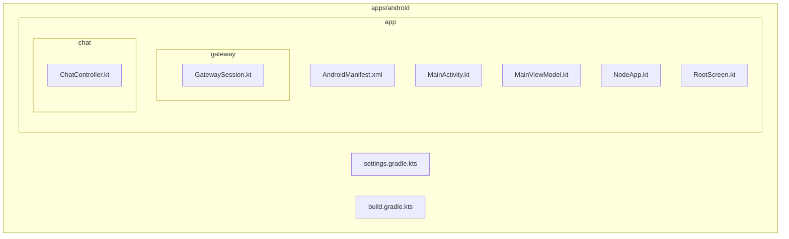
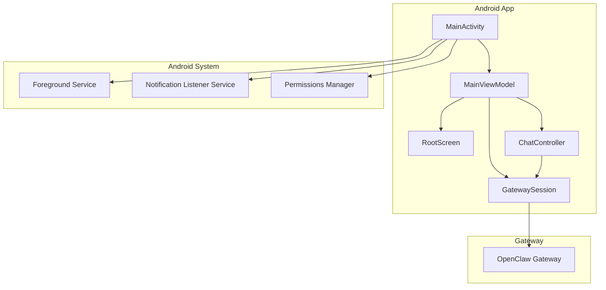
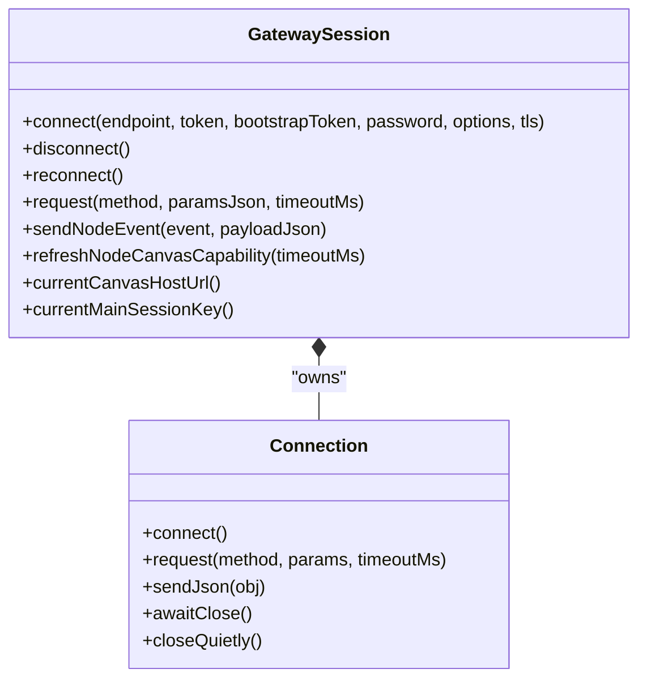
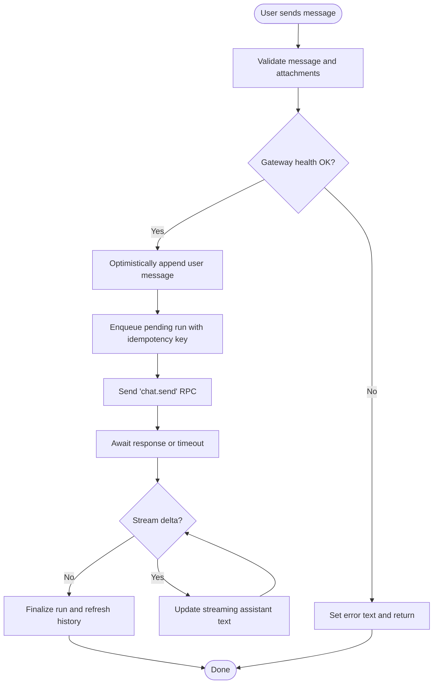
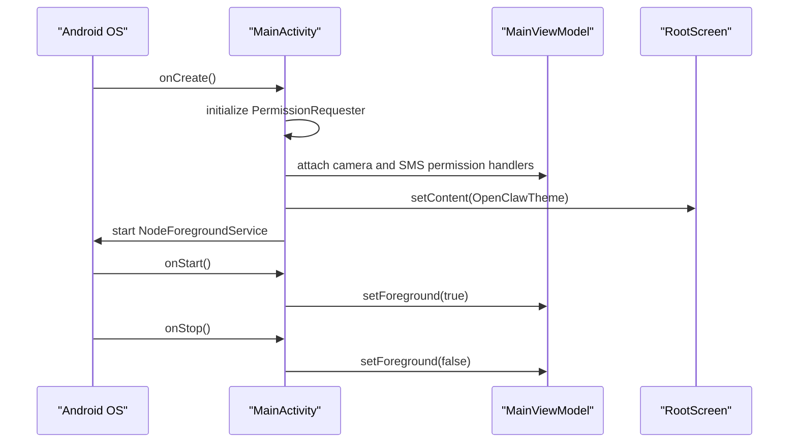
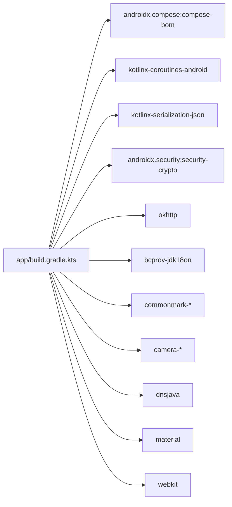

# Android Application

<cite>
**Referenced Files in This Document**
- [README.md](file://apps/android/README.md)
- [settings.gradle.kts](file://apps/android/settings.gradle.kts)
- [build.gradle.kts](file://apps/android/build.gradle.kts)
- [app/build.gradle.kts](file://apps/android/app/build.gradle.kts)
- [AndroidManifest.xml](file://apps/android/app/src/main/AndroidManifest.xml)
- [MainActivity.kt](file://apps/android/app/src/main/java/ai/openclaw/app/MainActivity.kt)
- [MainViewModel.kt](file://apps/android/app/src/main/java/ai/openclaw/app/MainViewModel.kt)
- [NodeApp.kt](file://apps/android/app/src/main/java/ai/openclaw/app/NodeApp.kt)
- [GatewaySession.kt](file://apps/android/app/src/main/java/ai/openclaw/app/gateway/GatewaySession.kt)
- [ChatController.kt](file://apps/android/app/src/main/java/ai/openclaw/app/chat/ChatController.kt)
- [RootScreen.kt](file://apps/android/app/src/main/java/ai/openclaw/app/ui/RootScreen.kt)
</cite>

## Table of Contents
1. [Introduction](#introduction)
2. [Project Structure](#project-structure)
3. [Core Components](#core-components)
4. [Architecture Overview](#architecture-overview)
5. [Detailed Component Analysis](#detailed-component-analysis)
6. [Dependency Analysis](#dependency-analysis)
7. [Performance Considerations](#performance-considerations)
8. [Troubleshooting Guide](#troubleshooting-guide)
9. [Conclusion](#conclusion)
10. [Appendices](#appendices)

## Introduction
This document describes the Android application for OpenClaw’s companion node. The app acts as a long-lived, foreground-connected node that communicates with the OpenClaw Gateway via a WebSocket protocol. It exposes three primary UI tabs—Connect, Chat, and Voice—and integrates Android system services for permissions, notifications, and background connectivity. The app is built with Kotlin, Jetpack Compose, and a modern Gradle Kotlin DSL setup.

## Project Structure
The Android app is organized as a multi-module Gradle project with a single application module and a benchmark module. The app module contains:
- Android manifest and services
- UI scaffold (Compose-based)
- Gateway session and protocol handling
- Chat controller and models
- Runtime orchestration and permissions

**Diagram sources**
- [settings.gradle.kts:1-20](file://apps/android/settings.gradle.kts#L1-L20)
- [build.gradle.kts:1-8](file://apps/android/build.gradle.kts#L1-L8)
- [app/build.gradle.kts:1-263](file://apps/android/app/build.gradle.kts#L1-L263)
- [AndroidManifest.xml:1-78](file://apps/android/app/src/main/AndroidManifest.xml#L1-L78)
- [MainActivity.kt:1-64](file://apps/android/app/src/main/java/ai/openclaw/app/MainActivity.kt#L1-L64)
- [MainViewModel.kt:1-211](file://apps/android/app/src/main/java/ai/openclaw/app/MainViewModel.kt#L1-L211)
- [NodeApp.kt:1-27](file://apps/android/app/src/main/java/ai/openclaw/app/NodeApp.kt#L1-L27)
- [RootScreen.kt:1-21](file://apps/android/app/src/main/java/ai/openclaw/app/ui/RootScreen.kt#L1-L21)
- [GatewaySession.kt:1-966](file://apps/android/app/src/main/java/ai/openclaw/app/gateway/GatewaySession.kt#L1-L966)
- [ChatController.kt:1-538](file://apps/android/app/src/main/java/ai/openclaw/app/chat/ChatController.kt#L1-L538)

**Section sources**
- [settings.gradle.kts:1-20](file://apps/android/settings.gradle.kts#L1-L20)
- [build.gradle.kts:1-8](file://apps/android/build.gradle.kts#L1-L8)
- [app/build.gradle.kts:1-263](file://apps/android/app/build.gradle.kts#L1-L263)
- [AndroidManifest.xml:1-78](file://apps/android/app/src/main/AndroidManifest.xml#L1-L78)

## Core Components
- Application lifecycle and runtime
  - NodeApp initializes the NodeRuntime lazily and enables strict mode in debug builds.
  - MainActivity sets up permissions, keeps the device awake when requested, and starts the foreground service after the first frame.
  - MainViewModel exposes state flows for UI and delegates operations to NodeRuntime.

- Gateway connectivity
  - GatewaySession manages WebSocket connections, authentication negotiation, RPC requests, and event handling. It supports automatic reconnection, device token retries, and TLS configuration.

- Chat
  - ChatController orchestrates chat sessions, message history, streaming assistant text, tool call tracking, and health polling. It integrates with GatewaySession to send messages and subscribe to events.

- UI scaffolding
  - RootScreen renders either the onboarding flow or post-onboarding tabs depending on onboarding state.

**Section sources**
- [NodeApp.kt:1-27](file://apps/android/app/src/main/java/ai/openclaw/app/NodeApp.kt#L1-L27)
- [MainActivity.kt:1-64](file://apps/android/app/src/main/java/ai/openclaw/app/MainActivity.kt#L1-L64)
- [MainViewModel.kt:1-211](file://apps/android/app/src/main/java/ai/openclaw/app/MainViewModel.kt#L1-L211)
- [GatewaySession.kt:1-966](file://apps/android/app/src/main/java/ai/openclaw/app/gateway/GatewaySession.kt#L1-L966)
- [ChatController.kt:1-538](file://apps/android/app/src/main/java/ai/openclaw/app/chat/ChatController.kt#L1-L538)
- [RootScreen.kt:1-21](file://apps/android/app/src/main/java/ai/openclaw/app/ui/RootScreen.kt#L1-L21)

## Architecture Overview
The Android app is a foreground-connected node that:
- Establishes a persistent WebSocket connection to the OpenClaw Gateway
- Authenticates using device identity, stored tokens, or bootstrap/password
- Subscribes to chat and agent events
- Exposes UI tabs for Connect, Chat, and Voice
- Integrates with Android system services for permissions, notifications, and background execution

**Diagram sources**
- [MainActivity.kt:1-64](file://apps/android/app/src/main/java/ai/openclaw/app/MainActivity.kt#L1-L64)
- [MainViewModel.kt:1-211](file://apps/android/app/src/main/java/ai/openclaw/app/MainViewModel.kt#L1-L211)
- [RootScreen.kt:1-21](file://apps/android/app/src/main/java/ai/openclaw/app/ui/RootScreen.kt#L1-L21)
- [GatewaySession.kt:1-966](file://apps/android/app/src/main/java/ai/openclaw/app/gateway/GatewaySession.kt#L1-L966)
- [ChatController.kt:1-538](file://apps/android/app/src/main/java/ai/openclaw/app/chat/ChatController.kt#L1-L538)
- [AndroidManifest.xml:1-78](file://apps/android/app/src/main/AndroidManifest.xml#L1-L78)

## Detailed Component Analysis

### GatewaySession: WebSocket Protocol and Authentication
GatewaySession encapsulates:
- Connection lifecycle and reconnection with exponential backoff
- Authentication negotiation using device identity, stored device tokens, bootstrap tokens, or passwords
- RPC request/response handling with timeouts and pending result management
- Event dispatch for chat, agent, and node.invoke requests
- TLS configuration and hostname verification
- Canvas capability refresh and URL normalization

**Diagram sources**
- [GatewaySession.kt:1-966](file://apps/android/app/src/main/java/ai/openclaw/app/gateway/GatewaySession.kt#L1-L966)

**Section sources**
- [GatewaySession.kt:142-177](file://apps/android/app/src/main/java/ai/openclaw/app/gateway/GatewaySession.kt#L142-L177)
- [GatewaySession.kt:205-217](file://apps/android/app/src/main/java/ai/openclaw/app/gateway/GatewaySession.kt#L205-L217)
- [GatewaySession.kt:219-258](file://apps/android/app/src/main/java/ai/openclaw/app/gateway/GatewaySession.kt#L219-L258)
- [GatewaySession.kt:262-347](file://apps/android/app/src/main/java/ai/openclaw/app/gateway/GatewaySession.kt#L262-L347)
- [GatewaySession.kt:389-458](file://apps/android/app/src/main/java/ai/openclaw/app/gateway/GatewaySession.kt#L389-L458)
- [GatewaySession.kt:553-599](file://apps/android/app/src/main/java/ai/openclaw/app/gateway/GatewaySession.kt#L553-L599)
- [GatewaySession.kt:615-677](file://apps/android/app/src/main/java/ai/openclaw/app/gateway/GatewaySession.kt#L615-L677)
- [GatewaySession.kt:692-746](file://apps/android/app/src/main/java/ai/openclaw/app/gateway/GatewaySession.kt#L692-L746)

### ChatController: Streaming Chat and Sessions
ChatController manages:
- Session selection and switching
- Message history retrieval and streaming assistant text
- Pending tool call tracking
- Health polling and error propagation
- Abort operations for pending runs

**Diagram sources**
- [ChatController.kt:112-204](file://apps/android/app/src/main/java/ai/openclaw/app/chat/ChatController.kt#L112-L204)
- [ChatController.kt:308-349](file://apps/android/app/src/main/java/ai/openclaw/app/chat/ChatController.kt#L308-L349)
- [ChatController.kt:252-278](file://apps/android/app/src/main/java/ai/openclaw/app/chat/ChatController.kt#L252-L278)

**Section sources**
- [ChatController.kt:21-57](file://apps/android/app/src/main/java/ai/openclaw/app/chat/ChatController.kt#L21-L57)
- [ChatController.kt:75-110](file://apps/android/app/src/main/java/ai/openclaw/app/chat/ChatController.kt#L75-L110)
- [ChatController.kt:112-204](file://apps/android/app/src/main/java/ai/openclaw/app/chat/ChatController.kt#L112-L204)
- [ChatController.kt:228-250](file://apps/android/app/src/main/java/ai/openclaw/app/chat/ChatController.kt#L228-L250)
- [ChatController.kt:295-306](file://apps/android/app/src/main/java/ai/openclaw/app/chat/ChatController.kt#L295-L306)

### UI and Lifecycle: RootScreen and MainActivity
- RootScreen conditionally renders OnboardingFlow or PostOnboardingTabs based on onboarding state.
- MainActivity initializes permissions, attaches camera and SMS permission handlers, prevents device sleep when requested, and starts the foreground service after the first frame.

**Diagram sources**
- [MainActivity.kt:22-62](file://apps/android/app/src/main/java/ai/openclaw/app/MainActivity.kt#L22-L62)
- [RootScreen.kt:10-20](file://apps/android/app/src/main/java/ai/openclaw/app/ui/RootScreen.kt#L10-L20)

**Section sources**
- [RootScreen.kt:10-20](file://apps/android/app/src/main/java/ai/openclaw/app/ui/RootScreen.kt#L10-L20)
- [MainActivity.kt:22-62](file://apps/android/app/src/main/java/ai/openclaw/app/MainActivity.kt#L22-L62)

## Dependency Analysis
The app uses a modern Android stack:
- Jetpack Compose for UI
- OkHttp for WebSocket transport
- Kotlin coroutines for concurrency
- Material3 and extended icons for UI components
- CameraX for camera parity with node.invoke camera.* commands
- dnsjava for unicast DNS-SD discovery
- Security crypto for encrypted preferences

**Diagram sources**
- [app/build.gradle.kts:164-216](file://apps/android/app/build.gradle.kts#L164-L216)

**Section sources**
- [app/build.gradle.kts:164-216](file://apps/android/app/build.gradle.kts#L164-L216)

## Performance Considerations
- Startup and iteration
  - Live Edit and Apply Changes are supported for Compose UI and many non-structural changes on devices with minSdk 31.
  - Macrobenchmark tasks and perf scripts are provided for deterministic startup timing and hotspot analysis.
- Build and signing
  - Release builds enable R8 minification and resource shrinking; signing is configured locally via Gradle properties.
- Packaging exclusions
  - Excludes non-essential META-INF files and Kotlin tooling metadata to reduce APK size.

**Section sources**
- [README.md:138-146](file://apps/android/README.md#L138-L146)
- [README.md:63-96](file://apps/android/README.md#L63-L96)
- [app/build.gradle.kts:76-91](file://apps/android/app/build.gradle.kts#L76-L91)
- [app/build.gradle.kts:103-118](file://apps/android/app/build.gradle.kts#L103-L118)

## Troubleshooting Guide
- Connectivity and pairing
  - Ensure the Gateway is running and reachable; approve pairing on the Gateway console.
  - Use Setup Code or Manual mode in the Connect tab; verify trust prompt acceptance.
- Permissions
  - Camera, RECORD_AUDIO, SEND_SMS, READ_MEDIA_* are declared; grant at runtime for features to work.
  - Foreground service notifications require POST_NOTIFICATIONS on Android 13+.
- Background execution and sleep prevention
  - The app can keep the screen on when enabled; ensure the app remains in the foreground for canvas commands.
- Integration capability tests
  - Pre-requisites include a connected node, canvas host availability, and active Screen tab.
- Common failures
  - “pairing required”: approve the latest device pairing request and rerun.
  - “A2UI host not reachable”: ensure canvas host is running and reachable; keep the Screen tab active.
  - “NODE_BACKGROUND_UNAVAILABLE: canvas unavailable”: keep the app foregrounded and Screen tab active.

**Section sources**
- [README.md:147-167](file://apps/android/README.md#L147-L167)
- [README.md:169-178](file://apps/android/README.md#L169-L178)
- [README.md:183-228](file://apps/android/README.md#L183-L228)
- [AndroidManifest.xml:1-78](file://apps/android/app/src/main/AndroidManifest.xml#L1-L78)

## Conclusion
The Android app is a robust, foreground-connected node that integrates tightly with the OpenClaw Gateway over WebSocket. It provides a modern UI with Compose, manages permissions and background services responsibly, and offers streaming chat and device command capabilities. The Gradle Kotlin DSL setup, clear separation of concerns, and comprehensive test coverage support ongoing development and maintenance.

## Appendices

### Build and Installation Procedures
- Build and run debug:
  - Assemble, install, and test debug variants; optionally bundle a signed release after auto-bumping version fields.
- Lint and format:
  - Kotlin lint/format and Android framework resource lint are supported via Gradle tasks and npm scripts.
- Macrobenchmark and perf scripts:
  - Dedicated tasks and scripts for startup benchmarking and hotspot analysis.

**Section sources**
- [README.md:26-60](file://apps/android/README.md#L26-L60)
- [README.md:63-96](file://apps/android/README.md#L63-L96)
- [README.md:97-115](file://apps/android/README.md#L97-L115)

### Android Platform Integration
- Services and permissions
  - Foreground service for data sync, Notification Listener Service, and FileProvider for secure sharing.
- Manifest declarations
  - INTERNET, ACCESS_NETWORK_STATE, FOREGROUND_SERVICE, POST_NOTIFICATIONS, NEARBY_WIFI_DEVICES, ACCESS_FINE_LOCATION, CAMERA, RECORD_AUDIO, SEND_SMS, READ_MEDIA_* and more.

**Section sources**
- [AndroidManifest.xml:1-78](file://apps/android/app/src/main/AndroidManifest.xml#L1-L78)