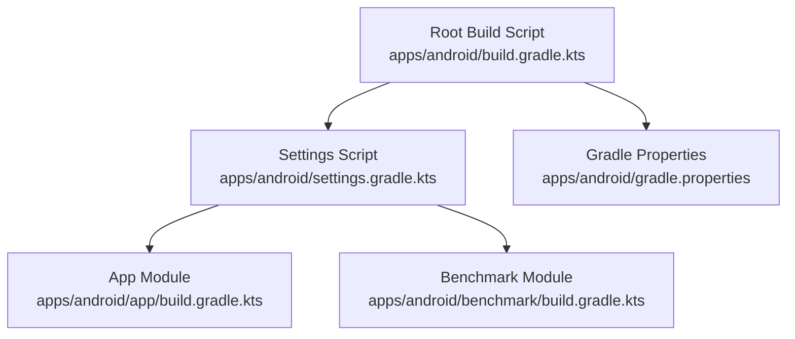
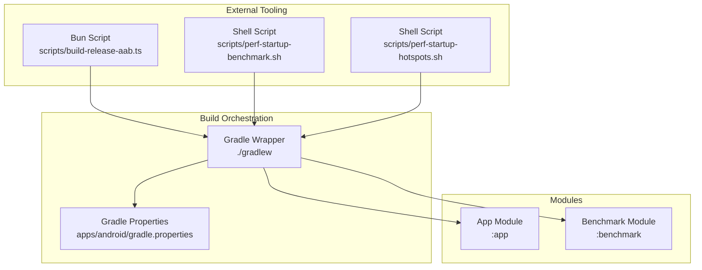
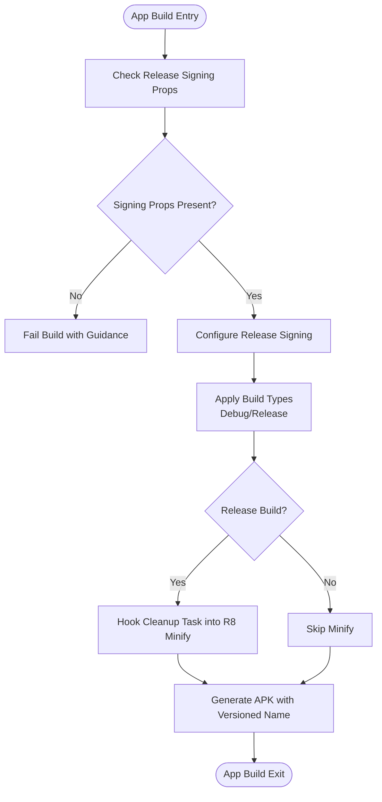
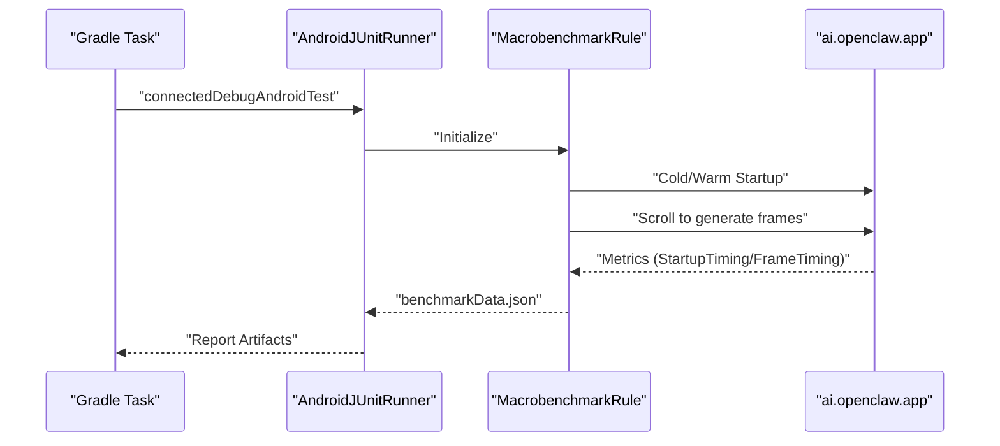
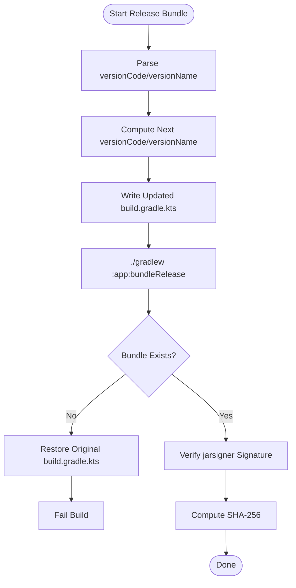
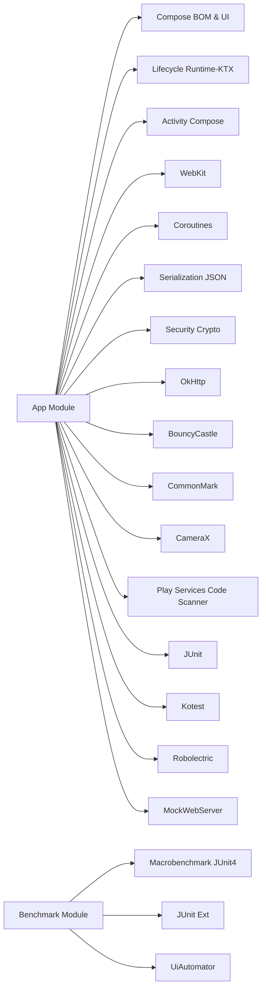

# Android Build System

<cite>
**Referenced Files in This Document**
- [build.gradle.kts](file://apps/android/build.gradle.kts)
- [settings.gradle.kts](file://apps/android/settings.gradle.kts)
- [gradle.properties](file://apps/android/gradle.properties)
- [app/build.gradle.kts](file://apps/android/app/build.gradle.kts)
- [benchmark/build.gradle.kts](file://apps/android/benchmark/build.gradle.kts)
- [StartupMacrobenchmark.kt](file://apps/android/benchmark/src/main/java/ai/openclaw/app/benchmark/StartupMacrobenchmark.kt)
- [build-release-aab.ts](file://apps/android/scripts/build-release-aab.ts)
- [perf-startup-benchmark.sh](file://apps/android/scripts/perf-startup-benchmark.sh)
- [perf-startup-hotspots.sh](file://apps/android/scripts/perf-startup-hotspots.sh)
- [README.md](file://apps/android/README.md)
- [proguard-rules.pro](file://apps/android/app/proguard-rules.pro)
</cite>

## Table of Contents
1. [Introduction](#introduction)
2. [Project Structure](#project-structure)
3. [Core Components](#core-components)
4. [Architecture Overview](#architecture-overview)
5. [Detailed Component Analysis](#detailed-component-analysis)
6. [Dependency Analysis](#dependency-analysis)
7. [Performance Considerations](#performance-considerations)
8. [Troubleshooting Guide](#troubleshooting-guide)
9. [Conclusion](#conclusion)
10. [Appendices](#appendices)

## Introduction
This document explains the Android build system for OpenClaw’s Gradle-based configuration. It covers the Kotlin DSL build scripts for the root and modules, dependency management, build variants, tasks, SDK detection, macrobenchmarking, Kotlin linting/formatting, and the integration with Bun scripts for release bundling. Practical examples and troubleshooting guidance are included to streamline development, testing, and release workflows.

## Project Structure
The Android project is organized as a multi-module Gradle build with:
- Root build configuration applying common plugins and DSL settings
- An application module (:app) containing the Android app sources and build logic
- A benchmark module (:benchmark) for macrobenchmark instrumentation tests
- Scripts for release bundling and performance profiling

**Diagram sources**
- [build.gradle.kts:1-8](file://apps/android/build.gradle.kts#L1-L8)
- [settings.gradle.kts:1-20](file://apps/android/settings.gradle.kts#L1-L20)
- [gradle.properties:1-10](file://apps/android/gradle.properties#L1-L10)
- [app/build.gradle.kts:35-40](file://apps/android/app/build.gradle.kts#L35-L40)
- [benchmark/build.gradle.kts:1-4](file://apps/android/benchmark/build.gradle.kts#L1-L4)

**Section sources**
- [build.gradle.kts:1-8](file://apps/android/build.gradle.kts#L1-L8)
- [settings.gradle.kts:1-20](file://apps/android/settings.gradle.kts#L1-L20)
- [gradle.properties:1-10](file://apps/android/gradle.properties#L1-L10)

## Core Components
- Root plugins and DSL: Declares Android Application/Test plugins, Kotlin Compose and Serialization plugins, and Ktlint for formatting/linting.
- Dependency resolution and repositories: Centralized repository configuration with FAIL_ON_PROJECT_REPOS to enforce managed repositories.
- App module: Defines compile/target SDK, signing configuration, build types, packaging exclusions, lint settings, unit test options, Kotlin compiler options, and Ktlint configuration. Includes custom tasks to post-process merged resources for release.
- Benchmark module: Configures instrumentation runner, targets the app module, enables self-instrumenting tests, and adds benchmark dependencies.
- ProGuard rules: Suppresses benign warnings for selected libraries.

**Section sources**
- [build.gradle.kts:1-8](file://apps/android/build.gradle.kts#L1-L8)
- [settings.gradle.kts:9-15](file://apps/android/settings.gradle.kts#L9-L15)
- [app/build.gradle.kts:42-134](file://apps/android/app/build.gradle.kts#L42-L134)
- [benchmark/build.gradle.kts:6-24](file://apps/android/benchmark/build.gradle.kts#L6-L24)
- [proguard-rules.pro:1-9](file://apps/android/app/proguard-rules.pro#L1-L9)

## Architecture Overview
The build architecture centers on Gradle Kotlin DSL with modularization and external tooling for release and performance.

**Diagram sources**
- [gradle.properties:1-10](file://apps/android/gradle.properties#L1-L10)
- [app/build.gradle.kts:35-40](file://apps/android/app/build.gradle.kts#L35-L40)
- [benchmark/build.gradle.kts:1-4](file://apps/android/benchmark/build.gradle.kts#L1-L4)
- [build-release-aab.ts:1-126](file://apps/android/scripts/build-release-aab.ts#L1-L126)
- [perf-startup-benchmark.sh:1-125](file://apps/android/scripts/perf-startup-benchmark.sh#L1-L125)
- [perf-startup-hotspots.sh:1-155](file://apps/android/scripts/perf-startup-hotspots.sh#L1-L155)

## Detailed Component Analysis

### Root Build Configuration
- Applies Android Application and Test plugins, Kotlin Compose and Serialization plugins, and Ktlint.
- Plugins are applied conditionally false at root level to avoid automatic application; they are applied in modules.

**Section sources**
- [build.gradle.kts:1-8](file://apps/android/build.gradle.kts#L1-L8)

### Settings and Dependency Resolution Management
- Plugin management uses Google, Maven Central, and Gradle Plugin Portal.
- Dependency resolution enforces repositoriesMode.FAIL_ON_PROJECT_REPOS and defines Google/Maven Central.
- Declares project name and includes :app and :benchmark modules.

**Section sources**
- [settings.gradle.kts:1-20](file://apps/android/settings.gradle.kts#L1-L20)

### Gradle Properties
- JVM arguments and warning mode tuning.
- AndroidX migration flag and R8 strictness toggles.
- Enables new DSL for Android Gradle Plugin.

**Section sources**
- [gradle.properties:1-10](file://apps/android/gradle.properties#L1-L10)

### App Module Build Script
- Release signing configuration:
  - Reads keystore and key credentials from Gradle properties.
  - Resolves tilde to user home for store file path.
  - Enforces signing properties for release builds.
- Build types:
  - Release: minification, resource shrinking, debug symbols, ProGuard rules.
  - Debug: no minification.
- Packaging:
  - Excludes non-essential META-INF and tooling files.
- Lint:
  - Disables specific Android and dependency lints, treats warnings as errors.
- Kotlin compiler:
  - JVM target 17, all warnings as errors.
- Ktlint:
  - Android mode, failures halt build, excludes build outputs.
- Dependencies:
  - Compose BOM and UI/tooling/material3.
  - Lifecycle, Activity Compose, WebKit.
  - Coroutines, Kotlinx Serialization, Security Crypto, OkHttp, BouncyCastle, CommonMark.
  - CameraX and Play Services Code Scanner.
  - JUnit, Kotest, Robolectric, MockWebServer for tests.
- Post-processing:
  - Custom task to remove a specific service descriptor from merged Java resources in release.
  - Hooks into R8 minify task to run the cleanup.

**Diagram sources**
- [app/build.gradle.kts:18-33](file://apps/android/app/build.gradle.kts#L18-L33)
- [app/build.gradle.kts:47-91](file://apps/android/app/build.gradle.kts#L47-L91)
- [app/build.gradle.kts:222-262](file://apps/android/app/build.gradle.kts#L222-L262)

**Section sources**
- [app/build.gradle.kts:18-33](file://apps/android/app/build.gradle.kts#L18-L33)
- [app/build.gradle.kts:47-91](file://apps/android/app/build.gradle.kts#L47-L91)
- [app/build.gradle.kts:103-118](file://apps/android/app/build.gradle.kts#L103-L118)
- [app/build.gradle.kts:120-129](file://apps/android/app/build.gradle.kts#L120-L129)
- [app/build.gradle.kts:149-154](file://apps/android/app/build.gradle.kts#L149-L154)
- [app/build.gradle.kts:156-162](file://apps/android/app/build.gradle.kts#L156-L162)
- [app/build.gradle.kts:164-216](file://apps/android/app/build.gradle.kts#L164-L216)
- [app/build.gradle.kts:222-262](file://apps/android/app/build.gradle.kts#L222-L262)

### Benchmark Module Build Script
- Test plugin and Ktlint applied.
- Instrumentation runner configured with benchmark suppressions.
- Targets the app module and enables self-instrumenting tests.
- Compile options set to Java 17.
- Dependencies include Macrobenchmark JUnit4, JUnit ext, and uiautomator.

**Section sources**
- [benchmark/build.gradle.kts:1-4](file://apps/android/benchmark/build.gradle.kts#L1-L4)
- [benchmark/build.gradle.kts:10-18](file://apps/android/benchmark/build.gradle.kts#L10-L18)
- [benchmark/build.gradle.kts:20-23](file://apps/android/benchmark/build.gradle.kts#L20-L23)
- [benchmark/build.gradle.kts:41-45](file://apps/android/benchmark/build.gradle.kts#L41-L45)

### Macrobenchmark Implementation
- Cold start and frame timing benchmarks using MacrobenchmarkRule.
- Uses StartupTimingMetric and FrameTimingMetric.
- Iterations configured to 10; scrolls vertically to exercise UI.
- Graceful skipping on known device limitations.

**Diagram sources**
- [benchmark/build.gradle.kts:13-18](file://apps/android/benchmark/build.gradle.kts#L13-L18)
- [StartupMacrobenchmark.kt:23-37](file://apps/android/benchmark/src/main/java/ai/openclaw/app/benchmark/StartupMacrobenchmark.kt#L23-L37)
- [StartupMacrobenchmark.kt:40-59](file://apps/android/benchmark/src/main/java/ai/openclaw/app/benchmark/StartupMacrobenchmark.kt#L40-L59)

**Section sources**
- [StartupMacrobenchmark.kt:16-76](file://apps/android/benchmark/src/main/java/ai/openclaw/app/benchmark/StartupMacrobenchmark.kt#L16-L76)

### Release Bundling with Bun Script
- Automatically bumps versionName and versionCode in the app build script.
- Writes updated build.gradle.kts, invokes Gradle to produce a signed .aab, verifies jarsigner signature, computes SHA-256, and restores original file on failure.

**Diagram sources**
- [build-release-aab.ts:36-79](file://apps/android/scripts/build-release-aab.ts#L36-L79)
- [build-release-aab.ts:106-123](file://apps/android/scripts/build-release-aab.ts#L106-L123)

**Section sources**
- [build-release-aab.ts:1-126](file://apps/android/scripts/build-release-aab.ts#L1-L126)

### Performance Benchmarking Scripts
- perf-startup-benchmark.sh
  - Runs only the coldStartup macrobenchmark.
  - Captures benchmarkData.json, writes timestamped snapshot under benchmark/results/.
  - Computes median/min/max/COV and optionally compares against a baseline.
- perf-startup-hotspots.sh
  - Installs debug app, captures simpleperf data for MainActivity startup.
  - Produces CSV reports for DSO and symbols, and highlights app-path clues.

**Section sources**
- [perf-startup-benchmark.sh:1-125](file://apps/android/scripts/perf-startup-benchmark.sh#L1-L125)
- [perf-startup-hotspots.sh:1-155](file://apps/android/scripts/perf-startup-hotspots.sh#L1-L155)

## Dependency Analysis
- App module depends on Compose BOM and UI/tooling/material3, lifecycle/runtime-ktx, Activity Compose, WebKit, coroutines, serialization, security-crypto, OkHttp, BouncyCastle, CommonMark, CameraX, and Play Services Code Scanner.
- Test dependencies include JUnit, Kotest, Robolectric, and MockWebServer.
- Benchmark module depends on Macrobenchmark JUnit4, JUnit ext, and uiautomator.

**Diagram sources**
- [app/build.gradle.kts:164-216](file://apps/android/app/build.gradle.kts#L164-L216)
- [benchmark/build.gradle.kts:41-45](file://apps/android/benchmark/build.gradle.kts#L41-L45)

**Section sources**
- [app/build.gradle.kts:164-216](file://apps/android/app/build.gradle.kts#L164-L216)
- [benchmark/build.gradle.kts:41-45](file://apps/android/benchmark/build.gradle.kts#L41-L45)

## Performance Considerations
- Macrobenchmarking:
  - Cold start and scroll frame timing metrics collected with 10 iterations.
  - Device-specific skips for known issues.
- Profiling:
  - simpleperf capture for startup hotspots with DSO and symbol breakdown.
  - Optional output path for raw perf.data.
- Build-time optimizations:
  - Minification and resource shrinking for release builds.
  - Exclusions reduce bundle size and improve build times.

**Section sources**
- [StartupMacrobenchmark.kt:23-59](file://apps/android/benchmark/src/main/java/ai/openclaw/app/benchmark/StartupMacrobenchmark.kt#L23-L59)
- [perf-startup-hotspots.sh:104-139](file://apps/android/scripts/perf-startup-hotspots.sh#L104-L139)
- [app/build.gradle.kts:81-86](file://apps/android/app/build.gradle.kts#L81-L86)
- [app/build.gradle.kts:103-118](file://apps/android/app/build.gradle.kts#L103-L118)

## Troubleshooting Guide
- Missing Android SDK:
  - Gradle auto-detects the Android SDK at a macOS default path if ANDROID_SDK_ROOT and ANDROID_HOME are unset.
- Release signing:
  - If release build is requested without proper keystore credentials, the build fails with guidance to set Gradle properties.
- Macrobenchmark failures:
  - Known device limitations cause specific exceptions; the benchmark gracefully skips on recognized conditions.
- adb connectivity:
  - Ensure adb sees at least one device; otherwise, performance scripts exit with guidance.
- simpleperf availability:
  - Ensure ANDROID_NDK_HOME or ANDROID_NDK_ROOT points to a valid NDK with simpleperf, or install under the default macOS SDK path.

**Section sources**
- [README.md:61-61](file://apps/android/README.md#L61-L61)
- [app/build.gradle.kts:27-33](file://apps/android/app/build.gradle.kts#L27-L33)
- [StartupMacrobenchmark.kt:62-75](file://apps/android/benchmark/src/main/java/ai/openclaw/app/benchmark/StartupMacrobenchmark.kt#L62-L75)
- [perf-startup-benchmark.sh:49-53](file://apps/android/scripts/perf-startup-benchmark.sh#L49-L53)
- [perf-startup-hotspots.sh:72-87](file://apps/android/scripts/perf-startup-hotspots.sh#L72-L87)

## Conclusion
OpenClaw’s Android build system leverages modern Gradle Kotlin DSL, modular design, and integrated tooling to deliver efficient development, testing, and release workflows. The configuration emphasizes reproducible releases, robust linting/formatting, and actionable performance insights through macrobenchmarking and profiling scripts.

## Appendices

### Build Tasks Overview
- assembleDebug: Builds the debug APK for the app module.
- installDebug: Installs the debug APK on a connected device.
- testDebugUnitTest: Executes unit tests for the app module.
- connectedDebugAndroidTest: Runs instrumentation tests on connected devices for the benchmark module.
- bundleRelease: Generates a signed release Android App Bundle (.aab) via Gradle.

Practical examples:
- Building and installing debug:
  - cd apps/android && ./gradlew :app:assembleDebug :app:installDebug
- Running unit tests:
  - cd apps/android && ./gradlew :app:testDebugUnitTest
- Running macrobenchmark:
  - cd apps/android && ./gradlew :benchmark:connectedDebugAndroidTest
- Releasing with auto-bumped version and verification:
  - bun run android:bundle:release

Linting and formatting:
- Direct Gradle tasks:
  - cd apps/android && ./gradlew :app:ktlintCheck :benchmark:ktlintCheck
  - cd apps/android && ./gradlew :app:ktlintFormat :benchmark:ktlintFormat
  - cd apps/android && ./gradlew :app:lintDebug

SDK detection:
- If ANDROID_SDK_ROOT and ANDROID_HOME are unset, Gradle auto-detects the Android SDK at a macOS default path.

**Section sources**
- [README.md:26-60](file://apps/android/README.md#L26-L60)
- [README.md:61-61](file://apps/android/README.md#L61-L61)
- [README.md:39-60](file://apps/android/README.md#L39-L60)