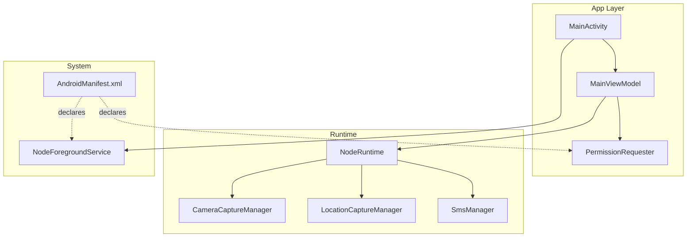
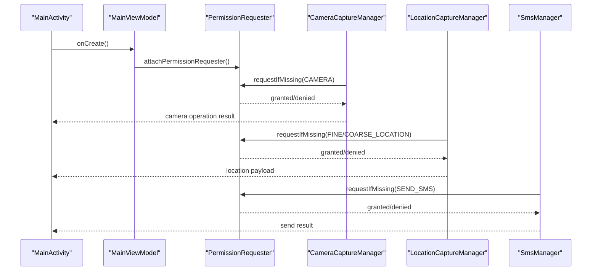
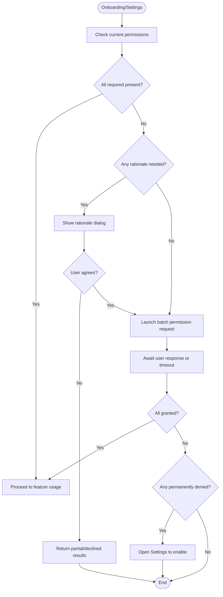
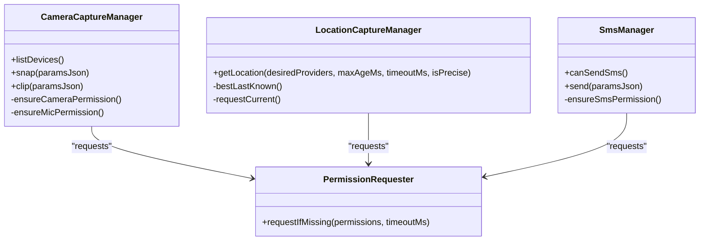
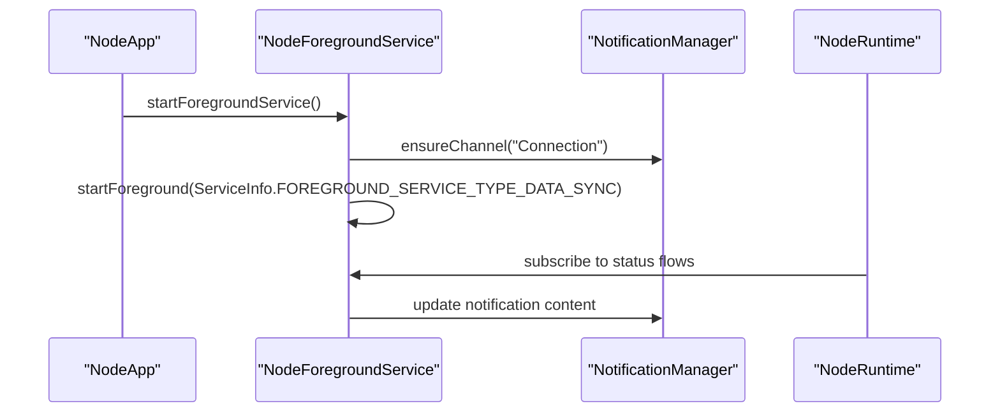
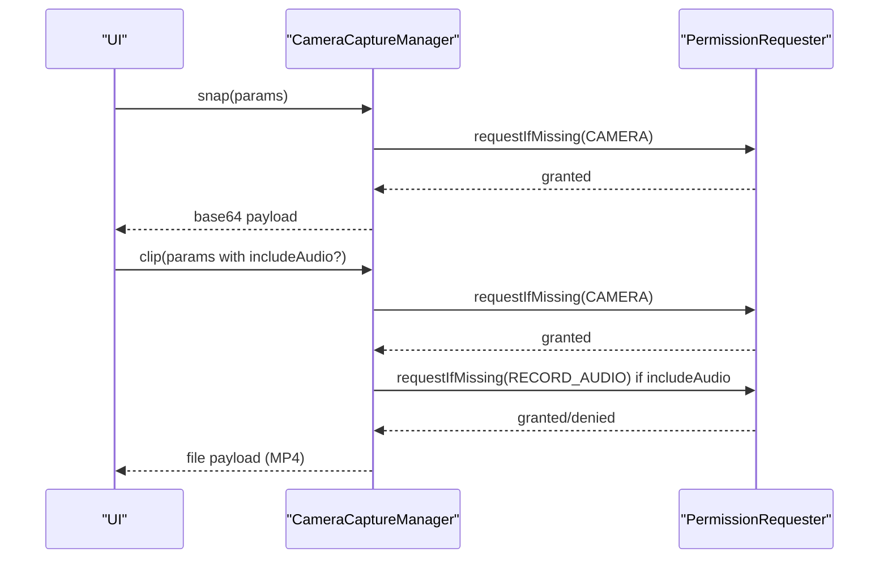
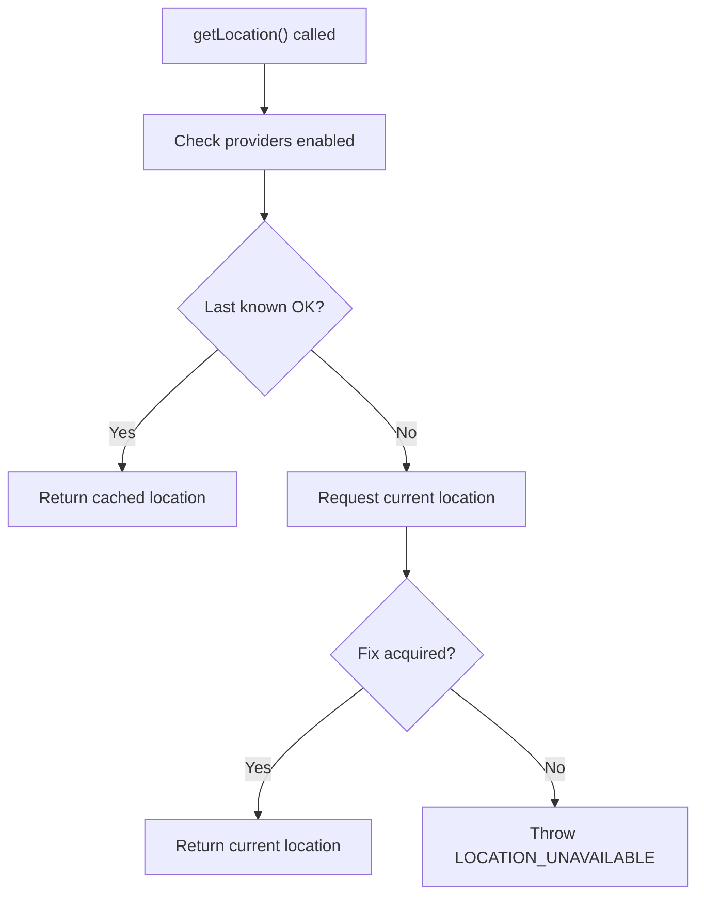
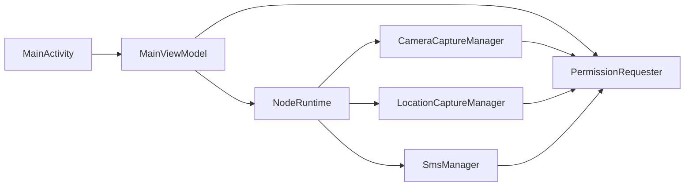

# Device Capabilities & Permissions

<cite>
**Referenced Files in This Document**
- [AndroidManifest.xml](file://apps/android/app/src/main/AndroidManifest.xml)
- [PermissionRequester.kt](file://apps/android/app/src/main/java/ai/openclaw/app/PermissionRequester.kt)
- [MainActivity.kt](file://apps/android/app/src/main/java/ai/openclaw/app/MainActivity.kt)
- [MainViewModel.kt](file://apps/android/app/src/main/java/ai/openclaw/app/MainViewModel.kt)
- [NodeRuntime.kt](file://apps/android/app/src/main/java/ai/openclaw/app/NodeRuntime.kt)
- [NodeForegroundService.kt](file://apps/android/app/src/main/java/ai/openclaw/app/NodeForegroundService.kt)
- [CameraCaptureManager.kt](file://apps/android/app/src/main/java/ai/openclaw/app/node/CameraCaptureManager.kt)
- [SmsManager.kt](file://apps/android/app/src/main/java/ai/openclaw/app/node/SmsManager.kt)
- [LocationCaptureManager.kt](file://apps/android/app/src/main/java/ai/openclaw/app/node/LocationCaptureManager.kt)
- [README.md](file://apps/android/README.md)
</cite>

## Table of Contents
1. [Introduction](#introduction)
2. [Project Structure](#project-structure)
3. [Core Components](#core-components)
4. [Architecture Overview](#architecture-overview)
5. [Detailed Component Analysis](#detailed-component-analysis)
6. [Dependency Analysis](#dependency-analysis)
7. [Performance Considerations](#performance-considerations)
8. [Troubleshooting Guide](#troubleshooting-guide)
9. [Conclusion](#conclusion)

## Introduction
This document explains Android device capabilities and permissions required by the OpenClaw Android app. It covers the permission model for discovery, notifications, camera, microphone/audio, and location; runtime permission handling during onboarding and settings; device capability detection; and integration with Android system services such as notification channels, background execution limits, and battery optimization exemptions. Practical examples and fallback handling for different Android versions are included, along with troubleshooting guidance for common permission-related issues.

## Project Structure
The Android app is organized around a modular runtime and UI layer:
- Permission orchestration and UI lifecycle are coordinated in the main activity and a shared permission requester.
- The runtime manages connectivity, discovery, camera, location, SMS, and A2UI.
- Services integrate with Android’s notification system for persistent status.

**Diagram sources**
- [MainActivity.kt:18-64](file://apps/android/app/src/main/java/ai/openclaw/app/MainActivity.kt#L18-L64)
- [MainViewModel.kt:13-211](file://apps/android/app/src/main/java/ai/openclaw/app/MainViewModel.kt#L13-L211)
- [PermissionRequester.kt:22-134](file://apps/android/app/src/main/java/ai/openclaw/app/PermissionRequester.kt#L22-L134)
- [NodeRuntime.kt:46-1177](file://apps/android/app/src/main/java/ai/openclaw/app/NodeRuntime.kt#L46-L1177)
- [CameraCaptureManager.kt:44-420](file://apps/android/app/src/main/java/ai/openclaw/app/node/CameraCaptureManager.kt#L44-L420)
- [LocationCaptureManager.kt:19-118](file://apps/android/app/src/main/java/ai/openclaw/app/node/LocationCaptureManager.kt#L19-L118)
- [SmsManager.kt:20-231](file://apps/android/app/src/main/java/ai/openclaw/app/node/SmsManager.kt#L20-L231)
- [NodeForegroundService.kt:20-159](file://apps/android/app/src/main/java/ai/openclaw/app/NodeForegroundService.kt#L20-L159)
- [AndroidManifest.xml:1-78](file://apps/android/app/src/main/AndroidManifest.xml#L1-L78)

**Section sources**
- [MainActivity.kt:18-64](file://apps/android/app/src/main/java/ai/openclaw/app/MainActivity.kt#L18-L64)
- [MainViewModel.kt:13-211](file://apps/android/app/src/main/java/ai/openclaw/app/MainViewModel.kt#L13-L211)
- [PermissionRequester.kt:22-134](file://apps/android/app/src/main/java/ai/openclaw/app/PermissionRequester.kt#L22-L134)
- [NodeRuntime.kt:46-1177](file://apps/android/app/src/main/java/ai/openclaw/app/NodeRuntime.kt#L46-L1177)
- [NodeForegroundService.kt:20-159](file://apps/android/app/src/main/java/ai/openclaw/app/NodeForegroundService.kt#L20-L159)
- [AndroidManifest.xml:1-78](file://apps/android/app/src/main/AndroidManifest.xml#L1-L78)

## Core Components
- PermissionRequester: Centralized runtime permission flow with rationale dialog, batch request, and settings fallback.
- MainActivity: Initializes PermissionRequester and attaches it to managers that require permissions.
- NodeRuntime: Orchestrates discovery, camera, location, SMS, and A2UI; exposes capability flags and state.
- CameraCaptureManager: Handles camera snap and clip with optional audio; requests camera and microphone permissions.
- LocationCaptureManager: Provides location retrieval with permission checks and provider availability.
- SmsManager: Validates telephony feature and permission; sends SMS via Android APIs.
- NodeForegroundService: Creates a persistent notification channel and updates connection status.

**Section sources**
- [PermissionRequester.kt:22-134](file://apps/android/app/src/main/java/ai/openclaw/app/PermissionRequester.kt#L22-L134)
- [MainActivity.kt:18-64](file://apps/android/app/src/main/java/ai/openclaw/app/MainActivity.kt#L18-L64)
- [NodeRuntime.kt:46-1177](file://apps/android/app/src/main/java/ai/openclaw/app/NodeRuntime.kt#L46-L1177)
- [CameraCaptureManager.kt:44-420](file://apps/android/app/src/main/java/ai/openclaw/app/node/CameraCaptureManager.kt#L44-L420)
- [LocationCaptureManager.kt:19-118](file://apps/android/app/src/main/java/ai/openclaw/app/node/LocationCaptureManager.kt#L19-L118)
- [SmsManager.kt:20-231](file://apps/android/app/src/main/java/ai/openclaw/app/node/SmsManager.kt#L20-L231)
- [NodeForegroundService.kt:20-159](file://apps/android/app/src/main/java/ai/openclaw/app/NodeForegroundService.kt#L20-L159)

## Architecture Overview
The permission model and runtime flows are integrated as follows:
- Discovery: Uses NEARBY_WIFI_DEVICES on Android 13+ and ACCESS_FINE_LOCATION for NSD scanning on Android 12 and below.
- Foreground service notifications: Requires POST_NOTIFICATIONS on Android 13+.
- Camera and audio: CAMERA for camera.snap/camera.clip; RECORD_AUDIO for audio when includeAudio=true.
- Location: ACCESS_FINE_LOCATION and ACCESS_COARSE_LOCATION for geolocation commands.
- Runtime handling: PermissionRequester coordinates permission checks and user prompts; managers enforce permission gating before invoking system APIs.

**Diagram sources**
- [MainActivity.kt:18-64](file://apps/android/app/src/main/java/ai/openclaw/app/MainActivity.kt#L18-L64)
- [MainViewModel.kt:13-211](file://apps/android/app/src/main/java/ai/openclaw/app/MainViewModel.kt#L13-L211)
- [PermissionRequester.kt:22-134](file://apps/android/app/src/main/java/ai/openclaw/app/PermissionRequester.kt#L22-L134)
- [CameraCaptureManager.kt:73-95](file://apps/android/app/src/main/java/ai/openclaw/app/node/CameraCaptureManager.kt#L73-L95)
- [LocationCaptureManager.kt:64-116](file://apps/android/app/src/main/java/ai/openclaw/app/node/LocationCaptureManager.kt#L64-L116)
- [SmsManager.kt:204-209](file://apps/android/app/src/main/java/ai/openclaw/app/node/SmsManager.kt#L204-L209)

## Detailed Component Analysis

### Permission Model and Android Version Handling
- Discovery:
  - Android 13+: NEARBY_WIFI_DEVICES for Wi-Fi-based discovery.
  - Android 12 and below: ACCESS_FINE_LOCATION required for NSD scanning.
- Foreground service notifications (Android 13+): POST_NOTIFICATIONS.
- Camera:
  - CAMERA for camera.snap and camera.clip.
  - RECORD_AUDIO for camera.clip when includeAudio=true.
- Location:
  - ACCESS_FINE_LOCATION and ACCESS_COARSE_LOCATION for geolocation commands.
- Manifest declarations and feature flags:
  - CAMERA hardware feature declared as not required.
  - Telephony feature declared as not required.

Practical examples:
- Discovery permission request: [PermissionRequester.kt:33-85](file://apps/android/app/src/main/java/ai/openclaw/app/PermissionRequester.kt#L33-L85)
- Camera permission gating: [CameraCaptureManager.kt:73-95](file://apps/android/app/src/main/java/ai/openclaw/app/node/CameraCaptureManager.kt#L73-L95)
- Location permission gating: [LocationCaptureManager.kt:64-116](file://apps/android/app/src/main/java/ai/openclaw/app/node/LocationCaptureManager.kt#L64-L116)
- SMS permission gating: [SmsManager.kt:204-209](file://apps/android/app/src/main/java/ai/openclaw/app/node/SmsManager.kt#L204-L209)
- Manifest declarations: [AndroidManifest.xml:1-32](file://apps/android/app/src/main/AndroidManifest.xml#L1-L32)

**Section sources**
- [README.md:169-178](file://apps/android/README.md#L169-L178)
- [AndroidManifest.xml:1-32](file://apps/android/app/src/main/AndroidManifest.xml#L1-L32)
- [PermissionRequester.kt:33-85](file://apps/android/app/src/main/java/ai/openclaw/app/PermissionRequester.kt#L33-L85)
- [CameraCaptureManager.kt:73-95](file://apps/android/app/src/main/java/ai/openclaw/app/node/CameraCaptureManager.kt#L73-L95)
- [LocationCaptureManager.kt:64-116](file://apps/android/app/src/main/java/ai/openclaw/app/node/LocationCaptureManager.kt#L64-L116)
- [SmsManager.kt:204-209](file://apps/android/app/src/main/java/ai/openclaw/app/node/SmsManager.kt#L204-L209)

### Runtime Permission Handling During Onboarding and Settings
- MainActivity initializes PermissionRequester and attaches it to camera and SMS managers.
- PermissionRequester:
  - Filters missing permissions.
  - Shows rationale dialog when needed.
  - Launches batch permission request.
  - Times out after a configured duration.
  - Opens Settings for permanently denied permissions.
- Managers enforce permission checks before invoking system APIs.

**Diagram sources**
- [MainActivity.kt:18-64](file://apps/android/app/src/main/java/ai/openclaw/app/MainActivity.kt#L18-L64)
- [PermissionRequester.kt:22-134](file://apps/android/app/src/main/java/ai/openclaw/app/PermissionRequester.kt#L22-L134)

**Section sources**
- [MainActivity.kt:18-64](file://apps/android/app/src/main/java/ai/openclaw/app/MainActivity.kt#L18-L64)
- [PermissionRequester.kt:22-134](file://apps/android/app/src/main/java/ai/openclaw/app/PermissionRequester.kt#L22-L134)

### Device Capability Detection and Feature Availability
- Camera:
  - Lists available cameras and selects front/back or external based on parameters.
  - Applies EXIF orientation and scales/compresses images for payload size limits.
- Location:
  - Uses last known location if fresh enough; otherwise requests current location with timeout.
  - Validates provider availability and permission grants.
- SMS:
  - Checks telephony feature availability and SEND_SMS permission.
  - Splits long messages into multipart SMS when needed.

**Diagram sources**
- [CameraCaptureManager.kt:44-420](file://apps/android/app/src/main/java/ai/openclaw/app/node/CameraCaptureManager.kt#L44-L420)
- [LocationCaptureManager.kt:19-118](file://apps/android/app/src/main/java/ai/openclaw/app/node/LocationCaptureManager.kt#L19-L118)
- [SmsManager.kt:20-231](file://apps/android/app/src/main/java/ai/openclaw/app/node/SmsManager.kt#L20-L231)
- [PermissionRequester.kt:22-134](file://apps/android/app/src/main/java/ai/openclaw/app/PermissionRequester.kt#L22-L134)

**Section sources**
- [CameraCaptureManager.kt:65-160](file://apps/android/app/src/main/java/ai/openclaw/app/node/CameraCaptureManager.kt#L65-L160)
- [LocationCaptureManager.kt:22-62](file://apps/android/app/src/main/java/ai/openclaw/app/node/LocationCaptureManager.kt#L22-L62)
- [SmsManager.kt:124-130](file://apps/android/app/src/main/java/ai/openclaw/app/node/SmsManager.kt#L124-L130)

### Integration with Android System Services
- Notification Channel:
  - NodeForegroundService creates a low-importance channel named “Connection”.
  - Starts foreground with FOREGROUND_SERVICE_TYPE_DATA_SYNC.
- Background Execution Limits and Battery Optimization:
  - The app runs a persistent foreground service to maintain connectivity.
  - Recommendation: Advise users to whitelist the app from battery optimization for uninterrupted operation.
- File Provider:
  - Declared in manifest for secure file sharing.

**Diagram sources**
- [NodeForegroundService.kt:20-159](file://apps/android/app/src/main/java/ai/openclaw/app/NodeForegroundService.kt#L20-L159)
- [NodeRuntime.kt:46-1177](file://apps/android/app/src/main/java/ai/openclaw/app/NodeRuntime.kt#L46-L1177)

**Section sources**
- [NodeForegroundService.kt:79-138](file://apps/android/app/src/main/java/ai/openclaw/app/NodeForegroundService.kt#L79-L138)
- [AndroidManifest.xml:44-65](file://apps/android/app/src/main/AndroidManifest.xml#L44-L65)

### Camera Integration for camera.snap and camera.clip
- camera.snap:
  - Requests CAMERA permission.
  - Selects camera by facing or device ID.
  - Captures JPEG with EXIF orientation handling and optional scaling/compression.
- camera.clip:
  - Requests CAMERA and optionally RECORD_AUDIO.
  - Binds preview and video capture to lifecycle.
  - Records MP4 with optional audio; enforces quality and duration constraints.

**Diagram sources**
- [CameraCaptureManager.kt:97-160](file://apps/android/app/src/main/java/ai/openclaw/app/node/CameraCaptureManager.kt#L97-L160)
- [CameraCaptureManager.kt:162-266](file://apps/android/app/src/main/java/ai/openclaw/app/node/CameraCaptureManager.kt#L162-L266)
- [PermissionRequester.kt:33-85](file://apps/android/app/src/main/java/ai/openclaw/app/PermissionRequester.kt#L33-L85)

**Section sources**
- [CameraCaptureManager.kt:97-160](file://apps/android/app/src/main/java/ai/openclaw/app/node/CameraCaptureManager.kt#L97-L160)
- [CameraCaptureManager.kt:162-266](file://apps/android/app/src/main/java/ai/openclaw/app/node/CameraCaptureManager.kt#L162-L266)

### Location Services Integration for Geolocation Commands
- Validates that at least one location provider is enabled.
- Attempts best last known location within max age.
- Falls back to requesting current location with timeout.
- Throws descriptive errors when permissions or providers are missing.

**Diagram sources**
- [LocationCaptureManager.kt:22-62](file://apps/android/app/src/main/java/ai/openclaw/app/node/LocationCaptureManager.kt#L22-L62)
- [LocationCaptureManager.kt:86-116](file://apps/android/app/src/main/java/ai/openclaw/app/node/LocationCaptureManager.kt#L86-L116)

**Section sources**
- [LocationCaptureManager.kt:22-62](file://apps/android/app/src/main/java/ai/openclaw/app/node/LocationCaptureManager.kt#L22-L62)
- [LocationCaptureManager.kt:86-116](file://apps/android/app/src/main/java/ai/openclaw/app/node/LocationCaptureManager.kt#L86-L116)

### Practical Examples and Fallback Handling
- Permission request example paths:
  - Batch request with rationale and settings fallback: [PermissionRequester.kt:33-114](file://apps/android/app/src/main/java/ai/openclaw/app/PermissionRequester.kt#L33-L114)
- Capability checks:
  - Camera permission gating: [CameraCaptureManager.kt:73-95](file://apps/android/app/src/main/java/ai/openclaw/app/node/CameraCaptureManager.kt#L73-L95)
  - Location permission gating: [LocationCaptureManager.kt:64-116](file://apps/android/app/src/main/java/ai/openclaw/app/node/LocationCaptureManager.kt#L64-L116)
  - SMS permission gating: [SmsManager.kt:204-209](file://apps/android/app/src/main/java/ai/openclaw/app/node/SmsManager.kt#L204-L209)
- Android version-specific discovery:
  - NEARBY_WIFI_DEVICES on Android 13+: [AndroidManifest.xml:7-9](file://apps/android/app/src/main/AndroidManifest.xml#L7-L9)
  - ACCESS_FINE_LOCATION for NSD on Android 12 and below: [AndroidManifest.xml:10-10](file://apps/android/app/src/main/AndroidManifest.xml#L10-L10)
  - POST_NOTIFICATIONS for foreground service notifications on Android 13+: [AndroidManifest.xml:6-6](file://apps/android/app/src/main/AndroidManifest.xml#L6-L6)

**Section sources**
- [PermissionRequester.kt:33-114](file://apps/android/app/src/main/java/ai/openclaw/app/PermissionRequester.kt#L33-L114)
- [CameraCaptureManager.kt:73-95](file://apps/android/app/src/main/java/ai/openclaw/app/node/CameraCaptureManager.kt#L73-L95)
- [LocationCaptureManager.kt:64-116](file://apps/android/app/src/main/java/ai/openclaw/app/node/LocationCaptureManager.kt#L64-L116)
- [SmsManager.kt:204-209](file://apps/android/app/src/main/java/ai/openclaw/app/node/SmsManager.kt#L204-L209)
- [AndroidManifest.xml:6-10](file://apps/android/app/src/main/AndroidManifest.xml#L6-L10)

## Dependency Analysis
- Coupling:
  - MainActivity depends on MainViewModel and PermissionRequester.
  - MainViewModel exposes managers (camera, location, sms) and delegates permission attachment.
  - NodeRuntime composes managers and handlers; managers depend on PermissionRequester.
- Cohesion:
  - PermissionRequester encapsulates permission flow logic.
  - Managers encapsulate feature-specific permission checks and system calls.
- External dependencies:
  - AndroidX CameraX for camera operations.
  - Android Location APIs for geolocation.
  - Android Telephony APIs for SMS.

**Diagram sources**
- [MainActivity.kt:18-64](file://apps/android/app/src/main/java/ai/openclaw/app/MainActivity.kt#L18-L64)
- [MainViewModel.kt:13-211](file://apps/android/app/src/main/java/ai/openclaw/app/MainViewModel.kt#L13-L211)
- [PermissionRequester.kt:22-134](file://apps/android/app/src/main/java/ai/openclaw/app/PermissionRequester.kt#L22-L134)
- [NodeRuntime.kt:46-1177](file://apps/android/app/src/main/java/ai/openclaw/app/NodeRuntime.kt#L46-L1177)
- [CameraCaptureManager.kt:44-420](file://apps/android/app/src/main/java/ai/openclaw/app/node/CameraCaptureManager.kt#L44-L420)
- [LocationCaptureManager.kt:19-118](file://apps/android/app/src/main/java/ai/openclaw/app/node/LocationCaptureManager.kt#L19-L118)
- [SmsManager.kt:20-231](file://apps/android/app/src/main/java/ai/openclaw/app/node/SmsManager.kt#L20-L231)

**Section sources**
- [MainActivity.kt:18-64](file://apps/android/app/src/main/java/ai/openclaw/app/MainActivity.kt#L18-L64)
- [MainViewModel.kt:13-211](file://apps/android/app/src/main/java/ai/openclaw/app/MainViewModel.kt#L13-L211)
- [PermissionRequester.kt:22-134](file://apps/android/app/src/main/java/ai/openclaw/app/PermissionRequester.kt#L22-L134)
- [NodeRuntime.kt:46-1177](file://apps/android/app/src/main/java/ai/openclaw/app/NodeRuntime.kt#L46-L1177)
- [CameraCaptureManager.kt:44-420](file://apps/android/app/src/main/java/ai/openclaw/app/node/CameraCaptureManager.kt#L44-L420)
- [LocationCaptureManager.kt:19-118](file://apps/android/app/src/main/java/ai/openclaw/app/node/LocationCaptureManager.kt#L19-L118)
- [SmsManager.kt:20-231](file://apps/android/app/src/main/java/ai/openclaw/app/node/SmsManager.kt#L20-L231)

## Performance Considerations
- Camera:
  - Prefer lowest quality for clips to reduce file size and bandwidth.
  - Warm up camera pipeline briefly before recording to avoid initialization delays.
- Location:
  - Use last known location when fresh to minimize latency and power usage.
  - Set reasonable timeouts for current location requests.
- Foreground service:
  - Keeps the app responsive and reduces OS restrictions on background work.

[No sources needed since this section provides general guidance]

## Troubleshooting Guide
- Permission denied during onboarding:
  - Rationale dialog appears when needed; user can deny and be directed to Settings.
  - Paths: [PermissionRequester.kt:87-114](file://apps/android/app/src/main/java/ai/openclaw/app/PermissionRequester.kt#L87-L114)
- Camera not working:
  - Ensure CAMERA permission granted; verify device has a camera (hardware feature not required).
  - Paths: [CameraCaptureManager.kt:73-95](file://apps/android/app/src/main/java/ai/openclaw/app/node/CameraCaptureManager.kt#L73-L95)
- Audio recording disabled:
  - RECORD_AUDIO required for camera.clip when includeAudio=true.
  - Paths: [CameraCaptureManager.kt:162-172](file://apps/android/app/src/main/java/ai/openclaw/app/node/CameraCaptureManager.kt#L162-L172)
- Location services unavailable:
  - Enable GPS/network providers and grant location permissions.
  - Paths: [LocationCaptureManager.kt:30-34](file://apps/android/app/src/main/java/ai/openclaw/app/node/LocationCaptureManager.kt#L30-L34), [LocationCaptureManager.kt:64-116](file://apps/android/app/src/main/java/ai/openclaw/app/node/LocationCaptureManager.kt#L64-L116)
- SMS not sending:
  - Check telephony feature availability and SEND_SMS permission.
  - Paths: [SmsManager.kt:124-130](file://apps/android/app/src/main/java/ai/openclaw/app/node/SmsManager.kt#L124-L130), [SmsManager.kt:204-209](file://apps/android/app/src/main/java/ai/openclaw/app/node/SmsManager.kt#L204-L209)
- Foreground service not visible:
  - Ensure POST_NOTIFICATIONS permission on Android 13+ and notification channel created.
  - Paths: [AndroidManifest.xml:6-6](file://apps/android/app/src/main/AndroidManifest.xml#L6-L6), [NodeForegroundService.kt:79-91](file://apps/android/app/src/main/java/ai/openclaw/app/NodeForegroundService.kt#L79-L91)

**Section sources**
- [PermissionRequester.kt:87-114](file://apps/android/app/src/main/java/ai/openclaw/app/PermissionRequester.kt#L87-L114)
- [CameraCaptureManager.kt:73-95](file://apps/android/app/src/main/java/ai/openclaw/app/node/CameraCaptureManager.kt#L73-L95)
- [CameraCaptureManager.kt:162-172](file://apps/android/app/src/main/java/ai/openclaw/app/node/CameraCaptureManager.kt#L162-L172)
- [LocationCaptureManager.kt:30-34](file://apps/android/app/src/main/java/ai/openclaw/app/node/LocationCaptureManager.kt#L30-L34)
- [LocationCaptureManager.kt:64-116](file://apps/android/app/src/main/java/ai/openclaw/app/node/LocationCaptureManager.kt#L64-L116)
- [SmsManager.kt:124-130](file://apps/android/app/src/main/java/ai/openclaw/app/node/SmsManager.kt#L124-L130)
- [SmsManager.kt:204-209](file://apps/android/app/src/main/java/ai/openclaw/app/node/SmsManager.kt#L204-L209)
- [AndroidManifest.xml:6-6](file://apps/android/app/src/main/AndroidManifest.xml#L6-L6)
- [NodeForegroundService.kt:79-91](file://apps/android/app/src/main/java/ai/openclaw/app/NodeForegroundService.kt#L79-L91)

## Conclusion
The OpenClaw Android app implements a robust permission model aligned with Android 13+ and earlier platform differences. PermissionRequester centralizes runtime permission handling, while managers enforce capability checks before accessing sensitive APIs. The app integrates with Android’s notification system and uses foreground services to maintain reliable connectivity. By following the guidance here, developers can implement consistent onboarding and settings flows, handle version-specific behaviors, and troubleshoot common permission-related issues.