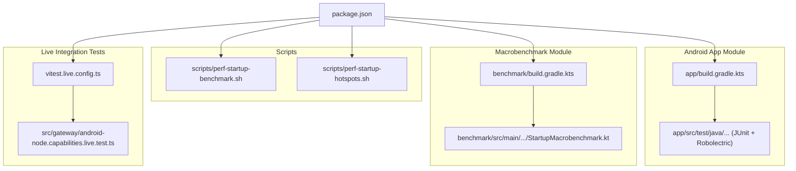
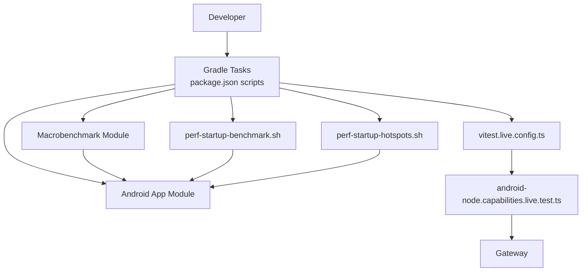
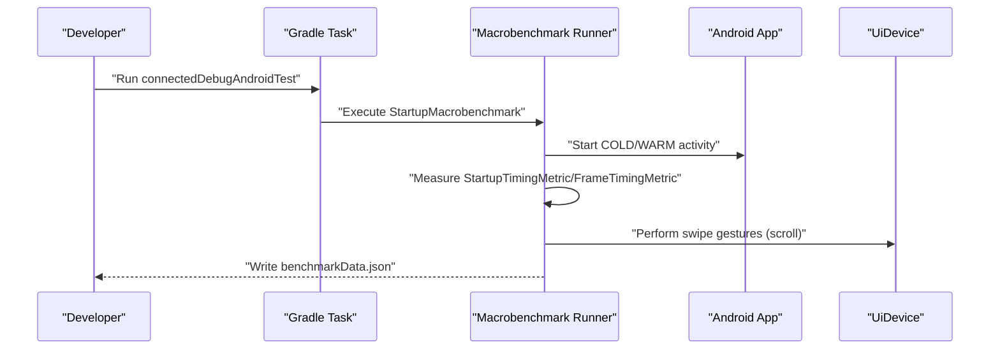
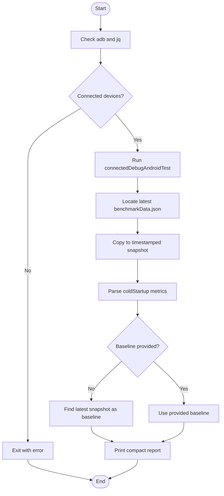
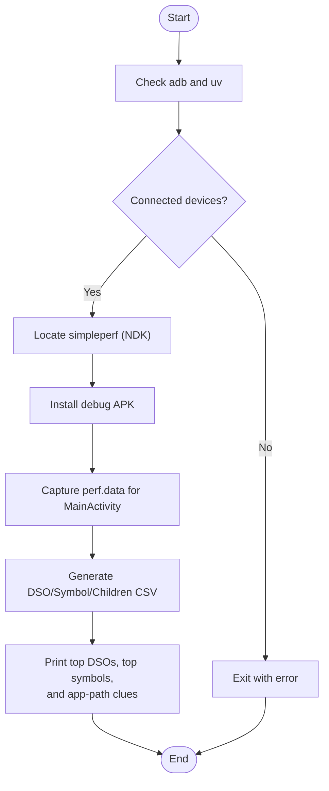
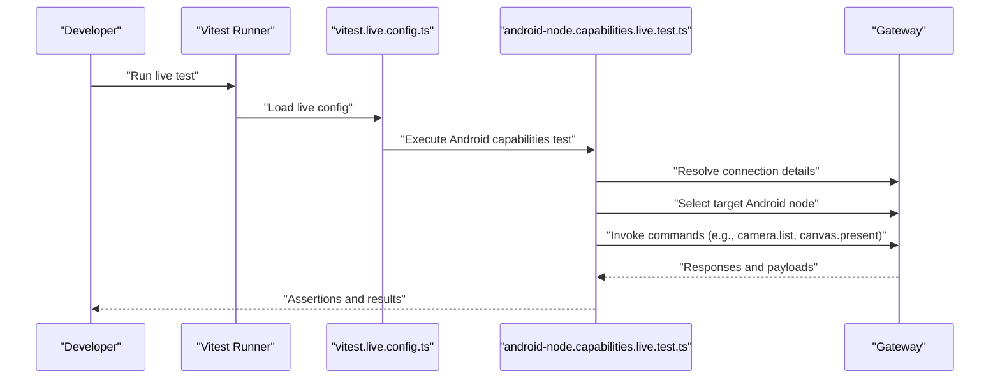
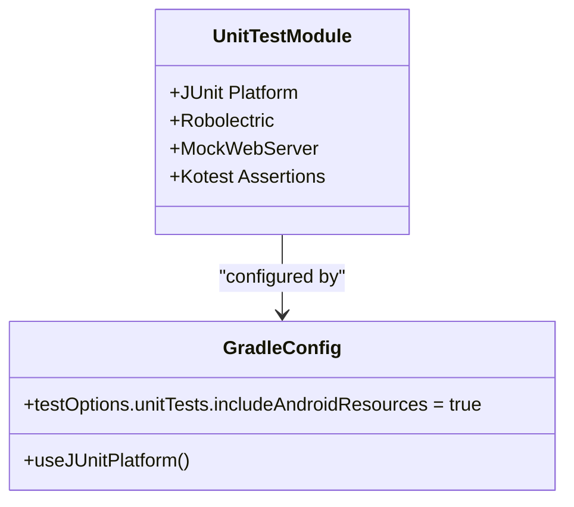
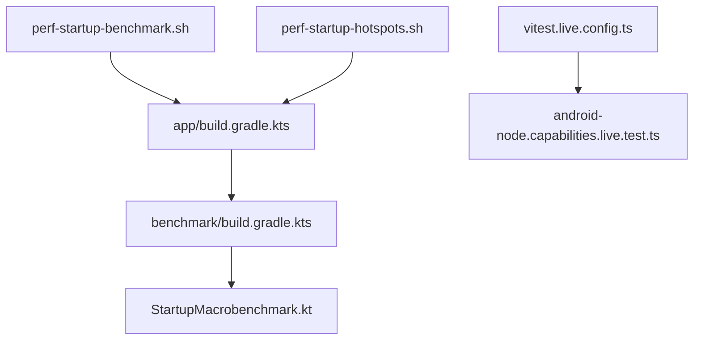

# Testing & Debugging

<cite>
**Referenced Files in This Document**
- [apps/android/README.md](file://apps/android/README.md)
- [apps/android/app/build.gradle.kts](file://apps/android/app/build.gradle.kts)
- [apps/android/benchmark/build.gradle.kts](file://apps/android/benchmark/build.gradle.kts)
- [apps/android/benchmark/src/main/java/ai/openclaw/app/benchmark/StartupMacrobenchmark.kt](file://apps/android/benchmark/src/main/java/ai/openclaw/app/benchmark/StartupMacrobenchmark.kt)
- [apps/android/scripts/perf-startup-benchmark.sh](file://apps/android/scripts/perf-startup-benchmark.sh)
- [apps/android/scripts/perf-startup-hotspots.sh](file://apps/android/scripts/perf-startup-hotspots.sh)
- [package.json](file://package.json)
- [src/gateway/android-node.capabilities.live.test.ts](file://src/gateway/android-node.capabilities.live.test.ts)
- [vitest.live.config.ts](file://vitest.live.config.ts)
</cite>

## Table of Contents
1. [Introduction](#introduction)
2. [Project Structure](#project-structure)
3. [Core Components](#core-components)
4. [Architecture Overview](#architecture-overview)
5. [Detailed Component Analysis](#detailed-component-analysis)
6. [Dependency Analysis](#dependency-analysis)
7. [Performance Considerations](#performance-considerations)
8. [Troubleshooting Guide](#troubleshooting-guide)
9. [Conclusion](#conclusion)

## Introduction
This document describes OpenClaw’s Android testing and debugging strategy. It covers:
- Unit and instrumentation testing with JUnit and Robolectric
- Integration capability tests for Android nodes
- Macrobenchmark testing for startup and frame timing
- Performance CLI tools for deterministic startup and hotspot extraction
- USB-only gateway testing via adb reverse
- Hot reload and fast iteration workflows
- ADB device verification and real device testing
- Practical examples for running tests, interpreting benchmark reports, and troubleshooting common issues

## Project Structure
The Android app module and related testing/performance tooling are organized as follows:
- Android app module with unit tests and Robolectric resources
- Macrobenchmark module for startup and frame timing tests
- Scripts for deterministic performance measurement and CPU hotspots
- Live integration tests for Android node capabilities
- Package scripts to orchestrate Android tasks and live tests

**Diagram sources**
- [apps/android/app/build.gradle.kts:131-134](file://apps/android/app/build.gradle.kts#L131-L134)
- [apps/android/benchmark/build.gradle.kts:6-24](file://apps/android/benchmark/build.gradle.kts#L6-L24)
- [apps/android/benchmark/src/main/java/ai/openclaw/app/benchmark/StartupMacrobenchmark.kt:1-77](file://apps/android/benchmark/src/main/java/ai/openclaw/app/benchmark/StartupMacrobenchmark.kt#L1-L77)
- [apps/android/scripts/perf-startup-benchmark.sh:1-125](file://apps/android/scripts/perf-startup-benchmark.sh#L1-L125)
- [apps/android/scripts/perf-startup-hotspots.sh:1-155](file://apps/android/scripts/perf-startup-hotspots.sh#L1-L155)
- [package.json:214-224](file://package.json#L214-L224)
- [vitest.live.config.ts:1-17](file://vitest.live.config.ts#L1-L17)
- [src/gateway/android-node.capabilities.live.test.ts:1-234](file://src/gateway/android-node.capabilities.live.test.ts#L1-L234)

**Section sources**
- [apps/android/README.md:26-96](file://apps/android/README.md#L26-L96)
- [apps/android/app/build.gradle.kts:131-134](file://apps/android/app/build.gradle.kts#L131-L134)
- [apps/android/benchmark/build.gradle.kts:6-24](file://apps/android/benchmark/build.gradle.kts#L6-L24)
- [apps/android/scripts/perf-startup-benchmark.sh:1-125](file://apps/android/scripts/perf-startup-benchmark.sh#L1-L125)
- [apps/android/scripts/perf-startup-hotspots.sh:1-155](file://apps/android/scripts/perf-startup-hotspots.sh#L1-L155)
- [package.json:214-224](file://package.json#L214-L224)
- [vitest.live.config.ts:1-17](file://vitest.live.config.ts#L1-L17)
- [src/gateway/android-node.capabilities.live.test.ts:1-234](file://src/gateway/android-node.capabilities.live.test.ts#L1-L234)

## Core Components
- Unit testing with JUnit and Robolectric
  - Unit tests configured with Android resource inclusion and JUnit Platform
  - Dependencies include Robolectric and MockWebServer for controlled environments
- Instrumentation testing with Macrobenchmark
  - Cold startup and frame timing metrics using Macrobenchmark
  - Self-instrumenting target module and runner arguments
- Performance CLI tools
  - Deterministic cold-start benchmarking with compact reporting and baseline comparison
  - CPU hotspots extraction via simpleperf and CSV summarization
- Integration capability tests (preconditioned)
  - Live test suite that invokes Android node commands and validates outcomes
  - Environment overrides for gateway connection and node selection
- Fast iteration and hot reload
  - Live Edit for Compose UI, Apply Changes for non-structural code, full reinstall for structural changes

**Section sources**
- [apps/android/app/build.gradle.kts:131-134](file://apps/android/app/build.gradle.kts#L131-L134)
- [apps/android/app/build.gradle.kts:209-216](file://apps/android/app/build.gradle.kts#L209-L216)
- [apps/android/benchmark/build.gradle.kts:10-18](file://apps/android/benchmark/build.gradle.kts#L10-L18)
- [apps/android/benchmark/src/main/java/ai/openclaw/app/benchmark/StartupMacrobenchmark.kt:23-60](file://apps/android/benchmark/src/main/java/ai/openclaw/app/benchmark/StartupMacrobenchmark.kt#L23-L60)
- [apps/android/scripts/perf-startup-benchmark.sh:62-98](file://apps/android/scripts/perf-startup-benchmark.sh#L62-L98)
- [apps/android/scripts/perf-startup-hotspots.sh:104-155](file://apps/android/scripts/perf-startup-hotspots.sh#L104-L155)
- [apps/android/README.md:138-146](file://apps/android/README.md#L138-L146)
- [apps/android/README.md:179-228](file://apps/android/README.md#L179-L228)
- [package.json:222-223](file://package.json#L222-L223)

## Architecture Overview
The Android testing and performance tooling integrates with the broader OpenClaw ecosystem as follows:
- Android app module exposes unit and instrumentation tests
- Macrobenchmark module targets the app for startup and frame timing
- Live integration tests run outside the Android app module, invoking commands on connected Android nodes
- Scripts automate deterministic performance runs and CPU profiling

**Diagram sources**
- [package.json:214-224](file://package.json#L214-L224)
- [apps/android/app/build.gradle.kts:131-134](file://apps/android/app/build.gradle.kts#L131-L134)
- [apps/android/benchmark/build.gradle.kts:6-24](file://apps/android/benchmark/build.gradle.kts#L6-L24)
- [apps/android/scripts/perf-startup-benchmark.sh:62-98](file://apps/android/scripts/perf-startup-benchmark.sh#L62-L98)
- [apps/android/scripts/perf-startup-hotspots.sh:104-155](file://apps/android/scripts/perf-startup-hotspots.sh#L104-L155)
- [vitest.live.config.ts:1-17](file://vitest.live.config.ts#L1-L17)
- [src/gateway/android-node.capabilities.live.test.ts:236-257](file://src/gateway/android-node.capabilities.live.test.ts#L236-L257)

## Detailed Component Analysis

### Macrobenchmark Testing (Startup and Frame Timing)
The macrobenchmark module measures cold startup and scroll frame timing on the Android app. It uses:
- MacrobenchmarkRule for measurement
- StartupTimingMetric and FrameTimingMetric
- Self-instrumenting target and suppressions for device compatibility

**Diagram sources**
- [apps/android/benchmark/src/main/java/ai/openclaw/app/benchmark/StartupMacrobenchmark.kt:23-60](file://apps/android/benchmark/src/main/java/ai/openclaw/app/benchmark/StartupMacrobenchmark.kt#L23-L60)
- [apps/android/benchmark/build.gradle.kts:10-18](file://apps/android/benchmark/build.gradle.kts#L10-L18)

**Section sources**
- [apps/android/benchmark/src/main/java/ai/openclaw/app/benchmark/StartupMacrobenchmark.kt:16-77](file://apps/android/benchmark/src/main/java/ai/openclaw/app/benchmark/StartupMacrobenchmark.kt#L16-L77)
- [apps/android/benchmark/build.gradle.kts:6-24](file://apps/android/benchmark/build.gradle.kts#L6-L24)

### Performance CLI: Deterministic Startup Benchmark
The startup benchmark script:
- Runs only the cold startup macrobenchmark
- Prints median/min/max/COV and device info
- Saves a timestamped snapshot JSON
- Compares against a baseline (auto or explicit)

**Diagram sources**
- [apps/android/scripts/perf-startup-benchmark.sh:39-98](file://apps/android/scripts/perf-startup-benchmark.sh#L39-L98)

**Section sources**
- [apps/android/scripts/perf-startup-benchmark.sh:1-125](file://apps/android/scripts/perf-startup-benchmark.sh#L1-L125)
- [apps/android/README.md:74-96](file://apps/android/README.md#L74-L96)

### Performance CLI: CPU Hotspots Extraction
The hotspots script:
- Installs debug app, captures CPU profile via simpleperf
- Generates CSV summaries by DSO and symbol
- Extracts children to highlight app-path clues

**Diagram sources**
- [apps/android/scripts/perf-startup-hotspots.sh:52-155](file://apps/android/scripts/perf-startup-hotspots.sh#L52-L155)

**Section sources**
- [apps/android/scripts/perf-startup-hotspots.sh:1-155](file://apps/android/scripts/perf-startup-hotspots.sh#L1-L155)
- [apps/android/README.md:74-96](file://apps/android/README.md#L74-L96)

### Integration Capability Test Suite (Preconditioned)
The live integration test suite:
- Requires manual preconditioning (gateway running, app paired, foreground, permissions)
- Reads advertised commands from the selected Android node
- Invokes non-interactive commands and asserts deterministic outcomes
- Supports environment overrides for gateway URL/token/password and node selection

**Diagram sources**
- [vitest.live.config.ts:1-17](file://vitest.live.config.ts#L1-L17)
- [src/gateway/android-node.capabilities.live.test.ts:236-257](file://src/gateway/android-node.capabilities.live.test.ts#L236-L257)
- [src/gateway/android-node.capabilities.live.test.ts:301-341](file://src/gateway/android-node.capabilities.live.test.ts#L301-L341)

**Section sources**
- [apps/android/README.md:179-228](file://apps/android/README.md#L179-L228)
- [package.json:222-223](file://package.json#L222-L223)
- [vitest.live.config.ts:1-17](file://vitest.live.config.ts#L1-L17)
- [src/gateway/android-node.capabilities.live.test.ts:1-234](file://src/gateway/android-node.capabilities.live.test.ts#L1-L234)
- [src/gateway/android-node.capabilities.live.test.ts:236-257](file://src/gateway/android-node.capabilities.live.test.ts#L236-L257)
- [src/gateway/android-node.capabilities.live.test.ts:301-341](file://src/gateway/android-node.capabilities.live.test.ts#L301-L341)

### Unit Testing Setup (JUnit and Robolectric)
- Unit tests include Android resources and use JUnit Platform
- Dependencies include Robolectric, MockWebServer, and Kotest for assertions
- Tasks configured to use JUnit Platform for all tests

**Diagram sources**
- [apps/android/app/build.gradle.kts:131-134](file://apps/android/app/build.gradle.kts#L131-L134)
- [apps/android/app/build.gradle.kts:209-220](file://apps/android/app/build.gradle.kts#L209-L220)

**Section sources**
- [apps/android/app/build.gradle.kts:131-134](file://apps/android/app/build.gradle.kts#L131-L134)
- [apps/android/app/build.gradle.kts:209-220](file://apps/android/app/build.gradle.kts#L209-L220)

### Hot Reload and Fast Iteration Workflows
- Compose UI: Live Edit on debug builds (physical devices supported)
- Non-structural code: Apply Changes
- Structural/native/manifest/Gradle changes: Full reinstall
- Canvas web content supports live reload when loaded from Gateway

**Section sources**
- [apps/android/README.md:138-146](file://apps/android/README.md#L138-L146)

### USB-only Gateway Testing (adb reverse)
- Tunnel Android localhost:18789 to laptop localhost:18789
- Configure app Connect → Manual with host 127.0.0.1, port 18789, TLS off

**Section sources**
- [apps/android/README.md:116-137](file://apps/android/README.md#L116-L137)

## Dependency Analysis
Key dependencies and relationships:
- Android app module defines unit test options and dependencies
- Macrobenchmark module depends on the app module and Macrobenchmark libraries
- Scripts depend on adb, jq, and simpleperf (NDK)
- Live integration tests depend on Vitest live config and Android node capabilities test

**Diagram sources**
- [apps/android/app/build.gradle.kts:131-134](file://apps/android/app/build.gradle.kts#L131-L134)
- [apps/android/benchmark/build.gradle.kts:6-24](file://apps/android/benchmark/build.gradle.kts#L6-L24)
- [apps/android/benchmark/src/main/java/ai/openclaw/app/benchmark/StartupMacrobenchmark.kt:1-77](file://apps/android/benchmark/src/main/java/ai/openclaw/app/benchmark/StartupMacrobenchmark.kt#L1-L77)
- [apps/android/scripts/perf-startup-benchmark.sh:1-125](file://apps/android/scripts/perf-startup-benchmark.sh#L1-L125)
- [apps/android/scripts/perf-startup-hotspots.sh:1-155](file://apps/android/scripts/perf-startup-hotspots.sh#L1-L155)
- [vitest.live.config.ts:1-17](file://vitest.live.config.ts#L1-L17)
- [src/gateway/android-node.capabilities.live.test.ts:1-234](file://src/gateway/android-node.capabilities.live.test.ts#L1-L234)

**Section sources**
- [apps/android/app/build.gradle.kts:131-134](file://apps/android/app/build.gradle.kts#L131-L134)
- [apps/android/benchmark/build.gradle.kts:6-24](file://apps/android/benchmark/build.gradle.kts#L6-L24)
- [apps/android/scripts/perf-startup-benchmark.sh:1-125](file://apps/android/scripts/perf-startup-benchmark.sh#L1-L125)
- [apps/android/scripts/perf-startup-hotspots.sh:1-155](file://apps/android/scripts/perf-startup-hotspots.sh#L1-L155)
- [vitest.live.config.ts:1-17](file://vitest.live.config.ts#L1-L17)
- [src/gateway/android-node.capabilities.live.test.ts:1-234](file://src/gateway/android-node.capabilities.live.test.ts#L1-L234)

## Performance Considerations
- Use Macrobenchmark for deterministic startup and frame timing comparisons
- Prefer the compact CLI scripts for quick feedback loops
- Focus on minimizing UI thread work and avoiding heavy initialization on cold start
- Use hotspots extraction to identify CPU-intensive paths during startup

[No sources needed since this section provides general guidance]

## Troubleshooting Guide
Common issues and resolutions:
- No connected Android device
  - Verify with adb devices -l and ensure device state is device
- Macrobenchmark device issues
  - Known device issues caught and skipped; rerun on another device if needed
- Missing tools
  - Ensure adb, jq, and simpleperf (NDK) are installed and on PATH
- Live integration test prerequisites
  - Confirm gateway is reachable, app is paired and connected, app remains foreground, required permissions granted, canvas host reachable, and pairing approved
- USB-only gateway connectivity
  - Use adb reverse tcp:18789 tcp:18789 and configure app Connect → Manual accordingly

**Section sources**
- [apps/android/scripts/perf-startup-benchmark.sh:44-53](file://apps/android/scripts/perf-startup-benchmark.sh#L44-L53)
- [apps/android/scripts/perf-startup-benchmark.sh:62-82](file://apps/android/scripts/perf-startup-benchmark.sh#L62-L82)
- [apps/android/benchmark/src/main/java/ai/openclaw/app/benchmark/StartupMacrobenchmark.kt:62-75](file://apps/android/benchmark/src/main/java/ai/openclaw/app/benchmark/StartupMacrobenchmark.kt#L62-L75)
- [apps/android/scripts/perf-startup-hotspots.sh:52-70](file://apps/android/scripts/perf-startup-hotspots.sh#L52-L70)
- [apps/android/README.md:116-137](file://apps/android/README.md#L116-L137)
- [apps/android/README.md:179-228](file://apps/android/README.md#L179-L228)

## Conclusion
OpenClaw’s Android testing and debugging strategy combines robust unit and instrumentation tests, deterministic macrobenchmarking, and practical performance CLI tools. The preconditioned integration capability tests ensure Android node commands behave as expected in realistic conditions. Together, these practices support fast iteration, reliable releases, and strong performance characteristics for the Android app.