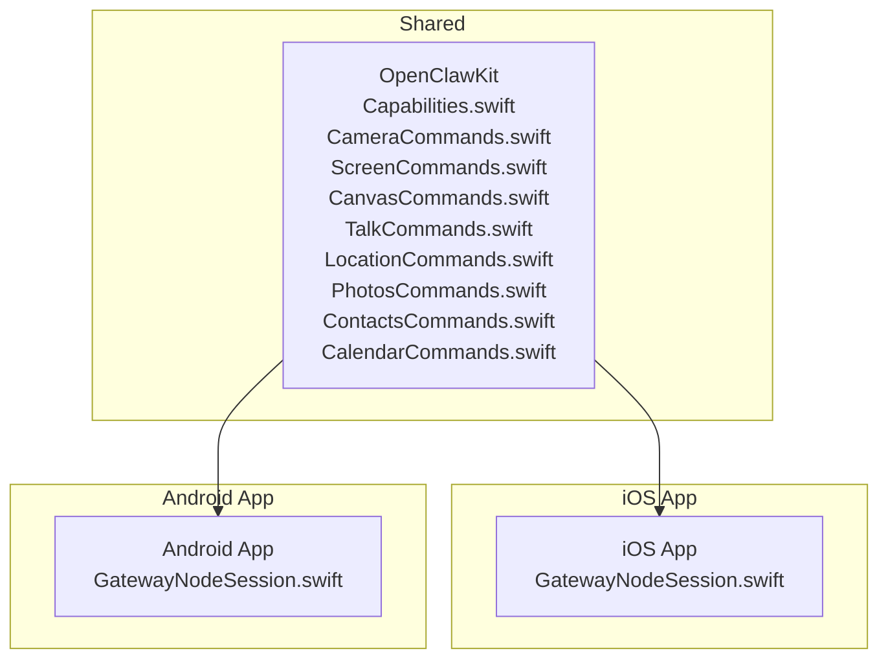
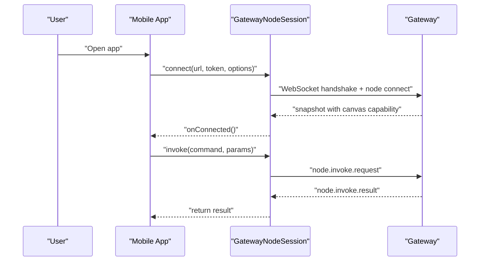
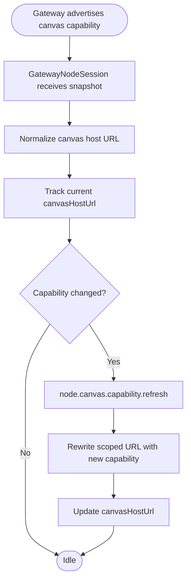
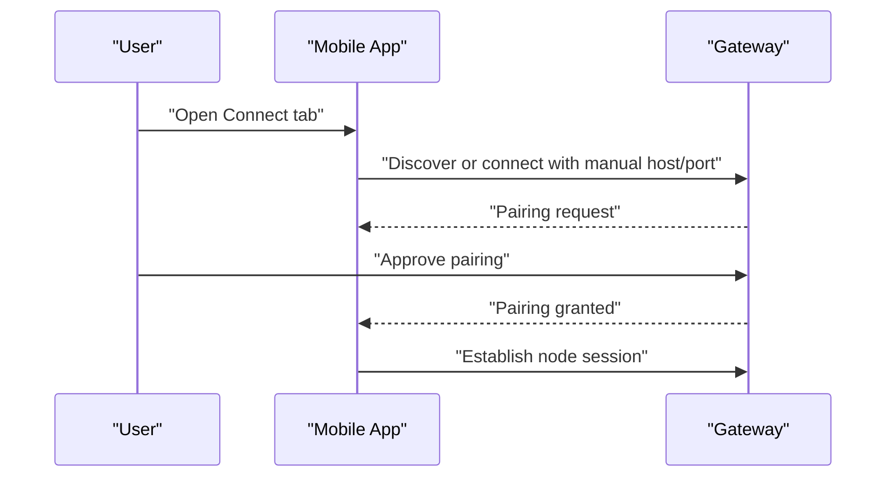
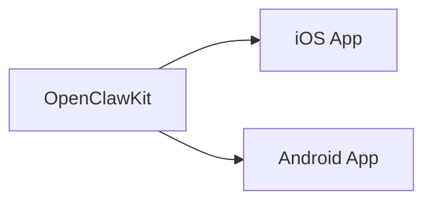

# Mobile Applications

<cite>
**Referenced Files in This Document**
- [apps/android/README.md](file://apps/android/README.md)
- [apps/ios/README.md](file://apps/ios/README.md)
- [OpenClawKit/Sources/OpenClawKit/GatewayNodeSession.swift](file://apps/shared/OpenClawKit/Sources/OpenClawKit/GatewayNodeSession.swift)
- [OpenClawKit/Sources/OpenClawKit/Capabilities.swift](file://apps/shared/OpenClawKit/Sources/OpenClawKit/Capabilities.swift)
- [OpenClawKit/Sources/OpenClawKit/CameraCommands.swift](file://apps/shared/OpenClawKit/Sources/OpenClawKit/CameraCommands.swift)
- [OpenClawKit/Sources/OpenClawKit/ScreenCommands.swift](file://apps/shared/OpenClawKit/Sources/OpenClawKit/ScreenCommands.swift)
- [OpenClawKit/Sources/OpenClawKit/CanvasCommands.swift](file://apps/shared/OpenClawKit/Sources/OpenClawKit/CanvasCommands.swift)
- [OpenClawKit/Sources/OpenClawKit/TalkCommands.swift](file://apps/shared/OpenClawKit/Sources/OpenClawKit/TalkCommands.swift)
- [OpenClawKit/Sources/OpenClawKit/LocationCommands.swift](file://apps/shared/OpenClawKit/Sources/OpenClawKit/LocationCommands.swift)
- [OpenClawKit/Sources/OpenClawKit/PhotosCommands.swift](file://apps/shared/OpenClawKit/Sources/OpenClawKit/PhotosCommands.swift)
- [OpenClawKit/Sources/OpenClawKit/ContactsCommands.swift](file://apps/shared/OpenClawKit/Sources/OpenClawKit/ContactsCommands.swift)
- [OpenClawKit/Sources/OpenClawKit/CalendarCommands.swift](file://apps/shared/OpenClawKit/Sources/OpenClawKit/CalendarCommands.swift)
</cite>

## Table of Contents
1. [Introduction](#introduction)
2. [Project Structure](#project-structure)
3. [Core Components](#core-components)
4. [Architecture Overview](#architecture-overview)
5. [Detailed Component Analysis](#detailed-component-analysis)
6. [Dependency Analysis](#dependency-analysis)
7. [Performance Considerations](#performance-considerations)
8. [Troubleshooting Guide](#troubleshooting-guide)
9. [Conclusion](#conclusion)
10. [Appendices](#appendices)

## Introduction
This document explains the OpenClaw mobile applications for iOS and Android, focusing on architecture, device pairing, cross-platform synchronization, and platform-specific capabilities. It covers how the apps connect to the Gateway via WebSocket, how capabilities are declared and invoked, and how platform differences influence permissions, background behavior, and UI flows. Practical setup, pairing, and usage patterns are included, along with troubleshooting guidance for connectivity, permissions, and battery/network considerations.

## Project Structure
The mobile ecosystem is organized around:
- Shared cross-platform logic in OpenClawKit, which defines capabilities, commands, and the Gateway session abstraction used by both iOS and Android.
- Platform-specific apps under apps/ios and apps/android, each with distinct build flows, UI, and permission handling.
- Documentation and guides for building, distributing, and operating the apps.

**Diagram sources**
- [OpenClawKit/Sources/OpenClawKit/Capabilities.swift:1-18](file://apps/shared/OpenClawKit/Sources/OpenClawKit/Capabilities.swift#L1-L18)
- [OpenClawKit/Sources/OpenClawKit/CameraCommands.swift:1-69](file://apps/shared/OpenClawKit/Sources/OpenClawKit/CameraCommands.swift#L1-L69)
- [OpenClawKit/Sources/OpenClawKit/ScreenCommands.swift:1-28](file://apps/shared/OpenClawKit/Sources/OpenClawKit/ScreenCommands.swift#L1-L28)
- [OpenClawKit/Sources/OpenClawKit/CanvasCommands.swift:1-10](file://apps/shared/OpenClawKit/Sources/OpenClawKit/CanvasCommands.swift#L1-L10)
- [OpenClawKit/Sources/OpenClawKit/TalkCommands.swift:1-29](file://apps/shared/OpenClawKit/Sources/OpenClawKit/TalkCommands.swift#L1-L29)
- [OpenClawKit/Sources/OpenClawKit/LocationCommands.swift:1-58](file://apps/shared/OpenClawKit/Sources/OpenClawKit/LocationCommands.swift#L1-L58)
- [OpenClawKit/Sources/OpenClawKit/PhotosCommands.swift:1-42](file://apps/shared/OpenClawKit/Sources/OpenClawKit/PhotosCommands.swift#L1-L42)
- [OpenClawKit/Sources/OpenClawKit/ContactsCommands.swift:1-86](file://apps/shared/OpenClawKit/Sources/OpenClawKit/ContactsCommands.swift#L1-L86)
- [OpenClawKit/Sources/OpenClawKit/CalendarCommands.swift:1-84](file://apps/shared/OpenClawKit/Sources/OpenClawKit/CalendarCommands.swift#L1-L84)
- [OpenClawKit/Sources/OpenClawKit/GatewayNodeSession.swift:1-536](file://apps/shared/OpenClawKit/Sources/OpenClawKit/GatewayNodeSession.swift#L1-L536)

**Section sources**
- [apps/android/README.md:1-233](file://apps/android/README.md#L1-L233)
- [apps/ios/README.md:1-218](file://apps/ios/README.md#L1-L218)

## Core Components
- GatewayNodeSession: Manages WebSocket connection to the Gateway, handles snapshots, server events, node invocation requests, and canvas capability updates. It encapsulates connection lifecycle, reconnection, and event broadcasting.
- Capabilities: Enumerates supported node capabilities (e.g., canvas, camera, screen, voiceWake, location).
- Command Families: Structured command enums and parameters for camera, screen, canvas, talk, location, photos, contacts, and calendar.

Key responsibilities:
- Establish and maintain a long-lived WebSocket session with the Gateway.
- Translate gateway-originated node.invoke.request into local invocations and return results.
- Track and expose canvas host URL and capability for UI/web content integration.
- Provide structured command APIs for platform features.

**Section sources**
- [OpenClawKit/Sources/OpenClawKit/GatewayNodeSession.swift:59-536](file://apps/shared/OpenClawKit/Sources/OpenClawKit/GatewayNodeSession.swift#L59-L536)
- [OpenClawKit/Sources/OpenClawKit/Capabilities.swift:3-17](file://apps/shared/OpenClawKit/Sources/OpenClawKit/Capabilities.swift#L3-L17)

## Architecture Overview
The mobile apps act as “nodes” connecting to the Gateway over WebSocket. They declare capabilities and receive commands/events from the Gateway. The shared OpenClawKit provides a unified interface for both platforms.

**Diagram sources**
- [OpenClawKit/Sources/OpenClawKit/GatewayNodeSession.swift:195-258](file://apps/shared/OpenClawKit/Sources/OpenClawKit/GatewayNodeSession.swift#L195-L258)
- [OpenClawKit/Sources/OpenClawKit/GatewayNodeSession.swift:441-466](file://apps/shared/OpenClawKit/Sources/OpenClawKit/GatewayNodeSession.swift#L441-L466)

## Detailed Component Analysis

### iOS Node Capabilities
- Voice Wake: Supported via capability enumeration; iOS documents foreground-first behavior and potential conflicts with Talk.
- Canvas Integration: Present, navigate, evaluate JS, snapshot; relies on canvas host URL and capability exposed by the Gateway.
- Camera: Snap and clip commands; permissions required for camera and audio when capturing video.
- Screen Recording: Supported via screen.record command; requires user consent per invocation.
- Location: Get location with configurable accuracy and freshness.
- Contacts, Calendar, Photos, Reminders, Motion: Available through dedicated command families.

Platform specifics:
- APNs transport and relay registration for push notifications differ between local/manual and official/TestFlight builds.
- Background execution constraints: canvas.*, camera.*, screen.*, and talk.* are restricted when backgrounded.
- Discovery and manual connection supported; TLS pinning and fingerprint trust prompts are part of connection flow.

**Section sources**
- [apps/ios/README.md:138-186](file://apps/ios/README.md#L138-L186)
- [apps/ios/README.md:95-137](file://apps/ios/README.md#L95-L137)
- [OpenClawKit/Sources/OpenClawKit/Capabilities.swift:3-17](file://apps/shared/OpenClawKit/Sources/OpenClawKit/Capabilities.swift#L3-L17)
- [OpenClawKit/Sources/OpenClawKit/CameraCommands.swift:3-7](file://apps/shared/OpenClawKit/Sources/OpenClawKit/CameraCommands.swift#L3-L7)
- [OpenClawKit/Sources/OpenClawKit/ScreenCommands.swift:3-5](file://apps/shared/OpenClawKit/Sources/OpenClawKit/ScreenCommands.swift#L3-L5)
- [OpenClawKit/Sources/OpenClawKit/LocationCommands.swift:3-5](file://apps/shared/OpenClawKit/Sources/OpenClawKit/LocationCommands.swift#L3-L5)
- [OpenClawKit/Sources/OpenClawKit/CanvasCommands.swift:3-9](file://apps/shared/OpenClawKit/Sources/OpenClawKit/CanvasCommands.swift#L3-L9)
- [OpenClawKit/Sources/OpenClawKit/ContactsCommands.swift:3-6](file://apps/shared/OpenClawKit/Sources/OpenClawKit/ContactsCommands.swift#L3-L6)
- [OpenClawKit/Sources/OpenClawKit/CalendarCommands.swift:3-6](file://apps/shared/OpenClawKit/Sources/OpenClawKit/CalendarCommands.swift#L3-L6)
- [OpenClawKit/Sources/OpenClawKit/PhotosCommands.swift:3-5](file://apps/shared/OpenClawKit/Sources/OpenClawKit/PhotosCommands.swift#L3-L5)
- [OpenClawKit/Sources/OpenClawKit/TalkCommands.swift:3-8](file://apps/shared/OpenClawKit/Sources/OpenClawKit/TalkCommands.swift#L3-L8)

### Android Node Features
- Tabs: Connect, Chat, Voice, Screen.
- Device Command Families: Camera, Screen, Canvas, Talk, Location, Photos, Contacts, Calendar, System, and others.
- Permissions: Discovery (NEARBY_WIFI_DEVICES on Android 13+, ACCESS_FINE_LOCATION on 12 and below), foreground service notifications, camera and audio for capture.
- Connectivity: Discovery and manual host/port with TLS; foreground service for reliability.

**Section sources**
- [apps/android/README.md:1-233](file://apps/android/README.md#L1-L233)
- [OpenClawKit/Sources/OpenClawKit/Capabilities.swift:3-17](file://apps/shared/OpenClawKit/Sources/OpenClawKit/Capabilities.swift#L3-L17)

### Cross-Platform Synchronization and Capabilities
Both iOS and Android share the same capability and command models. The Gateway advertises node capabilities and exposes a canvas host URL. The session normalizes and tracks this URL, refreshing it when the Gateway updates the capability.

**Diagram sources**
- [OpenClawKit/Sources/OpenClawKit/GatewayNodeSession.swift:276-314](file://apps/shared/OpenClawKit/Sources/OpenClawKit/GatewayNodeSession.swift#L276-L314)
- [OpenClawKit/Sources/OpenClawKit/GatewayNodeSession.swift:364-381](file://apps/shared/OpenClawKit/Sources/OpenClawKit/GatewayNodeSession.swift#L364-L381)

**Section sources**
- [OpenClawKit/Sources/OpenClawKit/GatewayNodeSession.swift:272-314](file://apps/shared/OpenClawKit/Sources/OpenClawKit/GatewayNodeSession.swift#L272-L314)

### Device Pairing Mechanisms
- iOS: Supports pairing via setup code flow and manual connection; discovery or manual host/port with TLS fingerprint trust prompt.
- Android: Connect tab supports Setup Code and Manual modes; requires approval on the Gateway side.

**Diagram sources**
- [apps/android/README.md:147-167](file://apps/android/README.md#L147-L167)
- [apps/ios/README.md:138-144](file://apps/ios/README.md#L138-L144)

**Section sources**
- [apps/android/README.md:147-167](file://apps/android/README.md#L147-L167)
- [apps/ios/README.md:138-144](file://apps/ios/README.md#L138-L144)

### Practical Setup and Usage Patterns
- iOS:
  - Build and run locally via Xcode; APNs registration occurs after connecting to the Gateway.
  - Use discovery or manual host/port; enable discovery debug logs if needed.
  - Validate foreground behavior for canvas, camera, screen, and talk commands.
- Android:
  - Use the Connect tab; choose Setup Code or Manual mode.
  - Approve pairing on the Gateway; ensure canvas host is reachable.
  - Keep the Screen tab active for canvas-related commands.

**Section sources**
- [apps/ios/README.md:18-104](file://apps/ios/README.md#L18-L104)
- [apps/android/README.md:147-167](file://apps/android/README.md#L147-L167)

### Platform-Specific Considerations
- iOS:
  - Foreground-first reliability; background restrictions for certain commands.
  - APNs transport differs for local/manual vs. official/TestFlight builds; relay registration requires production/TestFlight distribution.
  - Location automation requires Always permission and careful background testing.
- Android:
  - Permissions for discovery, notifications, camera, and audio must be granted at runtime.
  - Foreground service improves reliability for long-running operations.

**Section sources**
- [apps/ios/README.md:177-186](file://apps/ios/README.md#L177-L186)
- [apps/ios/README.md:95-137](file://apps/ios/README.md#L95-L137)
- [apps/android/README.md:169-178](file://apps/android/README.md#L169-L178)

## Dependency Analysis
The shared OpenClawKit defines the contract for capabilities and commands. Both iOS and Android apps depend on this shared module for consistent behavior.

**Diagram sources**
- [OpenClawKit/Sources/OpenClawKit/Capabilities.swift:3-17](file://apps/shared/OpenClawKit/Sources/OpenClawKit/Capabilities.swift#L3-L17)
- [OpenClawKit/Sources/OpenClawKit/CameraCommands.swift:3-7](file://apps/shared/OpenClawKit/Sources/OpenClawKit/CameraCommands.swift#L3-L7)
- [OpenClawKit/Sources/OpenClawKit/ScreenCommands.swift:3-5](file://apps/shared/OpenClawKit/Sources/OpenClawKit/ScreenCommands.swift#L3-L5)
- [OpenClawKit/Sources/OpenClawKit/CanvasCommands.swift:3-9](file://apps/shared/OpenClawKit/Sources/OpenClawKit/CanvasCommands.swift#L3-L9)
- [OpenClawKit/Sources/OpenClawKit/TalkCommands.swift:3-8](file://apps/shared/OpenClawKit/Sources/OpenClawKit/TalkCommands.swift#L3-L8)
- [OpenClawKit/Sources/OpenClawKit/LocationCommands.swift:3-5](file://apps/shared/OpenClawKit/Sources/OpenClawKit/LocationCommands.swift#L3-L5)
- [OpenClawKit/Sources/OpenClawKit/PhotosCommands.swift:3-5](file://apps/shared/OpenClawKit/Sources/OpenClawKit/PhotosCommands.swift#L3-L5)
- [OpenClawKit/Sources/OpenClawKit/ContactsCommands.swift:3-6](file://apps/shared/OpenClawKit/Sources/OpenClawKit/ContactsCommands.swift#L3-L6)
- [OpenClawKit/Sources/OpenClawKit/CalendarCommands.swift:3-6](file://apps/shared/OpenClawKit/Sources/OpenClawKit/CalendarCommands.swift#L3-L6)

**Section sources**
- [OpenClawKit/Sources/OpenClawKit/Capabilities.swift:3-17](file://apps/shared/OpenClawKit/Sources/OpenClawKit/Capabilities.swift#L3-L17)

## Performance Considerations
- iOS:
  - Foreground-first operation is most reliable; background socket suspension can cause reconnect churn.
  - APNs registration and relay flow add overhead; ensure correct entitlements and distribution mode.
- Android:
  - Foreground service reduces background termination risk.
  - Permissions requested during onboarding/settings reduce runtime prompt latency.
  - Canvas web content supports live reload when loaded from Gateway’s canvas host.

**Section sources**
- [apps/ios/README.md:177-186](file://apps/ios/README.md#L177-L186)
- [apps/android/README.md:138-146](file://apps/android/README.md#L138-L146)

## Troubleshooting Guide
- Connectivity:
  - Verify Gateway is reachable; use manual host/port with TLS if discovery is flaky.
  - Inspect discovery logs on iOS; review Gateway status in app settings.
- Pairing:
  - Approve pairing requests on the Gateway side; retry after approval.
- Permissions:
  - Android: Grant camera, location, and notification permissions as needed.
  - iOS: Ensure APNs provisioning matches the selected team and bundle ID; check for APNs registration failures.
- Canvas and Screen:
  - Keep the Screen tab active; ensure canvas host is reachable.
  - If canvas capability changes, refresh it via the session’s capability refresh method.
- Battery and Background:
  - Prefer foreground usage for canvas, camera, screen, and talk commands.
  - Validate background expectations by reproducing in foreground first, then testing transitions.

**Section sources**
- [apps/android/README.md:169-228](file://apps/android/README.md#L169-L228)
- [apps/ios/README.md:196-218](file://apps/ios/README.md#L196-L218)

## Conclusion
The OpenClaw mobile apps leverage a shared Gateway session and capability/command model to deliver a consistent cross-platform experience. iOS emphasizes foreground reliability and a robust APNs relay flow, while Android focuses on discoverability, permissions, and foreground services. Proper setup, pairing, and attention to platform-specific constraints ensure reliable synchronization and responsive interactions with the Gateway.

## Appendices

### Command Families Reference
- Camera: list, snap, clip
- Screen: record
- Canvas: present, hide, navigate, eval, snapshot
- Talk: ptt.start, ptt.stop, ptt.cancel, ptt.once
- Location: get
- Photos: latest
- Contacts: search, add
- Calendar: events, add

**Section sources**
- [OpenClawKit/Sources/OpenClawKit/CameraCommands.swift:3-7](file://apps/shared/OpenClawKit/Sources/OpenClawKit/CameraCommands.swift#L3-L7)
- [OpenClawKit/Sources/OpenClawKit/ScreenCommands.swift:3-5](file://apps/shared/OpenClawKit/Sources/OpenClawKit/ScreenCommands.swift#L3-L5)
- [OpenClawKit/Sources/OpenClawKit/CanvasCommands.swift:3-9](file://apps/shared/OpenClawKit/Sources/OpenClawKit/CanvasCommands.swift#L3-L9)
- [OpenClawKit/Sources/OpenClawKit/TalkCommands.swift:3-8](file://apps/shared/OpenClawKit/Sources/OpenClawKit/TalkCommands.swift#L3-L8)
- [OpenClawKit/Sources/OpenClawKit/LocationCommands.swift:3-5](file://apps/shared/OpenClawKit/Sources/OpenClawKit/LocationCommands.swift#L3-L5)
- [OpenClawKit/Sources/OpenClawKit/PhotosCommands.swift:3-5](file://apps/shared/OpenClawKit/Sources/OpenClawKit/PhotosCommands.swift#L3-L5)
- [OpenClawKit/Sources/OpenClawKit/ContactsCommands.swift:3-6](file://apps/shared/OpenClawKit/Sources/OpenClawKit/ContactsCommands.swift#L3-L6)
- [OpenClawKit/Sources/OpenClawKit/CalendarCommands.swift:3-6](file://apps/shared/OpenClawKit/Sources/OpenClawKit/CalendarCommands.swift#L3-L6)