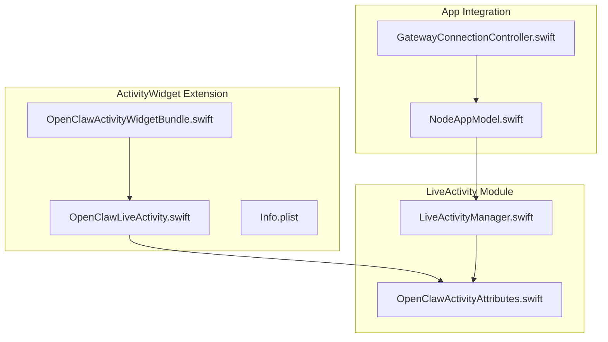
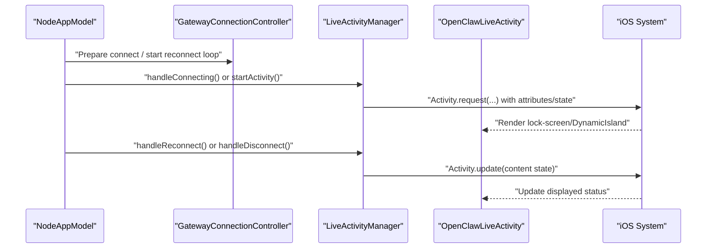
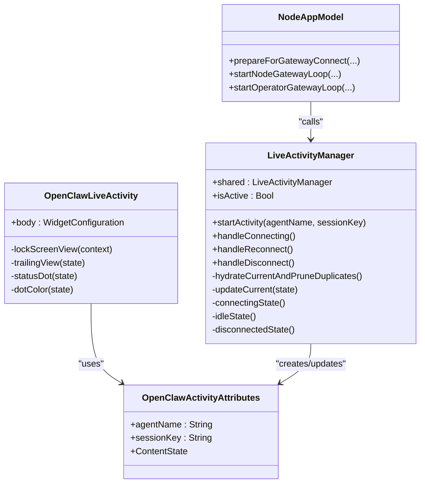

# Activity Widget

<cite>
**Referenced Files in This Document**
- [OpenClawLiveActivity.swift](file://apps/ios/ActivityWidget/OpenClawLiveActivity.swift)
- [OpenClawActivityWidgetBundle.swift](file://apps/ios/ActivityWidget/OpenClawActivityWidgetBundle.swift)
- [Info.plist](file://apps/ios/ActivityWidget/Info.plist)
- [OpenClawActivityAttributes.swift](file://apps/ios/Sources/LiveActivity/OpenClawActivityAttributes.swift)
- [LiveActivityManager.swift](file://apps/ios/Sources/LiveActivity/LiveActivityManager.swift)
- [NodeAppModel.swift](file://apps/ios/Sources/Model/NodeAppModel.swift)
- [GatewayConnectionController.swift](file://apps/ios/Sources/Gateway/GatewayConnectionController.swift)
</cite>

## Table of Contents
1. [Introduction](#introduction)
2. [Project Structure](#project-structure)
3. [Core Components](#core-components)
4. [Architecture Overview](#architecture-overview)
5. [Detailed Component Analysis](#detailed-component-analysis)
6. [Dependency Analysis](#dependency-analysis)
7. [Performance Considerations](#performance-considerations)
8. [Troubleshooting Guide](#troubleshooting-guide)
9. [Privacy Considerations](#privacy-considerations)
10. [Conclusion](#conclusion)

## Introduction
This document explains the Activity Widget and Live Activity features in the OpenClaw iOS app. It focuses on persistent status display and real-time information sharing via a Live Activity widget extension. The widget communicates gateway connection status, active agent information, and system notifications. The OpenClawLiveActivity component renders the Live Activity on the lock screen and Dynamic Island, while LiveActivityManager manages the activity lifecycle, state transitions, and data updates. The iOS widget extension integrates with the system Widgets framework and supports Live Activities.

## Project Structure
The Activity Widget implementation spans two areas:
- ActivityWidget: the Live Activity widget extension that renders the persistent status.
- Sources/LiveActivity: shared data models and the manager that controls the Live Activity lifecycle.

**Diagram sources**
- [OpenClawLiveActivity.swift:1-86](file://apps/ios/ActivityWidget/OpenClawLiveActivity.swift#L1-L86)
- [OpenClawActivityWidgetBundle.swift:1-10](file://apps/ios/ActivityWidget/OpenClawActivityWidgetBundle.swift#L1-L10)
- [Info.plist:1-32](file://apps/ios/ActivityWidget/Info.plist#L1-L32)
- [OpenClawActivityAttributes.swift:1-46](file://apps/ios/Sources/LiveActivity/OpenClawActivityAttributes.swift#L1-L46)
- [LiveActivityManager.swift:1-126](file://apps/ios/Sources/LiveActivity/LiveActivityManager.swift#L1-L126)
- [NodeAppModel.swift:1740-1939](file://apps/ios/Sources/Model/NodeAppModel.swift#L1740-L1939)
- [GatewayConnectionController.swift:1-1084](file://apps/ios/Sources/Gateway/GatewayConnectionController.swift#L1-L1084)

**Section sources**
- [OpenClawLiveActivity.swift:1-86](file://apps/ios/ActivityWidget/OpenClawLiveActivity.swift#L1-L86)
- [OpenClawActivityWidgetBundle.swift:1-10](file://apps/ios/ActivityWidget/OpenClawActivityWidgetBundle.swift#L1-L10)
- [Info.plist:1-32](file://apps/ios/ActivityWidget/Info.plist#L1-L32)
- [OpenClawActivityAttributes.swift:1-46](file://apps/ios/Sources/LiveActivity/OpenClawActivityAttributes.swift#L1-L46)
- [LiveActivityManager.swift:1-126](file://apps/ios/Sources/LiveActivity/LiveActivityManager.swift#L1-L126)
- [NodeAppModel.swift:1740-1939](file://apps/ios/Sources/Model/NodeAppModel.swift#L1740-L1939)
- [GatewayConnectionController.swift:1-1084](file://apps/ios/Sources/Gateway/GatewayConnectionController.swift#L1-L1084)

## Core Components
- OpenClawLiveActivity: Widget implementation using ActivityConfiguration to define the lock-screen and Dynamic Island views. It displays gateway status, agent info, and a timer for active sessions.
- OpenClawActivityAttributes: Shared schema for attributes and content state used by both the iOS app and the Live Activity widget extension.
- LiveActivityManager: Singleton that starts, updates, and prunes Live Activity instances, and transitions between connecting, idle, and disconnected states.
- NodeAppModel: Orchestrates gateway connections and invokes LiveActivityManager methods to reflect connection state changes.
- GatewayConnectionController: Manages gateway discovery, trust prompts, and connection attempts; coordinates with NodeAppModel to trigger Live Activity updates.

**Section sources**
- [OpenClawLiveActivity.swift:5-33](file://apps/ios/ActivityWidget/OpenClawLiveActivity.swift#L5-L33)
- [OpenClawActivityAttributes.swift:4-16](file://apps/ios/Sources/LiveActivity/OpenClawActivityAttributes.swift#L4-L16)
- [LiveActivityManager.swift:5-25](file://apps/ios/Sources/LiveActivity/LiveActivityManager.swift#L5-L25)
- [NodeAppModel.swift:1740-1939](file://apps/ios/Sources/Model/NodeAppModel.swift#L1740-L1939)
- [GatewayConnectionController.swift:1-1084](file://apps/ios/Sources/Gateway/GatewayConnectionController.swift#L1-L1084)

## Architecture Overview
The Live Activity widget extension renders real-time status derived from the app’s gateway connection state. The app’s NodeAppModel triggers LiveActivityManager to start or update the activity. LiveActivityManager ensures only one active activity exists and updates its content state.

**Diagram sources**
- [NodeAppModel.swift:1740-1939](file://apps/ios/Sources/Model/NodeAppModel.swift#L1740-L1939)
- [GatewayConnectionController.swift:1-1084](file://apps/ios/Sources/Gateway/GatewayConnectionController.swift#L1-L1084)
- [LiveActivityManager.swift:27-66](file://apps/ios/Sources/LiveActivity/LiveActivityManager.swift#L27-L66)
- [OpenClawLiveActivity.swift:6-33](file://apps/ios/ActivityWidget/OpenClawLiveActivity.swift#L6-L33)

## Detailed Component Analysis

### OpenClawLiveActivity
Responsibilities:
- Defines the Live Activity widget using ActivityConfiguration.
- Renders the lock-screen view with gateway branding, status text, and a trailing indicator.
- Implements Dynamic Island regions for expanded and compact layouts.
- Uses a status dot color to represent connection state and a trailing view to show progress, disconnection icon, or elapsed timer.

Rendering logic highlights:
- Lock-screen layout: a horizontal stack with a status dot, labels, and a trailing view.
- Dynamic Island:
  - Expanded region: leading (status dot), center (status text), trailing (elapsed timer or progress).
  - Compact regions: leading (status dot), trailing (status text), minimal (status dot).
- Trailing view switches based on state:
  - Connecting: small progress view.
  - Disconnected: red “wifi slash” icon.
  - Idle: green “antenna” icon.
  - Active: monospaced elapsed timer.

**Section sources**
- [OpenClawLiveActivity.swift:5-33](file://apps/ios/ActivityWidget/OpenClawLiveActivity.swift#L5-L33)
- [OpenClawLiveActivity.swift:35-84](file://apps/ios/ActivityWidget/OpenClawLiveActivity.swift#L35-L84)

### OpenClawActivityAttributes
Responsibilities:
- Declares shared attributes for the Live Activity: agent name and session key.
- Defines ContentState with:
  - statusText for human-readable status.
  - isIdle, isDisconnected, isConnecting flags.
  - startedAt timestamp to anchor the elapsed timer.

Preview and debug states:
- Provides static previews for connecting, idle, and disconnected states in debug builds.

**Section sources**
- [OpenClawActivityAttributes.swift:4-16](file://apps/ios/Sources/LiveActivity/OpenClawActivityAttributes.swift#L4-L16)
- [OpenClawActivityAttributes.swift:18-46](file://apps/ios/Sources/LiveActivity/OpenClawActivityAttributes.swift#L18-L46)

### LiveActivityManager
Responsibilities:
- Lifecycle management:
  - startActivity: creates a new Live Activity with attributes and initial connecting state.
  - handleConnecting, handleReconnect, handleDisconnect: update the current activity’s content state.
- Duplicate pruning:
  - hydrateCurrentAndPruneDuplicates: keeps the newest activity and ends stale ones.
- State helpers:
  - connectingState, idleState, disconnectedState: construct ContentState with appropriate flags and startedAt.

Concurrency and safety:
- Uses @MainActor for UI-related state.
- Updates activity asynchronously via Activity.update.

**Section sources**
- [LiveActivityManager.swift:5-25](file://apps/ios/Sources/LiveActivity/LiveActivityManager.swift#L5-L25)
- [LiveActivityManager.swift:27-66](file://apps/ios/Sources/LiveActivity/LiveActivityManager.swift#L27-L66)
- [LiveActivityManager.swift:68-97](file://apps/ios/Sources/LiveActivity/LiveActivityManager.swift#L68-L97)
- [LiveActivityManager.swift:99-124](file://apps/ios/Sources/LiveActivity/LiveActivityManager.swift#L99-L124)

### NodeAppModel Integration
Integration points:
- On disconnect: calls LiveActivityManager.shared.handleDisconnect().
- On reconnect: calls LiveActivityManager.shared.handleReconnect().
- During reconnect loop: if not connected, sets status text and either starts a new activity or transitions to connecting state.

These calls ensure the Live Activity reflects accurate connection health and timing.

**Section sources**
- [NodeAppModel.swift:1740-1780](file://apps/ios/Sources/Model/NodeAppModel.swift#L1740-L1780)
- [NodeAppModel.swift:1860-1875](file://apps/ios/Sources/Model/NodeAppModel.swift#L1860-L1875)
- [NodeAppModel.swift:1918-1947](file://apps/ios/Sources/Model/NodeAppModel.swift#L1918-L1947)

### GatewayConnectionController
Role:
- Manages gateway discovery, trust prompts, and connection attempts.
- Coordinates with NodeAppModel to apply gateway configurations and trigger Live Activity updates during connection events.

**Section sources**
- [GatewayConnectionController.swift:1-1084](file://apps/ios/Sources/Gateway/GatewayConnectionController.swift#L1-L1084)

### Widget Extension Bundle and Info
- OpenClawActivityWidgetBundle registers the OpenClawLiveActivity as a widget.
- Info.plist declares the extension point, bundle identifiers, and enables Live Activities.

**Section sources**
- [OpenClawActivityWidgetBundle.swift:4-9](file://apps/ios/ActivityWidget/OpenClawActivityWidgetBundle.swift#L4-L9)
- [Info.plist:23-30](file://apps/ios/ActivityWidget/Info.plist#L23-L30)

## Dependency Analysis

**Diagram sources**
- [OpenClawLiveActivity.swift:5-84](file://apps/ios/ActivityWidget/OpenClawLiveActivity.swift#L5-L84)
- [OpenClawActivityAttributes.swift:4-16](file://apps/ios/Sources/LiveActivity/OpenClawActivityAttributes.swift#L4-L16)
- [LiveActivityManager.swift:6-125](file://apps/ios/Sources/LiveActivity/LiveActivityManager.swift#L6-L125)
- [NodeAppModel.swift:1740-1939](file://apps/ios/Sources/Model/NodeAppModel.swift#L1740-L1939)

**Section sources**
- [OpenClawLiveActivity.swift:5-84](file://apps/ios/ActivityWidget/OpenClawLiveActivity.swift#L5-L84)
- [OpenClawActivityAttributes.swift:4-16](file://apps/ios/Sources/LiveActivity/OpenClawActivityAttributes.swift#L4-L16)
- [LiveActivityManager.swift:6-125](file://apps/ios/Sources/LiveActivity/LiveActivityManager.swift#L6-L125)
- [NodeAppModel.swift:1740-1939](file://apps/ios/Sources/Model/NodeAppModel.swift#L1740-L1939)

## Performance Considerations
- Activity updates are asynchronous and batched; avoid frequent updates to reduce overhead.
- The manager prunes duplicate activities to prevent resource bloat.
- Use minimal state fields in ContentState to minimize serialization costs.
- Keep UI rendering lightweight; avoid heavy computations inside views.

## Troubleshooting Guide
Common issues and resolutions:
- Live Activity not appearing:
  - Verify Live Activities are enabled in Settings > Focus > Live Activities.
  - Confirm Info.plist includes the Live Activities entitlement and extension point.
- Stale or duplicate activities:
  - The manager automatically prunes duplicates; ensure no external code starts multiple activities.
- Status not updating:
  - Ensure NodeAppModel triggers handleReconnect or handleDisconnect on state changes.
  - Confirm the activity remains active; inactive activities are cleared by the system.
- Entitlements and signing:
  - Ensure the widget extension has proper provisioning profiles and entitlements.

**Section sources**
- [Info.plist:23-30](file://apps/ios/ActivityWidget/Info.plist#L23-L30)
- [LiveActivityManager.swift:68-97](file://apps/ios/Sources/LiveActivity/LiveActivityManager.swift#L68-L97)
- [NodeAppModel.swift:1740-1939](file://apps/ios/Sources/Model/NodeAppModel.swift#L1740-L1939)

## Privacy Considerations
- Minimal data exposure:
  - Attributes include only agentName and sessionKey; keep these values scoped to necessary context.
  - ContentState exposes statusText and flags; avoid embedding sensitive details.
- User control:
  - Users can disable Live Activities in system settings.
  - The manager checks authorization before starting activities.
- Transparency:
  - Status indicators clearly communicate connection state without leaking internal errors.

**Section sources**
- [OpenClawActivityAttributes.swift:4-16](file://apps/ios/Sources/LiveActivity/OpenClawActivityAttributes.swift#L4-L16)
- [LiveActivityManager.swift:35-40](file://apps/ios/Sources/LiveActivity/LiveActivityManager.swift#L35-L40)

## Conclusion
The OpenClaw iOS Live Activity widget provides a persistent, real-time view of gateway connectivity and session status. The OpenClawLiveActivity component renders a concise, system-friendly UI, while LiveActivityManager enforces lifecycle discipline and state correctness. NodeAppModel and GatewayConnectionController coordinate connection events to keep the widget synchronized with the app’s operational state. Together, these components deliver a reliable, privacy-conscious status display suitable for the lock screen and Dynamic Island.