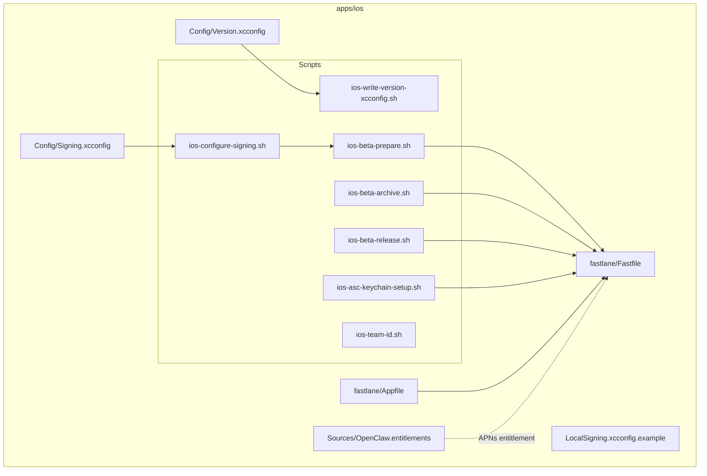
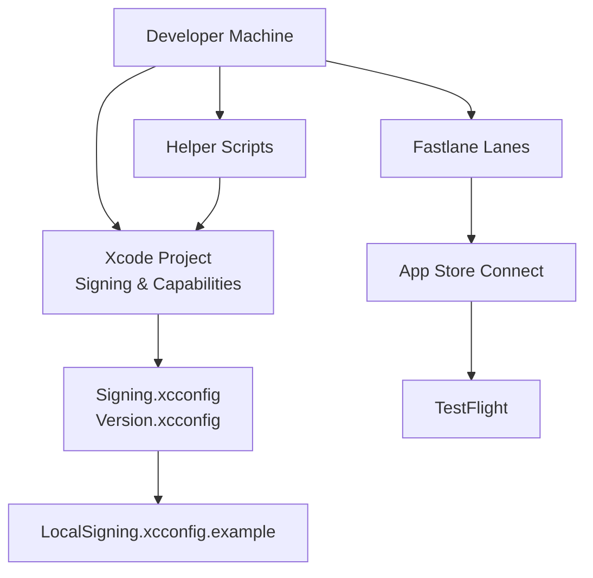
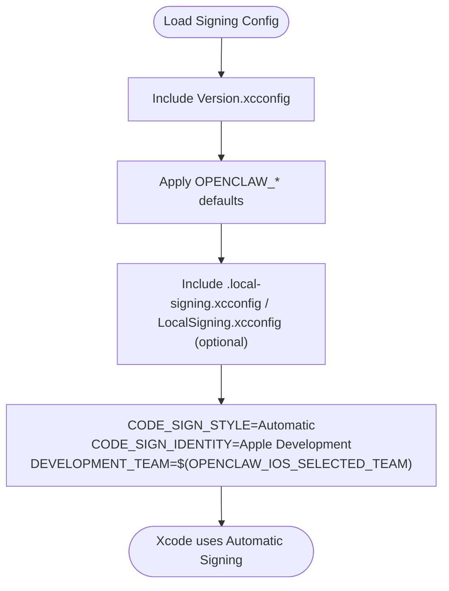
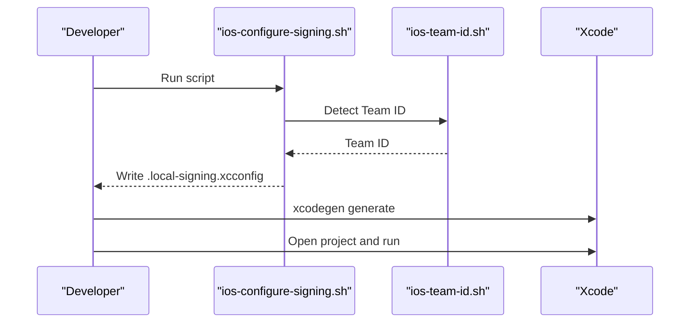
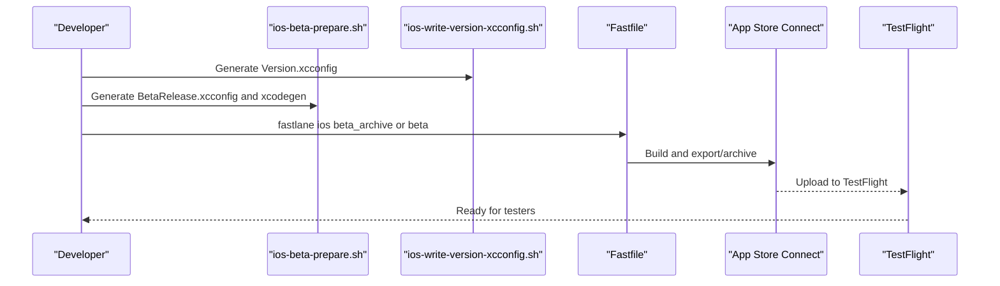
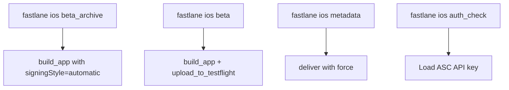
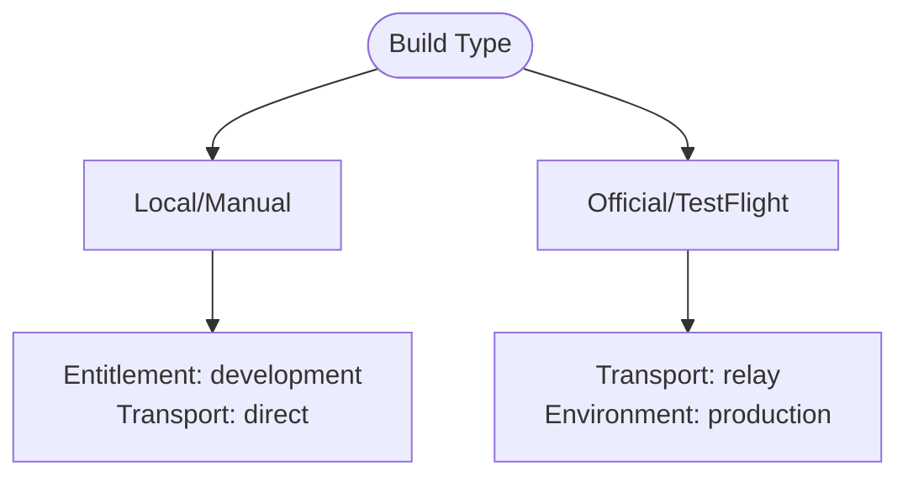
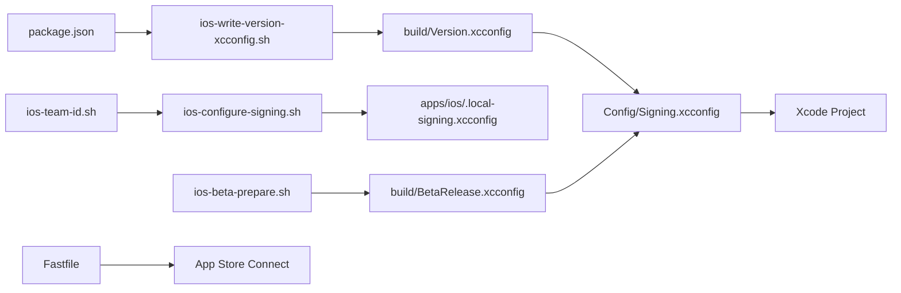

# Deployment & Signing

<cite>
**Referenced Files in This Document**
- [Signing.xcconfig](file://apps/ios/Config/Signing.xcconfig)
- [Version.xcconfig](file://apps/ios/Config/Version.xcconfig)
- [LocalSigning.xcconfig.example](file://apps/ios/LocalSigning.xcconfig.example)
- [Fastfile](file://apps/ios/fastlane/Fastfile)
- [Appfile](file://apps/ios/fastlane/Appfile)
- [ios-configure-signing.sh](file://scripts/ios-configure-signing.sh)
- [ios-team-id.sh](file://scripts/ios-team-id.sh)
- [ios-beta-prepare.sh](file://scripts/ios-beta-prepare.sh)
- [ios-beta-release.sh](file://scripts/ios-beta-release.sh)
- [ios-beta-archive.sh](file://scripts/ios-beta-archive.sh)
- [ios-asc-keychain-setup.sh](file://scripts/ios-asc-keychain-setup.sh)
- [ios-write-version-xcconfig.sh](file://scripts/ios-write-version-xcconfig.sh)
- [OpenClaw.entitlements](file://apps/ios/Sources/OpenClaw.entitlements)
- [README.md](file://apps/ios/README.md)
</cite>

## Table of Contents
1. [Introduction](#introduction)
2. [Project Structure](#project-structure)
3. [Core Components](#core-components)
4. [Architecture Overview](#architecture-overview)
5. [Detailed Component Analysis](#detailed-component-analysis)
6. [Dependency Analysis](#dependency-analysis)
7. [Performance Considerations](#performance-considerations)
8. [Troubleshooting Guide](#troubleshooting-guide)
9. [Conclusion](#conclusion)

## Introduction
This document explains the complete iOS deployment and signing workflow for the OpenClaw iPhone companion app. It covers manual Xcode deployment, certificate and provisioning management, local beta distribution via TestFlight, Fastlane automation, signing configuration files, and platform-specific requirements such as App Store submission guidelines, background execution constraints, and device permissions.

## Project Structure
The iOS app is organized under apps/ios with dedicated signing configuration, Fastlane automation, and helper scripts. Key areas:
- Config: Shared xcconfig files for signing defaults and versioning
- fastlane: Fastlane lanes for building, archiving, and uploading to TestFlight
- Scripts: Helper scripts for signing configuration, team resolution, version generation, and ASC keychain setup
- Sources: App entitlements and core app code

**Diagram sources**
- [Signing.xcconfig:1-22](file://apps/ios/Config/Signing.xcconfig#L1-L22)
- [Version.xcconfig:1-9](file://apps/ios/Config/Version.xcconfig#L1-L9)
- [LocalSigning.xcconfig.example:1-16](file://apps/ios/LocalSigning.xcconfig.example#L1-L16)
- [Fastfile:1-319](file://apps/ios/fastlane/Fastfile#L1-L319)
- [Appfile:1-16](file://apps/ios/fastlane/Appfile#L1-L16)
- [ios-configure-signing.sh:1-104](file://scripts/ios-configure-signing.sh#L1-L104)
- [ios-team-id.sh:1-208](file://scripts/ios-team-id.sh#L1-L208)
- [ios-beta-prepare.sh:1-166](file://scripts/ios-beta-prepare.sh#L1-L166)
- [ios-beta-archive.sh:1-41](file://scripts/ios-beta-archive.sh#L1-L41)
- [ios-beta-release.sh:1-41](file://scripts/ios-beta-release.sh#L1-L41)
- [ios-asc-keychain-setup.sh:1-188](file://scripts/ios-asc-keychain-setup.sh#L1-L188)
- [ios-write-version-xcconfig.sh:1-100](file://scripts/ios-write-version-xcconfig.sh#L1-L100)
- [OpenClaw.entitlements:1-10](file://apps/ios/Sources/OpenClaw.entitlements#L1-L10)

**Section sources**
- [README.md:1-218](file://apps/ios/README.md#L1-L218)

## Core Components
- Signing configuration files
  - Shared defaults and overrides: [Signing.xcconfig:1-22](file://apps/ios/Config/Signing.xcconfig#L1-L22), [Version.xcconfig:1-9](file://apps/ios/Config/Version.xcconfig#L1-L9)
  - Personal overrides example: [LocalSigning.xcconfig.example:1-16](file://apps/ios/LocalSigning.xcconfig.example#L1-L16)
- Entitlements
  - APNs environment: [OpenClaw.entitlements:1-10](file://apps/ios/Sources/OpenClaw.entitlements#L1-L10)
- Fastlane automation
  - Lanes for beta archive and TestFlight upload: [Fastfile:260-285](file://apps/ios/fastlane/Fastfile#L260-L285)
  - App Store Connect authentication: [Fastfile:196-241](file://apps/ios/fastlane/Fastfile#L196-L241), [Appfile:1-16](file://apps/ios/fastlane/Appfile#L1-L16)
- Helper scripts
  - Configure local signing and bundle IDs: [ios-configure-signing.sh:1-104](file://scripts/ios-configure-signing.sh#L1-L104)
  - Resolve Apple Team ID: [ios-team-id.sh:1-208](file://scripts/ios-team-id.sh#L1-L208)
  - Prepare beta release inputs and regenerate project: [ios-beta-prepare.sh:1-166](file://scripts/ios-beta-prepare.sh#L1-L166)
  - Archive and upload beta: [ios-beta-archive.sh:1-41](file://scripts/ios-beta-archive.sh#L1-L41), [ios-beta-release.sh:1-41](file://scripts/ios-beta-release.sh#L1-L41)
  - Store ASC API key in Keychain: [ios-asc-keychain-setup.sh:1-188](file://scripts/ios-asc-keychain-setup.sh#L1-L188)
  - Write version xcconfig from package.json: [ios-write-version-xcconfig.sh:1-100](file://scripts/ios-write-version-xcconfig.sh#L1-L100)

**Section sources**
- [Signing.xcconfig:1-22](file://apps/ios/Config/Signing.xcconfig#L1-L22)
- [Version.xcconfig:1-9](file://apps/ios/Config/Version.xcconfig#L1-L9)
- [LocalSigning.xcconfig.example:1-16](file://apps/ios/LocalSigning.xcconfig.example#L1-L16)
- [OpenClaw.entitlements:1-10](file://apps/ios/Sources/OpenClaw.entitlements#L1-L10)
- [Fastfile:1-319](file://apps/ios/fastlane/Fastfile#L1-L319)
- [Appfile:1-16](file://apps/ios/fastlane/Appfile#L1-L16)
- [ios-configure-signing.sh:1-104](file://scripts/ios-configure-signing.sh#L1-L104)
- [ios-team-id.sh:1-208](file://scripts/ios-team-id.sh#L1-L208)
- [ios-beta-prepare.sh:1-166](file://scripts/ios-beta-prepare.sh#L1-L166)
- [ios-beta-archive.sh:1-41](file://scripts/ios-beta-archive.sh#L1-L41)
- [ios-beta-release.sh:1-41](file://scripts/ios-beta-release.sh#L1-L41)
- [ios-asc-keychain-setup.sh:1-188](file://scripts/ios-asc-keychain-setup.sh#L1-L188)
- [ios-write-version-xcconfig.sh:1-100](file://scripts/ios-write-version-xcconfig.sh#L1-L100)

## Architecture Overview
The iOS deployment pipeline integrates local development, beta distribution, and App Store automation. It uses xcconfig for centralized signing/versioning, helper scripts for team resolution and project regeneration, and Fastlane for build and TestFlight upload.

**Diagram sources**
- [Signing.xcconfig:1-22](file://apps/ios/Config/Signing.xcconfig#L1-L22)
- [Version.xcconfig:1-9](file://apps/ios/Config/Version.xcconfig#L1-L9)
- [LocalSigning.xcconfig.example:1-16](file://apps/ios/LocalSigning.xcconfig.example#L1-L16)
- [Fastfile:1-319](file://apps/ios/fastlane/Fastfile#L1-L319)
- [ios-configure-signing.sh:1-104](file://scripts/ios-configure-signing.sh#L1-L104)
- [ios-beta-prepare.sh:1-166](file://scripts/ios-beta-prepare.sh#L1-L166)

## Detailed Component Analysis

### Signing Configuration Files
The signing configuration stack enables shared defaults and developer overrides:
- Shared defaults and automatic signing: [Signing.xcconfig:1-22](file://apps/ios/Config/Signing.xcconfig#L1-L22)
- Version defaults and overrides: [Version.xcconfig:1-9](file://apps/ios/Config/Version.xcconfig#L1-L9)
- Developer overrides example: [LocalSigning.xcconfig.example:1-16](file://apps/ios/LocalSigning.xcconfig.example#L1-L16)

**Diagram sources**
- [Signing.xcconfig:1-22](file://apps/ios/Config/Signing.xcconfig#L1-L22)
- [Version.xcconfig:1-9](file://apps/ios/Config/Version.xcconfig#L1-L9)
- [LocalSigning.xcconfig.example:1-16](file://apps/ios/LocalSigning.xcconfig.example#L1-L16)

**Section sources**
- [Signing.xcconfig:1-22](file://apps/ios/Config/Signing.xcconfig#L1-L22)
- [Version.xcconfig:1-9](file://apps/ios/Config/Version.xcconfig#L1-L9)
- [LocalSigning.xcconfig.example:1-16](file://apps/ios/LocalSigning.xcconfig.example#L1-L16)

### Local Development Signing Setup
Steps to set up local development signing:
1. Install prerequisites: Xcode 16+, pnpm, xcodegen
2. Configure signing for your Apple Team:
   - Run: [ios-configure-signing.sh:1-104](file://scripts/ios-configure-signing.sh#L1-L104)
   - This detects your Team ID and generates a local override file
3. Regenerate the Xcode project:
   - Run: xcodegen generate in apps/ios
4. Open the project and run with scheme OpenClaw in Debug configuration

**Diagram sources**
- [ios-configure-signing.sh:1-104](file://scripts/ios-configure-signing.sh#L1-L104)
- [ios-team-id.sh:1-208](file://scripts/ios-team-id.sh#L1-L208)

**Section sources**
- [README.md:18-48](file://apps/ios/README.md#L18-L48)
- [ios-configure-signing.sh:1-104](file://scripts/ios-configure-signing.sh#L1-L104)
- [ios-team-id.sh:1-208](file://scripts/ios-team-id.sh#L1-L208)

### Certificate Management and Provisioning Profiles
- Automatic signing is used for local development:
  - CODE_SIGN_STYLE=Automatic and CODE_SIGN_IDENTITY=Apple Development
  - DEVELOPMENT_TEAM is resolved from your Apple Team
- For beta/TestFlight builds, automatic signing is also used with generated xcconfig
- Ensure your Apple Team supports Push Notifications for the bundle ID you are signing

**Section sources**
- [Signing.xcconfig:16-21](file://apps/ios/Config/Signing.xcconfig#L16-L21)
- [README.md:95-103](file://apps/ios/README.md#L95-L103)

### Local Beta Release Process Using TestFlight
The beta flow uses Fastlane with generated xcconfig and a push relay base URL:
- Prepare beta inputs:
  - Write version xcconfig from package.json: [ios-write-version-xcconfig.sh:1-100](file://scripts/ios-write-version-xcconfig.sh#L1-L100)
  - Generate BetaRelease.xcconfig with canonical bundle IDs and relay settings: [ios-beta-prepare.sh:139-157](file://scripts/ios-beta-prepare.sh#L139-L157)
  - Regenerate the Xcode project: [ios-beta-prepare.sh:159-162](file://scripts/ios-beta-prepare.sh#L159-L162)
- Build and optionally upload:
  - Archive only: [ios-beta-archive.sh:1-41](file://scripts/ios-beta-archive.sh#L1-L41)
  - Archive and upload: [ios-beta-release.sh:1-41](file://scripts/ios-beta-release.sh#L1-L41)
  - Fastlane lanes: [Fastfile:260-285](file://apps/ios/fastlane/Fastfile#L260-L285)
- App Store Connect authentication:
  - Via Keychain or environment variables: [ios-asc-keychain-setup.sh:1-188](file://scripts/ios-asc-keychain-setup.sh#L1-L188)
  - Fastlane lane loads API key: [Fastfile:196-241](file://apps/ios/fastlane/Fastfile#L196-L241)
  - Appfile documentation: [Appfile:1-16](file://apps/ios/fastlane/Appfile#L1-L16)

**Diagram sources**
- [ios-beta-prepare.sh:1-166](file://scripts/ios-beta-prepare.sh#L1-L166)
- [ios-write-version-xcconfig.sh:1-100](file://scripts/ios-write-version-xcconfig.sh#L1-L100)
- [Fastfile:260-285](file://apps/ios/fastlane/Fastfile#L260-L285)
- [Appfile:1-16](file://apps/ios/fastlane/Appfile#L1-L16)
- [ios-asc-keychain-setup.sh:1-188](file://scripts/ios-asc-keychain-setup.sh#L1-L188)

**Section sources**
- [README.md:50-94](file://apps/ios/README.md#L50-L94)
- [ios-beta-prepare.sh:1-166](file://scripts/ios-beta-prepare.sh#L1-L166)
- [ios-beta-archive.sh:1-41](file://scripts/ios-beta-archive.sh#L1-L41)
- [ios-beta-release.sh:1-41](file://scripts/ios-beta-release.sh#L1-L41)
- [Fastfile:260-285](file://apps/ios/fastlane/Fastfile#L260-L285)
- [Appfile:1-16](file://apps/ios/fastlane/Appfile#L1-L16)
- [ios-asc-keychain-setup.sh:1-188](file://scripts/ios-asc-keychain-setup.sh#L1-L188)

### Fastlane Automation Setup
Fastlane lanes encapsulate:
- Beta archive (build only): [Fastfile:260-268](file://apps/ios/fastlane/Fastfile#L260-L268)
- Beta upload to TestFlight: [Fastfile:270-285](file://apps/ios/fastlane/Fastfile#L270-L285)
- Metadata upload: [Fastfile:287-311](file://apps/ios/fastlane/Fastfile#L287-L311)
- Authentication check: [Fastfile:313-317](file://apps/ios/fastlane/Fastfile#L313-L317)
- App Store Connect API key configuration: [Appfile:1-16](file://apps/ios/fastlane/Appfile#L1-L16), [ios-asc-keychain-setup.sh:1-188](file://scripts/ios-asc-keychain-setup.sh#L1-L188)

**Diagram sources**
- [Fastfile:260-311](file://apps/ios/fastlane/Fastfile#L260-L311)
- [Appfile:1-16](file://apps/ios/fastlane/Appfile#L1-L16)
- [ios-asc-keychain-setup.sh:1-188](file://scripts/ios-asc-keychain-setup.sh#L1-L188)

**Section sources**
- [Fastfile:1-319](file://apps/ios/fastlane/Fastfile#L1-L319)
- [Appfile:1-16](file://apps/ios/fastlane/Appfile#L1-L16)

### APNs Registration and Push Transport
- Local/manual builds default to development APNs environment and direct transport:
  - Entitlement sets aps-environment to development: [OpenClaw.entitlements:5-6](file://apps/ios/Sources/OpenClaw.entitlements#L5-L6)
  - README describes APNs expectations for local builds: [README.md:95-103](file://apps/ios/README.md#L95-L103)
- Official/TestFlight builds switch to relay transport and production APNs:
  - Beta prepare script sets transport and environment: [ios-beta-prepare.sh:152-156](file://scripts/ios-beta-prepare.sh#L152-L156)
  - README describes relay trust model and registration: [README.md:105-136](file://apps/ios/README.md#L105-L136)

**Diagram sources**
- [OpenClaw.entitlements:1-10](file://apps/ios/Sources/OpenClaw.entitlements#L1-L10)
- [ios-beta-prepare.sh:152-156](file://scripts/ios-beta-prepare.sh#L152-L156)
- [README.md:95-136](file://apps/ios/README.md#L95-L136)

**Section sources**
- [OpenClaw.entitlements:1-10](file://apps/ios/Sources/OpenClaw.entitlements#L1-L10)
- [README.md:95-136](file://apps/ios/README.md#L95-L136)
- [ios-beta-prepare.sh:152-156](file://scripts/ios-beta-prepare.sh#L152-L156)

### Platform-Specific Requirements
- App Store submission guidelines
  - Use Fastlane lanes to export archives and upload metadata: [Fastfile:287-311](file://apps/ios/fastlane/Fastfile#L287-L311)
  - App Store Connect API key via Keychain or environment: [ios-asc-keychain-setup.sh:1-188](file://scripts/ios-asc-keychain-setup.sh#L1-L188)
- Background execution limitations
  - Strict background command limits for certain APIs when the app is not in the foreground: [README.md:177-185](file://apps/ios/README.md#L177-L185)
- Device permissions
  - Background location requires Always permission and appropriate capability in the build profile: [README.md:156-175](file://apps/ios/README.md#L156-L175)

**Section sources**
- [Fastfile:287-311](file://apps/ios/fastlane/Fastfile#L287-L311)
- [ios-asc-keychain-setup.sh:1-188](file://scripts/ios-asc-keychain-setup.sh#L1-L188)
- [README.md:156-185](file://apps/ios/README.md#L156-L185)

## Dependency Analysis
The signing and build pipeline depends on:
- xcconfig precedence: Version.xcconfig included by Signing.xcconfig, with optional developer overrides
- Team resolution via ios-team-id.sh feeding ios-configure-signing.sh and ios-beta-prepare.sh
- Version generation from package.json via ios-write-version-xcconfig.sh
- Fastlane consuming generated xcconfig and ASC credentials

**Diagram sources**
- [ios-write-version-xcconfig.sh:1-100](file://scripts/ios-write-version-xcconfig.sh#L1-L100)
- [Version.xcconfig:1-9](file://apps/ios/Config/Version.xcconfig#L1-L9)
- [Signing.xcconfig:1-22](file://apps/ios/Config/Signing.xcconfig#L1-L22)
- [ios-team-id.sh:1-208](file://scripts/ios-team-id.sh#L1-L208)
- [ios-configure-signing.sh:1-104](file://scripts/ios-configure-signing.sh#L1-L104)
- [ios-beta-prepare.sh:1-166](file://scripts/ios-beta-prepare.sh#L1-L166)
- [Fastfile:1-319](file://apps/ios/fastlane/Fastfile#L1-L319)

**Section sources**
- [ios-write-version-xcconfig.sh:1-100](file://scripts/ios-write-version-xcconfig.sh#L1-L100)
- [Signing.xcconfig:1-22](file://apps/ios/Config/Signing.xcconfig#L1-L22)
- [ios-team-id.sh:1-208](file://scripts/ios-team-id.sh#L1-L208)
- [ios-configure-signing.sh:1-104](file://scripts/ios-configure-signing.sh#L1-L104)
- [ios-beta-prepare.sh:1-166](file://scripts/ios-beta-prepare.sh#L1-L166)
- [Fastfile:1-319](file://apps/ios/fastlane/Fastfile#L1-L319)

## Performance Considerations
- Prefer automatic signing for local development to minimize provisioning overhead
- Use xcodegen to regenerate the project after signing or version changes to avoid stale configurations
- Keep the push relay base URL consistent across builds to avoid unnecessary relay re-registration

## Troubleshooting Guide
Common issues and remedies:
- Team ID not detected
  - Ensure Xcode is signed in and has built a project to populate team data, or set IOS_DEVELOPMENT_TEAM explicitly
  - See: [ios-team-id.sh:158-177](file://scripts/ios-team-id.sh#L158-L177)
- Signing fails on personal team
  - Use unique local bundle IDs via LocalSigning.xcconfig or .local-signing.xcconfig
  - See: [README.md:40-42](file://apps/ios/README.md#L40-L42), [LocalSigning.xcconfig.example:1-16](file://apps/ios/LocalSigning.xcconfig.example#L1-L16)
- APNs registration fails
  - Verify Push Notifications capability and provisioning for the bundle ID
  - Check entitlements and APNs environment
  - See: [README.md:95-103](file://apps/ios/README.md#L95-L103), [OpenClaw.entitlements:1-10](file://apps/ios/Sources/OpenClaw.entitlements#L1-L10)
- TestFlight upload requires App Store Connect API key
  - Store key in Keychain and export required variables, or set environment variables
  - See: [ios-asc-keychain-setup.sh:1-188](file://scripts/ios-asc-keychain-setup.sh#L1-L188), [Fastfile:196-241](file://apps/ios/fastlane/Fastfile#L196-L241)
- Background behavior and permissions
  - Confirm Always location permission and background location capability
  - See: [README.md:156-175](file://apps/ios/README.md#L156-L175)

**Section sources**
- [ios-team-id.sh:158-177](file://scripts/ios-team-id.sh#L158-L177)
- [README.md:40-42](file://apps/ios/README.md#L40-L42)
- [LocalSigning.xcconfig.example:1-16](file://apps/ios/LocalSigning.xcconfig.example#L1-L16)
- [README.md:95-103](file://apps/ios/README.md#L95-L103)
- [OpenClaw.entitlements:1-10](file://apps/ios/Sources/OpenClaw.entitlements#L1-L10)
- [ios-asc-keychain-setup.sh:1-188](file://scripts/ios-asc-keychain-setup.sh#L1-L188)
- [Fastfile:196-241](file://apps/ios/fastlane/Fastfile#L196-L241)
- [README.md:156-175](file://apps/ios/README.md#L156-L175)

## Conclusion
The OpenClaw iOS deployment pipeline leverages xcconfig for centralized signing and versioning, helper scripts for team resolution and project regeneration, and Fastlane for robust beta and metadata automation. By following the documented flows—manual development with automatic signing, and beta/TestFlight with relay-based push—the project maintains consistent, secure, and repeatable distribution across environments.