# Device Capabilities

<cite>
**Referenced Files in This Document**
- [CameraController.swift](file://apps/ios/Sources/Camera/CameraController.swift)
- [ScreenRecordService.swift](file://apps/ios/Sources/Screen/ScreenRecordService.swift)
- [ScreenController.swift](file://apps/ios/Sources/Screen/ScreenController.swift)
- [LocationService.swift](file://apps/ios/Sources/Location/LocationService.swift)
- [SignificantLocationMonitor.swift](file://apps/ios/Sources/Location/SignificantLocationMonitor.swift)
- [PhotoLibraryService.swift](file://apps/ios/Sources/Media/PhotoLibraryService.swift)
- [ContactsService.swift](file://apps/ios/Sources/Contacts/ContactsService.swift)
- [CalendarService.swift](file://apps/ios/Sources/Calendar/CalendarService.swift)
- [RemindersService.swift](file://apps/ios/Sources/Reminders/RemindersService.swift)
- [MotionService.swift](file://apps/ios/Sources/Motion/MotionService.swift)
- [DeviceInfoHelper.swift](file://apps/ios/Sources/Device/DeviceInfoHelper.swift)
- [NetworkStatusService.swift](file://apps/ios/Sources/Device/NetworkStatusService.swift)
- [NodeCapabilityRouter.swift](file://apps/ios/Sources/Capabilities/NodeCapabilityRouter.swift)
- [OpenClawApp.swift](file://apps/ios/Sources/OpenClawApp.swift)
</cite>

## Table of Contents
1. [Introduction](#introduction)
2. [Project Structure](#project-structure)
3. [Core Components](#core-components)
4. [Architecture Overview](#architecture-overview)
5. [Detailed Component Analysis](#detailed-component-analysis)
6. [Dependency Analysis](#dependency-analysis)
7. [Performance Considerations](#performance-considerations)
8. [Troubleshooting Guide](#troubleshooting-guide)
9. [Conclusion](#conclusion)

## Introduction
This document explains the iOS device capabilities implemented in the OpenClaw iPhone app. It focuses on camera functionality (photo capture, video recording, and real-time processing), screen recording and screen sharing for remote assistance, location services (GPS tracking, significant location changes, and geofencing), media library access, contacts integration, calendar and reminders synchronization, motion detection (accelerometer-derived activity and step counting), device information collection, network status monitoring, and system permission management. Practical usage examples, permission handling, and privacy considerations are included for each feature category.

## Project Structure
The iOS app is organized around feature-focused modules:
- Camera: photo/video capture and export
- Screen: screen recording, screen snapshotting, and canvas/web integration
- Location: GPS positioning, updates, and significant change monitoring
- Media: photo library access and transport-safe payloads
- Contacts: search and add contacts
- Calendar/Reminders: read/write events and reminders
- Motion: activity recognition and step counting
- Device: device info and network status
- Capabilities: command routing for node invocation

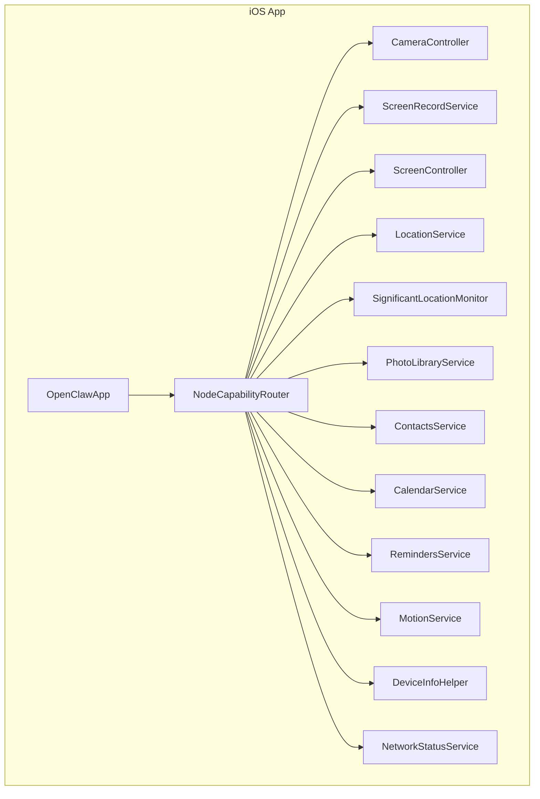

**Diagram sources**
- [OpenClawApp.swift:499-549](file://apps/ios/Sources/OpenClawApp.swift#L499-L549)
- [NodeCapabilityRouter.swift:1-26](file://apps/ios/Sources/Capabilities/NodeCapabilityRouter.swift#L1-L26)
- [CameraController.swift:1-354](file://apps/ios/Sources/Camera/CameraController.swift#L1-L354)
- [ScreenRecordService.swift:1-352](file://apps/ios/Sources/Screen/ScreenRecordService.swift#L1-L352)
- [ScreenController.swift:1-290](file://apps/ios/Sources/Screen/ScreenController.swift#L1-L290)
- [LocationService.swift:1-179](file://apps/ios/Sources/Location/LocationService.swift#L1-L179)
- [SignificantLocationMonitor.swift:1-43](file://apps/ios/Sources/Location/SignificantLocationMonitor.swift#L1-L43)
- [PhotoLibraryService.swift:1-165](file://apps/ios/Sources/Media/PhotoLibraryService.swift#L1-L165)
- [ContactsService.swift:1-211](file://apps/ios/Sources/Contacts/ContactsService.swift#L1-L211)
- [CalendarService.swift:1-136](file://apps/ios/Sources/Calendar/CalendarService.swift#L1-L136)
- [RemindersService.swift:1-134](file://apps/ios/Sources/Reminders/RemindersService.swift#L1-L134)
- [MotionService.swift:1-101](file://apps/ios/Sources/Motion/MotionService.swift#L1-L101)
- [DeviceInfoHelper.swift:1-74](file://apps/ios/Sources/Device/DeviceInfoHelper.swift#L1-L74)
- [NetworkStatusService.swift:1-70](file://apps/ios/Sources/Device/NetworkStatusService.swift#L1-L70)

**Section sources**
- [OpenClawApp.swift:499-549](file://apps/ios/Sources/OpenClawApp.swift#L499-L549)
- [NodeCapabilityRouter.swift:1-26](file://apps/ios/Sources/Capabilities/NodeCapabilityRouter.swift#L1-L26)

## Core Components
- CameraController: captures photos and short video clips, applies quality/size limits, and returns transport-safe base64 payloads.
- ScreenRecordService: records screen with optional audio, writes MP4 via AVAssetWriter, and enforces rate limits.
- ScreenController: renders and snapshots the in-app canvas, enabling screen sharing scenarios via base64 images.
- LocationService: requests permissions, resolves current location with timeouts, streams updates, and supports significant change monitoring.
- SignificantLocationMonitor: forwards significant location updates to the gateway for server-side logic.
- PhotoLibraryService: enumerates recent photos, scales and compresses to meet transport constraints, and returns base64 payloads.
- ContactsService: searches and adds contacts, normalizes identifiers, and validates inputs.
- CalendarService: lists and creates calendar events with calendar resolution and ISO-8601 parsing.
- RemindersService: lists and creates reminders with due date handling and list resolution.
- MotionService: activity recognition and step counting with authorization checks.
- DeviceInfoHelper: collects platform, device family, model, and app version strings.
- NetworkStatusService: monitors network path and interface types with a timeout-backed resolver.

**Section sources**
- [CameraController.swift:1-354](file://apps/ios/Sources/Camera/CameraController.swift#L1-L354)
- [ScreenRecordService.swift:1-352](file://apps/ios/Sources/Screen/ScreenRecordService.swift#L1-L352)
- [ScreenController.swift:1-290](file://apps/ios/Sources/Screen/ScreenController.swift#L1-L290)
- [LocationService.swift:1-179](file://apps/ios/Sources/Location/LocationService.swift#L1-L179)
- [SignificantLocationMonitor.swift:1-43](file://apps/ios/Sources/Location/SignificantLocationMonitor.swift#L1-L43)
- [PhotoLibraryService.swift:1-165](file://apps/ios/Sources/Media/PhotoLibraryService.swift#L1-L165)
- [ContactsService.swift:1-211](file://apps/ios/Sources/Contacts/ContactsService.swift#L1-L211)
- [CalendarService.swift:1-136](file://apps/ios/Sources/Calendar/CalendarService.swift#L1-L136)
- [RemindersService.swift:1-134](file://apps/ios/Sources/Reminders/RemindersService.swift#L1-L134)
- [MotionService.swift:1-101](file://apps/ios/Sources/Motion/MotionService.swift#L1-L101)
- [DeviceInfoHelper.swift:1-74](file://apps/ios/Sources/Device/DeviceInfoHelper.swift#L1-L74)
- [NetworkStatusService.swift:1-70](file://apps/ios/Sources/Device/NetworkStatusService.swift#L1-L70)

## Architecture Overview
The app exposes capabilities via a command router that dispatches to specialized services. Permissions are requested proactively or upon demand, with explicit checks to avoid blocking node.invoke. Background tasks and notifications support wake-up and mirroring flows.

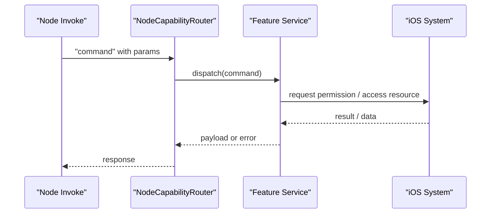

**Diagram sources**
- [NodeCapabilityRouter.swift:1-26](file://apps/ios/Sources/Capabilities/NodeCapabilityRouter.swift#L1-L26)
- [OpenClawApp.swift:499-549](file://apps/ios/Sources/OpenClawApp.swift#L499-L549)

## Detailed Component Analysis

### Camera
- Photo capture:
  - Ensures camera/microphone authorization before session setup.
  - Warms up capture session and supports configurable delay.
  - Captures photo data and transcodes to JPEG with adjustable max width and quality.
  - Returns format, base64, width, and height.
- Video clip:
  - Supports front/back camera selection and device ID targeting.
  - Records short clips with optional audio, exports MOV to MP4, and returns base64 with duration and audio flag.
- Device enumeration:
  - Lists available video devices with position and type.
- Quality and duration limits:
  - Clamps quality to a safe range and duration to prevent excessive payloads.

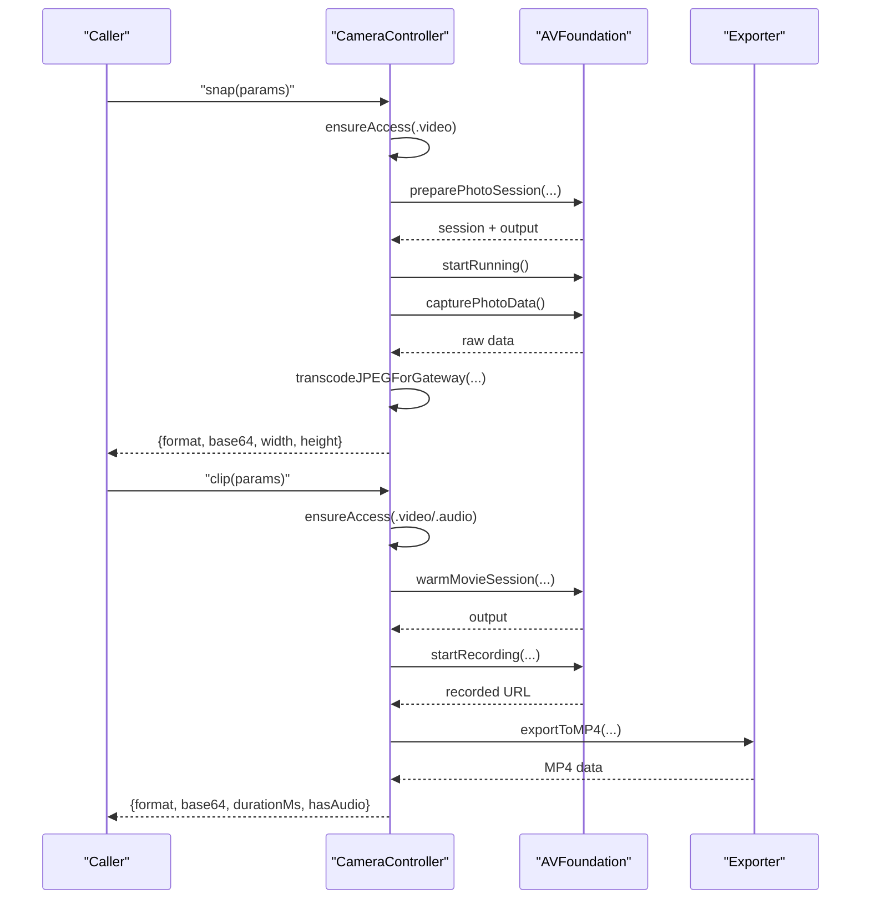

**Diagram sources**
- [CameraController.swift:40-142](file://apps/ios/Sources/Camera/CameraController.swift#L40-L142)

Practical usage examples:
- Snap a photo with a 1600px max width and 90% quality.
- Record a 3-second clip with audio, then share the base64 payload.
- List cameras and select a specific device by ID.

Permission handling and privacy:
- Permission errors are surfaced as structured errors; callers should present actionable guidance to users.
- Base64 payloads are bounded to avoid gateway transport issues.

**Section sources**
- [CameraController.swift:14-38](file://apps/ios/Sources/Camera/CameraController.swift#L14-L38)
- [CameraController.swift:40-142](file://apps/ios/Sources/Camera/CameraController.swift#L40-L142)
- [CameraController.swift:144-204](file://apps/ios/Sources/Camera/CameraController.swift#L144-L204)
- [CameraController.swift:206-215](file://apps/ios/Sources/Camera/CameraController.swift#L206-L215)
- [CameraController.swift:217-252](file://apps/ios/Sources/Camera/CameraController.swift#L217-L252)
- [CameraController.swift:254-259](file://apps/ios/Sources/Camera/CameraController.swift#L254-L259)

### Screen Recording and Screen Sharing
- Screen recording:
  - Starts/stops ReplayKit capture with optional audio.
  - Serializes CMSampleBuffers, writes video/audio via AVAssetWriter, and finalizes the file.
  - Enforces duration and FPS limits and skips frames below target FPS.
- Screen sharing:
  - ScreenController snapshots the in-app canvas to PNG/JPEG base64 for immediate sharing.
  - Provides JavaScript evaluation and A2UI integration for dynamic UI rendering.

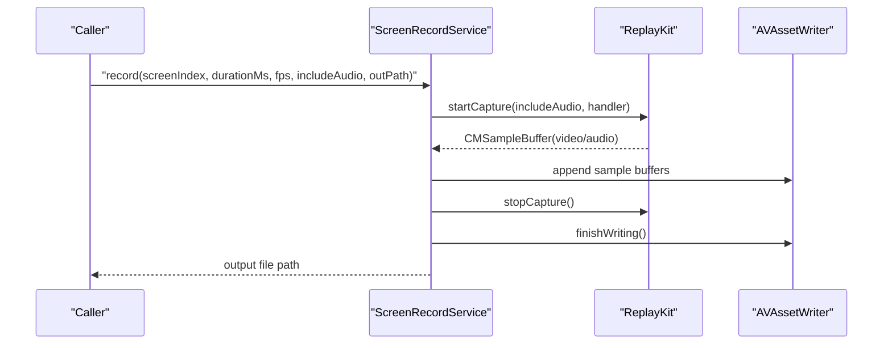

**Diagram sources**
- [ScreenRecordService.swift:44-68](file://apps/ios/Sources/Screen/ScreenRecordService.swift#L44-L68)
- [ScreenRecordService.swift:112-133](file://apps/ios/Sources/Screen/ScreenRecordService.swift#L112-L133)
- [ScreenRecordService.swift:135-164](file://apps/ios/Sources/Screen/ScreenRecordService.swift#L135-L164)
- [ScreenRecordService.swift:166-205](file://apps/ios/Sources/Screen/ScreenRecordService.swift#L166-L205)
- [ScreenRecordService.swift:207-263](file://apps/ios/Sources/Screen/ScreenRecordService.swift#L207-L263)
- [ScreenRecordService.swift:278-285](file://apps/ios/Sources/Screen/ScreenRecordService.swift#L278-L285)
- [ScreenRecordService.swift:287-302](file://apps/ios/Sources/Screen/ScreenRecordService.swift#L287-L302)
- [ScreenRecordService.swift:304-321](file://apps/ios/Sources/Screen/ScreenRecordService.swift#L304-L321)

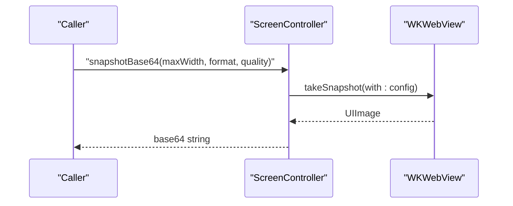

**Diagram sources**
- [ScreenController.swift:150-181](file://apps/ios/Sources/Screen/ScreenController.swift#L150-L181)

Practical usage examples:
- Record a 10-second screen with 15 FPS and audio, then upload the MP4.
- Snapshot the current canvas as PNG for immediate sharing.

Permission handling and privacy:
- Screen recording requires appropriate system permissions; failures are reported with descriptive errors.
- Canvas snapshots are contained within the app and do not require external permissions.

**Section sources**
- [ScreenRecordService.swift:27-42](file://apps/ios/Sources/Screen/ScreenRecordService.swift#L27-L42)
- [ScreenRecordService.swift:77-102](file://apps/ios/Sources/Screen/ScreenRecordService.swift#L77-L102)
- [ScreenRecordService.swift:112-133](file://apps/ios/Sources/Screen/ScreenRecordService.swift#L112-L133)
- [ScreenRecordService.swift:135-164](file://apps/ios/Sources/Screen/ScreenRecordService.swift#L135-L164)
- [ScreenRecordService.swift:166-205](file://apps/ios/Sources/Screen/ScreenRecordService.swift#L166-L205)
- [ScreenRecordService.swift:207-263](file://apps/ios/Sources/Screen/ScreenRecordService.swift#L207-L263)
- [ScreenRecordService.swift:278-302](file://apps/ios/Sources/Screen/ScreenRecordService.swift#L278-L302)
- [ScreenRecordService.swift:304-321](file://apps/ios/Sources/Screen/ScreenRecordService.swift#L304-L321)
- [ScreenController.swift:150-181](file://apps/ios/Sources/Screen/ScreenController.swift#L150-L181)

### Location Services (GPS, Updates, Significant Changes)
- Authorization modes:
  - When-in-use and always authorization are supported; transitions are handled when switching modes.
- Current location:
  - Resolves a single location with desired accuracy, max age, and timeout.
- Streaming:
  - Starts location updates with configurable accuracy; supports significant changes only mode.
- Significant location changes:
  - Monitors background location changes and forwards updates to the gateway for server-side logic.

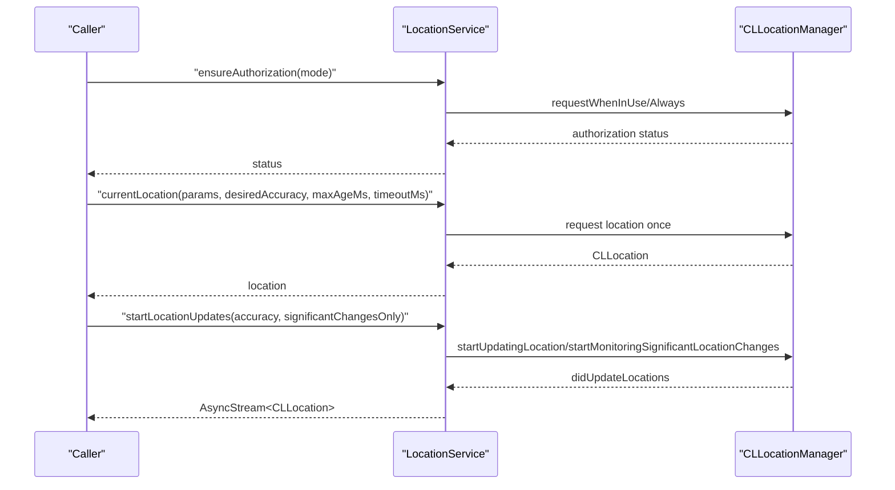

**Diagram sources**
- [LocationService.swift:34-54](file://apps/ios/Sources/Location/LocationService.swift#L34-L54)
- [LocationService.swift:56-72](file://apps/ios/Sources/Location/LocationService.swift#L56-L72)
- [LocationService.swift:87-112](file://apps/ios/Sources/Location/LocationService.swift#L87-L112)
- [LocationService.swift:114-121](file://apps/ios/Sources/Location/LocationService.swift#L114-L121)
- [LocationService.swift:123-135](file://apps/ios/Sources/Location/LocationService.swift#L123-L135)
- [LocationService.swift:137-168](file://apps/ios/Sources/Location/LocationService.swift#L137-L168)

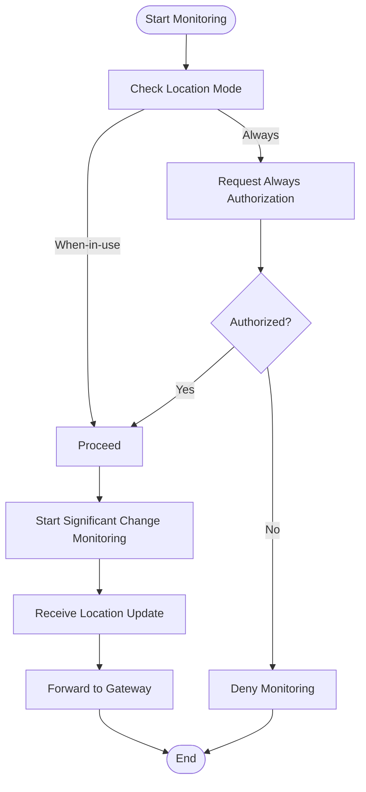

**Diagram sources**
- [SignificantLocationMonitor.swift:10-41](file://apps/ios/Sources/Location/SignificantLocationMonitor.swift#L10-L41)

Practical usage examples:
- Request always authorization and stream significant location changes for geofencing triggers.
- Fetch current location with a 5-second timeout and 100m accuracy.

Permission handling and privacy:
- Authorization prompts are initiated by the service; callers should guide users to settings if blocked.
- Significant location monitoring runs in the background and sends lightweight updates to the gateway.

**Section sources**
- [LocationService.swift:5-11](file://apps/ios/Sources/Location/LocationService.swift#L5-L11)
- [LocationService.swift:34-54](file://apps/ios/Sources/Location/LocationService.swift#L34-L54)
- [LocationService.swift:56-72](file://apps/ios/Sources/Location/LocationService.swift#L56-L72)
- [LocationService.swift:87-121](file://apps/ios/Sources/Location/LocationService.swift#L87-L121)
- [LocationService.swift:123-135](file://apps/ios/Sources/Location/LocationService.swift#L123-L135)
- [LocationService.swift:137-168](file://apps/ios/Sources/Location/LocationService.swift#L137-L168)
- [SignificantLocationMonitor.swift:1-43](file://apps/ios/Sources/Location/SignificantLocationMonitor.swift#L1-L43)

### Media Library Access (Photos)
- Latest photos:
  - Requests authorization and enumerates recent images with a configurable limit.
  - Renders images to JPEG with constrained max width and quality, ensuring total payload stays within transport limits.
  - Returns base64 with dimensions and creation date.

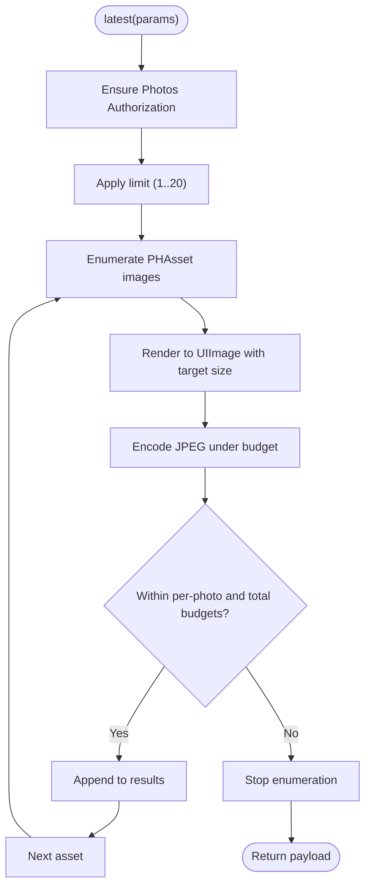

**Diagram sources**
- [PhotoLibraryService.swift:16-55](file://apps/ios/Sources/Media/PhotoLibraryService.swift#L16-L55)
- [PhotoLibraryService.swift:62-109](file://apps/ios/Sources/Media/PhotoLibraryService.swift#L62-L109)
- [PhotoLibraryService.swift:111-148](file://apps/ios/Sources/Media/PhotoLibraryService.swift#L111-L148)

Practical usage examples:
- Retrieve the 5 most recent photos with a max width of 1600px and moderate quality.

Permission handling and privacy:
- Authorization is checked without prompting during node.invoke; callers should instruct users to grant permission.

**Section sources**
- [PhotoLibraryService.swift:6-15](file://apps/ios/Sources/Media/PhotoLibraryService.swift#L6-L15)
- [PhotoLibraryService.swift:16-55](file://apps/ios/Sources/Media/PhotoLibraryService.swift#L16-L55)
- [PhotoLibraryService.swift:62-109](file://apps/ios/Sources/Media/PhotoLibraryService.swift#L62-L109)
- [PhotoLibraryService.swift:111-148](file://apps/ios/Sources/Media/PhotoLibraryService.swift#L111-L148)

### Contacts Integration
- Search:
  - Searches by name or enumerates contacts with a configurable limit.
  - Returns a subset of fields suitable for communication coordination.
- Add:
  - Validates inputs, normalizes phone/email, deduplicates against existing contacts, and persists to the contact store.

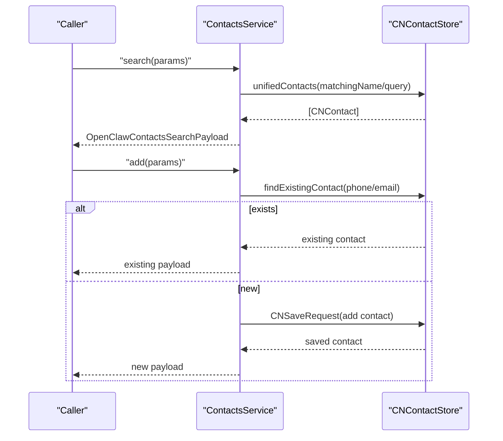

**Diagram sources**
- [ContactsService.swift:17-40](file://apps/ios/Sources/Contacts/ContactsService.swift#L17-L40)
- [ContactsService.swift:42-99](file://apps/ios/Sources/Contacts/ContactsService.swift#L42-L99)
- [ContactsService.swift:116-126](file://apps/ios/Sources/Contacts/ContactsService.swift#L116-L126)
- [ContactsService.swift:135-184](file://apps/ios/Sources/Contacts/ContactsService.swift#L135-L184)

Practical usage examples:
- Search for a contact by partial name and add a new contact with normalized phone/email.

Permission handling and privacy:
- Authorization is checked without prompting; callers should guide users to settings.

**Section sources**
- [ContactsService.swift:5-15](file://apps/ios/Sources/Contacts/ContactsService.swift#L5-L15)
- [ContactsService.swift:17-40](file://apps/ios/Sources/Contacts/ContactsService.swift#L17-L40)
- [ContactsService.swift:42-99](file://apps/ios/Sources/Contacts/ContactsService.swift#L42-L99)
- [ContactsService.swift:101-126](file://apps/ios/Sources/Contacts/ContactsService.swift#L101-L126)
- [ContactsService.swift:135-184](file://apps/ios/Sources/Contacts/ContactsService.swift#L135-L184)

### Calendar and Reminders Synchronization
- Calendar:
  - Lists events within a date range with a configurable limit.
  - Adds events with ISO-8601 start/end, optional all-day, location, and notes; resolves calendar by ID/title or default.
- Reminders:
  - Lists reminders filtered by status with a configurable limit.
  - Adds reminders with optional due date; resolves list by ID/title or default.

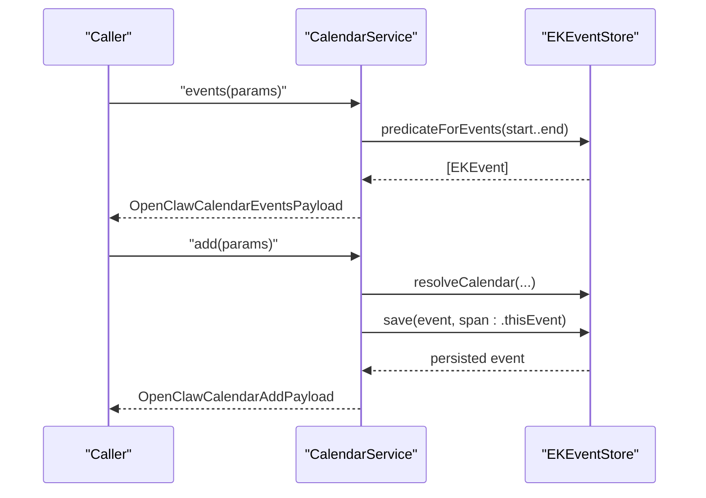

**Diagram sources**
- [CalendarService.swift:6-37](file://apps/ios/Sources/Calendar/CalendarService.swift#L6-L37)
- [CalendarService.swift:39-96](file://apps/ios/Sources/Calendar/CalendarService.swift#L39-L96)
- [CalendarService.swift:98-134](file://apps/ios/Sources/Calendar/CalendarService.swift#L98-L134)

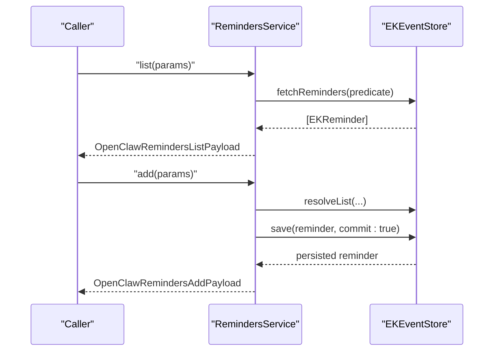

**Diagram sources**
- [RemindersService.swift:6-48](file://apps/ios/Sources/Reminders/RemindersService.swift#L6-L48)
- [RemindersService.swift:50-101](file://apps/ios/Sources/Reminders/RemindersService.swift#L50-L101)
- [RemindersService.swift:103-132](file://apps/ios/Sources/Reminders/RemindersService.swift#L103-L132)

Practical usage examples:
- Add a calendar event for tomorrow with a location and notes.
- Create a reminder due today with a specific list.

Permission handling and privacy:
- Read/write permissions are checked; callers should prompt users to grant access.

**Section sources**
- [CalendarService.swift:5-14](file://apps/ios/Sources/Calendar/CalendarService.swift#L5-L14)
- [CalendarService.swift:16-37](file://apps/ios/Sources/Calendar/CalendarService.swift#L16-L37)
- [CalendarService.swift:39-96](file://apps/ios/Sources/Calendar/CalendarService.swift#L39-L96)
- [CalendarService.swift:98-134](file://apps/ios/Sources/Calendar/CalendarService.swift#L98-L134)
- [RemindersService.swift:5-14](file://apps/ios/Sources/Reminders/RemindersService.swift#L5-L14)
- [RemindersService.swift:16-48](file://apps/ios/Sources/Reminders/RemindersService.swift#L16-L48)
- [RemindersService.swift:50-101](file://apps/ios/Sources/Reminders/RemindersService.swift#L50-L101)
- [RemindersService.swift:103-132](file://apps/ios/Sources/Reminders/RemindersService.swift#L103-L132)

### Motion Detection (Activity Recognition and Steps)
- Activity recognition:
  - Queries motion activities within a date range with a configurable limit and confidence mapping.
- Pedometer:
  - Retrieves step count, distance, and floor counts within a date range.

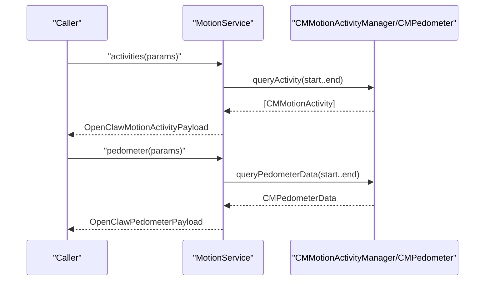

**Diagram sources**
- [MotionService.swift:6-48](file://apps/ios/Sources/Motion/MotionService.swift#L6-L48)
- [MotionService.swift:50-83](file://apps/ios/Sources/Motion/MotionService.swift#L50-L83)

Practical usage examples:
- Get today’s walking and running activities with medium confidence.
- Summarize steps and distance for the past week.

Permission handling and privacy:
- Requires Motion & Fitness authorization; otherwise returns descriptive errors.

**Section sources**
- [MotionService.swift:5-17](file://apps/ios/Sources/Motion/MotionService.swift#L5-L17)
- [MotionService.swift:19-47](file://apps/ios/Sources/Motion/MotionService.swift#L19-L47)
- [MotionService.swift:50-83](file://apps/ios/Sources/Motion/MotionService.swift#L50-L83)

### Device Information and Network Status
- Device info:
  - Platform string, device family, model identifier, app version/build, and display-friendly version string.
- Network status:
  - Monitors NWPath with a timeout-backed resolver, reporting satisfaction, cost/constraints, and interface types.

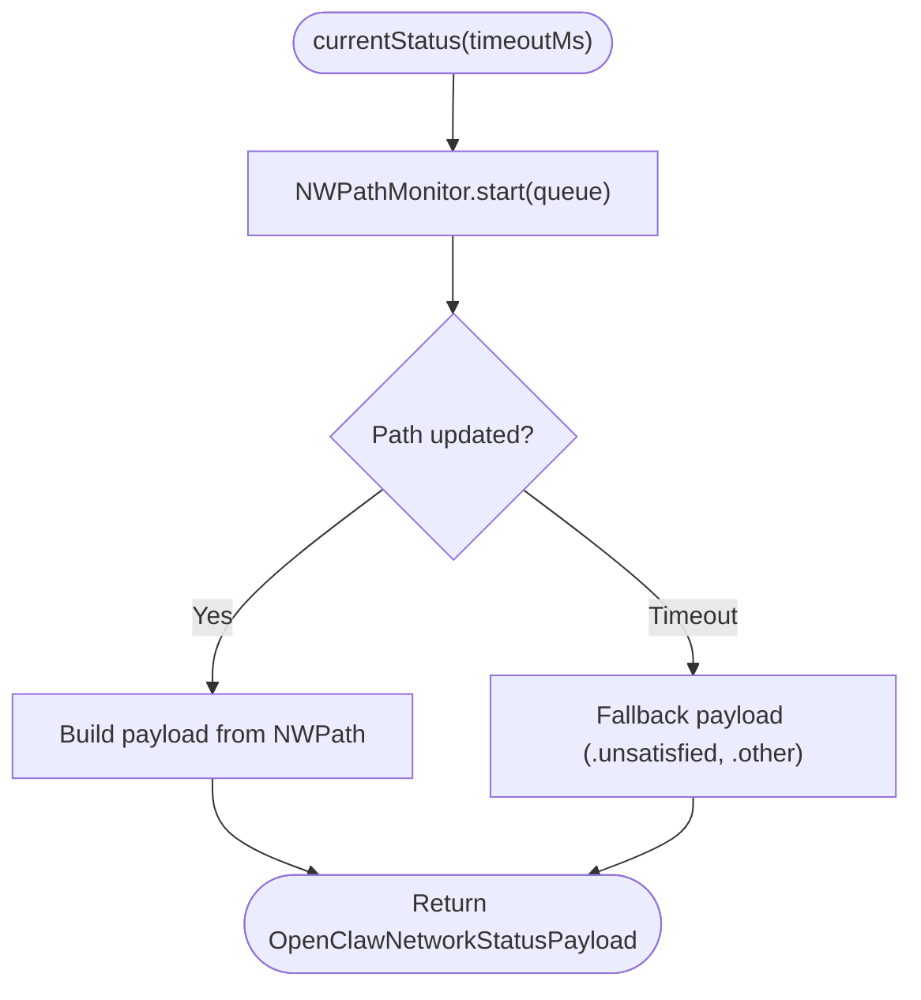

**Diagram sources**
- [NetworkStatusService.swift:6-26](file://apps/ios/Sources/Device/NetworkStatusService.swift#L6-L26)
- [NetworkStatusService.swift:28-55](file://apps/ios/Sources/Device/NetworkStatusService.swift#L28-L55)

Practical usage examples:
- Report network status to the gateway for routing decisions.

**Section sources**
- [DeviceInfoHelper.swift:7-73](file://apps/ios/Sources/Device/DeviceInfoHelper.swift#L7-L73)
- [NetworkStatusService.swift:5-70](file://apps/ios/Sources/Device/NetworkStatusService.swift#L5-L70)

## Dependency Analysis
- Command routing:
  - NodeCapabilityRouter maps commands to handlers, enabling modular capability expansion.
- Background and notifications:
  - OpenClawApp integrates background task scheduling, silent push handling, and watch prompt mirroring via UNUserNotificationCenter.

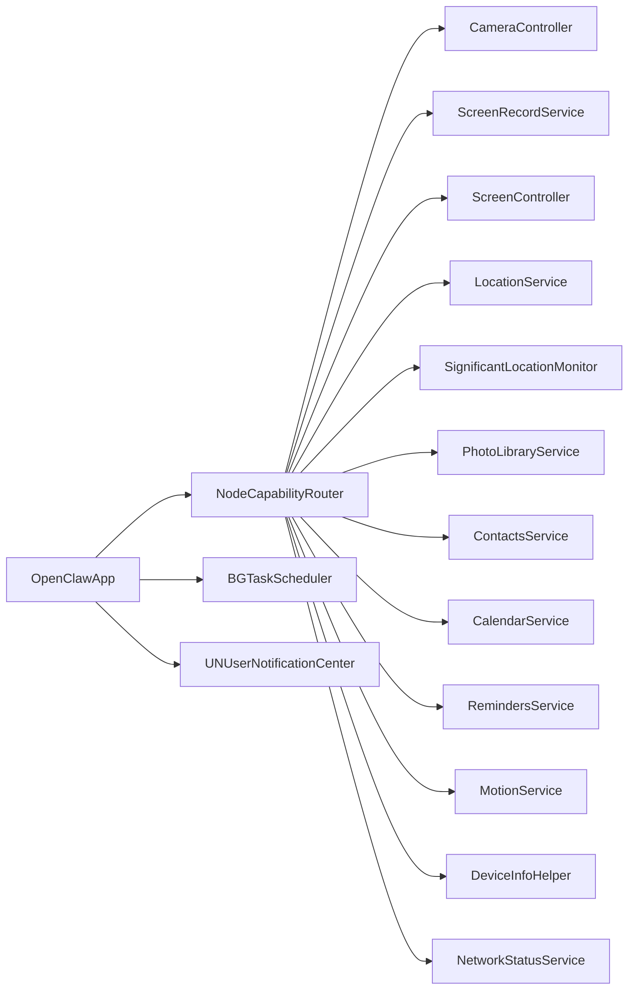

**Diagram sources**
- [NodeCapabilityRouter.swift:1-26](file://apps/ios/Sources/Capabilities/NodeCapabilityRouter.swift#L1-L26)
- [OpenClawApp.swift:104-156](file://apps/ios/Sources/OpenClawApp.swift#L104-L156)
- [OpenClawApp.swift:232-262](file://apps/ios/Sources/OpenClawApp.swift#L232-L262)

**Section sources**
- [NodeCapabilityRouter.swift:1-26](file://apps/ios/Sources/Capabilities/NodeCapabilityRouter.swift#L1-L26)
- [OpenClawApp.swift:104-156](file://apps/ios/Sources/OpenClawApp.swift#L104-L156)
- [OpenClawApp.swift:232-262](file://apps/ios/Sources/OpenClawApp.swift#L232-L262)

## Performance Considerations
- Payload sizing:
  - CameraController and PhotoLibraryService cap quality/width and total base64 length to avoid gateway transport issues.
- Frame pacing:
  - ScreenRecordService skips video frames below target FPS to reduce CPU and I/O overhead.
- Background responsiveness:
  - Location updates and significant change monitoring minimize battery impact by using system APIs designed for background operation.
- Network probing:
  - NetworkStatusService uses a timeout to avoid long waits on network queries.

[No sources needed since this section provides general guidance]

## Troubleshooting Guide
- Camera errors:
  - CameraUnavailable, MicrophoneUnavailable, PermissionDenied, InvalidParams, CaptureFailed, ExportFailed.
  - Actions: verify permissions, reduce duration/quality, and confirm device availability.
- Screen recording errors:
  - InvalidScreenIndex, CaptureFailed, WriteFailed.
  - Actions: ensure audio/video permissions, check output path, and validate duration/FPS limits.
- Location errors:
  - Timeout, Unavailable.
  - Actions: increase timeout, verify accuracy settings, and ensure location services are enabled.
- Media library errors:
  - Insufficient budget for base64; adjust max width/quality or reduce limit.
- Contacts/Calendar/Reminders errors:
  - Permission required; guide users to Settings.
  - Validation errors for missing fields; ensure required parameters are provided.
- Motion errors:
  - Activity or pedometer unavailable; verify device support and Motion & Fitness authorization.

**Section sources**
- [CameraController.swift:14-38](file://apps/ios/Sources/Camera/CameraController.swift#L14-L38)
- [ScreenRecordService.swift:27-42](file://apps/ios/Sources/Screen/ScreenRecordService.swift#L27-L42)
- [LocationService.swift:7-10](file://apps/ios/Sources/Location/LocationService.swift#L7-L10)
- [PhotoLibraryService.swift:16-22](file://apps/ios/Sources/Media/PhotoLibraryService.swift#L16-L22)
- [CalendarService.swift:10-14](file://apps/ios/Sources/Calendar/CalendarService.swift#L10-L14)
- [RemindersService.swift:10-14](file://apps/ios/Sources/Reminders/RemindersService.swift#L10-L14)
- [MotionService.swift:7-17](file://apps/ios/Sources/Motion/MotionService.swift#L7-L17)

## Conclusion
The OpenClaw iOS app integrates a broad set of device capabilities with careful attention to permission handling, transport constraints, and background responsiveness. Camera, screen recording, location, media, contacts, calendar/reminders, motion, device info, and network status are exposed via a clean command router, enabling robust automation and collaboration scenarios while preserving user privacy and system performance.