# Gateway Connection

<cite>
**Referenced Files in This Document**
- [GatewayConnectionController.swift](file://apps/ios/Sources/Gateway/GatewayConnectionController.swift)
- [GatewayDiscoveryModel.swift](file://apps/ios/Sources/Gateway/GatewayDiscoveryModel.swift)
- [GatewayServiceResolver.swift](file://apps/ios/Sources/Gateway/GatewayServiceResolver.swift)
- [GatewayTrustPromptAlert.swift](file://apps/ios/Sources/Gateway/GatewayTrustPromptAlert.swift)
- [GatewayHealthMonitor.swift](file://apps/ios/Sources/Gateway/GatewayHealthMonitor.swift)
- [GatewaySetupCode.swift](file://apps/ios/Sources/Gateway/GatewaySetupCode.swift)
- [GatewaySettingsStore.swift](file://apps/ios/Sources/Gateway/GatewaySettingsStore.swift)
- [TCPProbe.swift](file://apps/ios/Sources/Gateway/TCPProbe.swift)
- [KeychainStore.swift](file://apps/ios/Sources/Gateway/KeychainStore.swift)
</cite>

## Table of Contents
1. [Introduction](#introduction)
2. [Project Structure](#project-structure)
3. [Core Components](#core-components)
4. [Architecture Overview](#architecture-overview)
5. [Detailed Component Analysis](#detailed-component-analysis)
6. [Dependency Analysis](#dependency-analysis)
7. [Performance Considerations](#performance-considerations)
8. [Troubleshooting Guide](#troubleshooting-guide)
9. [Conclusion](#conclusion)

## Introduction
This document explains the iOS gateway connection system for connecting securely to OpenClaw Gateway instances. It covers:
- Discovering gateways using Bonjour/Zeroconf
- Manual configuration entry
- Setup code pairing workflow
- Trust verification via TLS certificate fingerprinting and user consent
- Managing WebSocket connections, reconnection logic, and health monitoring
- Practical setup flows, troubleshooting, and security considerations

## Project Structure
The iOS gateway connection logic lives under apps/ios/Sources/Gateway. Key modules include discovery, service resolution, trust prompts, health monitoring, settings persistence, and TCP probing utilities.

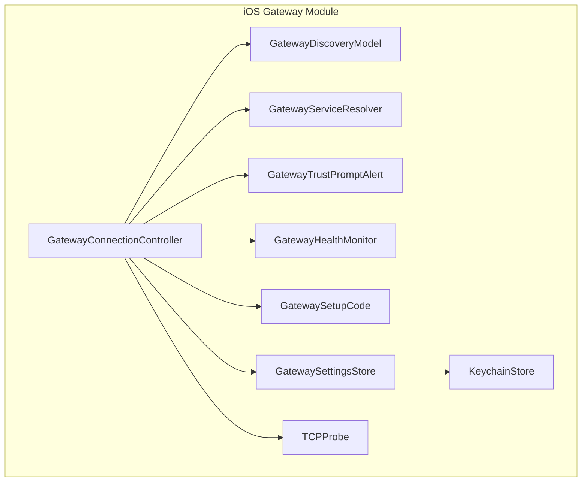

**Diagram sources**
- [GatewayConnectionController.swift:20-120](file://apps/ios/Sources/Gateway/GatewayConnectionController.swift#L20-L120)
- [GatewayDiscoveryModel.swift:6-38](file://apps/ios/Sources/Gateway/GatewayDiscoveryModel.swift#L6-L38)
- [GatewayServiceResolver.swift:4-25](file://apps/ios/Sources/Gateway/GatewayServiceResolver.swift#L4-L25)
- [GatewayTrustPromptAlert.swift:3-34](file://apps/ios/Sources/Gateway/GatewayTrustPromptAlert.swift#L3-L34)
- [GatewayHealthMonitor.swift:4-24](file://apps/ios/Sources/Gateway/GatewayHealthMonitor.swift#L4-L24)
- [GatewaySetupCode.swift:13-24](file://apps/ios/Sources/Gateway/GatewaySetupCode.swift#L13-L24)
- [GatewaySettingsStore.swift:4-35](file://apps/ios/Sources/Gateway/GatewaySettingsStore.swift#L4-L35)
- [TCPProbe.swift:5-41](file://apps/ios/Sources/Gateway/TCPProbe.swift#L5-L41)
- [KeychainStore.swift:4-16](file://apps/ios/Sources/Gateway/KeychainStore.swift#L4-L16)

**Section sources**
- [GatewayConnectionController.swift:20-120](file://apps/ios/Sources/Gateway/GatewayConnectionController.swift#L20-L120)
- [GatewayDiscoveryModel.swift:6-38](file://apps/ios/Sources/Gateway/GatewayDiscoveryModel.swift#L6-L38)

## Core Components
- GatewayConnectionController: Orchestrates discovery, trust prompts, manual and discovered connections, TLS pinning, and auto-reconnect.
- GatewayDiscoveryModel: Discovers gateways via Bonjour/Zeroconf and exposes status, debug logs, and discovered gateways.
- GatewayServiceResolver: Resolves SRV/A/AAAA records for a Bonjour service endpoint without trusting TXT for routing.
- GatewayTrustPromptAlert: Presents a user prompt to accept or decline a new TLS fingerprint.
- GatewayHealthMonitor: Periodically checks gateway health with timeouts and failure thresholds.
- GatewaySetupCode: Decodes setup codes containing connection parameters and credentials.
- GatewaySettingsStore: Persists and loads connection preferences, tokens, passwords, and last connection state using Keychain.
- TCPProbe: Probes TCP reachability to a host/port with timeout.
- KeychainStore: Thin wrapper around secure storage for tokens and credentials.

**Section sources**
- [GatewayConnectionController.swift:20-120](file://apps/ios/Sources/Gateway/GatewayConnectionController.swift#L20-L120)
- [GatewayDiscoveryModel.swift:6-38](file://apps/ios/Sources/Gateway/GatewayDiscoveryModel.swift#L6-L38)
- [GatewayServiceResolver.swift:4-25](file://apps/ios/Sources/Gateway/GatewayServiceResolver.swift#L4-L25)
- [GatewayTrustPromptAlert.swift:3-34](file://apps/ios/Sources/Gateway/GatewayTrustPromptAlert.swift#L3-L34)
- [GatewayHealthMonitor.swift:4-24](file://apps/ios/Sources/Gateway/GatewayHealthMonitor.swift#L4-L24)
- [GatewaySetupCode.swift:13-24](file://apps/ios/Sources/Gateway/GatewaySetupCode.swift#L13-L24)
- [GatewaySettingsStore.swift:4-35](file://apps/ios/Sources/Gateway/GatewaySettingsStore.swift#L4-L35)
- [TCPProbe.swift:5-41](file://apps/ios/Sources/Gateway/TCPProbe.swift#L5-L41)
- [KeychainStore.swift:4-16](file://apps/ios/Sources/Gateway/KeychainStore.swift#L4-L16)

## Architecture Overview
The iOS app discovers gateways on the local network, optionally probes TLS fingerprints, prompts the user to trust fingerprints, and then establishes a WebSocket connection. The controller manages auto-reconnect and integrates with health monitoring.

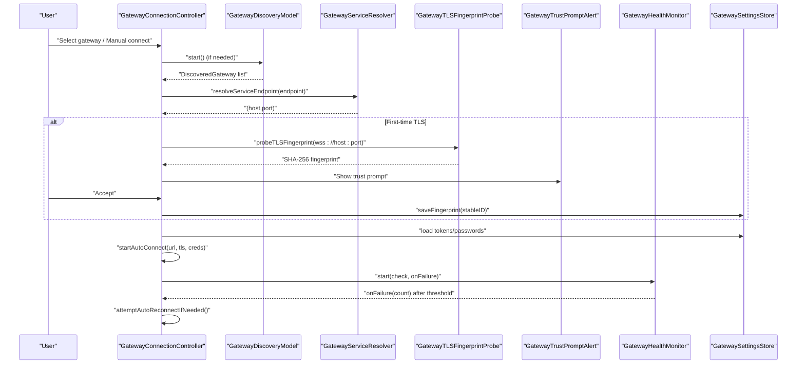

**Diagram sources**
- [GatewayConnectionController.swift:90-158](file://apps/ios/Sources/Gateway/GatewayConnectionController.swift#L90-L158)
- [GatewayDiscoveryModel.swift:51-100](file://apps/ios/Sources/Gateway/GatewayDiscoveryModel.swift#L51-L100)
- [GatewayServiceResolver.swift:23-25](file://apps/ios/Sources/Gateway/GatewayServiceResolver.swift#L23-L25)
- [GatewayConnectionController.swift:528-535](file://apps/ios/Sources/Gateway/GatewayConnectionController.swift#L528-L535)
- [GatewayTrustPromptAlert.swift:16-34](file://apps/ios/Sources/Gateway/GatewayTrustPromptAlert.swift#L16-L34)
- [GatewayHealthMonitor.swift:26-57](file://apps/ios/Sources/Gateway/GatewayHealthMonitor.swift#L26-L57)
- [GatewaySettingsStore.swift:92-134](file://apps/ios/Sources/Gateway/GatewaySettingsStore.swift#L92-L134)

## Detailed Component Analysis

### Gateway Discovery (Bonjour/Zeroconf)
- Uses NWBrowser to discover gateways across configured domains.
- Parses TXT records for display name, ports, TLS flags, and TLS fingerprint.
- Maintains status text and a bounded debug log.
- Exposes a stable ID and pretty-printed description for each gateway.

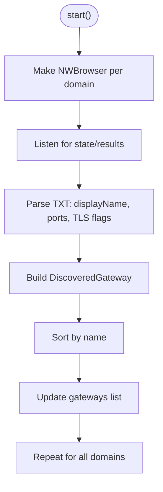

**Diagram sources**
- [GatewayDiscoveryModel.swift:51-100](file://apps/ios/Sources/Gateway/GatewayDiscoveryModel.swift#L51-L100)
- [GatewayDiscoveryModel.swift:114-127](file://apps/ios/Sources/Gateway/GatewayDiscoveryModel.swift#L114-L127)

**Section sources**
- [GatewayDiscoveryModel.swift:6-38](file://apps/ios/Sources/Gateway/GatewayDiscoveryModel.swift#L6-L38)
- [GatewayDiscoveryModel.swift:51-100](file://apps/ios/Sources/Gateway/GatewayDiscoveryModel.swift#L51-L100)
- [GatewayDiscoveryModel.swift:114-127](file://apps/ios/Sources/Gateway/GatewayDiscoveryModel.swift#L114-L127)

### Service Resolution (SRV/A/AAAA)
- Resolves a Bonjour service endpoint to a concrete host and port without relying on TXT for routing.
- Ensures robustness by scheduling on the main run loop and timing out safely.

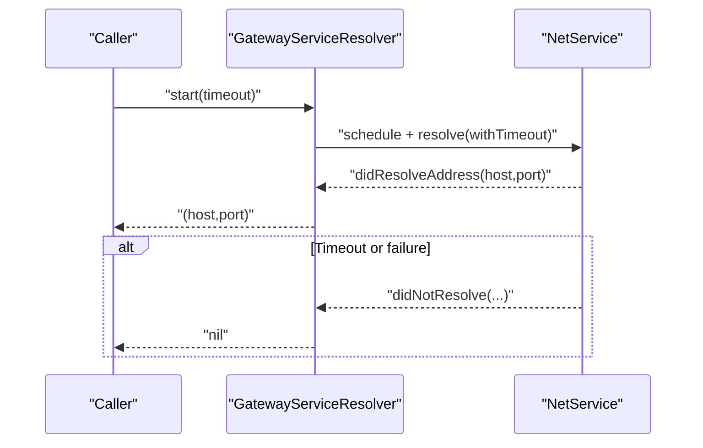

**Diagram sources**
- [GatewayServiceResolver.swift:23-47](file://apps/ios/Sources/Gateway/GatewayServiceResolver.swift#L23-L47)

**Section sources**
- [GatewayServiceResolver.swift:4-25](file://apps/ios/Sources/Gateway/GatewayServiceResolver.swift#L4-L25)
- [GatewayConnectionController.swift:537-550](file://apps/ios/Sources/Gateway/GatewayConnectionController.swift#L537-L550)

### Trust Verification and User Consent
- When connecting to a discovered gateway without a stored TLS pin, the controller probes the TLS fingerprint over a short-lived WebSocket handshake.
- Presents a prompt to accept or decline the fingerprint; acceptance persists the fingerprint and proceeds to connect.

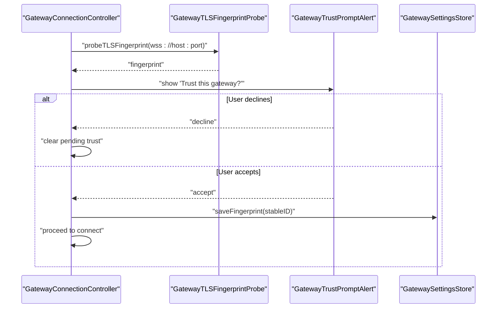

**Diagram sources**
- [GatewayConnectionController.swift:121-137](file://apps/ios/Sources/Gateway/GatewayConnectionController.swift#L121-L137)
- [GatewayConnectionController.swift:247-290](file://apps/ios/Sources/Gateway/GatewayConnectionController.swift#L247-L290)
- [GatewayTrustPromptAlert.swift:16-34](file://apps/ios/Sources/Gateway/GatewayTrustPromptAlert.swift#L16-L34)
- [GatewayConnectionController.swift:1005-1083](file://apps/ios/Sources/Gateway/GatewayConnectionController.swift#L1005-L1083)

**Section sources**
- [GatewayConnectionController.swift:121-137](file://apps/ios/Sources/Gateway/GatewayConnectionController.swift#L121-L137)
- [GatewayConnectionController.swift:247-290](file://apps/ios/Sources/Gateway/GatewayConnectionController.swift#L247-L290)
- [GatewayTrustPromptAlert.swift:3-34](file://apps/ios/Sources/Gateway/GatewayTrustPromptAlert.swift#L3-L34)

### Connection Controller Responsibilities
- Auto-connect logic: chooses manual, last-known, preferred/discovered, or single-gateway scenarios with strict TLS pin enforcement for autoconnect.
- Builds connection configuration with capabilities, commands, permissions, and client identity.
- Applies connection config to the app model and starts health monitoring.
- Handles scene lifecycle to pause/resume discovery and reconnect.

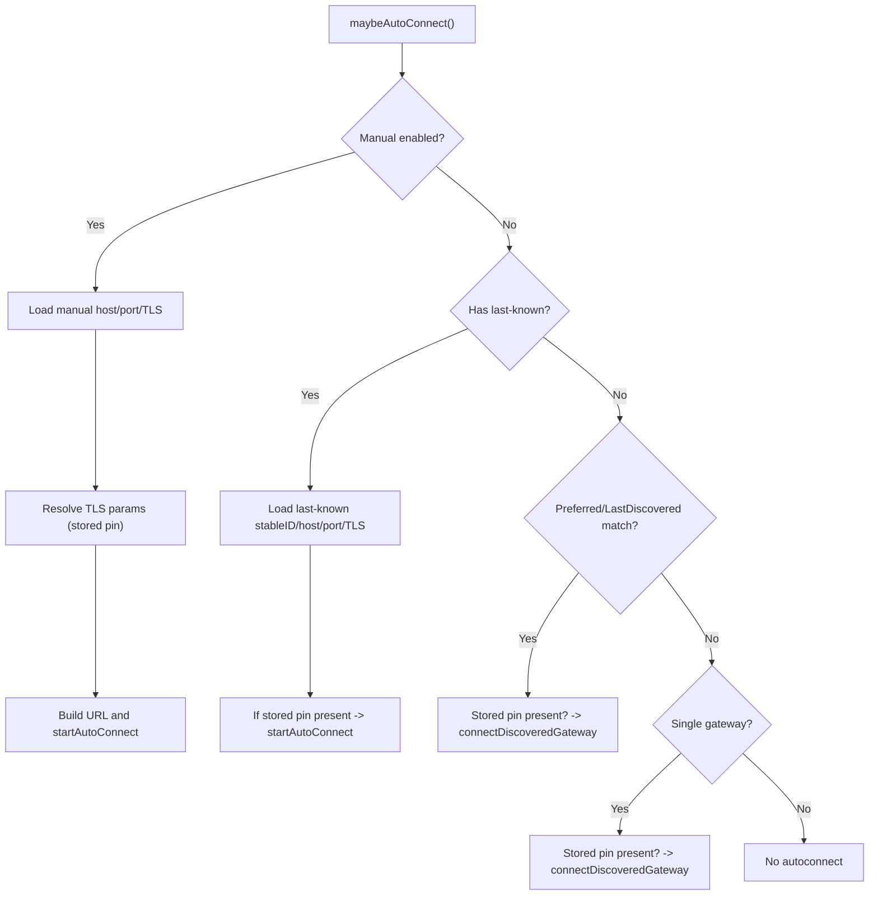

**Diagram sources**
- [GatewayConnectionController.swift:315-429](file://apps/ios/Sources/Gateway/GatewayConnectionController.swift#L315-L429)

**Section sources**
- [GatewayConnectionController.swift:315-429](file://apps/ios/Sources/Gateway/GatewayConnectionController.swift#L315-L429)
- [GatewayConnectionController.swift:456-482](file://apps/ios/Sources/Gateway/GatewayConnectionController.swift#L456-L482)

### Health Monitoring
- Periodically runs a check closure with a configurable timeout and failure threshold.
- On repeated failures, invokes an onFailure callback to trigger remediation (e.g., reconnect).

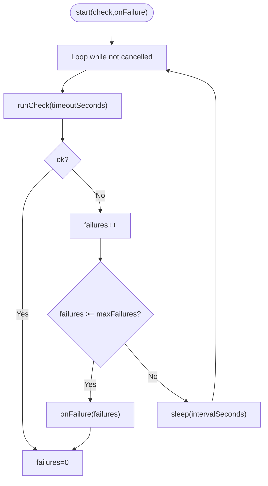

**Diagram sources**
- [GatewayHealthMonitor.swift:26-57](file://apps/ios/Sources/Gateway/GatewayHealthMonitor.swift#L26-L57)

**Section sources**
- [GatewayHealthMonitor.swift:4-86](file://apps/ios/Sources/Gateway/GatewayHealthMonitor.swift#L4-L86)

### Setup Code Pairing Workflow
- Decodes setup codes that may be JSON or Base64(JSON) payloads.
- Extracts connection parameters and credentials to prefill manual configuration or initiate a secure connection.

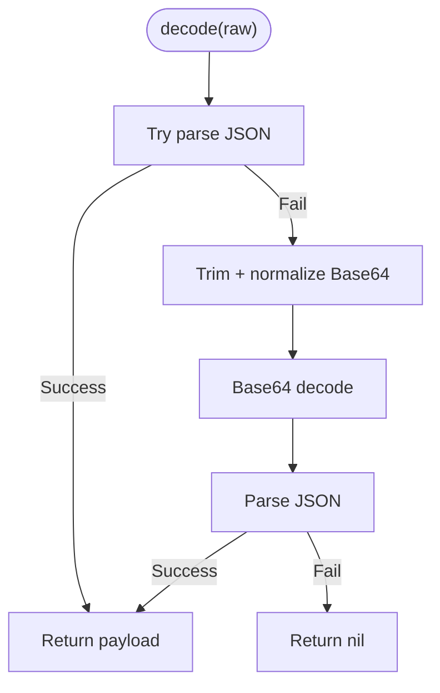

**Diagram sources**
- [GatewaySetupCode.swift:13-42](file://apps/ios/Sources/Gateway/GatewaySetupCode.swift#L13-L42)

**Section sources**
- [GatewaySetupCode.swift:3-42](file://apps/ios/Sources/Gateway/GatewaySetupCode.swift#L3-L42)

### Persistence and Security
- Stores tokens, bootstrap tokens, passwords, and last connection state in Keychain.
- Ensures a stable instance ID and migrates legacy UserDefaults entries to Keychain.
- Enforces TLS pinning for autoconnect except when TOFU is explicitly allowed (not used for autoconnect).

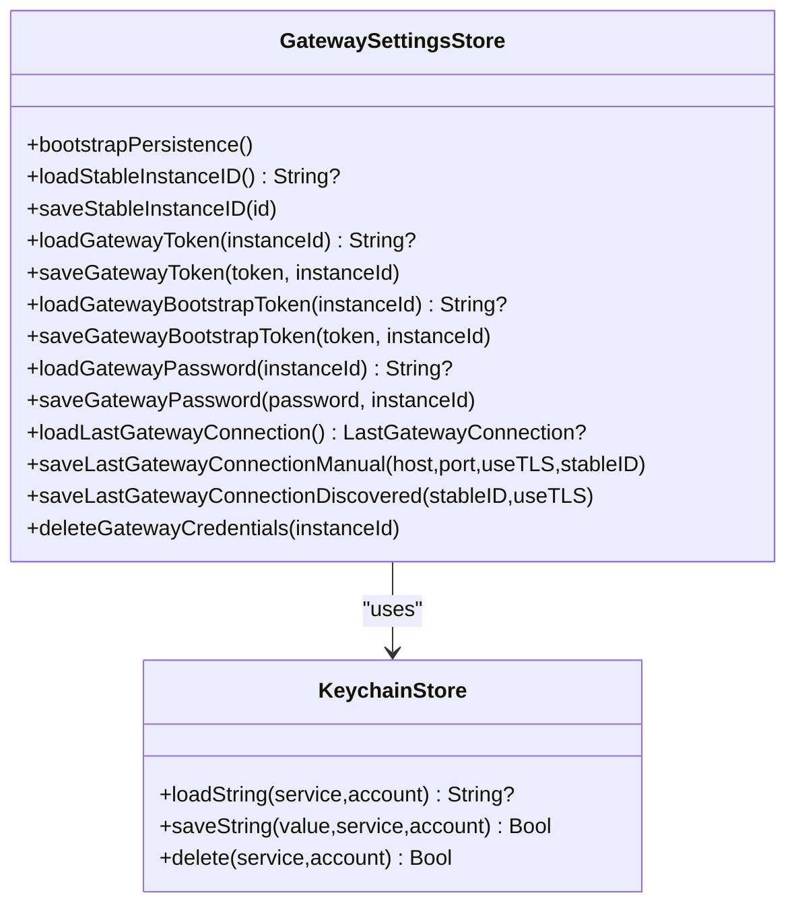

**Diagram sources**
- [GatewaySettingsStore.swift:4-35](file://apps/ios/Sources/Gateway/GatewaySettingsStore.swift#L4-L35)
- [KeychainStore.swift:4-16](file://apps/ios/Sources/Gateway/KeychainStore.swift#L4-L16)

**Section sources**
- [GatewaySettingsStore.swift:31-428](file://apps/ios/Sources/Gateway/GatewaySettingsStore.swift#L31-L428)
- [KeychainStore.swift:4-16](file://apps/ios/Sources/Gateway/KeychainStore.swift#L4-L16)

### TCP Reachability Probe
- Probes a host/port with TCP to quickly determine connectivity before attempting TLS.

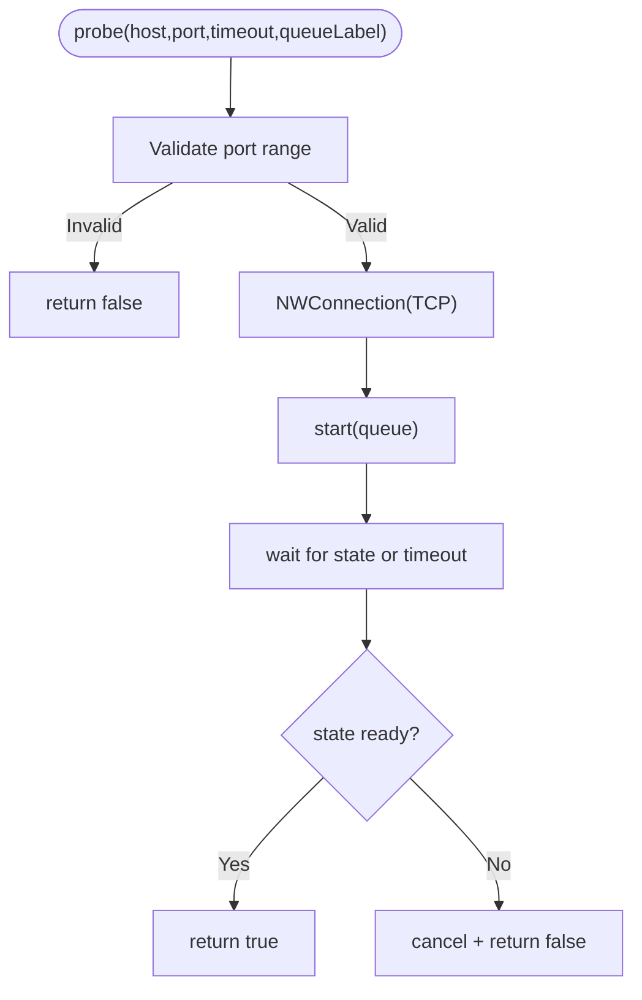

**Diagram sources**
- [TCPProbe.swift:5-41](file://apps/ios/Sources/Gateway/TCPProbe.swift#L5-L41)

**Section sources**
- [TCPProbe.swift:5-41](file://apps/ios/Sources/Gateway/TCPProbe.swift#L5-L41)

## Dependency Analysis
- GatewayConnectionController depends on Discovery, ServiceResolver, TLS probe, TrustPrompt, HealthMonitor, and SettingsStore.
- Discovery relies on OpenClawKit’s Bonjour constants and parsing helpers.
- SettingsStore encapsulates Keychain access and migration logic.

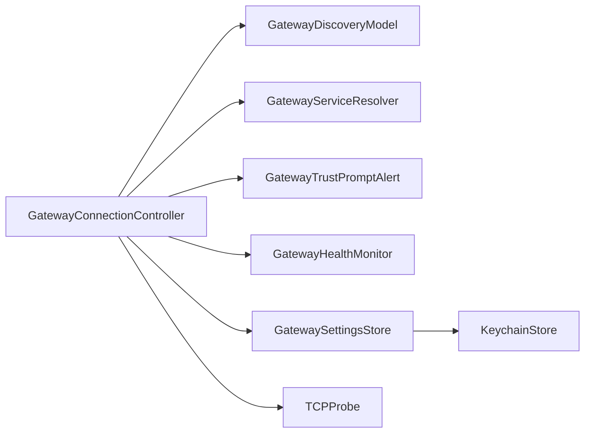

**Diagram sources**
- [GatewayConnectionController.swift:20-120](file://apps/ios/Sources/Gateway/GatewayConnectionController.swift#L20-L120)
- [GatewayDiscoveryModel.swift:6-38](file://apps/ios/Sources/Gateway/GatewayDiscoveryModel.swift#L6-L38)
- [GatewayServiceResolver.swift:4-25](file://apps/ios/Sources/Gateway/GatewayServiceResolver.swift#L4-L25)
- [GatewayTrustPromptAlert.swift:3-34](file://apps/ios/Sources/Gateway/GatewayTrustPromptAlert.swift#L3-L34)
- [GatewayHealthMonitor.swift:4-24](file://apps/ios/Sources/Gateway/GatewayHealthMonitor.swift#L4-L24)
- [GatewaySettingsStore.swift:4-35](file://apps/ios/Sources/Gateway/GatewaySettingsStore.swift#L4-L35)
- [TCPProbe.swift:5-41](file://apps/ios/Sources/Gateway/TCPProbe.swift#L5-L41)
- [KeychainStore.swift:4-16](file://apps/ios/Sources/Gateway/KeychainStore.swift#L4-L16)

**Section sources**
- [GatewayConnectionController.swift:20-120](file://apps/ios/Sources/Gateway/GatewayConnectionController.swift#L20-L120)
- [GatewayDiscoveryModel.swift:6-38](file://apps/ios/Sources/Gateway/GatewayDiscoveryModel.swift#L6-L38)

## Performance Considerations
- Discovery uses NWBrowser per domain; results are merged and sorted once per update cycle.
- Service resolution and TLS fingerprint probing use timeouts to avoid blocking.
- Health monitor intervals and timeouts are configurable to balance responsiveness and battery usage.
- Auto-reconnect avoids duplicate attempts by checking active connection state.

[No sources needed since this section provides general guidance]

## Troubleshooting Guide
Common issues and remedies:
- No gateways found
  - Ensure local network discovery is permitted and the gateway is advertising on the same network.
  - Check discovery status text and debug log for errors.
  - Restart discovery if needed.
- TLS fingerprint prompt keeps appearing
  - Verify the fingerprint matches the gateway console output out-of-band.
  - If incorrect, decline and re-check gateway configuration.
- Connection fails immediately
  - Confirm the gateway is reachable via TCP; use the TCP probe utility concept to validate.
  - Ensure TLS is required for non-loopback hosts; loopback hosts may bypass TLS depending on configuration.
- Autoconnect does not start
  - Verify “gateway.autoconnect” is enabled and a stable instance ID exists.
  - For autoconnect, a stored TLS pin is required; trust the gateway first if prompted.
- Frequent reconnections
  - Health monitor triggers reconnection after repeated failures; check network stability and gateway logs.

Operational tips:
- Enable discovery debug logs to capture state transitions and gateway counts.
- Use setup codes to prefill credentials and reduce manual steps.
- Clear last connection and re-trust if switching gateways or after configuration changes.

**Section sources**
- [GatewayDiscoveryModel.swift:40-49](file://apps/ios/Sources/Gateway/GatewayDiscoveryModel.swift#L40-L49)
- [GatewayConnectionController.swift:315-429](file://apps/ios/Sources/Gateway/GatewayConnectionController.swift#L315-L429)
- [GatewayHealthMonitor.swift:26-57](file://apps/ios/Sources/Gateway/GatewayHealthMonitor.swift#L26-L57)
- [GatewaySettingsStore.swift:207-228](file://apps/ios/Sources/Gateway/GatewaySettingsStore.swift#L207-L228)

## Conclusion
The iOS gateway connection system combines Zeroconf discovery, secure TLS fingerprint trust, and resilient connection management. It enforces strong security by requiring stored TLS pins for autoconnect, supports manual configuration and setup codes, and monitors health to maintain reliable connectivity.