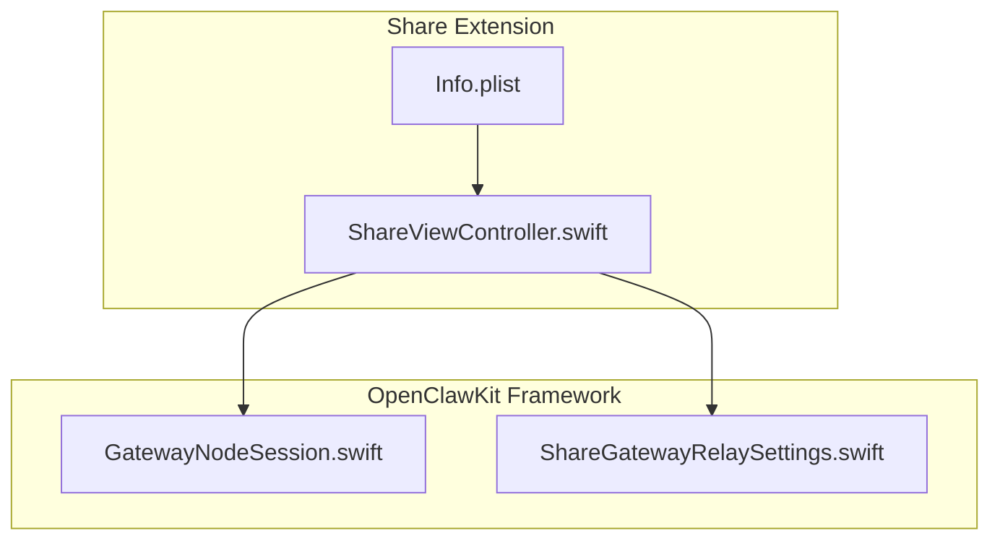
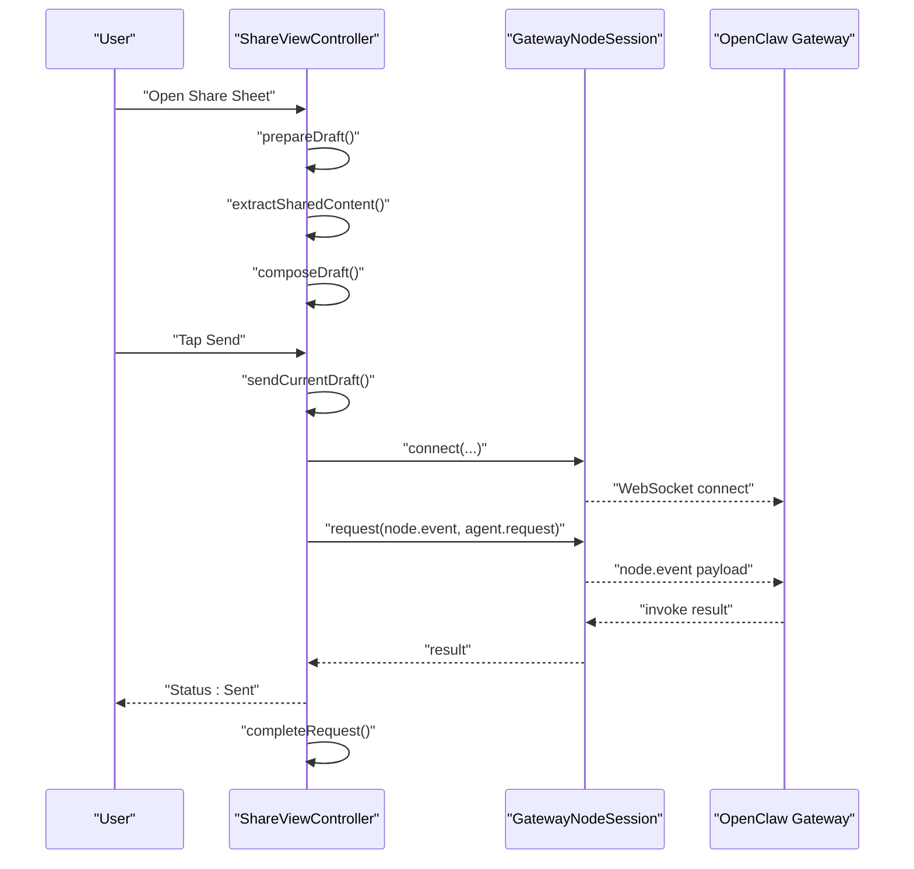
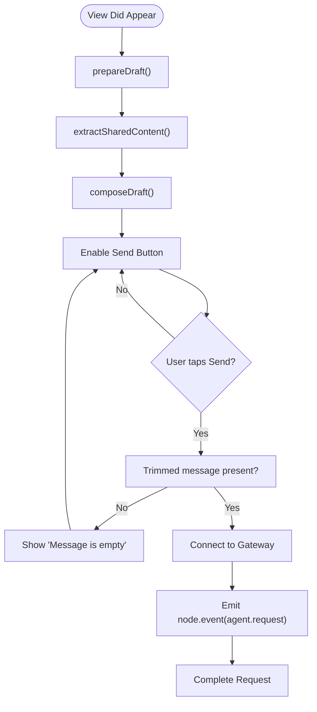
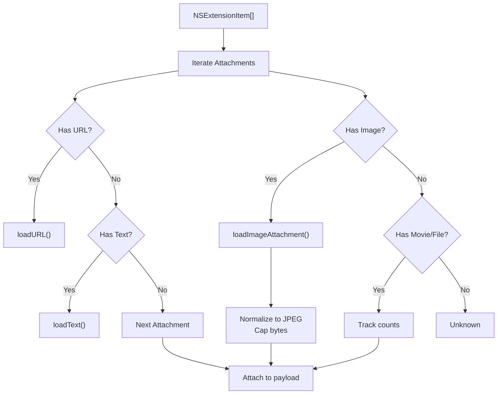
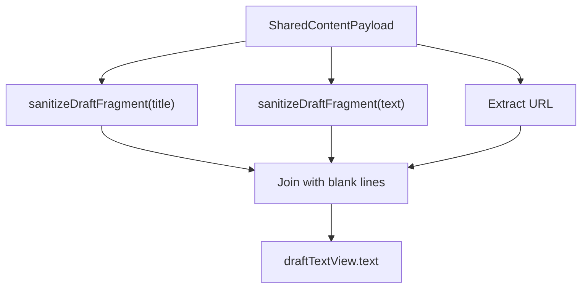
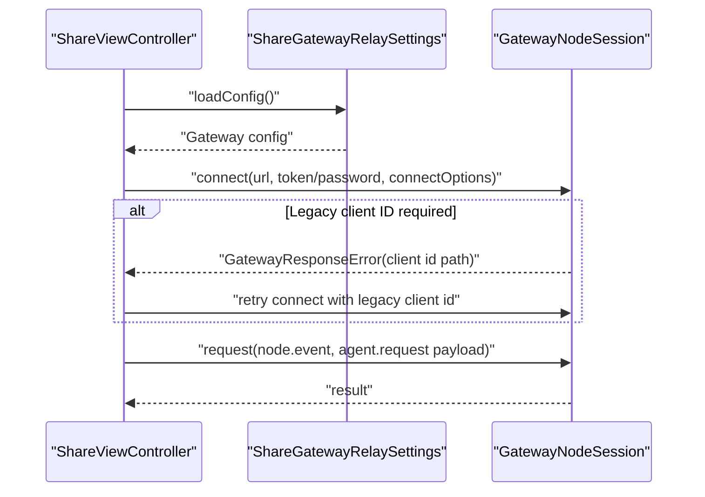
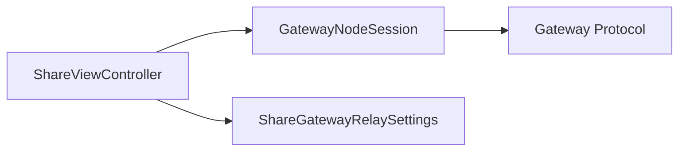

# Share Extension

<cite>
**Referenced Files in This Document**
- [ShareViewController.swift](file://apps/ios/ShareExtension/ShareViewController.swift)
- [Info.plist](file://apps/ios/ShareExtension/Info.plist)
- [GatewayNodeSession.swift](file://apps/shared/OpenClawKit/Sources/OpenClawKit/GatewayNodeSession.swift)
- [ShareGatewayRelaySettings.swift](file://apps/shared/OpenClawKit/Sources/OpenClawKit/ShareGatewayRelaySettings.swift)
</cite>

## Table of Contents
1. [Introduction](#introduction)
2. [Project Structure](#project-structure)
3. [Core Components](#core-components)
4. [Architecture Overview](#architecture-overview)
5. [Detailed Component Analysis](#detailed-component-analysis)
6. [Dependency Analysis](#dependency-analysis)
7. [Performance Considerations](#performance-considerations)
8. [Troubleshooting Guide](#troubleshooting-guide)
9. [Security Considerations](#security-considerations)
10. [Practical Usage Examples](#practical-usage-examples)
11. [Conclusion](#conclusion)

## Introduction
This document explains the iOS Share Extension that forwards content shared from other apps into the OpenClaw system. It covers the Share Extension architecture, content extraction and transformation pipeline, deep-link and agent prompt handling, and the integration with the OpenClaw gateway via the Share Extension UI. It also documents supported content types, data transformations, and operational safeguards.

## Project Structure
The Share Extension is implemented as a small iOS app extension with a single view controller and a minimal Info.plist activation rule. It relies on the OpenClawKit framework to communicate with the OpenClaw gateway.

**Diagram sources**
- [ShareViewController.swift:1-551](file://apps/ios/ShareExtension/ShareViewController.swift#L1-L551)
- [Info.plist:1-46](file://apps/ios/ShareExtension/Info.plist#L1-L46)
- [GatewayNodeSession.swift:1-536](file://apps/shared/OpenClawKit/Sources/OpenClawKit/GatewayNodeSession.swift#L1-L536)
- [ShareGatewayRelaySettings.swift:1-63](file://apps/shared/OpenClawKit/Sources/OpenClawKit/ShareGatewayRelaySettings.swift#L1-L63)

**Section sources**
- [ShareViewController.swift:1-551](file://apps/ios/ShareExtension/ShareViewController.swift#L1-L551)
- [Info.plist:1-46](file://apps/ios/ShareExtension/Info.plist#L1-L46)

## Core Components
- ShareViewController: The extension’s UI and processing logic. It extracts shared content, composes a draft message, and sends it to the OpenClaw gateway.
- GatewayNodeSession: The OpenClawKit client that connects to the gateway, manages connection state, and sends node events.
- ShareGatewayRelaySettings: Stores and retrieves the gateway configuration and last event log for diagnostics.

Key responsibilities:
- Content extraction: Title, URL, text, and selected images.
- Draft composition: Sanitized, human-readable message body.
- Delivery: Encodes a request payload and emits a node event to the gateway.
- UI lifecycle: Prepares the UI on appear, enables/disables controls during send, and reports status.

**Section sources**
- [ShareViewController.swift:7-120](file://apps/ios/ShareExtension/ShareViewController.swift#L7-L120)
- [GatewayNodeSession.swift:59-270](file://apps/shared/OpenClawKit/Sources/OpenClawKit/GatewayNodeSession.swift#L59-L270)
- [ShareGatewayRelaySettings.swift:28-62](file://apps/shared/OpenClawKit/Sources/OpenClawKit/ShareGatewayRelaySettings.swift#L28-L62)

## Architecture Overview
The Share Extension runs inside the iOS share sheet. On appearance, it prepares a draft by extracting shared content, then allows the user to edit and send. Sending triggers a connection to the configured gateway and dispatches an agent request event.

**Diagram sources**
- [ShareViewController.swift:84-155](file://apps/ios/ShareExtension/ShareViewController.swift#L84-L155)
- [GatewayNodeSession.swift:195-258](file://apps/shared/OpenClawKit/Sources/OpenClawKit/GatewayNodeSession.swift#L195-L258)

## Detailed Component Analysis

### ShareViewController
Responsibilities:
- UI setup and layout.
- Content extraction from NSExtensionItem attachments.
- Draft composition and sanitization.
- Sending to gateway via GatewayNodeSession.
- Status reporting and completion.

Processing highlights:
- Content extraction prioritizes title, URL, and text. Images are captured up to a limit and normalized to JPEG with a size cap.
- Draft sanitization removes common iOS share prefixes and extra whitespace.
- Sending constructs an agent request payload and emits a node event to the gateway.

**Diagram sources**
- [ShareViewController.swift:84-155](file://apps/ios/ShareExtension/ShareViewController.swift#L84-L155)

**Section sources**
- [ShareViewController.swift:29-108](file://apps/ios/ShareExtension/ShareViewController.swift#L29-L108)
- [ShareViewController.swift:110-155](file://apps/ios/ShareExtension/ShareViewController.swift#L110-L155)
- [ShareViewController.swift:363-420](file://apps/ios/ShareExtension/ShareViewController.swift#L363-L420)
- [ShareViewController.swift:329-361](file://apps/ios/ShareExtension/ShareViewController.swift#L329-L361)
- [ShareViewController.swift:422-463](file://apps/ios/ShareExtension/ShareViewController.swift#L422-L463)
- [ShareViewController.swift:465-541](file://apps/ios/ShareExtension/ShareViewController.swift#L465-L541)

### Content Extraction and Transformation
Supported inputs:
- Text: Plain text and URL-encoded text.
- Web URL: From URL UTI or embedded in text.
- Media: Images (limited to a small number and capped size), with normalization to JPEG.

Extraction logic:
- Iterates over extension input items and their attachments.
- Loads URL and text when available.
- Loads images with a preference for the provider’s native image type, normalizes to JPEG, and limits total bytes.

**Diagram sources**
- [ShareViewController.swift:380-420](file://apps/ios/ShareExtension/ShareViewController.swift#L380-L420)
- [ShareViewController.swift:422-463](file://apps/ios/ShareExtension/ShareViewController.swift#L422-L463)
- [ShareViewController.swift:465-501](file://apps/ios/ShareExtension/ShareViewController.swift#L465-L501)
- [ShareViewController.swift:487-501](file://apps/ios/ShareExtension/ShareViewController.swift#L487-L501)

**Section sources**
- [ShareViewController.swift:380-420](file://apps/ios/ShareExtension/ShareViewController.swift#L380-L420)
- [ShareViewController.swift:422-463](file://apps/ios/ShareExtension/ShareViewController.swift#L422-L463)
- [ShareViewController.swift:465-501](file://apps/ios/ShareExtension/ShareViewController.swift#L465-L501)

### Draft Composition and Sanitization
- Builds a multi-line message from title, text, and URL.
- Removes iOS-generated boilerplate and redundant lines.
- Returns a clean, readable draft for user review.

**Diagram sources**
- [ShareViewController.swift:329-361](file://apps/ios/ShareExtension/ShareViewController.swift#L329-L361)

**Section sources**
- [ShareViewController.swift:329-361](file://apps/ios/ShareExtension/ShareViewController.swift#L329-L361)

### Sending to Gateway
- Validates configuration and gateway URL.
- Establishes a GatewayNodeSession with client ID negotiation.
- Encodes an agent request payload and emits a node event.
- Handles legacy client ID fallback if the gateway reports invalid connect parameters referencing client ID.

**Diagram sources**
- [ShareViewController.swift:157-277](file://apps/ios/ShareExtension/ShareViewController.swift#L157-L277)
- [ShareViewController.swift:279-298](file://apps/ios/ShareExtension/ShareViewController.swift#L279-L298)
- [GatewayNodeSession.swift:195-258](file://apps/shared/OpenClawKit/Sources/OpenClawKit/GatewayNodeSession.swift#L195-L258)

**Section sources**
- [ShareViewController.swift:157-277](file://apps/ios/ShareExtension/ShareViewController.swift#L157-L277)
- [ShareViewController.swift:279-298](file://apps/ios/ShareExtension/ShareViewController.swift#L279-L298)
- [ShareGatewayRelaySettings.swift:37-45](file://apps/shared/OpenClawKit/Sources/OpenClawKit/ShareGatewayRelaySettings.swift#L37-L45)

### Activation Rules and Supported Content Types
The extension declares activation rules for:
- Text
- Web URLs
- Images (up to a count)
- Movies (single clip)

These rules appear in the extension’s Info.plist and govern when the extension appears in the share sheet.

**Section sources**
- [Info.plist:27-37](file://apps/ios/ShareExtension/Info.plist#L27-L37)

## Dependency Analysis
- ShareViewController depends on OpenClawKit for gateway connectivity and on ShareGatewayRelaySettings for persisted configuration.
- GatewayNodeSession encapsulates connection management, event emission, and invoke handling.
- The extension’s UI and logic are decoupled from the gateway protocol details via GatewayNodeSession.

**Diagram sources**
- [ShareViewController.swift:1-20](file://apps/ios/ShareExtension/ShareViewController.swift#L1-L20)
- [GatewayNodeSession.swift:59-153](file://apps/shared/OpenClawKit/Sources/OpenClawKit/GatewayNodeSession.swift#L59-L153)
- [ShareGatewayRelaySettings.swift:28-62](file://apps/shared/OpenClawKit/Sources/OpenClawKit/ShareGatewayRelaySettings.swift#L28-L62)

**Section sources**
- [ShareViewController.swift:1-20](file://apps/ios/ShareExtension/ShareViewController.swift#L1-L20)
- [GatewayNodeSession.swift:59-153](file://apps/shared/OpenClawKit/Sources/OpenClawKit/GatewayNodeSession.swift#L59-L153)
- [ShareGatewayRelaySettings.swift:28-62](file://apps/shared/OpenClawKit/Sources/OpenClawKit/ShareGatewayRelaySettings.swift#L28-L62)

## Performance Considerations
- Image normalization: Images are converted to JPEG with iterative compression to meet a size cap, reducing payload size and improving throughput.
- Attachment limit: Limits the number of attached images to keep payloads reasonable.
- UI responsiveness: Uses async preparation and main-actor updates to keep the share sheet responsive.
- Connection reuse: GatewayNodeSession caches connection state and reuses the channel when parameters match, minimizing reconnect overhead.

[No sources needed since this section provides general guidance]

## Troubleshooting Guide
Common issues and resolutions:
- Empty message: The extension prevents sending empty drafts. Add a message and retry.
- Gateway not configured: Ensure the gateway URL, token/password, and session key are set in the shared settings.
- Invalid gateway URL: Confirm the URL is reachable and properly formatted.
- Legacy client ID mismatch: The extension retries with a legacy client ID if the gateway signals invalid connect parameters referencing client ID.
- No content extracted: Verify the shared item includes supported types (text, URL, images).

Operational diagnostics:
- Last event log: The extension writes a timestamped event log to shared settings for recent activity.

**Section sources**
- [ShareViewController.swift:124-128](file://apps/ios/ShareExtension/ShareViewController.swift#L124-L128)
- [ShareViewController.swift:158-169](file://apps/ios/ShareExtension/ShareViewController.swift#L158-L169)
- [ShareViewController.swift:279-298](file://apps/ios/ShareExtension/ShareViewController.swift#L279-L298)
- [ShareGatewayRelaySettings.swift:51-61](file://apps/shared/OpenClawKit/Sources/OpenClawKit/ShareGatewayRelaySettings.swift#L51-L61)

## Security Considerations
- Content validation: The extension trims and sanitizes input to reduce noise and prevent accidental duplication of system-generated text.
- Permission handling: The extension does not request special permissions beyond those required by iOS share extensions. It does not modify shared content beyond normalization and selection.
- User consent: The user must explicitly tap Send to forward content to the gateway. The UI clearly indicates status and allows cancellation.
- Data handling: Images are normalized to JPEG and capped in size to minimize risk and bandwidth usage. Sensitive credentials are stored in shared settings and should be protected by device security.

[No sources needed since this section provides general guidance]

## Practical Usage Examples
- Share a webpage: Select “Share” from Safari, choose the OpenClaw Share extension, review the generated draft (title, URL), and tap Send.
- Share text: Copy text and paste into a note or share from a reader app; the extension captures the text and allows editing before sending.
- Share images: Choose photos from the Photos app; the extension attaches up to a limited number of images as normalized JPEGs.

Supported content formats:
- Text (plain text and URL-encoded text)
- Web URLs
- Images (normalized JPEG)
- Movies (single clip)

Note: The extension’s activation rules define the maximum counts for images and movies.

**Section sources**
- [Info.plist:27-37](file://apps/ios/ShareExtension/Info.plist#L27-L37)
- [ShareViewController.swift:394-401](file://apps/ios/ShareExtension/ShareViewController.swift#L394-L401)
- [ShareViewController.swift:422-463](file://apps/ios/ShareExtension/ShareViewController.swift#L422-L463)

## Conclusion
The Share Extension provides a streamlined pathway to forward shared content into OpenClaw. It extracts and normalizes content, composes a concise draft, and securely delivers it to the configured gateway. Its design emphasizes simplicity, safety, and responsiveness, while leveraging OpenClawKit for robust gateway communication.