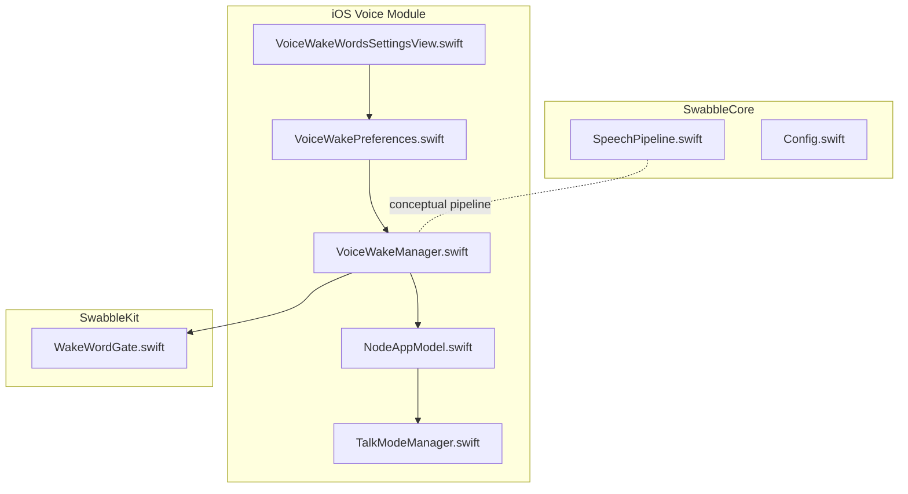
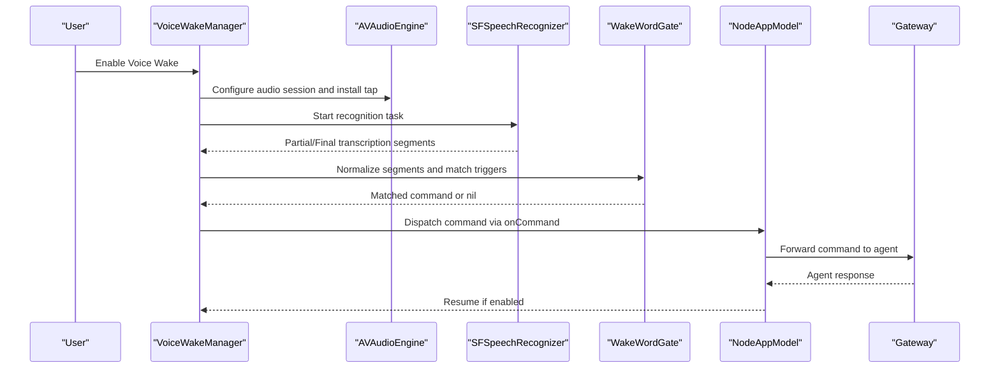
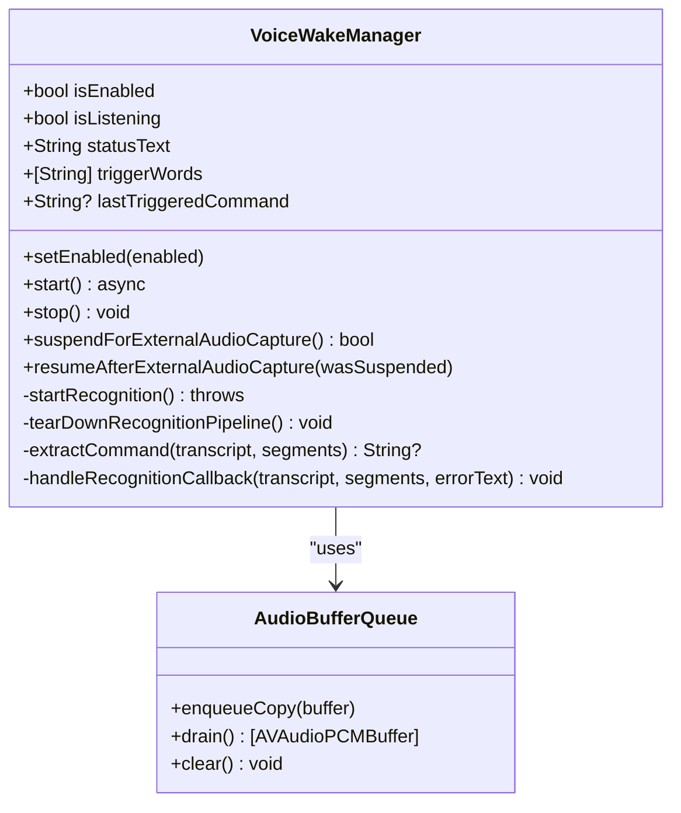
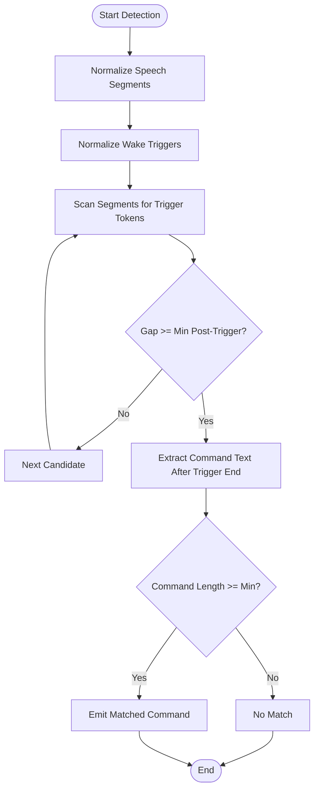
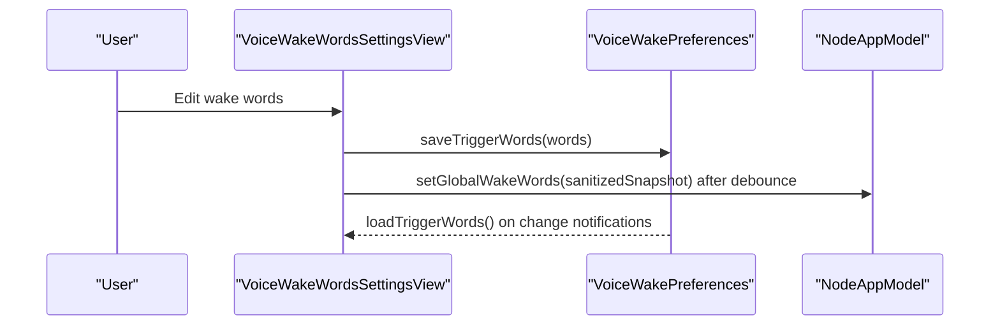
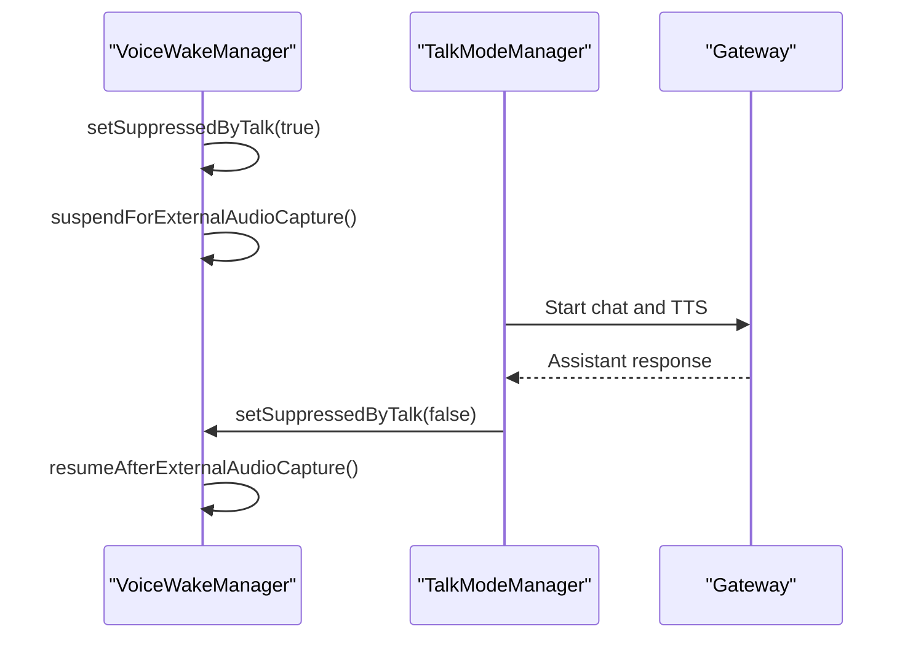
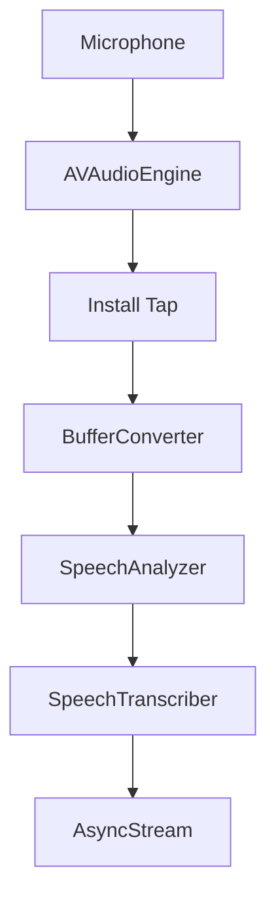
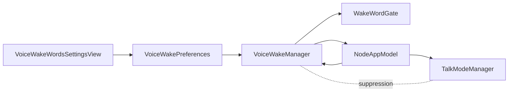

# Voice Wake Feature

<cite>
**Referenced Files in This Document**
- [VoiceWakeManager.swift](file://apps/ios/Sources/Voice/VoiceWakeManager.swift)
- [VoiceWakePreferences.swift](file://apps/ios/Sources/Voice/VoiceWakePreferences.swift)
- [VoiceWakeWordsSettingsView.swift](file://apps/ios/Sources/Settings/VoiceWakeWordsSettingsView.swift)
- [WakeWordGate.swift](file://Swabble/Sources/SwabbleKit/WakeWordGate.swift)
- [SpeechPipeline.swift](file://Swabble/Sources/SwabbleCore/Speech/SpeechPipeline.swift)
- [Config.swift](file://Swabble/Sources/SwabbleCore/Config/Config.swift)
- [TalkModeManager.swift](file://apps/ios/Sources/Voice/TalkModeManager.swift)
- [NodeAppModel.swift](file://apps/ios/Sources/Model/NodeAppModel.swift)
</cite>

## Table of Contents
1. [Introduction](#introduction)
2. [Project Structure](#project-structure)
3. [Core Components](#core-components)
4. [Architecture Overview](#architecture-overview)
5. [Detailed Component Analysis](#detailed-component-analysis)
6. [Dependency Analysis](#dependency-analysis)
7. [Performance Considerations](#performance-considerations)
8. [Troubleshooting Guide](#troubleshooting-guide)
9. [Privacy and Security](#privacy-and-security)
10. [Conclusion](#conclusion)

## Introduction
This document explains the Voice Wake feature in the OpenClaw iOS app, focusing on always-listening voice activation. It covers the wake word detection system, audio processing pipeline, preferences and settings, integration with Talk functionality for voice-based agent interaction, and practical guidance for configuration, troubleshooting, and privacy considerations.

## Project Structure
The Voice Wake feature spans several modules:
- iOS Voice module: VoiceWakeManager orchestrates wake word detection and triggers.
- SwabbleKit: Provides wake word gate matching and segmentation utilities.
- SwabbleCore: Provides a speech pipeline abstraction for live audio processing.
- Settings UI: VoiceWakeWordsSettingsView manages wake word customization.
- Talk integration: TalkModeManager coordinates speech-to-text, agent interaction, and audio synthesis.

**Diagram sources**
- [VoiceWakeManager.swift](file://apps/ios/Sources/Voice/VoiceWakeManager.swift)
- [VoiceWakePreferences.swift](file://apps/ios/Sources/Voice/VoiceWakePreferences.swift)
- [VoiceWakeWordsSettingsView.swift](file://apps/ios/Sources/Settings/VoiceWakeWordsSettingsView.swift)
- [WakeWordGate.swift](file://Swabble/Sources/SwabbleKit/WakeWordGate.swift)
- [SpeechPipeline.swift](file://Swabble/Sources/SwabbleCore/Speech/SpeechPipeline.swift)
- [Config.swift](file://Swabble/Sources/SwabbleCore/Config/Config.swift)
- [TalkModeManager.swift](file://apps/ios/Sources/Voice/TalkModeManager.swift)
- [NodeAppModel.swift](file://apps/ios/Sources/Model/NodeAppModel.swift)

**Section sources**
- [VoiceWakeManager.swift](file://apps/ios/Sources/Voice/VoiceWakeManager.swift)
- [VoiceWakePreferences.swift](file://apps/ios/Sources/Voice/VoiceWakePreferences.swift)
- [VoiceWakeWordsSettingsView.swift](file://apps/ios/Sources/Settings/VoiceWakeWordsSettingsView.swift)
- [WakeWordGate.swift](file://Swabble/Sources/SwabbleKit/WakeWordGate.swift)
- [SpeechPipeline.swift](file://Swabble/Sources/SwabbleCore/Speech/SpeechPipeline.swift)
- [Config.swift](file://Swabble/Sources/SwabbleCore/Config/Config.swift)
- [TalkModeManager.swift](file://apps/ios/Sources/Voice/TalkModeManager.swift)
- [NodeAppModel.swift](file://apps/ios/Sources/Model/NodeAppModel.swift)

## Core Components
- VoiceWakeManager: Manages wake word recognition, audio engine lifecycle, permission handling, and dispatch of recognized commands to the app.
- WakeWordGate: Matches normalized wake word sequences against speech segments and extracts the command text following a trigger.
- VoiceWakePreferences: Loads, sanitizes, and persists wake word lists; decodes gateway-provided triggers.
- VoiceWakeWordsSettingsView: UI for editing wake words, resetting defaults, and syncing changes to the app model.
- TalkModeManager: Handles continuous or push-to-talk speech capture, transcription, agent interaction, and audio synthesis; integrates with VoiceWakeManager via suppression and resume logic.
- NodeAppModel: Coordinates VoiceWakeManager and TalkModeManager, routes wake-triggered commands to the gateway, and manages background/foreground lifecycle.

**Section sources**
- [VoiceWakeManager.swift](file://apps/ios/Sources/Voice/VoiceWakeManager.swift)
- [WakeWordGate.swift](file://Swabble/Sources/SwabbleKit/WakeWordGate.swift)
- [VoiceWakePreferences.swift](file://apps/ios/Sources/Voice/VoiceWakePreferences.swift)
- [VoiceWakeWordsSettingsView.swift](file://apps/ios/Sources/Settings/VoiceWakeWordsSettingsView.swift)
- [TalkModeManager.swift](file://apps/ios/Sources/Voice/TalkModeManager.swift)
- [NodeAppModel.swift](file://apps/ios/Sources/Model/NodeAppModel.swift)

## Architecture Overview
The Voice Wake feature runs continuously in the background when enabled, capturing microphone audio and streaming it to Apple’s Speech recognition. Wake word detection is performed by matching normalized segments against configured triggers. Upon detection, VoiceWakeManager dispatches the recognized command to NodeAppModel, which forwards it to the gateway for agent interaction. During active Talk sessions, VoiceWakeManager is temporarily suspended to avoid conflicts.

**Diagram sources**
- [VoiceWakeManager.swift](file://apps/ios/Sources/Voice/VoiceWakeManager.swift)
- [WakeWordGate.swift](file://Swabble/Sources/SwabbleKit/WakeWordGate.swift)
- [NodeAppModel.swift](file://apps/ios/Sources/Model/NodeAppModel.swift)

## Detailed Component Analysis

### VoiceWakeManager
Responsibilities:
- Permission orchestration for microphone and speech recognition.
- Audio engine setup and tap installation to stream microphone buffers.
- Speech recognition task management and result handling.
- Wake word extraction using WakeWordGate and dispatch to the app.
- Lifecycle control: start, stop, suspend/resume for external audio capture.
- Status reporting and UI-friendly state updates.

Key behaviors:
- Uses a dedicated AudioBufferQueue to safely enqueue audio buffers on the real-time audio thread.
- Drains the queue periodically and appends buffers to the SFSpeechAudioBufferRecognitionRequest.
- Extracts commands using WakeWordGate.match with a configurable minimum post-trigger gap.
- Suppresses listening when Talk is active and resumes after Talk completes.

**Diagram sources**
- [VoiceWakeManager.swift](file://apps/ios/Sources/Voice/VoiceWakeManager.swift)

**Section sources**
- [VoiceWakeManager.swift](file://apps/ios/Sources/Voice/VoiceWakeManager.swift)

### Wake Word Detection Pipeline
- WakeWordGate.normalization converts segments and triggers to lowercase tokens, ignoring punctuation and whitespace.
- Segments are scanned for contiguous token matches equal to a trigger; gaps after the trigger are validated against a minimum post-trigger threshold.
- The command text is extracted as the portion of the transcript following the trigger end time.

**Diagram sources**
- [WakeWordGate.swift](file://Swabble/Sources/SwabbleKit/WakeWordGate.swift)

**Section sources**
- [WakeWordGate.swift](file://Swabble/Sources/SwabbleKit/WakeWordGate.swift)

### Preferences and Settings
- VoiceWakePreferences:
  - Stores enabled flag and trigger words in UserDefaults.
  - Sanitizes user input (trim, filter empties, cap length/count).
  - Decodes gateway-provided trigger payloads.
- VoiceWakeWordsSettingsView:
  - Presents editable fields for wake words with add/delete/reset.
  - Commits changes to preferences and asynchronously syncs to NodeAppModel.setGlobalWakeWords.

**Diagram sources**
- [VoiceWakeWordsSettingsView.swift](file://apps/ios/Sources/Settings/VoiceWakeWordsSettingsView.swift)
- [VoiceWakePreferences.swift](file://apps/ios/Sources/Voice/VoiceWakePreferences.swift)
- [NodeAppModel.swift](file://apps/ios/Sources/Model/NodeAppModel.swift)

**Section sources**
- [VoiceWakePreferences.swift](file://apps/ios/Sources/Voice/VoiceWakePreferences.swift)
- [VoiceWakeWordsSettingsView.swift](file://apps/ios/Sources/Settings/VoiceWakeWordsSettingsView.swift)
- [NodeAppModel.swift](file://apps/ios/Sources/Model/NodeAppModel.swift)

### Integration with Talk Functionality
- VoiceWakeManager sets suppressedByTalk to pause listening when Talk starts.
- TalkModeManager handles speech capture, transcription, agent interaction, and audio synthesis.
- After Talk completes, VoiceWakeManager resumes automatically if still enabled.

**Diagram sources**
- [VoiceWakeManager.swift](file://apps/ios/Sources/Voice/VoiceWakeManager.swift)
- [TalkModeManager.swift](file://apps/ios/Sources/Voice/TalkModeManager.swift)

**Section sources**
- [VoiceWakeManager.swift](file://apps/ios/Sources/Voice/VoiceWakeManager.swift)
- [TalkModeManager.swift](file://apps/ios/Sources/Voice/TalkModeManager.swift)

### Conceptual Speech Pipeline (SwabbleCore)
While VoiceWakeManager uses AVAudioEngine and SFSpeechRecognizer directly, SwabbleCore provides a higher-level conceptual pipeline for live audio processing:
- Microphone input captured via AVAudioEngine.
- Buffered audio converted and fed into a SpeechAnalyzer.
- SpeechTranscriber produces transcription segments streamed to the caller.

**Diagram sources**
- [SpeechPipeline.swift](file://Swabble/Sources/SwabbleCore/Speech/SpeechPipeline.swift)

**Section sources**
- [SpeechPipeline.swift](file://Swabble/Sources/SwabbleCore/Speech/SpeechPipeline.swift)

## Dependency Analysis
- VoiceWakeManager depends on:
  - AVFoundation for audio capture and AVAudioEngine.
  - Speech framework for SFSpeechRecognizer and SFSpeechAudioBufferRecognitionRequest.
  - SwabbleKit WakeWordGate for wake word matching.
  - NodeAppModel for dispatching recognized commands.
- VoiceWakeWordsSettingsView depends on VoiceWakePreferences and NodeAppModel for synchronization.
- TalkModeManager coordinates with VoiceWakeManager via suppression flags and lifecycle hooks.

**Diagram sources**
- [VoiceWakeManager.swift](file://apps/ios/Sources/Voice/VoiceWakeManager.swift)
- [WakeWordGate.swift](file://Swabble/Sources/SwabbleKit/WakeWordGate.swift)
- [VoiceWakePreferences.swift](file://apps/ios/Sources/Voice/VoiceWakePreferences.swift)
- [VoiceWakeWordsSettingsView.swift](file://apps/ios/Sources/Settings/VoiceWakeWordsSettingsView.swift)
- [NodeAppModel.swift](file://apps/ios/Sources/Model/NodeAppModel.swift)
- [TalkModeManager.swift](file://apps/ios/Sources/Voice/TalkModeManager.swift)

**Section sources**
- [VoiceWakeManager.swift](file://apps/ios/Sources/Voice/VoiceWakeManager.swift)
- [VoiceWakePreferences.swift](file://apps/ios/Sources/Voice/VoiceWakePreferences.swift)
- [VoiceWakeWordsSettingsView.swift](file://apps/ios/Sources/Settings/VoiceWakeWordsSettingsView.swift)
- [WakeWordGate.swift](file://Swabble/Sources/SwabbleKit/WakeWordGate.swift)
- [TalkModeManager.swift](file://apps/ios/Sources/Voice/TalkModeManager.swift)
- [NodeAppModel.swift](file://apps/ios/Sources/Model/NodeAppModel.swift)

## Performance Considerations
- Audio session configuration:
  - VoiceWakeManager sets a measurement category suitable for microphone capture and installs a tap with a fixed buffer size to balance latency and CPU usage.
- Real-time constraints:
  - AudioBufferQueue enqueues copies on the audio thread to avoid blocking; a separate task drains the queue and appends buffers to the recognition request.
- Recognition restarts:
  - On errors, VoiceWakeManager schedules a restart after a brief delay to avoid thrashing the audio engine.
- Talk vs. Voice Wake:
  - When Talk is active, VoiceWakeManager suspends listening to prevent interference; it resumes after Talk completes.
- Noise handling:
  - TalkModeManager computes a dynamic noise floor to improve endpointing; VoiceWakeManager relies on SFSpeechRecognizer’s internal noise handling.

[No sources needed since this section provides general guidance]

## Troubleshooting Guide
Common issues and resolutions:
- Permissions denied:
  - Microphone or speech recognition permissions may be denied. VoiceWakeManager surfaces user-facing messages indicating denial or restriction. Request permissions again via the app settings.
- Simulator limitations:
  - Voice Wake is not supported on the iOS Simulator due to unreliability of the audio stack. Use a physical device for testing.
- Recognition errors:
  - If the recognizer reports errors, VoiceWakeManager attempts a restart after a delay. Check for transient conditions (e.g., background noise) and retry.
- Wake word not triggering:
  - Verify wake words in Settings; ensure they are short and distinct to reduce false positives. Confirm Voice Wake is enabled and not suppressed by Talk.
- Conflicts with Talk:
  - While Talk is active, Voice Wake is paused. Wait for Talk to finish or end the Talk session to resume Voice Wake.

**Section sources**
- [VoiceWakeManager.swift](file://apps/ios/Sources/Voice/VoiceWakeManager.swift)
- [VoiceWakeWordsSettingsView.swift](file://apps/ios/Sources/Settings/VoiceWakeWordsSettingsView.swift)

## Privacy and Security
- Local processing:
  - VoiceWakeManager performs wake word detection locally using SFSpeechRecognizer and AVAudioEngine. No audio is uploaded to external services by default.
- Wake word storage:
  - Wake words are stored in UserDefaults and optionally synchronized to the gateway via NodeAppModel. Ensure sensitive wake words are chosen carefully.
- Consent and permissions:
  - Microphone and speech recognition permissions are requested at runtime. Users must grant permission for Voice Wake to function.
- Gateway synchronization:
  - Wake word lists can be synced to the gateway; confirm with your deployment policies whether synchronization is enabled.

**Section sources**
- [VoiceWakeManager.swift](file://apps/ios/Sources/Voice/VoiceWakeManager.swift)
- [VoiceWakePreferences.swift](file://apps/ios/Sources/Voice/VoiceWakePreferences.swift)
- [NodeAppModel.swift](file://apps/ios/Sources/Model/NodeAppModel.swift)

## Conclusion
The Voice Wake feature provides a robust always-listening experience on iOS by combining a real-time audio pipeline, Apple’s Speech recognition, and SwabbleKit’s wake word matching. Users can customize wake words, and the system integrates seamlessly with Talk for voice-based agent interaction. Proper configuration, awareness of platform constraints, and attention to privacy ensure reliable and secure operation.