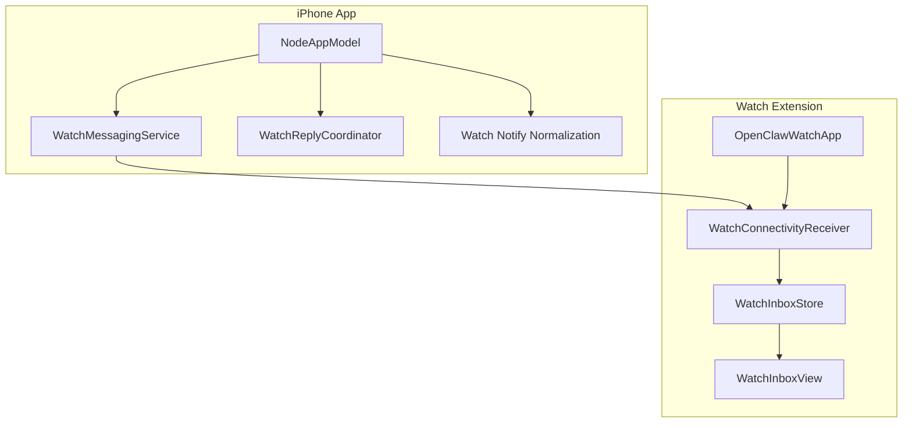
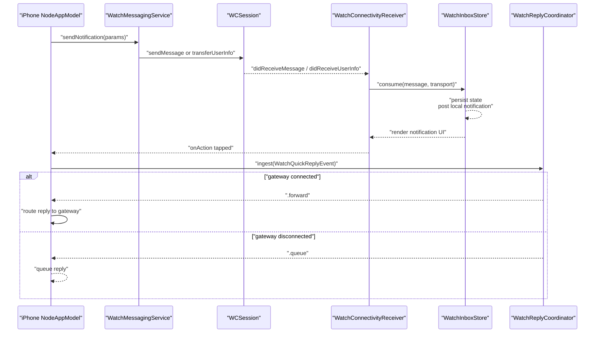
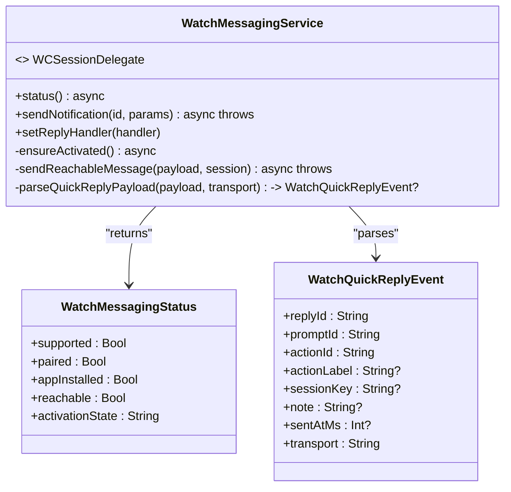
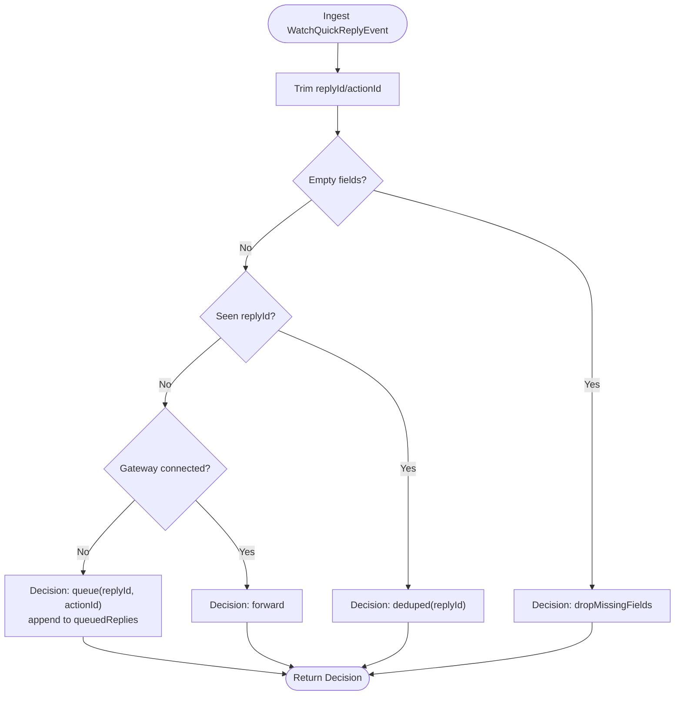
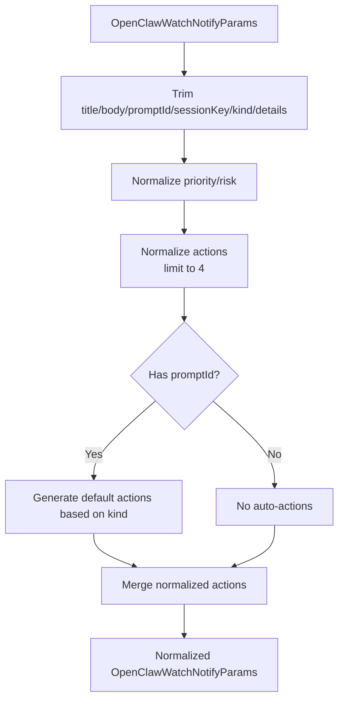
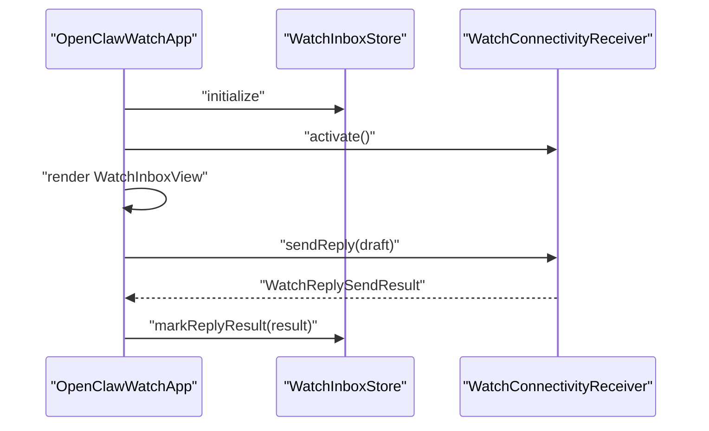
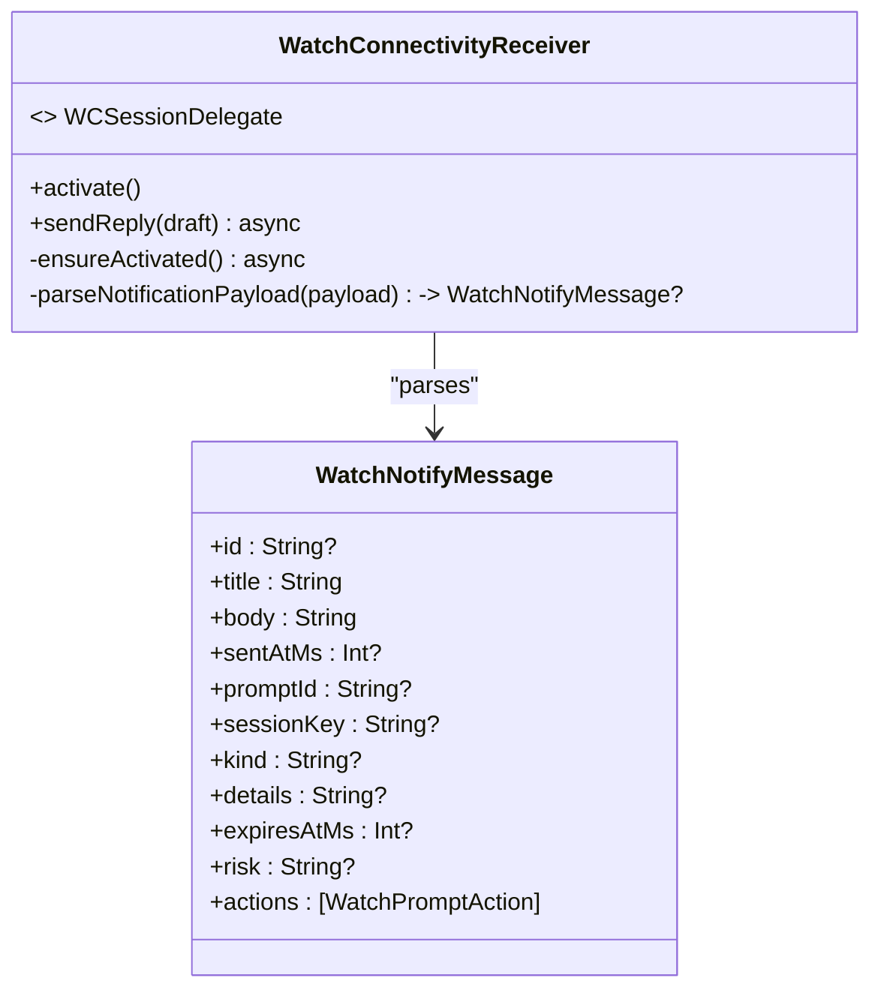
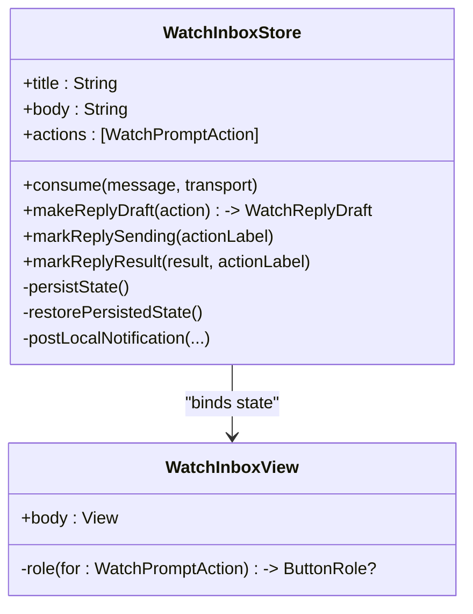
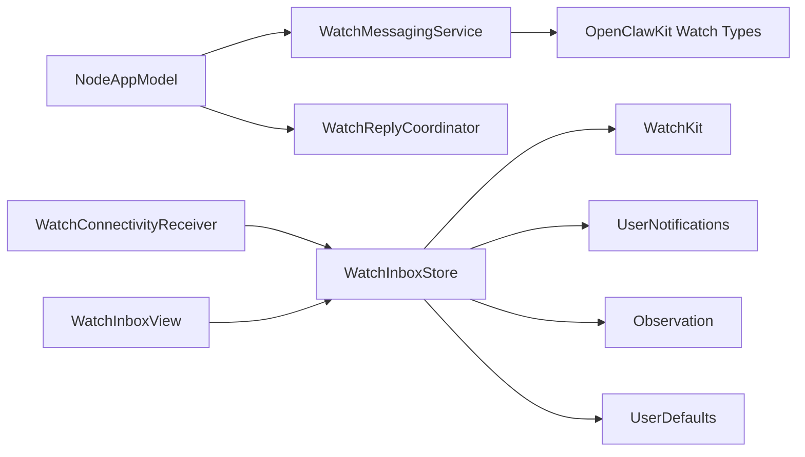

# Watch Integration

<cite>
**Referenced Files in This Document**
- [WatchMessagingService.swift](file://apps/ios/Sources/Services/WatchMessagingService.swift)
- [WatchReplyCoordinator.swift](file://apps/ios/Sources/Model/WatchReplyCoordinator.swift)
- [NodeAppModel+WatchNotifyNormalization.swift](file://apps/ios/Sources/Model/NodeAppModel+WatchNotifyNormalization.swift)
- [OpenClawWatchApp.swift](file://apps/ios/WatchExtension/Sources/OpenClawWatchApp.swift)
- [WatchConnectivityReceiver.swift](file://apps/ios/WatchExtension/Sources/WatchConnectivityReceiver.swift)
- [WatchInboxStore.swift](file://apps/ios/WatchExtension/Sources/WatchInboxStore.swift)
- [WatchInboxView.swift](file://apps/ios/WatchExtension/Sources/WatchInboxView.swift)
- [WatchCommands.swift](file://apps/shared/OpenClawKit/Sources/OpenClawKit/WatchCommands.swift)
- [NodeAppModel.swift](file://apps/ios/Sources/Model/NodeAppModel.swift)
- [NodeServiceProtocols.swift](file://apps/ios/Sources/Services/NodeServiceProtocols.swift)
</cite>

## Table of Contents
1. [Introduction](#introduction)
2. [Project Structure](#project-structure)
3. [Core Components](#core-components)
4. [Architecture Overview](#architecture-overview)
5. [Detailed Component Analysis](#detailed-component-analysis)
6. [Dependency Analysis](#dependency-analysis)
7. [Performance Considerations](#performance-considerations)
8. [Troubleshooting Guide](#troubleshooting-guide)
9. [Conclusion](#conclusion)
10. [Appendices](#appendices)

## Introduction
This document explains the Apple Watch integration for OpenClaw, focusing on seamless connectivity and interaction between the iPhone app and the Apple Watch companion app. It covers the WatchKit app architecture, communication protocols via WatchConnectivity, data synchronization mechanisms, and the roles of the WatchMessagingService and WatchReplyCoordinator. It also documents the notification normalization system that optimizes iPhone-originated notifications for the watch’s constrained display and interaction model. Practical usage examples, complication configuration guidance, and platform-specific considerations are included to help developers and operators deploy and maintain reliable watch experiences.

## Project Structure
The Apple Watch integration spans two targets:
- iPhone app target: Implements the WatchMessagingService and orchestrates watch notifications and replies.
- Watch Extension target: Implements the WatchKit app, inbox consumption, reply sending, and local notification posting.

**Diagram sources**
- [NodeAppModel.swift:126-140](file://apps/ios/Sources/Model/NodeAppModel.swift#L126-L140)
- [WatchMessagingService.swift:24-41](file://apps/ios/Sources/Services/WatchMessagingService.swift#L24-L41)
- [WatchReplyCoordinator.swift:4-10](file://apps/ios/Sources/Model/WatchReplyCoordinator.swift#L4-L10)
- [NodeAppModel+WatchNotifyNormalization.swift:4-22](file://apps/ios/Sources/Model/NodeAppModel+WatchNotifyNormalization.swift#L4-L22)
- [OpenClawWatchApp.swift:4-28](file://apps/ios/WatchExtension/Sources/OpenClawWatchApp.swift#L4-L28)
- [WatchConnectivityReceiver.swift:21-39](file://apps/ios/WatchExtension/Sources/WatchConnectivityReceiver.swift#L21-L39)
- [WatchInboxStore.swift:26-69](file://apps/ios/WatchExtension/Sources/WatchInboxStore.swift#L26-L69)
- [WatchInboxView.swift:3-64](file://apps/ios/WatchExtension/Sources/WatchInboxView.swift#L3-L64)

**Section sources**
- [NodeAppModel.swift:126-140](file://apps/ios/Sources/Model/NodeAppModel.swift#L126-L140)
- [WatchMessagingService.swift:24-41](file://apps/ios/Sources/Services/WatchMessagingService.swift#L24-L41)
- [WatchReplyCoordinator.swift:4-10](file://apps/ios/Sources/Model/WatchReplyCoordinator.swift#L4-L10)
- [NodeAppModel+WatchNotifyNormalization.swift:4-22](file://apps/ios/Sources/Model/NodeAppModel+WatchNotifyNormalization.swift#L4-L22)
- [OpenClawWatchApp.swift:4-28](file://apps/ios/WatchExtension/Sources/OpenClawWatchApp.swift#L4-L28)
- [WatchConnectivityReceiver.swift:21-39](file://apps/ios/WatchExtension/Sources/WatchConnectivityReceiver.swift#L21-L39)
- [WatchInboxStore.swift:26-69](file://apps/ios/WatchExtension/Sources/WatchInboxStore.swift#L26-L69)
- [WatchInboxView.swift:3-64](file://apps/ios/WatchExtension/Sources/WatchInboxView.swift#L3-L64)

## Core Components
- WatchMessagingService: Manages WatchConnectivity session lifecycle, sends notifications to the watch, and handles incoming quick replies. It exposes status snapshots and supports both immediate sendMessage and queued transferUserInfo delivery.
- WatchReplyCoordinator: Deduplicates and queues watch replies when the iPhone gateway is offline, forwarding them when connectivity resumes.
- Watch Notify Normalization: Normalizes notification parameters and actions for the watch, inferring priority/risk and generating default actions for prompt-driven flows.
- WatchConnectivityReceiver: Receives watch-side notifications and replies, parses payloads, and posts local notifications on the watch.
- WatchInboxStore: Holds the current watch notification state, persists it, and manages reply sending status and haptic feedback mapping.
- WatchInboxView: Renders the watch notification content and action buttons, adapting styles for destructive/cancel actions.
- OpenClawKit Watch Types: Defines standardized enums and structs for watch commands, risks, actions, statuses, and notification payloads.

**Section sources**
- [WatchMessagingService.swift:24-41](file://apps/ios/Sources/Services/WatchMessagingService.swift#L24-L41)
- [WatchReplyCoordinator.swift:4-10](file://apps/ios/Sources/Model/WatchReplyCoordinator.swift#L4-L10)
- [NodeAppModel+WatchNotifyNormalization.swift:4-22](file://apps/ios/Sources/Model/NodeAppModel+WatchNotifyNormalization.swift#L4-L22)
- [WatchConnectivityReceiver.swift:21-39](file://apps/ios/WatchExtension/Sources/WatchConnectivityReceiver.swift#L21-L39)
- [WatchInboxStore.swift:26-69](file://apps/ios/WatchExtension/Sources/WatchInboxStore.swift#L26-L69)
- [WatchInboxView.swift:3-64](file://apps/ios/WatchExtension/Sources/WatchInboxView.swift#L3-L64)
- [WatchCommands.swift:3-96](file://apps/shared/OpenClawKit/Sources/OpenClawKit/WatchCommands.swift#L3-L96)

## Architecture Overview
The iPhone app initializes a WatchMessagingService and registers a reply handler. Notifications are normalized and sent to the watch using WatchConnectivity. On the watch, WatchConnectivityReceiver consumes incoming notifications, stores them in WatchInboxStore, and renders them via WatchInboxView. When the user taps an action, the watch composes a reply draft and sends it back to the iPhone, which forwards it to the gateway through WatchReplyCoordinator.

**Diagram sources**
- [WatchMessagingService.swift:77-146](file://apps/ios/Sources/Services/WatchMessagingService.swift#L77-L146)
- [WatchConnectivityReceiver.swift:201-228](file://apps/ios/WatchExtension/Sources/WatchConnectivityReceiver.swift#L201-L228)
- [WatchInboxStore.swift:71-106](file://apps/ios/WatchExtension/Sources/WatchInboxStore.swift#L71-L106)
- [WatchReplyCoordinator.swift:15-30](file://apps/ios/Sources/Model/WatchReplyCoordinator.swift#L15-L30)
- [NodeAppModel.swift:189-193](file://apps/ios/Sources/Model/NodeAppModel.swift#L189-L193)

## Detailed Component Analysis

### WatchMessagingService
Responsibilities:
- Initialize and manage a WCSession delegate, handle activation lifecycle, and expose status snapshots.
- Send watch notifications with optional actions, prioritizing immediate sendMessage when reachable and falling back to transferUserInfo when needed.
- Parse incoming quick reply payloads from both sendMessage and transferUserInfo, and forward them to the registered reply handler.

Key behaviors:
- Status reporting includes support, pairing, app installation, reachability, and activation state.
- Payload construction includes type markers, identifiers, timestamps, and optional fields.
- Reply parsing validates payload type and required fields, constructs WatchQuickReplyEvent, and preserves transport metadata.

**Diagram sources**
- [WatchMessagingService.swift:24-41](file://apps/ios/Sources/Services/WatchMessagingService.swift#L24-L41)
- [WatchMessagingService.swift:47-71](file://apps/ios/Sources/Services/WatchMessagingService.swift#L47-L71)
- [WatchMessagingService.swift:77-146](file://apps/ios/Sources/Services/WatchMessagingService.swift#L77-L146)
- [WatchMessagingService.swift:171-197](file://apps/ios/Sources/Services/WatchMessagingService.swift#L171-L197)

**Section sources**
- [WatchMessagingService.swift:24-41](file://apps/ios/Sources/Services/WatchMessagingService.swift#L24-L41)
- [WatchMessagingService.swift:47-71](file://apps/ios/Sources/Services/WatchMessagingService.swift#L47-L71)
- [WatchMessagingService.swift:77-146](file://apps/ios/Sources/Services/WatchMessagingService.swift#L77-L146)
- [WatchMessagingService.swift:171-197](file://apps/ios/Sources/Services/WatchMessagingService.swift#L171-L197)
- [WatchMessagingService.swift:231-292](file://apps/ios/Sources/Services/WatchMessagingService.swift#L231-L292)

### WatchReplyCoordinator
Responsibilities:
- Deduplicate replies by replyId.
- Queue replies when the gateway is offline.
- Forward replies immediately when the gateway is connected.
- Provide a drain mechanism to flush queued replies upon reconnection.

**Diagram sources**
- [WatchReplyCoordinator.swift:15-30](file://apps/ios/Sources/Model/WatchReplyCoordinator.swift#L15-L30)

**Section sources**
- [WatchReplyCoordinator.swift:4-10](file://apps/ios/Sources/Model/WatchReplyCoordinator.swift#L4-L10)
- [WatchReplyCoordinator.swift:15-30](file://apps/ios/Sources/Model/WatchReplyCoordinator.swift#L15-L30)
- [WatchReplyCoordinator.swift:32-37](file://apps/ios/Sources/Model/WatchReplyCoordinator.swift#L32-L37)
- [WatchReplyCoordinator.swift:39-46](file://apps/ios/Sources/Model/WatchReplyCoordinator.swift#L39-L46)

### Notification Normalization System
Responsibilities:
- Normalize title/body and trim optional fields.
- Infer and normalize priority and risk when one is missing.
- Generate default actions for prompt-driven flows when none are provided.
- Limit actions to a safe count for watch UI.

**Diagram sources**
- [NodeAppModel+WatchNotifyNormalization.swift:5-22](file://apps/ios/Sources/Model/NodeAppModel+WatchNotifyNormalization.swift#L5-L22)
- [NodeAppModel+WatchNotifyNormalization.swift:24-63](file://apps/ios/Sources/Model/NodeAppModel+WatchNotifyNormalization.swift#L24-L63)
- [NodeAppModel+WatchNotifyNormalization.swift:65-97](file://apps/ios/Sources/Model/NodeAppModel+WatchNotifyNormalization.swift#L65-L97)

**Section sources**
- [NodeAppModel+WatchNotifyNormalization.swift:4-22](file://apps/ios/Sources/Model/NodeAppModel+WatchNotifyNormalization.swift#L4-L22)
- [NodeAppModel+WatchNotifyNormalization.swift:24-63](file://apps/ios/Sources/Model/NodeAppModel+WatchNotifyNormalization.swift#L24-L63)
- [NodeAppModel+WatchNotifyNormalization.swift:65-97](file://apps/ios/Sources/Model/NodeAppModel+WatchNotifyNormalization.swift#L65-L97)

### WatchKit App: OpenClawWatchApp
Responsibilities:
- Initialize WatchInboxStore and WatchConnectivityReceiver.
- Provide a SwiftUI scene hosting WatchInboxView.
- Trigger reply sending via WatchConnectivityReceiver when the user selects an action.

**Diagram sources**
- [OpenClawWatchApp.swift:4-28](file://apps/ios/WatchExtension/Sources/OpenClawWatchApp.swift#L4-L28)
- [WatchInboxStore.swift:181-191](file://apps/ios/WatchExtension/Sources/WatchInboxStore.swift#L181-L191)
- [WatchConnectivityReceiver.swift:55-111](file://apps/ios/WatchExtension/Sources/WatchConnectivityReceiver.swift#L55-L111)

**Section sources**
- [OpenClawWatchApp.swift:4-28](file://apps/ios/WatchExtension/Sources/OpenClawWatchApp.swift#L4-L28)
- [WatchInboxStore.swift:181-191](file://apps/ios/WatchExtension/Sources/WatchInboxStore.swift#L181-L191)
- [WatchConnectivityReceiver.swift:55-111](file://apps/ios/WatchExtension/Sources/WatchConnectivityReceiver.swift#L55-L111)

### WatchConnectivityReceiver
Responsibilities:
- Parse incoming watch.notify payloads into WatchNotifyMessage.
- Post local notifications on the watch with haptic feedback mapping.
- Send watch.reply payloads using sendMessage when reachable, otherwise transferUserInfo.

**Diagram sources**
- [WatchConnectivityReceiver.swift:21-39](file://apps/ios/WatchExtension/Sources/WatchConnectivityReceiver.swift#L21-L39)
- [WatchConnectivityReceiver.swift:149-191](file://apps/ios/WatchExtension/Sources/WatchConnectivityReceiver.swift#L149-L191)
- [WatchConnectivityReceiver.swift:194-236](file://apps/ios/WatchExtension/Sources/WatchConnectivityReceiver.swift#L194-L236)

**Section sources**
- [WatchConnectivityReceiver.swift:21-39](file://apps/ios/WatchExtension/Sources/WatchConnectivityReceiver.swift#L21-L39)
- [WatchConnectivityReceiver.swift:149-191](file://apps/ios/WatchExtension/Sources/WatchConnectivityReceiver.swift#L149-L191)
- [WatchConnectivityReceiver.swift:194-236](file://apps/ios/WatchExtension/Sources/WatchConnectivityReceiver.swift#L194-L236)

### WatchInboxStore and WatchInboxView
Responsibilities:
- Persist watch notification state and reply status.
- Post local notifications and map risk to haptic types.
- Render watch UI with actions styled appropriately.

**Diagram sources**
- [WatchInboxStore.swift:26-69](file://apps/ios/WatchExtension/Sources/WatchInboxStore.swift#L26-L69)
- [WatchInboxStore.swift:71-106](file://apps/ios/WatchExtension/Sources/WatchInboxStore.swift#L71-L106)
- [WatchInboxStore.swift:181-213](file://apps/ios/WatchExtension/Sources/WatchInboxStore.swift#L181-L213)
- [WatchInboxView.swift:3-64](file://apps/ios/WatchExtension/Sources/WatchInboxView.swift#L3-L64)

**Section sources**
- [WatchInboxStore.swift:26-69](file://apps/ios/WatchExtension/Sources/WatchInboxStore.swift#L26-L69)
- [WatchInboxStore.swift:71-106](file://apps/ios/WatchExtension/Sources/WatchInboxStore.swift#L71-L106)
- [WatchInboxStore.swift:181-213](file://apps/ios/WatchExtension/Sources/WatchInboxStore.swift#L181-L213)
- [WatchInboxView.swift:3-64](file://apps/ios/WatchExtension/Sources/WatchInboxView.swift#L3-L64)

### Watch Commands and Data Contracts
Defines standardized enums and structs for watch commands, risks, actions, statuses, and notification payloads used across the iPhone and watch targets.

**Section sources**
- [WatchCommands.swift:3-96](file://apps/shared/OpenClawKit/Sources/OpenClawKit/WatchCommands.swift#L3-L96)

## Dependency Analysis
- NodeAppModel depends on WatchMessagingService and WatchReplyCoordinator to orchestrate watch interactions.
- WatchMessagingService depends on WatchConnectivity and OpenClawKit types.
- WatchConnectivityReceiver depends on WatchInboxStore and OpenClawKit types.
- WatchInboxStore depends on WatchKit, Observation, UserNotifications, and UserDefaults.
- WatchInboxView depends on SwiftUI and binds to WatchInboxStore.

**Diagram sources**
- [NodeAppModel.swift:126-140](file://apps/ios/Sources/Model/NodeAppModel.swift#L126-L140)
- [WatchMessagingService.swift:24-41](file://apps/ios/Sources/Services/WatchMessagingService.swift#L24-L41)
- [WatchConnectivityReceiver.swift:21-39](file://apps/ios/WatchExtension/Sources/WatchConnectivityReceiver.swift#L21-L39)
- [WatchInboxStore.swift:26-69](file://apps/ios/WatchExtension/Sources/WatchInboxStore.swift#L26-L69)
- [WatchInboxView.swift:3-64](file://apps/ios/WatchExtension/Sources/WatchInboxView.swift#L3-L64)
- [WatchCommands.swift:3-96](file://apps/shared/OpenClawKit/Sources/OpenClawKit/WatchCommands.swift#L3-L96)

**Section sources**
- [NodeAppModel.swift:126-140](file://apps/ios/Sources/Model/NodeAppModel.swift#L126-L140)
- [WatchMessagingService.swift:24-41](file://apps/ios/Sources/Services/WatchMessagingService.swift#L24-L41)
- [WatchConnectivityReceiver.swift:21-39](file://apps/ios/WatchExtension/Sources/WatchConnectivityReceiver.swift#L21-L39)
- [WatchInboxStore.swift:26-69](file://apps/ios/WatchExtension/Sources/WatchInboxStore.swift#L26-L69)
- [WatchInboxView.swift:3-64](file://apps/ios/WatchExtension/Sources/WatchInboxView.swift#L3-L64)
- [WatchCommands.swift:3-96](file://apps/shared/OpenClawKit/Sources/OpenClawKit/WatchCommands.swift#L3-L96)

## Performance Considerations
- Prefer sendMessage when the watch is reachable to minimize latency and avoid queuing overhead.
- Limit action counts to four per notification to keep the watch UI responsive.
- Use normalized priority/risk inference to reduce payload size and improve consistency.
- Persist watch inbox state to UserDefaults to quickly restore UI after app relaunch.
- Avoid heavy work in WCSession delegates; offload to tasks and keep UI updates on the main actor.

[No sources needed since this section provides general guidance]

## Troubleshooting Guide
Common issues and resolutions:
- WatchConnectivity not supported: Verify device compatibility and OS version. The service reports unsupported status and prevents activation.
- No paired Apple Watch: The service checks pairing status and raises an error if unpaired.
- Companion app not installed: The service checks watch app installation and raises an error if missing.
- Activation failures: The service logs activation errors and resumes pending continuations to prevent deadlocks.
- Reachability problems: When unreachable, the service falls back to transferUserInfo and marks queued delivery.
- Duplicate replies: The coordinator deduplicates by replyId; ensure unique reply IDs are generated.
- Offline replies: The coordinator queues replies until connectivity is restored; drain queued replies when the gateway becomes available.
- Watch UI not updating: Confirm that consume(message, transport) is invoked and state persistence is successful.
- Reply status not visible: Ensure markReplySending and markReplyResult are called and persisted.

**Section sources**
- [WatchMessagingService.swift:6-21](file://apps/ios/Sources/Services/WatchMessagingService.swift#L6-L21)
- [WatchMessagingService.swift:47-58](file://apps/ios/Sources/Services/WatchMessagingService.swift#L47-L58)
- [WatchMessagingService.swift:82-88](file://apps/ios/Sources/Services/WatchMessagingService.swift#L82-L88)
- [WatchMessagingService.swift:231-250](file://apps/ios/Sources/Services/WatchMessagingService.swift#L231-L250)
- [WatchReplyCoordinator.swift:15-30](file://apps/ios/Sources/Model/WatchReplyCoordinator.swift#L15-L30)
- [WatchInboxStore.swift:71-106](file://apps/ios/WatchExtension/Sources/WatchInboxStore.swift#L71-L106)
- [WatchInboxStore.swift:193-213](file://apps/ios/WatchExtension/Sources/WatchInboxStore.swift#L193-L213)

## Conclusion
The Apple Watch integration leverages WatchConnectivity to synchronize notifications and replies between iPhone and Apple Watch. The iPhone app normalizes notifications and routes replies through a coordinator that handles offline scenarios. The watch app consumes notifications, renders them with appropriate actions, and sends replies back to the iPhone. Adhering to the documented patterns ensures robust, battery-friendly, and user-friendly watch experiences.

[No sources needed since this section summarizes without analyzing specific files]

## Appendices

### Practical Examples
- Sending a watch notification from iPhone:
  - Prepare OpenClawWatchNotifyParams with title, body, optional promptId/sessionKey/kind/details/actions.
  - Call sendNotification(id, params) on WatchMessagingService.
  - Observe WatchNotificationSendResult for immediate vs queued delivery.
- Handling a watch reply on iPhone:
  - Register a reply handler in NodeAppModel; WatchMessagingService invokes it when a reply arrives.
  - Use WatchReplyCoordinator to dedupe and queue replies; drain when gateway reconnects.
- Watch UI usage:
  - Tap an action in WatchInboxView to compose a reply draft and send it via WatchConnectivityReceiver.
  - Observe reply status text and haptic feedback indicating delivery outcome.
- Complication configuration:
  - Use the Live Activity or Widget APIs to surface lightweight status updates. The existing Live Activity and Activity Widget targets can be extended to reflect watch connectivity or recent activity.

**Section sources**
- [WatchMessagingService.swift:77-146](file://apps/ios/Sources/Services/WatchMessagingService.swift#L77-L146)
- [NodeAppModel+WatchNotifyNormalization.swift:5-22](file://apps/ios/Sources/Model/NodeAppModel+WatchNotifyNormalization.swift#L5-L22)
- [WatchReplyCoordinator.swift:15-30](file://apps/ios/Sources/Model/WatchReplyCoordinator.swift#L15-L30)
- [WatchInboxView.swift:36-46](file://apps/ios/WatchExtension/Sources/WatchInboxView.swift#L36-L46)
- [WatchConnectivityReceiver.swift:55-111](file://apps/ios/WatchExtension/Sources/WatchConnectivityReceiver.swift#L55-L111)

### Platform-Specific Considerations
- Battery optimization:
  - Minimize frequent notifications; batch or debounce when possible.
  - Use sendMessage only when reachable to avoid unnecessary queued transfers.
- Background refresh limitations:
  - WatchConnectivity relies on the watch being unlocked and near the iPhone; design flows to handle intermittent connectivity.
- Watch-specific UI patterns:
  - Keep titles concise; use body for details.
  - Limit actions to four; prefer primary actions first.
  - Use destructive/cancel styles sparingly and clearly.

**Section sources**
- [WatchInboxView.swift:36-46](file://apps/ios/WatchExtension/Sources/WatchInboxView.swift#L36-L46)
- [WatchInboxStore.swift:170-179](file://apps/ios/WatchExtension/Sources/WatchInboxStore.swift#L170-L179)
- [WatchMessagingService.swift:129-145](file://apps/ios/Sources/Services/WatchMessagingService.swift#L129-L145)