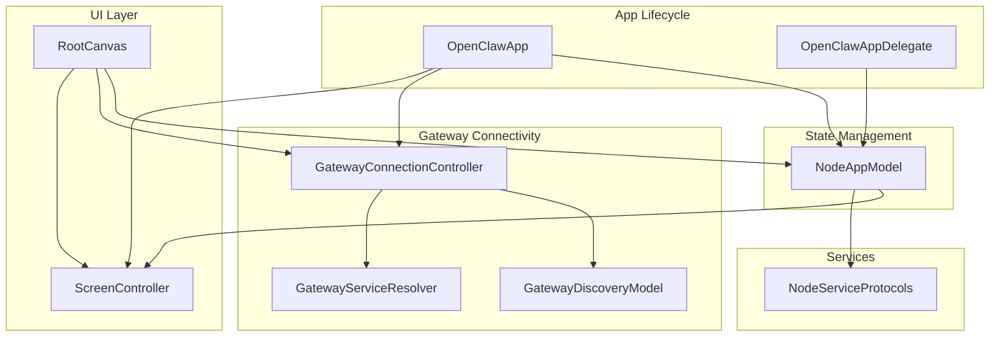
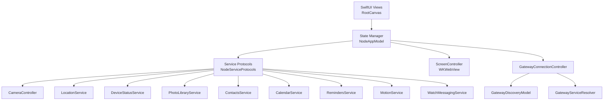
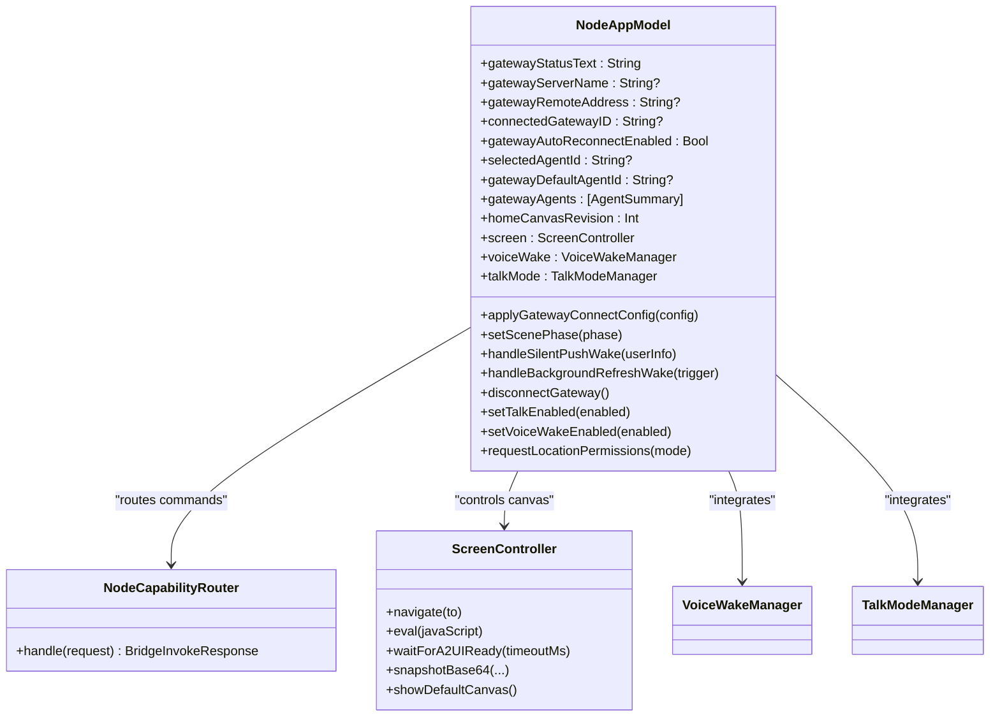
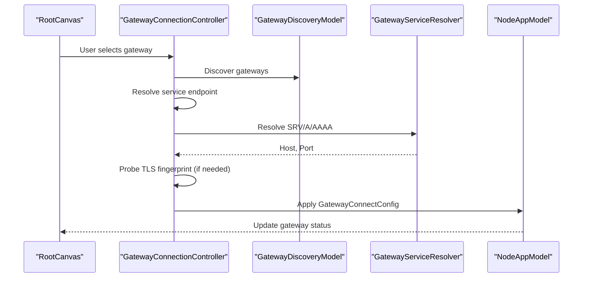
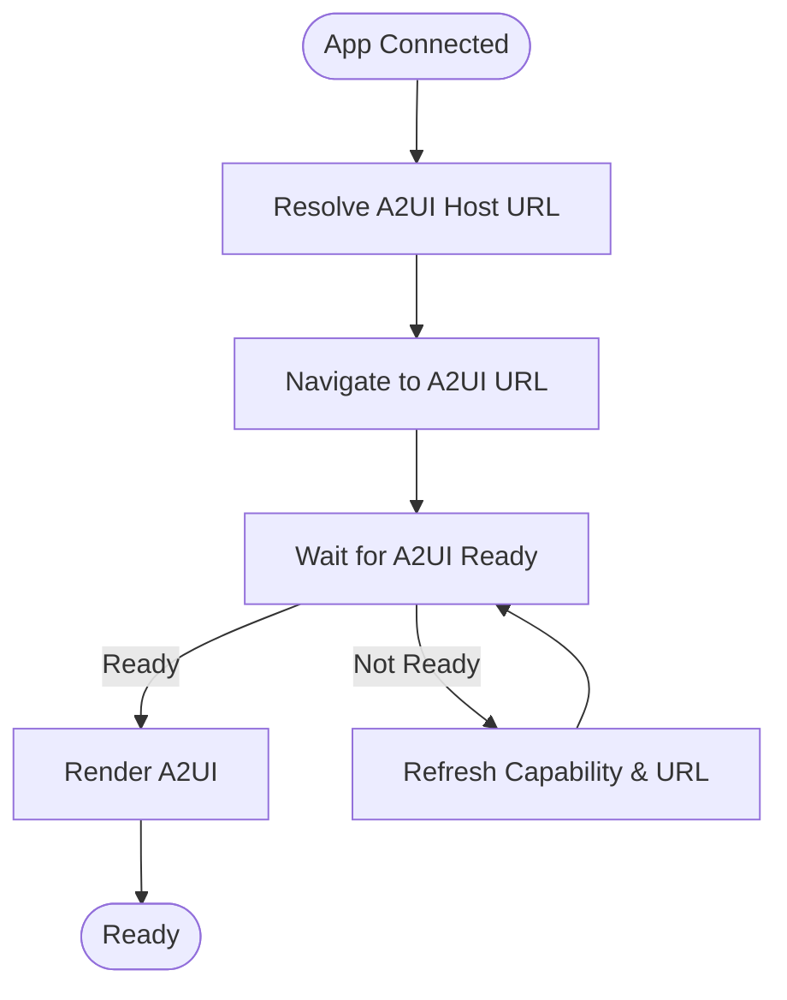
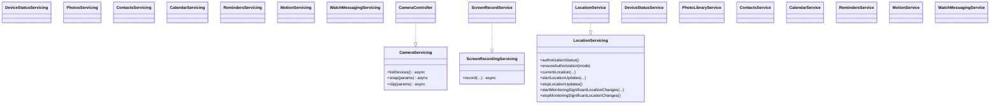
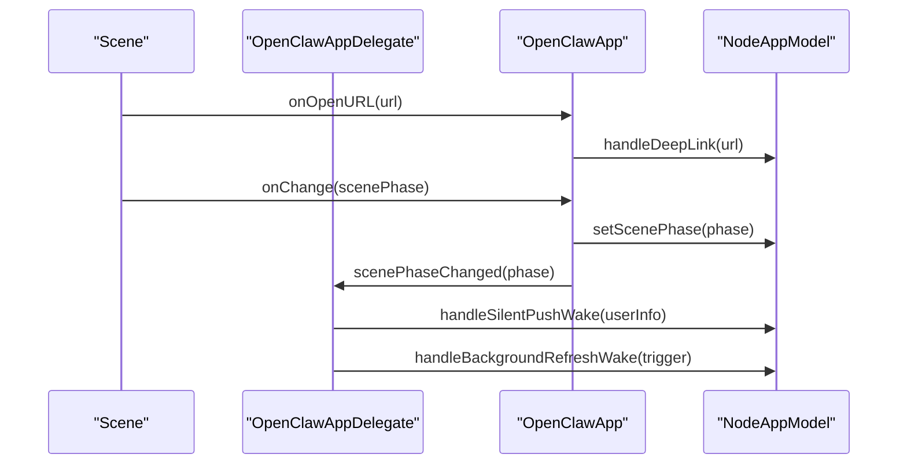
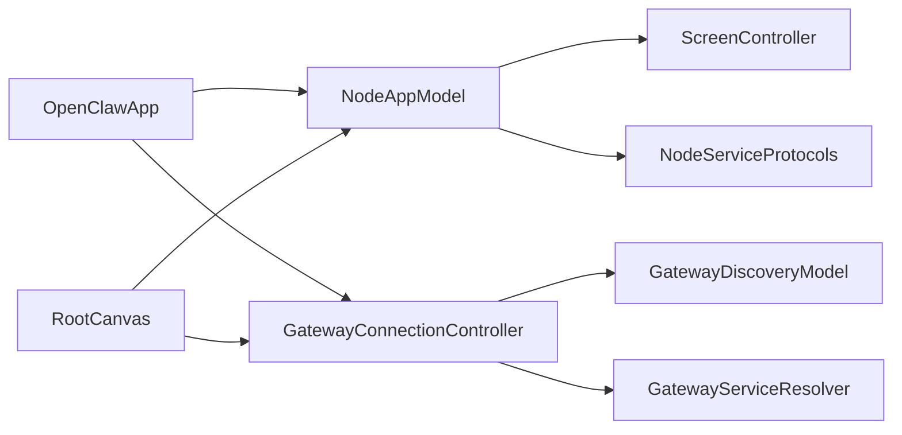

# iOS App Architecture

<cite>
**Referenced Files in This Document**
- [OpenClawApp.swift](file://apps/ios/Sources/OpenClawApp.swift)
- [NodeAppModel.swift](file://apps/ios/Sources/Model/NodeAppModel.swift)
- [NodeServiceProtocols.swift](file://apps/ios/Sources/Services/NodeServiceProtocols.swift)
- [GatewayConnectionController.swift](file://apps/ios/Sources/Gateway/GatewayConnectionController.swift)
- [GatewayDiscoveryModel.swift](file://apps/ios/Sources/Gateway/GatewayDiscoveryModel.swift)
- [GatewayServiceResolver.swift](file://apps/ios/Sources/Gateway/GatewayServiceResolver.swift)
- [RootCanvas.swift](file://apps/ios/Sources/RootCanvas.swift)
- [ScreenController.swift](file://apps/ios/Sources/Screen/ScreenController.swift)
- [NodeAppModel+Canvas.swift](file://apps/ios/Sources/Model/NodeAppModel+Canvas.swift)
</cite>

## Table of Contents
1. [Introduction](#introduction)
2. [Project Structure](#project-structure)
3. [Core Components](#core-components)
4. [Architecture Overview](#architecture-overview)
5. [Detailed Component Analysis](#detailed-component-analysis)
6. [Dependency Analysis](#dependency-analysis)
7. [Performance Considerations](#performance-considerations)
8. [Troubleshooting Guide](#troubleshooting-guide)
9. [Conclusion](#conclusion)

## Introduction
This document explains the iOS app architecture for OpenClaw’s iPhone companion application. It focuses on the SwiftUI-based UI framework, a modular service architecture, and gateway connectivity patterns. The app acts as a gateway node client, managing WebSocket connections, real-time communication, and background/foreground lifecycle transitions. The NodeAppModel serves as the central state manager coordinating UI components and gateway services, while a service protocol design pattern enables dependency injection and testability.

## Project Structure
The iOS app is organized around a clear separation of concerns:
- Application lifecycle and entry point: OpenClawApp and OpenClawAppDelegate
- Central state management: NodeAppModel
- UI layer: SwiftUI views and canvases (RootCanvas, ScreenController)
- Gateway connectivity: GatewayConnectionController, GatewayDiscoveryModel, GatewayServiceResolver
- Service abstraction: NodeServiceProtocols
- Canvas and A2UI integration: NodeAppModel+Canvas and ScreenController

**Diagram sources**
- [OpenClawApp.swift:500-533](file://apps/ios/Sources/OpenClawApp.swift#L500-L533)
- [NodeAppModel.swift:56-228](file://apps/ios/Sources/Model/NodeAppModel.swift#L56-L228)
- [RootCanvas.swift:5-218](file://apps/ios/Sources/RootCanvas.swift#L5-L218)
- [ScreenController.swift:8-281](file://apps/ios/Sources/Screen/ScreenController.swift#L8-L281)
- [GatewayConnectionController.swift:22-800](file://apps/ios/Sources/Gateway/GatewayConnectionController.swift#L22-L800)
- [GatewayDiscoveryModel.swift:8-182](file://apps/ios/Sources/Gateway/GatewayDiscoveryModel.swift#L8-L182)
- [GatewayServiceResolver.swift:6-53](file://apps/ios/Sources/Gateway/GatewayServiceResolver.swift#L6-L53)
- [NodeServiceProtocols.swift:9-108](file://apps/ios/Sources/Services/NodeServiceProtocols.swift#L9-L108)

**Section sources**
- [OpenClawApp.swift:500-533](file://apps/ios/Sources/OpenClawApp.swift#L500-L533)
- [RootCanvas.swift:5-218](file://apps/ios/Sources/RootCanvas.swift#L5-L218)

## Core Components
- OpenClawApp: The SwiftUI App entry point initializes NodeAppModel and GatewayConnectionController, injects environment values, and handles deep links and scene phase changes.
- NodeAppModel: Central state manager orchestrating gateway sessions, capability routing, UI updates, background/foreground transitions, and service integrations.
- GatewayConnectionController: Manages gateway discovery, trust prompts, TLS pinning, and auto-reconnect logic.
- GatewayDiscoveryModel: Discovers gateways via Bonjour, aggregates results, and maintains status and debug logs.
- GatewayServiceResolver: Resolves Bonjour service endpoints to host/port pairs.
- ScreenController: Embeds a WKWebView for canvas rendering, supports navigation, snapshots, and A2UI readiness checks.
- NodeServiceProtocols: Defines service interfaces for camera, screen recording, location, device status, photos, contacts, calendar, reminders, motion, and watch messaging.

**Section sources**
- [OpenClawApp.swift:500-533](file://apps/ios/Sources/OpenClawApp.swift#L500-L533)
- [NodeAppModel.swift:56-228](file://apps/ios/Sources/Model/NodeAppModel.swift#L56-L228)
- [GatewayConnectionController.swift:22-800](file://apps/ios/Sources/Gateway/GatewayConnectionController.swift#L22-L800)
- [GatewayDiscoveryModel.swift:8-182](file://apps/ios/Sources/Gateway/GatewayDiscoveryModel.swift#L8-L182)
- [GatewayServiceResolver.swift:6-53](file://apps/ios/Sources/Gateway/GatewayServiceResolver.swift#L6-L53)
- [ScreenController.swift:8-281](file://apps/ios/Sources/Screen/ScreenController.swift#L8-L281)
- [NodeServiceProtocols.swift:9-108](file://apps/ios/Sources/Services/NodeServiceProtocols.swift#L9-L108)

## Architecture Overview
The app follows a layered architecture:
- UI Layer: SwiftUI views and RootCanvas coordinate user interactions and present gateway status.
- State Layer: NodeAppModel encapsulates business logic, state, and service orchestration.
- Service Layer: Protocol-driven services abstract platform capabilities and device features.
- Gateway Layer: GatewayConnectionController and discovery utilities manage secure, persistent connections to the gateway.

**Diagram sources**
- [RootCanvas.swift:5-218](file://apps/ios/Sources/RootCanvas.swift#L5-L218)
- [NodeAppModel.swift:56-228](file://apps/ios/Sources/Model/NodeAppModel.swift#L56-L228)
- [NodeServiceProtocols.swift:9-108](file://apps/ios/Sources/Services/NodeServiceProtocols.swift#L9-L108)
- [ScreenController.swift:8-281](file://apps/ios/Sources/Screen/ScreenController.swift#L8-L281)
- [GatewayConnectionController.swift:22-800](file://apps/ios/Sources/Gateway/GatewayConnectionController.swift#L22-L800)
- [GatewayDiscoveryModel.swift:8-182](file://apps/ios/Sources/Gateway/GatewayDiscoveryModel.swift#L8-L182)
- [GatewayServiceResolver.swift:6-53](file://apps/ios/Sources/Gateway/GatewayServiceResolver.swift#L6-L53)

## Detailed Component Analysis

### NodeAppModel: Central State Manager
NodeAppModel coordinates:
- Dual gateway sessions: nodeGateway (capabilities and invoke) and operatorGateway (chat/talk/config).
- Capability routing via NodeCapabilityRouter delegating to specialized handlers for canvas, camera, screen, system notifications, chat pushes, device info, watch messaging, photos, contacts, calendar, reminders, motion, and talk.
- Background/foreground lifecycle management with graceful reconnects and health monitoring.
- Voice wake and talk mode integration, APNs registration, and push wake handling.
- Canvas and A2UI host resolution, readiness checks, and navigation.

**Diagram sources**
- [NodeAppModel.swift:56-228](file://apps/ios/Sources/Model/NodeAppModel.swift#L56-L228)
- [NodeAppModel.swift:1408-1530](file://apps/ios/Sources/Model/NodeAppModel.swift#L1408-L1530)
- [ScreenController.swift:8-281](file://apps/ios/Sources/Screen/ScreenController.swift#L8-L281)

**Section sources**
- [NodeAppModel.swift:56-228](file://apps/ios/Sources/Model/NodeAppModel.swift#L56-L228)
- [NodeAppModel.swift:1408-1530](file://apps/ios/Sources/Model/NodeAppModel.swift#L1408-L1530)

### Gateway Connectivity Patterns
GatewayConnectionController manages:
- Discovery and trust: resolves service endpoints, validates TLS fingerprints, and presents trust prompts.
- Auto-connect: restores previous connections, respects user preferences, and enforces stored TLS pins.
- Dynamic capability registration: rebuilds connect options reflecting current device capabilities and permissions.
- Scene-aware behavior: pauses discovery in background and resumes on foreground.

**Diagram sources**
- [GatewayConnectionController.swift:95-158](file://apps/ios/Sources/Gateway/GatewayConnectionController.swift#L95-L158)
- [GatewayConnectionController.swift:537-550](file://apps/ios/Sources/Gateway/GatewayConnectionController.swift#L537-L550)
- [GatewayServiceResolver.swift:23-25](file://apps/ios/Sources/Gateway/GatewayServiceResolver.swift#L23-L25)
- [GatewayDiscoveryModel.swift:51-100](file://apps/ios/Sources/Gateway/GatewayDiscoveryModel.swift#L51-L100)

**Section sources**
- [GatewayConnectionController.swift:22-800](file://apps/ios/Sources/Gateway/GatewayConnectionController.swift#L22-L800)
- [GatewayDiscoveryModel.swift:8-182](file://apps/ios/Sources/Gateway/GatewayDiscoveryModel.swift#L8-L182)
- [GatewayServiceResolver.swift:6-53](file://apps/ios/Sources/Gateway/GatewayServiceResolver.swift#L6-L53)

### Canvas and A2UI Integration
NodeAppModel+Canvas provides:
- A2UI host URL resolution and readiness checks.
- Automatic fallback to local canvas on disconnect.
- Preflight TCP probing for A2UI availability.

ScreenController embeds WKWebView to:
- Load local scaffold or remote canvas URLs.
- Evaluate JavaScript for A2UI synchronization and debug status.
- Capture snapshots and manage scroll behavior.

**Diagram sources**
- [NodeAppModel+Canvas.swift:45-62](file://apps/ios/Sources/Model/NodeAppModel+Canvas.swift#L45-L62)
- [NodeAppModel+Canvas.swift:85-93](file://apps/ios/Sources/Model/NodeAppModel+Canvas.swift#L85-L93)
- [ScreenController.swift:118-139](file://apps/ios/Sources/Screen/ScreenController.swift#L118-L139)

**Section sources**
- [NodeAppModel+Canvas.swift:11-95](file://apps/ios/Sources/Model/NodeAppModel+Canvas.swift#L11-L95)
- [ScreenController.swift:8-281](file://apps/ios/Sources/Screen/ScreenController.swift#L8-L281)

### Service Protocol Design Pattern
NodeServiceProtocols define Sendable interfaces for platform services, enabling:
- Dependency injection: NodeAppModel accepts protocol instances for camera, screen recording, location, device status, photos, contacts, calendar, reminders, motion, and watch messaging.
- Testability: Mock implementations can replace real services in tests.
- Isolation: UI and business logic remain decoupled from platform specifics.

**Diagram sources**
- [NodeServiceProtocols.swift:9-108](file://apps/ios/Sources/Services/NodeServiceProtocols.swift#L9-L108)
- [NodeAppModel.swift:159-187](file://apps/ios/Sources/Model/NodeAppModel.swift#L159-L187)

**Section sources**
- [NodeServiceProtocols.swift:9-108](file://apps/ios/Sources/Services/NodeServiceProtocols.swift#L9-L108)
- [NodeAppModel.swift:159-187](file://apps/ios/Sources/Model/NodeAppModel.swift#L159-L187)

### Application Lifecycle and Real-Time Communication
OpenClawApp and OpenClawAppDelegate coordinate:
- Scene phase changes to suspend/restart background tasks and health monitors.
- Silent push wake handling and background refresh tasks.
- APNs registration and device token updates.
- Mirrored watch prompt actions routed to NodeAppModel.

**Diagram sources**
- [OpenClawApp.swift:523-531](file://apps/ios/Sources/OpenClawApp.swift#L523-L531)
- [OpenClawApp.swift:98-156](file://apps/ios/Sources/OpenClawApp.swift#L98-L156)
- [OpenClawApp.swift:17-48](file://apps/ios/Sources/OpenClawApp.swift#L17-L48)

**Section sources**
- [OpenClawApp.swift:500-533](file://apps/ios/Sources/OpenClawApp.swift#L500-L533)
- [OpenClawApp.swift:17-48](file://apps/ios/Sources/OpenClawApp.swift#L17-L48)

## Dependency Analysis
The app exhibits low coupling and high cohesion:
- UI depends on NodeAppModel and GatewayConnectionController via environment values.
- NodeAppModel depends on protocol abstractions for services, enabling easy substitution.
- GatewayConnectionController depends on discovery and resolver utilities for endpoint resolution.
- ScreenController is tightly coupled to WKWebView but remains isolated from business logic.

**Diagram sources**
- [OpenClawApp.swift:500-533](file://apps/ios/Sources/OpenClawApp.swift#L500-L533)
- [RootCanvas.swift:5-218](file://apps/ios/Sources/RootCanvas.swift#L5-L218)
- [NodeAppModel.swift:56-228](file://apps/ios/Sources/Model/NodeAppModel.swift#L56-L228)
- [GatewayConnectionController.swift:22-800](file://apps/ios/Sources/Gateway/GatewayConnectionController.swift#L22-L800)
- [GatewayDiscoveryModel.swift:8-182](file://apps/ios/Sources/Gateway/GatewayDiscoveryModel.swift#L8-L182)
- [GatewayServiceResolver.swift:6-53](file://apps/ios/Sources/Gateway/GatewayServiceResolver.swift#L6-L53)
- [ScreenController.swift:8-281](file://apps/ios/Sources/Screen/ScreenController.swift#L8-L281)
- [NodeServiceProtocols.swift:9-108](file://apps/ios/Sources/Services/NodeServiceProtocols.swift#L9-L108)

**Section sources**
- [OpenClawApp.swift:500-533](file://apps/ios/Sources/OpenClawApp.swift#L500-L533)
- [RootCanvas.swift:5-218](file://apps/ios/Sources/RootCanvas.swift#L5-L218)
- [NodeAppModel.swift:56-228](file://apps/ios/Sources/Model/NodeAppModel.swift#L56-L228)

## Performance Considerations
- Background/foreground transitions: Graceful suspension of voice wake and talk mode prevents unnecessary CPU usage and conserves battery.
- Health monitoring: Periodic health checks reduce stale connections and improve reliability.
- A2UI readiness: Preflight checks and capability refresh avoid rendering failures and reduce retries.
- Snapshot sizing: Controlled maxWidth and format selection balance fidelity and payload size.
- Idle timer: Prevents screen dimming during active sessions to maintain responsiveness.

## Troubleshooting Guide
Common areas to inspect:
- Gateway trust and TLS: Verify stored fingerprints and trust prompts in GatewayConnectionController.
- Discovery issues: Review GatewayDiscoveryModel status and debug logs for browser states and TXT records.
- A2UI readiness: Confirm A2UI host URL resolution and readiness checks in NodeAppModel+Canvas.
- Silent push and background tasks: Validate APNs registration and background refresh task scheduling in OpenClawAppDelegate.
- Canvas navigation: Ensure URLs are not loopback and ScreenController applies correct scroll behavior.

**Section sources**
- [GatewayConnectionController.swift:242-290](file://apps/ios/Sources/Gateway/GatewayConnectionController.swift#L242-L290)
- [GatewayDiscoveryModel.swift:129-133](file://apps/ios/Sources/Gateway/GatewayDiscoveryModel.swift#L129-L133)
- [NodeAppModel+Canvas.swift:45-62](file://apps/ios/Sources/Model/NodeAppModel+Canvas.swift#L45-L62)
- [OpenClawApp.swift:98-156](file://apps/ios/Sources/OpenClawApp.swift#L98-L156)
- [ScreenController.swift:29-71](file://apps/ios/Sources/Screen/ScreenController.swift#L29-L71)

## Conclusion
OpenClaw’s iOS app employs a clean, modular architecture centered on NodeAppModel for state coordination, SwiftUI for UI composition, and protocol-driven services for testability and flexibility. Gateway connectivity is robust, secure, and resilient, with careful handling of background/foreground transitions and real-time communication. The separation of concerns ensures maintainability and scalability across device capabilities, gateway features, and user interactions.