# iOS Application

<cite>
**Referenced Files in This Document**
- [README.md](file://apps/ios/README.md)
- [OpenClawApp.swift](file://apps/ios/Sources/OpenClawApp.swift)
- [NodeAppModel.swift](file://apps/ios/Sources/Model/NodeAppModel.swift)
- [GatewayConnectionController.swift](file://apps/ios/Sources/Gateway/GatewayConnectionController.swift)
- [PushRegistrationManager.swift](file://apps/ios/Sources/Push/PushRegistrationManager.swift)
- [ShareViewController.swift](file://apps/ios/ShareExtension/ShareViewController.swift)
</cite>

## Table of Contents
1. [Introduction](#introduction)
2. [Project Structure](#project-structure)
3. [Core Components](#core-components)
4. [Architecture Overview](#architecture-overview)
5. [Detailed Component Analysis](#detailed-component-analysis)
6. [Dependency Analysis](#dependency-analysis)
7. [Performance Considerations](#performance-considerations)
8. [Troubleshooting Guide](#troubleshooting-guide)
9. [Conclusion](#conclusion)
10. [Appendices](#appendices)

## Introduction
This document describes the iOS application for OpenClaw’s iPhone companion. The app acts as a role: node, connecting to an OpenClaw Gateway over a secure WebSocket. It is in super-alpha and internal-only distribution, intended for early-stage development and testing. The app exposes device capabilities to the Gateway (camera, canvas, screen recording, location, contacts, calendar, reminders, photos, motion, notifications) and supports Voice Wake and Talk. It integrates with Apple Push Notification service (APNs) and supports both direct and relay transports for push delivery. The Share Extension forwards iOS share actions into the connected Gateway session.

## Project Structure
The iOS app is organized around a SwiftUI-based UI, a central application model, gateway connection orchestration, capability routing, push registration, and a Share Extension.

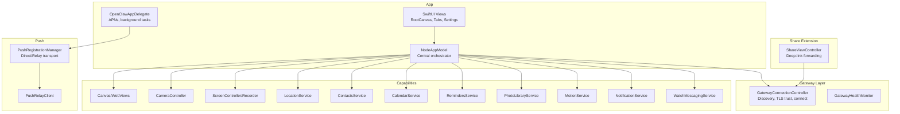

**Diagram sources**
- [OpenClawApp.swift:500-533](file://apps/ios/Sources/OpenClawApp.swift#L500-L533)
- [NodeAppModel.swift:56-1530](file://apps/ios/Sources/Model/NodeAppModel.swift#L56-L1530)
- [GatewayConnectionController.swift:22-800](file://apps/ios/Sources/Gateway/GatewayConnectionController.swift#L22-L800)
- [PushRegistrationManager.swift:28-170](file://apps/ios/Sources/Push/PushRegistrationManager.swift#L28-L170)
- [ShareViewController.swift:7-551](file://apps/ios/ShareExtension/ShareViewController.swift#L7-L551)

**Section sources**
- [README.md:1-218](file://apps/ios/README.md#L1-L218)
- [OpenClawApp.swift:500-533](file://apps/ios/Sources/OpenClawApp.swift#L500-L533)

## Core Components
- NodeAppModel: Central orchestrator managing gateway connections, capability routing, background behavior, voice wake, talk, notifications, and deep link handling.
- GatewayConnectionController: Discovers gateways, resolves endpoints, manages TLS trust prompts, and applies connection configs with capabilities and permissions.
- OpenClawAppDelegate: Handles app lifecycle, APNs registration, silent push wake, background refresh tasks, and watch prompt mirroring.
- PushRegistrationManager: Builds push registration payloads for either direct APNs or relay-based transport, integrating with a push relay and gateway identity.
- ShareViewController: Extracts shared content from the system Share UI and forwards it to the connected Gateway session.

**Section sources**
- [NodeAppModel.swift:56-1530](file://apps/ios/Sources/Model/NodeAppModel.swift#L56-L1530)
- [GatewayConnectionController.swift:22-800](file://apps/ios/Sources/Gateway/GatewayConnectionController.swift#L22-L800)
- [OpenClawApp.swift:17-263](file://apps/ios/Sources/OpenClawApp.swift#L17-L263)
- [PushRegistrationManager.swift:28-170](file://apps/ios/Sources/Push/PushRegistrationManager.swift#L28-L170)
- [ShareViewController.swift:7-551](file://apps/ios/ShareExtension/ShareViewController.swift#L7-L551)

## Architecture Overview
The app establishes a WebSocket connection to the Gateway as a “node” with dynamic capabilities and permissions. It routes node.invoke commands to specialized handlers and enforces background restrictions. APNs registration is performed at launch and can be directed to a push relay for official builds. The Share Extension connects to the Gateway to forward shared content.

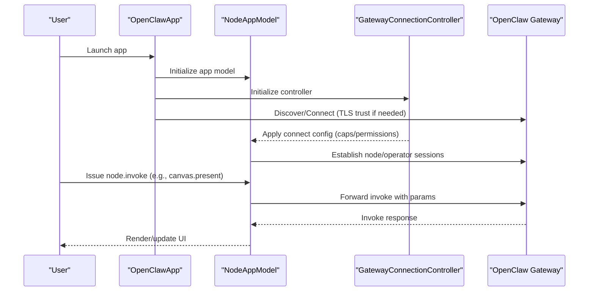

**Diagram sources**
- [OpenClawApp.swift:500-533](file://apps/ios/Sources/OpenClawApp.swift#L500-L533)
- [GatewayConnectionController.swift:456-482](file://apps/ios/Sources/Gateway/GatewayConnectionController.swift#L456-L482)
- [NodeAppModel.swift:732-778](file://apps/ios/Sources/Model/NodeAppModel.swift#L732-L778)

## Detailed Component Analysis

### Gateway Connection and TLS Trust
- Discovery and autoconnect: The controller discovers gateways, optionally autoconnects based on user preferences and stored trust, and applies connection options including capabilities and permissions.
- Manual and discovered connections: Supports manual host/port with optional TLS; performs TLS fingerprint probing when needed and prompts for trust acceptance.
- Capability and permission reflection: Builds connect options reflecting current device capabilities and authorizations.

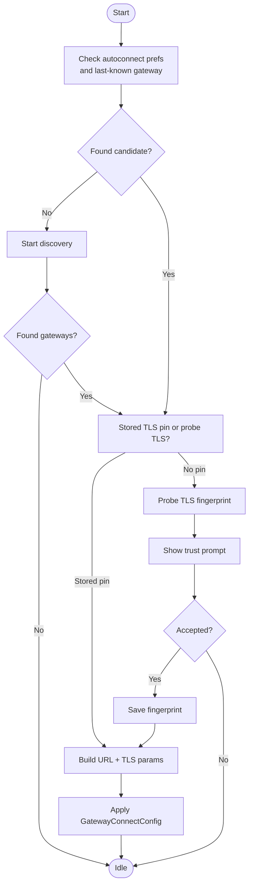

**Diagram sources**
- [GatewayConnectionController.swift:315-429](file://apps/ios/Sources/Gateway/GatewayConnectionController.swift#L315-L429)
- [GatewayConnectionController.swift:528-535](file://apps/ios/Sources/Gateway/GatewayConnectionController.swift#L528-L535)
- [GatewayConnectionController.swift:744-940](file://apps/ios/Sources/Gateway/GatewayConnectionController.swift#L744-L940)

**Section sources**
- [GatewayConnectionController.swift:456-482](file://apps/ios/Sources/Gateway/GatewayConnectionController.swift#L456-L482)
- [GatewayConnectionController.swift:744-940](file://apps/ios/Sources/Gateway/GatewayConnectionController.swift#L744-L940)

### Node Capabilities and Background Behavior
- Supported capabilities include canvas, screen, camera, location, device info, watch, photos, contacts, calendar, reminders, motion, and notifications.
- Background restrictions: Certain commands (canvas.*, camera.*, screen.*, talk.*) are restricted when backgrounded; the app enforces these rules and returns appropriate errors.
- Background/foreground transitions: The app maintains a grace period and reconnects intelligently on foreground; voice wake and talk manage microphone sharing to avoid conflicts.

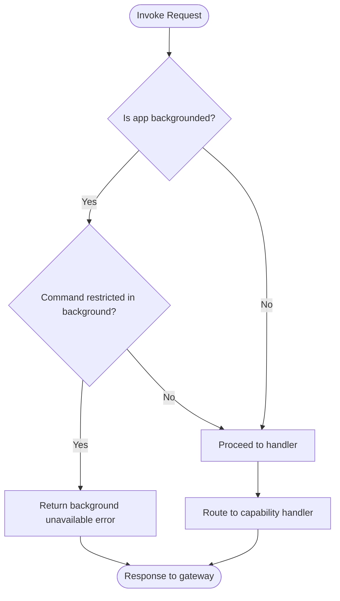

**Diagram sources**
- [NodeAppModel.swift:732-783](file://apps/ios/Sources/Model/NodeAppModel.swift#L732-L783)
- [NodeAppModel.swift:1408-1530](file://apps/ios/Sources/Model/NodeAppModel.swift#L1408-L1530)

**Section sources**
- [NodeAppModel.swift:732-783](file://apps/ios/Sources/Model/NodeAppModel.swift#L732-L783)
- [NodeAppModel.swift:1408-1530](file://apps/ios/Sources/Model/NodeAppModel.swift#L1408-L1530)

### Canvas Integration (present/navigate/eval/snapshot)
- Present or navigate to a URL; hide to default canvas; evaluate JavaScript; take snapshot with configurable format and size.
- A2UI integration: Reset, push messages (JSON or JSONL), and pushJSONL are supported.

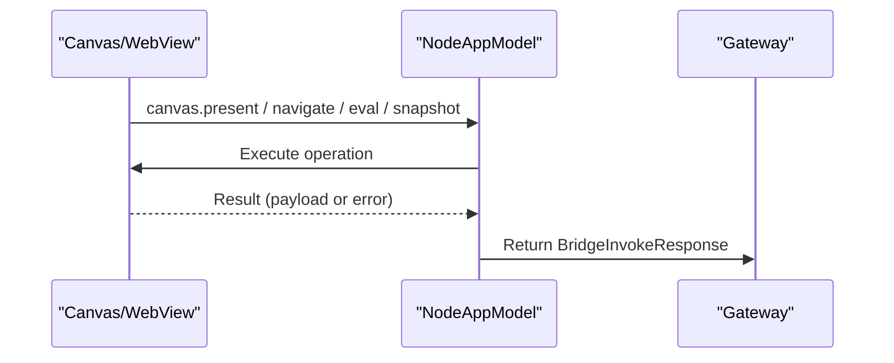

**Diagram sources**
- [NodeAppModel.swift:844-896](file://apps/ios/Sources/Model/NodeAppModel.swift#L844-L896)
- [NodeAppModel.swift:898-985](file://apps/ios/Sources/Model/NodeAppModel.swift#L898-L985)

**Section sources**
- [NodeAppModel.swift:844-896](file://apps/ios/Sources/Model/NodeAppModel.swift#L844-L896)
- [NodeAppModel.swift:898-985](file://apps/ios/Sources/Model/NodeAppModel.swift#L898-L985)

### Camera Functionality (snap/clip)
- Lists cameras, takes photos, and records clips with optional audio. Clips temporarily suspend voice wake to avoid microphone contention.

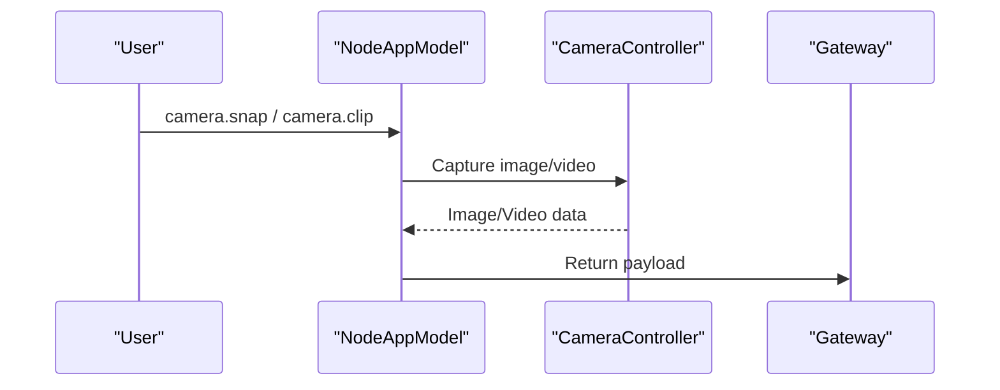

**Diagram sources**
- [NodeAppModel.swift:987-1045](file://apps/ios/Sources/Model/NodeAppModel.swift#L987-L1045)

**Section sources**
- [NodeAppModel.swift:987-1045](file://apps/ios/Sources/Model/NodeAppModel.swift#L987-L1045)

### Screen Recording
- Records MP4 with configurable duration, FPS, and audio inclusion. Returns encoded video data.

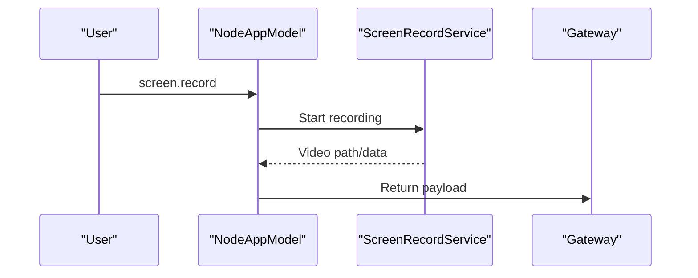

**Diagram sources**
- [NodeAppModel.swift:1047-1082](file://apps/ios/Sources/Model/NodeAppModel.swift#L1047-L1082)

**Section sources**
- [NodeAppModel.swift:1047-1082](file://apps/ios/Sources/Model/NodeAppModel.swift#L1047-L1082)

### Location Services
- Requests location permission and returns current location with accuracy and timestamps. Background location requires “Always” authorization.

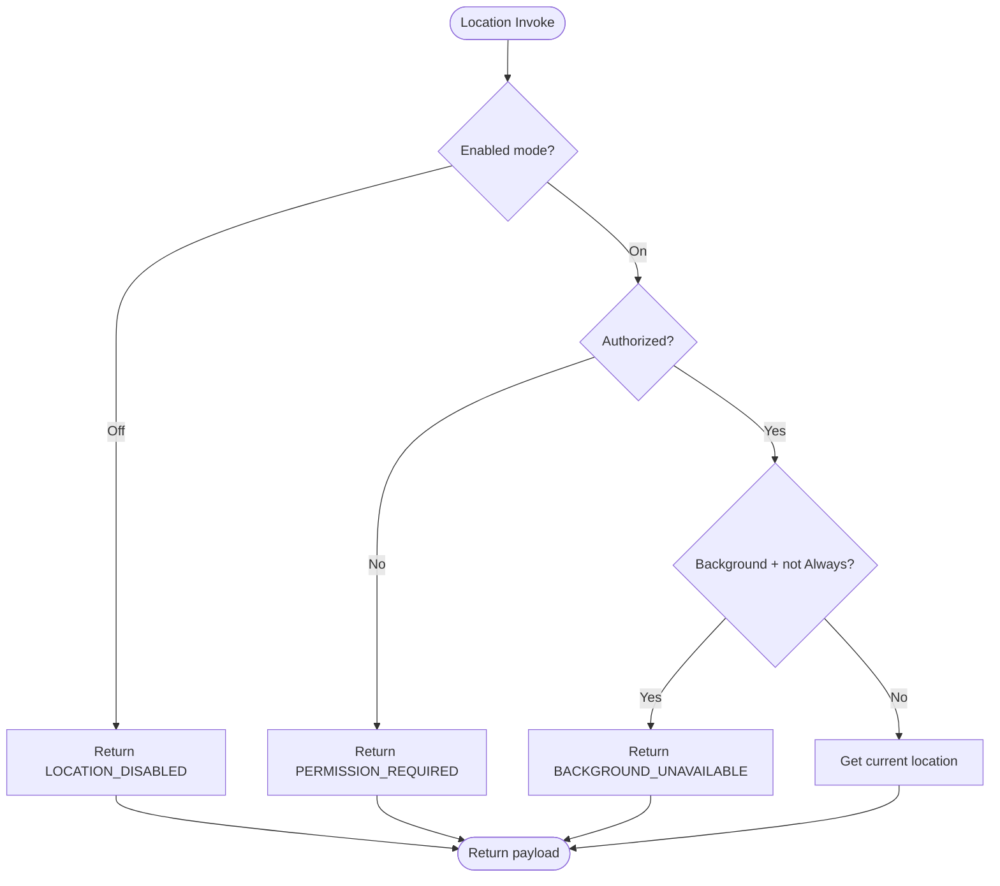

**Diagram sources**
- [NodeAppModel.swift:785-842](file://apps/ios/Sources/Model/NodeAppModel.swift#L785-L842)

**Section sources**
- [NodeAppModel.swift:785-842](file://apps/ios/Sources/Model/NodeAppModel.swift#L785-L842)

### Contacts, Calendar, Reminders, Photos, Motion, Local Notifications
- Contacts: search and add entries.
- Calendar: list events and add entries.
- Reminders: list and add reminders.
- Photos: fetch latest items.
- Motion: activity and pedometer data.
- Local notifications: post alerts with priority and sound control.

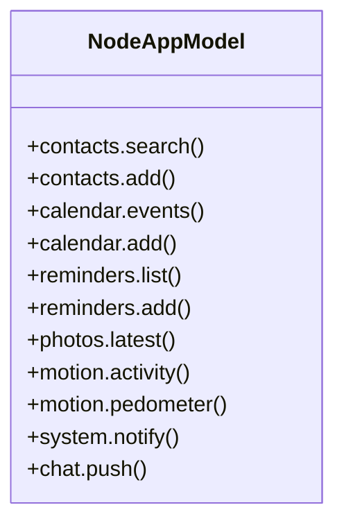

**Diagram sources**
- [NodeAppModel.swift:1275-1366](file://apps/ios/Sources/Model/NodeAppModel.swift#L1275-L1366)

**Section sources**
- [NodeAppModel.swift:1275-1366](file://apps/ios/Sources/Model/NodeAppModel.swift#L1275-L1366)

### Voice Wake and Talk Interaction
- Voice Wake captures speech and sends transcripts to the Gateway. Talk mode takes exclusive microphone access; Voice Wake is suspended while Talk is active. Both can be toggled in settings.

```mermaid
sequenceDiagram
participant VW as "VoiceWakeManager"
participant TM as "TalkModeManager"
participant Model as "NodeAppModel"
participant GW as "Gateway"
VW->>Model : Transcript(text)
Model->>GW : Send transcript
TM->>Model : Begin/End PTT
Model->>GW : Manage mic access
Note over VW,TM : Talk suppresses Voice Wake; resume when Talk ends
```

**Diagram sources**
- [NodeAppModel.swift:195-212](file://apps/ios/Sources/Model/NodeAppModel.swift#L195-L212)
- [NodeAppModel.swift:1368-1402](file://apps/ios/Sources/Model/NodeAppModel.swift#L1368-L1402)

**Section sources**
- [NodeAppModel.swift:195-212](file://apps/ios/Sources/Model/NodeAppModel.swift#L195-L212)
- [NodeAppModel.swift:1368-1402](file://apps/ios/Sources/Model/NodeAppModel.swift#L1368-L1402)

### Share Extension Deep-Link Forwarding
- Extracts shared content (title, text, URL, images) and forwards it to the connected Gateway session as an agent request. Supports delivery routing and receipts.

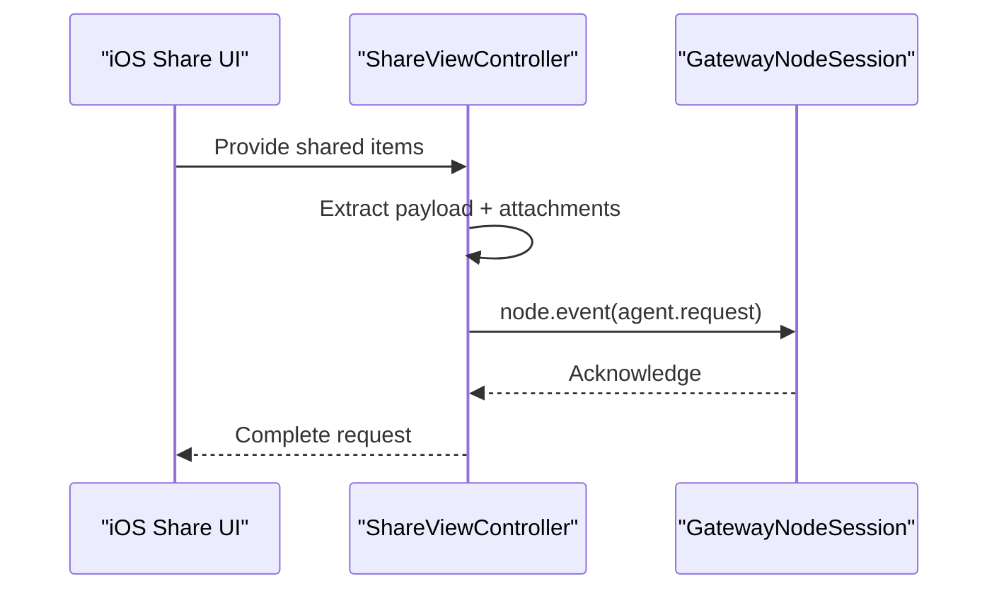

**Diagram sources**
- [ShareViewController.swift:157-277](file://apps/ios/ShareExtension/ShareViewController.swift#L157-L277)

**Section sources**
- [ShareViewController.swift:157-277](file://apps/ios/ShareExtension/ShareViewController.swift#L157-L277)

### Push Notification Registration and Transport
- Local/manual builds: register APNs token and send direct registration to the Gateway.
- Official builds: register with a push relay using App Attest and app receipt; registration is bound to gateway identity and installation; stores relay handle and send grant for reuse.

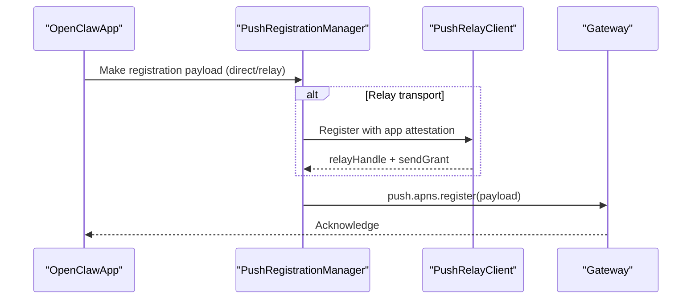

**Diagram sources**
- [OpenClawApp.swift:61-74](file://apps/ios/Sources/OpenClawApp.swift#L61-L74)
- [PushRegistrationManager.swift:41-62](file://apps/ios/Sources/Push/PushRegistrationManager.swift#L41-L62)
- [PushRegistrationManager.swift:113-142](file://apps/ios/Sources/Push/PushRegistrationManager.swift#L113-L142)

**Section sources**
- [OpenClawApp.swift:61-74](file://apps/ios/Sources/OpenClawApp.swift#L61-L74)
- [PushRegistrationManager.swift:41-62](file://apps/ios/Sources/Push/PushRegistrationManager.swift#L41-L62)
- [PushRegistrationManager.swift:113-142](file://apps/ios/Sources/Push/PushRegistrationManager.swift#L113-L142)

### Activity Widget Integration
- The Activity Widget bundle and Live Activity manager are present in the app, enabling presence and live updates on the Lock Screen.

[No sources needed since this section doesn't analyze specific files]

## Dependency Analysis
- App delegates to NodeAppModel for orchestration; NodeAppModel depends on capability routers and service abstractions.
- GatewayConnectionController depends on discovery, DNS resolution, and TLS fingerprinting.
- PushRegistrationManager depends on build configuration and relay client.
- ShareExtension depends on GatewayNodeSession and persisted relay settings.

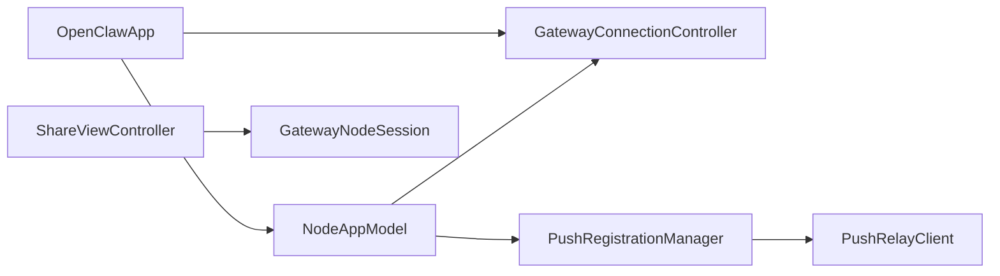

**Diagram sources**
- [OpenClawApp.swift:500-533](file://apps/ios/Sources/OpenClawApp.swift#L500-L533)
- [GatewayConnectionController.swift:456-482](file://apps/ios/Sources/Gateway/GatewayConnectionController.swift#L456-L482)
- [PushRegistrationManager.swift:28-39](file://apps/ios/Sources/Push/PushRegistrationManager.swift#L28-L39)
- [ShareViewController.swift:171-174](file://apps/ios/ShareExtension/ShareViewController.swift#L171-L174)

**Section sources**
- [OpenClawApp.swift:500-533](file://apps/ios/Sources/OpenClawApp.swift#L500-L533)
- [GatewayConnectionController.swift:456-482](file://apps/ios/Sources/Gateway/GatewayConnectionController.swift#L456-L482)
- [PushRegistrationManager.swift:28-39](file://apps/ios/Sources/Push/PushRegistrationManager.swift#L28-L39)
- [ShareViewController.swift:171-174](file://apps/ios/ShareExtension/ShareViewController.swift#L171-L174)

## Performance Considerations
- Foreground-first operation: Background socket suspension and reconnect logic are tuned; prefer testing in foreground first.
- Background command restrictions: Avoid heavy operations in background; rely on foreground for camera, screen, canvas, and talk.
- Location background: Requires “Always” authorization; avoid continuous polling to prevent battery drain.
- Silent push wake: Use background refresh tasks and silent push handling to minimize reconnect churn.

[No sources needed since this section provides general guidance]

## Troubleshooting Guide
- Build/signing baseline: Regenerate project, verify team and bundle IDs.
- Gateway status: Confirm server, remote address, and pairing/auth gating in Settings.
- Discovery/debug logs: Enable discovery debug logs and review Settings -> Gateway -> Discovery Logs.
- Manual host/port: Switch to manual host/port with TLS fingerprint trust when discovery is flaky.
- APNs registration: Check for “APNs registration failed” logs; ensure push capability and provisioning match the bundle ID.
- Background expectations: Reproduce in foreground first; confirm reconnect on return.
- Voice Wake vs Talk: Talk suppresses wake capture; toggle settings accordingly.

**Section sources**
- [README.md:196-218](file://apps/ios/README.md#L196-L218)
- [OpenClawApp.swift:72-74](file://apps/ios/Sources/OpenClawApp.swift#L72-L74)

## Conclusion
The iOS app for OpenClaw is a super-alpha, internal-only companion that connects as a role: node to the Gateway. It supports a broad set of device capabilities, enforces background restrictions, integrates APNs with direct and relay transports, and forwards shared content via a Share Extension. While foreground-first operation is most reliable, ongoing work aims to harden wake/reconnect behavior and reduce background command limitations.

[No sources needed since this section summarizes without analyzing specific files]

## Appendices

### Setup and Deployment
- Xcode manual deploy flow: Install dependencies, configure signing, generate project, open in Xcode, select Debug scheme and device, then Run.
- Local beta release flow: Configure signing, Fastlane, App Store Connect API key, and use pnpm scripts to archive or upload to TestFlight; official builds switch to relay transport and production APNs environment.

**Section sources**
- [README.md:18-94](file://apps/ios/README.md#L18-L94)

### iOS App Store and Permissions Notes
- iOS app store distribution is not applicable for this internal-only build.
- Permissions required: Camera, Microphone, Speech Recognition, Location (Always for background), Screen Recording, Photos, Contacts, Calendar, Reminders, Motion; verified via currentPermissions mapping.

**Section sources**
- [GatewayConnectionController.swift:890-922](file://apps/ios/Sources/Gateway/GatewayConnectionController.swift#L890-L922)