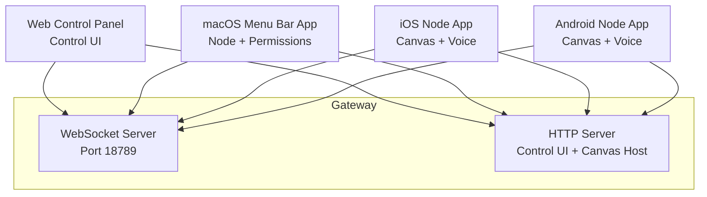
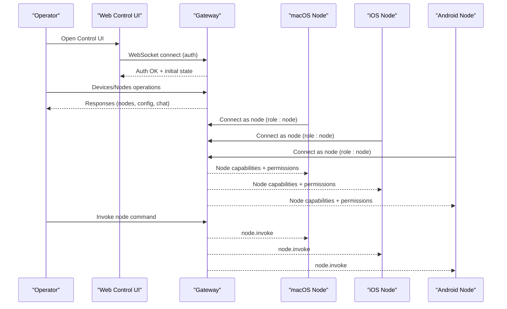
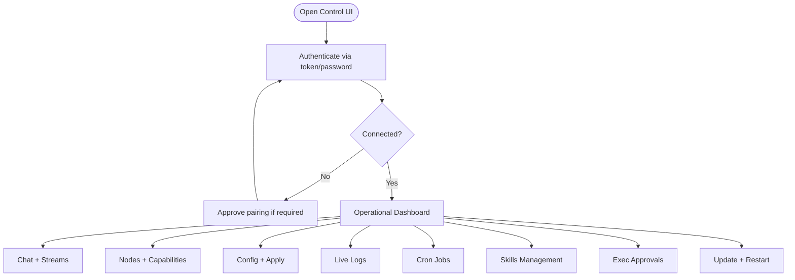
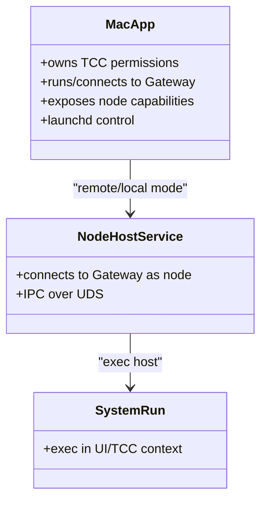
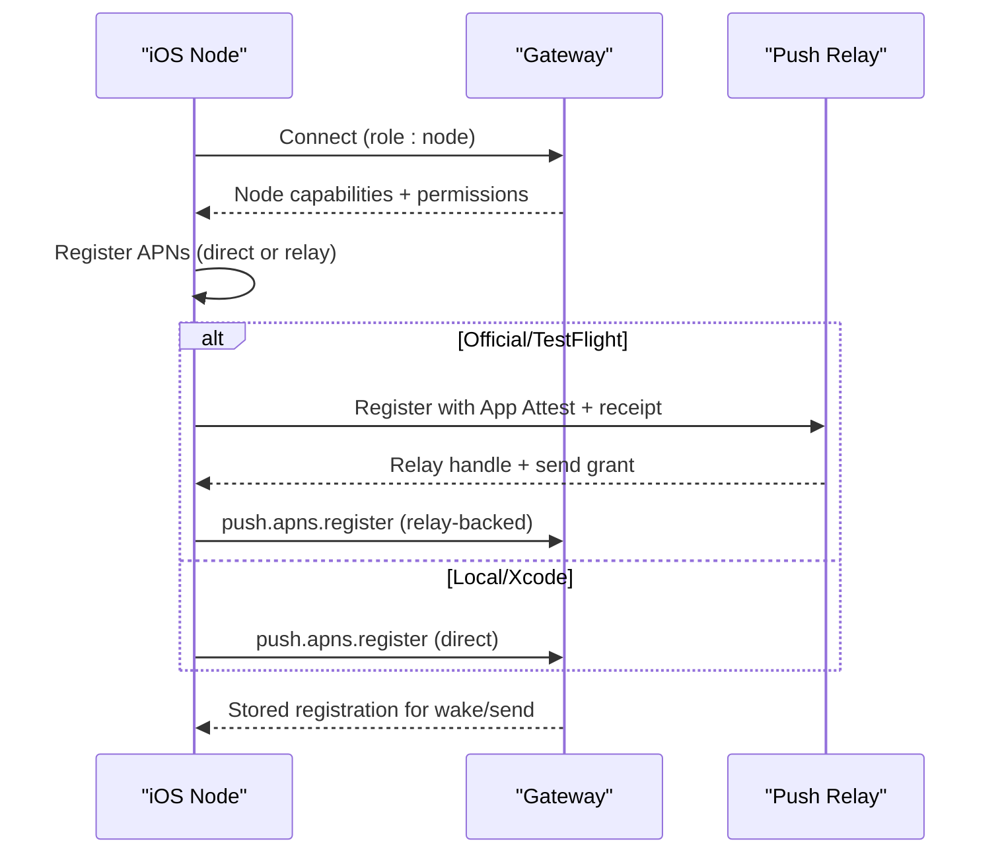
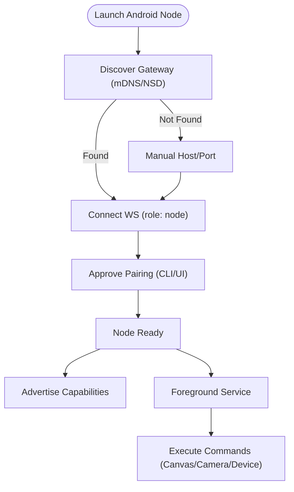
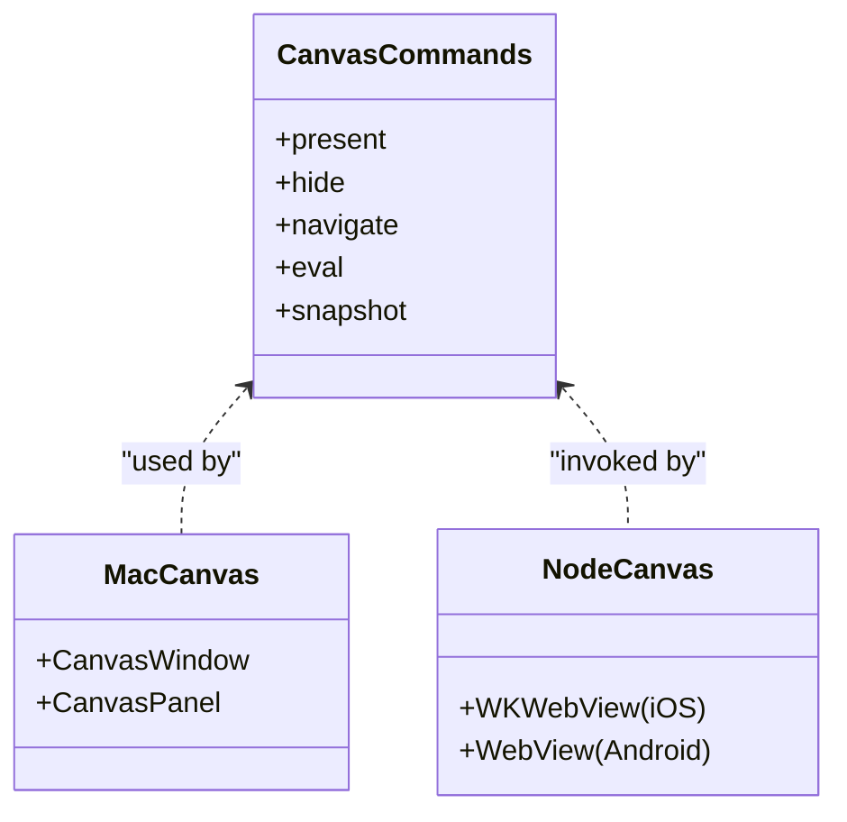
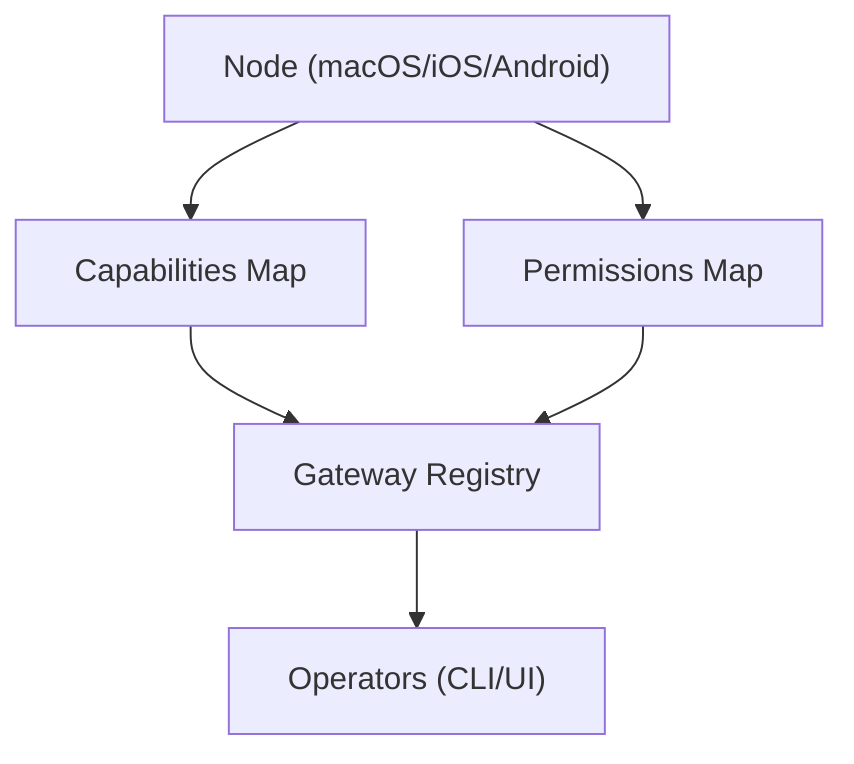
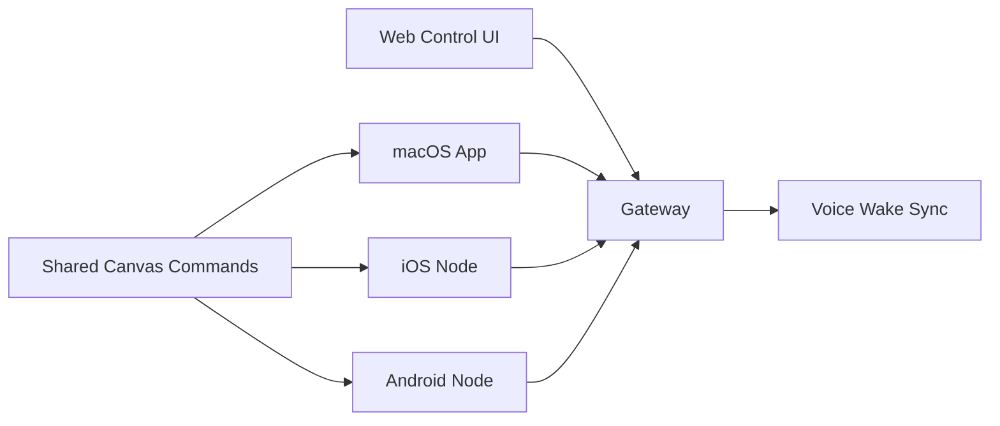

# Multi-Platform Applications

<cite>
**Referenced Files in This Document**
- [README.md](file://README.md)
- [apps/macos/README.md](file://apps/macos/README.md)
- [apps/ios/README.md](file://apps/ios/README.md)
- [apps/android/README.md](file://apps/android/README.md)
- [assets/chrome-extension/README.md](file://assets/chrome-extension/README.md)
- [docs/platforms/index.md](file://docs/platforms/index.md)
- [docs/platforms/macos.md](file://docs/platforms/macos.md)
- [docs/platforms/ios.md](file://docs/platforms/ios.md)
- [docs/platforms/android.md](file://docs/platforms/android.md)
- [docs/web/control-ui.md](file://docs/web/control-ui.md)
- [docs/nodes/voicewake.md](file://docs/nodes/voicewake.md)
- [docs/nodes/index.md](file://docs/nodes/index.md)
- [apps/shared/OpenClawKit/Sources/OpenClawKit/CanvasCommands.swift](file://apps/shared/OpenClawKit/Sources/OpenClawKit/CanvasCommands.swift)
- [apps/macos/Sources/OpenClaw/CanvasWindow.swift](file://apps/macos/Sources/OpenClaw/CanvasWindow.swift)
- [apps/macos/Sources/OpenClaw/CanvasWindowController+Window.swift](file://apps/macos/Sources/OpenClaw/CanvasWindowController+Window.swift)
- [apps/macos/Sources/OpenClaw/VoiceWakeRuntime.swift](file://apps/macos/Sources/OpenClaw/VoiceWakeRuntime.swift)
- [apps/macos/Sources/OpenClaw/VoiceWakeSettings.swift](file://apps/macos/Sources/OpenClaw/VoiceWakeSettings.swift)
- [apps/android/app/src/main/java/ai/openclaw/app/VoiceWakeMode.kt](file://apps/android/app/src/main/java/ai/openclaw/app/VoiceWakeMode.kt)
- [apps/android/app/src/test/java/ai/openclaw/app/node/InvokeCommandRegistryTest.kt](file://apps/android/app/src/test/java/ai/openclaw/app/node/InvokeCommandRegistryTest.kt)
- [src/gateway/server-methods/nodes.ts](file://src/gateway/server-methods/nodes.ts)
- [src/cli/nodes-cli/register.status.ts](file://src/cli/nodes-cli/register.status.ts)
</cite>

## Table of Contents
1. [Introduction](#introduction)
2. [Project Structure](#project-structure)
3. [Core Components](#core-components)
4. [Architecture Overview](#architecture-overview)
5. [Detailed Component Analysis](#detailed-component-analysis)
6. [Dependency Analysis](#dependency-analysis)
7. [Performance Considerations](#performance-considerations)
8. [Troubleshooting Guide](#troubleshooting-guide)
9. [Conclusion](#conclusion)
10. [Appendices](#appendices)

## Introduction
This document explains OpenClaw’s multi-platform ecosystem: the web-based control panel, the macOS menu bar app, and the iOS and Android node apps. It covers platform architecture, capabilities, integration patterns, and operational guidance. It also details the Canvas system, voice wake functionality, and device node capabilities, and provides practical setup, configuration, permissions, security, deployment, and troubleshooting guidance.

## Project Structure
OpenClaw’s multi-platform apps are organized by platform and shared components:
- Web control panel: served by the Gateway and browsed locally or remotely.
- Desktop companion: macOS menu bar app that manages the Gateway and exposes node capabilities.
- Mobile nodes: iOS and Android apps that connect to the Gateway as role: node.
- Shared libraries: shared Swift/Kotlin interfaces and commands (e.g., Canvas).
- Extensions: browser extension to integrate with the Gateway for automation.



**Diagram sources**
- [docs/web/control-ui.md:11-16](file://docs/web/control-ui.md#L11-L16)
- [docs/platforms/macos.md:11-24](file://docs/platforms/macos.md#L11-L24)
- [docs/platforms/ios.md:14-18](file://docs/platforms/ios.md#L14-L18)
- [docs/platforms/android.md:12-20](file://docs/platforms/android.md#L12-L20)

**Section sources**
- [docs/platforms/index.md:9-16](file://docs/platforms/index.md#L9-L16)
- [docs/web/control-ui.md:11-16](file://docs/web/control-ui.md#L11-L16)
- [docs/platforms/macos.md:11-24](file://docs/platforms/macos.md#L11-L24)
- [docs/platforms/ios.md:14-18](file://docs/platforms/ios.md#L14-L18)
- [docs/platforms/android.md:12-20](file://docs/platforms/android.md#L12-L20)

## Core Components
- Web Control UI: browser SPA served by the Gateway; provides chat, nodes, config, and operational tools.
- macOS Menu Bar App: manages the Gateway lifecycle, owns TCC permissions, and exposes macOS-only capabilities as a node.
- iOS Node App: connects to the Gateway as a node, supports Canvas, Voice Wake, Talk, and location automation.
- Android Node App: connects to the Gateway as a node, supports Canvas, Voice, and a broad set of device commands.
- Shared Canvas Commands: standardized command surface for canvas operations across platforms.
- Voice Wake: centralized wake word list managed by the Gateway and synchronized to all nodes.

**Section sources**
- [docs/web/control-ui.md:11-16](file://docs/web/control-ui.md#L11-L16)
- [docs/platforms/macos.md:11-24](file://docs/platforms/macos.md#L11-L24)
- [docs/platforms/ios.md:14-18](file://docs/platforms/ios.md#L14-L18)
- [docs/platforms/android.md:12-20](file://docs/platforms/android.md#L12-L20)
- [apps/shared/OpenClawKit/Sources/OpenClawKit/CanvasCommands.swift:3-9](file://apps/shared/OpenClawKit/Sources/OpenClawKit/CanvasCommands.swift#L3-L9)
- [docs/nodes/voicewake.md:9-16](file://docs/nodes/voicewake.md#L9-L16)

## Architecture Overview
The Gateway acts as the central control plane and data plane for all platforms. Operators use the Web Control UI to manage configuration, chat, and nodes. Companion apps connect as nodes over WebSocket, exchange capabilities and permissions, and execute commands scoped to their platform.



**Diagram sources**
- [docs/web/control-ui.md:26-31](file://docs/web/control-ui.md#L26-L31)
- [docs/nodes/index.md:12-22](file://docs/nodes/index.md#L12-L22)
- [src/gateway/server-methods/nodes.ts:726-753](file://src/gateway/server-methods/nodes.ts#L726-L753)

## Detailed Component Analysis

### Web Control Panel (Browser)
- Served by the Gateway on the same port as the WebSocket.
- Supports token/password auth during handshake; device identity and Tailnet Serve modes are documented.
- Provides chat, nodes, sessions, cron, skills, exec approvals, config editing, logs, and update controls.
- Remote access guidance includes Tailscale Serve and token-based binding.



**Diagram sources**
- [docs/web/control-ui.md:33-61](file://docs/web/control-ui.md#L33-L61)
- [docs/web/control-ui.md:72-90](file://docs/web/control-ui.md#L72-L90)
- [docs/web/control-ui.md:118-141](file://docs/web/control-ui.md#L118-L141)
- [docs/web/control-ui.md:142-153](file://docs/web/control-ui.md#L142-L153)

**Section sources**
- [docs/web/control-ui.md:11-16](file://docs/web/control-ui.md#L11-L16)
- [docs/web/control-ui.md:26-31](file://docs/web/control-ui.md#L26-L31)
- [docs/web/control-ui.md:33-61](file://docs/web/control-ui.md#L33-L61)
- [docs/web/control-ui.md:72-90](file://docs/web/control-ui.md#L72-L90)
- [docs/web/control-ui.md:118-141](file://docs/web/control-ui.md#L118-L141)
- [docs/web/control-ui.md:142-153](file://docs/web/control-ui.md#L142-L153)

### macOS Menu Bar App
- Manages the Gateway lifecycle (local or remote via SSH tunnel), owns TCC prompts, and exposes macOS-only capabilities as a node.
- Node capabilities include Canvas, Camera, Screen Recording, and System commands.
- Supports local vs remote mode and integrates with the node host service.



**Diagram sources**
- [docs/platforms/macos.md:11-24](file://docs/platforms/macos.md#L11-L24)
- [docs/platforms/macos.md:50-65](file://docs/platforms/macos.md#L50-L65)

**Section sources**
- [docs/platforms/macos.md:11-24](file://docs/platforms/macos.md#L11-L24)
- [docs/platforms/macos.md:26-33](file://docs/platforms/macos.md#L26-L33)
- [docs/platforms/macos.md:50-65](file://docs/platforms/macos.md#L50-L65)
- [apps/macos/Sources/OpenClaw/CanvasWindow.swift:13-31](file://apps/macos/Sources/OpenClaw/CanvasWindow.swift#L13-L31)
- [apps/macos/Sources/OpenClaw/CanvasWindowController+Window.swift:7-20](file://apps/macos/Sources/OpenClaw/CanvasWindowController+Window.swift#L7-L20)

### iOS Node App
- Connects to the Gateway as a node, supports Canvas, Voice Wake, Talk, and location automation.
- Supports direct APNs for local builds and relay-backed APNs for official/TestFlight builds.
- Discovery via Bonjour, Tailnet DNS-SD, or manual host/port.



**Diagram sources**
- [docs/platforms/ios.md:14-18](file://docs/platforms/ios.md#L14-L18)
- [docs/platforms/ios.md:52-81](file://docs/platforms/ios.md#L52-L81)
- [docs/platforms/ios.md:100-150](file://docs/platforms/ios.md#L100-L150)
- [docs/platforms/ios.md:160-174](file://docs/platforms/ios.md#L160-L174)

**Section sources**
- [docs/platforms/ios.md:14-18](file://docs/platforms/ios.md#L14-L18)
- [docs/platforms/ios.md:52-81](file://docs/platforms/ios.md#L52-L81)
- [docs/platforms/ios.md:100-150](file://docs/platforms/ios.md#L100-L150)
- [docs/platforms/ios.md:160-174](file://docs/platforms/ios.md#L160-L174)

### Android Node App
- Connects to the Gateway as a node, supports Canvas, Voice, and extensive device commands.
- Foreground service maintains persistent connection; permissions requested during onboarding.
- Supports discovery via mDNS/NSD, Tailnet DNS-SD, or manual host/port.



**Diagram sources**
- [docs/platforms/android.md:26-31](file://docs/platforms/android.md#L26-L31)
- [docs/platforms/android.md:75-87](file://docs/platforms/android.md#L75-L87)
- [docs/platforms/android.md:123-148](file://docs/platforms/android.md#L123-L148)

**Section sources**
- [docs/platforms/android.md:26-31](file://docs/platforms/android.md#L26-L31)
- [docs/platforms/android.md:75-87](file://docs/platforms/android.md#L75-L87)
- [docs/platforms/android.md:123-148](file://docs/platforms/android.md#L123-L148)
- [apps/android/README.md:169-178](file://apps/android/README.md#L169-L178)

### Canvas System
- Standardized Canvas commands across platforms: present, hide, navigate, eval, snapshot.
- macOS implements a canvas window and panel layout; iOS and Android render Canvas via WebView.
- A2UI is supported via JSONL payloads pushed to the node’s Canvas.



**Diagram sources**
- [apps/shared/OpenClawKit/Sources/OpenClawKit/CanvasCommands.swift:3-9](file://apps/shared/OpenClawKit/Sources/OpenClawKit/CanvasCommands.swift#L3-L9)
- [apps/macos/Sources/OpenClaw/CanvasWindow.swift:13-31](file://apps/macos/Sources/OpenClaw/CanvasWindow.swift#L13-L31)
- [apps/macos/Sources/OpenClaw/CanvasWindowController+Window.swift:7-20](file://apps/macos/Sources/OpenClaw/CanvasWindowController+Window.swift#L7-L20)

**Section sources**
- [apps/shared/OpenClawKit/Sources/OpenClawKit/CanvasCommands.swift:3-9](file://apps/shared/OpenClawKit/Sources/OpenClawKit/CanvasCommands.swift#L3-L9)
- [apps/macos/Sources/OpenClaw/CanvasWindow.swift:13-31](file://apps/macos/Sources/OpenClaw/CanvasWindow.swift#L13-L31)
- [apps/macos/Sources/OpenClaw/CanvasWindowController+Window.swift:7-20](file://apps/macos/Sources/OpenClaw/CanvasWindowController+Window.swift#L7-L20)
- [docs/platforms/ios.md:175-189](file://docs/platforms/ios.md#L175-L189)
- [docs/platforms/android.md:123-148](file://docs/platforms/android.md#L123-L148)

### Voice Wake Functionality
- Global wake words owned by the Gateway and synchronized to all nodes.
- macOS and iOS keep local toggles; Android currently uses manual mic capture in the Voice tab.

```mermaid
sequenceDiagram
participant GW as "Gateway"
participant Mac as "macOS App"
participant iOS as "iOS Node"
participant And as "Android Node"
Mac->>GW : voicewake.set(triggers)
iOS->>GW : voicewake.set(triggers)
GW-->>Mac : voicewake.changed
GW-->>iOS : voicewake.changed
GW-->>And : voicewake.changed
```

**Diagram sources**
- [docs/nodes/voicewake.md:30-49](file://docs/nodes/voicewake.md#L30-L49)
- [docs/nodes/voicewake.md:52-67](file://docs/nodes/voicewake.md#L52-L67)

**Section sources**
- [docs/nodes/voicewake.md:9-16](file://docs/nodes/voicewake.md#L9-L16)
- [docs/nodes/voicewake.md:30-49](file://docs/nodes/voicewake.md#L30-L49)
- [docs/nodes/voicewake.md:52-67](file://docs/nodes/voicewake.md#L52-L67)
- [apps/macos/Sources/OpenClaw/VoiceWakeRuntime.swift:531-551](file://apps/macos/Sources/OpenClaw/VoiceWakeRuntime.swift#L531-L551)
- [apps/macos/Sources/OpenClaw/VoiceWakeSettings.swift:603-663](file://apps/macos/Sources/OpenClaw/VoiceWakeSettings.swift#L603-L663)
- [apps/android/app/src/main/java/ai/openclaw/app/VoiceWakeMode.kt:1-14](file://apps/android/app/src/main/java/ai/openclaw/app/VoiceWakeMode.kt#L1-L14)

### Device Node Capabilities
- Nodes advertise capabilities and permissions; the Gateway aggregates and displays them.
- Command surfaces vary by platform: Canvas, Camera, Screen, System, Device, Notifications, Photos, Contacts, Calendar, Call Log, Motion, Location, and more for Android.



**Diagram sources**
- [src/gateway/server-methods/nodes.ts:726-753](file://src/gateway/server-methods/nodes.ts#L726-L753)
- [src/cli/nodes-cli/register.status.ts:230-253](file://src/cli/nodes-cli/register.status.ts#L230-L253)
- [docs/nodes/index.md:355-358](file://docs/nodes/index.md#L355-L358)

**Section sources**
- [src/gateway/server-methods/nodes.ts:726-753](file://src/gateway/server-methods/nodes.ts#L726-L753)
- [src/cli/nodes-cli/register.status.ts:230-253](file://src/cli/nodes-cli/register.status.ts#L230-L253)
- [docs/nodes/index.md:355-358](file://docs/nodes/index.md#L355-L358)
- [docs/nodes/index.md:159-200](file://docs/nodes/index.md#L159-L200)
- [docs/nodes/index.md:277-302](file://docs/nodes/index.md#L277-L302)

## Dependency Analysis
- Platform-to-Gateway dependencies:
  - Web Control UI depends on Gateway WebSocket and HTTP endpoints.
  - macOS app depends on launchd and SSH tunneling for remote mode.
  - iOS and Android nodes depend on discovery and pairing flows.
- Shared dependencies:
  - Canvas command surface is standardized via shared libraries.
  - Voice wake is centralized in the Gateway and propagated to nodes.



**Diagram sources**
- [docs/web/control-ui.md:11-16](file://docs/web/control-ui.md#L11-L16)
- [docs/platforms/macos.md:11-24](file://docs/platforms/macos.md#L11-L24)
- [docs/platforms/ios.md:14-18](file://docs/platforms/ios.md#L14-L18)
- [docs/platforms/android.md:12-20](file://docs/platforms/android.md#L12-L20)
- [apps/shared/OpenClawKit/Sources/OpenClawKit/CanvasCommands.swift:3-9](file://apps/shared/OpenClawKit/Sources/OpenClawKit/CanvasCommands.swift#L3-L9)
- [docs/nodes/voicewake.md:30-49](file://docs/nodes/voicewake.md#L30-L49)

**Section sources**
- [docs/web/control-ui.md:11-16](file://docs/web/control-ui.md#L11-L16)
- [docs/platforms/macos.md:11-24](file://docs/platforms/macos.md#L11-L24)
- [docs/platforms/ios.md:14-18](file://docs/platforms/ios.md#L14-L18)
- [docs/platforms/android.md:12-20](file://docs/platforms/android.md#L12-L20)
- [apps/shared/OpenClawKit/Sources/OpenClawKit/CanvasCommands.swift:3-9](file://apps/shared/OpenClawKit/Sources/OpenClawKit/CanvasCommands.swift#L3-L9)
- [docs/nodes/voicewake.md:30-49](file://docs/nodes/voicewake.md#L30-L49)

## Performance Considerations
- Android startup and frame timing can be measured and optimized using macrobenchmark and perf scripts.
- Canvas live reload is supported for rapid iteration when served from the Gateway.
- Foreground execution is required for certain commands (Canvas, Camera, Screen) to avoid background limitations.

**Section sources**
- [apps/android/README.md:63-96](file://apps/android/README.md#L63-L96)
- [docs/platforms/android.md:123-148](file://docs/platforms/android.md#L123-L148)
- [docs/nodes/index.md:223-227](file://docs/nodes/index.md#L223-L227)

## Troubleshooting Guide
- Pairing and authentication:
  - Approve pairing requests from the CLI/UI; first connections require pairing even on Tailnet.
- Discovery and connectivity:
  - Use discovery logs and Tailnet DNS-SD fallback when mDNS is blocked.
- Permissions:
  - macOS TCC prompts must be completed; Android requires runtime permissions for camera/microphone/location.
- iOS APNs:
  - Local builds default to direct APNs; official builds require relay-backed registration with App Attest and receipt.
- Android background limitations:
  - Certain commands require the app to be in the foreground.

**Section sources**
- [docs/web/control-ui.md:33-61](file://docs/web/control-ui.md#L33-L61)
- [docs/platforms/ios.md:160-174](file://docs/platforms/ios.md#L160-L174)
- [apps/android/README.md:169-178](file://apps/android/README.md#L169-L178)
- [docs/platforms/android.md:179-228](file://docs/platforms/android.md#L179-L228)

## Conclusion
OpenClaw’s multi-platform ecosystem centers on a unified Gateway that orchestrates operators, nodes, and shared capabilities. The web control panel provides a powerful browser interface, while macOS, iOS, and Android apps deliver platform-specific experiences and capabilities. Centralized features like Canvas and Voice Wake ensure consistent behavior across platforms, and robust pairing, discovery, and security mechanisms protect deployments.

## Appendices

### Practical Setup Examples
- Web Control UI:
  - Open the browser at the Gateway’s default URL and authenticate with token/password; approve pairing if prompted.
- macOS:
  - Install and run the app; complete TCC prompts; choose local or remote mode; launch the Gateway as needed.
- iOS:
  - Use the Connect tab to discover or set manual host/port; approve pairing; verify connection via CLI.
- Android:
  - Use the Connect tab with Setup Code or Manual mode; approve pairing; keep the app foregrounded for Canvas/Camera.

**Section sources**
- [docs/web/control-ui.md:18-31](file://docs/web/control-ui.md#L18-L31)
- [docs/platforms/macos.md:139-145](file://docs/platforms/macos.md#L139-L145)
- [docs/platforms/ios.md:28-51](file://docs/platforms/ios.md#L28-L51)
- [docs/platforms/android.md:26-40](file://docs/platforms/android.md#L26-L40)

### Permissions and Security
- macOS:
  - TCC permissions for Notifications, Accessibility, Screen Recording, Microphone, Speech Recognition, Automation.
- iOS:
  - APNs registration depends on correct entitlements and provisioning; official builds require relay-backed registration.
- Android:
  - Permissions include nearby wifi devices, notifications, camera, and microphone depending on capabilities.

**Section sources**
- [docs/platforms/macos.md:17-24](file://docs/platforms/macos.md#L17-L24)
- [docs/platforms/ios.md:95-114](file://docs/platforms/ios.md#L95-L114)
- [apps/android/README.md:169-178](file://apps/android/README.md#L169-L178)

### Deployment and Remote Access
- Web Control UI:
  - Prefer Tailscale Serve for HTTPS; tokenless Serve requires trusted gateway host.
- macOS:
  - Remote mode uses SSH tunneling to expose the Gateway locally to the app; control tunnel preserves loopback IP reporting.
- iOS:
  - Direct APNs for local builds; relay-backed APNs for official builds with App Attest and receipt.

**Section sources**
- [docs/web/control-ui.md:118-153](file://docs/web/control-ui.md#L118-L153)
- [docs/platforms/macos.md:200-220](file://docs/platforms/macos.md#L200-L220)
- [docs/platforms/ios.md:52-82](file://docs/platforms/ios.md#L52-L82)

### Platform-Specific Troubleshooting
- macOS:
  - Use debug CLI to exercise discovery and connect logic; compare against Node CLI discovery.
- iOS:
  - Validate build/signing baseline; check Discovery Debug Logs; ensure correct APNs environment and capability.
- Android:
  - Validate foreground service and permissions; ensure Canvas host is reachable and advertised.

**Section sources**
- [docs/platforms/macos.md:171-199](file://docs/platforms/macos.md#L171-L199)
- [apps/ios/README.md:196-218](file://apps/ios/README.md#L196-L218)
- [apps/android/README.md:179-228](file://apps/android/README.md#L179-L228)