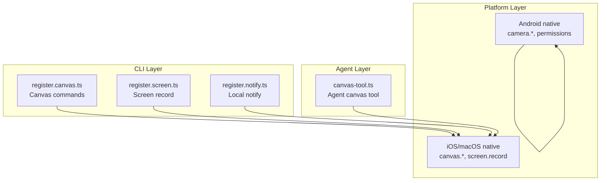
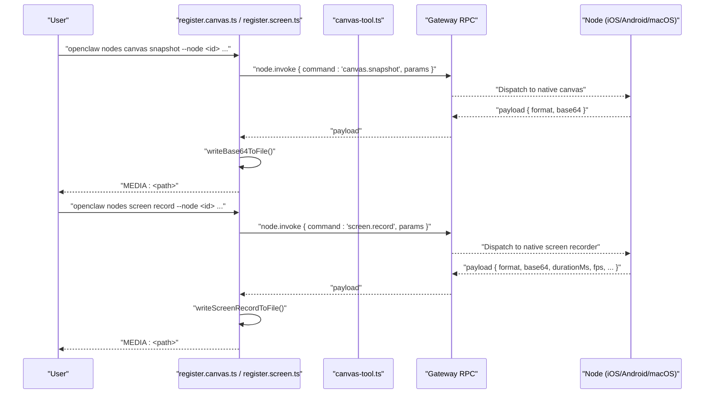
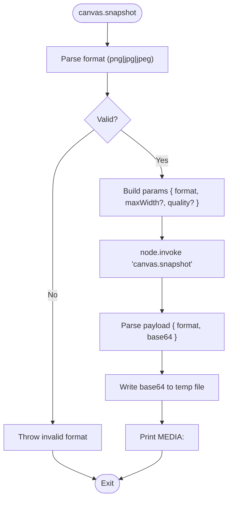
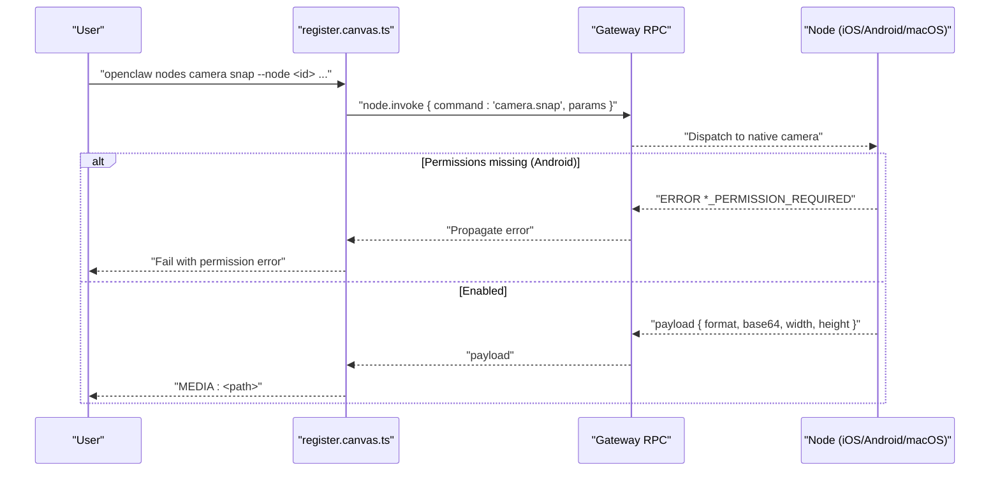
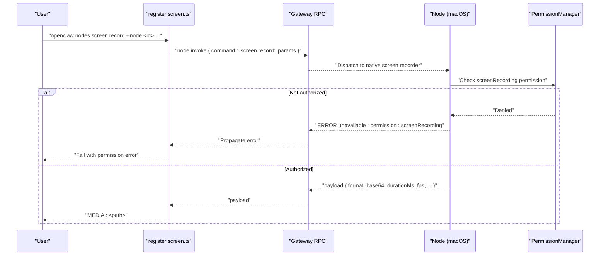
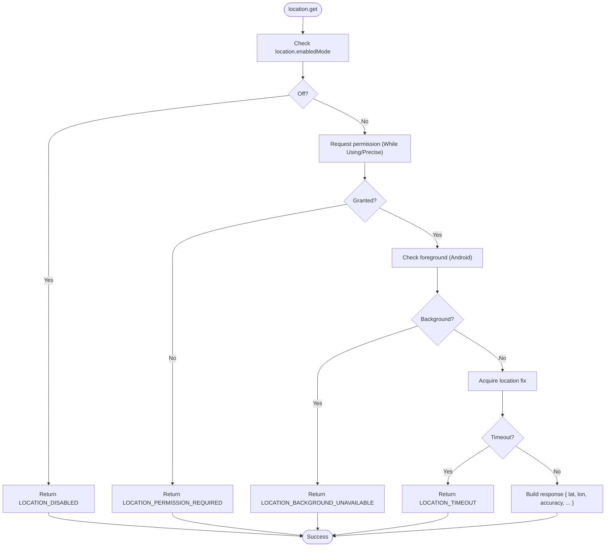
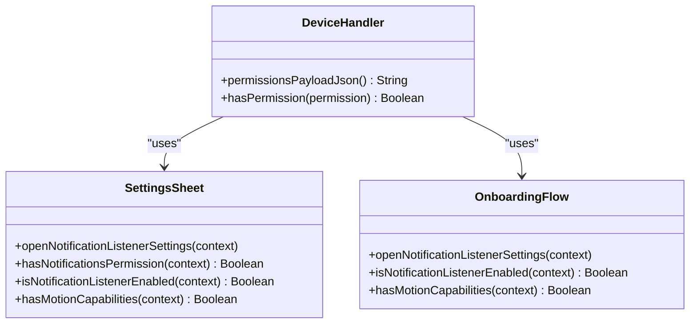
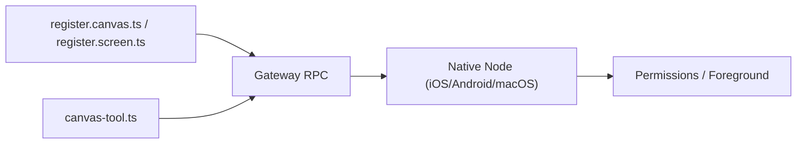

# Node Command Surface

<cite>
**Referenced Files in This Document**
- [camera.md](file://docs/nodes/camera.md)
- [location-command.md](file://docs/nodes/location-command.md)
- [register.canvas.ts](file://src/cli/nodes-cli/register.canvas.ts)
- [nodes-canvas.ts](file://src/cli/nodes-canvas.ts)
- [canvas-tool.ts](file://src/agents/tools/canvas-tool.ts)
- [register.screen.ts](file://src/cli/nodes-cli/register.screen.ts)
- [ScreenCommands.swift](file://apps/shared/OpenClawKit/Sources/OpenClawKit/ScreenCommands.swift)
- [MacNodeRuntime.swift](file://apps/macos/Sources/OpenClaw/MacNodeRuntime.swift)
- [register.notify.ts](file://src/cli/nodes-cli/register.notify.ts)
- [InvokeCommandRegistry.kt](file://apps/android/app/src/main/java/ai/openclaw/app/node/InvokeCommandRegistry.kt)
- [DeviceHandler.kt](file://apps/android/app/src/main/java/ai/openclaw/app/node/DeviceHandler.kt)
- [SettingsSheet.kt](file://apps/android/app/src/main/java/ai/openclaw/app/ui/SettingsSheet.kt)
- [OnboardingFlow.kt](file://apps/android/app/src/main/java/ai/openclaw/app/ui/OnboardingFlow.kt)
- [server-node-events.test.ts](file://src/gateway/server-node-events.test.ts)
</cite>

## Table of Contents
1. [Introduction](#introduction)
2. [Project Structure](#project-structure)
3. [Core Components](#core-components)
4. [Architecture Overview](#architecture-overview)
5. [Detailed Component Analysis](#detailed-component-analysis)
6. [Dependency Analysis](#dependency-analysis)
7. [Performance Considerations](#performance-considerations)
8. [Troubleshooting Guide](#troubleshooting-guide)
9. [Conclusion](#conclusion)

## Introduction
This document describes the node command surface across supported platforms (iOS, Android, macOS) and headless environments. It covers:
- Canvas commands: canvas.eval, canvas.snapshot, canvas.present
- Camera commands: camera.list, camera.snap, camera.clip
- Screen recording: screen.record
- Location services: location.get
- System commands: system.run, system.notify
- Android-specific commands and permissions
- Invocation patterns, parameter validation, and response handling

## Project Structure
The node command surface spans three layers:
- CLI surface: command registration and argument parsing for canvas, screen, and notify
- Agent tooling: wrappers around node.invoke for canvas and screen
- Platform integrations: iOS/macOS native command availability and Android permission gating

**Diagram sources**
- [register.canvas.ts:1-246](file://src/cli/nodes-cli/register.canvas.ts#L1-L246)
- [register.screen.ts:19-82](file://src/cli/nodes-cli/register.screen.ts#L19-L82)
- [register.notify.ts:1-57](file://src/cli/nodes-cli/register.notify.ts#L1-L57)
- [canvas-tool.ts:135-167](file://src/agents/tools/canvas-tool.ts#L135-L167)
- [InvokeCommandRegistry.kt:91-134](file://apps/android/app/src/main/java/ai/openclaw/app/node/InvokeCommandRegistry.kt#L91-L134)

**Section sources**
- [register.canvas.ts:1-246](file://src/cli/nodes-cli/register.canvas.ts#L1-L246)
- [register.screen.ts:19-82](file://src/cli/nodes-cli/register.screen.ts#L19-L82)
- [register.notify.ts:1-57](file://src/cli/nodes-cli/register.notify.ts#L1-L57)
- [canvas-tool.ts:135-167](file://src/agents/tools/canvas-tool.ts#L135-L167)
- [InvokeCommandRegistry.kt:91-134](file://apps/android/app/src/main/java/ai/openclaw/app/node/InvokeCommandRegistry.kt#L91-L134)

## Core Components
- Canvas family: present, hide, navigate, eval, snapshot, a2ui.pushJSONL, a2ui.reset
- Camera family: list, snap, clip
- Screen record: record
- Location: get
- System: notify (macOS), run (headless)
- Android-specific: device permissions, notifications, photos, contacts, calendar, motion

**Section sources**
- [camera.md:27-59](file://docs/nodes/camera.md#L27-L59)
- [register.canvas.ts:28-245](file://src/cli/nodes-cli/register.canvas.ts#L28-L245)
- [register.screen.ts:19-82](file://src/cli/nodes-cli/register.screen.ts#L19-L82)
- [location-command.md:44-81](file://docs/nodes/location-command.md#L44-L81)
- [register.notify.ts:8-57](file://src/cli/nodes-cli/register.notify.ts#L8-L57)
- [DeviceHandler.kt:130-168](file://apps/android/app/src/main/java/ai/openclaw/app/node/DeviceHandler.kt#L130-L168)

## Architecture Overview
End-to-end invocation flow for canvas.snapshot and screen.record:

**Diagram sources**
- [register.canvas.ts:42-77](file://src/cli/nodes-cli/register.canvas.ts#L42-L77)
- [nodes-canvas.ts:10-24](file://src/cli/nodes-canvas.ts#L10-L24)
- [canvas-tool.ts:162-167](file://src/agents/tools/canvas-tool.ts#L162-L167)
- [register.screen.ts:30-79](file://src/cli/nodes-cli/register.screen.ts#L30-L79)
- [ScreenCommands.swift:7-27](file://apps/shared/OpenClawKit/Sources/OpenClawKit/ScreenCommands.swift#L7-L27)

## Detailed Component Analysis

### Canvas Commands
- canvas.present: Show canvas optionally with target URL and placement rectangle.
- canvas.hide: Hide canvas.
- canvas.navigate: Navigate canvas to a given URL.
- canvas.eval: Evaluate JavaScript in the canvas; returns result payload or success.
- canvas.snapshot: Capture a snapshot with format (png|jpg|jpeg), optional maxWidth, optional quality.
- canvas.a2ui.pushJSONL: Push A2UI JSONL payload; validates version and message count.
- canvas.a2ui.reset: Reset A2UI renderer state.

Parameter validation and response handling:
- CLI validates format and throws on invalid values.
- CLI parses payload shape and writes to a temp file; prints MEDIA:<path>.
- Agent tool reads parameters, invokes node.invoke, and returns structured content.

**Diagram sources**
- [register.canvas.ts:42-77](file://src/cli/nodes-cli/register.canvas.ts#L42-L77)
- [nodes-canvas.ts:10-24](file://src/cli/nodes-canvas.ts#L10-L24)
- [canvas-tool.ts:162-167](file://src/agents/tools/canvas-tool.ts#L162-L167)

**Section sources**
- [register.canvas.ts:28-245](file://src/cli/nodes-cli/register.canvas.ts#L28-L245)
- [nodes-canvas.ts:10-24](file://src/cli/nodes-canvas.ts#L10-L24)
- [canvas-tool.ts:135-167](file://src/agents/tools/canvas-tool.ts#L135-L167)

### Camera Commands
Supported on iOS, Android, and macOS nodes via node.invoke. User-controlled settings gate access.

- camera.list: Returns device list with id, name, position, deviceType.
- camera.snap: Captures photo (jpg); supports facing, maxWidth, quality, delayMs, deviceId.
- camera.clip: Captures short video clip (mp4) with optional audio; supports facing, durationMs, includeAudio, deviceId.

Platform-specific constraints:
- iOS/Android: commands require foreground; background returns NODE_BACKGROUND_UNAVAILABLE.
- Android: runtime permissions required (CAMERA, RECORD_AUDIO for audio).
- Payload guard: photos are recompressed to keep base64 under 5 MB.
- macOS: default maxWidth and warm-up delay behavior; screen video via dedicated screen.record.

**Diagram sources**
- [camera.md:27-59](file://docs/nodes/camera.md#L27-L59)
- [camera.md:82-101](file://docs/nodes/camera.md#L82-L101)
- [camera.md:113-145](file://docs/nodes/camera.md#L113-L145)
- [InvokeCommandRegistry.kt:129-134](file://apps/android/app/src/main/java/ai/openclaw/app/node/InvokeCommandRegistry.kt#L129-L134)

**Section sources**
- [camera.md:9-163](file://docs/nodes/camera.md#L9-L163)
- [InvokeCommandRegistry.kt:91-134](file://apps/android/app/src/main/java/ai/openclaw/app/node/InvokeCommandRegistry.kt#L91-L134)

### Screen Recording
- screen.record: Records a short screen video (mp4) with configurable screen index, duration, fps, and audio inclusion.

CLI behavior:
- Validates duration, screen index, fps; builds params and invokes node.invoke.
- Parses payload and writes to file; prints MEDIA:<path>.

macOS-specific:
- Requires Screen Recording permission; otherwise returns PERMISSION_MISSING.

**Diagram sources**
- [register.screen.ts:19-82](file://src/cli/nodes-cli/register.screen.ts#L19-L82)
- [ScreenCommands.swift:7-27](file://apps/shared/OpenClawKit/Sources/OpenClawKit/ScreenCommands.swift#L7-L27)
- [MacNodeRuntime.swift:836-861](file://apps/macos/Sources/OpenClaw/MacNodeRuntime.swift#L836-L861)

**Section sources**
- [register.screen.ts:19-82](file://src/cli/nodes-cli/register.screen.ts#L19-L82)
- [ScreenCommands.swift:3-27](file://apps/shared/OpenClawKit/Sources/OpenClawKit/ScreenCommands.swift#L3-L27)
- [MacNodeRuntime.swift:836-861](file://apps/macos/Sources/OpenClaw/MacNodeRuntime.swift#L836-L861)

### Location Services
- location.get: Retrieves current location with timeout, maxAge, and desiredAccuracy.

Behavior:
- Off by default; Android uses a selector (Off/While Using) and a separate precise location toggle.
- Android denies while backgrounded; iOS/macOS may expose While Using or Always in system prompts.
- Errors include LOCATION_DISABLED, LOCATION_PERMISSION_REQUIRED, LOCATION_BACKGROUND_UNAVAILABLE, LOCATION_TIMEOUT, LOCATION_UNAVAILABLE.

**Diagram sources**
- [location-command.md:44-81](file://docs/nodes/location-command.md#L44-L81)

**Section sources**
- [location-command.md:9-99](file://docs/nodes/location-command.md#L9-L99)

### System Commands
- system.notify: Sends a local notification on macOS nodes. Supports title, body, sound, priority, delivery mode.
- system.run: Available for headless node hosts and macOS node mode; used to execute commands remotely.

CLI behavior:
- Validates title/body presence; constructs invoke params with optional timeout and idempotency key.
- Prints success or JSON output depending on flags.

**Section sources**
- [register.notify.ts:8-57](file://src/cli/nodes-cli/register.notify.ts#L8-L57)
- [server-node-events.test.ts:554-599](file://src/gateway/server-node-events.test.ts#L554-L599)

### Android-Specific Commands and Permissions
Android node exposes device status and permissions, plus specialized capabilities:
- Device permissions: camera, microphone, location, sms, notificationListener, notifications, photos, contacts, calendar, callLog, motion.
- Notifications: listener service and settings navigation.
- Photos/Contacts/Calendar: permission gating and capability checks.
- Motion tracking: accelerometer/step counter detection.

**Diagram sources**
- [DeviceHandler.kt:130-168](file://apps/android/app/src/main/java/ai/openclaw/app/node/DeviceHandler.kt#L130-L168)
- [SettingsSheet.kt:813-836](file://apps/android/app/src/main/java/ai/openclaw/app/ui/SettingsSheet.kt#L813-L836)
- [OnboardingFlow.kt:1762-1788](file://apps/android/app/src/main/java/ai/openclaw/app/ui/OnboardingFlow.kt#L1762-L1788)

**Section sources**
- [DeviceHandler.kt:130-168](file://apps/android/app/src/main/java/ai/openclaw/app/node/DeviceHandler.kt#L130-L168)
- [SettingsSheet.kt:813-836](file://apps/android/app/src/main/java/ai/openclaw/app/ui/SettingsSheet.kt#L813-L836)
- [OnboardingFlow.kt:1762-1788](file://apps/android/app/src/main/java/ai/openclaw/app/ui/OnboardingFlow.kt#L1762-L1788)

## Dependency Analysis
- CLI depends on Gateway RPC to dispatch node.invoke.
- Native command availability is enforced per platform (iOS/Android/macOS).
- Android enforces runtime permissions; macOS enforces TCC permissions for screen recording.
- Agent tooling wraps node.invoke for canvas and screen, returning structured content.

**Diagram sources**
- [register.canvas.ts:13-26](file://src/cli/nodes-cli/register.canvas.ts#L13-L26)
- [register.screen.ts:40-51](file://src/cli/nodes-cli/register.screen.ts#L40-L51)
- [canvas-tool.ts:146-153](file://src/agents/tools/canvas-tool.ts#L146-L153)
- [InvokeCommandRegistry.kt:91-134](file://apps/android/app/src/main/java/ai/openclaw/app/node/InvokeCommandRegistry.kt#L91-L134)

**Section sources**
- [register.canvas.ts:13-26](file://src/cli/nodes-cli/register.canvas.ts#L13-L26)
- [register.screen.ts:40-51](file://src/cli/nodes-cli/register.screen.ts#L40-L51)
- [canvas-tool.ts:146-153](file://src/agents/tools/canvas-tool.ts#L146-L153)
- [InvokeCommandRegistry.kt:91-134](file://apps/android/app/src/main/java/ai/openclaw/app/node/InvokeCommandRegistry.kt#L91-L134)

## Performance Considerations
- Payload size: Photos are recompressed to keep base64 under 5 MB.
- Video duration caps: Clips are limited to prevent oversized payloads.
- Warm-up delays: macOS camera snap waits for exposure stabilization before capture.
- Foreground-only operations: iOS/Android camera and A2UI require foreground to reduce background resource contention.

[No sources needed since this section provides general guidance]

## Troubleshooting Guide
- Permission errors:
  - Android camera/clip may require CAMERA and/or RECORD_AUDIO; missing permissions yield *_PERMISSION_REQUIRED.
  - macOS screen.record requires Screen Recording permission; otherwise unavailable.
- Foreground constraints:
  - iOS/Android camera and A2UI commands fail when backgrounded with NODE_BACKGROUND_UNAVAILABLE.
- Notification delivery:
  - macOS notify command requires valid title or body; otherwise missing arguments error.
- Deduplicated events:
  - Gateway handles notifications.changed deduplication to avoid excessive heartbeats.

**Section sources**
- [camera.md:90-101](file://docs/nodes/camera.md#L90-L101)
- [MacNodeRuntime.swift:836-861](file://apps/macos/Sources/OpenClaw/MacNodeRuntime.swift#L836-L861)
- [register.notify.ts:23-27](file://src/cli/nodes-cli/register.notify.ts#L23-L27)
- [server-node-events.test.ts:554-599](file://src/gateway/server-node-events.test.ts#L554-L599)

## Conclusion
The node command surface provides a unified interface across platforms for canvas rendering, camera capture, screen recording, location retrieval, and system notifications. Parameter validation and response handling are centralized in the CLI and agent tooling, while platform-specific constraints (permissions, foreground requirements, and TCC) are enforced by native implementations. Android’s permission model and iOS/macOS foreground policies shape invocation reliability and user experience.