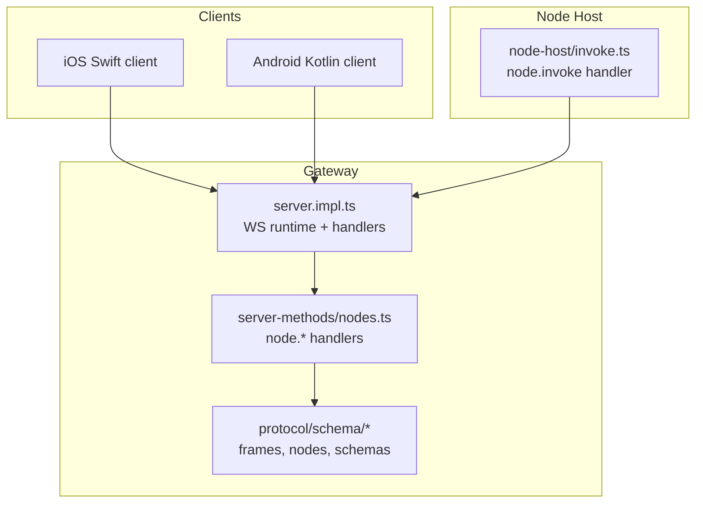
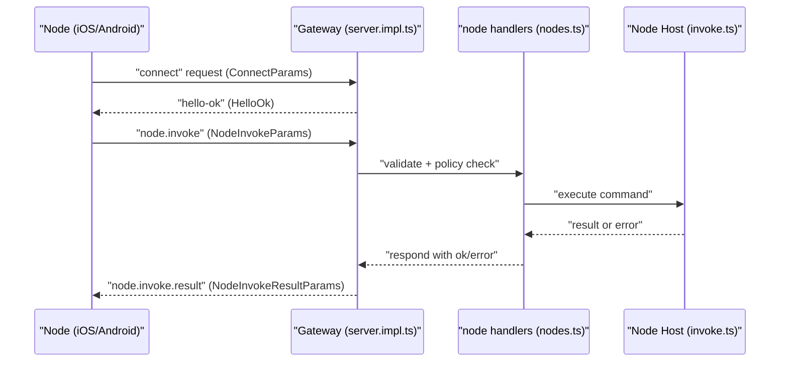
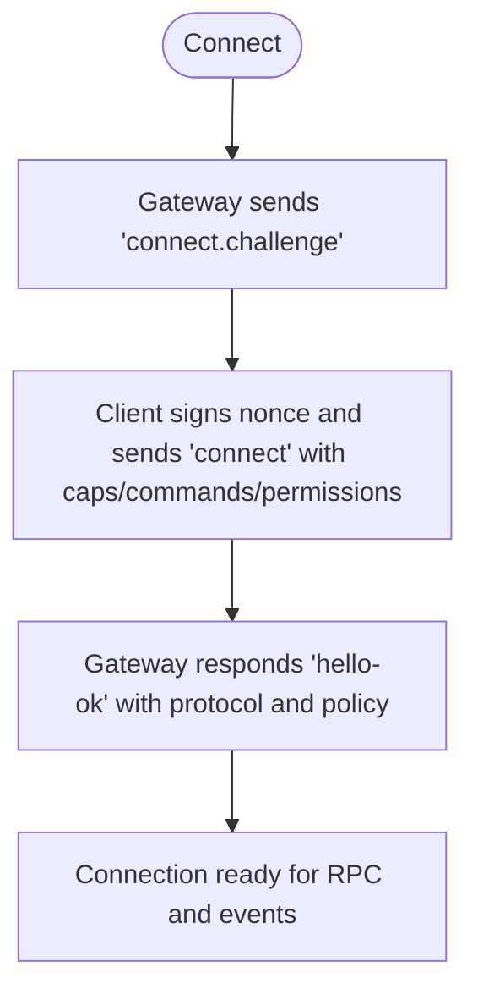
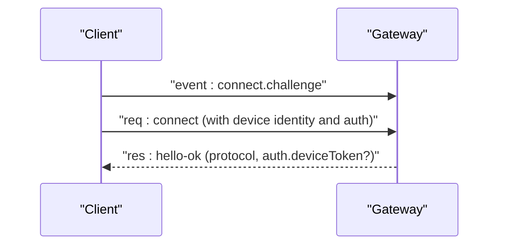
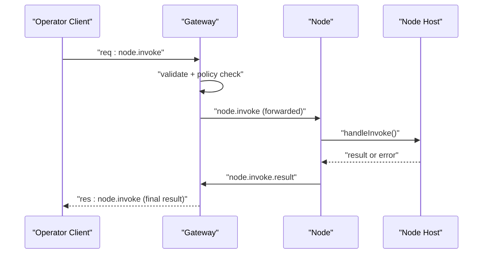
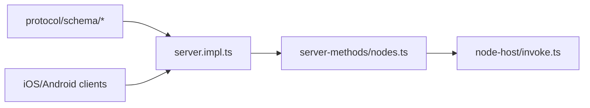

# Node Communication Protocols

<cite>
**Referenced Files in This Document**
- [protocol.md](file://docs/gateway/protocol.md)
- [protocol-schemas.ts](file://src/gateway/protocol/schema/protocol-schemas.ts)
- [frames.ts](file://src/gateway/protocol/schema/frames.ts)
- [nodes.ts](file://src/gateway/protocol/schema/nodes.ts)
- [server.impl.ts](file://src/gateway/server.impl.ts)
- [nodes.ts](file://src/gateway/server-methods/nodes.ts)
- [nodes.helpers.ts](file://src/gateway/server-methods/nodes.helpers.ts)
- [node-invoke-sanitize.ts](file://src/gateway/node-invoke-sanitize.ts)
- [node-command-policy.ts](file://src/gateway/node-command-policy.ts)
- [invoke.ts](file://src/node-host/invoke.ts)
- [GatewayConnectionController.swift](file://apps/ios/Sources/Gateway/GatewayConnectionController.swift)
- [GatewayProtocol.kt](file://apps/android/app/src/main/java/ai/openclaw/app/gateway/GatewayProtocol.kt)
- [test-helpers.server.ts](file://src/gateway/test-helpers.server.ts)
- [android-node.capabilities.live.test.ts](file://src/gateway/android-node.capabilities.live.test.ts)
- [gateway-e2e-harness.ts](file://test/helpers/gateway-e2e-harness.ts)
</cite>

## Table of Contents
1. [Introduction](#introduction)
2. [Project Structure](#project-structure)
3. [Core Components](#core-components)
4. [Architecture Overview](#architecture-overview)
5. [Detailed Component Analysis](#detailed-component-analysis)
6. [Dependency Analysis](#dependency-analysis)
7. [Performance Considerations](#performance-considerations)
8. [Troubleshooting Guide](#troubleshooting-guide)
9. [Conclusion](#conclusion)

## Introduction
This document explains the node communication protocols and messaging systems used by OpenClaw. It focuses on WebSocket-based communication between nodes and gateways, including connection establishment, protocol negotiation, and the node.invoke RPC mechanism for command execution and response handling. It also documents message formats, payload structures, error handling, protocol versions and backward compatibility, migration strategies, and the relationship between node communication and agent tool execution. Practical examples illustrate low-level node invocation, parameter passing, and response processing, along with performance considerations, connection pooling, and reconnection strategies.

## Project Structure
The node communication stack spans three primary areas:
- Gateway protocol definition and framing
- Gateway server runtime and node method handlers
- Node host implementation for command execution and result reporting

**Diagram sources**
- [server.impl.ts:600-650](file://src/gateway/server.impl.ts#L600-L650)
- [nodes.ts:493-725](file://src/gateway/server-methods/nodes.ts#L493-L725)
- [protocol-schemas.ts:162-302](file://src/gateway/protocol/schema/protocol-schemas.ts#L162-L302)
- [invoke.ts:417-556](file://src/node-host/invoke.ts#L417-L556)

**Section sources**
- [protocol.md:10-268](file://docs/gateway/protocol.md#L10-L268)
- [protocol-schemas.ts:162-302](file://src/gateway/protocol/schema/protocol-schemas.ts#L162-L302)
- [server.impl.ts:600-650](file://src/gateway/server.impl.ts#L600-L650)

## Core Components
- WebSocket transport and framing: The gateway uses WebSocket with text frames and a unified frame type discriminated by a type field. Frames include requests, responses, and events.
- Protocol versioning: The gateway defines a protocol version constant and negotiates min/max protocol versions during connect.
- Connect handshake: The gateway sends a pre-connect challenge; clients must sign the nonce and include device identity and capabilities.
- Node RPC: The node.invoke method carries command execution requests and results, with idempotency and timeouts.
- Node command policy: The gateway enforces allowlists/denylists and command declarations for safety.
- Node host execution: The node host validates and executes commands, emits events, and reports results back to the gateway.

**Section sources**
- [protocol.md:17-134](file://docs/gateway/protocol.md#L17-L134)
- [protocol-schemas.ts:301-302](file://src/gateway/protocol/schema/protocol-schemas.ts#L301-L302)
- [frames.ts:126-165](file://src/gateway/protocol/schema/frames.ts#L126-L165)
- [nodes.ts:66-95](file://src/gateway/protocol/schema/nodes.ts#L66-L95)
- [node-command-policy.ts:176-215](file://src/gateway/node-command-policy.ts#L176-L215)
- [invoke.ts:417-556](file://src/node-host/invoke.ts#L417-L556)

## Architecture Overview
The gateway acts as the central control plane and node transport. All clients (operators and nodes) connect via WebSocket and exchange typed frames. Nodes declare capabilities and commands at connect time; operators can invoke node commands through node.invoke. The gateway enforces policy, forwards sanitized requests, and tracks node presence and status.

**Diagram sources**
- [protocol.md:22-78](file://docs/gateway/protocol.md#L22-L78)
- [frames.ts:126-165](file://src/gateway/protocol/schema/frames.ts#L126-L165)
- [nodes.ts:66-95](file://src/gateway/protocol/schema/nodes.ts#L66-L95)
- [nodes.ts:493-725](file://src/gateway/server-methods/nodes.ts#L493-L725)
- [invoke.ts:417-556](file://src/node-host/invoke.ts#L417-L556)

## Detailed Component Analysis

### WebSocket Transport and Framing
- Transport: WebSocket text frames with JSON payloads; the first frame must be a connect request.
- Framing: Three frame types:
  - Request: { type: "req", id, method, params }
  - Response: { type: "res", id, ok, payload|error }
  - Event: { type: "event", event, payload, seq?, stateVersion? }
- Protocol version: Negotiated via minProtocol/maxProtocol in connect params; the gateway returns hello-ok with negotiated protocol.

**Diagram sources**
- [protocol.md:22-78](file://docs/gateway/protocol.md#L22-L78)
- [frames.ts:126-165](file://src/gateway/protocol/schema/frames.ts#L126-L165)

**Section sources**
- [protocol.md:17-134](file://docs/gateway/protocol.md#L17-L134)
- [protocol-schemas.ts:301-302](file://src/gateway/protocol/schema/protocol-schemas.ts#L301-L302)

### Protocol Negotiation and Authentication
- Device identity: Every connect must include device identity with id, publicKey, signature, signedAt, and nonce.
- Token handling: If configured, connect.params.auth.token must match; after pairing, the gateway may issue a deviceToken in hello-ok.auth.
- Migration guidance: Clients must wait for connect.challenge, sign the v2/v3 payload, and include the nonce in connect.params.device.nonce.

**Diagram sources**
- [protocol.md:200-262](file://docs/gateway/protocol.md#L200-L262)

**Section sources**
- [protocol.md:200-262](file://docs/gateway/protocol.md#L200-L262)

### Node RPC: node.invoke
- Purpose: Operator-initiated command execution on a node.
- Request: node.invoke with fields including nodeId, command, params, timeoutMs, idempotencyKey.
- Result: node.invoke.result with ok, payload or error.code/message; payload may be JSON-encoded.
- Sanitization: For system.run, parameters are sanitized before forwarding; other commands pass through rawParams.
- Policy enforcement: Commands must be allowlisted and declared by the node; otherwise rejected.

**Diagram sources**
- [nodes.ts:66-95](file://src/gateway/protocol/schema/nodes.ts#L66-L95)
- [node-invoke-sanitize.ts:5-23](file://src/gateway/node-invoke-sanitize.ts#L5-L23)
- [node-command-policy.ts:194-215](file://src/gateway/node-command-policy.ts#L194-L215)
- [invoke.ts:417-556](file://src/node-host/invoke.ts#L417-L556)

**Section sources**
- [nodes.ts:66-95](file://src/gateway/protocol/schema/nodes.ts#L66-L95)
- [node-invoke-sanitize.ts:5-23](file://src/gateway/node-invoke-sanitize.ts#L5-L23)
- [node-command-policy.ts:194-215](file://src/gateway/node-command-policy.ts#L194-L215)
- [invoke.ts:417-556](file://src/node-host/invoke.ts#L417-L556)

### Message Formats and Payload Structures
- ConnectParams: min/max protocol, client identity, role/scopes, caps/commands/permissions, device identity, auth, locale, userAgent.
- HelloOk: protocol, server info, features, snapshot, optional canvasHostUrl, optional auth.deviceToken, policy limits.
- RequestFrame: type=req, id, method, params.
- ResponseFrame: type=res, id, ok, payload or error.
- EventFrame: type=event, event, payload, optional seq/stateVersion.
- NodeInvokeParams: nodeId, command, params, timeoutMs, idempotencyKey.
- NodeInvokeResultParams: id, nodeId, ok, payload or payloadJSON, optional error { code, message }.
- NodeEventParams: event, payload or payloadJSON.

**Section sources**
- [frames.ts:20-165](file://src/gateway/protocol/schema/frames.ts#L20-L165)
- [nodes.ts:66-167](file://src/gateway/protocol/schema/nodes.ts#L66-L167)

### Error Handling in Node Communications
- ErrorShape: code, message, optional details, retryable, retryAfterMs.
- Node invoke errors: The gateway maps node-side errors to UNAVAILABLE with details containing nodeError.
- Validation errors: INVALID_REQUEST with precise messages for malformed params.
- Auth failures: error.details.code and recommendedNextStep to guide retries or remediation.

**Section sources**
- [frames.ts:115-124](file://src/gateway/protocol/schema/frames.ts#L115-L124)
- [nodes.helpers.ts:55-80](file://src/gateway/server-methods/nodes.helpers.ts#L55-L80)
- [protocol.md:200-215](file://docs/gateway/protocol.md#L200-L215)

### Protocol Versions, Backward Compatibility, and Migration
- Protocol version: PROTOCOL_VERSION is defined centrally and used across schema generation and client/server negotiation.
- Migration: Clients must adopt v2/v3 device auth signing and include the nonce in connect.params.device.nonce; legacy signatures are accepted for compatibility but metadata pinning governs policy on reconnect.
- Diagnostics: The gateway returns detailed error.details.code and reason for migration failures to aid troubleshooting.

**Section sources**
- [protocol-schemas.ts:301-302](file://src/gateway/protocol/schema/protocol-schemas.ts#L301-L302)
- [protocol.md:231-256](file://docs/gateway/protocol.md#L231-L256)

### Relationship Between Node Communication and Agent Tool Execution
- Operators use node.invoke to trigger node capabilities (camera, screen, canvas, system.run).
- The gateway enforces policy and forwards sanitized requests to the node host.
- The node host executes commands, emits events (e.g., exec.finished), and returns results via node.invoke.result.
- The gateway maintains node presence and status, enabling operators to discover connected nodes and paired devices.

**Section sources**
- [protocol.md:135-184](file://docs/gateway/protocol.md#L135-L184)
- [nodes.ts:645-725](file://src/gateway/server-methods/nodes.ts#L645-L725)
- [invoke.ts:338-361](file://src/node-host/invoke.ts#L338-L361)

### Practical Examples

#### Low-level node invocation
- Example flow: An operator client constructs a node.invoke request with a command and parameters, sends it over the WebSocket, and awaits node.invoke.result.
- Example verification: The gateway’s test helpers demonstrate constructing and sending RPC requests and awaiting responses.

**Section sources**
- [test-helpers.server.ts:706-732](file://src/gateway/test-helpers.server.ts#L706-L732)
- [gateway-e2e-harness.ts:313-362](file://test/helpers/gateway-e2e-harness.ts#L313-L362)

#### Command parameter passing and response processing
- Node host decodes paramsJSON, validates inputs, executes the command, and sends either a JSON payload or an error with code/message.
- Android live tests exercise node.invoke, capturing outcomes and error codes.

**Section sources**
- [invoke.ts:558-563](file://src/node-host/invoke.ts#L558-L563)
- [android-node.capabilities.live.test.ts:360-409](file://src/gateway/android-node.capabilities.live.test.ts#L360-L409)

#### Client-side connection examples
- iOS Swift client composes connect options including role, scopes, caps, commands, permissions, and clientId.
- Android client defines the protocol version constant used for negotiation.

**Section sources**
- [GatewayConnectionController.swift:744-758](file://apps/ios/Sources/Gateway/GatewayConnectionController.swift#L744-L758)
- [GatewayProtocol.kt:1-3](file://apps/android/app/src/main/java/ai/openclaw/app/gateway/GatewayProtocol.kt#L1-L3)

## Dependency Analysis
The node communication pipeline depends on:
- Protocol schemas for typed frames and parameters
- Gateway server runtime for WS handling and method dispatch
- Node handlers for policy enforcement and forwarding
- Node host for command execution and result reporting

**Diagram sources**
- [protocol-schemas.ts:162-302](file://src/gateway/protocol/schema/protocol-schemas.ts#L162-L302)
- [server.impl.ts:600-650](file://src/gateway/server.impl.ts#L600-L650)
- [nodes.ts:493-725](file://src/gateway/server-methods/nodes.ts#L493-L725)
- [invoke.ts:417-556](file://src/node-host/invoke.ts#L417-L556)

**Section sources**
- [protocol-schemas.ts:162-302](file://src/gateway/protocol/schema/protocol-schemas.ts#L162-L302)
- [server.impl.ts:600-650](file://src/gateway/server.impl.ts#L600-L650)
- [nodes.ts:493-725](file://src/gateway/server-methods/nodes.ts#L493-L725)
- [invoke.ts:417-556](file://src/node-host/invoke.ts#L417-L556)

## Performance Considerations
- Output limits: Node host truncates command output to protect bandwidth and storage.
- Windows console encoding: Node host detects and decodes console output appropriately to avoid corruption.
- Idempotency: node.invoke uses idempotencyKey to prevent duplicate execution.
- Policy batching: Skills changes are debounced to avoid rapid-fire node probes.
- Throttling and wake nudges: Gateway implements throttling and APNs-based wake nudges to reduce unnecessary traffic and improve responsiveness.

**Section sources**
- [invoke.ts:32-44](file://src/node-host/invoke.ts#L32-L44)
- [invoke.ts:106-142](file://src/node-host/invoke.ts#L106-L142)
- [nodes.ts:54-86](file://src/gateway/server-methods/nodes.ts#L54-L86)
- [server.impl.ts:684-702](file://src/gateway/server.impl.ts#L684-L702)

## Troubleshooting Guide
- Connection failures: Verify device auth (nonce/signature), token matching, and TLS pinning if configured.
- Protocol mismatch: Ensure min/maxProtocol align with PROTOCOL_VERSION.
- Command not allowed: Confirm the command is in the node’s declared commands and allowed by gateway configuration.
- Node unavailable: Use node.list to check paired and connected nodes; rely on wake nudges and throttling behavior.
- Auth migration: Follow the migration guidance for device auth signing and nonce inclusion.

**Section sources**
- [protocol.md:200-262](file://docs/gateway/protocol.md#L200-L262)
- [protocol-schemas.ts:301-302](file://src/gateway/protocol/schema/protocol-schemas.ts#L301-L302)
- [node-command-policy.ts:194-215](file://src/gateway/node-command-policy.ts#L194-L215)
- [nodes.ts:645-725](file://src/gateway/server-methods/nodes.ts#L645-L725)

## Conclusion
OpenClaw’s node communication relies on a robust WebSocket-based protocol with strong framing, explicit versioning, and comprehensive policy enforcement. The node.invoke RPC enables secure, idempotent command execution from operators to nodes, with clear error handling and diagnostics. Clients across platforms adhere to the same protocol, ensuring consistent behavior and interoperability. By following the guidelines here, developers can implement reliable node communication, manage upgrades safely, and optimize performance for production deployments.