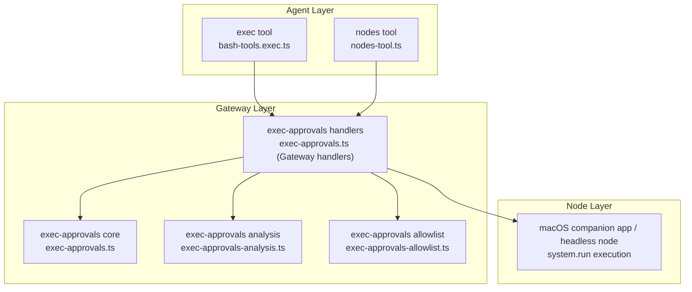
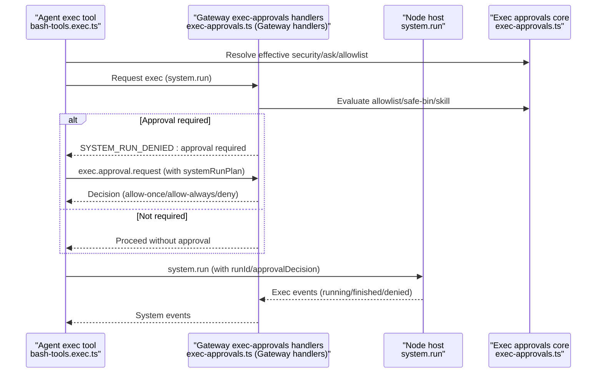
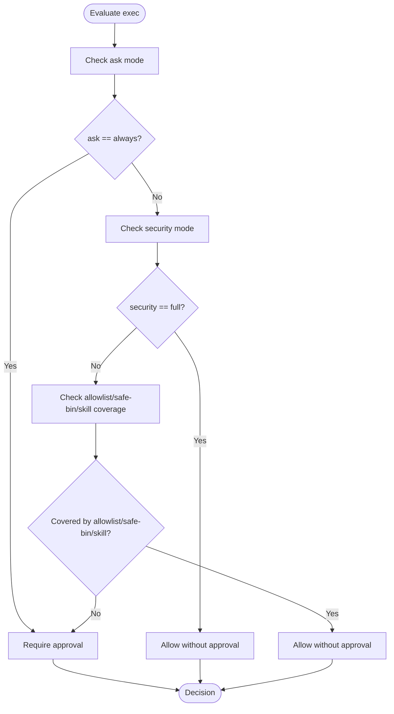
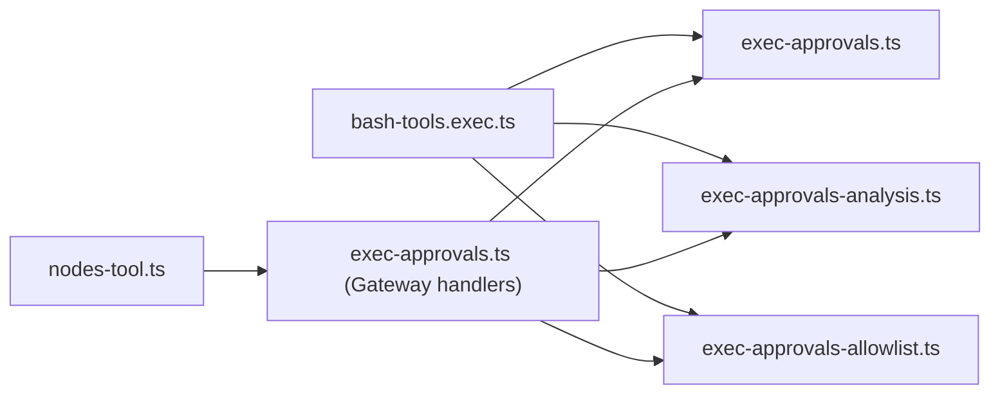

# Node Execution and Security

<cite>
**Referenced Files in This Document**
- [exec-approvals.ts](file://src/infra/exec-approvals.ts)
- [exec-approvals-analysis.ts](file://src/infra/exec-approvals-analysis.ts)
- [exec-approvals-allowlist.ts](file://src/infra/exec-approvals-allowlist.ts)
- [exec-approvals.ts (Gateway handlers)](file://src/gateway/server-methods/exec-approvals.ts)
- [nodes-tool.ts](file://src/agents/tools/nodes-tool.ts)
- [bash-tools.exec.ts](file://src/agents/bash-tools.exec.ts)
- [exec-approvals.md](file://docs/tools/exec-approvals.md)
- [index.md (Nodes overview)](file://docs/nodes/index.md)
- [ios.md](file://docs/platforms/ios.md)
- [android.md](file://docs/platforms/android.md)
- [SECURITY.md](file://SECURITY.md)
</cite>

## Table of Contents
1. [Introduction](#introduction)
2. [Project Structure](#project-structure)
3. [Core Components](#core-components)
4. [Architecture Overview](#architecture-overview)
5. [Detailed Component Analysis](#detailed-component-analysis)
6. [Dependency Analysis](#dependency-analysis)
7. [Performance Considerations](#performance-considerations)
8. [Troubleshooting Guide](#troubleshooting-guide)
9. [Conclusion](#conclusion)
10. [Appendices](#appendices)

## Introduction
This document explains node execution security across the system, focusing on execution policies, approval workflows, and security boundaries. It covers:
- Exec approval modes (ask/allowlist/full) and their security implications
- Relationship between gateway enforcement and node host enforcement for system.run commands
- Security policies for system commands, file operations, and network access
- Practical configuration examples, enforcement behavior, and bypass scenarios
- Platform-specific considerations for macOS, iOS, Android, and headless environments
- Integration between node security and agent tool execution policies
- Security best practices, threat mitigations, and incident response guidance

## Project Structure
The security model spans three layers:
- Agent tool layer: exec tool and nodes tool orchestrate commands and approvals
- Gateway enforcement: approval gating, policy merging, and forwarding to node hosts
- Node host enforcement: local approvals and execution on macOS companion app or headless node

**Diagram sources**
- [exec-approvals.ts:1-590](file://src/infra/exec-approvals.ts#L1-L590)
- [exec-approvals-analysis.ts:1-800](file://src/infra/exec-approvals-analysis.ts#L1-L800)
- [exec-approvals-allowlist.ts:1-610](file://src/infra/exec-approvals-allowlist.ts#L1-L610)
- [exec-approvals.ts (Gateway handlers):1-194](file://src/gateway/server-methods/exec-approvals.ts#L1-L194)
- [nodes-tool.ts:608-747](file://src/agents/tools/nodes-tool.ts#L608-L747)
- [bash-tools.exec.ts:151-599](file://src/agents/bash-tools.exec.ts#L151-L599)

**Section sources**
- [exec-approvals.ts:1-590](file://src/infra/exec-approvals.ts#L1-L590)
- [exec-approvals-analysis.ts:1-800](file://src/infra/exec-approvals-analysis.ts#L1-L800)
- [exec-approvals-allowlist.ts:1-610](file://src/infra/exec-approvals-allowlist.ts#L1-L610)
- [exec-approvals.ts (Gateway handlers):1-194](file://src/gateway/server-methods/exec-approvals.ts#L1-L194)
- [nodes-tool.ts:608-747](file://src/agents/tools/nodes-tool.ts#L608-L747)
- [bash-tools.exec.ts:151-599](file://src/agents/bash-tools.exec.ts#L151-L599)

## Core Components
- Exec approvals policy engine: resolves effective security, ask, and allowlist; determines whether approvals are required and how to persist allowlist patterns
- Exec approvals handlers: expose get/set APIs for approvals on gateway and nodes
- Exec analysis and allowlist evaluator: parses commands, splits chains, identifies safe bins, and evaluates allowlist/skill auto-allow
- Exec tool: orchestrates host selection, security merging, and approval gating
- Nodes tool: prepares system.run plans and coordinates approval requests for node execution

Key behaviors:
- Effective policy is the stricter of tool-level exec policy and approvals defaults
- Approvals can be required per command depending on ask mode, security mode, and allowlist/safe-bin/skill coverage
- For system.run on nodes, the gateway forwards a canonical systemRunPlan to the node host

**Section sources**
- [exec-approvals.ts:484-557](file://src/infra/exec-approvals.ts#L484-L557)
- [exec-approvals.ts (Gateway handlers):98-194](file://src/gateway/server-methods/exec-approvals.ts#L98-L194)
- [exec-approvals-analysis.ts:756-797](file://src/infra/exec-approvals-analysis.ts#L756-L797)
- [exec-approvals-allowlist.ts:281-310](file://src/infra/exec-approvals-allowlist.ts#L281-L310)
- [bash-tools.exec.ts:321-334](file://src/agents/bash-tools.exec.ts#L321-L334)
- [nodes-tool.ts:608-747](file://src/agents/tools/nodes-tool.ts#L608-L747)

## Architecture Overview
The exec approval workflow integrates agent tools, gateway enforcement, and node execution:

**Diagram sources**
- [bash-tools.exec.ts:427-457](file://src/agents/bash-tools.exec.ts#L427-L457)
- [exec-approvals.ts (Gateway handlers):98-194](file://src/gateway/server-methods/exec-approvals.ts#L98-L194)
- [nodes-tool.ts:696-746](file://src/agents/tools/nodes-tool.ts#L696-L746)
- [exec-approvals.ts:484-557](file://src/infra/exec-approvals.ts#L484-L557)

## Detailed Component Analysis

### Exec Approval Modes and Security Implications
- Security modes:
  - deny: blocks all host exec requests
  - allowlist: allows only allowlisted commands
  - full: allows everything (equivalent to elevated)
- Ask modes:
  - off: never prompt
  - on-miss: prompt only when allowlist does not match
  - always: prompt on every command
- Ask fallback: when UI is unreachable, fallback decides whether to deny, allow with allowlist, or allow full

Implications:
- allowlist mode reduces blast radius by constraining which executables and arguments can run
- ask always maximizes operator awareness but can slow automation
- ask on-miss balances safety and usability
- ask fallback prevents deadlocks when no operator UI is available

**Section sources**
- [exec-approvals.md:88-109](file://docs/tools/exec-approvals.md#L88-L109)
- [exec-approvals.ts:484-557](file://src/infra/exec-approvals.ts#L484-L557)

### Approval Workflow: Ask, Allowlist, Full
The decision logic combines ask, security, allowlist coverage, and safe-bin/skill auto-allow:

**Diagram sources**
- [exec-approvals.ts:484-496](file://src/infra/exec-approvals.ts#L484-L496)
- [exec-approvals-allowlist.ts:281-310](file://src/infra/exec-approvals-allowlist.ts#L281-L310)

**Section sources**
- [exec-approvals.ts:484-496](file://src/infra/exec-approvals.ts#L484-L496)
- [exec-approvals-allowlist.ts:281-310](file://src/infra/exec-approvals-allowlist.ts#L281-L310)

### Gateway Enforcement vs Node Host Enforcement for system.run
- Gateway receives exec.approval.request with a systemRunPlan and decides whether to require approval
- If required, the gateway waits for a decision; if not required, it proceeds
- For host=node, the gateway forwards system.run with the canonical argv/cwd/env/session context
- Node host enforces approvals and executes the command in its environment

Practical outcomes:
- Canonical execution context ensures reproducibility and auditability
- Node host can persist allowlist patterns derived from the execution plan

**Section sources**
- [nodes-tool.ts:696-746](file://src/agents/tools/nodes-tool.ts#L696-L746)
- [exec-approvals.ts (Gateway handlers):98-194](file://src/gateway/server-methods/exec-approvals.ts#L98-L194)

### Security Policies by Command Category
- System commands:
  - Enforced by exec approvals; safe bins and skill auto-allow reduce friction for low-risk tools
  - Shell chaining and redirections are restricted in allowlist mode
- File operations:
  - Approval-backed interpreter/runtime runs bind to one concrete local file when possible
  - If ambiguity exists, execution is denied to avoid semantic drift
- Network access:
  - Exec approvals do not gate network egress; however, network policies are enforced by transport (TLS, mTLS, and gateway ACLs)
  - Node connectivity relies on gateway discovery and pairing

**Section sources**
- [exec-approvals.md:268-283](file://docs/tools/exec-approvals.md#L268-L283)
- [exec-approvals-analysis.ts:756-797](file://src/infra/exec-approvals-analysis.ts#L756-L797)

### Practical Examples

- Configure exec approvals defaults and ask fallback:
  - Set security to allowlist and ask to on-miss for balanced safety and usability
  - Set askFallback to deny to avoid accidental execution when UI is unreachable
  - Reference: [exec-approvals.md:53-86](file://docs/tools/exec-approvals.md#L53-L86), [exec-approvals.md:102-109](file://docs/tools/exec-approvals.md#L102-L109)

- Allowlist patterns:
  - Use glob patterns to match resolved executable paths
  - Examples: ~/Projects/**/bin/peekaboo, ~/.local/bin/*, /opt/homebrew/bin/rg
  - Reference: [exec-approvals.md:117-121](file://docs/tools/exec-approvals.md#L117-L121)

- Safe bins:
  - Narrow stdin-only filters (jq, head, tail, wc) can run without explicit allowlist entries
  - Define safeBinProfiles for custom binaries and trusted directories
  - Reference: [exec-approvals.md:142-182](file://docs/tools/exec-approvals.md#L142-L182)

- Elevated mode bypass:
  - When elevated mode is full, approvals are bypassed and security becomes full
  - Reference: [bash-tools.exec.ts:324-334](file://src/agents/bash-tools.exec.ts#L324-L334)

- Node execution via system.run:
  - The nodes tool prepares a plan and retries with approval flags if denied
  - Approval decisions are correlated via runId
  - Reference: [nodes-tool.ts:696-746](file://src/agents/tools/nodes-tool.ts#L696-L746)

**Section sources**
- [exec-approvals.md:53-121](file://docs/tools/exec-approvals.md#L53-L121)
- [exec-approvals.md:142-182](file://docs/tools/exec-approvals.md#L142-L182)
- [bash-tools.exec.ts:324-334](file://src/agents/bash-tools.exec.ts#L324-L334)
- [nodes-tool.ts:696-746](file://src/agents/tools/nodes-tool.ts#L696-L746)

### Platform-Specific Security Considerations
- macOS companion app:
  - Node host service forwards system.run to the macOS app over local IPC with tokenized UDS
  - Security: Unix socket mode 0600, token stored in exec-approvals.json; same-UID peer check; challenge/response with HMAC and TTL
  - Reference: [exec-approvals.md:360-375](file://docs/tools/exec-approvals.md#L360-L375)

- iOS node:
  - Connects via WebSocket to the gateway; pairing and trust enforced by gateway
  - Canvas and media commands require foreground activity
  - Reference: [ios.md:1-217](file://docs/platforms/ios.md#L1-L217)

- Android node:
  - Connects via mDNS/NSD or manual host/port; foreground service maintains persistent connection
  - Canvas and camera commands require foreground; permissions gated
  - Reference: [android.md:1-168](file://docs/platforms/android.md#L1-L168)

- Headless environments:
  - Exec approvals file is stored locally on the node host
  - Approvals socket path and token are managed centrally; ensure secure permissions on approvals file

**Section sources**
- [exec-approvals.md:360-375](file://docs/tools/exec-approvals.md#L360-L375)
- [ios.md:1-217](file://docs/platforms/ios.md#L1-L217)
- [android.md:1-168](file://docs/platforms/android.md#L1-L168)

### Integration Between Node Security and Agent Tool Execution Policies
- Effective exec policy is the stricter of tools.exec.* and exec-approvals defaults
- When ask is unset, local exec defaults align with exec-approvals.json
- Elevated mode can bypass approvals when set to full
- Safe bins and skill auto-allow reduce the need for explicit allowlist entries for low-risk tools

**Section sources**
- [exec-approvals.md:10-17](file://docs/tools/exec-approvals.md#L10-L17)
- [bash-tools.exec.ts:321-334](file://src/agents/bash-tools.exec.ts#L321-L334)
- [exec-approvals-allowlist.ts:281-310](file://src/infra/exec-approvals-allowlist.ts#L281-L310)

## Dependency Analysis

**Diagram sources**
- [bash-tools.exec.ts:1-599](file://src/agents/bash-tools.exec.ts#L1-L599)
- [exec-approvals.ts:1-590](file://src/infra/exec-approvals.ts#L1-L590)
- [exec-approvals-analysis.ts:1-800](file://src/infra/exec-approvals-analysis.ts#L1-L800)
- [exec-approvals-allowlist.ts:1-610](file://src/infra/exec-approvals-allowlist.ts#L1-L610)
- [exec-approvals.ts (Gateway handlers):1-194](file://src/gateway/server-methods/exec-approvals.ts#L1-L194)
- [nodes-tool.ts:1-815](file://src/agents/tools/nodes-tool.ts#L1-L815)

**Section sources**
- [bash-tools.exec.ts:1-599](file://src/agents/bash-tools.exec.ts#L1-L599)
- [exec-approvals.ts:1-590](file://src/infra/exec-approvals.ts#L1-L590)
- [exec-approvals-analysis.ts:1-800](file://src/infra/exec-approvals-analysis.ts#L1-L800)
- [exec-approvals-allowlist.ts:1-610](file://src/infra/exec-approvals-allowlist.ts#L1-L610)
- [exec-approvals.ts (Gateway handlers):1-194](file://src/gateway/server-methods/exec-approvals.ts#L1-L194)
- [nodes-tool.ts:1-815](file://src/agents/tools/nodes-tool.ts#L1-L815)

## Performance Considerations
- Approval timeouts: default 120 seconds; adjust based on expected approval latency
- Background execution: yielding after a configurable window avoids blocking long-running commands
- Safe bins and allowlist evaluation: conservative parsing avoids expensive filesystem checks and oracle behavior
- Event surfacing: exec lifecycle events are posted to agent sessions after completion or when exceeding a running notice threshold

[No sources needed since this section provides general guidance]

## Troubleshooting Guide
Common issues and resolutions:
- Approval required errors:
  - Confirm ask mode and security settings; review allowlist coverage and safe-bin/skill auto-allow
  - For system.run, ensure the node supports system.run and the gateway forwards the systemRunPlan
  - Reference: [nodes-tool.ts:696-746](file://src/agents/tools/nodes-tool.ts#L696-L746)

- Exec denied due to ask fallback:
  - Configure askFallback to allow or deny based on environment constraints
  - Reference: [exec-approvals.md:102-109](file://docs/tools/exec-approvals.md#L102-L109)

- Elevated mode bypass:
  - Elevated mode full bypasses approvals; verify configuration and intent
  - Reference: [bash-tools.exec.ts:324-334](file://src/agents/bash-tools.exec.ts#L324-L334)

- Platform-specific connectivity:
  - iOS/Android pairing and discovery issues; verify gateway identity and relay configuration
  - Reference: [ios.md:100-159](file://docs/platforms/ios.md#L100-L159), [android.md:26-98](file://docs/platforms/android.md#L26-L98)

- Out-of-scope scenarios and assumptions:
  - Certain reports are out of scope (for example, sandbox/workspace read expansion via symlinks)
  - Reference: [SECURITY.md:116-135](file://SECURITY.md#L116-L135)

**Section sources**
- [nodes-tool.ts:696-746](file://src/agents/tools/nodes-tool.ts#L696-L746)
- [exec-approvals.md:102-109](file://docs/tools/exec-approvals.md#L102-L109)
- [bash-tools.exec.ts:324-334](file://src/agents/bash-tools.exec.ts#L324-L334)
- [ios.md:100-159](file://docs/platforms/ios.md#L100-L159)
- [android.md:26-98](file://docs/platforms/android.md#L26-L98)
- [SECURITY.md:116-135](file://SECURITY.md#L116-L135)

## Conclusion
Node execution security is enforced through a layered approach:
- Effective policy merges tool-level exec settings with local exec approvals
- Approval gating is triggered by ask/allowlist/full modes and evaluated per command segment
- Gateway and node hosts coordinate canonical execution context and event reporting
- Platform-specific integrations (macOS app, iOS, Android) tailor trust and IPC mechanisms
- Safe bins and skill auto-allow reduce friction for low-risk operations while maintaining strong defaults

Adopt deny-by-default, allowlist-first, and ask-on-miss for most environments; reserve full and elevated modes for explicit operator intent. Monitor system events and tune approval timeouts to balance responsiveness and safety.

[No sources needed since this section summarizes without analyzing specific files]

## Appendices

### Appendix A: Approval Flow Details
- Gateway broadcasts exec.approval.request to operator clients
- Control UI/macOS app resolve via exec.approval.resolve
- Gateway forwards approved system.run with systemRunPlan to node host
- Node host executes and posts lifecycle events

**Section sources**
- [exec-approvals.md:258-267](file://docs/tools/exec-approvals.md#L258-L267)

### Appendix B: Node Connectivity and Trust
- Nodes must advertise system.execApprovals.get/set on macOS app or headless node host
- Gateway-to-node communication uses WebSocket and, on macOS, local IPC with tokenized UDS

**Section sources**
- [exec-approvals.md:244-254](file://docs/tools/exec-approvals.md#L244-L254)
- [index.md (Nodes overview):80-121](file://docs/nodes/index.md#L80-L121)