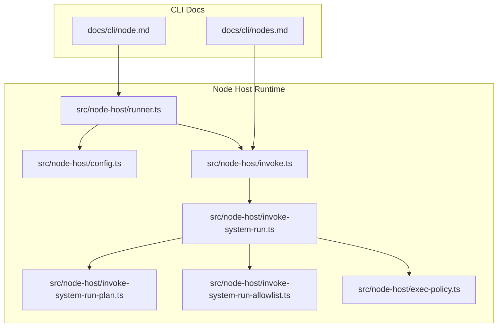
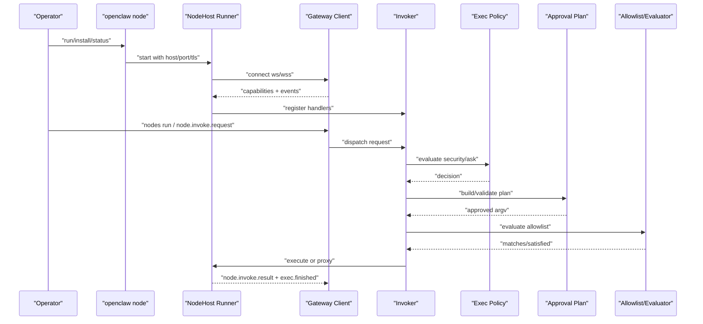
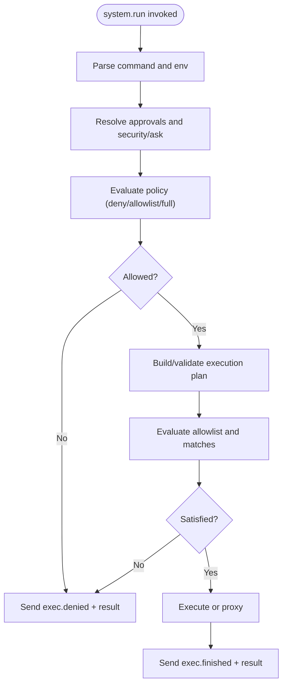
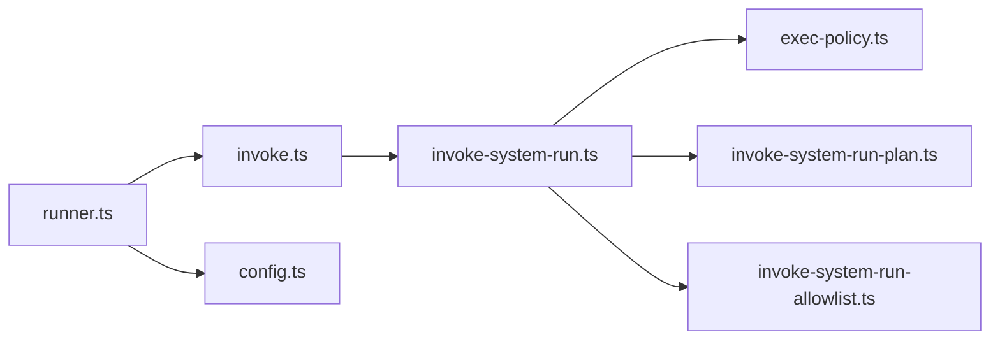

# Node Host Management

<cite>
**Referenced Files in This Document**
- [docs/cli/node.md](file://docs/cli/node.md)
- [docs/cli/nodes.md](file://docs/cli/nodes.md)
- [src/node-host/config.ts](file://src/node-host/config.ts)
- [src/node-host/runner.ts](file://src/node-host/runner.ts)
- [src/node-host/invoke.ts](file://src/node-host/invoke.ts)
- [src/node-host/invoke-system-run.ts](file://src/node-host/invoke-system-run.ts)
- [src/node-host/invoke-system-run-plan.ts](file://src/node-host/invoke-system-run-plan.ts)
- [src/node-host/invoke-system-run-allowlist.ts](file://src/node-host/invoke-system-run-allowlist.ts)
- [src/node-host/exec-policy.ts](file://src/node-host/exec-policy.ts)
- [docs/install/node.md](file://docs/install/node.md)
- [docs/cli/daemon.md](file://docs/cli/daemon.md)
- [docs/cli/uninstall.md](file://docs/cli/uninstall.md)
</cite>

## Table of Contents
1. [Introduction](#introduction)
2. [Project Structure](#project-structure)
3. [Core Components](#core-components)
4. [Architecture Overview](#architecture-overview)
5. [Detailed Component Analysis](#detailed-component-analysis)
6. [Dependency Analysis](#dependency-analysis)
7. [Performance Considerations](#performance-considerations)
8. [Troubleshooting Guide](#troubleshooting-guide)
9. [Conclusion](#conclusion)
10. [Appendices](#appendices)

## Introduction
This document explains how to manage node hosts in OpenClaw, covering both foreground and service-based deployments. It clarifies the differences between headless node hosts and GUI-enabled node hosts, details startup and service lifecycle management, and documents the exec approval system, security policies, and allowlist configuration. Practical examples demonstrate installation, configuration, and monitoring. Remote gateway connectivity via secure WebSocket is explained, along with naming, identification, and CLI management. Finally, troubleshooting and performance optimization strategies are included.

## Project Structure
The node host capability is implemented under the node-host module and documented via CLI references. Key areas:
- CLI documentation for node and nodes commands
- Node host runtime and invocation pipeline
- Security and allowlist enforcement
- Configuration persistence and identity

**Diagram sources**
- [docs/cli/node.md](file://docs/cli/node.md)
- [docs/cli/nodes.md](file://docs/cli/nodes.md)
- [src/node-host/runner.ts](file://src/node-host/runner.ts)
- [src/node-host/config.ts](file://src/node-host/config.ts)
- [src/node-host/invoke.ts](file://src/node-host/invoke.ts)
- [src/node-host/invoke-system-run.ts](file://src/node-host/invoke-system-run.ts)
- [src/node-host/invoke-system-run-plan.ts](file://src/node-host/invoke-system-run-plan.ts)
- [src/node-host/invoke-system-run-allowlist.ts](file://src/node-host/invoke-system-run-allowlist.ts)
- [src/node-host/exec-policy.ts](file://src/node-host/exec-policy.ts)

**Section sources**
- [docs/cli/node.md](file://docs/cli/node.md)
- [docs/cli/nodes.md](file://docs/cli/nodes.md)
- [src/node-host/runner.ts](file://src/node-host/runner.ts)
- [src/node-host/config.ts](file://src/node-host/config.ts)
- [src/node-host/invoke.ts](file://src/node-host/invoke.ts)
- [src/node-host/invoke-system-run.ts](file://src/node-host/invoke-system-run.ts)
- [src/node-host/invoke-system-run-plan.ts](file://src/node-host/invoke-system-run-plan.ts)
- [src/node-host/invoke-system-run-allowlist.ts](file://src/node-host/invoke-system-run-allowlist.ts)
- [src/node-host/exec-policy.ts](file://src/node-host/exec-policy.ts)

## Core Components
- Headless node host: Runs without a GUI, exposing system.run and system.which for remote execution and capability discovery.
- Exec approvals and allowlist: Enforces security posture for system.run via approvals and allowlist evaluation.
- Browser proxy: Optional capability advertisement enabling browser automation on the node host.
- Gateway connection: Establishes a WebSocket connection to the gateway with TLS support and fingerprint verification.
- Service lifecycle: CLI supports install, start, stop, restart, and status for persistent node host operation.

**Section sources**
- [docs/cli/node.md](file://docs/cli/node.md)
- [src/node-host/runner.ts](file://src/node-host/runner.ts)
- [src/node-host/invoke.ts](file://src/node-host/invoke.ts)
- [src/node-host/invoke-system-run.ts](file://src/node-host/invoke-system-run.ts)
- [src/node-host/exec-policy.ts](file://src/node-host/exec-policy.ts)

## Architecture Overview
The node host connects to the gateway, advertises capabilities, and handles invocation requests. It enforces security via approvals and allowlists, and can optionally proxy browser automation.

**Diagram sources**
- [src/node-host/runner.ts](file://src/node-host/runner.ts)
- [src/node-host/invoke.ts](file://src/node-host/invoke.ts)
- [src/node-host/invoke-system-run.ts](file://src/node-host/invoke-system-run.ts)
- [src/node-host/exec-policy.ts](file://src/node-host/exec-policy.ts)
- [src/node-host/invoke-system-run-plan.ts](file://src/node-host/invoke-system-run-plan.ts)
- [src/node-host/invoke-system-run-allowlist.ts](file://src/node-host/invoke-system-run-allowlist.ts)

## Detailed Component Analysis

### Headless vs GUI-enabled Node Hosts
- Headless node host: Runs without a GUI, suitable for server environments and CI. Exposes system.run and system.which for remote execution.
- GUI-enabled node host: When browser automation is enabled, the node host can advertise a browser proxy capability, allowing agents to automate browsers on that host without extra configuration.

Configuration highlights:
- Browser proxy enablement/disablement is controlled via node host configuration.
- Headless mode is the default unless browser automation is explicitly enabled.

Practical guidance:
- Use headless for remote Linux/Windows servers and CI runners.
- Enable browser proxy on hosts where browser automation is required.

**Section sources**
- [docs/cli/node.md](file://docs/cli/node.md)
- [src/node-host/runner.ts](file://src/node-host/runner.ts)

### Startup Procedures and Service Lifecycle
- Foreground run: Use the node run command with gateway host/port and optional TLS settings. Supports overriding node ID and display name.
- Service installation: Install a persistent node host as a user service with runtime selection (node or bun). Manage with status, stop, restart, uninstall.
- Gateway authentication: Node host resolves gateway credentials from environment or local config; it intentionally avoids inheriting remote credentials for local node hosts.

Lifecycle commands:
- Status, install, start, stop, restart, uninstall are available via the node CLI.

**Section sources**
- [docs/cli/node.md](file://docs/cli/node.md)
- [docs/cli/daemon.md](file://docs/cli/daemon.md)
- [docs/cli/uninstall.md](file://docs/cli/uninstall.md)

### Exec Approval System and Security Policies
- Exec approvals: system.run is gated by approvals stored locally and managed via approvals editing.
- Security modes:
  - deny: disables execution.
  - allowlist: requires allowlist matches and approvals.
  - full: allows execution subject to other constraints.
- Ask modes:
  - off: no interactive prompts.
  - on-miss: prompt when allowlist miss occurs.
  - always: always prompt.
- Policy evaluation:
  - Enforces allowlist satisfaction, shell wrapper restrictions, and approval decisions.
  - Windows-specific handling for cmd.exe wrappers requiring approval.
- Output truncation and eventing:
  - Truncates excessive output and emits exec.finished events.

**Diagram sources**
- [src/node-host/invoke-system-run.ts](file://src/node-host/invoke-system-run.ts)
- [src/node-host/exec-policy.ts](file://src/node-host/exec-policy.ts)
- [src/node-host/invoke-system-run-plan.ts](file://src/node-host/invoke-system-run-plan.ts)
- [src/node-host/invoke-system-run-allowlist.ts](file://src/node-host/invoke-system-run-allowlist.ts)

**Section sources**
- [src/node-host/invoke.ts](file://src/node-host/invoke.ts)
- [src/node-host/invoke-system-run.ts](file://src/node-host/invoke-system-run.ts)
- [src/node-host/exec-policy.ts](file://src/node-host/exec-policy.ts)
- [src/node-host/invoke-system-run-plan.ts](file://src/node-host/invoke-system-run-plan.ts)
- [src/node-host/invoke-system-run-allowlist.ts](file://src/node-host/invoke-system-run-allowlist.ts)

### Allowlist Configuration and Execution Planning
- Allowlist evaluation:
  - Analyzes argv or shell command, computes segments, and determines matches.
  - Supports planned argv generation for allowlisted single-segment commands.
- Approval plan:
  - Validates cwd snapshots and mutable file operands to prevent drift.
  - Hardens execution paths and rejects unsafe changes.
- Windows shell wrapper handling:
  - Shell wrappers require approval unless explicitly allowed.
- Auto-allow skills:
  - Optionally auto-allow known skill binaries when enabled.

**Section sources**
- [src/node-host/invoke-system-run-allowlist.ts](file://src/node-host/invoke-system-run-allowlist.ts)
- [src/node-host/invoke-system-run-plan.ts](file://src/node-host/invoke-system-run-plan.ts)
- [src/node-host/invoke-system-run.ts](file://src/node-host/invoke-system-run.ts)

### Remote Gateway Connectivity and Network Configuration
- Connection:
  - Node host connects to the gateway via WebSocket (ws) or TLS (wss).
  - Supports TLS fingerprint pinning for certificate verification.
- Authentication:
  - Resolves token/password from environment or local config; avoids inheriting remote credentials for local node hosts.
- Discovery:
  - First connection creates a pending device pairing request on the gateway; approve via devices/nodes commands.

**Section sources**
- [src/node-host/runner.ts](file://src/node-host/runner.ts)
- [docs/cli/node.md](file://docs/cli/node.md)

### Node Naming, Identification, and CLI Management
- Identity:
  - Node host persists node ID, token, display name, and gateway connection info in a state file.
- CLI commands:
  - nodes list/status/pending/approve for paired nodes.
  - nodes run/invoke to execute commands on a target node.
  - node run/install/status for lifecycle management.

**Section sources**
- [src/node-host/config.ts](file://src/node-host/config.ts)
- [docs/cli/nodes.md](file://docs/cli/nodes.md)
- [docs/cli/node.md](file://docs/cli/node.md)

### Practical Examples

- Install and run a headless node host:
  - Install service with host/port and TLS options.
  - Manage with status, stop, restart, uninstall.
  - Reference: [docs/cli/node.md](file://docs/cli/node.md)

- Configure browser proxy:
  - Disable browser proxy on the node via configuration if needed.
  - Reference: [docs/cli/node.md](file://docs/cli/node.md)

- Approve exec requests:
  - Use approvals editing to manage exec approvals for the node.
  - Reference: [docs/cli/node.md](file://docs/cli/node.md)

- Invoke commands on a node:
  - Use nodes run to execute commands with timeouts, env overrides, and agent scoping.
  - Reference: [docs/cli/nodes.md](file://docs/cli/nodes.md)

- Manage gateway service (legacy alias):
  - Use daemon commands for service lifecycle; note that gateway commands are preferred.
  - Reference: [docs/cli/daemon.md](file://docs/cli/daemon.md)

**Section sources**
- [docs/cli/node.md](file://docs/cli/node.md)
- [docs/cli/nodes.md](file://docs/cli/nodes.md)
- [docs/cli/daemon.md](file://docs/cli/daemon.md)

## Dependency Analysis
The node host runtime composes several modules:
- Runner sets up gateway connection, capabilities, and invokes handlers.
- Invoker routes commands to appropriate handlers and manages results/events.
- System run handler orchestrates policy, plan, and allowlist evaluation.
- Exec policy evaluates security and ask modes.
- Allowlist evaluator and planner enforce safe execution paths.

**Diagram sources**
- [src/node-host/runner.ts](file://src/node-host/runner.ts)
- [src/node-host/invoke.ts](file://src/node-host/invoke.ts)
- [src/node-host/invoke-system-run.ts](file://src/node-host/invoke-system-run.ts)
- [src/node-host/exec-policy.ts](file://src/node-host/exec-policy.ts)
- [src/node-host/invoke-system-run-plan.ts](file://src/node-host/invoke-system-run-plan.ts)
- [src/node-host/invoke-system-run-allowlist.ts](file://src/node-host/invoke-system-run-allowlist.ts)
- [src/node-host/config.ts](file://src/node-host/config.ts)

**Section sources**
- [src/node-host/runner.ts](file://src/node-host/runner.ts)
- [src/node-host/invoke.ts](file://src/node-host/invoke.ts)
- [src/node-host/invoke-system-run.ts](file://src/node-host/invoke-system-run.ts)
- [src/node-host/exec-policy.ts](file://src/node-host/exec-policy.ts)
- [src/node-host/invoke-system-run-plan.ts](file://src/node-host/invoke-system-run-plan.ts)
- [src/node-host/invoke-system-run-allowlist.ts](file://src/node-host/invoke-system-run-allowlist.ts)
- [src/node-host/config.ts](file://src/node-host/config.ts)

## Performance Considerations
- Output limits: Node host truncates excessive stdout/stderr to protect transport and storage.
- Path normalization: Ensures PATH is present and defaults to common system paths to reduce resolution overhead.
- Caching: Skill binary trust entries are cached with TTL to minimize repeated filesystem scans.
- Windows console encoding: Detects and decodes console output properly to avoid transcoding overhead.

[No sources needed since this section provides general guidance]

## Troubleshooting Guide
- Command not found or PATH issues:
  - Ensure Node.js 22.16+ is installed and globally installed binaries are on PATH.
  - Reference: [docs/install/node.md](file://docs/install/node.md)

- Node host cannot connect to gateway:
  - Verify host/port and TLS settings; use TLS fingerprint pinning if required.
  - Confirm gateway credentials resolution from environment or local config.
  - Reference: [docs/cli/node.md](file://docs/cli/node.md), [src/node-host/runner.ts](file://src/node-host/runner.ts)

- Exec denied due to allowlist or ask mode:
  - Review exec approvals and adjust ask/security settings.
  - For Windows, shell wrappers require approval.
  - Reference: [src/node-host/exec-policy.ts](file://src/node-host/exec-policy.ts), [src/node-host/invoke-system-run.ts](file://src/node-host/invoke-system-run.ts)

- Service lifecycle issues:
  - Use node CLI for service management; daemon is a legacy alias.
  - Reference: [docs/cli/daemon.md](file://docs/cli/daemon.md), [docs/cli/uninstall.md](file://docs/cli/uninstall.md)

**Section sources**
- [docs/install/node.md](file://docs/install/node.md)
- [docs/cli/node.md](file://docs/cli/node.md)
- [src/node-host/runner.ts](file://src/node-host/runner.ts)
- [src/node-host/exec-policy.ts](file://src/node-host/exec-policy.ts)
- [src/node-host/invoke-system-run.ts](file://src/node-host/invoke-system-run.ts)
- [docs/cli/daemon.md](file://docs/cli/daemon.md)
- [docs/cli/uninstall.md](file://docs/cli/uninstall.md)

## Conclusion
OpenClaw’s node host enables secure, remote execution with strong controls via exec approvals and allowlists. Headless deployments suit servers and CI; GUI-enabled hosts add browser automation. The CLI provides robust lifecycle management, and security policies ensure safe execution across platforms. Proper configuration of gateway connectivity, approvals, and allowlists ensures reliable operation and strong security posture.

[No sources needed since this section summarizes without analyzing specific files]

## Appendices

### Appendix A: Node Host CLI Quick Reference
- Run headless node host: [docs/cli/node.md](file://docs/cli/node.md)
- Manage node service: [docs/cli/node.md](file://docs/cli/node.md)
- List/manage nodes and invoke commands: [docs/cli/nodes.md](file://docs/cli/nodes.md)
- Legacy daemon service commands: [docs/cli/daemon.md](file://docs/cli/daemon.md)
- Uninstall gateway service and local data: [docs/cli/uninstall.md](file://docs/cli/uninstall.md)

**Section sources**
- [docs/cli/node.md](file://docs/cli/node.md)
- [docs/cli/nodes.md](file://docs/cli/nodes.md)
- [docs/cli/daemon.md](file://docs/cli/daemon.md)
- [docs/cli/uninstall.md](file://docs/cli/uninstall.md)