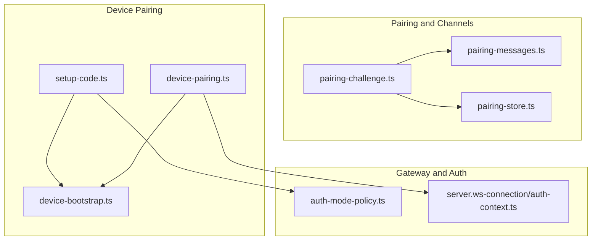
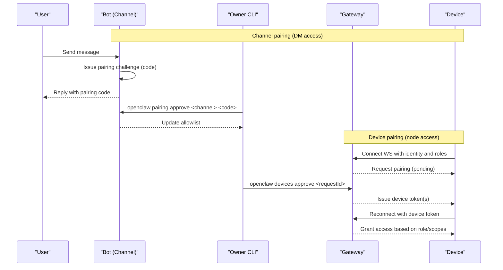
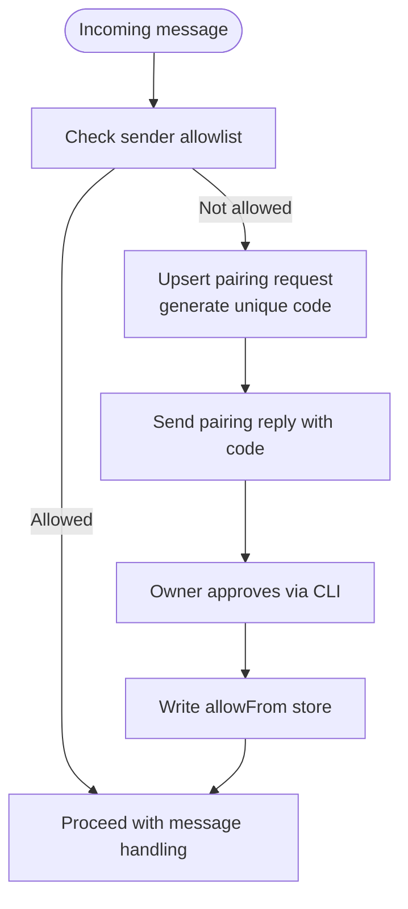
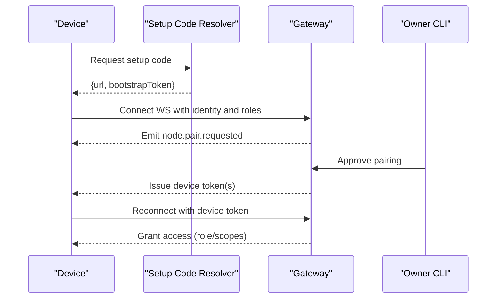
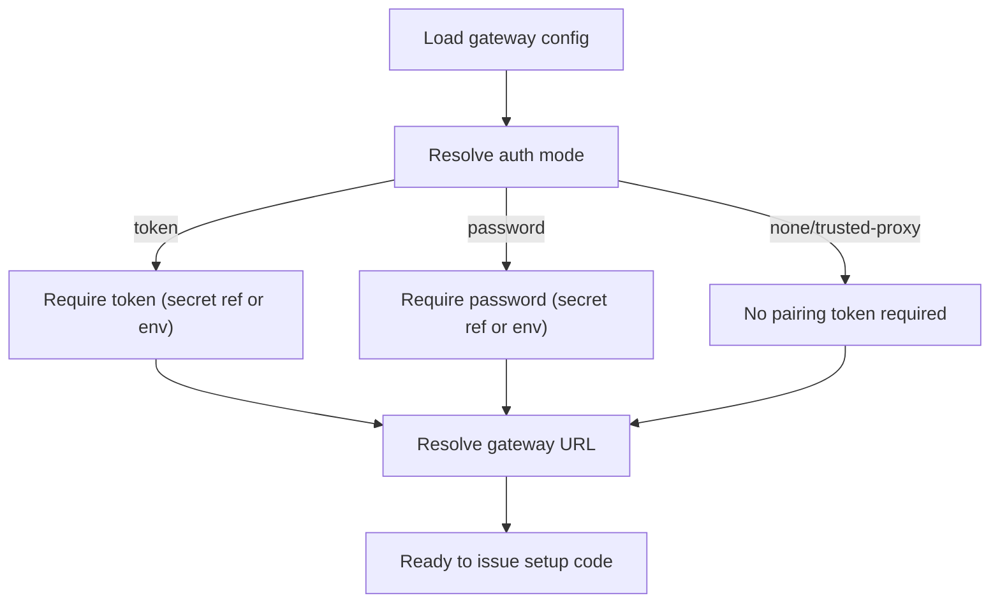
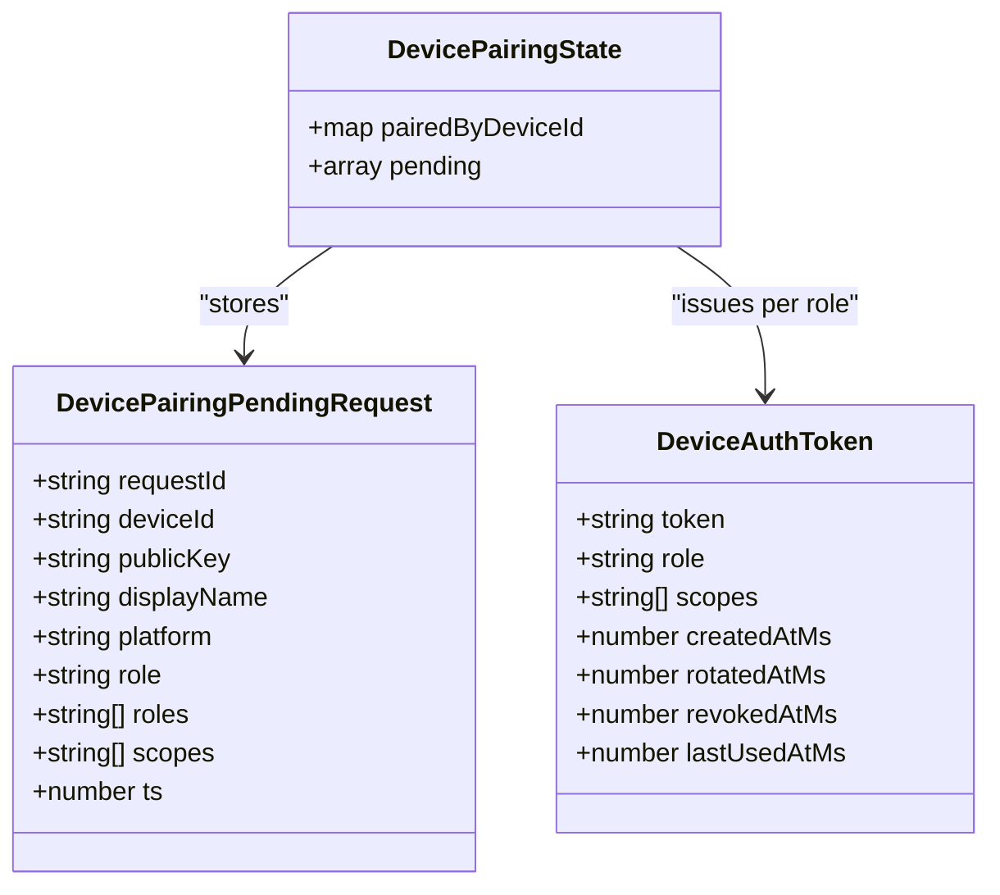
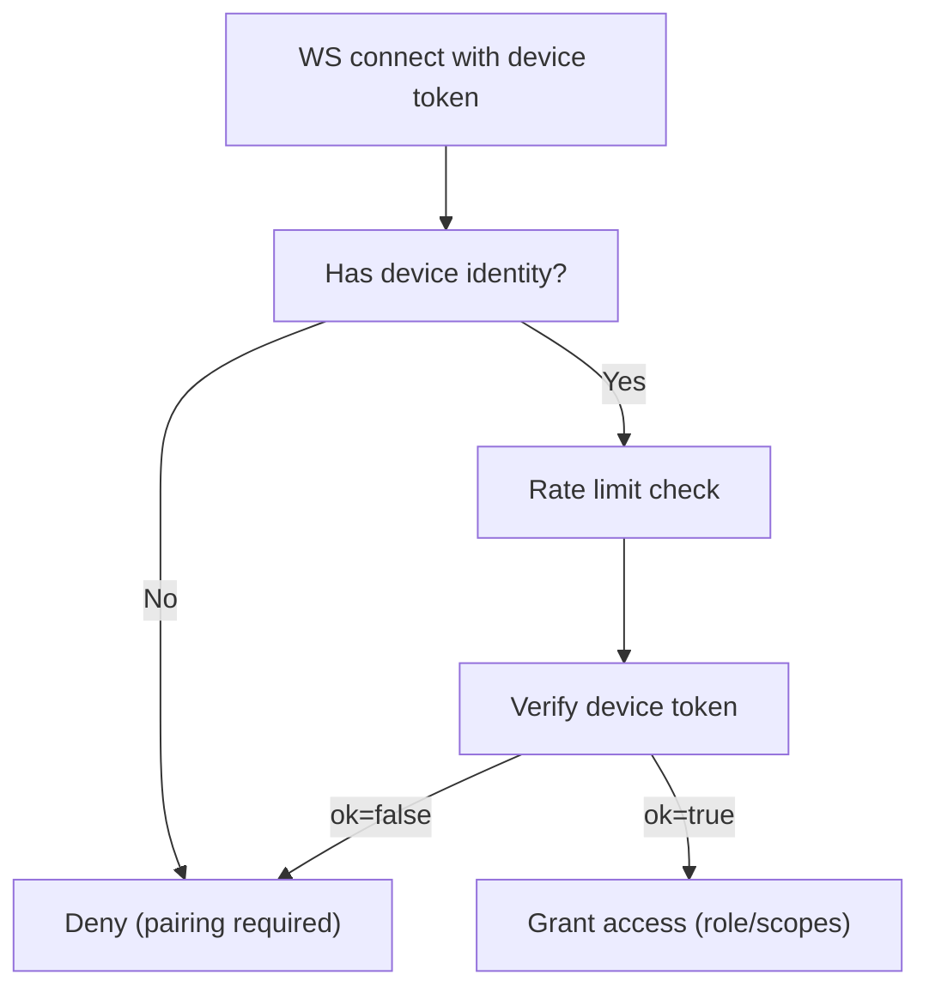
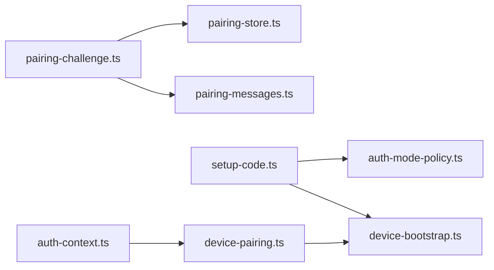

# Node Pairing and Authentication

<cite>
**Referenced Files in This Document**
- [docs/channels/pairing.md](file://docs/channels/pairing.md)
- [docs/gateway/pairing.md](file://docs/gateway/pairing.md)
- [src/pairing/pairing-challenge.ts](file://src/pairing/pairing-challenge.ts)
- [src/pairing/pairing-messages.ts](file://src/pairing/pairing-messages.ts)
- [src/pairing/pairing-store.ts](file://src/pairing/pairing-store.ts)
- [src/pairing/setup-code.ts](file://src/pairing/setup-code.ts)
- [src/infra/device-bootstrap.ts](file://src/infra/device-bootstrap.ts)
- [src/infra/device-pairing.ts](file://src/infra/device-pairing.ts)
- [src/gateway/auth-mode-policy.ts](file://src/gateway/auth-mode-policy.ts)
- [src/gateway/server.ws-connection/auth-context.ts](file://src/gateway/server.ws-connection/auth-context.ts)
- [src/gateway/server.auth.control-ui.suite.ts](file://src/gateway/server.auth.control-ui.suite.ts)
- [src/gateway/server.device-token-rotate-authz.test.ts](file://src/gateway/server.device-token-rotate-authz.test.ts)
</cite>

## Table of Contents
1. [Introduction](#introduction)
2. [Project Structure](#project-structure)
3. [Core Components](#core-components)
4. [Architecture Overview](#architecture-overview)
5. [Detailed Component Analysis](#detailed-component-analysis)
6. [Dependency Analysis](#dependency-analysis)
7. [Performance Considerations](#performance-considerations)
8. [Troubleshooting Guide](#troubleshooting-guide)
9. [Conclusion](#conclusion)

## Introduction
This document explains how OpenClaw establishes secure node connections through device pairing and authentication. It covers:
- Device pairing lifecycle: from initial connection to approved device registration
- Device identity presentation and role assignment
- Authentication methods for node hosts (token-based and password-based)
- Practical workflows for pairing commands, approvals, and rejections
- Security considerations: identity verification, role-based access control, and token rotation
- Relationship between pairing and node capability advertisement
- Troubleshooting common pairing and authentication issues

## Project Structure
The pairing and authentication logic spans several modules:
- Channel pairing (DM access control) and node pairing (device registration)
- Setup code generation and distribution for device pairing
- Device bootstrap tokens and device token verification
- Gateway authentication modes and enforcement
- WebSocket connection authentication context

**Diagram sources**
- [src/pairing/pairing-challenge.ts:1-49](file://src/pairing/pairing-challenge.ts#L1-L49)
- [src/pairing/pairing-messages.ts:1-21](file://src/pairing/pairing-messages.ts#L1-L21)
- [src/pairing/pairing-store.ts:1-853](file://src/pairing/pairing-store.ts#L1-L853)
- [src/pairing/setup-code.ts:1-410](file://src/pairing/setup-code.ts#L1-L410)
- [src/infra/device-bootstrap.ts:1-117](file://src/infra/device-bootstrap.ts#L1-L117)
- [src/infra/device-pairing.ts:1-574](file://src/infra/device-pairing.ts#L1-L574)
- [src/gateway/auth-mode-policy.ts:1-27](file://src/gateway/auth-mode-policy.ts#L1-L27)
- [src/gateway/server.ws-connection/auth-context.ts:219-262](file://src/gateway/server.ws-connection/auth-context.ts#L219-L262)

**Section sources**
- [docs/channels/pairing.md:1-111](file://docs/channels/pairing.md#L1-L111)
- [docs/gateway/pairing.md:1-100](file://docs/gateway/pairing.md#L1-L100)

## Core Components
- Channel pairing store and challenge issuance for inbound DM access
- Device pairing pipeline with bootstrap tokens and token verification
- Gateway authentication mode enforcement and URL resolution for pairing
- WebSocket device token verification and role/scopes checks

Key responsibilities:
- Issue and manage pairing codes for unknown senders
- Persist pending and approved allowlists per channel/account
- Generate and consume single-use bootstrap tokens for device setup
- Enforce gateway auth mode and resolve pairing URLs
- Verify device tokens with role and scope constraints

**Section sources**
- [src/pairing/pairing-challenge.ts:1-49](file://src/pairing/pairing-challenge.ts#L1-L49)
- [src/pairing/pairing-messages.ts:1-21](file://src/pairing/pairing-messages.ts#L1-L21)
- [src/pairing/pairing-store.ts:1-853](file://src/pairing/pairing-store.ts#L1-L853)
- [src/pairing/setup-code.ts:1-410](file://src/pairing/setup-code.ts#L1-L410)
- [src/infra/device-bootstrap.ts:1-117](file://src/infra/device-bootstrap.ts#L1-L117)
- [src/infra/device-pairing.ts:1-574](file://src/infra/device-pairing.ts#L1-L574)
- [src/gateway/auth-mode-policy.ts:1-27](file://src/gateway/auth-mode-policy.ts#L1-L27)
- [src/gateway/server.ws-connection/auth-context.ts:219-262](file://src/gateway/server.ws-connection/auth-context.ts#L219-L262)

## Architecture Overview
The pairing and authentication architecture integrates three flows:
- Channel pairing (DM access): unknown senders receive a short code; owner approves via CLI
- Device pairing (node access): setup code with gateway URL and bootstrap token; device presents identity and roles; owner approves; device receives tokens
- Gateway authentication: token or password mode enforced; pairing setup resolves URL and auth method

**Diagram sources**
- [docs/channels/pairing.md:20-56](file://docs/channels/pairing.md#L20-L56)
- [docs/gateway/pairing.md:27-62](file://docs/gateway/pairing.md#L27-L62)
- [src/pairing/pairing-challenge.ts:24-48](file://src/pairing/pairing-challenge.ts#L24-L48)
- [src/pairing/pairing-store.ts:697-797](file://src/pairing/pairing-store.ts#L697-L797)
- [src/pairing/setup-code.ts:367-409](file://src/pairing/setup-code.ts#L367-L409)
- [src/infra/device-bootstrap.ts:63-117](file://src/infra/device-bootstrap.ts#L63-L117)
- [src/infra/device-pairing.ts:526-574](file://src/infra/device-pairing.ts#L526-L574)

## Detailed Component Analysis

### Channel Pairing (DM Access Control)
- Challenge issuance ensures every unknown sender gets a unique code with TTL and caps
- Reply building and delivery via channel-specific adapters
- Allowlist persistence supports default and non-default accounts with scoping

**Diagram sources**
- [src/pairing/pairing-challenge.ts:24-48](file://src/pairing/pairing-challenge.ts#L24-L48)
- [src/pairing/pairing-messages.ts:4-20](file://src/pairing/pairing-messages.ts#L4-L20)
- [src/pairing/pairing-store.ts:657-797](file://src/pairing/pairing-store.ts#L657-L797)

**Section sources**
- [docs/channels/pairing.md:20-56](file://docs/channels/pairing.md#L20-L56)
- [src/pairing/pairing-challenge.ts:1-49](file://src/pairing/pairing-challenge.ts#L1-L49)
- [src/pairing/pairing-messages.ts:1-21](file://src/pairing/pairing-messages.ts#L1-L21)
- [src/pairing/pairing-store.ts:1-853](file://src/pairing/pairing-store.ts#L1-L853)

### Device Pairing Pipeline
- Setup code generation includes gateway URL and a single-use bootstrap token
- Device connects with identity, roles, and scopes; gateway creates a pending request
- Owner approves; gateway issues device tokens; device reconnects and authenticates

**Diagram sources**
- [src/pairing/setup-code.ts:367-409](file://src/pairing/setup-code.ts#L367-L409)
- [src/infra/device-bootstrap.ts:63-117](file://src/infra/device-bootstrap.ts#L63-L117)
- [src/infra/device-pairing.ts:526-574](file://src/infra/device-pairing.ts#L526-L574)
- [docs/gateway/pairing.md:27-62](file://docs/gateway/pairing.md#L27-L62)

**Section sources**
- [docs/gateway/pairing.md:1-100](file://docs/gateway/pairing.md#L1-L100)
- [src/pairing/setup-code.ts:1-410](file://src/pairing/setup-code.ts#L1-L410)
- [src/infra/device-bootstrap.ts:1-117](file://src/infra/device-bootstrap.ts#L1-L117)
- [src/infra/device-pairing.ts:1-574](file://src/infra/device-pairing.ts#L1-L574)

### Authentication Methods for Node Hosts
- Token-based authentication: gateway auth mode token; pairing setup resolves token if configured
- Password-based authentication: gateway auth mode password; pairing setup resolves password if configured
- Ambiguity resolution: explicit auth mode required when both token and password are configured

**Diagram sources**
- [src/pairing/setup-code.ts:166-207](file://src/pairing/setup-code.ts#L166-L207)
- [src/pairing/setup-code.ts:291-297](file://src/pairing/setup-code.ts#L291-L297)
- [src/pairing/setup-code.ts:299-359](file://src/pairing/setup-code.ts#L299-L359)
- [src/gateway/auth-mode-policy.ts:1-27](file://src/gateway/auth-mode-policy.ts#L1-L27)

**Section sources**
- [src/pairing/setup-code.ts:1-410](file://src/pairing/setup-code.ts#L1-L410)
- [src/gateway/auth-mode-policy.ts:1-27](file://src/gateway/auth-mode-policy.ts#L1-L27)

### Device Identity Presentation and Role Assignment
- Devices present identity (device ID, public key) and roles/scopes during pairing
- Roles and scopes are merged and normalized; tokens are generated per role
- Verification enforces role presence, token existence, revocation, and scope compatibility

**Diagram sources**
- [src/infra/device-pairing.ts:14-574](file://src/infra/device-pairing.ts#L14-L574)

**Section sources**
- [src/infra/device-pairing.ts:1-574](file://src/infra/device-pairing.ts#L1-L574)

### WebSocket Device Token Verification
- Device token verification checks device pairing, role presence, token existence, revocation, and scope alignment
- Rate limiting applied to device token attempts
- Successful verification updates last-used timestamps

**Diagram sources**
- [src/gateway/server.ws-connection/auth-context.ts:219-262](file://src/gateway/server.ws-connection/auth-context.ts#L219-L262)
- [src/infra/device-pairing.ts:526-574](file://src/infra/device-pairing.ts#L526-L574)

**Section sources**
- [src/gateway/server.ws-connection/auth-context.ts:219-262](file://src/gateway/server.ws-connection/auth-context.ts#L219-L262)
- [src/infra/device-pairing.ts:526-574](file://src/infra/device-pairing.ts#L526-L574)

### Practical Workflows and Commands
- Approve DM senders:
  - List pending requests and approve with pairing code
- Approve node devices:
  - List pending pairing requests and approve/reject by request ID
- Gateway-owned pairing (CLI):
  - List pending, approve, reject, show status, rename nodes

Examples (paths only):
- [docs/channels/pairing.md:32-40](file://docs/channels/pairing.md#L32-L40)
- [docs/gateway/pairing.md:37-45](file://docs/gateway/pairing.md#L37-L45)

**Section sources**
- [docs/channels/pairing.md:1-111](file://docs/channels/pairing.md#L1-L111)
- [docs/gateway/pairing.md:1-100](file://docs/gateway/pairing.md#L1-L100)

### Security Considerations
- Device identity verification: bootstrap tokens are single-use and consumed upon successful verification
- Role-based access control: tokens are issued per role; scope sets are validated against approved baselines
- Token rotation: rotating tokens requires re-approval; revoked tokens cannot be used
- Auth mode enforcement: explicit mode required when both token and password are configured
- Pairing state protection: pairing and device files are stored securely under state directories

**Section sources**
- [src/infra/device-bootstrap.ts:82-117](file://src/infra/device-bootstrap.ts#L82-L117)
- [src/infra/device-pairing.ts:384-417](file://src/infra/device-pairing.ts#L384-L417)
- [src/gateway/auth-mode-policy.ts:1-27](file://src/gateway/auth-mode-policy.ts#L1-L27)
- [docs/channels/pairing.md:40-56](file://docs/channels/pairing.md#L40-L56)
- [docs/gateway/pairing.md:81-94](file://docs/gateway/pairing.md#L81-L94)

### Relationship Between Pairing and Node Capability Advertisement
- Pairing determines membership and token issuance
- Capability advertisement occurs after successful pairing and token verification
- Roles and scopes influence which capabilities a node can exercise

**Section sources**
- [docs/gateway/pairing.md:47-48](file://docs/gateway/pairing.md#L47-L48)
- [src/infra/device-pairing.ts:526-574](file://src/infra/device-pairing.ts#L526-L574)

## Dependency Analysis
- Pairing challenge depends on pairing store and message builder
- Setup code resolver depends on auth mode policy and bootstrap token issuer
- Device pairing depends on bootstrap token verification and token issuance
- WebSocket auth context depends on device pairing state and token verification

**Diagram sources**
- [src/pairing/pairing-challenge.ts:1-49](file://src/pairing/pairing-challenge.ts#L1-L49)
- [src/pairing/pairing-store.ts:1-853](file://src/pairing/pairing-store.ts#L1-L853)
- [src/pairing/pairing-messages.ts:1-21](file://src/pairing/pairing-messages.ts#L1-L21)
- [src/pairing/setup-code.ts:1-410](file://src/pairing/setup-code.ts#L1-L410)
- [src/gateway/auth-mode-policy.ts:1-27](file://src/gateway/auth-mode-policy.ts#L1-L27)
- [src/infra/device-bootstrap.ts:1-117](file://src/infra/device-bootstrap.ts#L1-L117)
- [src/infra/device-pairing.ts:1-574](file://src/infra/device-pairing.ts#L1-L574)
- [src/gateway/server.ws-connection/auth-context.ts:219-262](file://src/gateway/server.ws-connection/auth-context.ts#L219-L262)

**Section sources**
- [src/pairing/pairing-challenge.ts:1-49](file://src/pairing/pairing-challenge.ts#L1-L49)
- [src/pairing/pairing-store.ts:1-853](file://src/pairing/pairing-store.ts#L1-L853)
- [src/pairing/pairing-messages.ts:1-21](file://src/pairing/pairing-messages.ts#L1-L21)
- [src/pairing/setup-code.ts:1-410](file://src/pairing/setup-code.ts#L1-L410)
- [src/gateway/auth-mode-policy.ts:1-27](file://src/gateway/auth-mode-policy.ts#L1-L27)
- [src/infra/device-bootstrap.ts:1-117](file://src/infra/device-bootstrap.ts#L1-L117)
- [src/infra/device-pairing.ts:1-574](file://src/infra/device-pairing.ts#L1-L574)
- [src/gateway/server.ws-connection/auth-context.ts:219-262](file://src/gateway/server.ws-connection/auth-context.ts#L219-L262)

## Performance Considerations
- File locking and atomic writes protect pairing state consistency
- Expiration pruning and request caps reduce overhead
- Rate limiting prevents abuse of device token verification
- Single-use bootstrap tokens minimize replay risk

[No sources needed since this section provides general guidance]

## Troubleshooting Guide
Common pairing and authentication issues:
- No pairing code delivered: verify channel adapter and reply handler
- Expired or capped requests: check TTL and max pending limits
- Auth mode ambiguity: set explicit gateway auth mode when both token and password are configured
- Bootstrap token invalid: ensure single-use token consumption and correct device identity
- Device token mismatch or revoked: confirm approved role/token and re-approval if rotated
- Silent approval fallback: ensure conditions for silent approval are met

Concrete references:
- [docs/channels/pairing.md:26-31](file://docs/channels/pairing.md#L26-L31)
- [src/pairing/pairing-store.ts:13-26](file://src/pairing/pairing-store.ts#L13-L26)
- [src/gateway/auth-mode-policy.ts:4-5](file://src/gateway/auth-mode-policy.ts#L4-L5)
- [src/infra/device-bootstrap.ts:89-117](file://src/infra/device-bootstrap.ts#L89-L117)
- [src/infra/device-pairing.ts:526-574](file://src/infra/device-pairing.ts#L526-L574)
- [src/gateway/server.auth.control-ui.suite.ts:643-674](file://src/gateway/server.auth.control-ui.suite.ts#L643-L674)
- [src/gateway/server.device-token-rotate-authz.test.ts:47-98](file://src/gateway/server.device-token-rotate-authz.test.ts#L47-L98)

**Section sources**
- [docs/channels/pairing.md:1-111](file://docs/channels/pairing.md#L1-L111)
- [src/pairing/pairing-store.ts:1-853](file://src/pairing/pairing-store.ts#L1-L853)
- [src/gateway/auth-mode-policy.ts:1-27](file://src/gateway/auth-mode-policy.ts#L1-L27)
- [src/infra/device-bootstrap.ts:1-117](file://src/infra/device-bootstrap.ts#L1-L117)
- [src/infra/device-pairing.ts:1-574](file://src/infra/device-pairing.ts#L1-L574)
- [src/gateway/server.auth.control-ui.suite.ts:643-674](file://src/gateway/server.auth.control-ui.suite.ts#L643-L674)
- [src/gateway/server.device-token-rotate-authz.test.ts:47-98](file://src/gateway/server.device-token-rotate-authz.test.ts#L47-L98)

## Conclusion
OpenClaw’s pairing and authentication system combines explicit owner approval with robust device identity verification and role-based access control. Channel pairing secures inbound DM access, while device pairing enables secure node connections with token-based authentication. Clear workflows, state protection, and enforcement of explicit auth modes ensure a strong security posture. Proper troubleshooting practices and understanding of token lifecycle and scope validation help maintain reliable and secure node connectivity.