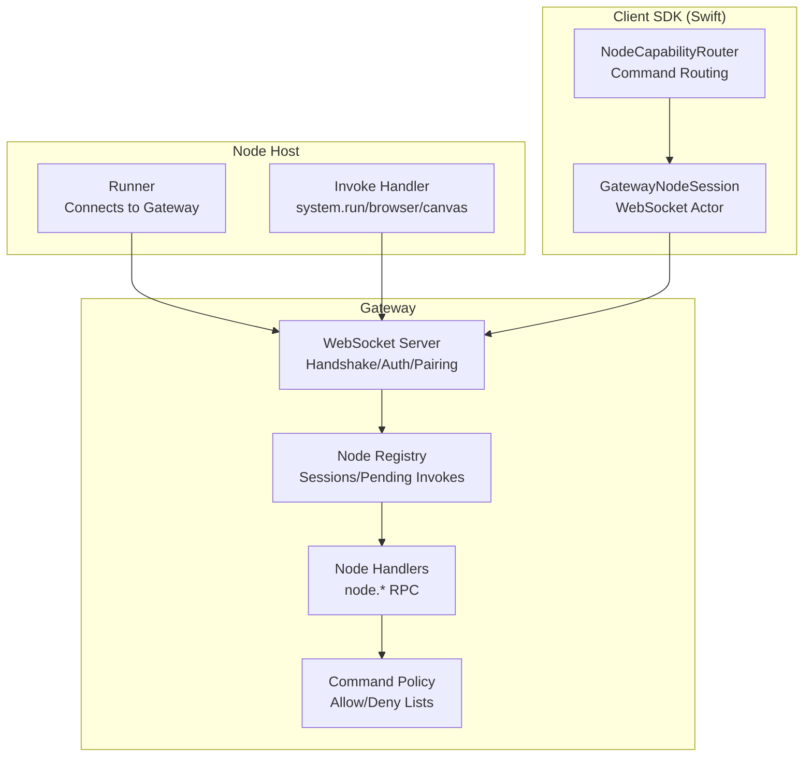
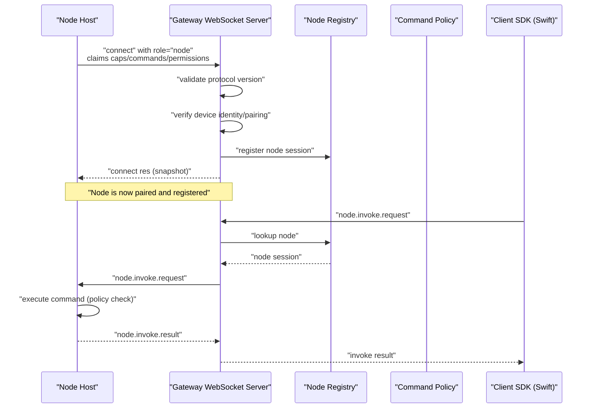
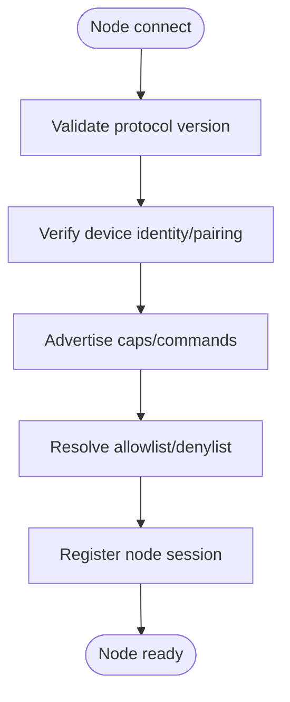
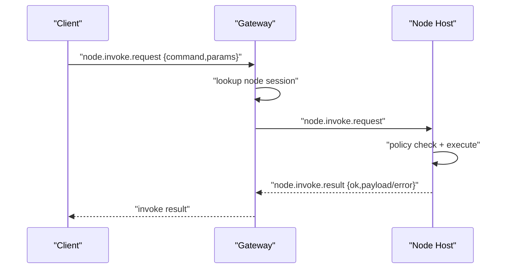
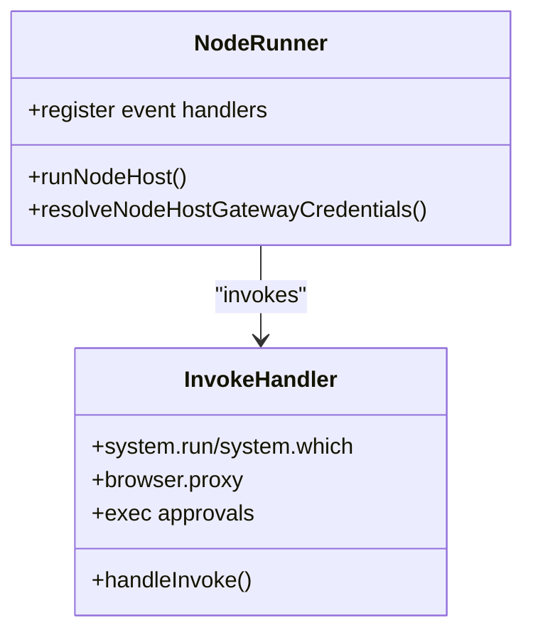
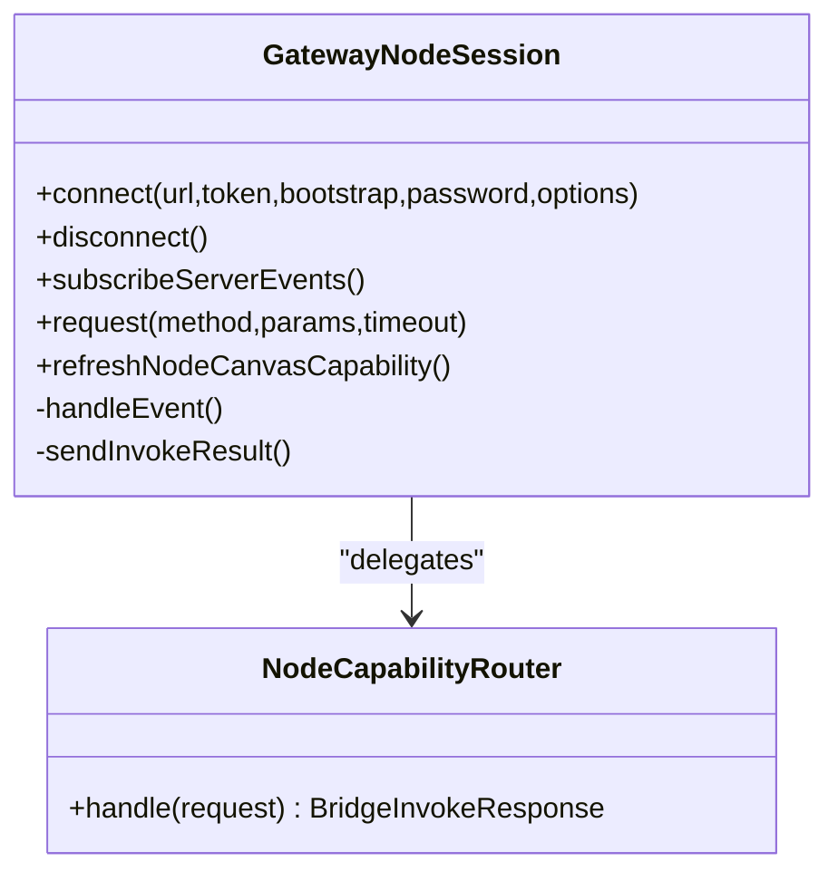
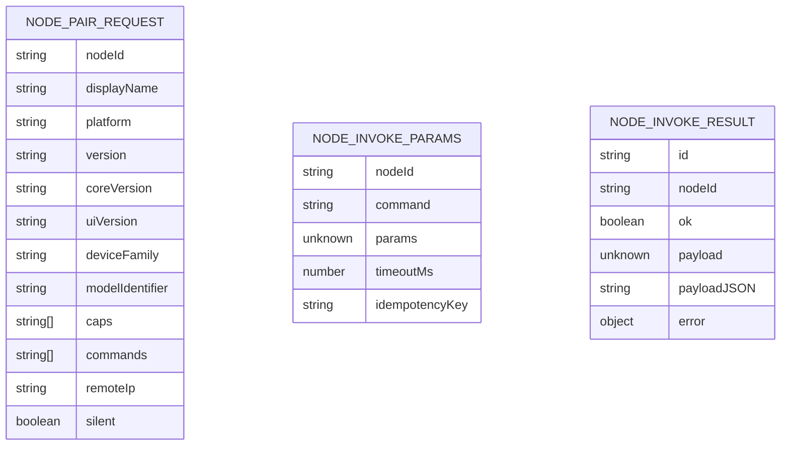
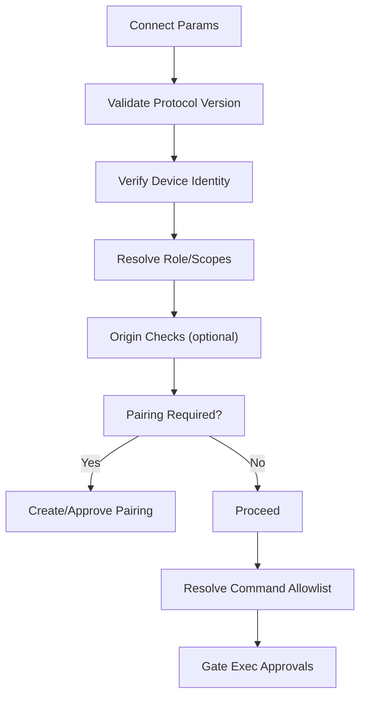
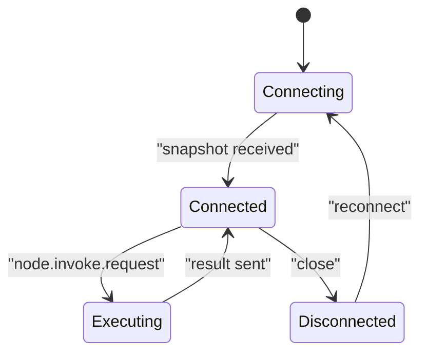
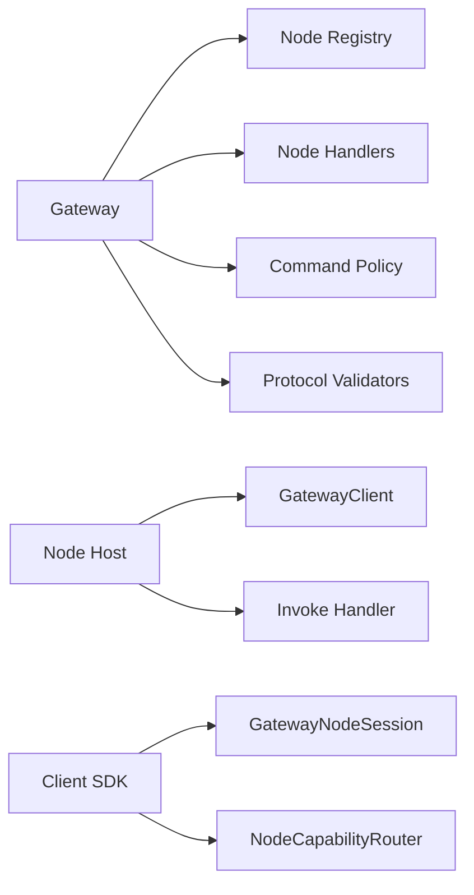

# Node System

<cite>
**Referenced Files in This Document**
- [src/gateway/node-registry.ts](file://src/gateway/node-registry.ts)
- [src/gateway/server/ws-connection/message-handler.ts](file://src/gateway/server/ws-connection/message-handler.ts)
- [src/gateway/server-methods/nodes.ts](file://src/gateway/server-methods/nodes.ts)
- [src/gateway/protocol/schema/nodes.ts](file://src/gateway/protocol/schema/nodes.ts)
- [src/gateway/protocol/index.ts](file://src/gateway/protocol/index.ts)
- [src/gateway/node-command-policy.ts](file://src/gateway/node-command-policy.ts)
- [src/node-host/runner.ts](file://src/node-host/runner.ts)
- [src/node-host/invoke.ts](file://src/node-host/invoke.ts)
- [apps/shared/OpenClawKit/Sources/OpenClawKit/GatewayNodeSession.swift](file://apps/shared/OpenClawKit/Sources/OpenClawKit/GatewayNodeSession.swift)
- [apps/ios/Sources/Capabilities/NodeCapabilityRouter.swift](file://apps/ios/Sources/Capabilities/NodeCapabilityRouter.swift)
- [src/infra/node-pairing.ts](file://src/infra/node-pairing.ts)
- [src/infra/skills-remote.ts](file://src/infra/skills-remote.ts)
- [docs/nodes/index.md](file://docs/nodes/index.md)
- [docs/help/faq.md](file://docs/help/faq.md)
</cite>

## Table of Contents
1. [Introduction](#introduction)
2. [Project Structure](#project-structure)
3. [Core Components](#core-components)
4. [Architecture Overview](#architecture-overview)
5. [Detailed Component Analysis](#detailed-component-analysis)
6. [Dependency Analysis](#dependency-analysis)
7. [Performance Considerations](#performance-considerations)
8. [Troubleshooting Guide](#troubleshooting-guide)
9. [Conclusion](#conclusion)
10. [Appendices](#appendices)

## Introduction
This document explains OpenClaw’s distributed node architecture and device integration. It covers how nodes (devices and compute hosts) connect to the central Gateway over WebSocket, advertise capabilities, negotiate permissions, and execute commands remotely. It documents node types, communication protocols, security and access control, lifecycle management, and operational guidance for scaling and troubleshooting.

## Project Structure
The node system spans three primary areas:
- Gateway server: WebSocket handshake, authentication, pairing, capability negotiation, and remote invocation orchestration.
- Node host: A cross-platform process that connects to the Gateway, exposes commands, enforces execution approvals, and relays results.
- iOS/macOS client SDK: A Swift actor-based session that speaks the Gateway protocol, handles events, and executes node-side invocations.

**Diagram sources**
- [src/gateway/server/ws-connection/message-handler.ts:132-800](file://src/gateway/server/ws-connection/message-handler.ts#L132-L800)
- [src/gateway/node-registry.ts:38-210](file://src/gateway/node-registry.ts#L38-L210)
- [src/gateway/server-methods/nodes.ts:493-800](file://src/gateway/server-methods/nodes.ts#L493-L800)
- [src/gateway/node-command-policy.ts:176-215](file://src/gateway/node-command-policy.ts#L176-L215)
- [src/node-host/runner.ts:144-230](file://src/node-host/runner.ts#L144-L230)
- [src/node-host/invoke.ts:417-556](file://src/node-host/invoke.ts#L417-L556)
- [apps/shared/OpenClawKit/Sources/OpenClawKit/GatewayNodeSession.swift:59-536](file://apps/shared/OpenClawKit/Sources/OpenClawKit/GatewayNodeSession.swift#L59-L536)
- [apps/ios/Sources/Capabilities/NodeCapabilityRouter.swift:1-25](file://apps/ios/Sources/Capabilities/NodeCapabilityRouter.swift#L1-L25)

**Section sources**
- [src/gateway/server/ws-connection/message-handler.ts:132-800](file://src/gateway/server/ws-connection/message-handler.ts#L132-L800)
- [src/gateway/node-registry.ts:38-210](file://src/gateway/node-registry.ts#L38-L210)
- [src/gateway/server-methods/nodes.ts:493-800](file://src/gateway/server-methods/nodes.ts#L493-L800)
- [src/gateway/node-command-policy.ts:176-215](file://src/gateway/node-command-policy.ts#L176-L215)
- [src/node-host/runner.ts:144-230](file://src/node-host/runner.ts#L144-L230)
- [src/node-host/invoke.ts:417-556](file://src/node-host/invoke.ts#L417-L556)
- [apps/shared/OpenClawKit/Sources/OpenClawKit/GatewayNodeSession.swift:59-536](file://apps/shared/OpenClawKit/Sources/OpenClawKit/GatewayNodeSession.swift#L59-L536)
- [apps/ios/Sources/Capabilities/NodeCapabilityRouter.swift:1-25](file://apps/ios/Sources/Capabilities/NodeCapabilityRouter.swift#L1-L25)

## Core Components
- Node Registry: Tracks connected nodes, pending invokes, and forwards events.
- WebSocket Message Handler: Validates protocol version, authenticates devices, negotiates capabilities, and manages pairing.
- Node Handlers: Implements node.* RPC methods (list, describe, pair, invoke, event).
- Command Policy: Enforces allow/deny lists and platform-specific defaults.
- Node Runner: Establishes Gateway connection, advertises capabilities, and handles incoming invoke requests.
- Node Invoke Handler: Executes commands (system.run, system.which, browser.proxy, approvals), enforces approvals, and streams results.
- Client SDK Session: Manages WebSocket connection, snapshot synchronization, event subscription, and invoke timeouts.

**Section sources**
- [src/gateway/node-registry.ts:38-210](file://src/gateway/node-registry.ts#L38-L210)
- [src/gateway/server/ws-connection/message-handler.ts:343-385](file://src/gateway/server/ws-connection/message-handler.ts#L343-L385)
- [src/gateway/server-methods/nodes.ts:493-800](file://src/gateway/server-methods/nodes.ts#L493-L800)
- [src/gateway/node-command-policy.ts:176-215](file://src/gateway/node-command-policy.ts#L176-L215)
- [src/node-host/runner.ts:144-230](file://src/node-host/runner.ts#L144-L230)
- [src/node-host/invoke.ts:417-556](file://src/node-host/invoke.ts#L417-L556)
- [apps/shared/OpenClawKit/Sources/OpenClawKit/GatewayNodeSession.swift:59-536](file://apps/shared/OpenClawKit/Sources/OpenClawKit/GatewayNodeSession.swift#L59-L536)

## Architecture Overview
The Gateway acts as the central coordinator. Nodes connect via WebSocket with role "node". During handshake, the Gateway validates protocol version, checks device identity and pairing, and negotiates capabilities and permissions. Once connected, nodes can be invoked remotely via node.invoke.request, and the Gateway routes commands to the appropriate node host.

**Diagram sources**
- [src/gateway/server/ws-connection/message-handler.ts:343-385](file://src/gateway/server/ws-connection/message-handler.ts#L343-L385)
- [src/gateway/node-registry.ts:43-79](file://src/gateway/node-registry.ts#L43-L79)
- [src/gateway/server-methods/nodes.ts:780-800](file://src/gateway/server-methods/nodes.ts#L780-L800)
- [src/gateway/node-command-policy.ts:194-215](file://src/gateway/node-command-policy.ts#L194-L215)
- [src/node-host/invoke.ts:417-556](file://src/node-host/invoke.ts#L417-L556)
- [apps/shared/OpenClawKit/Sources/OpenClawKit/GatewayNodeSession.swift:439-466](file://apps/shared/OpenClawKit/Sources/OpenClawKit/GatewayNodeSession.swift#L439-L466)

## Detailed Component Analysis

### Node Types
- Device nodes: iOS, Android, macOS (menubar app), and headless hosts. They expose device capabilities (canvas, camera, screen, location, notifications, contacts, calendar, motion, SMS on Android) and system commands (system.run, system.which).
- Compute nodes: Headless hosts that primarily expose system.run and system.which for remote execution.
- Specialized nodes: Nodes advertising additional capabilities (e.g., browser proxy) depending on platform and permissions.

Practical examples:
- Start a headless node host: [docs/nodes/index.md:66-107](file://docs/nodes/index.md#L66-L107)
- Pair and manage nodes: [docs/nodes/index.md:108-122](file://docs/nodes/index.md#L108-L122)
- Allowlist commands on a node host: [docs/nodes/index.md:123-133](file://docs/nodes/index.md#L123-L133)

**Section sources**
- [docs/nodes/index.md:10-122](file://docs/nodes/index.md#L10-L122)
- [docs/nodes/index.md:123-133](file://docs/nodes/index.md#L123-L133)

### Capability Advertisement and Negotiation
- During connect, nodes declare caps (e.g., system, browser) and commands (e.g., canvas.*, camera.*, system.run).
- The Gateway validates protocol version and negotiates capabilities. The node’s declared commands are enforced by policy.
- The Gateway maintains a union of paired metadata and live session metadata for node.list and node.describe.

**Diagram sources**
- [src/gateway/server/ws-connection/message-handler.ts:343-385](file://src/gateway/server/ws-connection/message-handler.ts#L343-L385)
- [src/gateway/node-command-policy.ts:176-215](file://src/gateway/node-command-policy.ts#L176-L215)
- [src/gateway/node-registry.ts:43-79](file://src/gateway/node-registry.ts#L43-L79)

**Section sources**
- [src/gateway/server/ws-connection/message-handler.ts:343-385](file://src/gateway/server/ws-connection/message-handler.ts#L343-L385)
- [src/gateway/node-command-policy.ts:176-215](file://src/gateway/node-command-policy.ts#L176-L215)
- [src/gateway/node-registry.ts:43-79](file://src/gateway/node-registry.ts#L43-L79)

### Remote Execution Pipeline
- Gateway receives node.invoke.request and routes it to the target node via WebSocket.
- Node host validates command against policy and executes (e.g., system.run, system.which, browser.proxy).
- Results are sent back as node.invoke.result with payload or error.

**Diagram sources**
- [src/gateway/server-methods/nodes.ts:780-800](file://src/gateway/server-methods/nodes.ts#L780-L800)
- [src/gateway/node-registry.ts:107-155](file://src/gateway/node-registry.ts#L107-L155)
- [src/node-host/invoke.ts:417-556](file://src/node-host/invoke.ts#L417-L556)

**Section sources**
- [src/gateway/server-methods/nodes.ts:780-800](file://src/gateway/server-methods/nodes.ts#L780-L800)
- [src/gateway/node-registry.ts:107-155](file://src/gateway/node-registry.ts#L107-L155)
- [src/node-host/invoke.ts:417-556](file://src/node-host/invoke.ts#L417-L556)

### Node Hosting System
- Runner establishes connection to Gateway with role=node, caps, commands, and permissions.
- Registers event handler for node.invoke.request and delegates to invoke handler.
- Maintains skill bins cache and ensures PATH for binaries.

**Diagram sources**
- [src/node-host/runner.ts:144-230](file://src/node-host/runner.ts#L144-L230)
- [src/node-host/invoke.ts:417-556](file://src/node-host/invoke.ts#L417-L556)

**Section sources**
- [src/node-host/runner.ts:144-230](file://src/node-host/runner.ts#L144-L230)
- [src/node-host/invoke.ts:417-556](file://src/node-host/invoke.ts#L417-L556)

### Client SDK Session (Swift)
- GatewayNodeSession manages WebSocket connection, snapshot synchronization, event subscription, and invoke timeouts.
- Handles node.invoke.request by delegating to a router and sends node.invoke.result back.

**Diagram sources**
- [apps/shared/OpenClawKit/Sources/OpenClawKit/GatewayNodeSession.swift:59-536](file://apps/shared/OpenClawKit/Sources/OpenClawKit/GatewayNodeSession.swift#L59-L536)
- [apps/ios/Sources/Capabilities/NodeCapabilityRouter.swift:1-25](file://apps/ios/Sources/Capabilities/NodeCapabilityRouter.swift#L1-L25)

**Section sources**
- [apps/shared/OpenClawKit/Sources/OpenClawKit/GatewayNodeSession.swift:59-536](file://apps/shared/OpenClawKit/Sources/OpenClawKit/GatewayNodeSession.swift#L59-L536)
- [apps/ios/Sources/Capabilities/NodeCapabilityRouter.swift:1-25](file://apps/ios/Sources/Capabilities/NodeCapabilityRouter.swift#L1-L25)

### Protocol Definitions and Validation
- Node RPC schemas define node.pair.*, node.list, node.describe, node.invoke, node.event, and pending work queues.
- Protocol validators ensure frames and parameters conform to schema.

**Diagram sources**
- [src/gateway/protocol/schema/nodes.ts:12-95](file://src/gateway/protocol/schema/nodes.ts#L12-L95)

**Section sources**
- [src/gateway/protocol/schema/nodes.ts:12-95](file://src/gateway/protocol/schema/nodes.ts#L12-L95)
- [src/gateway/protocol/index.ts:283-312](file://src/gateway/protocol/index.ts#L283-L312)

### Security and Access Control
- Device identity and pairing: Nodes must present a valid device identity; pairing requests are created and resolved.
- Role and scopes: Connect params include role and scopes; missing device identity clears scopes to prevent self-declared permissions.
- Origin checks: Browser-origin checks for Control UI/Webchat.
- Command policy: Enforces allow/deny lists and platform-specific defaults; high-risk commands require explicit allowlist.
- Exec approvals: system.run is gated by approvals stored on the node host; approvals are merged with socket defaults and sanitized.

**Diagram sources**
- [src/gateway/server/ws-connection/message-handler.ts:343-385](file://src/gateway/server/ws-connection/message-handler.ts#L343-L385)
- [src/gateway/server/ws-connection/message-handler.ts:406-444](file://src/gateway/server/ws-connection/message-handler.ts#L406-L444)
- [src/gateway/node-command-policy.ts:176-215](file://src/gateway/node-command-policy.ts#L176-L215)
- [src/node-host/invoke.ts:423-466](file://src/node-host/invoke.ts#L423-L466)

**Section sources**
- [src/gateway/server/ws-connection/message-handler.ts:343-385](file://src/gateway/server/ws-connection/message-handler.ts#L343-L385)
- [src/gateway/server/ws-connection/message-handler.ts:406-444](file://src/gateway/server/ws-connection/message-handler.ts#L406-L444)
- [src/gateway/node-command-policy.ts:176-215](file://src/gateway/node-command-policy.ts#L176-L215)
- [src/node-host/invoke.ts:423-466](file://src/node-host/invoke.ts#L423-L466)

### Node Lifecycle Management
- Startup: Runner resolves credentials, constructs WebSocket URL, registers event handlers, and starts the client.
- Running: Node periodically refreshes capabilities (e.g., canvas capability), handles invoke requests, and emits events.
- Shutdown: Disconnect resets connection state and drains waiters; Gateway unregisters node on close.
- Recovery: Gateway re-establishes connections; client SDK retries and surfaces snapshot updates.

**Diagram sources**
- [apps/shared/OpenClawKit/Sources/OpenClawKit/GatewayNodeSession.swift:259-270](file://apps/shared/OpenClawKit/Sources/OpenClawKit/GatewayNodeSession.swift#L259-L270)
- [apps/shared/OpenClawKit/Sources/OpenClawKit/GatewayNodeSession.swift:389-394](file://apps/shared/OpenClawKit/Sources/OpenClawKit/GatewayNodeSession.swift#L389-L394)
- [src/gateway/node-registry.ts:81-97](file://src/gateway/node-registry.ts#L81-L97)

**Section sources**
- [apps/shared/OpenClawKit/Sources/OpenClawKit/GatewayNodeSession.swift:259-270](file://apps/shared/OpenClawKit/Sources/OpenClawKit/GatewayNodeSession.swift#L259-L270)
- [apps/shared/OpenClawKit/Sources/OpenClawKit/GatewayNodeSession.swift:389-394](file://apps/shared/OpenClawKit/Sources/OpenClawKit/GatewayNodeSession.swift#L389-L394)
- [src/gateway/node-registry.ts:81-97](file://src/gateway/node-registry.ts#L81-L97)

## Dependency Analysis
- Gateway depends on:
  - Node Registry for session management and invoke routing.
  - Node Handlers for node.* RPC methods.
  - Command Policy for allowlist enforcement.
  - Protocol validators for schema compliance.
- Node Host depends on:
  - GatewayClient for WebSocket connectivity.
  - Invoke Handler for command execution and approvals.
- Client SDK depends on:
  - GatewayNodeSession for connection and event handling.
  - NodeCapabilityRouter for command routing.

**Diagram sources**
- [src/gateway/node-registry.ts:38-210](file://src/gateway/node-registry.ts#L38-L210)
- [src/gateway/server-methods/nodes.ts:493-800](file://src/gateway/server-methods/nodes.ts#L493-L800)
- [src/gateway/node-command-policy.ts:176-215](file://src/gateway/node-command-policy.ts#L176-L215)
- [src/gateway/protocol/index.ts:283-312](file://src/gateway/protocol/index.ts#L283-L312)
- [src/node-host/runner.ts:178-229](file://src/node-host/runner.ts#L178-L229)
- [src/node-host/invoke.ts:417-556](file://src/node-host/invoke.ts#L417-L556)
- [apps/shared/OpenClawKit/Sources/OpenClawKit/GatewayNodeSession.swift:59-536](file://apps/shared/OpenClawKit/Sources/OpenClawKit/GatewayNodeSession.swift#L59-L536)
- [apps/ios/Sources/Capabilities/NodeCapabilityRouter.swift:1-25](file://apps/ios/Sources/Capabilities/NodeCapabilityRouter.swift#L1-L25)

**Section sources**
- [src/gateway/node-registry.ts:38-210](file://src/gateway/node-registry.ts#L38-L210)
- [src/gateway/server-methods/nodes.ts:493-800](file://src/gateway/server-methods/nodes.ts#L493-L800)
- [src/gateway/node-command-policy.ts:176-215](file://src/gateway/node-command-policy.ts#L176-L215)
- [src/gateway/protocol/index.ts:283-312](file://src/gateway/protocol/index.ts#L283-L312)
- [src/node-host/runner.ts:178-229](file://src/node-host/runner.ts#L178-L229)
- [src/node-host/invoke.ts:417-556](file://src/node-host/invoke.ts#L417-L556)
- [apps/shared/OpenClawKit/Sources/OpenClawKit/GatewayNodeSession.swift:59-536](file://apps/shared/OpenClawKit/Sources/OpenClawKit/GatewayNodeSession.swift#L59-L536)
- [apps/ios/Sources/Capabilities/NodeCapabilityRouter.swift:1-25](file://apps/ios/Sources/Capabilities/NodeCapabilityRouter.swift#L1-L25)

## Performance Considerations
- Invocation timeouts: Gateway enforces per-invocation timeouts; client SDK enforces race-aware timeouts to prevent deadlocks on prompts.
- Output limits: Node invoke handler truncates excessive stdout/stderr to cap payload sizes.
- Background restrictions: Foreground-only commands on iOS/ iPadOS are queued as pending actions when background unavailable.
- Canvas capability refresh: Node SDK refreshes scoped canvas capability tokens to minimize repeated auth failures.

[No sources needed since this section provides general guidance]

## Troubleshooting Guide
Common scenarios and remedies:
- Node not appearing as paired: Ensure device pairing is approved; use CLI to list and approve pairing requests.
- Remote node host not reachable: Use SSH tunnel when Gateway binds to loopback; verify token/password auth precedence.
- Exec approvals denied: Configure approvals on the node host; ensure base hash matches when updating approvals.
- Background commands failing on iOS: Commands restricted to foreground are queued as pending actions; ensure node is foregrounded.
- Canvas capability issues: Refresh canvas capability token via node.canvas.capability.refresh.

**Section sources**
- [docs/nodes/index.md:108-122](file://docs/nodes/index.md#L108-L122)
- [docs/nodes/index.md:74-99](file://docs/nodes/index.md#L74-L99)
- [src/node-host/invoke.ts:423-466](file://src/node-host/invoke.ts#L423-L466)
- [src/gateway/server-methods/nodes.ts:157-176](file://src/gateway/server-methods/nodes.ts#L157-L176)
- [apps/shared/OpenClawKit/Sources/OpenClawKit/GatewayNodeSession.swift:276-314](file://apps/shared/OpenClawKit/Sources/OpenClawKit/GatewayNodeSession.swift#L276-L314)

## Conclusion
OpenClaw’s node system provides a secure, extensible framework for integrating diverse devices and compute hosts into a unified Gateway. Through robust pairing, capability negotiation, command policy enforcement, and execution approvals, it enables safe remote execution and rich device capabilities while maintaining strong security boundaries.

## Appendices

### Practical Setup Examples
- Start a headless node host: [docs/nodes/index.md:66-107](file://docs/nodes/index.md#L66-L107)
- Pair and approve nodes: [docs/nodes/index.md:108-122](file://docs/nodes/index.md#L108-L122)
- Allowlist commands: [docs/nodes/index.md:123-133](file://docs/nodes/index.md#L123-L133)
- Remote execution with exec host binding: [docs/nodes/index.md:330-354](file://docs/nodes/index.md#L330-L354)

**Section sources**
- [docs/nodes/index.md:66-122](file://docs/nodes/index.md#L66-L122)
- [docs/nodes/index.md:123-133](file://docs/nodes/index.md#L123-L133)
- [docs/nodes/index.md:330-354](file://docs/nodes/index.md#L330-L354)

### Relationship Between Nodes and Gateway
- Nodes connect with role=node and are tracked in Node Registry.
- Gateway broadcasts pairing events and resolves node pairing via node-pairing store.
- Remote node capabilities are primed and cached for UI and CLI.

**Section sources**
- [src/gateway/node-registry.ts:38-210](file://src/gateway/node-registry.ts#L38-L210)
- [src/infra/node-pairing.ts:87-144](file://src/infra/node-pairing.ts#L87-L144)
- [src/infra/skills-remote.ts:126-173](file://src/infra/skills-remote.ts#L126-L173)

### Additional Guidance
- FAQ on node vs SSH: [docs/help/faq.md:1658-1684](file://docs/help/faq.md#L1658-L1684)

**Section sources**
- [docs/help/faq.md:1658-1684](file://docs/help/faq.md#L1658-L1684)