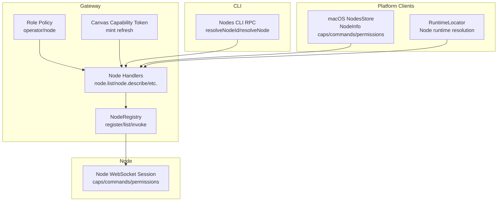
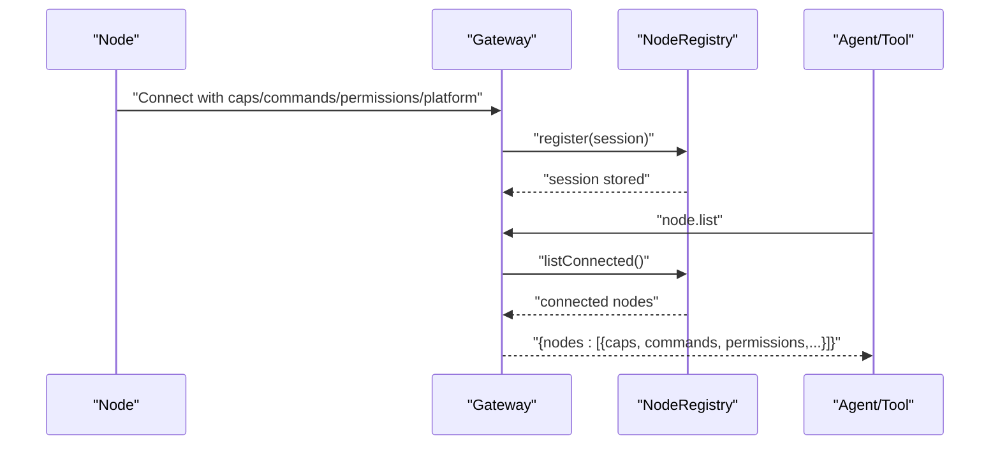
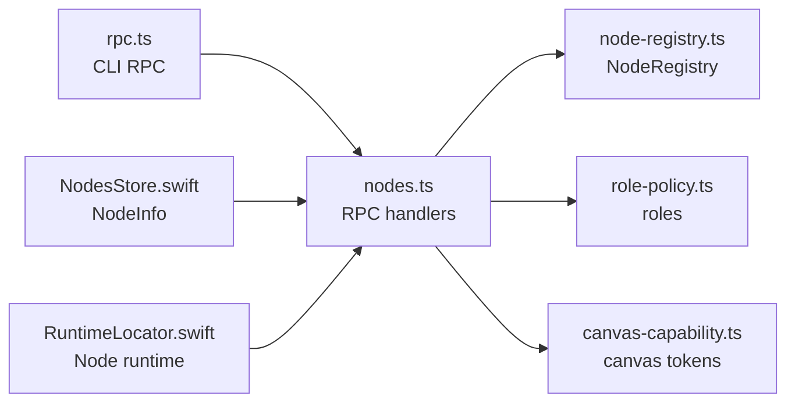
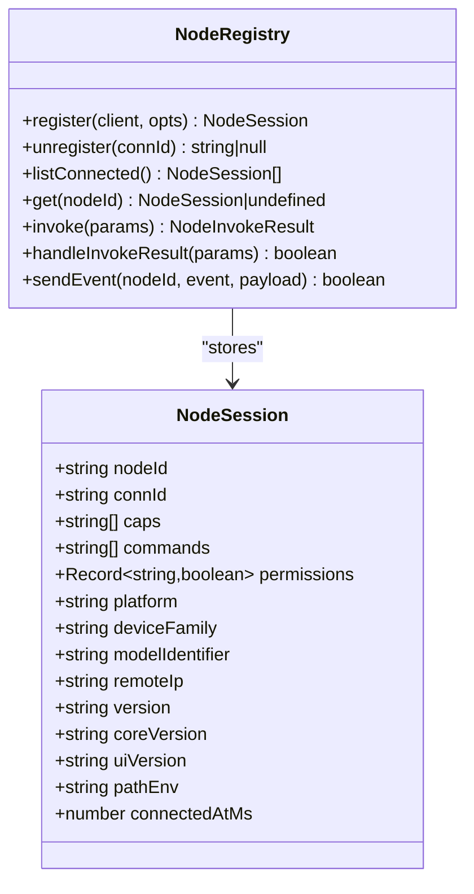
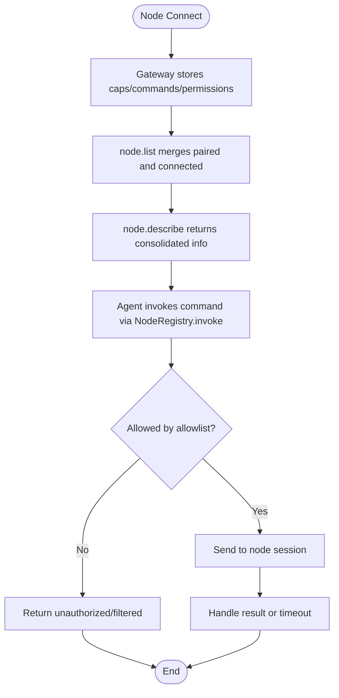

# Node Types and Capabilities

<cite>
**Referenced Files in This Document**
- [nodes.ts](file://src/gateway/server-methods/nodes.ts)
- [node-registry.ts](file://src/gateway/node-registry.ts)
- [role-policy.ts](file://src/gateway/role-policy.ts)
- [canvas-capability.ts](file://src/gateway/canvas-capability.ts)
- [nodes.ts](file://src/gateway/server-methods/nodes.ts)
- [RuntimeLocator.swift](file://apps/macos/Sources/OpenClaw/RuntimeLocator.swift)
- [NodesStore.swift](file://apps/macos/Sources/OpenClaw/NodesStore.swift)
- [rpc.ts](file://src/cli/nodes-cli/rpc.ts)
- [nodes-camera.d.ts](file://dist/plugin-sdk/cli/nodes-camera.d.ts)
- [nodes-canvas.d.ts](file://dist/plugin-sdk/cli/nodes-canvas.d.ts)
- [nodes-run.d.ts](file://dist/plugin-sdk/cli/nodes-run.d.ts)
- [nodes-screen.d.ts](file://dist/plugin-sdk/cli/nodes-screen.d.ts)
- [nodes-tool.d.ts](file://dist/plugin-sdk/agents/tools/nodes-tool.d.ts)
- [nodes-utils.d.ts](file://dist/plugin-sdk/agents/tools/nodes-utils.d.ts)
- [node-shell.d.ts](file://dist/plugin-sdk/infra/node-shell.d.ts)
- [node-list-parse.d.ts](file://dist/plugin-sdk/shared/node-list-parse.d.ts)
- [node-list-types.d.ts](file://dist/plugin-sdk/shared/node-list-types.d.ts)
- [node-match.d.ts](file://dist/plugin-sdk/shared/node-match.d.ts)
- [node-registry.d.ts](file://dist/plugin-sdk/gateway/node-registry.d.ts)
- [schema/nodes.d.ts](file://dist/plugin-sdk/gateway/protocol/schema/nodes.d.ts)
- [nodes.canvas-capability-refresh.test.ts](file://src/gateway/server-methods/nodes.canvas-capability-refresh.test.ts)
</cite>

## Table of Contents
1. [Introduction](#introduction)
2. [Project Structure](#project-structure)
3. [Core Components](#core-components)
4. [Architecture Overview](#architecture-overview)
5. [Detailed Component Analysis](#detailed-component-analysis)
6. [Dependency Analysis](#dependency-analysis)
7. [Performance Considerations](#performance-considerations)
8. [Troubleshooting Guide](#troubleshooting-guide)
9. [Conclusion](#conclusion)
10. [Appendices](#appendices)

## Introduction
This document explains node types and capabilities in the system, focusing on how nodes advertise themselves, how capabilities and permissions are modeled, and how agents and tools interact with nodes. It covers:
- Device nodes (iOS/Android/macOS) and compute nodes
- Capability advertisement and command surfaces
- Permission systems and role-based access
- Node registration, capability negotiation, and security implications
- Practical examples of capability registration, permission mapping, and command exposure
- Classification criteria, capability inheritance, and platform-specific behaviors
- Relationship between node capabilities and agent tool execution

## Project Structure
The node system spans gateway RPC handlers, a node registry, role policies, and platform-side clients and CLI utilities. The diagram below shows the primary building blocks involved in node lifecycle and capability exposure.

**Diagram sources**
- [node-registry.ts:38-210](file://src/gateway/node-registry.ts#L38-L210)
- [nodes.ts:493-800](file://src/gateway/server-methods/nodes.ts#L493-L800)
- [role-policy.ts:1-24](file://src/gateway/role-policy.ts#L1-L24)
- [canvas-capability.ts](file://src/gateway/canvas-capability.ts)
- [rpc.ts:75-96](file://src/cli/nodes-cli/rpc.ts#L75-L96)
- [NodesStore.swift:5-37](file://apps/macos/Sources/OpenClaw/NodesStore.swift#L5-L37)
- [RuntimeLocator.swift:55-63](file://apps/macos/Sources/OpenClaw/RuntimeLocator.swift#L55-L63)

**Section sources**
- [node-registry.ts:38-210](file://src/gateway/node-registry.ts#L38-L210)
- [nodes.ts:493-800](file://src/gateway/server-methods/nodes.ts#L493-L800)
- [role-policy.ts:1-24](file://src/gateway/role-policy.ts#L1-L24)
- [canvas-capability.ts](file://src/gateway/canvas-capability.ts)
- [rpc.ts:75-96](file://src/cli/nodes-cli/rpc.ts#L75-L96)
- [NodesStore.swift:5-37](file://apps/macos/Sources/OpenClaw/NodesStore.swift#L5-L37)
- [RuntimeLocator.swift:55-63](file://apps/macos/Sources/OpenClaw/RuntimeLocator.swift#L55-L63)

## Core Components
- NodeRegistry: Manages connected node sessions, exposes capabilities and commands, and handles invoke requests and responses.
- Node Handlers: Provide RPC methods for pairing, listing, describing nodes, and refreshing canvas capabilities.
- Role Policy: Defines roles (operator, node) and authorizes methods accordingly.
- Canvas Capability: Generates scoped tokens for canvas-related operations.
- CLI RPC: Resolves node identifiers and queries pairing lists.
- macOS Platform Client: Displays node info including caps, commands, and permissions.

Key responsibilities:
- Registration: Nodes send connect messages with caps, commands, permissions, and platform metadata; Gateway stores them in NodeRegistry.
- Exposure: node.list and node.describe merge paired and connected views, deduplicate and sort capabilities and commands.
- Invocation: Gateway invokes commands on nodes via registered sessions and tracks pending invocations with timeouts.
- Authorization: Methods gated by roles; node role is required for node-scoped methods.

**Section sources**
- [node-registry.ts:38-210](file://src/gateway/node-registry.ts#L38-L210)
- [nodes.ts:493-800](file://src/gateway/server-methods/nodes.ts#L493-L800)
- [role-policy.ts:1-24](file://src/gateway/role-policy.ts#L1-L24)
- [canvas-capability.ts](file://src/gateway/canvas-capability.ts)
- [rpc.ts:75-96](file://src/cli/nodes-cli/rpc.ts#L75-L96)
- [NodesStore.swift:5-37](file://apps/macos/Sources/OpenClaw/NodesStore.swift#L5-L37)

## Architecture Overview
The following sequence illustrates how a node registers, how capabilities are exposed, and how agents can invoke commands.

**Diagram sources**
- [node-registry.ts:43-79](file://src/gateway/node-registry.ts#L43-L79)
- [nodes.ts:645-724](file://src/gateway/server-methods/nodes.ts#L645-L724)

**Section sources**
- [node-registry.ts:38-210](file://src/gateway/node-registry.ts#L38-L210)
- [nodes.ts:645-724](file://src/gateway/server-methods/nodes.ts#L645-L724)

## Detailed Component Analysis

### Node Types and Classification
- Device nodes: Represented by platform metadata (e.g., iOS/Android/macOS) and device family/model identifiers. They declare capabilities and commands during connect and may expose platform-specific features (camera, screen, canvas).
- Compute nodes: General-purpose nodes that can expose capabilities and commands for system tasks and tool execution.
- Specialized nodes: Nodes that expose domain-specific capabilities (e.g., canvas, media, run) and may require scoped tokens for secure access.

Classification criteria:
- Role-based: A node entry is recognized by role "node" or presence in roles array.
- Metadata: Platform, device family, model identifier, and versions inform capability inheritance and platform-specific restrictions.

Practical example references:
- Node role detection and node list filtering by role.
- Platform-specific command restrictions and foreground/background availability handling.

**Section sources**
- [nodes.ts:132-140](file://src/gateway/server-methods/nodes.ts#L132-L140)
- [nodes.ts:654-706](file://src/gateway/server-methods/nodes.ts#L654-L706)

### Capability Advertisement and Command Surfaces
Capabilities and commands are advertised by nodes during connect and surfaced via:
- node.list: Merges paired and connected node views, deduplicates and sorts caps and commands.
- node.describe: Returns detailed node info including caps, commands, permissions, and connectivity status.

Capability inheritance:
- Connected sessions override or augment paired entries; both contribute to the final advertised set.

Command surfaces:
- Declared commands are validated against allowlists and platform/device family rules.
- Some commands are restricted on iOS/iPadOS when the app is in the background.

**Section sources**
- [nodes.ts:645-724](file://src/gateway/server-methods/nodes.ts#L645-L724)
- [nodes.ts:726-779](file://src/gateway/server-methods/nodes.ts#L726-L779)

### Permission Systems and Role-Based Access
Roles:
- operator: Authorized for operator-scoped methods.
- node: Authorized for node-scoped methods.

Authorization enforcement:
- Methods are checked against role policy; node role is required for node-scoped methods.

Practical example references:
- Role parsing and method authorization checks.

**Section sources**
- [role-policy.ts:1-24](file://src/gateway/role-policy.ts#L1-L24)

### Node Registration and Capability Negotiation
Registration flow:
- Node connects with caps, commands, permissions, and platform metadata.
- Gateway registers the session and stores capabilities and commands.
- node.list and node.describe reflect negotiated capabilities and commands.

Negotiation:
- Declared commands are filtered by allowlists and platform/device family rules.
- Pending actions are queued and later allowed based on current declarations and allowlists.

Security implications:
- Only declared capabilities and commands are exposed; unlisted items remain hidden.
- Permissions can gate sensitive operations; platform restrictions prevent unsafe background operations.

**Section sources**
- [node-registry.ts:43-79](file://src/gateway/node-registry.ts#L43-L79)
- [nodes.ts:222-252](file://src/gateway/server-methods/nodes.ts#L222-L252)

### Platform-Specific Capabilities and Restrictions
- iOS/iPadOS foreground-restricted commands: Certain commands (canvas, camera, screen, talk) are restricted when the app is in the background; errors are handled by queuing pending actions.
- Background availability errors are detected and actions are queued until conditions permit.

Practical example references:
- Foreground restriction checks and background availability error detection.

**Section sources**
- [nodes.ts:146-176](file://src/gateway/server-methods/nodes.ts#L146-L176)

### Canvas Capability Tokens
Canvas capability tokens enable scoped access to canvas operations. The gateway can mint and refresh tokens for a given session’s canvas host URL.

Practical example references:
- Canvas capability refresh handler and tests validating token minting and TTL.

**Section sources**
- [nodes.ts:780-800](file://src/gateway/server-methods/nodes.ts#L780-L800)
- [canvas-capability.ts](file://src/gateway/canvas-capability.ts)
- [nodes.canvas-capability-refresh.test.ts](file://src/gateway/server-methods/nodes.canvas-capability-refresh.test.ts)

### Relationship Between Node Capabilities and Agent Tool Execution
Agents and tools can:
- List nodes and inspect caps/commands/permissions.
- Invoke commands on nodes using the node registry’s invoke mechanism.
- Use platform SDKs and CLI utilities to resolve nodes and manage operations.

Examples of capability surfaces:
- Camera/screen/canvas/run tools exposed via plugin SDK types.
- Node shell and node registry types support tooling integration.

**Section sources**
- [node-registry.ts:107-155](file://src/gateway/node-registry.ts#L107-L155)
- [nodes-tool.d.ts](file://dist/plugin-sdk/agents/tools/nodes-tool.d.ts)
- [nodes-utils.d.ts](file://dist/plugin-sdk/agents/tools/nodes-utils.d.ts)
- [nodes-camera.d.ts](file://dist/plugin-sdk/cli/nodes-camera.d.ts)
- [nodes-canvas.d.ts](file://dist/plugin-sdk/cli/nodes-canvas.d.ts)
- [nodes-run.d.ts](file://dist/plugin-sdk/cli/nodes-run.d.ts)
- [nodes-screen.d.ts](file://dist/plugin-sdk/cli/nodes-screen.d.ts)
- [node-shell.d.ts](file://dist/plugin-sdk/infra/node-shell.d.ts)
- [node-registry.d.ts](file://dist/plugin-sdk/gateway/node-registry.d.ts)
- [schema/nodes.d.ts](file://dist/plugin-sdk/gateway/protocol/schema/nodes.d.ts)

### Practical Examples

#### Example 1: Capability Registration and Exposure
- A node connects with caps and commands.
- Gateway merges paired and connected views and returns sorted caps/commands in node.list and node.describe.

References:
- [nodes.ts:645-724](file://src/gateway/server-methods/nodes.ts#L645-L724)

#### Example 2: Permission Mapping and Command Exposure
- Node permissions are stored and returned in node.describe.
- Agents/tools can filter commands based on permissions and platform/device family allowlists.

References:
- [node-registry.ts:50-73](file://src/gateway/node-registry.ts#L50-L73)
- [nodes.ts:222-252](file://src/gateway/server-methods/nodes.ts#L222-L252)

#### Example 3: Command Surface and Platform Restrictions
- Foreground-restricted commands on iOS/iPadOS are queued when background unavailable.
- Allowlists and declared commands govern which commands are permitted.

References:
- [nodes.ts:146-176](file://src/gateway/server-methods/nodes.ts#L146-L176)
- [nodes.ts:222-252](file://src/gateway/server-methods/nodes.ts#L222-L252)

#### Example 4: Canvas Capability Token Refresh
- Gateway mints a scoped token for canvas operations and attaches expiration.

References:
- [nodes.ts:780-800](file://src/gateway/server-methods/nodes.ts#L780-L800)
- [canvas-capability.ts](file://src/gateway/canvas-capability.ts)

#### Example 5: Node Resolution and Pairing Integration
- CLI resolves node IDs by querying node.list or node.pair.list fallback.
- macOS client displays node info including caps, commands, and permissions.

References:
- [rpc.ts:75-96](file://src/cli/nodes-cli/rpc.ts#L75-L96)
- [NodesStore.swift:5-37](file://apps/macos/Sources/OpenClaw/NodesStore.swift#L5-L37)

## Dependency Analysis
The following diagram shows key dependencies among node-related components.

**Diagram sources**
- [nodes.ts:493-800](file://src/gateway/server-methods/nodes.ts#L493-L800)
- [node-registry.ts:38-210](file://src/gateway/node-registry.ts#L38-L210)
- [role-policy.ts:1-24](file://src/gateway/role-policy.ts#L1-L24)
- [canvas-capability.ts](file://src/gateway/canvas-capability.ts)
- [rpc.ts:75-96](file://src/cli/nodes-cli/rpc.ts#L75-L96)
- [NodesStore.swift:5-37](file://apps/macos/Sources/OpenClaw/NodesStore.swift#L5-L37)
- [RuntimeLocator.swift:55-63](file://apps/macos/Sources/OpenClaw/RuntimeLocator.swift#L55-L63)

**Section sources**
- [nodes.ts:493-800](file://src/gateway/server-methods/nodes.ts#L493-L800)
- [node-registry.ts:38-210](file://src/gateway/node-registry.ts#L38-L210)
- [role-policy.ts:1-24](file://src/gateway/role-policy.ts#L1-L24)
- [canvas-capability.ts](file://src/gateway/canvas-capability.ts)
- [rpc.ts:75-96](file://src/cli/nodes-cli/rpc.ts#L75-L96)
- [NodesStore.swift:5-37](file://apps/macos/Sources/OpenClaw/NodesStore.swift#L5-L37)
- [RuntimeLocator.swift:55-63](file://apps/macos/Sources/OpenClaw/RuntimeLocator.swift#L55-L63)

## Performance Considerations
- Sorting and deduplication: node.list and node.describe sort and deduplicate caps/commands; keep lists concise to minimize overhead.
- Pending action queue: Queued actions are pruned by TTL and capped per node; tune thresholds based on workload.
- Wake and nudge throttling: APNs wake and nudge attempts are throttled to reduce noise and resource usage.
- Invoke timeouts: Pending invokes are cleaned up after timeout; choose appropriate timeouts for command latency.

[No sources needed since this section provides general guidance]

## Troubleshooting Guide
Common issues and diagnostics:
- Unknown node ID: node.describe returns invalid request when node is neither paired nor connected.
- Background unavailable on iOS/iPadOS: Foreground-restricted commands may fail with background-unavailable errors; actions are queued and retried.
- Canvas host unavailable: node.canvas.capability.refresh requires a valid canvas host URL; otherwise returns UNAVAILABLE.
- Role mismatch: Methods gated by roles; ensure operator vs node role usage aligns with intended access.

**Section sources**
- [nodes.ts:747-749](file://src/gateway/server-methods/nodes.ts#L747-L749)
- [nodes.ts:169-176](file://src/gateway/server-methods/nodes.ts#L169-L176)
- [nodes.ts:790-796](file://src/gateway/server-methods/nodes.ts#L790-L796)
- [role-policy.ts:18-23](file://src/gateway/role-policy.ts#L18-L23)

## Conclusion
The node system provides a robust framework for device and compute nodes to advertise capabilities, expose commands, and negotiate permissions securely. Roles and platform-aware policies ensure appropriate access and safety. Agents and tools integrate via CLI, SDKs, and gateway RPCs to discover nodes, inspect capabilities, and invoke commands with confidence.

[No sources needed since this section summarizes without analyzing specific files]

## Appendices

### Appendix A: Node Data Model

**Diagram sources**
- [node-registry.ts:4-21](file://src/gateway/node-registry.ts#L4-L21)
- [node-registry.ts:38-210](file://src/gateway/node-registry.ts#L38-L210)

**Section sources**
- [node-registry.ts:4-21](file://src/gateway/node-registry.ts#L4-L21)
- [node-registry.ts:38-210](file://src/gateway/node-registry.ts#L38-L210)

### Appendix B: Capability Negotiation Flow

**Diagram sources**
- [nodes.ts:645-724](file://src/gateway/server-methods/nodes.ts#L645-L724)
- [node-registry.ts:107-155](file://src/gateway/node-registry.ts#L107-L155)

**Section sources**
- [nodes.ts:645-724](file://src/gateway/server-methods/nodes.ts#L645-L724)
- [node-registry.ts:107-155](file://src/gateway/node-registry.ts#L107-L155)