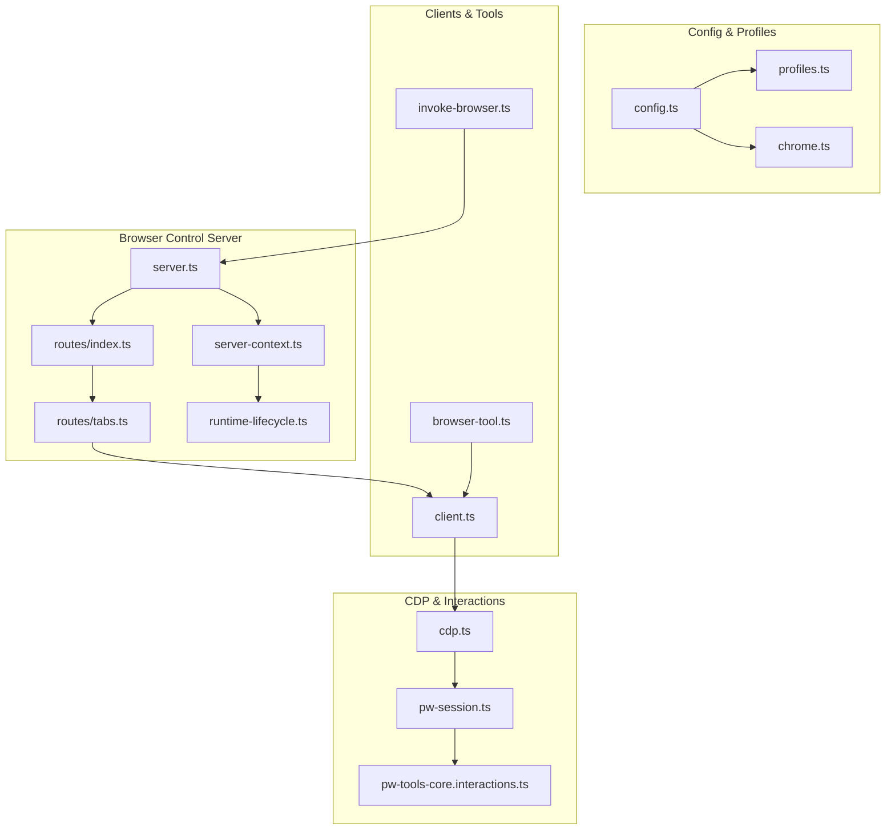
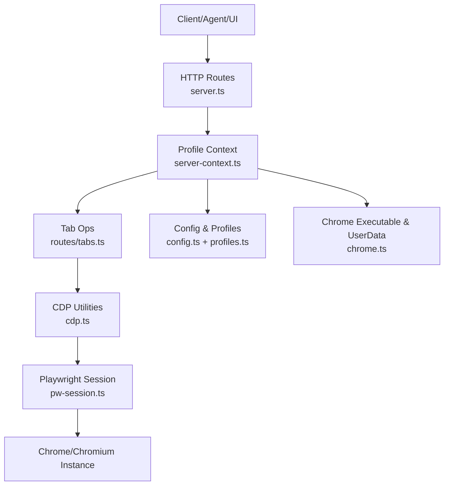
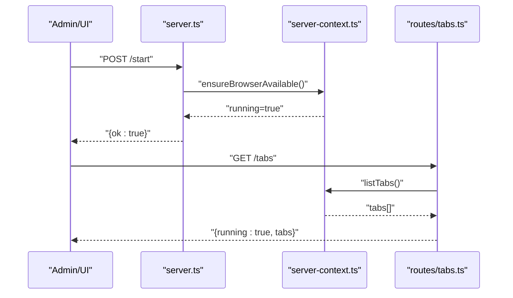
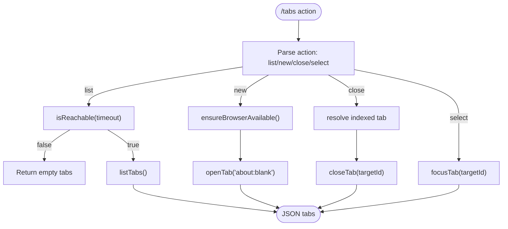
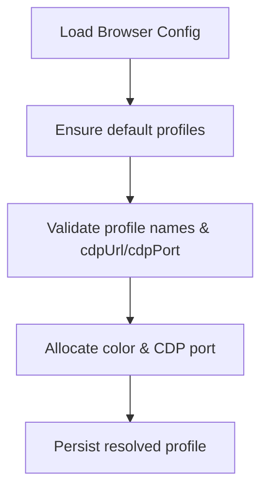
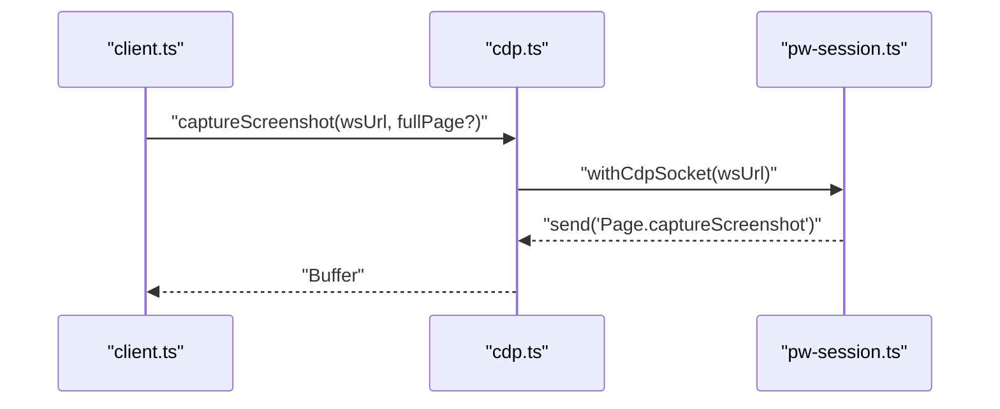
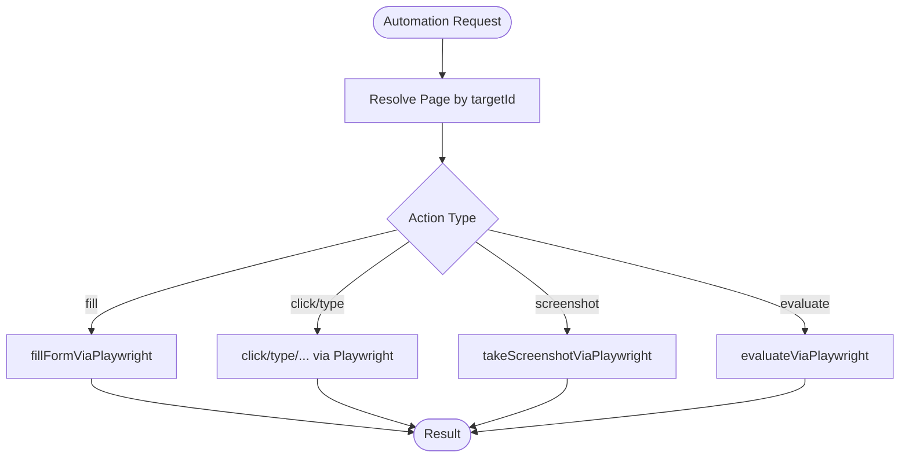
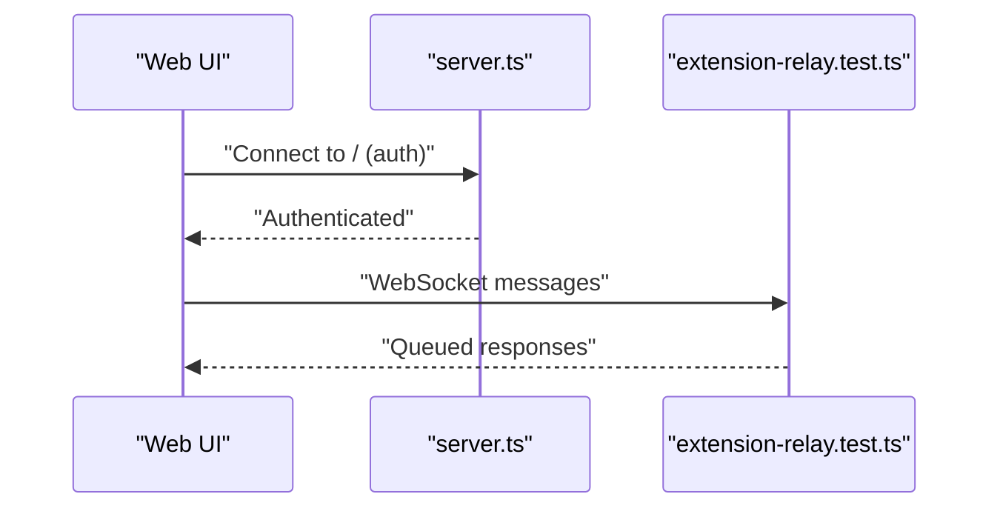
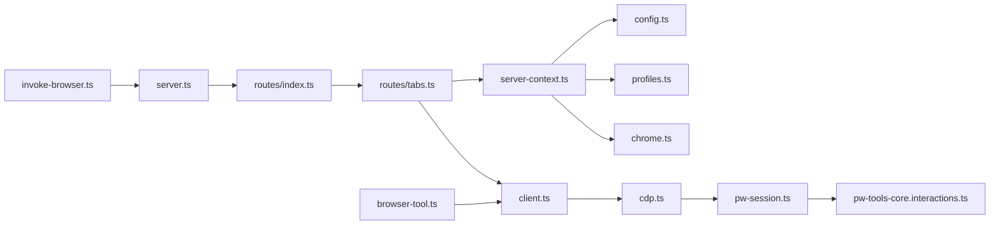

# Browser Automation

<cite>
**Referenced Files in This Document**
- [server.ts](file://src/browser/server.ts)
- [routes/index.ts](file://src/browser/routes/index.ts)
- [routes/tabs.ts](file://src/browser/routes/tabs.ts)
- [server-context.ts](file://src/browser/server-context.ts)
- [runtime-lifecycle.ts](file://src/browser/runtime-lifecycle.ts)
- [config.ts](file://src/browser/config.ts)
- [profiles.ts](file://src/browser/profiles.ts)
- [chrome.ts](file://src/browser/chrome.ts)
- [cdp.ts](file://src/browser/cdp.ts)
- [pw-session.ts](file://src/browser/pw-session.ts)
- [pw-tools-core.interactions.ts](file://src/browser/pw-tools-core.interactions.ts)
- [client.ts](file://src/browser/client.ts)
- [browser-tool.ts](file://src/agents/tools/browser-tool.ts)
- [invoke-browser.ts](file://src/node-host/invoke-browser.ts)
- [extension-relay.test.ts](file://src/browser/extension-relay.test.ts)
</cite>

## Table of Contents
1. [Introduction](#introduction)
2. [Project Structure](#project-structure)
3. [Core Components](#core-components)
4. [Architecture Overview](#architecture-overview)
5. [Detailed Component Analysis](#detailed-component-analysis)
6. [Dependency Analysis](#dependency-analysis)
7. [Performance Considerations](#performance-considerations)
8. [Troubleshooting Guide](#troubleshooting-guide)
9. [Conclusion](#conclusion)
10. [Appendices](#appendices)

## Introduction
This document explains OpenClaw’s browser automation subsystem: how it manages Chrome/Chromium instances, integrates with the Chrome DevTools Protocol (CDP), and orchestrates automated browsing workflows. It covers the browser control server, tab management, profile handling, and automation features such as navigation, form filling, screenshots, and element interactions. It also addresses permissions, security, cross-platform compatibility, and the relationship between browser automation and the web interface, including WebSocket connections and real-time updates. Practical setup, configuration, and usage patterns are included, along with guidance on browser extension integration, proxy configuration, and performance optimization.

## Project Structure
The browser automation subsystem is organized around:
- A browser control HTTP server exposing REST endpoints for lifecycle and tab operations
- Route handlers for basic operations and tab management
- A Playwright-based session manager for CDP connectivity and page interactions
- Configuration and profile management for local and remote browser instances
- Client utilities for programmatic automation and agent tooling

**Diagram sources**
- [server.ts:1-100](file://src/browser/server.ts#L1-L100)
- [routes/index.ts:1-12](file://src/browser/routes/index.ts#L1-L12)
- [routes/tabs.ts:1-222](file://src/browser/routes/tabs.ts#L1-L222)
- [server-context.ts:1-259](file://src/browser/server-context.ts#L1-L259)
- [runtime-lifecycle.ts:1-61](file://src/browser/runtime-lifecycle.ts#L1-L61)
- [config.ts:1-372](file://src/browser/config.ts#L1-L372)
- [profiles.ts:1-114](file://src/browser/profiles.ts#L1-L114)
- [chrome.ts:44-86](file://src/browser/chrome.ts#L44-L86)
- [cdp.ts:1-486](file://src/browser/cdp.ts#L1-L486)
- [pw-session.ts:1-800](file://src/browser/pw-session.ts#L1-L800)
- [pw-tools-core.interactions.ts:1-800](file://src/browser/pw-tools-core.interactions.ts#L1-L800)
- [client.ts:225-283](file://src/browser/client.ts#L225-L283)
- [browser-tool.ts:384-430](file://src/agents/tools/browser-tool.ts#L384-L430)
- [invoke-browser.ts:210-237](file://src/node-host/invoke-browser.ts#L210-L237)

**Section sources**
- [server.ts:1-100](file://src/browser/server.ts#L1-L100)
- [routes/index.ts:1-12](file://src/browser/routes/index.ts#L1-L12)
- [routes/tabs.ts:1-222](file://src/browser/routes/tabs.ts#L1-L222)
- [server-context.ts:1-259](file://src/browser/server-context.ts#L1-L259)
- [runtime-lifecycle.ts:1-61](file://src/browser/runtime-lifecycle.ts#L1-L61)
- [config.ts:1-372](file://src/browser/config.ts#L1-L372)
- [profiles.ts:1-114](file://src/browser/profiles.ts#L1-L114)
- [chrome.ts:44-86](file://src/browser/chrome.ts#L44-L86)
- [cdp.ts:1-486](file://src/browser/cdp.ts#L1-L486)
- [pw-session.ts:1-800](file://src/browser/pw-session.ts#L1-L800)
- [pw-tools-core.interactions.ts:1-800](file://src/browser/pw-tools-core.interactions.ts#L1-L800)
- [client.ts:225-283](file://src/browser/client.ts#L225-L283)
- [browser-tool.ts:384-430](file://src/agents/tools/browser-tool.ts#L384-L430)
- [invoke-browser.ts:210-237](file://src/node-host/invoke-browser.ts#L210-L237)

## Core Components
- Browser control server: Starts/stops the HTTP server, installs middleware, registers routes, and manages runtime state.
- Route handlers: Provide endpoints for status, starting/stopping, listing profiles, and tab operations (list, open, focus, close).
- Server context: Encapsulates profile-scoped operations, availability checks, and tab management.
- Playwright CDP session: Manages persistent connections, page targeting, and safe cancellation of stuck operations.
- CDP utilities: Provide screenshot capture, DOM/AX snapshots, JavaScript evaluation, and element queries.
- Configuration and profiles: Resolve browser settings, default profile selection, and port/color allocation.
- Client utilities: Offer programmatic wrappers for tab actions and agent tooling for lifecycle control.
- Node host proxy: Enforces allowed profiles and proxy configuration for controlled automation.

**Section sources**
- [server.ts:1-100](file://src/browser/server.ts#L1-L100)
- [routes/tabs.ts:1-222](file://src/browser/routes/tabs.ts#L1-L222)
- [server-context.ts:1-259](file://src/browser/server-context.ts#L1-L259)
- [pw-session.ts:1-800](file://src/browser/pw-session.ts#L1-L800)
- [cdp.ts:1-486](file://src/browser/cdp.ts#L1-L486)
- [config.ts:1-372](file://src/browser/config.ts#L1-L372)
- [profiles.ts:1-114](file://src/browser/profiles.ts#L1-L114)
- [client.ts:225-283](file://src/browser/client.ts#L225-L283)
- [browser-tool.ts:384-430](file://src/agents/tools/browser-tool.ts#L384-L430)
- [invoke-browser.ts:210-237](file://src/node-host/invoke-browser.ts#L210-L237)

## Architecture Overview
The browser automation subsystem centers on a local HTTP server that exposes REST endpoints for controlling browser instances and tabs. Clients (agents, tools, or UI) call these endpoints to manage profiles and tabs. For remote or extension-managed browsers, the system discovers WebSocket endpoints via CDP and connects via Playwright. CDP utilities enable screenshots, DOM/AX snapshots, and JavaScript evaluation. The server enforces authentication and optional proxy bypass for loopback CDP connections.

**Diagram sources**
- [server.ts:1-100](file://src/browser/server.ts#L1-L100)
- [routes/tabs.ts:1-222](file://src/browser/routes/tabs.ts#L1-L222)
- [server-context.ts:1-259](file://src/browser/server-context.ts#L1-L259)
- [cdp.ts:1-486](file://src/browser/cdp.ts#L1-L486)
- [pw-session.ts:1-800](file://src/browser/pw-session.ts#L1-L800)
- [config.ts:1-372](file://src/browser/config.ts#L1-L372)
- [profiles.ts:1-114](file://src/browser/profiles.ts#L1-L114)
- [chrome.ts:44-86](file://src/browser/chrome.ts#L44-L86)

## Detailed Component Analysis

### Browser Control Server
- Starts the HTTP server bound to localhost and a computed control port
- Installs authentication and common middleware
- Registers routes for basic and tab operations
- Creates runtime state and ensures extension relay initialization

**Diagram sources**
- [server.ts:1-100](file://src/browser/server.ts#L1-L100)
- [server-context.ts:1-259](file://src/browser/server-context.ts#L1-L259)
- [routes/tabs.ts:1-222](file://src/browser/routes/tabs.ts#L1-L222)

**Section sources**
- [server.ts:1-100](file://src/browser/server.ts#L1-L100)
- [runtime-lifecycle.ts:1-61](file://src/browser/runtime-lifecycle.ts#L1-L61)

### Tab Management
- List tabs: Checks reachability and lists tabs for a profile
- Open tab: Ensures browser availability and opens a new tab with a given URL
- Focus tab: Switches focus to a specific targetId
- Close tab: Closes a tab by targetId
- Action endpoint: Unified handler supporting list/new/close/select

**Diagram sources**
- [routes/tabs.ts:102-222](file://src/browser/routes/tabs.ts#L102-L222)
- [server-context.ts:1-259](file://src/browser/server-context.ts#L1-L259)

**Section sources**
- [routes/tabs.ts:1-222](file://src/browser/routes/tabs.ts#L1-L222)
- [server-context.ts:1-259](file://src/browser/server-context.ts#L1-L259)

### Profile Handling and Port Allocation
- Profiles are validated and normalized; default and user profiles are ensured
- Color and port allocation are managed within a reserved range
- Profiles support drivers: openclaw, extension, existing-session

**Diagram sources**
- [config.ts:200-372](file://src/browser/config.ts#L200-L372)
- [profiles.ts:1-114](file://src/browser/profiles.ts#L1-L114)

**Section sources**
- [config.ts:1-372](file://src/browser/config.ts#L1-L372)
- [profiles.ts:1-114](file://src/browser/profiles.ts#L1-L114)

### CDP Integration and Playwright Sessions
- Connects to CDP endpoints (HTTP or WebSocket), normalizes URLs, and bypasses proxies for loopback
- Maintains persistent connections and caches; supports forced disconnection for stuck operations
- Discovers WebSocket URLs via /json/version and handles wildcard binds
- Provides page targeting by targetId and robust locator resolution

**Diagram sources**
- [cdp.ts:1-486](file://src/browser/cdp.ts#L1-L486)
- [pw-session.ts:1-800](file://src/browser/pw-session.ts#L1-L800)

**Section sources**
- [cdp.ts:1-486](file://src/browser/cdp.ts#L1-L486)
- [pw-session.ts:1-800](file://src/browser/pw-session.ts#L1-L800)

### Automation Features
- Navigation: Open tabs, wait for load states, and navigate to URLs under policy
- Form filling: Fill inputs, checkboxes/radios, and submit forms
- Screenshots: Full-page and element screenshots with optional labeled overlays
- Element interactions: Click, hover, drag, select options, type, press keys, scroll into view
- JavaScript evaluation: Safe evaluation with timeouts and abort signals
- DOM/AX snapshots: Retrieve structured DOM and Accessibility Tree snapshots

**Diagram sources**
- [pw-tools-core.interactions.ts:1-800](file://src/browser/pw-tools-core.interactions.ts#L1-L800)
- [pw-session.ts:1-800](file://src/browser/pw-session.ts#L1-L800)

**Section sources**
- [pw-tools-core.interactions.ts:1-800](file://src/browser/pw-tools-core.interactions.ts#L1-L800)
- [pw-session.ts:1-800](file://src/browser/pw-session.ts#L1-L800)

### Web Interface and Real-Time Updates
- The browser control server runs on localhost with optional token/password auth
- WebSocket endpoints are discovered via CDP and normalized for containerized environments
- Extension relay tests demonstrate message queuing and error handling for WebSocket communication

**Diagram sources**
- [server.ts:1-100](file://src/browser/server.ts#L1-L100)
- [extension-relay.test.ts:46-102](file://src/browser/extension-relay.test.ts#L46-L102)

**Section sources**
- [server.ts:1-100](file://src/browser/server.ts#L1-L100)
- [extension-relay.test.ts:46-102](file://src/browser/extension-relay.test.ts#L46-L102)

### Browser Permissions, Security, and Cross-Platform Compatibility
- Authentication: Token or password-based auth is enforced during server bootstrap
- SSRF policy: Optional allowlist and private network controls for CDP navigation
- Proxy bypass: Loopback CDP connections bypass proxies to avoid interception
- Cross-platform: Executable resolution and user data dir management support Linux/macOS/Windows

**Section sources**
- [server.ts:1-100](file://src/browser/server.ts#L1-L100)
- [config.ts:101-128](file://src/browser/config.ts#L101-L128)
- [pw-session.ts:343-382](file://src/browser/pw-session.ts#L343-L382)
- [chrome.ts:44-86](file://src/browser/chrome.ts#L44-L86)

### Browser Extension Integration and Proxy Configuration
- Extension relay endpoints are detected and handled specially for page targeting
- Proxy configuration allows controlled automation via node host proxy with allowed profiles
- Node host proxy enforces allowed profiles and throws when disabled or unauthorized

**Section sources**
- [pw-session.ts:451-496](file://src/browser/pw-session.ts#L451-L496)
- [invoke-browser.ts:210-237](file://src/node-host/invoke-browser.ts#L210-L237)

### Practical Setup, Configuration, and Usage Patterns
- Start/stop browser control server from configuration
- Manage profiles and default selection
- Use client wrappers for tab actions
- Agent tooling for lifecycle control and status checks

**Section sources**
- [server.ts:1-100](file://src/browser/server.ts#L1-L100)
- [config.ts:200-372](file://src/browser/config.ts#L200-L372)
- [client.ts:225-283](file://src/browser/client.ts#L225-L283)
- [browser-tool.ts:384-430](file://src/agents/tools/browser-tool.ts#L384-L430)

## Dependency Analysis
The subsystem exhibits layered dependencies:
- server.ts depends on route registration and server context
- routes/tabs.ts depends on server-context for profile operations
- pw-session.ts depends on cdp.ts and Playwright for CDP connectivity
- cdp.ts depends on helpers for URL normalization and socket handling
- config.ts and profiles.ts provide runtime configuration and profile resolution
- client.ts and browser-tool.ts provide higher-level automation APIs

**Diagram sources**
- [server.ts:1-100](file://src/browser/server.ts#L1-L100)
- [routes/index.ts:1-12](file://src/browser/routes/index.ts#L1-L12)
- [routes/tabs.ts:1-222](file://src/browser/routes/tabs.ts#L1-L222)
- [server-context.ts:1-259](file://src/browser/server-context.ts#L1-L259)
- [config.ts:1-372](file://src/browser/config.ts#L1-L372)
- [profiles.ts:1-114](file://src/browser/profiles.ts#L1-L114)
- [chrome.ts:44-86](file://src/browser/chrome.ts#L44-L86)
- [client.ts:225-283](file://src/browser/client.ts#L225-L283)
- [cdp.ts:1-486](file://src/browser/cdp.ts#L1-L486)
- [pw-session.ts:1-800](file://src/browser/pw-session.ts#L1-L800)
- [pw-tools-core.interactions.ts:1-800](file://src/browser/pw-tools-core.interactions.ts#L1-L800)
- [browser-tool.ts:384-430](file://src/agents/tools/browser-tool.ts#L384-L430)
- [invoke-browser.ts:210-237](file://src/node-host/invoke-browser.ts#L210-L237)

**Section sources**
- [server.ts:1-100](file://src/browser/server.ts#L1-L100)
- [routes/index.ts:1-12](file://src/browser/routes/index.ts#L1-L12)
- [routes/tabs.ts:1-222](file://src/browser/routes/tabs.ts#L1-L222)
- [server-context.ts:1-259](file://src/browser/server-context.ts#L1-L259)
- [config.ts:1-372](file://src/browser/config.ts#L1-L372)
- [profiles.ts:1-114](file://src/browser/profiles.ts#L1-L114)
- [chrome.ts:44-86](file://src/browser/chrome.ts#L44-L86)
- [client.ts:225-283](file://src/browser/client.ts#L225-L283)
- [cdp.ts:1-486](file://src/browser/cdp.ts#L1-L486)
- [pw-session.ts:1-800](file://src/browser/pw-session.ts#L1-L800)
- [pw-tools-core.interactions.ts:1-800](file://src/browser/pw-tools-core.interactions.ts#L1-L800)
- [browser-tool.ts:384-430](file://src/agents/tools/browser-tool.ts#L384-L430)
- [invoke-browser.ts:210-237](file://src/node-host/invoke-browser.ts#L210-L237)

## Performance Considerations
- Command serialization: Playwright serializes CDP commands per page; long-running operations block subsequent commands. The system includes best-effort cancellation via forced disconnection and execution termination.
- Timeouts: Evaluate operations are bounded to prevent indefinite blocking; timeouts are normalized and injected into browser context.
- Caching: Persistent Playwright connections and role-refs caching improve stability and reduce reconnect overhead.
- Retry/backoff: CDP connect attempts include retries with increasing delays, with early exit for rate-limit scenarios.

**Section sources**
- [pw-session.ts:680-730](file://src/browser/pw-session.ts#L680-L730)
- [pw-session.ts:343-382](file://src/browser/pw-session.ts#L343-L382)
- [pw-tools-core.interactions.ts:289-417](file://src/browser/pw-tools-core.interactions.ts#L289-L417)

## Troubleshooting Guide
- Authentication failures: If auth bootstrap fails and no fallback is configured, the server startup aborts. Ensure token/password is configured or generated.
- CDP connect failures: The system retries with backoff and bypasses proxies for loopback endpoints. Inspect rate-limit errors and adjust retry logic accordingly.
- Tab not found: When targetId resolution fails, ensure the tab exists and the browser is reachable; use listTabs to confirm.
- Stuck operations: Use forced disconnection to terminate execution and reconnect cleanly.
- Proxy issues: For loopback CDP endpoints, proxy bypass is applied automatically; verify endpoint normalization and WebSocket URL discovery.

**Section sources**
- [server.ts:31-51](file://src/browser/server.ts#L31-L51)
- [pw-session.ts:343-382](file://src/browser/pw-session.ts#L343-L382)
- [pw-session.ts:498-534](file://src/browser/pw-session.ts#L498-L534)
- [pw-session.ts:700-730](file://src/browser/pw-session.ts#L700-L730)

## Conclusion
OpenClaw’s browser automation subsystem provides a robust, secure, and extensible framework for managing Chrome/Chromium instances and automating browsing workflows. Through a local HTTP control plane, CDP integration, and Playwright-based interactions, it supports tab lifecycle management, element interactions, screenshots, and safe JavaScript evaluation. With profile-driven configuration, authentication, and proxy-aware connectivity, it scales across platforms and integrates with extensions and agents.

## Appendices

### API Reference: Tab Operations
- GET /tabs: List tabs for a profile
- POST /tabs/open: Open a new tab with a URL
- POST /tabs/focus: Focus a tab by targetId
- DELETE /tabs/:targetId: Close a tab by targetId
- POST /tabs/action: Unified action endpoint supporting list/new/close/select

**Section sources**
- [routes/tabs.ts:102-222](file://src/browser/routes/tabs.ts#L102-L222)

### Client Wrappers
- browserOpenTab, browserFocusTab, browserCloseTab, browserTabAction

**Section sources**
- [client.ts:225-283](file://src/browser/client.ts#L225-L283)

### Agent Tooling
- Lifecycle control: status/start/stop/profiles
- Proxy-aware invocation for controlled automation

**Section sources**
- [browser-tool.ts:384-430](file://src/agents/tools/browser-tool.ts#L384-L430)
- [invoke-browser.ts:210-237](file://src/node-host/invoke-browser.ts#L210-L237)